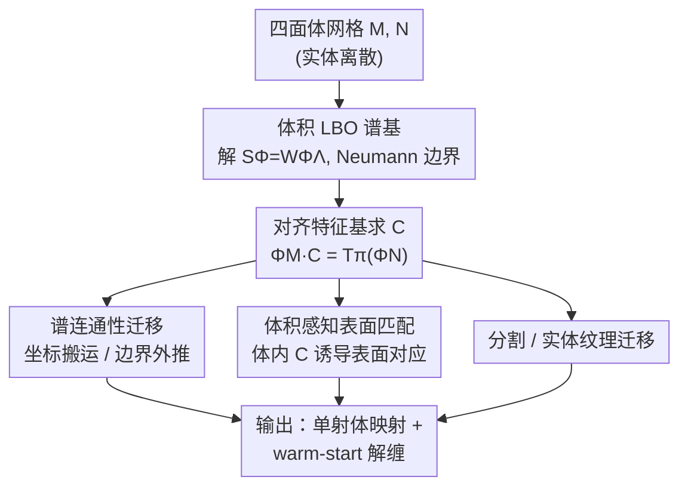

# Volumetric Functional Maps

**会议**: CVPR 2026  
**论文**: [CVF Open Access](https://openaccess.thecvf.com/content/CVPR2026/html/Maggioli_Volumetric_Functional_Maps_CVPR_2026_paper.html)  
**代码**: https://github.com/filthynobleman/vol-fmaps  
**领域**: 3D视觉  
**关键词**: 函数映射, 体积对应, 拉普拉斯谱, 四面体网格, 几何处理

## 一句话总结
本文首次把表面几何处理里成熟的 functional maps（函数映射）框架搬到 3D 体积（四面体网格）上：用体积拉普拉斯算子的特征函数构造一个与离散化无关的函数空间，从而在体内部建立稠密对应，支持连通性迁移、分割迁移、实体纹理等应用，并且反过来还能让经典的表面形状匹配更准。

## 研究背景与动机
**领域现状**：在曲面（三角网格）上建立形状之间的对应有两条成熟路线。一条是 piece-wise linear（分片线性）映射，靠逐顶点一一对应 + 重心插值；另一条是 spectral / functional maps，把"点到点对应"这个难优化的离散问题，转化为"两个函数空间之间的线性映射"——用 Laplace-Beltrami 算子（LBO）的特征函数当基，对应关系被压缩成一个 $k\times k$ 的小矩阵 $C$。这两条路线在曲面上都已经很成熟，甚至进了商业工具。

**现有痛点**：可是一旦从"曲面"换到"体积"（即整个实心 3D 物体，离散成四面体网格），问题就卡住了。体积对应在医学（把器官数字副本无创地配准到标准姿态）、网格生成、统计形状分析、工业数字孪生里都很关键，但它"基本仍是一个开放问题"。把分片线性方法抬到体积上极其困难：连构造一个到凸多面体的单射映射都被证明异常棘手，Tutte 嵌入这类曲面利器在体网格上会直接失败，现有少数"鲁棒"的体嵌入算法又依赖精确数值构造和指数级网格细分，根本不实用；退而求其次的"先粗对应再解缠（untangling）"则是病态问题，对固定连通性可能根本无解，主流算法在公开数据上报告过大量失败案例。

**核心矛盾**：分片线性路线天生绑定网格的连通性与单射约束，所以"放不大"到体积。而 functional maps 这条路线——它本不依赖逐点对应，只依赖一组函数基——却从来没人往体积上试过，它的潜力在体数据处理里"完全没被开发"。

**本文目标**：第一次把 functional maps 框架扩展到体积域，证明它不像分片线性那样会爆炸，而是**天然可扩展到体积**，给体积对应提供一个理论自洽、工程实用的平台；并验证它能撑起连通性迁移、分割迁移、实体纹理等真实应用，甚至改善曲面匹配本身。

**切入角度**：关键观察是——LBO 并不是曲面专属。它可以定义在任意维黎曼流形上，并且总有谱分解。既然如此，四面体网格的体积拉普拉斯同样有一组特征函数，它们张成的函数空间"完全不知道底层离散网格长什么样"，于是可以在密度、连通性都不同的两个实体网格之间建立对应。

**核心 idea**：用体积拉普拉斯的谱（特征函数）当函数基，把曲面 functional maps 的整套机制（描述子对齐、ZoomOut 精化、替换基等）原封不动地"移植"到体积上。

## 方法详解

### 整体框架
方法的主线非常清楚：输入是把实体离散成的**四面体网格** $\mathcal{M}=(V_\mathcal{M}, T_\mathcal{M})$（外表面是它的三角面 $\partial\mathcal{M}$）；先在这个体网格上离散体积 LBO、解广义特征问题拿到一组体积特征基 $\Phi_\mathcal{M}$；两个形状各有一组基后，就求一个小矩阵 $C$ 把它们对齐，这个 $C$ 就是体积 functional map；最后用 $C$ 把各种信号（坐标、连通性、分割标签、纹理）从一个体里搬到另一个体里，并通过最近邻搜索还原逐点对应。整篇论文围绕一个 $C$ 展开三类应用：连通性迁移、体积感知的曲面匹配、分割/纹理迁移。

### 关键设计

**1. 体积 LBO 谱基：把"对应"压成一个与网格无关的小矩阵**

痛点是分片线性方法被连通性和单射约束绑死，放不大到体积。本文绕开它：既然 LBO 在任意维流形上都有谱分解，就直接在四面体网格上用 $n$ 维 cotangent 公式离散出刚度矩阵 $S$ 和质量矩阵 $W$，解广义特征问题 $S\Phi = W\Phi\Lambda$ 得到体积特征基 $\Phi$。有了两组基 $\Phi_\mathcal{M}, \Phi_\mathcal{N}$，任意函数 $f$ 的搬运就退化成矩阵乘法：

$$T_\pi(f) \approx \Phi_\mathcal{M}\, C\, \Phi_\mathcal{N}^{\dagger}\, f,\qquad C\in\mathbb{R}^{k\times k}$$

其中 $\dagger$ 是 Moore-Penrose 伪逆，$C$ 只有基大小那么大（截断到 $k$ 个特征函数），点对点对应再用 $\mathrm{NN}(\Phi_\mathcal{N}, \Phi_\mathcal{M}C)$ 反查。这就是 functional maps 的精髓被移植到体积：对应不再是逐顶点的离散变量，而是一个低维线性算子，自然容许两个实体网格密度、连通性完全不同。一个工程要点是：因为大多数应用要分析表面（体网格的边界）上的信息，作者**强制施加 Neumann 边界条件**，避免特征函数在表面退化为零值——这是体积场景区别于曲面的关键细节。

**2. 谱连通性迁移：用边界轨迹反解出整个体的对应**

很多应用（数字制造、医学、六面体网格生成）需要"同一套连通性、不同顶点坐标"的两个体网格。本文给出两条路把连通性从 $\mathcal{M}$ 搬到目标域。第一条是**函数式连通性迁移**：已知表面对应 $\pi:\partial\mathcal{M}\to\partial\mathcal{N}$，但体内部的对应未知。关键洞察来自控制论——在 Neumann 边界下，任意椭圆算子特征函数的"边界轨迹"（restriction to boundary）是线性无关的，所以表面上的受限基 $\Phi_{\partial\mathcal{M}}$ 存在左逆，体积 functional map 可以仅凭表面对应近似出来：

$$C \approx \Phi_{\partial\mathcal{M}}^{\dagger}\, T_\pi(\Phi_{\partial\mathcal{N}})$$

拿到 $C$ 后再用**完整谱**把 $\mathcal{N}$ 的坐标搬到 $\mathcal{M}$ 上，得到一套迁移后的连通性。第二条是**坐标的谱外推**：水密表面其实已经编码了内部体积的信息，借助 LBO 的平滑重建性质，可以只从表面坐标外推出内部坐标 $T_{\pi'}(x_\mathcal{N}) = \Phi_\mathcal{M}\Phi_{\partial\mathcal{M}}^{\dagger}T_\pi(x_{\partial\mathcal{N}})$，省掉对目标体单独做体积谱分解，因此外推版比迁移版快约 $2\times$。为更好地重建外在（extrinsic）信息，作者还把基扩成 CMH（Coordinates Manifold Harmonics，额外加 3 个编码 xyz 坐标的函数）。

**3. 体积感知的表面匹配：体内信息让曲面对应更准**

这是一个"反向红利"。直觉是：一个实心体比它的外壳携带更多局部和全局信息，所以两个四面体网格之间的 functional map 应该比两个三角网格之间的更准更稳。而前面已经说明，关联两个体积基的 $C$ 同时也关联它们在表面上的受限基。于是只需对两个表面 $\partial\mathcal{M},\partial\mathcal{N}$ 先各自四面体化得到体 $\mathcal{M},\mathcal{N}$，求体积 $C$ 满足 $\Phi_\mathcal{M}C=T_\pi(\Phi_\mathcal{N})$，再把它限制到表面 $(\Phi_\mathcal{M})_\partial C$，最后用 $\mathrm{NN}(\Phi_{\partial\mathcal{M}}C, \Phi_{\partial\mathcal{N}})$ 提取表面对应。代价是引入了内部顶点带来额外计算，但实验证明这条"绕一圈进体内再回表面"的路在所有数据集上都比纯表面 pipeline 更准。

### 一个完整示例
以"用本文 warm-start 体网格解缠"为例走一遍：给一对待对应的体网格，先用一小部分谱（如 5% 特征函数）算出体积 $C$，迁移连通性得到一个初始映射——此时还有少量翻转的四面体（5% 谱下翻转 < 5%，20% 谱下 < 1%，25% 谱时完全单射）。把这个初始猜测喂给现有解缠算法（如 Garanzha 等），替换掉惯用但在体上会失败的 Tutte 3D 嵌入初始化。在 [76] 大规模验证里 Tutte 产生的 1405 个失败案例中，换上本文的初始猜测后有 **85%** 重新得到了一一对应的单射映射，pipeline 成功率被大幅拉高。

## 实验关键数据

### 主实验：体积信息让曲面匹配更准（Tab. 2）
在 4 个数据集上，把"纯表面 functional map" 与"本文体积版"对比，报告平均测地误差（AGE Surf. vs AGE Vol.）以及本文取得更低 AGE 的配对占比（Success Rate）。Orthoprods 基下结果（节选）：

| 数据集 | AGE 表面 | AGE 体积 | 成功率 | Slowdown | 顶点比 |
|--------|----------|----------|--------|----------|--------|
| VOL | 5.82e-7 | 3.19e-7 | 60.00% | 1.92× | 1.40× |
| SHREC'19 | 1.11e-1 | 7.13e-2 | 56.42% | 2.03× | 1.59× |
| TOPKIDS | 1.17e-1 | 8.13e-2 | 64.00% | 2.51× | 2.16× |
| SHREC'20 | 1.83e-1 | 3.01e-1 | 8.24% | 1.01× | 0.80× |

结论：在 VOL / SHREC'19 / TOPKIDS 上体积版一致更准；唯独 SHREC'20（强非等距 + 拓扑变化）下 Orthoprods 反而变差，因为四面体化引入的拓扑错误会污染基——此时改用 CMH 基（拿顶点坐标当正则）可把误差压回来（CMH 下 SHREC'20 成功率 55.49%）。Slowdown 与顶点比高度相关，说明体积 pipeline 本身不慢，慢只是因为体内多了顶点。

### 连通性迁移：翻转随谱增大优雅衰减（Tab. 1）
| 方法 | 5% 特征 | 10% | 15% | 20% | 时间(s) |
|------|---------|-----|-----|-----|---------|
| Transfer (LBO) | 4.63% | 1.50% | 1.18% | 0.93% | 1127 |
| Transfer (CMH) | 4.75% | 0.84% | 0.45% | 0.34% | 1127 |
| Extrapolation (LBO) | 4.39% | 1.45% | 1.15% | 0.92% | 554 |
| Extrapolation (CMH) | 4.90% | 0.99% | 0.56% | 0.42% | 554 |

翻转四面体占比随基增大单调下降，25% 谱时达到完全单射；CMH 在相同谱预算下翻转更少（更适合迁移离散的连通性信号）；外推版耗时约为迁移版的一半。

### 关键发现
- **基的选择决定上限**：简单数据集（VOL 水密、共享连通性）下体积信息只有配上更强的 Orthoprods 基才显出优势；难数据集（拓扑噪声）下 CMH 因坐标正则更鲁棒。没有一个基通吃，要看数据的噪声类型。
- **体积 functional map 最大的实用价值是"暖启动"**：哪怕只用一小撮谱、还留着少量翻转，它也是比 Tutte 更好的解缠初值，把 SOTA 解缠算法在 1405 个原失败案例上的成功率拉到 85%。
- **慢来自顶点数而非算法**：slowdown 与表面/体积顶点比几乎线性相关，说明体积管线的额外开销主要是离散体内部所需的多余顶点，而非框架本身低效。

## 亮点与洞察
- **"换个域、整套工具链照搬"的优雅**：因为 LBO 在任意维都有谱分解，曲面 functional maps 的 ZoomOut、描述子对齐、替换基（CMH/Orthoprods）几乎零改动地迁到体积上——这说明该框架的抽象层次足够高，谁有 LBO 谁就能用。
- **边界轨迹线性无关这个论点很妙**：用控制论里"椭圆算子在 Neumann 条件下边界轨迹线性无关"来论证 $\Phi_{\partial\mathcal{M}}$ 可左逆，从而仅凭表面对应就能反解体内 $C$，把一个看似欠定的问题做实了。
- **反向红利耐人寻味**：本来是想解决体积对应，结果发现"绕进体内再回到表面"竟让经典曲面匹配更准。这提示：当能拿到体积离散时，把匹配抬到体内是一笔划算的买卖。

## 局限与展望
- **完全单射代价高**：连通性迁移要彻底无翻转，需要相当大比例的谱，计算上很快变得不可承受；如何在固定谱预算下保留更多精度是值得研究的方向。
- **更准 = 更慢，且这是内在的**：最贵的两步（特征分解 + 基对齐）随顶点数增长，体积顶点天然多，所以慢；缓解只能靠专为体积设计的可扩展谱算法。
- **缺数据集 + 缺理论**：体积形状匹配几乎没有公开数据，曲面数据集又难以高质量四面体化（大缺失、自交、非流形）；同时"体积 functional map 下哪些性质不变"还缺乏理论分析。作者明确呼吁社区发布体积谱数据集。

## 相关工作与启发
- **vs 分片线性体映射（Tutte 3D / 体嵌入 / 解缠）**：它们做逐顶点单射映射，受连通性和单射约束绑死，在体上要么不实用（指数细分）要么病态（解缠无解保证）；本文做函数空间对应，天然可扩展，且能反过来给这些解缠算法提供更好的初值。
- **vs 曲面 functional maps（FMap / ZoomOut / Orthoprods / CMH）**：本文不是替代而是"升维"——把同一套基对齐机制搬到体积上，并证明体积信息会让表面匹配更准；CMH、Orthoprods 等基增强在体积上同样有效甚至更必要。
- **vs LDDMM 等微分同胚体配准**：LDDMM 在网格状（MRI/CT）稠密体数据上成功，但微分同胚映射受限于网格结构、难以推广到灵活的四面体网格；本文的谱方法对网格离散化无关，能处理不同连通性的实体网格。

## 评分
- 新颖性: ⭐⭐⭐⭐⭐ 首次把 functional maps 框架扩展到体积域，开辟"谱体积映射"这一新方向。
- 实验充分度: ⭐⭐⭐⭐ 覆盖连通性迁移、分割迁移、实体纹理、曲面匹配多任务多基对比，但受限于缺公开体积数据，主验证集（40 对）偏小。
- 写作质量: ⭐⭐⭐⭐ 动机清晰、推导自洽，边界轨迹论证扎实；部分关键证明放在补充材料里。
- 价值: ⭐⭐⭐⭐⭐ 给医学、网格生成、数字孪生等体积对应应用提供了实用且可扩展的新平台，并开源代码。

<!-- RELATED:START -->

## 相关论文

- [\[CVPR 2026\] PackUV: Packed Gaussian UV Maps for 4D Volumetric Video](packuv_packed_gaussian_uv_maps_for_4d_volumetric_video.md)
- [\[CVPR 2025\] Denoising Functional Maps: Diffusion Models for Shape Correspondence](../../CVPR2025/3d_vision/denoising_functional_maps_diffusion_models_for_shape_correspondence.md)
- [\[CVPR 2026\] Radiance Meshes for Volumetric Reconstruction](radiance_meshes_for_volumetric_reconstruction.md)
- [\[CVPR 2026\] MozzaVID: Mozzarella Volumetric Image Dataset](mozzavid_mozzarella_volumetric_image_dataset.md)
- [\[CVPR 2026\] FunREC: Reconstructing Functional 3D Scenes from Egocentric Interaction Videos](funrec_reconstructing_functional_3d_scenes_from_egocentric_interaction_videos.md)

<!-- RELATED:END -->
