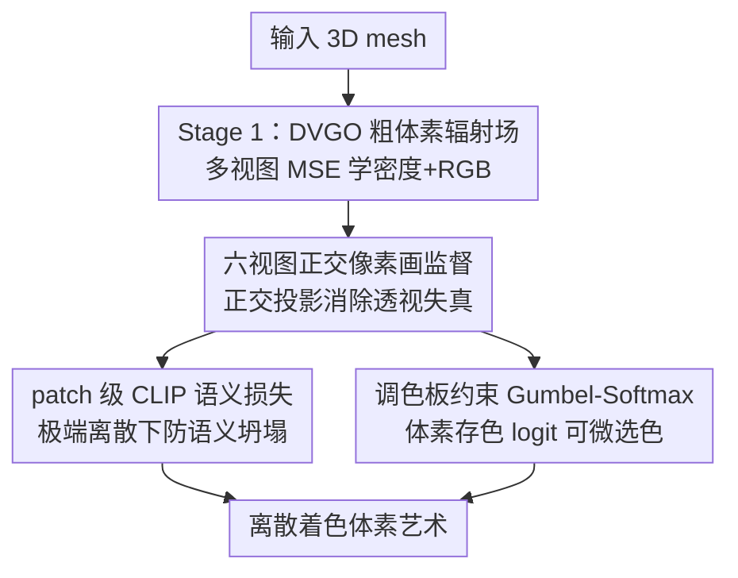

# Voxify3D: Pixel Art Meets Volumetric Rendering

**会议**: CVPR2026  
**arXiv**: [2512.07834](https://arxiv.org/abs/2512.07834)  
**代码**: [项目主页](https://yichuanh.github.io/Voxify-3D/)  
**领域**: 3D视觉  
**关键词**: 体素艺术, 体渲染, DVGO, 正交投影监督, Gumbel-Softmax 离散量化

## 一句话总结
把 3D mesh 转成"乐高/像素块"风格体素艺术：用一个可微的两阶段体素辐射场，先用 DVGO 学出粗几何与颜色，再用六视图正交渲染的像素画监督 + patch 级 CLIP 语义损失 + 调色板约束的 Gumbel-Softmax 离散颜色优化，端到端产出语义清晰、色块干净、可控抽象度（2-8 色、20×-50× 分辨率）的体素艺术（CLIP-IQA 37.12，77.90% 用户偏好）。

## 研究背景与动机
**领域现状**：体素艺术（voxel art）是游戏和数字媒体里常见的风格——极简、离散、块状。但目前从 3D mesh 自动生成高质量体素艺术几乎没有好办法：要么靠美术手工搭、要么用程序化工具（如 Blender Geometry Nodes）反复调参。2D 像素画风格化（pixel art stylization）已经做得不错，但这些技术不能直接迁移到 3D 体素。

**现有痛点**：把现成方法生搬硬套都不行。① 简单下采样会丢语义特征，脸、四肢这些关键结构直接糊掉，输出过于粗糙；② 体素 NeRF（如 DVGO）是为照片级真实渲染设计的，不是为风格化抽象；③ 神经编辑方法（IN2N、Vox-E）做不出干净离散的色块，Vox-E 体积平滑但丢了体素那种"方块感"，IN2N 在不同引导图下结果飘忽、多视图不一致；④ Blender 程序化等同于简单下采样，缺语义对齐还要手调。

**核心矛盾**：体素艺术生成同时卡在三个相互纠缠的难题上，单独拼凑现有技术解决不了。(1) **对齐**：透视投影下像素和体素位置对不上，优化时梯度模糊；(2) **语义保持**：分辨率降下来后脸部细节、肢体关节这些关键特征会"语义坍塌"，整图级的感知损失抓不住局部语义重要性；(3) **离散优化**：体素艺术要求小调色板（2-8 色），但基于梯度的方法天然输出连续值，已有量化方法要么不可微、要么调色板不可控。

**本文目标**：在一个统一可微的框架里同时解决"精确像素-体素对齐 + 极端离散下的语义保持 + 端到端离散颜色优化"，并让用户能控制抽象度（颜色数、分辨率、调色板策略）。

**核心 idea**：用**正交渲染消除透视失真**做到像素-体素逐点对齐，用 **patch 级 CLIP** 在极端离散下守住语义，用**调色板约束的 Gumbel-Softmax** 把离散选色变成可微优化——三者必须在"渲染策略 / 损失形式 / 量化时机"上精确协同，而不是简单叠加。

## 方法详解

### 整体框架
Voxify3D 输入一个 3D mesh，输出一个离散着色的体素网格（体素艺术）。整条管线分两阶段：**Stage 1 粗体素训练**用 DVGO 在多视图 MSE 监督下学出一个粗糙的体素辐射场（密度网格 + RGB 颜色网格），给后续提供稳定的几何与颜色初始化；**Stage 2 正交像素画微调**才是风格化的关键——它把体素网格从六个轴对齐方向做**正交投影**渲染，和像素画生成器产出的像素画监督对齐，同时叠加深度损失、alpha 透明度损失保几何，叠加 patch 级 CLIP 损失保语义。最后，把原本存 RGB 的颜色网格替换成**颜色 logit 网格**，对一个预先从六视图像素画提取的调色板做 **Gumbel-Softmax** 可微量化，端到端把每个体素的颜色"逼"成调色板里的离散色块。

三处必须协同：正交渲染解决"像素-体素对齐"、CLIP 解决"离散下语义不坍塌"、Gumbel-Softmax 解决"离散选色可微"，时序上颜色 logit 网格是在粗几何稳定后才引入并退火。

### 关键设计

**1. 六视图正交像素画监督：用平行投影把"像素对不上体素"这个根因掐掉**

透视投影是离散风格化的隐形杀手：透视下不同深度的体素会投影到同一像素、像素颜色无法和体素位置一一对应，优化时梯度被"摊"开，结果模糊。Voxify3D 改用**正交渲染**，从六个轴对齐视图（前后左右上下）做平行光线投射 $\mathbf{r}_i(t)=\mathbf{o}_i+t\mathbf{d}$——所有光线方向 $\mathbf{d}$ 固定且平行，每个像素 $\mathbf{p}_i$ 的光线原点 $\mathbf{o}_i$ 各不相同，于是像素到体素天然逐点对齐，没有透视畸变。六视图紧凑覆盖物体主要表面，监督信号来自像素画生成器对各视图的风格化结果 $C_{\text{pixel}}$。这里用两个基础损失约束外观和几何：像素损失 $\mathcal{L}_{\text{pixel}}=\|C(\mathbf{r})-C_{\text{pixel}}\|_2^2$ 让渲染色逼近像素画，深度损失 $\mathcal{L}_{\text{depth}}=\|D(\mathbf{r})-D_{\text{gt}}\|_1$ 让渲染深度逼近 mesh 投影深度。再加一个 alpha 损失 $\mathcal{L}_\alpha=\|\mathcal{M}_\alpha\odot\bar{\alpha}\|^2$ 抑制背景密度：$\mathcal{M}_\alpha$ 是来自像素画 alpha 通道的二值掩码（背景为 1），$\bar{\alpha}$ 是累积光线不透明度，强迫背景光线透明，避免在没有有效监督的区域长出"漂浮体素"。这是本文第一次把 2D 像素画桥接到 3D 体素优化，让离散风格的梯度能干净地流回体素网格。

**2. patch 级 CLIP 语义损失：分辨率降到 20×-50× 时还能认得出"这是谁"**

体素分辨率一降，脸部、四肢这些关键语义就容易整体坍塌；而整图级感知损失对"局部语义重要性"不敏感，抓不住这种坍塌。作者改成**在 patch 上算 CLIP 感知损失**：每次训练随机采样一半光线组成 patch，从输入 mesh 渲染图 $I_{\text{mesh}}$ 取对应 mesh patch，把渲染 patch $\hat{I}_{\text{patch}}$ 和 mesh patch $I^{\text{mesh}}_{\text{patch}}$ 各过 CLIP 图像编码器，用余弦相似度算损失 $\mathcal{L}_{\text{clip}}=1-\cos(\text{CLIP}(\hat{I}_{\text{patch}}),\ \text{CLIP}(I^{\text{mesh}}_{\text{patch}}))$。在 patch（局部）而非整图上对齐 CLIP 特征，既让风格化输出在语义上始终贴着输入 mesh，又因为只算半数光线的小 patch（实现里固定 $80\times80$）而显存友好。这正面回应了"标准感知损失在极端离散下守不住语义"的痛点。

**3. 调色板约束的 Gumbel-Softmax 离散选色：把"选一个色块"变成可微、可控的优化**

体素艺术要小调色板（2-8 色），可梯度优化天生吐连续值。Voxify3D 不再让体素回归 RGB，而是给每个体素 $(i,j,k)$ 存一个颜色 logit 向量 $\boldsymbol{\lambda}_{i,j,k}\in\mathbb{R}^C$（$C$ 是调色板色数），调色板事先用某种聚类从六视图像素画里提取。训练时加 Gumbel 噪声 $\mathbf{Y}=\boldsymbol{\lambda}+\mathbf{G}$，再过带温度的 softmax $s_{i,j,k,n}(\tau)=\frac{\exp(Y_{i,j,k,n}/\tau)}{\sum_{n'}\exp(Y_{i,j,k,n'}/\tau)}$ 得到选第 $n$ 个色的概率，采样 RGB 为 $\text{RGB}_{i,j,k}=\sum_n s_{i,j,k,n}\cdot\mathbf{c}_n$。训练早期直接用软分布 $s$ 平滑探索；后期切到 straight-through——前向用 $\arg\max_n s$ 的 one-hot 硬选，反向仍走软权重梯度；温度 $\tau$ 从 1.0 退火到 0.1，从平滑探索逐步收紧到离散选择。训练完直接取最大 logit 的颜色 $\text{RGB}^{\text{voxel}}_{i,j,k}=\mathbf{c}_{\arg\max_n \lambda_{i,j,k,n}}$，输出完全离散。关键是这套机制让"选离散色"全程可微，还把调色板**提取策略和色数都开放给用户**（K-means、Max-Min、Median Cut、模拟退火等 4 种策略 + 2/3/4/8 色），抽象度和风格因此可控——这是它相对固定码本（如 VQGAN）和不可微量化的核心区别。

### 损失函数 / 训练策略
- **Stage 1**：$\mathcal{L}_{\text{total}}=\mathcal{L}_{\text{render}}+\lambda_d\mathcal{L}_{\text{density}}+\lambda_b\mathcal{L}_{\text{bg}}$。$\mathcal{L}_{\text{render}}$ 是渲染色与目标色的 MSE；$\mathcal{L}_{\text{density}}$ 抑噪 + 防近裁剪伪影 + TV 正则保空间平滑；$\mathcal{L}_{\text{bg}}$ 用熵损失清背景、保几何清晰。体渲染遵循 DVGO 标准公式 $C(\mathbf{r})=\sum_k T_k\alpha_k\mathbf{c}_k$。
- **Stage 2（微调）**：$\mathcal{L}_{\text{total}}=\lambda_{\text{pixel}}\mathcal{L}_{\text{pixel}}+\lambda_{\text{depth}}\mathcal{L}_{\text{depth}}+\lambda_{\text{alpha}}\mathcal{L}_{\text{alpha}}+\lambda_{\text{clip}}\mathcal{L}_{\text{clip}}$。光线分两组算：一组算 pixel/depth/alpha（监督密度网格的几何），一组在渲染 patch 上算 CLIP（监督外观语义），都经体渲染。
- **训练调度**：Stage 1 粗体素化 8000 iter 抓全局结构；Stage 2 微调 6500 iter，六视图渲染分辨率 $1200\times1200$，每 iter 随机采 $80\times80$ patch 算 CLIP；最后 2000 iter 只监督前视图以强化关键抽象特征；Gumbel-Softmax 温度从 1.0 退火到 0.1。

## 实验关键数据

### 主实验
数据集：Rodin、Unique3D、TRELLIS（以角色类 3D 资产为主，含建筑/车辆等扩展类别）。指标 CLIP-IQA：用 GPT-4 给每个 mesh 生成详细文本描述、前缀加 "A voxel art of…"，用 ViT-B/32 CLIP 算 prompt 与渲染图的平均余弦相似度。下表为 35 个样例平均：

| 方法 | CLIP-IQA | 说明 |
|------|---------|------|
| IN2N [30] | 23.93 | 语言引导 mesh 编辑，跨引导图结果飘忽 |
| Vox-E [82] | 35.02 | 语言到体素，重语义但丢方块感 |
| Pixel→3D extension | 35.53 | 渲染→像素化→训 DVGO 的朴素 baseline |
| Blender Geometry Nodes | 36.31 | 程序化体素化，等同下采样、无语义对齐 |
| **Ours** | **37.12** | 语义对齐 + 风格化抽象俱佳 |

用户研究（35 例，72 名参与者；几何部分用灰度渲染比形状）：

| 维度 | Ours | Others |
|------|------|--------|
| 抽象度 Abstract | **77.90%** | 22.10% |
| 视觉吸引力 Appeal | **80.36%** | 19.64% |
| 几何保真 Geometry | **96.55%** | 3.45% |

### 消融实验
逐个移除模块（CLIP-IQA，5 个物体平均；注意此表数值尺度与表 1 的 35 例平均不同，仅做组内比较）：

| 配置 | CLIP-IQA | 说明 |
|------|---------|------|
| (1) w/o Stage 1 | 28.42 | 缺几何初始化 → 形状扭曲，掉点最狠 |
| (3) w/o 正交投影（换透视） | 27.38 | 像素-体素失配 → 颜色严重错位，掉点最狠 |
| (2) w/o Stage 2 | 34.32 | 退化成粗 DVGO，无抽象无风格 |
| (5) w/o CLIP loss | 39.23 | 语义清晰度下降、色区不连贯 |
| (6) w/o Gumbel | 39.31 | 颜色混杂、无清晰色块边界 |
| (4) w/o depth loss | 39.75 | 单视图看着行、丢全局 3D 结构 |
| **(7) Ours（完整）** | **40.06** | 几何/语义/离散色三者俱全 |

专家色彩偏好（10 名美术背景）：88.89% 偏好带 Gumbel-Softmax 的结果（vs 11.11%）。

### 关键发现
- **正交投影和 Stage 1 是地基**：去掉这两者掉点最猛（27.38 / 28.42），证明"对齐"和"几何初始化"是体素艺术能成立的前提；换透视会直接导致像素颜色和体素位置错位。
- **depth/CLIP/Gumbel 是精修**：单独去掉各掉 ~0.3-0.8 分（40.06→39.75/39.23/39.31），但质性上各管一摊——depth 保全局 3D 结构、CLIP 保语义清晰、Gumbel 保色块边界干净。
- **调色板可控**：色数越大细节越丰富、越小抽象越强；K-means 偏主色调，rare-color 变体保留稀有细节，Median Cut/Max-Min/模拟退火给更均衡多样的调色板。
- **可落地制造**：离散结构 + 小调色板天然适合乐高式拼装（KeyShot 渲染验证）。

## 亮点与洞察
- **"正交投影"这一刀切中要害**：很多人想做 2D 像素画→3D 体素的迁移，但卡在透视失配上不自知。把渲染换成正交、用六个轴对齐视图，直接把"像素-体素对齐"从优化难题变成几何上的天然成立——消融里这是掉点最多的设计，朴素却致命。
- **patch 级 CLIP 是"省显存 + 保局部语义"的双赢**：只采半数光线的小 patch 算 CLIP，既绕开整图感知损失对局部语义不敏感的毛病，又控制了显存。这个"在 patch 而非整图上对齐 CLIP"的技巧可迁移到任何需要在低分辨率/强抽象下保语义的风格化任务。
- **Gumbel-Softmax + 用户可选调色板**：把"离散选色"做成可微、且把策略/色数开放给用户，是从"算法输出"到"创作工具"的关键一步——温度退火 + 早期软分布/后期 straight-through 的调度也很实用。
- **可微体素辐射场当"风格化画布"**：把原本为照片级渲染设计的 DVGO 颜色网格换成颜色 logit 网格，复用体渲染却产出离散艺术——体素表示的离散天性反而成了风格化的优势。

## 局限与展望
- **作者承认**：对高度精细的形状吃力——薄结构、细脸部细节在低体素分辨率下会丢失；未来想引入几何先验或训练策略增强细节与可扩展性，并探索面向乐高拼装连接原理的"可装配感知"制造策略。
- **自己发现**：① 依赖外部像素画生成器 [101] 产监督，监督质量上限受其约束，六视图也只覆盖主要表面、凹陷/内部结构可能监督不足；② CLIP-IQA 用 GPT-4 描述 + CLIP 相似度，本身偏语义对齐、对"是否像体素艺术"的风格判断间接，且主实验（35 例）与消融（5 例）数值尺度不一致，跨表不可直接比；③ 评测以角色资产为主，更复杂场景/多物体泛化未充分验证；④ 调色板需事先固定提取，不能在优化中自适应增删颜色。

## 相关工作与启发
- **vs DVGO [86] / 体素 NeRF**：DVGO 显式优化密度+颜色体素网格、为照片级真实渲染服务；本文复用其体素辐射场骨架，但把颜色网格换成离散调色板 logit + Gumbel-Softmax 量化，把"真实感渲染"改造成"离散风格化抽象"。
- **vs IN2N [30] / Vox-E [82]（神经 3D 编辑）**：它们用语言引导做风格化编辑，IN2N 跨引导图不一致、Vox-E 丢方块感；本文用正交像素画做密集像素级监督 + patch CLIP，几何/语义一致性显著更好（CLIP-IQA 37.12 vs 23.93/35.02）。
- **vs Blender Geometry Nodes（程序化）**：程序化等同下采样，快但无语义对齐、要手调；本文是端到端可优化、语义保真且抽象度可控。
- **vs 2D 像素画风格化 [101, 4, 18]**：它们停在 2D；本文把 2D 像素画当 3D 体素的监督信号，靠正交对齐 + CLIP 语义 + 离散量化完成从 2D 风格到 3D 体素的桥接。
- **vs VQGAN [20] / 固定码本量化**：固定码本 + 不可微/不可控；本文用可微 Gumbel-Softmax + 用户可选调色板提取（K-means/Max-Min/Median Cut/模拟退火），把离散色彩控制权交给创作者。

## 评分
- 新颖性: ⭐⭐⭐⭐ 首个把 2D 像素画监督桥接到 3D 体素优化的框架，正交对齐 + patch CLIP + 调色板 Gumbel-Softmax 的协同切中三大痛点，但单个组件多为已有技术的巧妙重组。
- 实验充分度: ⭐⭐⭐⭐ 三数据集 + 4 baseline + 72 人用户研究 + 10 专家色彩研究 + 完整消融；但主实验/消融样本量小（35/5 例）且数值尺度不一，缺更大规模与复杂场景验证。
- 写作质量: ⭐⭐⭐⭐ 三难题→三设计的对应关系清晰，公式完整、图示到位；部分动机叙述偏重复强调"协同"。
- 价值: ⭐⭐⭐⭐ 填补 mesh→体素艺术自动生成空白，可控抽象 + 可乐高制造，对游戏/数字媒体/手办制造有直接应用价值。

<!-- RELATED:START -->

## 相关论文

- [\[CVPR 2026\] Mirror Illusion Art](mirror_illusion_art.md)
- [\[CVPR 2026\] Global Structure-from-Motion Meets Feedforward Reconstruction](global_structure-from-motion_meets_feedforward_reconstruction.md)
- [\[CVPR 2026\] Radiance Meshes for Volumetric Reconstruction](radiance_meshes_for_volumetric_reconstruction.md)
- [\[CVPR 2026\] ART: Articulated Reconstruction Transformer](art_articulated_reconstruction_transformer.md)
- [\[NeurIPS 2025\] LinPrim: Linear Primitives for Differentiable Volumetric Rendering](../../NeurIPS2025/3d_vision/linprim_linear_primitives_for_differentiable_volumetric_rendering.md)

<!-- RELATED:END -->
