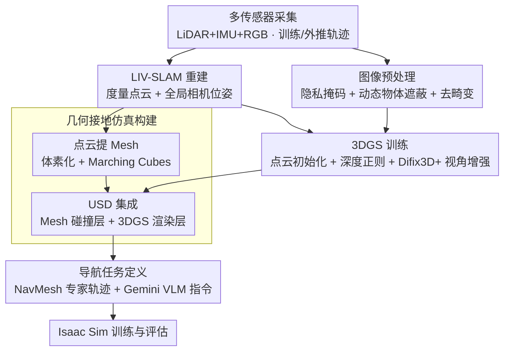

# Wanderland: Geometrically Grounded Simulation for Open-World Embodied AI

**会议**: CVPR 2026  
**arXiv**: [2511.20620](https://arxiv.org/abs/2511.20620)  
**代码**: [https://ai4ce.github.io/wanderland/](https://ai4ce.github.io/wanderland/)  
**领域**: 3D视觉 / 具身AI / 仿真环境  
**关键词**: real-to-sim, 3D Gaussian Splatting, LiDAR-Inertial-Visual SLAM, 导航仿真, 几何接地, 新视角合成  

## 一句话总结

提出 Wanderland real-to-sim 框架：利用手持多传感器扫描仪（LiDAR+IMU+RGB）采集开放世界室内外场景，通过 LIV-SLAM 获取度量级精确几何与相机位姿，结合 3DGS 实现光学真实感渲染 + 几何接地碰撞仿真，构建 530 场景/42 万帧/380 万 m² 的大规模数据集，系统证明纯视觉重建在度量精度、Mesh 质量和导航策略训练/评估可靠性上远不及 LiDAR 增强方案。

## 研究背景与动机

**开放世界具身导航需要高保真仿真**：具身 AI 从室内扩展到城市街道、校园、商业区等开放场景，需要大空间尺度、室内外混合覆盖、高保真传感器模拟和可靠物理交互的仿真环境

**经典 RGB-D 数据集局限于室内**：Matterport3D、ScanNet、HM3D 等采用三脚架式 RGB-D 采集，室外阳光干扰和有限测距范围导致无法适用；大规模低纹理环境下位姿漂移严重

**视频-3DGS 方案几何不可靠**：Vid2Sim、GaussGym 等从在线视频构建仿真环境，存在三个根本缺陷：(a) 纯 RGB SfM/深度估计得到非度量位姿，(b) 从 3DGS 不透明度提取的碰撞 Mesh 碎片化且缺乏度量接地，(c) 单一视频轨迹导致外推视角渲染质量急剧下降

**训练 vs 评估的仿真需求不同**：视频-3DGS 环境或许可用于训练，但因几何不可靠导致无法作为标准化基准进行可复现的闭环评估

**3D 重建和 NVS 缺少大规模室外度量基准**：现有室外数据集缺乏高精度几何 ground truth，限制了重建和 NVS 方法的评估

## 方法详解

### 整体框架

Wanderland 要解决的是开放世界具身导航缺一个"几何可靠又光学真实"的仿真器：纯视频-3DGS 路线（Vid2Sim、GaussGym）拿到的是非度量位姿、碎片化的碰撞 Mesh、外推视角崩坏，能用来训练却没法当标准 benchmark 做可复现的闭环评估。它的破局思路是**几何与外观分家**——几何来自 LiDAR 保证度量精度，外观来自 3DGS 保证真实感，两者共享同一坐标系无缝拼到一起。整条流水线是：手持多传感器采集 → LIV-SLAM 重建出全局一致的度量点云与相机位姿 → 从点云初始化 3DGS 并用深度正则化训练 → 从同一点云提取碰撞 Mesh → Mesh + 3DGS 集成成 USD 场景 → 加载进 Isaac Sim 做导航训练与评估。

### 关键设计

**1. 多传感器采集：用 LiDAR 锚定几何，用轨迹设计撑起外推**

纯视觉路线的根子问题是位姿非度量、低纹理处漂移，且单条视频轨迹一外推就糊。Wanderland 用 MetaCam Air 手持扫描仪同时采 Livox Mid-360 非重复式 LiDAR（含内置 IMU）、RTK-GNSS 和两个同步 4K 鱼眼相机（>180° FOV，出厂标定），LiDAR 倾角经调优以兼顾地面细节与相机 FOV 重叠，配套 App 实时显示彩色点云让操作者主动补盲。采集协议刻意为下游仿真服务：

- 场景规模 5,000–10,000 m²，平衡复杂度与覆盖范围
- 非固定帧率，而是按位移/角度阈值触发 RGB，保证视点均匀
- **训练轨迹**走闭环路径、密集多视角覆盖所有可导航区域；**外推轨迹**模拟自然导航、与训练轨迹最小重叠——这正是与 Vid2Sim/GaussGym 单向城市漫步视频的关键差别，使外推评估有据可依
- 质量控制：最小化动态障碍/反射面、保持单次采集光照一致、实时点云监控验证覆盖

数据在纽约市与泽西市采集，覆盖住宅楼、商业区、街道、广场、校园等类型，跨早/中/傍晚和晴/多云/小雨。

**2. LIV-SLAM 重建 + 图像预处理：度量级几何与干净的训练像素**

几何基础由 MetaCam Studio 做 LiDAR-惯性-视觉-GNSS 多传感器融合（在 VINS-Mono、GVINS、FAST-LIO2 等成熟方法上扩展），输出毫米级间距的致密点云 + 全局一致相机轨迹，直接解决纯视觉方案的度量精度与完整性。图像侧则为 3DGS 清场：EgoBlur 遮蔽人脸车牌做隐私掩码，YOLOv11 检测并遮蔽行人/动物/车辆等动态物体使 3DGS 训练时过滤无效像素，再从鱼眼图裁切 120° 视角做透视去畸变（因 3DGS 只能近似低阶畸变、检测模型也多在针孔图上训练）。

**3. 3DGS 训练：度量点云初始化 + 深度正则化 + 视角增强**

3DGS 直接从 LIV-SLAM 的致密彩色点云初始化（原始间距 5–10 mm，下采样至约 500 万点/场景），每点一个高斯、KNN 启发式设初始尺度，不透明度参数化为体积密度的反比以压住大高斯和浮点噪声；训练分辨率 800×800、gsplat 框架、共 15,000 步。深度正则化是关键一招：不像别人用单目深度当伪 GT，而是把初始化高斯投影到各相机位姿直接得到 GT 深度图，与光度损失联合优化——实验发现纯冻结高斯中心虽保多视角一致却画质退化，纯图像监督提升单视角却牺牲未见视角，深度正则刚好在两者间取平衡。最后用 Difix3D+ 预训练模型沿训练步逐步向远离训练视角的方向生成干净新视角做增强，稳住大规模训练并改善外推渲染。

**4. 几何接地仿真构建：从 LiDAR 点云提 Mesh，与 3DGS 同坐标集成**

碰撞 Mesh 不从 3DGS 不透明度提（那样碎片化、无度量接地），而是把全局点云体素化成占据栅格后用 Marching Cubes 提取，再后处理移除远离采集轨迹的部分、过滤面片过少的碎片，得到干净、完整、度量精确的 Mesh。由于 Mesh 与 3DGS 同源同坐标，可直接集成为 USD：Mesh 当轻量物理/碰撞层，3DGS 当主渲染器，整个场景直接进 Isaac Sim 训练与评估。

**5. 导航任务定义：NavMesh 专家轨迹 + VLM 自动生成语言指令**

专家轨迹由 Mesh 导入 Unity、经 NavMesh 烘焙 API 提取可导航三角面后用寻路模块生成无碰撞最短路径，起终点在采集相机附近采样，支持点目标与图像目标导航。语言指令则回放轨迹生成第一人称视频 → Gemini VLM 自动生成自然语言导航指令 → 人工验证，相比 R2R/RxR 全人工标注更可扩展、跨场景质量更稳。

## 数据集规模

| 指标 | 数值 |
|:---|:---|
| 场景数 | 530 |
| 总帧数 | 420K+ |
| 总采集时长 | 100+ 小时 |
| 覆盖面积 | 3.8M+ m² |
| 场景类型 | 室内外混合（住宅/商业/街道/广场/校园） |
| 每场景数据 | 鱼眼 RGB + 标定参数 + 全局位姿 + 彩色点云 + 3DGS 模型 + 碰撞 Mesh + USD 场景 |
| 扩展计划 | 持续维护至 1,000+ 场景 |

## 实验与结果

### 1. 3D 重建精度（Q1: 纯视觉 vs LIV-SLAM）

以 LIV-SLAM 位姿为 GT，评估 8 种纯视觉方法的相机位姿精度：

| 方法 | T-ATE_raw (m) ↓ | T-ATE_scaled (m) ↓ | R-ATE (°) ↓ | AUC@30 ↑ | 成功率 ↑ |
|:---|:---|:---|:---|:---|:---|
| DUSt3R | 15/14 | 20/18 | 73/60 | 0.12/0.07 | 0.39 |
| MUSt3R | 7.8/5.7 | 10/3.7 | 26/13 | 0.53/0.61 | 0.81 |
| VGGT | 15/14 | 9.9/4.5 | 33/15 | 0.44/0.52 | 0.80 |
| π³ | 15/14 | 4.7/1.4 | 21/6.9 | 0.64/0.76 | 0.89 |
| COLMAP | 16/10 | 8.1/2.3 | 42/10 | 0.50/0.64 | 0.64 |
| COLMAP_calib | 10/9.7 | 4.8/0.30 | 15/5.0 | 0.73/0.83 | 0.87 |
| **所有方法最优** | **2.8** | **0.30** | **5.0** | **0.83** | **0.89** |

**关键发现**: 即使取所有方法的"最优"组合，在不到 100 米的场景中，原始度量误差仍达米级；尺度对齐后平均误差 30 cm / 5°。纯视觉方法在度量精度上的固有模态限制尚未被最新基础模型弥合。

### 2. 光学真实感仿真（Q2: NVS 质量）

在 Wanderland 数据集上统一训练/验证分割评估各方法的新视角合成质量：

| 方法 | 插值 PSNR ↑ | 插值 SSIM ↑ | 插值 LPIPS ↓ | 外推 PSNR ↑ | 外推 SSIM ↑ | 外推 LPIPS ↓ |
|:---|:---|:---|:---|:---|:---|:---|
| 3DGS (COLMAP) | 18.27 | 0.658 | 0.510 | 16.90 | 0.624 | 0.559 |
| 2DGS (COLMAP) | 17.98 | 0.593 | 0.550 | 16.81 | 0.631 | 0.508 |
| Vid2Sim | 17.20 | 0.549 | 0.399 | 16.49 | 0.573 | 0.371 |
| GaussGym | 12.17 | 0.440 | 0.738 | 12.63 | 0.436 | 0.725 |
| **Wanderland (Ours)** | **20.37** | **0.688** | **0.327** | **17.92** | 0.591 | 0.445 |

**关键发现**: Wanderland 在插值视角上全面最优（PSNR 领先 2+ dB），外推视角中 PSNR 同样最高。GaussGym 因 VGGT 重建不精确导致指标最差。Vid2Sim 依赖不可靠的单目深度估计引入额外噪声。语义一致性实验表明，GaussGym 渲染碎片化导致 Grounded SAM 2 无法检测关键环境元素，Vid2Sim 的 DINOv3 特征与 GT 严重偏离。

### 3. 导航策略训练与评估（Q3: 仿真可靠性）

**RL 训练对比**: 在 Vid2Sim 环境中 RL 训练后模型普遍恶化（CityWalker SR 下降 21%），因不准确几何鼓励局部短但全局不可靠行为；在 Wanderland 环境中所有模型显著提升（CityWalker SR 提升 14%，干预率降低 23%）。

**评估可靠性**: 同一模型在 Vid2Sim 环境中评估显示更低成功率和更高干预率，说明几何不可靠的环境无法支撑忠实评估。

**导航基准**: 在 Wanderland 全量数据集上基准测试 5 个预训练模型，没有任何模型室外成功率超过 31%，凸显开放世界导航的巨大研究空间。NaVILA（VLN 模型）表现最优（室内 SR=0.47，室外 SR=0.31），得益于 LLM 的语义理解能力。

## 局限性

1. **采集帧率限制**: 当前硬件限制为 1 FPS，视点采样密度不足，影响复杂场景渲染质量
2. **静态场景假设**: 未建模城市动态元素（行人、车辆、交通模式），需要未来集成行为预测和交互仿真

## 个人思考

1. **LiDAR 依赖的可扩展性权衡**: 框架依赖专业硬件（MetaCam ≈ 商用 3D 扫描仪），数据集规模受采集成本制约。与从海量网络视频零成本构建环境的 GaussGym 路线形成对比——两条路线可能最终走向混合方案：LiDAR 提供少量高质量锚点场景用于标定和评估，视觉方法大规模扩展覆盖
2. **几何接地的必要性被量化**: 论文对"仿真几何质量如何影响下游导航策略"给出了罕见的定量分析——RL 训练在不可靠环境中不仅无效还会恶化模型，这个结论对整个 sim-to-real 社区有重要参考价值
3. **与 NeRF/3DGS 场景理解的连接**: Wanderland 的多传感器数据天然适合评估最新的 feed-forward 3D 重建模型（DUSt3R、VGGT 等），作为 GT 基准的价值可能超越导航仿真本身
4. **动态场景扩展**: 当前静态假设是重要限制。结合 4D Gaussian Splatting 或视频生成模型注入动态代理可能是下一步方向

<!-- RELATED:START -->

## 相关论文

- [\[CVPR 2026\] SAGE: Scalable Agentic 3D Scene Generation for Embodied AI](sage_scalable_agentic_3d_scene_generation_for_embodied_ai.md)
- [\[CVPR 2026\] OnlineHMR: Video-based Online World-Grounded Human Mesh Recovery](onlinehmr_video-based_online_world-grounded_human_mesh_recovery.md)
- [\[CVPR 2026\] GaussianFluent: Gaussian Simulation for Dynamic Scenes with Mixed Materials](gaussianfluent_gaussian_simulation_for_dynamic_scenes_with_mixed_materials.md)
- [\[CVPR 2026\] Choreographing a World of Dynamic Objects](choreographing_a_world_of_dynamic_objects.md)
- [\[CVPR 2026\] FluidGaussian: Propagating Simulation-Based Uncertainty Toward Functionally-Intelligent 3D Reconstruction](fluidgaussian_propagating_simulation-based_uncertainty_toward_functionally-intel.md)

<!-- RELATED:END -->
