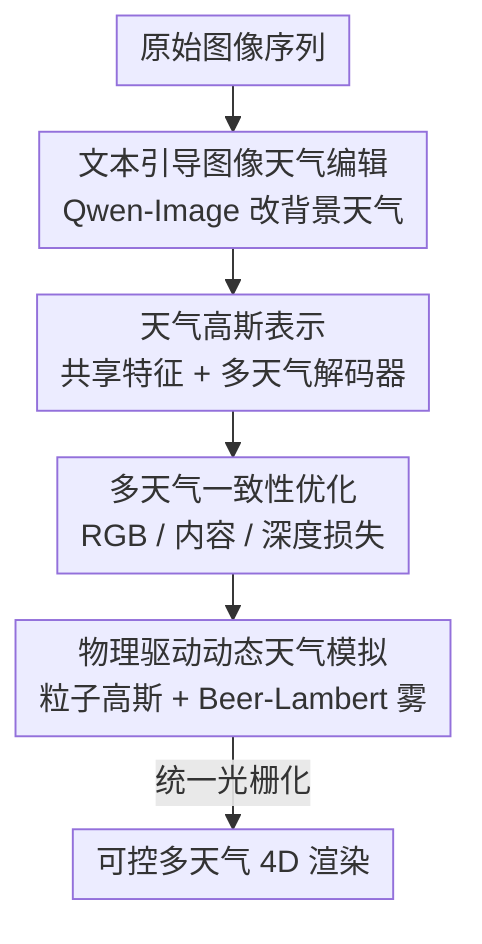

# WeatherCity: Urban Scene Reconstruction with Controllable Multi-Weather Transformation

**会议**: CVPR 2026  
**论文**: [CVF Open Access](https://openaccess.thecvf.com/content/CVPR2026/html/Wu_WeatherCity_Urban_Scene_Reconstruction_with_Controllable_Multi-Weather_Transformation_CVPR_2026_paper.html)  
**代码**: https://github.com/IRMVLab/WeatherCity  
**领域**: 3D视觉 / 城市场景重建  
**关键词**: 4D重建, 高斯泼溅, 多天气编辑, 自动驾驶仿真, 物理粒子模拟

## 一句话总结
WeatherCity 把「2D 天气图像编辑 + 共享特征的多天气高斯表示 + 物理驱动粒子模拟」三件事串成一个统一框架，让自动驾驶 4D 场景在重建之后还能可控地切换晴/雨/雪/雾并调强度，在 Waymo / nuScenes 上 CLIP-S、Sem-CS 等指标全面领先，且渲染速度达 25.67 FPS。

## 研究背景与动机

**领域现状**：自动驾驶要做闭环仿真和端到端训练，需要「可编辑的高保真 4D 场景」——既能复现真实路况，又能造出训练时见不到的极端工况（雨雪雾）。NeRF / 3DGS 以及面向街景的 StreetGaussians、OmniRe 已经能把动态城市场景重建得很逼真。

**现有痛点**：这些重建方法都「只能复刻采集时的天气」——数据是晴天，重建出来永远是晴天，无法凭空生成雨雪雾。而另一条路线——2D 图像级天气编辑（GAN 时代的 WeatherGAN、扩散时代的 ControlNet / InstructPix2Pix）——虽然能按文本改天气，却有两个硬伤：一是**内容幻觉**，会把车辆扭曲、把车道线挪位、把建筑变形；二是**逐帧独立编辑导致时序闪烁**，无法满足 4D 场景的几何一致性。已有的 3D 级编辑（ClimateNeRF、WeatherGS）要么只能去雨、要么只能模拟积雪/积水这类**静态**天气，做不出落雨落雪这种动态现象。

**核心矛盾**：天气的「外观」和场景的「几何结构」纠缠在一起。直接在 2D 改外观会破坏几何一致性；而重建方法又把采集时的天气外观「焊死」进了几何里，无法解耦控制。

**本文目标**：构建一个统一框架，把 2D 图像编辑「抬升」到 4D 仿真，同时满足三件事——重建（reconstruction）、天气编辑（editing）、动态仿真（simulation）。

**切入角度**：用一个共享外观特征 + 多套天气专属解码器，强行把「场景内在纹理」和「天气相关外观」拆开；再用一个独立的物理粒子系统去补 2D 编辑做不出的动态落雨落雪。

**核心 idea**：让一组共享几何 + 共享特征的高斯被多个「天气解码器」分别上色，从而结构一致、外观可换；动态天气则交给物理驱动的粒子高斯，统一进同一张高斯场景图里一起渲染。

## 方法详解

### 整体框架

给定一段原始采集图像序列，WeatherCity 联合完成 4D 动态重建与可控天气编辑，整条管线由四个模块串成。首先**文本引导的图像天气编辑**用 Qwen-Image 把原图改成目标天气（雨/雪/雾），生成多天气监督图像；接着**天气高斯表示**用共享特征 + 多天气解码器把几何/纹理与天气外观解耦，保证不同天气下结构一致；然后**一致性优化**用 RGB 损失、内容一致性损失、深度损失把渲染图对齐到原图与编辑图，压住 2D 逐帧编辑引入的抖动；最后**物理驱动动态天气模拟**用粒子高斯模拟落雨落雪、用 Beer–Lambert 定律模拟雾，并把天气粒子作为节点直接并入高斯场景图统一渲染。

### 关键设计

**1. 文本引导的图像天气背景编辑：把"造监督"这步交给基础模型**

4D 重建/编辑需要「目标天气下的图像」当监督信号，但真实数据里根本没有雨雪雾版本。作者直接借用 Qwen-Image 这个强文本引导编辑模型：对每种目标天气设计一段提示词，提示词不仅描述天气效果（如"a rainy city street"），还**显式强调严格保留原始场景内容**。对原始序列 $\{I^{raw}_t\}_{t=1}^N$ 逐帧编辑，得到多天气图像序列 $\{I^w_t \mid w \in \mathcal{W}\}$。这一步只负责给出「外观参考」，它本身仍有逐帧不一致的毛病——这正是后面内容一致性损失要修的。

**2. 天气高斯表示：共享特征 + 多天气解码器解耦几何与外观**

这是全文核心，专治「天气外观和几何结构纠缠」。沿用 OmniRe 的动态高斯场景图（天空节点、背景节点、刚体车辆节点、非刚体行人节点），但把每个高斯基元重新参数化为

$$G_i = \{\mu_i, s_i, r_i, o_i, f_i\}$$

其中 $\mu_i\in\mathbb{R}^3$ 是中心、$s_i$ 是尺度、$r_i\in\mathbb{R}^4$ 是旋转四元数、$o_i\in[0,1]$ 是不透明度，关键是 $f_i\in\mathbb{R}^d$ 是一个**共享外观特征**，编码场景内在纹理与材质。对每种天气 $w$，用一个天气专属 MLP $\phi_w$ 把同一个 $f_i$ 解码成不同颜色 $c_i^w = \phi_w(f_i)$，于是共享几何 $\{\mu_i,\Sigma_i,o_i\}$ 配上不同天气色就得到多天气高斯。渲染时高斯先投影到相机、按 $\Sigma' = JW\Sigma W^\top J^\top$ 求 2D 协方差，再按深度排序做 alpha blending 得到 $\hat I_t^w$ 和深度 $\hat D_t$。这样设计的妙处在于：几何参数全员共享、只有颜色随天气走，**结构天然跨天气一致**，切换天气只是换一个解码器、而不是换一套场景。

**3. 多天气一致性优化：用内容损失修掉 2D 编辑的逐帧抖动**

设计 1 的 Qwen-Image 是逐帧编辑的，会带来时序闪烁和局部几何错乱。作者用一组复合损失把渲染结果同时对齐到原图与各天气编辑图。RGB 损失对原始晴天和各编辑天气都算 L1 + SSIM：

$$\mathcal{L}_{rgb} = \sum_{t=1}^N \sum_{w \in \mathcal{W}\cup\{raw\}} (1-\lambda)\lVert \hat I_t^w - I_t^w \rVert_1 + \lambda(1-\mathrm{SSIM}(\hat I_t^w, I_t^w))$$

更关键的是**内容一致性损失** $\mathcal{L}_{cc}$：用预训练 VGG 网络 $\Phi$ 抽内容特征，把天气 $w$ 下渲染图的特征拉回到原始天气图，$\mathcal{L}_{cc} = \sum_t\sum_{w}\lVert \Phi(\hat I_t^w) - \Phi(I_t^{raw})\rVert$。它的作用是「改天气不改内容」——哪里被 2D 编辑扭坏了，就靠这一项把它矫正回原始结构。再加上由 LiDAR 投影稀疏深度监督的深度损失 $\mathcal{L}_{depth} = \sum_t \lVert \hat D_t - D_t \rVert$，以及不透明度、正则项，构成总损失 $\mathcal{L}_{total} = \mathcal{L}_{rgb} + \lambda_{cc}\mathcal{L}_{cc} + \lambda_{depth}\mathcal{L}_{depth} + \lambda_{opacity}\mathcal{L}_{opacity} + \mathcal{L}_{reg}$。

**4. 物理驱动动态天气模拟：粒子高斯 + Beer–Lambert 雾，统一进场景图渲染**

前三步解决的是「背景天气外观」，但落雨落雪这种**前景动态粒子**是 2D 编辑做不出时序连贯的。作者用高斯椭球建模粒子：雨滴用单个拉长的高斯捕捉竖直拉伸与运动模糊，雪花用三个同尺度、互成 60° 的同心高斯椭球拼成晶体形；在重建场景上构建空间包围体，按不同密度初始化粒子的位置、旋转、不透明度来控制天气强度。运动上每帧按物理速度更新：

$$\mathbf{v}_{rain} = \mathbf{v}_{fall} + \mathbf{v}_{wind}, \quad \mathbf{v}_{snow} = \mathbf{v}_{fall} + \mathbf{v}_{wind} + \mathbf{v}_{turb}$$

其中 $\mathbf{v}_{fall}$ 是恒定下落速度、$\mathbf{v}_{wind}$ 是带强度/倾角/方位的全局风、$\mathbf{v}_{turb}$ 是只加在雪花上的随机湍流（造出飘忽非线性下落）。最巧的是**统一渲染**：雨雪粒子高斯不走单独 pass，而是作为天气节点 $N_{rain}/N_{snow}$ 直接并入动态高斯场景图，和场景高斯一起标准光栅化，从而天然保证遮挡、合成、混合都正确。雾因为弥散均匀，改用基于 Beer–Lambert 的深度感知雾：$c^{fog}_{render} = f\,c_{render} + (1-f)c_{fog}$，透射率 $f = e^{-d_f d_{render}}$，调 $c_{fog}$ 和雾密度 $d_f$ 就能改雾的浓淡与颜色。

### 损失函数 / 训练策略
共享高斯特征维度 32，天气 MLP 解码器为两层线性 + ReLU + Sigmoid 输出 RGB。Adam 训练 30,000 步，学习率 $10^{-4}$，损失权重 $\lambda_{cc}=1.0$、$\lambda_{depth}=0.01$、$\lambda_{SSIM}=0.2$；内容损失用 VGG-19 的 relu4_1 特征。动态天气用 40,000 个雨粒子、16,000 个雪粒子；雾参数 $c_{fog}=[0.80,0.80,0.85]$、$d_f=0.2$。全部高斯统一用标准 3DGS 管线光栅化，实验在单卡 RTX 8000 上完成。

## 实验关键数据

### 主实验
在 Waymo Open Dataset 与 nuScenes 上各选 5 个动态物体丰富的场景（每个 30 连续帧），与图像编辑（ControlNet、TurboEdit）、视频编辑（FRESCO）及编辑底座 Qwen-Image 对比。三项指标：CLIP-S（内容保持）、CLIP-DS（与目标文本对齐）、Sem-CS（语义一致性，分割 IoU 加权）。

| 数据集 | 方法 | CLIP-S↑ | CLIP-DS↑ | Sem-CS↑ |
|--------|------|---------|----------|---------|
| Waymo | ControlNet | 0.634 | 0.238 | 0.695 |
| Waymo | TurboEdit | 0.830 | 0.220 | 0.801 |
| Waymo | FRESCO | 0.720 | 0.213 | 0.824 |
| Waymo | Qwen-Image | 0.785 | 0.279 | 0.843 |
| Waymo | **WeatherCity** | **0.872** | **0.303** | **0.915** |
| nuScenes | Qwen-Image | 0.804 | 0.279 | 0.902 |
| nuScenes | **WeatherCity** | **0.870** | **0.302** | **0.968** |

CLIP-S 与 Sem-CS 的大幅领先说明它在保内容、保语义上明显更强；定性图里基线普遍出现车辆扭曲、幻觉结构、车道线错位，而且做不出深度感知的雾。此外框架基于动态高斯场景图，还顺带支持物体级编辑（按"移除中心红白车之外的所有车并改成雪天"这类指令精确增删改）。

运行速度上更是断层领先——基线是 2D/视频编辑的逐帧推理，本文是高斯渲染：

| 方法 | 速度 (FPS)↑ |
|------|-------------|
| ControlNet | 0.033 |
| TurboEdit | 0.097 |
| FRESCO | 0.142 |
| **WeatherCity** | **25.67** |

### 消融实验
| 配置 | CLIP-S↑ | CLIP-DS↑ | Sem-CS↑ | 说明 |
|------|---------|----------|---------|------|
| a. Baseline（仅 Qwen-Image 编辑） | 0.735 | 0.276 | 0.891 | 去掉所有提出模块 |
| b. w/o WGS（换回普通 3DGS，天气共享同一组高斯） | 0.781 | 0.212 | 0.894 | 去掉天气高斯解耦 |
| c. w/o $\mathcal{L}_{cc}$（去内容一致性损失） | 0.817 | 0.289 | 0.916 | 去掉抖动矫正 |
| **WeatherCity（Full）** | **0.880** | **0.320** | **0.943** | 完整模型 |

### 关键发现
- **天气高斯（WGS）是结构解耦的关键**：去掉后 CLIP-DS 从 0.320 暴跌到 0.212，模型无法把内在纹理和天气外观分开，不同天气的效果互相串色（Fig.6b），证明「共享特征 + 天气专属解码器」确实把场景属性与瞬时天气外观分离开。
- **内容一致性损失主修语义/几何一致**：去掉后场景一致性指标下滑、出现 Qwen-Image 逐帧编辑残留的局部伪影；加上后靠 VGG 特征对齐把这些局部错乱拉回原始结构。
- **物理粒子模拟胜在时序连贯**：用动态天气提示词（"暴雨重力下落、雪花弱风飘动、远处雾渐浓"）对比，Qwen-Image 生成的动态天气帧间不连贯，而粒子运动方程能做出平滑的逐帧过渡（Fig.7）。

## 亮点与洞察
- **"共享几何 + 多解码器"是个干净的解耦范式**：只让颜色随天气变、几何全员共享，天然保证跨天气结构一致，切天气=换解码器而非换场景；这套思路可迁移到任何「同一几何、多种外观风格」的可控编辑（昼夜、季节、材质风格）。
- **把动态天气当成场景图里的一类节点**，和场景高斯一起统一光栅化，省掉单独 pass 还自动拿到正确遮挡/混合——这是它能做到 25.67 FPS 实时、又物理一致的根本原因。
- **"用 2D 编辑造监督、再用 3D 一致性损失反向纠错"** 是个很实用的组合拳：既借到了基础模型的强编辑能力，又用 $\mathcal{L}_{cc}$ 把基础模型逐帧不一致的副作用按住，避免了直接 2D 编辑的内容幻觉。

## 局限与展望
- **天气编辑质量被 Qwen-Image 上限锁死**：整个外观监督来自单一编辑底座，底座的偏置/失真会通过监督传进 3D，$\mathcal{L}_{cc}$ 只能修局部不一致、修不了系统性的错误外观。
- **物理粒子是手工规则**：雨/雪/雾的粒子形状、运动方程、参数（粒子数、雾密度）都是人工设定，未必匹配真实气象统计，强度控制偏经验性。
- **评测仅 5 个场景 × 30 帧、单一指标族**：CLIP-S/DS/Sem-CS 都偏「与文本/原图的语义对齐」，缺少对下游闭环仿真有效性的直接验证（如用合成天气数据训出来的策略是否真的更鲁棒）。
- 可改进方向：把粒子参数也纳入可学习/可从真实雨雪数据标定；引入多个编辑底座做集成以降单底座偏置；补一个「合成天气 → 端到端训练 → 真实极端天气测试」的闭环验证。

## 相关工作与启发
- **vs StreetGaussians / OmniRe**：它们把动态城市重建做得很好但只做「物体级」编辑（改车的位置/数量），天气被焊死在采集条件里；本文沿用 OmniRe 的场景图，但加了天气维度的解耦，能既改物体又改天气。
- **vs ControlNet / InstructPix2Pix / TurboEdit（2D 编辑）**：它们能按文本改天气但逐帧独立、内容幻觉重、无时序一致，也做不出深度感知大气效果；本文把 2D 编辑当监督、用 3D 表示和一致性损失把它抬升到时序一致的 4D。
- **vs ClimateNeRF / WeatherGS（3D 级编辑）**：ClimateNeRF 只能静态天气（积雪/积水），WeatherGS 只做去天气伪影；本文同时支持背景天气外观与前景动态粒子，且能细粒度调强度（小雨↔暴雪）。
- **vs Fiebelman et al.（高斯-粒子混合）**：他们主要做前景天气粒子、缺少同步的背景天气编辑；本文背景外观与前景粒子同步可控，整体真实感更高。

## 评分
- 新颖性: ⭐⭐⭐⭐ 「共享特征 + 多天气解码器」的解耦表示 + 「2D 编辑造监督、3D 损失纠错」的组合是站得住的新组合，但各组件多为已有技术的巧妙拼装。
- 实验充分度: ⭐⭐⭐⭐ 两大自动驾驶数据集、定量+定性+消融+速度齐全，消融清楚指认各模块贡献；但场景数偏少、缺下游闭环验证。
- 写作质量: ⭐⭐⭐⭐ 四模块结构清晰、公式完整、图示到位，逻辑链顺畅。
- 价值: ⭐⭐⭐⭐ 直击自动驾驶闭环仿真的极端天气数据缺口，实时渲染 + 可控强度 + 物体级编辑的组合很实用，代码已开源。

<!-- RELATED:START -->

## 相关论文

- [\[CVPR 2026\] PrITTI: Primitive-based Generation of Controllable and Editable 3D Semantic Urban Scenes](pritti_primitive-based_generation_of_controllable_and_editable_3d_semantic_urban.md)
- [\[CVPR 2026\] NimbusGS: Unified 3D Scene Reconstruction under Hybrid Weather](nimbusgs_unified_3d_scene_reconstruction_under_hybrid_weather.md)
- [\[CVPR 2026\] P2GS: Physical Prior-guided Gaussian Splatting for Photometrically Consistent Urban Reconstruction](p2gs_physical_prior-guided_gaussian_splatting_for_photometrically_consistent_urb.md)
- [\[CVPR 2026\] Coherent Human-Scene Reconstruction from Multi-Person Multi-View Video in a Single Pass](coherent_humanscene_reconstruction_from_multiperso.md)
- [\[CVPR 2026\] BRepGaussian: CAD Reconstruction from Multi-View Images with Gaussian Splatting](brepgaussian_cad_reconstruction_from_multi-view_images_with_gaussian_splatting.md)

<!-- RELATED:END -->
