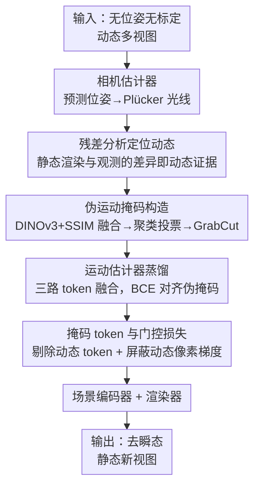

# WildRayZer: Self-supervised Large View Synthesis in Dynamic Environments

**会议**: CVPR 2026  
**论文**: [CVF Open Access](https://openaccess.thecvf.com/content/CVPR2026/html/Chen_WildRayZer_Self-supervised_Large_View_Synthesis_in_Dynamic_Environments_CVPR_2026_paper.html)  
**代码**: 项目页 https://wild-rayzer.cs.virginia.edu/（数据集与代码承诺开源）  
**领域**: 3D视觉 / 新视图合成  
**关键词**: 自监督新视图合成, 动态场景, 运动掩码, 前馈渲染, 残差分析

## 一句话总结
WildRayZer 把自监督、无位姿的大视图合成模型 RayZer 扩展到「相机和物体都在动」的真实场景：靠一个只解释刚性结构的静态渲染器，用它渲不出来的残差自动发现动态物体，蒸馏出一个运动掩码估计器，在场景编码前剔除动态 token、在渲染损失里屏蔽动态像素，从而一次前馈就能合成「去掉瞬态物体」的干净新视图，全程不需要任何位姿或掩码标注。

## 研究背景与动机

**领域现状**：新视图合成（NVS）这几年从 NeRF、3DGS 的逐场景优化，走到了 LVSM、RayZer 这类用大 transformer 在海量数据上学通用先验、一次前馈出图的路线。其中 RayZer 走得最远——它**自监督**、**推理时不需要相机位姿**，给几张无标定的稀疏图就能隐式重建场景并渲染新视图，不依赖任何 3D 标注。

**现有痛点**：但 RayZer 乃至几乎所有前馈 NVS 都建立在一个硬假设上——**场景是静态的**。训练和推理都要求输入里没有运动物体，于是只能喂 RealEstate10K 这种被刻意过滤掉运动的静态数据集。可现实世界本质是动态的：手持视频里到处是走动的人、宠物、来往车辆。一旦动态内容进入输入，多视图一致性被破坏，模型就会出现鬼影、幻觉几何、位姿估计崩坏。这等于把绝大多数「野外视频」这一最丰富的数据源拒之门外。

**核心矛盾**：要在动态场景做自监督 NVS，面临两个绕不开的难题。其一，**没有任何动态掩码标注时，怎么定位运动物体？**——自监督意味着连「哪里在动」都得自己挖出来。其二，**现有大规模 3D 数据集几乎全是静态的，怎么训练和评测这个任务？**——动态 NVS 数据集普遍只有不到十个序列（都是优化式管线攒出来的），根本撑不起大规模学习。

**切入角度**：作者的关键观察是——**动态物体恰恰是「静态渲染器解释不了」的那部分**。如果一个只会刻画刚性结构的渲染器对某块区域渲染失败、残差很大，那这块多半就是运动内容。这把「定位动态」从需要标注的监督问题，转成了一个 analysis-by-synthesis（合成反推分析）的自监督测试。

**核心 idea**：用一个相机驱动的静态渲染器解释刚性背景，把它的渲染残差当作动态区域的证据，由此构造伪运动掩码、蒸馏运动估计器，再用掩码同时「挡住输入 token」和「门控损失梯度」，让监督信号集中到跨视图背景补全上——最终一次前馈输出去瞬态的静态新视图。

## 方法详解

### 整体框架

WildRayZer 在 RayZer 的「相机估计器 + 场景编码器 + 渲染器」三件套旁边，新增了一个**运动估计器** $E_{mot}$。输入是一组无位姿、无标定的动态多视图 $\mathcal{I}$（含相机运动 + 物体运动），输出是该场景**去掉瞬态物体后的静态新视图**，整条管线推理时一次前馈完成。

整体转法是这样：相机估计器先预测每视图位姿与共享内参，转成像素对齐的 Plücker 光线图；一个**只用相机信息的静态渲染器**渲出它认为「刚性场景应该长什么样」，渲染结果 $\hat{\mathcal{I}}_\mathcal{B}$ 与真实目标 $\mathcal{I}_\mathcal{B}$ 的残差就暴露出动态区域；这些残差经伪运动掩码构造管线锐化成干净掩码，用来**蒸馏**运动估计器；训练好的运动估计器在编码前把动态 token 清零，同时用同一套掩码在光度渲染损失里屏蔽动态像素。训练采用**交替优化**：先冻住渲染栈学掩码，再冻住运动头学带掩码的渲染器，掩码足够可靠后再端到端联合微调。

### 关键设计

**1. 残差分析定位动态：把「哪里在动」变成静态渲染器解释不了的部分**

自监督最大的拦路虎是没有动态掩码标注。WildRayZer 不去额外训一个监督分割器，而是做一次 analysis-by-synthesis 测试：它先拿一个预训练的 RayZer 当**只解释刚性结构的静态渲染器**。对每个留出视图 $I \in \mathcal{I}_\mathcal{B}$，静态渲染器给出预测 $\hat{I}$；如果某块区域是刚性背景，渲染器解释得了，残差就小；如果是运动物体，它跨视图不一致、渲染器解释不了，残差就大。于是「残差大的地方 = 动态区域」成了一个不需要任何标注的天然信号。

这一步的巧妙在于它把动态定位**寄生在 NVS 任务本身**：渲染器为了把背景渲好，必然会在运动物体上失败，而这个失败正好是免费的监督。和那些依赖光流分组、轨迹推理或预训练 tracker 的运动分割方法相比，它不需要显式视频序列或多帧点轨迹，在「稀疏、无位姿」这种轨迹方法最脆弱的设定下反而更稳。

**2. 伪运动掩码构造：从噪声残差里提炼出边界干净的掩码**

直接用 MSE 残差当掩码很糟——渲染本身就不完美，原始误差图又脏又散。这个设计是一整条把粗残差锐化成可用监督的管线。先抽 DINOv3 patch 特征算语义不相似度 $D_{\text{DINO}}(p)=1-\langle \Phi_p(I),\Phi_p(\hat{I})\rangle$（$\Phi_p$ 是 L2 归一化的 patch 特征），同时用 SSIM 算像素级外观不相似度 $D_{\text{SSIM}}(x)=1-\text{SSIM}(I,\hat{I})(x)$；两者都降到 patch 分辨率并做 z-score 归一化后，按**渲染保真度自适应加权**融合：

$$D_{\text{bin}}(p)=w_{\text{DINO}}\,Z(D_{\text{DINO}}(p))+w_{\text{SSIM}}\,Z(D_{\text{SSIM}}(p)),\quad w_{\text{DINO}}+w_{\text{SSIM}}=1$$

训练早期渲染还很粗，就调大 $w_{\text{DINO}}$ 信赖更稳的语义线索；随着光度质量变好再逐渐调大 $w_{\text{SSIM}}$ 去吃细粒度外观差异。接着对一个场景里 $B$ 帧的所有 patch 特征做 K-means 聚类，某个簇 $k$ 的平均显著度 $\bar{s}_k=\mathbb{E}_{p\in k}[D_{\text{bin}}(p)]$ 落在前 5% 且在至少 4 帧里都显著（超过 $D_{\text{bin}}$ 的 75 分位），才被标为前景动态——这条**跨帧一致性投票**把偶发噪声筛掉。最后上采到像素分辨率，用形态学平滑、小连通域剔除、GrabCut 边界细化得到干净二值掩码。整条管线全在 patch 分辨率上算，计算量约降 100×，这在「学习式、付不起为整个数据集预存 DINOv3 特征」的设定里至关重要。

**3. 运动估计器蒸馏：三路 token 融合，让掩码可推理、可端到端**

伪掩码是离线挖出来的，推理时拿不到目标视图，所以必须把这个能力**蒸馏**进一个只看输入视图的前馈模块 $E_{mot}$。它对每张图预测逐像素 logit $S(I)\in\mathbb{R}^{H\times W}$，输入是三路在 token 网格上对齐的互补信号：(a) DINOv3 patch 特征、(b) RayZer 图像 token、(c) 由位姿和内参导出的 Plücker 光线 token。每个 token 位置上三者各过 LayerNorm 和线性投影到共享宽度 $d$、拼接，再经小融合 MLP 和浅层 transformer 做跨视图推理，最后 DPT 式解码器上采回 $H\times W$。训练用标准 BCE-with-logits 让 $S(I)$ 对齐伪掩码 $\tilde{M}(I)$。

两个细节决定了它好不好用。其一，图像 token 取的是**相机估计器之前**的特征，保证运动头永远不依赖目标视图或测试时才有的信号——推理和训练看到的输入类型完全一致。其二，引入 DINOv3 特征不只是锦上添花：消融显示它让掩码「涌现」快得多，达到 mIoU=30 的步数从 20k 骤降到 1.5k，最终 mIoU 从 29.4 提到 39.4；而同时喂图像 + 光线 token 让梯度能回流到位姿估计器，反过来稳住了动态场景下的相机估计。

**4. 掩码 token 与门控损失：让监督信号集中到跨视图背景补全**

光有掩码不够，关键是怎么用它**阻止瞬态污染静态场景表示**。对每个输入视图，运动估计器的概率图被降采到 token 网格、阈值化成二值 patch 掩码 $\Pi\in\{0,1\}^{h\times w}$，动态 token 位置在送入场景编码器 $E_{scene}$ 前**直接清零**，只有静态 token 参与重建，得到一个被显式清除瞬态内容的场景表示 $z$。同一套伪掩码还**门控光度渲染损失**——屏蔽留出目标里的动态像素梯度，让 Eq.(1) 的重建监督只作用在跨视图背景补全上，而不是去拟合那些根本不该出现在静态场景里的运动物体。

但作者发现一个反直觉的点：**即便给定准确的现成掩码，单纯清零 token 也只会产生模糊伪影**（像局部插值），因为被挡住的区域需要从别的视图「补」出来——这说明跨视图补全必须靠学，而不是靠掩码本身。这正是 WildRayZer 用**带掩码的可学习渲染器**端到端训练、而不是后处理式 inpainting 的原因。此外为提升开集鲁棒性，训练时还做简单的 copy–paste 增强：把带 GT 掩码的 COCO 物体随机贴到训练图上，当作额外的精确瞬态监督——它单独用没效果，但和 D-RE10K 伪掩码联合训练时显著改善跨数据集泛化（DAVIS 上 mIoU 从 3.4 提到 31.0）。

### 损失函数 / 训练策略

整体沿用 RayZer 的自监督光度目标：对每个留出目标 $\hat{I}\in\hat{\mathcal{I}}_\mathcal{B}$，

$$\mathcal{L}=\frac{1}{|\mathcal{I}_\mathcal{B}|}\sum_{\hat{I}\in\hat{\mathcal{I}}_\mathcal{B}}\big[\text{MSE}(I,\hat{I})+\lambda\,\text{Percep}(I,\hat{I})\big]$$

其中感知损失权重 $\lambda=0.2$，而动态像素的梯度被运动掩码门控掉。运动估计器单独用 BCE-with-logits 蒸馏伪掩码。训练分三阶段交替：冻渲染栈学掩码 → 冻运动头学掩码渲染器 → 掩码可靠后端到端联合微调。全程无位姿、深度、语义标注，外部骨干（DINOv3）冻结。模型共 28 层 transformer（运动估计器 4 层，相机估计器/场景编码器/渲染解码器各 8 层），768 个场景 token，4×H100、$256^2$ 分辨率、patch size 16。

## 实验关键数据

### 主实验

在两个动态基准上做稀疏视图（2/3/4 张输入、6 个目标视图）NVS。D-RE10K 报告静态区域指标，D-RE10K-iPhone 报告全图指标。WildRayZer 在所有视图数、所有指标上全面领先优化式与前馈式 baseline。

| 数据集 / 视图数 | 指标 | WildRayZer | 次优 baseline | 提升 |
|--------|------|------|----------|------|
| D-RE10K, v=2 | PSNRs ↑ | **21.78** | 19.01 (RayZer+SAV) | +2.77 |
| D-RE10K, v=4 | PSNRs ↑ | **22.38** | 20.73 (RayZer+SAV) | +1.65 |
| D-RE10K-iPhone, v=2 | PSNR ↑ | **20.89** | 19.57 (RayZer+SAV) | +1.32 |
| D-RE10K-iPhone, v=2 | LPIPS ↓ | **0.364** | 0.428 (RayZer+SAV) | −0.064 |

其中所有优化式方法（NeRF On-the-go、3DGS、T-3DGS、Spotless-Splats、WildGaussians）在只有 2–4 视图时既压不住瞬态又重建不出场景结构；WildGaussians 相对均衡但稀疏输入下保真度骤降。

静态/瞬态分区分析（D-RE10K-iPhone, v=2）更能说明问题——优化式方法静态与瞬态指标差距巨大，而 WildRayZer 在两个区域都最强：

| 区域 | 指标 | WildRayZer | RayZer+SAV | WildGaussians |
|------|------|------|----------|----------|
| 静态 | PSNRs ↑ | **21.00** | 20.22 | 18.47 |
| 瞬态 | PSNRt ↑ | **20.99** | 17.77 | 18.46 |
| 瞬态 | LPIPSt ↓ | **0.371** | 0.536 | 0.652 |

瞬态区域 PSNR 几乎不掉（21.00 vs 20.99），说明它确实把运动物体「补」成了干净背景，而不是留下空洞或模糊。

### 运动掩码质量

在 D-RE10K-Mask 上对比运动分割。WildRayZer 作为自监督方法，mIoU 和 Recall 反超有监督的 MegaSAM、Segment Any Motion：

| 视图数 | 指标 | WildRayZer (自监督) | Segment Any Motion (有监督) | MegaSAM (有监督) |
|------|------|------|----------|----------|
| n=2 | mIoU ↑ | **53.9** | 31.9 | – |
| n=2 | Recall ↑ | **85.1** | 47.2 | – |
| n=8 | mIoU ↑ | **54.2** | 50.9 | 35.4 |

值得注意的是 WildRayZer 的指标几乎不随视图数变化（53.9→54.2），而所有 baseline 都强烈依赖更多视图——稀疏设定下残差信号比轨迹/tracker 线索稳得多。

### 消融实验

| 配置 | D-RE10K | D-RE10K-iPhone | 说明 |
|------|---------|----------------|------|
| 仅 Copy–Paste | 18.2 | 11.1 | 合成瞬态无法迁移到真实视频 |
| 仅 Pseudo-Mask | 53.9 | 45.3 | 真实残差掩码是主力 |
| Copy–Paste + Pseudo-Mask | 53.9 | 49.7 | 联合训练改善跨域泛化 |

运动估计器输入模态消融：同时用图像 + 光线 token 让梯度回流到位姿估计器、稳住动态场景相机；加入 DINOv3 后达到 mIoU=30 的步数从 20k 降到 1.5k，最终 D-RE10K mIoU 从 29.4 升到 39.4。

### 关键发现
- **跨视图补全必须靠学，不能靠掩码**：即便给定准确的现成掩码，单纯清零 token 也只产生局部插值式的模糊伪影——这是 WildRayZer 坚持端到端训练带掩码渲染器的根本原因。
- **残差信号对稀疏视图鲁棒**：掩码质量几乎不随输入视图数下降，而光流/轨迹/tracker 类 baseline 在 2 视图下普遍崩坏。
- **DINOv3 是掩码涌现的加速器**：让收敛步数降一个数量级，在「每次伪掩码迭代都很贵」的学习式设定里尤其关键。
- **copy–paste 单独无用、联合有效**：合成贴图不能直接迁移到真实视频，但叠加真实伪掩码后能显著拓宽开集泛化（DAVIS mIoU 3.4→31.0）。

## 亮点与洞察
- **把「动态定位」寄生进 NVS 任务本身**：动态物体恰好是静态渲染器解释不了的残差，于是免费、无标注地拿到了运动监督——这个 analysis-by-synthesis 视角可迁移到任何「静态模型 + 残差即异常」的自监督场景（如变化检测、瞬态去除、异常分割）。
- **patch 分辨率全流程省 100× 算力**：聚类、融合、投票全在 patch 网格上做，让学习式管线无需为整个数据集预存重特征——这是把残差掩码法规模化的工程关键。
- **「掩码 + 门控」双管齐下**：同一套掩码既挡输入 token 又门控损失梯度，把监督信号干净地导向背景补全，是个简洁可复用的设计模式。
- **自监督反超有监督分割**：在稀疏视图下，从「渲染器渲不出」推出的运动证据比预训练 tracker/光流稳得多，提示「任务内生信号」有时强过外部专用模型。

## 局限与展望
- **限室内、限「背景大体刚性」**：D-RE10K 全是室内 real-estate 走查视频，背景刚性、光照稳定；对大幅非刚性形变、剧烈光照变化或户外复杂场景的泛化只在 DAVIS 上做了定性展示，缺乏定量验证。
- **目标是「移除」而非「重建」动态物体**：方法把瞬态当噪声去掉，渲染干净静态场景；如果下游需要的是动态物体本身的 4D 重建，这套思路并不适用。
- **依赖预训练 RayZer 与 DINOv3**：伪掩码质量受初始静态渲染器和外部骨干特征好坏制约，冷启动阶段残差若太脏，掩码可能定位错；强反光、透明、重复纹理背景下静态渲染器本身就会失败，残差信号会失真。
- **稀疏视图补全有上限**：被瞬态长期遮挡、其他视图也看不到的背景无法凭空补出，作者也将失败案例留给了补充材料。
- **改进方向**：把残差信号与显式光流/深度一致性结合做交叉验证、引入时序多帧聚合以处理非刚性动态、把「移除」扩展为「移除 + 可选重插」以支持可控编辑。

## 相关工作与启发
- **vs RayZer**：RayZer 是本文的直接前身，自监督、无位姿、前馈，但只能处理静态输入。WildRayZer 的全部新增（运动估计器、伪掩码、掩码 token、门控损失）都是为了把它从「静态」抬到「动态」，核心差异是显式建模并剔除瞬态运动。
- **vs WildGaussians / Spotless-Splats 等野外 3DGS**：它们沿 robust NeRF 路线，靠降权高误差像素来抗瞬态，且是逐场景优化、需要准确位姿、稠密视图。WildRayZer 是前馈、测试时无位姿、稀疏视图就能跑，且用大 transformer 渲染器而非显式 3D 表示——稀疏设定下保真度优势明显。
- **vs 运动分割方法（光流 / 轨迹 / UVOS）**：传统方法显式依赖视频序列、多帧点轨迹或显著性，在稀疏无位姿下脆弱；WildRayZer 从「静态多视图渲染器解释不了什么」反推运动，反而在该设定下更可靠，甚至反超有监督的 SAV、MegaSAM。
- **vs LVSM**：LVSM 移除了大部分 3D 归纳偏置、学纯 token 空间渲染器，但仍假设已知位姿 + 静态图像；WildRayZer 进一步同时摘掉「已知位姿」和「静态」两个假设。

## 评分
- 新颖性: ⭐⭐⭐⭐⭐ 「静态渲染残差即动态证据」的 analysis-by-synthesis 视角把自监督动态 NVS 做通，是干净有力的新框架。
- 实验充分度: ⭐⭐⭐⭐⭐ 自建 15K 大规模数据集 + 配对瞬态/干净基准，NVS、静/瞬态分区、运动分割、消融全覆盖，并反超有监督 baseline。
- 写作质量: ⭐⭐⭐⭐ 动机—挑战—方法逻辑顺，图 2/3 清晰；部分符号（$\mathcal{I}_\mathcal{A}/\mathcal{I}_\mathcal{B}$、交替优化细节）需对照图才好懂。
- 价值: ⭐⭐⭐⭐⭐ 把前馈自监督 NVS 从静态推进到真实动态场景，并贡献了稀缺的大规模动态数据集，对野外 3D 视觉数据利用有实际推动。

<!-- RELATED:START -->

## 相关论文

- [\[CVPR 2026\] From None to All: Self-Supervised 3D Reconstruction via Novel View Synthesis](from_none_to_all_self-supervised_3d_reconstruction_via_novel_view_synthesis.md)
- [\[CVPR 2026\] RF4D: Neural Radar Fields for Novel View Synthesis in Outdoor Dynamic Scenes](rf4dneural_radar_fields_for_novel_view_synthesis_in_outdoor_dynamic_scenes.md)
- [\[ICCV 2025\] RayZer: A Self-supervised Large View Synthesis Model](../../ICCV2025/3d_vision/rayzer_a_self-supervised_large_view_synthesis_model.md)
- [\[CVPR 2026\] Dynamic-Static Decomposition for Novel View Synthesis of Dynamic Scenes with Spiking Neurons](dynamic-static_decomposition_for_novel_view_synthesis_of_dynamic_scenes_with_spi.md)
- [\[CVPR 2026\] Neural Dynamic GI: Random-Access Neural Compression for Temporal Lightmaps in Dynamic Lighting Environments](neural_dynamic_gi_random-access_neural_compression_for_temporal_lightmaps_in_dyn.md)

<!-- RELATED:END -->
