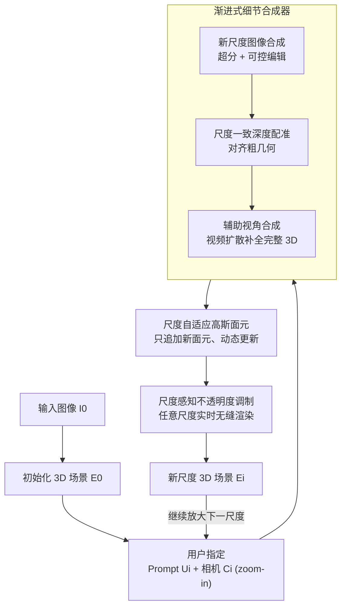

# WonderZoom: Multi-Scale 3D World Generation

**会议**: CVPR 2026  
**论文**: [CVF Open Access](https://openaccess.thecvf.com/content/CVPR2026/html/Cao_WonderZoom_Multi-Scale_3D_World_Generation_CVPR_2026_paper.html)  
**代码**: [wonderzoom.github.io](https://wonderzoom.github.io/)（项目主页，承诺开源）  
**领域**: 3D视觉  
**关键词**: 多尺度3D生成, 高斯面元, 世界生成, 渐进式合成, 实时渲染  

## 一句话总结
WonderZoom 从单张图像出发，让用户可以交互式地"放大"3D 场景的任意区域，自回归地合成原本不存在的更精细尺度内容（从大地景观一路到瓢虫趴在花瓣上的微观细节），靠一种可增量更新的尺度自适应高斯面元表示 + 一个渐进式细节合成器，在质量和文本对齐上大幅超过现有视频和 3D 世界生成模型。

## 研究背景与动机
**领域现状**：3D 世界生成（从最少输入合成沉浸式 3D 环境）近年很火，WonderJourney、WonderWorld、LucidDreamer、CAT3D、HunyuanWorld 等方法已经能从单图/文本生成房间级、景观级甚至城市级的可漫游 3D 场景。

**现有痛点**：这些方法全都被锁死在**单一空间尺度**——你给它一张田野的图，它能生成整片田野让你平移漫游，但你没法"凑近看"田野里一朵向日葵上的一只瓢虫。它们要么生成景观、要么生成房间、要么生成城市，但生不出跨尺度连贯的内容。一旦强行 zoom-in，3D 方法（高斯面元/网格）只会渲染出模糊的放大图，因为那个尺度的细节从一开始就不存在。

**核心矛盾**：根子在于**缺一个适合"生成"的尺度自适应 3D 表示**。传统 LoD（细节层次）和近期的层次化表示（Hierarchical 3DGS、Mip-NeRF、Octree-GS）都假设所有尺度的图像/几何**一开始就全部可得**，做的是一次性优化的"渲染/重建"。但生成的本质是相反的：图像一开始不存在，必须**先造粗尺度、再以粗结构 + 用户 prompt 为条件迭代造细尺度**。这要求表示能随新内容**动态生长**，而不是一个预先优化好的静态层次。直接套层次化表示就得"同时生成所有尺度"，计算上不可行，也违背了多尺度合成天然的由粗到细顺序。

**本文目标**：(1) 设计一个能边生成边长大、且任意尺度都实时可渲染的 3D 表示；(2) 设计一个能根据用户 prompt 在指定区域合成**全新**细尺度结构、同时与粗尺度几何/外观保持一致的生成器。

**核心 idea**：用"可增量追加面元 + 按原生尺度调制不透明度"的尺度自适应高斯面元，搭配"超分→编辑→深度配准→辅助视角"的渐进式细节合成器，把 3D 世界生成从"重建范式"转成真正的"由粗到细多尺度生成范式"。

## 方法详解

### 整体框架
给定输入图像 $I_0$、一串用户 prompt $\{U_1,\dots,U_n\}$ 和对应逐步 zoom-in 的相机视角 $\{C_0,\dots,C_n\}$，WonderZoom 要生成一串空间粒度递增的 3D 场景 $\{E_0,E_1,\dots,E_n\}$，其中 $E_0$ 是从输入图重建的初始场景，每个 $E_i$（$i>0$）在空间上嵌套在 $E_{i-1}$ 内部、代表更精细的内容。整个流程是一个交互式控制回环：用户在当前场景里选一块区域并给一句 prompt，系统就在那个尺度合成新内容、并入 3D 表示，循环往复，理论上可以无限放大。

每一轮"放大"由两大组件协同完成。**渐进式细节合成器**先把目标区域渲染成一张粗观测，经超分+语义编辑造出新尺度图像，再做尺度一致的深度配准、并用视频扩散补出辅助视角，从而得到一套完整的新尺度图像-深度对。这些图像-深度对被**尺度自适应高斯面元**以"只追加、不改旧面元"的方式动态并入表示；而**尺度感知不透明度调制**保证无论从哪个尺度观看，都只显示该尺度该有的面元，从而实时无缝渲染。

### 关键设计

**1. 尺度自适应高斯面元：靠"只追加不改旧"实现可生长的 3D 画布**

痛点是层次化表示都假设所有尺度一次性优化好，没法边生成边长大。WonderZoom 把场景建成一组高斯面元 $\{g_j\}$，每个面元 $g=\{p,q,s,o,c,s^{\text{native}}\}$，相比以往多了一个关键属性 $s^{\text{native}}$——它**被创建时所处的原生尺度**，这是后面实现尺度感知渲染的钥匙。动态更新的机制极其朴素却管用：从 $I_0$ 造 $E_0$ 时生成 $N_0$ 个面元；当用户 zoom 到 $C_1$ 造 $E_1$ 时，**只新增** $N_1$ 个面元，总数变成 $N_0+N_1$；造 $E_i$ 时再追加 $N_i$ 个，总数 $N=\sum_{k=0}^{i}N_k$。关键在于**旧尺度的面元一个都不动**，每个新尺度只是往已有表示上"附加"细节。

这样多尺度世界就像用户探索到哪、细节就在哪有机生长，完全避免了"重新全局优化"。新面元按 prior work 的做法做像素对齐初始化：位置 $p$ 由估计深度反投影、朝向 $q$ 由表面法向、尺度 $s$ 按 Nyquist 采样定理取以保证覆盖不过度重叠，颜色取像素 RGB，不透明度初始化为 $o=0.1$；随后用 Adam 在光度损失 $\mathcal{L}=0.8\mathcal{L}_1+0.2\mathcal{L}_{\text{D-SSIM}}$ 下只微调不透明度/朝向/尺度（位置、颜色、原生尺度冻结）。轻量优化既精修了几何，又不破坏多尺度结构。

**2. 尺度感知不透明度调制：用原生尺度做"软 LoD"，避免堆叠模糊与卡顿**

只追加不删的代价是：同一块表面会被 $E_0$ 到 $E_i$ 多层面元覆盖，直接全渲染既会混叠模糊又拖慢速度。本设计让每个面元只在自己"该出现"的尺度最显眼、偏离时平滑淡出。先给面元定义原生尺度 $s^{\text{native}}=d^{\text{native}}/\sqrt{f_x^{\text{native}}f_y^{\text{native}}}$（$d^{\text{native}}$ 是面元相对其创建相机 $C_i$ 的深度，$f$ 是焦距）；渲染时在相机 $C_{\text{render}}$ 下算出当前渲染尺度 $s^{\text{render}}=d^{\text{render}}/\sqrt{f_x^{\text{render}}f_y^{\text{render}}}$。最终不透明度被调制为 $\tilde o = o\cdot\alpha$，其中 $\alpha$ 在原生尺度处取 1、在父/子尺度边界间按对数空间线性插值，超出范围则取 0：

$$\alpha=\begin{cases}\dfrac{\log(s^{\text{parent}})-\log(s^{\text{render}})}{\log(s^{\text{parent}})-\log(s^{\text{native}})} & s^{\text{parent}}\ge s^{\text{render}}\ge s^{\text{native}}\\[2mm]\dfrac{\log(s^{\text{render}})-\log(s^{\text{child}})}{\log(s^{\text{native}})-\log(s^{\text{child}})} & s^{\text{native}}\ge s^{\text{render}}\ge s^{\text{child}}\\[1mm]1 & \text{无父且 } s^{\text{render}}\ge s^{\text{native}}\text{，或无子且 }s^{\text{render}}\le s^{\text{native}}\\0 & \text{otherwise}\end{cases}$$

这设计妙在它构成了**单位分解**（Proposition 1）：同位置相邻尺度的两个面元 $g_j,g_k$，当渲染尺度在二者原生尺度之间时，$\alpha_k+\alpha_j=1$——因为一个在对数空间递减、另一个互补递增，恰好抵消。于是 zoom 过程中重叠面元的总贡献恒为常数，消除了"突然弹出"（popping）的跳变，让跨尺度过渡视觉连续。最粗尺度面元在拉远时始终全可见、最细尺度面元在拉近时始终全可见，保证任意观看尺度都有完整覆盖。消融（表 3）显示去掉它后显存 7.96G、帧率仅 1.4 FPS（多尺度实时渲染不可行且渲染模糊），加上它降到 3.40G、97.2 FPS。

**3. 渐进式细节合成器：超分→编辑→深度配准→辅助视角，造出连贯的全新细尺度内容**

痛点是 zoom-in 后那个尺度的图像根本不存在，且 prompt 常要求**全新结构**（如花上的瓢虫），简单超分搞不出语义内容。合成器分三阶段。**(a) 新尺度图像合成**：先把上一尺度场景渲染成粗观测 $O_i=\text{render}(E_{i-1},C_i)$（$C_i$ 焦距更大以放大目标区域），由于 $O_i$ 缺细节，用极端超分补高频；但极端放大需要额外语义引导，于是用 VLM 从上一尺度提取语义上下文 $S=\text{VLM}(O_{i-1})$，得到 $I'_i=\text{SR}(O_i,S)$；再用可控图像编辑模型 $I_i=\text{Edit}(I'_i,U_i)$ 把用户指定的新结构插进去——超分负责忠实增强已有结构，编辑负责注入全新内容。

**(b) 尺度一致深度配准**：为让新内容几何上贴合 $E_{i-1}$，先从已有几何渲染目标深度 $D_i^{\text{target}}=\text{render\_depth}(E_{i-1},C_i)$，再微调单目深度估计器 $\mathcal{D}_\theta$ 去对齐它，损失只在已定义区域 $m(u,v)=1$ 上算掩码加权 $L_1$：$\mathcal{L}_{\text{depth}}=\frac{\sum_{u,v}\|D_i^{\text{target}}(u,v)-\mathcal{D}_\theta(I_i)(u,v)\|\cdot m(u,v)}{\sum_{u,v}m(u,v)}$，对 zoom-in 新露出的未定义区域不约束；再用 SAM 掩码做分段深度对齐、用 Grounded SAM 圈出编辑新增结构单独估深，消除局部不一致。消融显示去掉它，新生成的甲虫从新视角看会严重扭曲变形。**(c) 辅助视角合成**：单张 $I_i$ 不足以重建可任意视角渲染的完整 3D，于是用相机可控的视频扩散模型，从 $I_i$ 临时建的局部场景 $E_i^{\text{partial}}$ 渲染出邻近视角条件帧 $\{O_i^k\}$ 与需补全区域的掩码 $\{M_i^k\}$，生成时序一致的 $\{I_i^k\}=\text{VideoDiff}(\{O_i^k\},\{M_i^k\})$，再估其视频深度，这些图像-深度对就能优化出完整的 $E_i$。消融显示去掉它，新视角会出现成片缺失的灰色空洞。

### 损失函数 / 训练策略
本方法不训练大模型，而是组装现成基础模型并对每个尺度做轻量优化：面元参数用 Adam 在光度损失 $\mathcal{L}=0.8\mathcal{L}_1+0.2\mathcal{L}_{\text{D-SSIM}}$ 下微调；深度配准用掩码加权 $L_1$ 微调单目深度器。实现上超分用 Chain-of-Zoom，辅助视角视频扩散用 Gen3C，图像深度用 MoGe、视频深度用 GeometryCrafter，语义引导用 VLM、新结构分割用 Grounded SAM。

## 实验关键数据

### 主实验
在 8 张测试输入图（田野、城市、森林、水下等，含向日葵/珊瑚两张合成图）上各生成 4 个新尺度场景（共 32 个场景，即 $\{E_0,\dots,E_4\}$），固定相机路径与文本 prompt 公平对比。基线包括 3D 世界生成的 WonderWorld、HunyuanWorld，以及相机可控视频生成的 Gen3C、Voyager（均无多尺度生成能力，作者称是首个）。

| 方法 | CLIP score↑ | CLIP-IQA+↑ | Q-align IQA↑ | NIQE↓ | Q-align IAA↑ | 生成耗时/s |
|------|------|------|------|------|------|------|
| WonderWorld | 0.2687 | 0.5064 | 1.081 | 21.74 | 1.339 | 9.3 |
| HunyuanWorld | 0.2510 | 0.2827 | 1.058 | 15.21 | 1.302 | 704.2 |
| Gen3C | 0.3004 | 0.5489 | 2.992 | 4.924 | 2.018 | 306.7 |
| Voyager | 0.2609 | 0.5746 | 3.148 | 4.913 | 2.929 | 596.6 |
| **WonderZoom (Ours)** | **0.3432** | **0.7035** | **3.926** | **3.695** | **2.986** | 62.1 |

WonderZoom 在文本对齐、新视角图像质量、美学指标上全面领先，且耗时（62.1s/尺度）远低于同档视频/3D 方法（仅慢于质量极差的 WonderWorld）。另有 200 组人类 2AFC 偏好研究：

| 对比 | Zoom-in 准确度 | 视觉质量 | Prompt 匹配 |
|------|------|------|------|
| vs WonderWorld | 80.7% | 98.3% | 98.2% |
| vs HunyuanWorld | 83.2% | 98.7% | 98.9% |
| vs Gen3C | 77.8% | 83.8% | 96.1% |
| vs Voyager | 76.1% | 81.7% | 90.9% |

人类在所有维度上压倒性偏好 WonderZoom（视觉质量/prompt 匹配普遍 >90%）。

### 消融实验
| 配置 | 关键指标 | 说明 |
|------|---------|------|
| Full model | 3.40G 显存 / 97.2 FPS | 完整模型 |
| w/o 不透明度调制 | 7.96G 显存 / 1.4 FPS | 多尺度实时渲染不可行，且渲染模糊 |
| w/o 深度配准 | 新结构几何扭曲 | 新生成甲虫从新视角看严重变形 |
| w/o 辅助视角合成 | 成片缺失 | 新视角出现灰色空洞，3D 不完整 |

### 关键发现
- **不透明度调制是实时多尺度渲染的命门**：去掉后帧率从 97.2 暴跌到 1.4 FPS、显存翻倍，因为同一表面多层面元被一起渲染，既混叠模糊又卡顿。
- **深度配准决定跨尺度几何一致性**：没有它，编辑插入的新结构在新视角下会扭曲，因为新内容的深度与粗尺度几何对不上。
- **辅助视角合成决定 3D 完整性**：单视角图像只能覆盖目标视角，靠视频扩散补邻近视角才能填掉遮挡空洞，否则一漫游就露馅。
- **质量与效率兼得**：在质量全面领先的同时耗时比 Gen3C/Voyager 低 5-10 倍。

## 亮点与洞察
- **把"LoD"从硬切换变成可微的软混合**：用原生尺度 + 对数空间不透明度插值构成单位分解，相邻尺度面元的不透明度此消彼长恒和为 1，从原理上消除 popping。这个"软 LoD"思路可迁移到任何需要跨尺度/跨细节层平滑过渡的高斯表示。
- **"只追加不改旧"把生成和实时渲染解耦**：旧面元永远冻结，新尺度只往上长，避免了全局重优化的算力爆炸——这是它能交互式无限放大的根本。
- **明确区分"超分"与"生成"**：超分忠实增强已有结构，可控编辑负责注入 prompt 指定的全新内容，二者分工让"凑近看花发现一只原本不存在的瓢虫"成为可能，而不是单纯把模糊图变清晰。
- **全用现成基础模型拼装**：超分(Chain-of-Zoom)、视频扩散(Gen3C)、深度(MoGe/GeometryCrafter)、分割(Grounded SAM)即插即用，无需训练大模型，工程上易复现、易随基础模型升级而变强。

## 局限与展望
- **强依赖一长串外部基础模型**：超分、VLM、编辑、视频扩散、深度、分割任一环节出错都会传导到 3D，且整体质量上限被这些模型钳制。
- **新内容是"想象"而非真实**：放大后看到的瓢虫/蜥蜴是生成器编出来的，不来自输入图，缺乏物理/语义正确性保证，不适合需要真实细节的场景（如工业检测、文物数字化）。
- **逐尺度顺序生成、需用户在回环里指定 prompt 与相机**：是交互式而非全自动，且每个尺度 62s 的耗时在很多尺度的深放大下会累积。
- **评测规模偏小**（8 张输入图、32 个场景、200 组 2AFC），且因是首个多尺度方法，基线都被迫在它们不擅长的设定下比较，绝对领先幅度需谨慎解读。
- 可改进方向：把多个基础模型蒸馏成一个统一模型以提速、引入物理/语义先验约束生成内容、支持跨尺度内容的回溯编辑。

## 相关工作与启发
- **vs WonderWorld / HunyuanWorld（3D 世界生成）**：它们用高斯面元/网格生成单尺度可漫游场景，表示在新尺度图像到来时无法动态更新，zoom-in 只能渲染模糊放大图；WonderZoom 让表示能增量生长 + 软 LoD 渲染，真正生成新尺度内容。
- **vs Gen3C / Voyager（相机可控视频生成）**：它们能 zoom 但控制不精确、生成视角与 prompt 不对齐、且无显式 3D；WonderZoom 有显式 3D 面元、prompt 对齐更紧、还能任意视角实时渲染。
- **vs Hierarchical 3DGS / Mip-NeRF / Octree-GS（多尺度重建表示）**：它们假设所有尺度图像一次性可得做静态层次优化，与生成范式根本冲突；WonderZoom 的尺度自适应面元专为"边生成边长大"设计。
- **vs Generative Powers of Ten（2D 无限放大）**：后者靠协同扩散在 2D 上做无限 zoom，仅限图像；WonderZoom 把跨尺度生成真正搬到了 3D，支持任意视角漫游。

## 评分
- 新颖性: ⭐⭐⭐⭐⭐ 首次实现单图多尺度 3D 世界生成，软 LoD 不透明度调制 + 可增量面元是扎实的新机制。
- 实验充分度: ⭐⭐⭐⭐ 指标全面、消融到位、人类研究有力，但测试集偏小、基线被迫跨设定比较。
- 写作质量: ⭐⭐⭐⭐⭐ 动机层层递进、把"为何生成与重建范式冲突"讲得很透，公式与命题清晰。
- 价值: ⭐⭐⭐⭐⭐ 为交互式内容创作和虚拟世界探索开了"无限放大"的新维度，工程上用现成模型即可复现。

<!-- RELATED:START -->

## 相关论文

- [\[CVPR 2026\] OLATverse: A Large-scale Real-world Object Dataset with Precise Lighting Control](olatverse_a_large-scale_real-world_object_dataset_with_precise_lighting_control.md)
- [\[CVPR 2026\] Extend3D: Town-Scale 3D Generation](extend3d_town-scale_3d_generation.md)
- [\[CVPR 2026\] RayNova: Scale-Temporal Autoregressive World Modeling in Ray Space](raynova_scale-temporal_autoregressive_world_modeling_in_ray_space.md)
- [\[CVPR 2026\] Multi-view Consistent 3D Gaussian Head Avatars 'without' Multi-view Generation](multi-view_consistent_3d_gaussian_head_avatars_without_multi-view_generation.md)
- [\[CVPR 2026\] PointNSP: Autoregressive 3D Point Cloud Generation with Next-Scale Level-of-Detail Prediction](pointnsp_autoregressive_3d_point_cloud_generation_with_next-scale_level-of-detai.md)

<!-- RELATED:END -->
