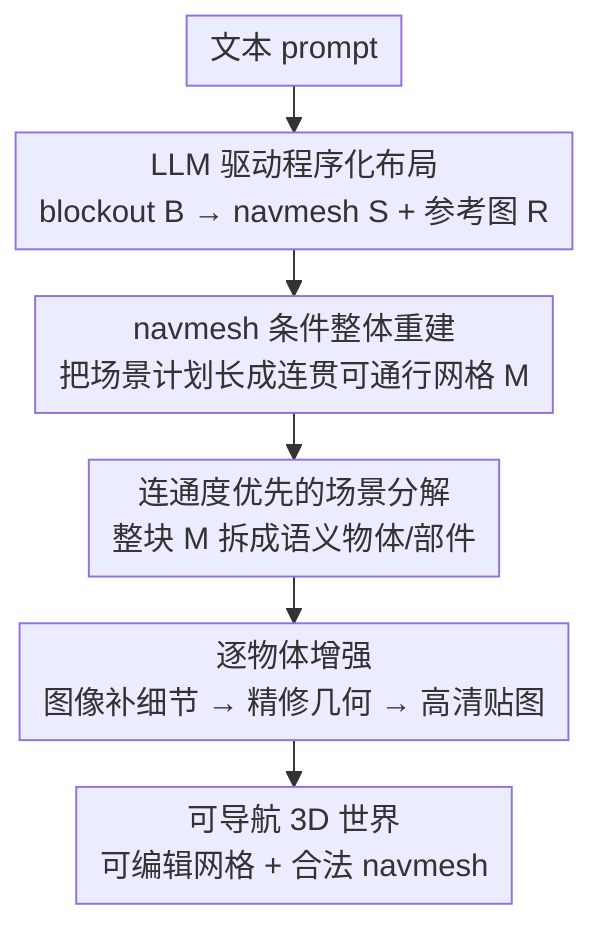

# WorldGen: From Text to Traversable and Interactive 3D Worlds

**会议**: CVPR 2026  
**论文**: [CVF Open Access](https://openaccess.thecvf.com/content/CVPR2026/html/Wang_WorldGen_From_Text_to_Traversable_and_Interactive_3D_Worlds_CVPR_2026_paper.html)  
**代码**: 待确认（Reality Labs, Meta）  
**领域**: 3D视觉 / 文本到3D场景生成  
**关键词**: 文本到3D世界、可导航场景、navmesh 条件生成、组合式3D重建、游戏资产

## 一句话总结
WorldGen 把"文本 → 一整个可行走、可编辑的 3D 世界"拆成「程序化布局 → navmesh 条件整体重建 → 场景分解 → 逐物体增强」四阶段流水线，用 LLM 驱动的程序化生成器先锁死可通行结构，再借图像生成器与 image-to-3D 先验补全外观与细节，约 5 分钟产出一个可直接塞进游戏引擎、角色能爬能跳的 50×50 米场景。

## 研究背景与动机

**领域现状**：3D 生成式 AI 已经能让外行打一句 prompt 就拿到高质量带贴图的 3D 网格，但这类模型（TRELLIS、各种 image-to-3D）基本只会造**单个物体**。要生成一整关"游戏世界"——既好看、又能让角色从头走到尾不卡住——仍然基本是个 open problem。

**现有痛点**：现有 3D 场景生成路线各有取舍，没法兼得多样性、完整性、正确性。视角式生成（Text2Room、Text2NeRF、SynCity 等）用 2D/视频生成器一帧帧扩展再重建，结果是**单块、不可分解**的几何，分辨率低、有拼贴瑕疵；组合式方法把物体摆在一起，但规模上不去（只能摆几件物体）、且缺乏上下文推理，物体之间对不齐、遮挡区域一塌糊涂；3D latent 模型（SceneFactor、BlockFusion、NuiScene 等）能直接出完整场景网格，却因 3D 场景训练数据稀缺而缺乏多样性，且常没有物体结构和贴图。

**核心矛盾**：训练一个端到端"文本→功能完整 3D 世界"的生成器，根本缺**大规模带标注的 3D 场景数据集**；同时，纯图像/3D 生成器天然不保证产物"可通行"——它们没有任何机制去约束角色能不能走过去。

**本文目标**：从单条文本 prompt 端到端生成大尺度、完全成形、可自由导航、且分解成一个个可编辑高质量网格的 3D 世界，且产物能直接在标准游戏引擎里跑（支持碰撞、寻路）。

**切入角度**：程序化生成器（PG）虽然"窄"（基于代码和规则、多样性差），却能轻松强制结构约束、给出场景主体量块和可行走面（即 navmesh）；图像/3D 生成器多样性强却管不住功能性。作者的观察是——**让 PG 管功能、让生成器管外观，两者互补**。

**核心 idea**：用 LLM 驱动的程序化布局产出"功能正确的骨架（blockout + navmesh + 参考图）"，再用 **navmesh 条件的整体式 image-to-3D 扩散**把骨架长成连贯、可通行的场景网格，最后分解成物体逐个增强——把"可导航性"作为硬约束注入生成，而不是事后修补。

## 方法详解

### 整体框架

WorldGen 是一条四阶段串行流水线，输入是一条文本 prompt $y$，输出是一个分解成若干高保真、可编辑网格、且自带合法 navmesh 的可导航 3D 世界。四个阶段各司其职：

1. **Stage I 场景规划（Scene Planning）**：LLM 把 prompt 解析成 JSON 参数，驱动程序化生成器造出粗块布局 $B$，再从中导出可导航网格 $S$（navmesh）和参考图 $R$，三者构成"场景计划" $L=(B,R,S)$。这一步保证布局功能正确、可端到端通行。
2. **Stage II 场景重建（Scene Reconstruction）**：用 navmesh 条件的 image-to-3D 扩散，把场景计划长成一个整体网格 $M$，既贴合参考图外观、又严守 navmesh 编码的可通行区域（即便在参考图里看不见的遮挡区也保持连贯）。
3. **Stage III 场景分解（Scene Decomposition）**：把 Stage II 出的"一整块"网格 $M$ 自回归地拆成语义上有意义的物体/部件，便于单独编辑增强；并对原始 AutoPartGen 做加速与场景适配。
4. **Stage IV 场景增强（Scene Enhancement）**：逐物体生成高分辨率图像补细节 → 用 mesh 增强模型精修几何 → 生成高质量贴图，最终得到游戏可用的资产。

整条管线约 5 分钟跑完（很多子模块如逐物体增强、贴图生成跨 GPU 并行）。

### 关键设计

**1. LLM 驱动的程序化布局：让"窄但可控"的 PG 先锁死可通行结构**

痛点是图像/3D 生成器管不住功能性，而 PG 恰好擅长强制结构约束。作者搭了一条文本条件的程序化生成（PG）流水线，前端挂一个 LLM 把 prompt $y$ 翻译成地形与布局参数的 JSON，直接配置 PG。PG 分三步造 blockout $B$：**地形生成**（搭出高程、坡度、平地这种大尺度几何，决定结构与通路能放在哪）、**空间划分**（把地形切成开阔区/建筑簇/过渡区等不同功能区域，保证密度有变化又维持可导航）、**层次化资产摆放**（先放地标大件定结构和视觉焦点，再放小物件和装饰加细节）。

$B$ 是由地面平面和盒子等简单基元组成的 3D 网格，是一个可编辑的结构脚手架。从它出发：navmesh $S$ 用 Recast 这类标准算法直接从实心几何里抽出；参考图 $R$ 则把 $B$ 渲成等距投影深度图（相机仰角约 $45°$ 以最大化场景可见覆盖），再喂给深度条件的图像生成器。一个小 trick 是对非地形深度值加一点正比于深度的高斯扰动，避免生成图里出现过于刻板的直角轮廓，让结构线条更自然。这样 PG 负责功能、图像生成器负责主题/风格/细节，分工互补。

**2. navmesh 条件的整体式重建：把"可导航"作为硬条件注入 3D 扩散**

痛点是没有 3D 场景数据集可训"navmesh 条件 image-to-3D"，且生成器默认不保证可通行。作者的解法分两层。其一是**两阶段训练**：先在一大批通用物体类别上预训一个 image-to-3D 模型（VecSet 式的 latent 3D diffusion transformer）学到稳健的 3D 重建先验，再在自采的场景三元组 $(M,R,S)$ 上微调。其二是**navmesh 编码与条件注入**：用类 VecSet 编码器对 navmesh $S$ 做 tokenize——先在 $S$ 表面均匀采点得稠密点云 $P\in\mathbb{R}^{M\times3}$，再用最远点采样下采到稀疏集 $\hat{P}=\mathrm{FPS}(P\,|\,K)\in\mathbb{R}^{K\times3}$，两组点各自用坐标位置编码映成 $D$ 维特征，让稀疏点通过 cross-attention 去 attend 稠密点以吸收细粒度几何，最后把稀疏 navmesh embedding 经额外 cross-attention 层注入去噪扩散 transformer 主干。

一个关键经验：作者对比"只更新新增 cross-attention 层"和"端到端微调整个 transformer"，发现前者在 navmesh 对齐（Chamfer 距离）上**退化 25%**——说明让网格忠实贴合 navmesh 需要全网络联合适配，单靠新增条件层做不到这种非平凡的几何对齐与场景级补全。数据归一化上，模型工作在 $[-1,1]^3$ 归一空间，训练时用对应场景网格算出的尺度因子去缩放 navmesh、并平移使 navmesh 地平面落在原点 $(0,0,0)$，给出稳定空间参照；推理时无 ground-truth 场景网格，就改用 PG blockout $B$ 的尺度来归一。这套设计的价值在 Fig. 5 体现得很直接：编辑 2D 参考图来精确表达空间意图很麻烦甚至不可行（单视图投影本身有歧义），而**直接在 3D 里改 navmesh**就能删结构腾出可走空间、降低建筑高度、压低地形成凹地——模型不是照抄参考图，而是真的在推理空间组织与可导航性。

**3. 连通度优先 + 余量 token 的场景分解：把 AutoPartGen 从物体级救到场景级**

Stage II 出的是一整块融合所有物体的单网格 $M$，难以单独编辑。作者基于 AutoPartGen（自回归地、每个部件以整体网格和已生成部件为条件依次生成）做分解，但它有两个致命伤：自回归推理慢、且只在物体级数据上训过、泛化不到大场景。

针对"慢"，作者**改生成顺序**：AutoPartGen 按固定字典序（z-x-y）出部件，WorldGen 改成按**连通度**（一个部件与多少其他部件碰撞）降序生成，优先产出连接众多组件的"枢纽部件"（pivot）。例如户外场景里地面往往连通度最高，先把地面抽出来，其余物体就能靠残余几何的连通分量分析高效恢复。为支持这一点，作者扩展 AutoPartGen 用一个**二值 flag token**显式把"余量几何"当成一个特殊部件——激活后模型一次前向就吐出所有剩余几何。实际用五步调度：先生成 4 个 pivot 部件，再生成 remainder 部件，最后对它做连通分量分析。这把复杂场景的分解时间从 **10 分钟压到约 1 分钟**。针对"泛化差"，作者**自建场景级部件数据集**：先用 VLM 从大型内部 3D 资产库里挑出"像完整场景"的资产（看渲染图判断物体多样性、布局合理性、有无地面上下文），再用启发式流水线把原始几何转成有意义的物体/部件分解——四步是 (1) 顶点焊接后检测拓扑连通分量当最小部件、(2) 检测地面并把交通线之类薄覆盖物合并为独立部件、(3) 去重并把小部件迭代合并到最近邻而保持地面独立、(4) 按部件数/不均衡度/地面置信度等质量约束过滤。

**4. 三步逐物体增强 + 全局上下文校验：把粗网格升级成游戏可用资产并防风格漂移**

分解出的物体几何分辨率不够、贴图也只是 Stage 早期的粗略材质。Stage IV 分三步精修：先**逐物体图像增强**补细节，再用 mesh 增强模型 [57]（在 baseline image-to-3D 上额外条件于粗网格 VAE latent）**精修几何**且保持与原几何对齐以免装不回场景，最后基于精修几何与高清图**生成高质量贴图**（微调文生图扩散出法线/位置图条件的多视图渲染，反投影到 UV）。

这一步最巧的是**风格一致性**的处理。作者先用 TRELLIS 给整块粗网格上初始粗贴图（TRELLIS 直接在 3D 工作、对自遮挡更鲁棒，虽分辨率低但只需提供大致材质/风格线索；因其主要训于物体级，作者在含物体+场景级的自有数据上重训）。然后用一个 LLM-VLM 逐物体增强外观——难点在于各物体独立增强极易在颜色/材质/画风上漂移，于是对每个物体额外渲一张"整场景俯视图、把目标物体高亮成橙色"喂给生成器，明确告诉它该物体在全局里的位置，再附上全局参考图作为上下文。最后加一道**校验**：把增强图和粗渲染比对，轮廓偏离太多就拒绝、反复增强直到拿到对齐良好的结果，防止生成式增强幻觉出不想要的改动。

### 一个完整示例：从 "medieval village" prompt 到可走世界

给 prompt"medieval village"：① LLM 解析出地形/布局 JSON，PG 先造平地+缓坡地形，划出村庄聚落区与开阔过渡区，先摆教堂/城门等地标再撒小屋与杂物，得到 blockout $B$；从 $B$ 抽出 navmesh $S$、渲 $45°$ 等距深度图经图像生成器得参考图 $R$。② navmesh 条件扩散把 $L=(B,R,S)$ 长成一整块连贯网格 $M$，街道平整、遮挡处的建筑也补全，角色能从村口走到村尾。③ 按连通度先抽地面（最高连通度），4 个 pivot + remainder 五步分解，约 1 分钟把整村拆成一栋栋房子、一棵棵树。④ 逐物体补高清图（带橙色高亮俯视图保风格一致）、精修几何、生成贴图，必要时校验重做。最终一个约 $50\times50$ m、风格统一、可自由导航的中世纪村庄世界，直接可塞进游戏引擎。

## 实验关键数据

### 主实验：navmesh 对齐（Chamfer 距离，越低越好）

在 50 个程序化场景（中等垂直起伏 + 10–30 个密集物体）的 benchmark 上，从生成场景里抽 navmesh、归一到 $[-1,1]^3$、ICP 对齐到 ground-truth navmesh 后算 Chamfer 距离。WorldGen 比各 baseline 低 **40–50%**。

| 模型 | NavMesh Chamfer ↓ |
|------|-------------------|
| Model A | 0.038 |
| Model B | 0.049 |
| Model C | 0.048 |
| Baseline | 0.042 |
| Baseline*（在本文场景三元组上训） | 0.038 |
| **Ours** | **0.022** |

### 场景分解：质量与速度（Table 2）

逐 ground-truth 部件找最近邻预测、算 Chamfer 与不同阈值 F-score；本文在全部指标领先且推理最快。

| 模型 | Chamfer ↓ | F-score@0.01 ↑ | F-score@0.05 ↑ | 时间 |
|------|-----------|----------------|----------------|------|
| Top PartGen Model A | 0.171 | 0.090 | 0.443 | 1 min |
| Top PartGen Model B | 0.136 | 0.155 | 0.633 | 3 min |
| AutoPartGen | 0.144 | 0.281 | 0.683 | 10 min |
| **Ours** | **0.061** | **0.322** | **0.853** | **1 min** |

### 消融与关键设计分析

| 配置 | 关键指标 | 说明 |
|------|---------|------|
| 端到端微调整个 transformer（Full） | navmesh 对齐最佳 | 完整方案 |
| 只更新新增 cross-attention 层 | navmesh 对齐 **退化 25%**（Chamfer） | 单靠条件层做不到非平凡几何对齐与场景级补全 |
| 连通度优先 + remainder token 调度 | 分解时间 10 min → **~1 min** | 先出 4 个 pivot + remainder，再连通分量分析 |

### 关键发现
- **可导航性是硬约束才有效**：navmesh 条件直接把 Chamfer 砍掉 40–50%，且模型在参考图与 navmesh 故意不一致时（Fig. 5）仍按 navmesh 推理空间结构，说明它学到的是"空间组织"而非照抄参考图。
- **条件注入必须深入主干**：只调新增层就退化 25%，印证 navmesh→网格的几何对齐需要全网络联合适配。
- **生成顺序决定效率**：把分解顺序从字典序换成连通度降序、并显式生成 remainder，是把 10 分钟压到 1 分钟的关键——枢纽部件（如地面）先定，其余靠连通分量分析顺出。
- **风格一致靠全局上下文 + 校验**：俯视图橙色高亮 + 全局参考图喂 LLM-VLM，再加轮廓校验拒绝幻觉，避免逐物体独立增强时的颜色/材质漂移。
- **整体 vs 单视图**：相比 Marble（从单视点用高斯泼溅向外扩展），WorldGen 的显式几何在约 $50\times50$ m 范围内几何与风格一致、可自由导航；Marble 离初始视点越远保真度越掉。

## 亮点与洞察
- **"功能交给 PG、外观交给生成器"的分工**很干净：用程序化布局强制可通行性这个硬约束，绕开了"3D 场景数据稀缺"和"生成器不保证功能"两个老大难，是值得迁移到任何"需要功能正确性的生成任务"的范式（如室内布局、关卡设计）。
- **navmesh 作为 3D 可编辑条件**比编辑 2D 参考图优雅得多——单视图投影有歧义，直接在 3D 改可行走面再让模型重生成，编辑语义清晰且可精确指定。
- **连通度优先 + remainder flag token** 把自回归分解的速度瓶颈一举解决，"先抽枢纽再连通分量补余量"的思路对任何自回归部件生成都通用。
- **整体重建再分解** 而非"先分割再各自重建"，从根上解决了遮挡区物体对不齐的问题——先在上下文里整体重建，再拆，保证物体之间装得回去。

## 局限与展望
- **单参考视图的天花板**：依赖单张参考图，目前只能生成有界、单层场景，做不了无界或多层（楼上楼下）世界；作者建议用增量生成（如 SynCity）补。
- **无资产实例化（复用）**：密集区域里相同资产不复用，渲染效率受影响；未来可做材质与几何复用。
- **缺定量用户研究/可玩性指标**：评测集中在 navmesh Chamfer 与分解质量，"世界好不好玩、沉浸感如何"主要靠定性图与视频，缺乏端到端的人类偏好/可玩性量化。
- **依赖大量内部资产与闭源子模型**：数据来自 Meta 内部 3D 资产库、对比的 image-to-3D/PartGen 多为匿名"Model A/B/C"与商用系统，复现门槛高。

## 相关工作与启发
- **vs 视角式生成（Text2Room / Text2NeRF / SynCity）**：它们用 2D/视频生成器增量扩展再重建，得到单块、不可分解、低分辨率且有拼贴瑕疵的几何；WorldGen 产出**分解成独立网格、带合法 navmesh**的显式几何，可编辑、可导航、可直接进引擎。
- **vs 组合式场景生成（检索/即时生成摆物体）**：它们缺上下文推理、规模上不去（几件物体），物体常对不齐；WorldGen 先**整体重建**再分解，保证上下文一致与遮挡区连贯，规模到 $50\times50$ m。
- **vs 3D latent 场景模型（SceneFactor / BlockFusion / NuiScene）**：它们能出完整场景网格但受 3D 场景数据稀缺所限、缺多样性与贴图/物体结构；WorldGen 借**文生图生成器**补足多样性、并显式分解出带贴图的物体。
- **vs AutoPartGen**：本文复用其自回归分解框架，但用连通度顺序 + remainder token 把 10 min 降到 1 min，并在自建场景级数据上微调，泛化到大尺度户外场景。
- **vs Marble（World Labs）**：Marble 从单视点用高斯泼溅向外扩展、近视点保真但远处掉点；WorldGen 面向更大可行走范围与显式几何，全场景几何/风格一致、支持自由导航与交互。

## 评分
- 新颖性: ⭐⭐⭐⭐⭐ 把"可导航性"作为硬约束注入 3D 生成、四阶段"PG 管功能 + 生成器管外观"的组合范式，确实推进了文本到功能完整 3D 世界这个 open problem。
- 实验充分度: ⭐⭐⭐⭐ navmesh 对齐与分解有清晰定量对比，但场景级比较、可玩性多靠定性，且 baseline 多为匿名/商用系统。
- 写作质量: ⭐⭐⭐⭐⭐ 四阶段动机—痛点—解法链路清晰，图示与设计取舍交代到位。
- 价值: ⭐⭐⭐⭐⭐ 端到端 5 分钟出游戏可用、可导航、可编辑的 3D 世界，对交互式内容创作有很强的落地潜力。

<!-- RELATED:START -->

## 相关论文

- [\[CVPR 2026\] Text–Image Conditioned 3D Generation](text-image_conditioned_3d_generation.md)
- [\[ICCV 2025\] Text2VDM: Text to Vector Displacement Maps for Expressive and Interactive 3D Sculpting](../../ICCV2025/3d_vision/text2vdm_text_to_vector_displacement_maps_for_expressive_and_interactive_3d_scul.md)
- [\[CVPR 2026\] Aligning Text, Images and 3D Structure Token-by-Token](aligning_text_images_and_3d_structure_token-by-token.md)
- [\[CVPR 2026\] Are We Ready for RL in Text-to-3D Generation? A Progressive Investigation](are_we_ready_for_rl_in_text-to-3d_generation_a_progressive_investigation.md)
- [\[CVPR 2026\] DynamicTree: Interactive Real Tree Animation via Sparse Voxel Spectrum](dynamictree_interactive_real_tree_animation_via_sparse_voxel_spectrum.md)

<!-- RELATED:END -->
