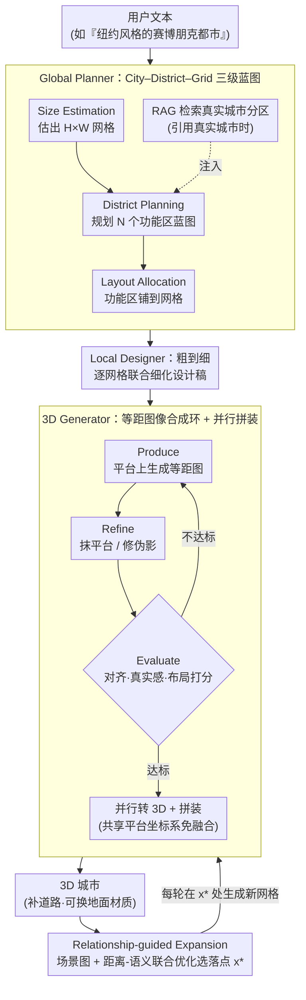

# Yo'City: Personalized and Boundless 3D Realistic City Scene Generation via Self-Critic Expansion

**会议**: CVPR 2026  
**arXiv**: [2511.18734](https://arxiv.org/abs/2511.18734)  
**代码**: 待确认  
**领域**: 3D视觉  
**关键词**: 3D城市生成, 多智能体框架, 层次化规划, 等距图像合成, 场景图扩展, LLM驱动

## 一句话总结

提出 Yo'City 多智能体框架，通过"City–District–Grid"层次化规划 + produce–refine–evaluate 等距图像合成环 + 场景图引导扩展机制，实现用户个性化文本驱动的无界 3D 城市生成，在语义一致性和视觉质量上全面超过 SynCity 等现有方法。

---

## 研究背景与动机

**3D 城市模型需求广泛**：虚拟现实、游戏、城市规划、数字孪生、机器人仿真等场景均依赖高质量 3D 城市模型，但人工建模极为耗时。

**传统方法局限性大**：过程化建模和基于图像的重建方法依赖手工规则或街景数据，扩展性差；基于 GAN/扩散模型的方法需要地图或卫星数据训练，难以处理用户文本输入。

**SynCity 的问题**：SynCity 采用自回归 tile-by-tile 流水线，缺少显式层次化规划，在大规模城市生成时出现空间不一致（部分 tile 密集、部分稀疏）、纹理模糊、几何简化问题。

**LLM/VLM 的机遇**：大语言模型的世界知识和推理能力为城市规划提供了新可能，但 agentic 3D 城市生成仍几乎未被探索。

**核心挑战**：城市是开放、大规模、高度结构化的空间，物体多样性和空间组织密度远超室内场景，需要层次化推理和扩展机制。

---

## 方法详解

### 整体框架

Yo'City 要解决的是一个很拧巴的问题：用户只给一句话（"帮我造一座纽约风格的赛博朋克都市"），系统得自己想清楚城市该有多大、分几个功能区、每个区长什么样，最后还要拼成一座几何一致、可以无限往外长的 3D 城市。它把整件事拆成一条"先想清楚、再生成、再扩展"的流水线，由四个智能体模块接力完成：Global Planner 把抽象文本想成城市级布局，Local Designer 把布局细化到每个网格的设计稿，3D Generator 把每张设计稿变成对齐好的 3D 资产，Expansion Module 则负责让造好的城市继续往外生长。

整座城市被建模成一个 $H \times W$ 的网格 $\mathcal{T} = \{0, \ldots, H-1\} \times \{0, \ldots, W-1\}$，每个 tile $(x, y)$ 对应一块 3D 场景（比如一个住宅小区）。和 SynCity 那种 tile-by-tile 自回归、每块都要看着已生成的邻居才能动笔的做法不同，Yo'City 在拿到全局蓝图后**并行**生成所有 tile——因为布局在规划阶段就已经统一定好，tile 之间不再有因果依赖，既不会让误差一块块累积，也大幅加快了速度。

### 关键设计

**1. Global Planner：把一句抽象文本拆成 City–District–Grid 三级蓝图**

直接让 LLM 一口气吐出全城布局，结果往往是有的区密、有的区空，缺少城市该有的组织感。Global Planner 改成三步逐层落实：先做 **Size Estimation**，让 LLM 根据描述估出城市尺寸 $H \times W$，把每个格子当作最小空间单元；再做 **District Planning**，规划出 $N$ 个功能区并生成蓝图集 $\{B_i \mid i=1,\ldots,N\}$，每个 $B_i$ 写明这个区干什么（如"商业中心"）、放什么建筑（如"高层写字楼"）；最后做 **Layout Allocation**，结合区域间的邻近约束把各功能区铺到 $H \times W$ 网格上，一个区可以横跨多个格子。当用户引用真实城市（"纽约风格"）时，还会从 Wikipedia 语料检索该城市的真实分区结构，经 GPT-4o-mini 提炼后注入规划，让"纽约"这个词有事实依据撑着，而不是 LLM 凭空臆想。

**2. Local Designer：粗到细把功能区蓝图细化成每个网格的设计稿**

蓝图 $\{B_i\}$ 只是粗线条的功能划分，离能生成图像还差一层。Local Designer 以蓝图 $B_i$ 和全局提示 $p_0$ 为条件，为每个网格写出详细设计 $\{d_i \mid i=1,\ldots,H \times W\}$，落到建筑风格、密度、地标、周边环境这些具体维度。关键是它对同一功能区内的所有网格做**联合规划**而非逐格独立生成，保证一个区内部空间和风格的连贯。这套"先全局组织、再局部细化"的粗到细顺序，本质上是给 LLM 留了一段隐式推理的余地——比起逼它一步到位想完全城，分两层想出来的布局明显更合理、更像真实城市。

**3. 3D Generator：produce–refine–evaluate 等距图像环 + 并行拼装**

把网格描述 $d_i$ 直接喂给 text-to-image，常会得到物体错位、建筑缺角的图，转成 3D 后更糟。3D Generator 先用一个迭代循环把等距图像质量卡住：**Produce** 阶段在一个预定义的地面平台上为 $d_i$ 生成初始等距图，平台充当公共锚点，逼所有资产共享同一套尺度和空间对齐；**Refine** 阶段用图像编辑模型抹掉平台、修几何伪影、增视觉多样性；**Evaluate** 阶段由专用评估器从文图对齐、真实感、布局合理性三方面打分，不达标就打回去重生成，直到全部过关。拿到合格的等距图后用预训练 Hunyuan3D 转成 3D 模型，再按 Global Planner 早就定好的布局**并行**摆放——因为所有资产从一开始就锚在同一平台、共享同一坐标系，拼接时**无需任何 3D 融合就能消除边界不一致**，最后补上道路、地面等连接元素，并允许用户按主题换地面材质（古风 / 现代）。

**4. Relationship-guided Expansion：场景图 + 距离-语义联合优化实现无界生长**

真实城市的功能区有内在的邻近规律——住宅挨着学校和商圈，工业区离居民区远。扩展模块就是把这条规律变成一个可优化的放置问题，让城市能一轮轮往外长。给定已渲染的城市和区域概览，VLM 先为待扩展的新网格写出描述 $d_{\text{new}}$，并构建一张**场景图**：新网格作中心节点，它与各现有功能区的边编码定性距离关系（near / relatively near / far）。然后用广度优先搜索框出可行的候选位置集 $\mathcal{X}$，在其中找一个同时满足空间关系和语义兼容的最优落点。空间这边用距离驱动目标，把该拉近的拉近、该推远的推远：

$$L_{\text{dist}}(x) = \sum_{g \in \mathcal{G}} \gamma_{r(g)} \|x - g\|_2$$

其中 $\gamma_{r(g)}$ 是有符号权重，正值表示拉近（proximity）、负值表示推离（separation）。语义这边用一个正则项，鼓励新网格落在与邻居语义相融的地方：

$$L_{\text{sem}}(x) = -\sum_{y \in \mathcal{N}(x)} \text{Embedding\_Sim}(d_{\text{new}}, d_y)$$

相似度基于 Sentence-BERT 嵌入。两项加权合成最终目标，解出最优落点：

$$x^* = \arg\min_{x \in \mathcal{X}} \left[ L_{\text{dist}}(x) + \lambda \, L_{\text{sem}}(x) \right]$$

定下 $x^*$ 后就在该位置调用 3D Generator 生成新网格模型，完成一轮扩展。用户可以反复交互、一轮轮往外加，城市便真正具备了开放世界式的生长能力。

### 一个完整示例：从一句"纽约风格的赛博朋克都市"到一座可生长的 3D 城

> ⚠️ 下面的网格尺寸、功能区个数等具体数字为示意，用于串清模块协同关系，**以原文为准**。

假设用户输入"纽约风格的赛博朋克都市"。Global Planner 先估出城市是个 $4 \times 4$ 的网格，再规划出 4 个功能区——金融中心、居住区、娱乐街区、港口工业区，并把它们铺到 16 个格子上：金融中心占左上角 4 格、居住区占右上 4 格、娱乐街区贴着金融中心、港口工业区压在最下一排远离居民。因为提到"纽约"，RAG 顺手检索到曼哈顿"高密度 CBD + 滨水区"的真实结构，注入后让金融中心的高楼密度更贴近现实。

接着 Local Designer 把这 16 个格子各自细化：金融中心那 4 格写成"玻璃幕墙摩天楼、霓虹广告牌、密集车流"，且 4 格联合规划保证风格统一；港口那几格写成"集装箱码头、起重机、低矮仓库"。

3D Generator 拿着 16 份描述并行开工：每格先在平台上生成等距图，假设港口那张图第一次 Produce 出来起重机悬空、集装箱穿模，Evaluate 打了低分被打回，Refine 修正后第二轮过关。16 张合格图全部转成 3D 模型，按早定好的 $4 \times 4$ 布局直接拼上，边界天然对齐，再铺道路连成整城。

用户看完想再加一个"主题公园"。Expansion 模块让 VLM 写出公园描述并建场景图：与娱乐街区标 near、与港口工业区标 far。BFS 在城市边缘找出若干候选格，距离-语义联合优化算下来，紧邻娱乐街区、远离港口的那个格 $x^*$ 得分最高，于是在那里生成主题公园的 3D 模型——城市就这样长大了一圈。

---

## 实验设置

- **数据集**：100 条城市文本描述（30% 人工编写 + 70% GPT-4o 生成），涵盖多种风格。
- **基线方法**：Trellis（text-to-3D）、Hunyuan3D API（text-to-3D）、CityCraft（布局+资产检索）、SynCity（自回归 tile-by-tile）。
- **实现细节**：GPT-4o 作为 LLM，GPT-Image-1 进行图像编辑，Hunyuan3D API 进行 image-to-3D。

---

## 实验关键数据

### 表 1：城市级定量对比（VQAScore + GPT-5/人类 win rate）

| 方法 | VQAScore | 几何保真度 (GPT-5 / 人类) | 纹理清晰度 (GPT-5 / 人类) | 布局连贯性 (GPT-5 / 人类) | 整体真实感 (GPT-5 / 人类) |
|------|----------|--------------------------|--------------------------|--------------------------|--------------------------|
| Trellis | 0.6189 | 6.5% / 7.0% | 4.5% / 6.0% | 6.5% / 3.5% | 9.0% / 5.0% |
| Hunyuan3D | 0.6198 | 12.0% / 7.0% | 12.5% / 9.5% | 7.0% / 5.5% | 12.0% / 6.5% |
| CityCraft | 0.5639 | 9.5% / 8.0% | 6.0% / 6.0% | 15.0% / 16.5% | 12.0% / 13.5% |
| SynCity | 0.6975 | 15.0% / 12.0% | 21.5% / 18.5% | 14.0% / 10.5% | 15.5% / 12.0% |
| **Yo'City** | **0.7151** | **85–93.5%** | **78.5–95.5%** | **85–93.5%** | **84.5–95%** |

Yo'City 在所有维度上全面压制基线，VQAScore 最高（0.7151），对最强基线 SynCity 的 win rate 也稳定在 78.5% 以上。

### 表 2：网格级对比（SynCity vs. Yo'City）

| 方法 | Alignment Score | Aesthetic Score |
|------|----------------|-----------------|
| SynCity | 0.6572 | 4.95 |
| **Yo'City** | **0.6927** (+0.0355) | **5.52** (+0.57) |

网格级评估进一步证实 Yo'City 不仅全局一致性更好，每个局部网格的语义对齐和美学质量也更优。

### 消融实验：粗到细规划

| 指标 | w/o reason | w/ reason |
|------|-----------|-----------|
| VQAScore | 0.7034 | **0.7151** |
| Layout Coherence (win rate) | 27.0% | **73.0%** |
| Overall Realism (win rate) | 24.5% | **75.5%** |

粗到细规划（Global Planner + Local Designer）在布局连贯性上带来 +46% 的 win rate 提升，验证了层次化推理的必要性。

### 扩展机制稳定性

对 5 个城市各执行 4 步扩展，VQAScore 的变异系数仅 3.34%，表明扩展过程中语义一致性保持稳定。

---

## 亮点与洞察

- **首个层次化 agentic 城市生成框架**："City–District–Grid"三级规划模拟真实城市的组织逻辑，比 SynCity 的平坦 tile-by-tile 方式更符合城市内在结构。
- **并行生成突破自回归瓶颈**：消除 tile 间因果依赖，避免误差累积，同时大幅加速生成。
- **RAG 增强真实性**：从 Wikipedia 检索真实城市结构知识注入规划过程，使"纽约风格"等指令有事实依据而非 LLM 幻觉。
- **produce–refine–evaluate 闭环**：引入评估器反馈机制确保等距图像质量，解决了朴素 text-to-image 的空间对齐问题。
- **关系引导扩展支持无界演化**：场景图 + 距离-语义联合优化，新增区域自动满足功能区邻近原则（如商超靠近住宅、工业远离居民区）。
- **个性化能力强**：能处理"哈利波特主题公园"、"丝绸之路"等细粒度个性化描述。

---

## 局限性

1. **依赖闭源大模型**：核心流程使用 GPT-4o + GPT-Image-1 + Hunyuan3D API，成本高且不可复现，开源替代可能导致质量下降。
2. **评估主观性强**：视觉质量主要依赖 GPT-5 和人类的 pairwise 比较，缺少客观几何指标（如 FID、点云精度）。
3. **缺少与真实城市数据的对比**：未在 Google Earth、OSM 等真实城市数据上评估重建精度。
4. **扩展语义漂移风险**：多轮扩展后全局风格一致性的长期保持未充分验证（仅测试了 4–8 步）。
5. **生成速度未报告**：未给出单个城市的端到端生成耗时，包含多轮 API 调用的延迟可能很高。
6. **网格边界硬切分**：3D 模型按网格拼接时依赖道路/地面填充，缺少跨网格建筑（如横跨两个 tile 的大型体育馆）的处理。

---

## 相关工作与启发

- **SynCity**：自回归 tile-by-tile 生成，无层次化规划，大规模城市出现空间不一致和纹理退化。Yo'City 的层次化规划 + 并行生成直接解决了这两个问题。
- **CityCraft**：先生成语义布局再检索预定义资产，泛化性受限于资产库，对非现代城市风格表现差。
- **室内场景 LLM 生成（LayoutGPT, I-Design）**：室内环境闭合可控，而城市开放且物体密度高、类别多，Yo'City 的层次化分解是关键差异。
- **Hunyuan3D / Trellis**：通用 text-to-3D 模型，缺少城市级布局规划和拼接能力，直接用于城市生成效果差。
- **启发**：该框架可推广到其他大规模场景生成（如高速公路网络、园区规划），RAG + 层次规划的范式也适用于非城市领域的结构化生成任务。

---

## 评分

| 维度 | 评分 |
|------|------|
| 新颖性 | ⭐⭐⭐⭐ |
| 理论深度 | ⭐⭐⭐ |
| 实验充分度 | ⭐⭐⭐ |
| 工程实用性 | ⭐⭐⭐ |

<!-- RELATED:START -->

## 相关论文

- [\[CVPR 2026\] MajutsuCity: Language-driven Aesthetic-adaptive City Generation with Controllable 3D Assets and Layouts](majutsucity_language-driven_aesthetic-adaptive_city_generation_with_controllable.md)
- [\[ICCV 2025\] Sat2City: 3D City Generation from A Single Satellite Image with Cascaded Latent Diffusion](../../ICCV2025/3d_vision/sat2city_3d_city_generation_from_a_single_satellite_image_with_cascaded_latent_d.md)
- [\[ICCV 2025\] Benchmarking Egocentric Visual-Inertial SLAM at City Scale](../../ICCV2025/3d_vision/benchmarking_egocentric_visualinertial_slam_at_city_scale.md)
- [\[ICCV 2025\] GeoProg3D: Compositional Visual Reasoning for City-Scale 3D Language Fields](../../ICCV2025/3d_vision/geoprog3d_compositional_visual_reasoning_for_city-scale_3d_language_fields.md)
- [\[CVPR 2026\] ReFlow: Self-correction Motion Learning for Dynamic Scene Reconstruction](reflow_self-correction_motion_learning_for_dynamic_scene_reconstruction.md)

<!-- RELATED:END -->
