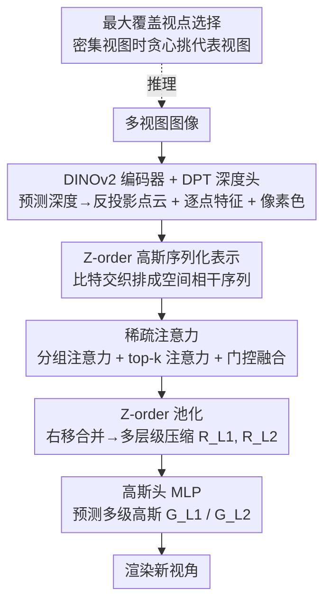

# Z-Order Transformer for Feed-Forward Gaussian Splatting

**会议**: CVPR 2026  
**arXiv**: [2605.13465](https://arxiv.org/abs/2605.13465)  
**代码**: 无  
**领域**: 3D视觉  
**关键词**: 前馈高斯泼溅, Z-order 曲线, 稀疏注意力, 新视角合成, 高斯压缩

## 一句话总结
用 Z-order（Morton 莫顿）空间填充曲线把杂乱的逐像素高斯重排成保持空间局部性的 1D 序列，再配合「分组注意力 + top-k 注意力」的稀疏 Transformer 与 Z-order 池化，一次前馈即可预测高质量 3D 高斯，并把高斯数量压到 DepthSplat/AnySplat 的 1/2~1/3，推理比逐场景优化的 3DGS 快约 1000 倍。

## 研究背景与动机

**领域现状**：3D Gaussian Splatting（3DGS）能做到照片级实时新视角合成，但原版要对每个场景做几分钟的逐场景梯度优化，没有泛化能力。为此前馈式 GS（如 PixelSplat、DepthSplat、AnySplat）改用一张神经网络直接从输入图像一次前馈预测出每个高斯的位置、尺度、不透明度、颜色。

**现有痛点**：当前主流前馈 GS 是「逐像素高斯」——每个输入视图的每个像素都挂一个（或多个）高斯，位置由深度反投影到 3D。这条路简单但高斯爆炸：两张 512×512 视图就产生 50 多万个高斯，显存和渲染开销随分辨率/视图数迅速膨胀。为降冗余，体素式（voxel-based）GS 把邻近高斯按体素格子聚合，但固定体素格子带来量化误差（模糊细节与锐利边界），且体素数随分辨率立方增长，对稀疏/不规则区域还会产生大量空格子浪费算力。

**核心矛盾**：高斯集是**无结构、无序**的点集，但 Transformer/聚合操作要高效就需要「空间相邻的点在序列里也相邻」。逐像素方法不聚合所以冗余，体素方法靠刚性网格聚合却引入量化误差——二者都没有一个既保持空间局部性、又不依赖密集网格的有序表示。

**本文目标**：设计一个前馈函数 $\mathcal{F}$，既高效又能用**尽量少**的高斯点预测出高保真高斯。

**切入角度**：作者借鉴点云序列化（如 Point Transformer V3）的经验——Z-order 曲线能把多维坐标按比特交织映射成一维序列且保持空间局部性。把它搬到 3DGS 上，就能在不建体素格子的前提下让空间相邻的高斯在序列里也相邻，从而支持快速邻域访问、一致的空间分组与可扩展的稀疏注意力。

**核心 idea**：用 Z-order 序列化代替体素网格来组织无结构高斯，在这条「空间相干序列」上做稀疏注意力聚合 + 分层池化压缩，一次前馈得到紧凑而高质量的高斯。

## 方法详解

### 整体框架
给定一组多视图图像，方法分四步走：① 用 Transformer 编码器（DINOv2-Small）+ DPT 深度头预测每个视图的深度图，反投影成世界坐标点云，作为高斯中心的初始化；同时从编码器取全局特征、从深度头取几何特征，融合成逐点特征 $\mathbf{F}$，并保留像素颜色 $\mathbf{I}$ 用于初始化球谐颜色。② 把「点云 + 特征 + 颜色」组成的高斯点表示 $\mathbf{R}=\{\mathbf{P},\mathbf{F},\mathbf{I}\}$ 送进 ZFormer 块：先 Z-order 序列化重排，再过稀疏注意力聚合上下文，最后 Z-order 池化把点数降下来。③ 串两个 ZFormer 块得到两个层级的压缩表示 $\mathbf{R}_{L1}$、$\mathbf{R}_{L2}$（点数依次减少），各自经 MLP 高斯头预测出多级高斯 $G_{L1}$、$G_{L2}$ 用于渲染。④ 推理若有密集视图，先用 Z-order 最大覆盖视点选择算法挑出最有信息量的少数视图再前馈，省掉冗余视图。

整条管线的关键在于「Z-order 序列化」这个统一表示：它让②的稀疏注意力和池化都能在保持空间局部性的序列上廉价完成，避免体素网格与全注意力的高开销。

### 关键设计

**1. Z-order 高斯序列化表示：把无结构高斯排成保持局部性的有序序列**

针对「高斯集无序、聚合低效、体素网格又有量化误差」的核心矛盾，本文用 Z-order（Morton）曲线把 3D 点序列化。对点 $P=(x,y,z)$，每个坐标用至多 $d$ 位二进制表示，Z-order 码通过**交织三个坐标的比特位**得到：

$$\mathbf{Z}(x,y,z)=\sum_{i=0}^{d-1}\Big(x_i\cdot 2^{3i}+y_i\cdot 2^{3i+1}+z_i\cdot 2^{3i+2}\Big)$$

把所有视图的点 $\mathbf{P}$ 沿视图维拼成 $\hat{\mathbf{P}}\in\mathbb{R}^{(NHW)\times3}$，算出每点的 Z-order 码后**按码升序排序**，就得到有序集 $\{\mathbf{P}_{\text{sorted}},\mathbf{F}_{\text{sorted}},\mathbf{I}_{\text{sorted}}\}$——空间上相邻的高斯在序列里也彼此靠近。这是后续一切的基石：不再需要密集体素格子，省显存又省算力；同时给序列上的「分块/分组」操作天然赋予了空间含义（连续一段就是空间上一簇邻居），支撑快速邻域访问与可扩展前馈。

**2. 稀疏注意力：分组 + top-k 双路再门控融合，既抓局部又补细节**

在有序序列上做全注意力仍是 $O(n^2)$ 太贵，本文设计两路稀疏注意力。**分组注意力**把序列切成长度 $L$ 的 $B=NHW/L$ 个不重叠块，对 Q/K/V 分别做块内平均池化算子 $\mathcal{C}(\mathbf{X})_i=\frac{1}{L}\sum_{j=1}^{L}\mathbf{X}_{(i-1)L+j}$ 得到块级表示 $\hat{\mathbf{Q}},\hat{\mathbf{K}},\hat{\mathbf{V}}$，再做缩放点积注意力 $\mathbf{Attn}_{\text{grp}}=\text{softmax}(\hat{\mathbf{Q}}\hat{\mathbf{K}}^\top/\sqrt{d})\hat{\mathbf{V}}$，复杂度大幅下降并捕捉局部上下文。但块内平均会**稀释细粒度信息**，于是再加一路 **top-k 注意力**：复用分组注意力里的权重 $w=\text{softmax}(\hat{\mathbf{Q}}\hat{\mathbf{K}}^\top/\sqrt{d})$ 作为可微的块重要性分数，只挑出最相关的若干块的 K/V 做精细注意力 $\mathbf{Attn}_{\text{sel}}=\text{softmax}(\mathbf{Q}\mathbf{K}_{\text{sel}}^\top/\sqrt{d})\mathbf{V}_{\text{sel}}$。最后用门控网络自适应融合两路：

$$\mathbf{F}_{\text{gate}}=g_1(\mathbf{F}_{\text{sorted}})\odot\mathbf{Attn}_{\text{grp}}+g_2(\mathbf{F}_{\text{sorted}})\odot\mathbf{Attn}_{\text{sel}}$$

分组注意力管「全局/局部的粗粒度上下文」、top-k 注意力管「关键块的细粒度补偿」，门控让模型按需在两者间分配权重——这正利用了 Z-order 序列的局部性，绕开了全注意力的高代价。消融显示换成全注意力（w/o SA）会明显掉点，证明稀疏注意力不是为省算力而牺牲质量。

**3. Z-order 池化：右移比特做多层级聚合压缩**

聚合后还要真正减少点数。本文利用 Z-order 码的层级性：对码做**按位右移** $\mathbf{Z}=\mathbf{Z}\,\texttt{>>}\,h$（$h$ 为池化深度），右移后**码相同的点自然落进同一空间簇**，每簇内做平均池化并加一层线性投影，得到压缩表示 $\{\mathbf{P}_{\text{pool}},\mathbf{F}_{\text{pool}},\mathbf{I}_{\text{pool}}\}$，点数 $M\ll NHW$（中心由 Z-order 逆变换还原到 3D）。把两个 ZFormer 块串起来就得到两个层级 $\mathbf{R}_{L1}$、$\mathbf{R}_{L2}$（点数逐级递减），高斯头分别预测出 $G_{L1}$、$G_{L2}$。比起体素离散化，右移池化的「簇」直接来自空间填充曲线、不需固定网格，因此不会在稀疏区产生空格子。消融指出选两层是「防止退化」与「保持低高斯数」的最佳折中：多于两层细节会退化。

**4. 高斯参数预测与初始化：残差中心 + 像素色转球谐**

高斯头是两层 MLP，对每个层级的点表示预测参数。两处初始化很关键：高斯中心用池化点 $\mathbf{P}_{\text{pool}}$ 作基准、只预测残差 $\mu=\mathbf{P}_{\text{pool}}+\Delta\mu$，让网络在可靠几何先验上做微调而非从零回归坐标；颜色用像素色 $\mathbf{I}_{\text{pool}}$ 转成球谐系数来初始化 SH。消融（w/o SH）表明去掉 SH 初始化会降低训练稳定性与收敛质量。

**5. 最大覆盖视点选择：密集视图下贪心挑代表视图**

推理时若给了很多视图，全用会拖慢速度且冗余。算法先对每个视图的点云做 Z-order 序列化得到紧凑覆盖表示，把各视点的「Z-order 覆盖」放进最大堆；每轮从堆顶取**覆盖增益最大**的视点加入选中集 $\mathcal{S}$ 并更新已覆盖集 $\mathcal{C}$，当没有视点能带来足够新覆盖时停止。这是一个贪心的最大覆盖策略，增量地挑出最有信息量的视图。消融（Tab. 6）显示该 Z-order 选择在画质上稳定优于随机选择，又比用全部视图更省时间。

### 损失函数 / 训练策略
深度估计器用预训练 depth-anything-v2-small 初始化，但训练时**不冻结**：作者发现 2D 图像深度并不总准，联合训练能让模型补偿误差，故加一项蒸馏损失 $\mathcal{L}_{\text{depth}}=|\mathcal{F}_{\text{depth}}(\mathbf{I})-\hat{\mathcal{F}}_{\text{depth}}(\mathbf{I})|$ 约束其别跑偏。渲染监督对每个 Z-order 层级的高斯都算 MSE + LPIPS：$\mathcal{L}_{\text{color}}=\sum_{i=1}^{M}[\text{MSE}(\mathcal{R}(G_{Li},\mathbf{c}),\mathbf{I}_{\text{gt}})+\text{LPIPS}(\mathcal{R}(G_{Li},\mathbf{c}),\mathbf{I}_{\text{gt}})]$。深度分支用低学习率 $2\times10^{-6}$、ZFormer 与高斯头用 $2\times10^{-4}$，AdamW + cosine 调度，8×A100 训 100K 步约 2 天；分组注意力块大小 32，top-k 取一半块，Z-order 池化深度 2，注意力用 FlashAttention 加速。

## 实验关键数据

数据集：RealEstate10K（360×640）、DL3DV（256×448）、ACID（256×256，仅用于跨数据集评测）；划分沿用 DepthSplat。对比对象含优化式 3DGS / MipSplatting 与前馈式 DepthSplat / AnySplat。Ours#L1 / Ours#L2 分别表示用一层 / 两层 Z-order 块压缩。

### 主实验

固定视图数对比（RealEstate10K），Ours#L1 在各视图数、各指标上几乎全面领先，且**视图越少优势越明显**（2 视图最突出，说明对稀疏视图更鲁棒）：

| 视图数 | 指标 | DepthSplat | AnySplat | Ours#L1 |
|--------|------|------------|----------|---------|
| 2 | PSNR / SSIM / LPIPS | 26.03 / 0.873 / 0.158 | 22.55 / 0.757 / 0.229 | **26.43 / 0.873 / 0.147** |
| 8 | PSNR / SSIM / LPIPS | 26.17 / 0.876 / 0.152 | 26.71 / 0.886 / 0.131 | **27.25 / 0.897 / 0.123** |
| 12 | PSNR / SSIM / LPIPS | 26.33 / 0.880 / 0.143 | 26.94 / 0.892 / 0.122 | **28.56 / 0.901 / 0.110** |

跨数据集泛化（→ACID）与可变视图输入也均领先：

| 设置 | 指标 | DepthSplat | AnySplat | Ours#L1 |
|------|------|------------|----------|---------|
| 可变视图 (2–12) | PSNR / SSIM / LPIPS | 26.11 / 0.871 / 0.151 | 26.54 / 0.875 / 0.133 | **28.07 / 0.890 / 0.125** |
| RealEstate10K→ACID | PSNR / SSIM / LPIPS | 26.05 / 0.810 / 0.181 | 22.71 / 0.685 / 0.298 | **27.56 / 0.853 / 0.172** |
| DL3DV→ACID | PSNR / SSIM / LPIPS | 25.58 / 0.796 / 0.203 | 23.64 / 0.737 / 0.242 | **27.34 / 0.845 / 0.169** |

推理时间与高斯数（360×640，#GS 单位 $\times10^5$）——核心卖点：

| 方法 | 2 视图 时间 / #GS | 12 视图 时间 / #GS |
|------|-------------------|---------------------|
| 3DGS | 2m15s / 6.27 | 8m21s / 8.51 |
| DepthSplat | 0.142s / 4.61 | 0.384s / 27.6 |
| AnySplat | 0.692s / 3.53 | 1.212s / 13.2 |
| Ours#L1 | **0.123s** / 2.85 | 0.337s / 17.8 |
| Ours#L2 | 0.135s / **1.42** | 0.355s / **8.05** |

相比 3DGS/MipSplatting 约快 1000 倍；高斯数较 DepthSplat/AnySplat 减少约 2–3 倍（Ours#L2 在 12 视图下 8.05 vs DepthSplat 27.6）。

### 消融实验

12 视图，RealEstate10K：

| 配置 | PSNR↑ | SSIM↑ | LPIPS↓ | 说明 |
|------|-------|-------|--------|------|
| Ours（完整） | **28.56** | **0.901** | **0.110** | 完整模型 |
| w/o Z-order（换卷积） | 24.86 | 0.794 | 0.225 | 去掉 ZFormer 块，掉点最多 |
| w/o SA（用全注意力） | 26.79 | 0.847 | 0.174 | 去稀疏注意力，明显变差 |
| w/o SH（不用像素色初始化 SH） | 27.81 | 0.874 | 0.129 | 训练不稳、收敛差 |
| Ours-Fix-Depth（冻结深度） | 28.15 | 0.893 | 0.119 | 不让深度联合训练，掉点 |

视点选择策略（NA.=全用，RS.=随机，ZS.=Z-order 选择）：

| 输入视图 | 选择 | PSNR↑ | LPIPS↓ | 时间(s)↓ |
|----------|------|-------|--------|----------|
| 24 | NA. (全用) | 28.91 | 0.102 | 0.622 |
| 24 | RS. 16 | 27.97 | 0.113 | 0.417 |
| 24 | ZS. 16 | 28.73 | 0.108 | 0.448 |

### 关键发现
- **ZFormer 块（Z-order + 稀疏注意力）贡献最大**：去掉换成卷积后 PSNR 从 28.56 暴跌到 24.86、LPIPS 翻倍，是全消融里最致命的，说明「有序序列 + 稀疏注意力」才是质量来源，而非单纯增大容量。
- **稀疏注意力不是省算力的妥协**：换全注意力反而掉到 26.79，作者解释 Z-order 序列的局部性让分组+top-k 更契合空间结构。
- **深度联合训练优于冻结**：2D 深度有误差，端到端联合训练能让渲染损失反向修正几何，Fix-Depth 掉到 28.15。
- **层数是质量↔效率的折中**：两层 Z-order 块在「防退化」与「低高斯数」间最优，多于两层细节反而退化。
- **视点选择**：Z-order 选 16 视图（28.73）几乎追平全用 24 视图（28.91），却把时间从 0.622s 降到 0.448s，且全面优于随机选择。

## 亮点与洞察
- **把点云序列化的成熟范式迁移到 3DGS**：Point Transformer V3 用 Z-order 让点云骨干高效，本文洞察到「前馈高斯集同样是无结构点集」，于是把同一把钥匙用来同时解决「高斯冗余」和「聚合低效」两个问题——一个表示统管序列化、稀疏注意力、池化压缩三件事，非常省。
- **Z-order 码右移天然给出层级池化**：池化不靠额外的可学习聚类或固定体素，而是直接 `Z >> h`，比特右移即多分辨率聚簇，简洁且无空格子浪费，这个 trick 可迁移到任何需要多尺度下采样无序点集的任务。
- **分组 + top-k 的互补**：用块平均抓粗粒度、再用 top-k 精选块补回被平均稀释的细节，门控自适应分配——是「线性注意力丢细节」这一通病的一个干净解法。
- **残差中心 + 像素色转 SH**：让网络在可靠几何/颜色先验上做微调而非从零回归，是前馈 GS 提升稳定性的实用工程经验。

## 局限与展望
- **依赖深度/几何质量**：整条管线以单目深度反投影的点云作中心初始化，虽有联合训练补偿，但深度严重失败的弱纹理/反光区域可能仍受限（论文未专门压力测试此类场景）。
- **离散化误差换了形式而非消除**：Z-order 比特位数 $d$ 与池化深度 $h$ 决定了量化粒度，本质仍是空间离散化，只是比体素更自适应；极细几何在更深池化下会退化（作者也观察到 >2 层退化）。
- **未开源**：暂无代码，序列化/排序/top-k 选择的实现细节（如可微 top-k、门控结构）复现门槛较高。
- **多级高斯如何最终合并渲染**未充分展开：$G_{L1}$、$G_{L2}$ 都参与渲染监督，但推理时多级如何取舍/组合、Ours#L1 与 #L2 的取舍标准描述偏经验。

## 相关工作与启发
- **vs 逐像素前馈 GS（PixelSplat / DepthSplat）**：它们每像素挂高斯、靠 CNN 高斯头直接回归，简单但高斯爆炸（12 视图 27.6×10⁵）。本文先序列化再稀疏聚合+池化，高斯数降到 8.05×10⁵ 还涨点，核心差别是「引入了保持局部性的有序聚合」而非无脑逐像素。
- **vs 体素式前馈 GS（AnySplat）**：体素靠固定网格降冗余但有量化误差、稀疏区空格子浪费。本文用 Z-order 自适应聚簇代替刚性网格，无空格子、量化更柔和，跨数据集泛化（→ACID）也明显更稳（27.56 vs 22.71）。
- **vs Point Transformer V3**：直接启发来源——PTv3 把 Z-order 序列化用于点云骨干。本文把它从「判别式点云理解」搬到「生成式高斯预测」，新增了 top-k 稀疏注意力、Z-order 池化压缩与最大覆盖视点选择三块，是一次跨任务的范式迁移。

## 评分
- 新颖性: ⭐⭐⭐⭐ 将 Z-order 序列化系统性引入前馈 3DGS，配套稀疏注意力/层级池化/视点选择自洽，虽借鉴点云序列化但组合与落点新颖。
- 实验充分度: ⭐⭐⭐⭐ 三数据集、固定/可变视图、跨数据集、时间与高斯数、6 项消融都覆盖，较扎实；缺弱纹理等失败场景分析。
- 写作质量: ⭐⭐⭐⭐ 框架与公式清晰，图文对应；个别符号（如 $\mathcal{L}_{\text{color}}$ 中 $M$ 与块数记号）略有混用。
- 价值: ⭐⭐⭐⭐ 同时提质 + 提速 + 减高斯数，对实时新视角合成与端侧 3DGS 部署有实用价值。

<!-- RELATED:START -->

## 相关论文

- [\[CVPR 2026\] AnchorSplat: Feed-Forward 3D Gaussian Splatting with 3D Geometric Priors](anchorsplat_feed-forward_3d_gaussian_splatting_with_3d_geometric_priors.md)
- [\[CVPR 2026\] MoRe: Motion-aware Feed-forward 4D Reconstruction Transformer](more_motion-aware_feed-forward_4d_reconstruction_transformer.md)
- [\[CVPR 2026\] EcoSplat: Efficiency-controllable Feed-forward 3D Gaussian Splatting from Multi-view Images](ecosplat_efficiency-controllable_feed-forward_3d_gaussian_splatting_from_multi-v.md)
- [\[CVPR 2026\] Off The Grid: Detection of Primitives for Feed-Forward 3D Gaussian Splatting](off_the_grid_detection_of_primitives_for_feed-forward_3d_gaussian_splatting.md)
- [\[CVPR 2026\] FUSER: Feed-Forward Multiview 3D Registration Transformer and SE(3)$^N$ Diffusion Refinement](fuser_feed-forward_multiview_3d_registration_transformer_and_se3n_diffusion_refi.md)

<!-- RELATED:END -->
