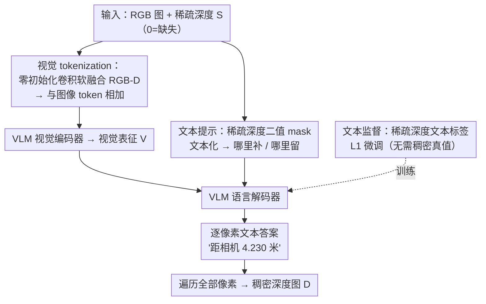

# Zero-Shot Depth Completion with Vision-Language Model

**会议**: CVPR 2026  
**论文**: [CVF Open Access](https://openaccess.thecvf.com/content/CVPR2026/html/Yan_Zero-Shot_Depth_Completion_with_Vision-Language_Model_CVPR_2026_paper.html)  
**代码**: 待确认  
**领域**: 3D视觉  
**关键词**: 深度补全, 视觉语言模型, 零样本, 稀疏深度, 文本监督

## 一句话总结
把稀疏深度以「视觉 token + 文本提示 + 文本监督」三种方式注入一个几乎不改结构的 VLM（Qwen2.5-VL 3B），让它像理解语言指令一样理解「哪里该补、哪里该保留」，从而无需稠密真值就能做零样本深度补全，在 7 个跨域 benchmark 上最高提升 17.3%。

## 研究背景与动机
**领域现状**：深度补全（depth completion）要从稀疏深度（如 LiDAR / 主动立体的离散测点）恢复稠密深度，通常配一张 RGB 图做引导。2024 年前主流是任务专用网络（SPN 系列、双边传播 BPNet 等）；2024 年后转向「零样本泛化」，借助 OGNI-DC、G²-MonoDepth、OMNI-DC，乃至把扩散式深度基础模型搬进来的 Marigold-DC（当前 SOTA）。

**现有痛点**：作者一针见血地指出——现有方法「并没有真正理解补全的本质」。它们拿到稀疏深度，只是把它当作又一路特征 embed 进网络，并不显式知道**哪些像素是已知测量值（该保留）、哪些是缺失区域（该预测）**。结果就是对有效测点也一并「重新预测」，既浪费了精确测量，又可能把可靠值改坏。

**核心矛盾**：补全任务天然带有「保留 vs. 预测」的二分结构，但卷积/扩散网络把稀疏深度铺成稠密张量后，这层结构信息就被抹平了，模型无从分辨。而人类一眼就懂：保住测到的、只猜没测到的。

**本文目标**：找到一种载体，既能吸收稀疏深度的绝对尺度，又能显式表达「补/留」的指令语义。

**切入角度**：VLM 恰好擅长语义推理与指令跟随。若把「哪里补、哪里留」写成自然语言提示喂给 VLM，它就能把这条指令当作约束来执行；同时 VLM 缺的是几何与绝对尺度，正好用稀疏深度补上。

**核心 idea**：提出稀疏深度注入机制（Sparse Depth Injection Mechanism, SDIM），用「视觉 tokenization + 文本提示 + 文本监督」三条通道把稀疏深度灌进 VLM，几乎不动其结构，就把一个语义模型改造成能做度量级 3D 感知的深度补全器。

## 方法详解

### 整体框架
方法以冻结/微调的 Qwen2.5-VL（3B）为底座，输入是一张彩色图 $I\in\mathbb{R}^{3\times h\times w}$ 与对应稀疏深度 $S\in\mathbb{R}^{1\times h\times w}$（0 表示缺失），输出是每个像素一句「距相机 x 米」的文本答案，遍历所有像素再拼回一张稠密深度图 $D$。整条管线靠 SDIM 的三个部件把稀疏深度分别注入到 VLM 的**视觉输入端、文本输入端、监督端**：视觉端用零初始化卷积把稀疏深度「软融合」进视觉 token；文本端把稀疏深度的二值 mask 文本化成「哪里补、哪里留」的提示；监督端把稀疏深度本身文本化成「该像素距相机 y 米」当标签来微调，全程不需要稠密真值。

### 关键设计

**1. 视觉 tokenization：用零初始化卷积把稀疏深度「软融合」进视觉 token，给 VLM 注入绝对尺度**

痛点是：单张 RGB 做深度估计本身是病态的（存在尺度与相机歧义），而 VLM 的视觉编码器只吃 RGB；若粗暴地把 RGB-D 直接 concat 再卷积（hard fusion），等于一上来就把深度这路「陌生分布」硬塞进预训练好的图像 token，破坏其分布、训练不稳。作者改成软融合：先用一个 32 通道、**零初始化**的卷积（接 BN+LeakyReLU）单独编码稀疏深度 $\hat S=F^{z}_{\tau_2}(S)$，RGB 同样编码得 $\hat F$；拼接后过两层卷积投影到高/低维 $M=F_{\tau_3}(F_{\tau_2}(F_\psi(\hat F,\hat S)))$，再经一层零初始化卷积 $O=F^{z}_{c}(M)$；最后按 Qwen2.5-VL 原生的 3D 卷积 embedding 把 $O$ token 化并**加到**图像 token 上：$E=F_{e1}(I)+F_{e2}(O)$，送入视觉编码器得 $V=F_\theta(E)$。零初始化的妙处在于训练初期深度支路输出≈0，对预训练 token 几乎零扰动，随训练「逐渐」注入深度线索，使融合后的表征分布始终贴近原图像 token 分布。消融里把零初始化换成 He 初始化，RMSE 反而高 7mm，印证了「软」的价值。与启发它的方法不同，作者只在输入端做软融合、且是先 embedding 再相加（而非在 RGB 输入上直接相加），避免复制冻结结构里的复杂模块。

**2. 文本提示：把稀疏深度的二值 mask 文本化，显式告诉 VLM「哪里补、哪里留」**

这是全文最点题的设计，直接回应「模型不知道该保留还是该预测」的痛点。作者从稀疏深度生成二值 mask（0=缺失、1=有效测量），并把每个像素翻成两类固定模板文本：缺失处写「The mask value is 0; predict the distance to the camera.」，有效处写「The mask value is 1, and the distance to the camera is x meters, preserve the given value.」，其中只有 0/1 与具体值 x 是动态填的。再配一句固定问题 $Q$「What is the distance from the current pixel to the camera?」一起喂给语言解码器：$A=F_\delta(T,Q,V)$，其中 $T=F_t(S)$ 是 mask+深度的文本化函数。这样「保留 vs. 预测」的二分被写成语言约束，模型在有效像素上被明确要求 preserve 给定值、在缺失像素上才去 predict，于是补全在语言引导下变得可控。消融显示，仅加入 mask 文本（SDIM-d）就带来 9mm MAE / 15mm RMSE 的提升，再把具体深度值也写进提示（SDIM-e）误差进一步下降——因为有效像素的值理论上等同真值，写进提示等于给出一批高可信锚点，既稳住这些位置又为周边缺失区提供参考。

**3. 文本监督：用稀疏深度自身生成文本标签微调，彻底摆脱稠密真值**

痛点是：传统监督需要稠密真值深度，采集昂贵、且很多场景根本拿不到。作者把稀疏深度的每个有效值 $y$ 插进固定模板「The pixel is y meters away from the camera.」当作文本标签，沿用文本式有监督微调（每个训练样本只取一个有标注像素，用 L1 损失），从而**只靠稀疏深度本身**就完成训练，无需稠密真值。因为推理时稀疏深度往往与 RGB 一起天然可得，这套 label-free 方案还可被理解为一种在线（online）方法。推理阶段对每个像素查询其「距相机多少米」，把所有逐像素文本答案 $A_j$ 经遍历函数还原成稠密深度图：$D=\mathcal{T}_{j=1}^{hw}(A_j)$。值得注意：用更稠密的真值监督（SDIM-f）确实比稀疏监督（SDIM-e）更准（真值密度可达稀疏深度的约 300 倍），但两者差距很小，而 SDIM-e 免标注、更易部署，是实际更划算的选择。

### 损失函数 / 训练策略
底座为 Qwen2.5-VL（3B），在 Hypersim + Virtual KITTI 的 20K 子集上微调，文本式 SFT、每样本一个标注像素、L1 损失；8×48GB GPU 训练 10 epoch，总 batch size 16。测试集（NYUv2、VOID、IBims-1、KITTI、DDAD）均**未参与**预训练或微调，保证零样本评测。

## 实验关键数据

### 主实验
七个零样本 benchmark 上与 9 个代表方法对比，指标为 MAE / RMSE（米，越低越好）。w/ SD 表示用稀疏深度做文本监督（免真值），w/ GT 表示用真值监督。

| 数据集 (指标) | 本文 w/ SD | 本文 w/ GT | 之前最好 | w/ SD 提升 |
|--------------|-----------|-----------|---------|-----------|
| IBims-1 MAE | 0.040 | 0.036 | 0.045 (Marigold-DC‡) | 12.5% |
| VOID 150 MAE | 0.185 | 0.176 | 0.194 (Marigold-DC‡) | 4.9% |
| NYUv2 MAE | 0.044 | 0.042 | 0.048 (Marigold-DC‡) | 9.1% |
| KITTI MAE | 0.418 | 0.406 | 0.434 (Marigold-DC‡) | 3.8% |
| DDAD RMSE | 6.264 | 6.179 | 6.449 (Marigold-DC‡) | 3.0% |

即使是免真值的 w/ SD 版本，也普遍超过那些**用真值监督**的零样本方法；w/ GT 版本在 NYUv2 上 MAE 0.042 / RMSE 0.120，相对次优提升高达 83.3% / 94.2%。

### 消融实验（VOID-150，逐步加 SDIM 三部件）

| 配置 | 视觉 tokenization | 文本提示 | 文本监督 | MAE | RMSE |
|------|------------------|---------|---------|------|------|
| (a) | Concat（硬融合） | — | SD | 0.206 | 0.635 |
| (b) | He init. 融合块 | — | SD | 0.202 | 0.630 |
| (c) | Zero init. 软融合 | — | SD | 0.197 | 0.623 |
| (d) | Zero init. | Mask | SD | 0.188 | 0.608 |
| (e) | Zero init. | Mask + SD值 | SD | 0.185 | 0.604 |
| (f) | Zero init. | Mask + SD值 | GT | 0.176 | 0.592 |

### 关键发现
- **零初始化软融合 > 硬 concat**：(a)→(c) RMSE 从 0.635 降到 0.623，其中零初始化相对 He 初始化再降 7mm，说明「让深度支路初期不扰动预训练 token、逐渐注入」是稳定融合的关键。
- **文本提示贡献最直接**：(c)→(d) 仅加 mask 文本就拿下 9mm MAE / 15mm RMSE，验证「显式告诉模型哪里补哪里留」确实是现有方法缺的那一环；再写入具体深度值 (e) 进一步提供高可信锚点。
- **免真值代价极小**：(e) vs. (f) 仅差 9mm MAE，但 (e) 完全不需要稠密真值，性价比更高。
- **backbone 与效率**：换 VLM 底座（MolmoE-1B / Seed1.5-VL / Qwen2.5-VL）中 Qwen2.5-VL 全面最优（IBims-1 MAE 0.040）；效率上虽因预载 VLM 显存高达 46GB，但比同为零样本的 Marigold-DC 快约 65 倍（0.327 vs. 0.005 FPS）且更准。
- **失败场景**：玻璃/反射面附近——这些区域稀疏深度本就稀少甚至「穿透」玻璃测到后方物体，导致错误测量；近处车窗尤其差（玻璃后物体在 RGB 里更清晰造成误导）。作者建议引入玻璃分割并文本化后注入视觉端。

## 亮点与洞察
- **把「补全的二分本质」翻译成语言指令**：用一句「mask=1 则 preserve、mask=0 则 predict」的文本提示，优雅解决了卷积/扩散网络「分不清保留与预测」的老问题，这是最让人「啊哈」的点——几何任务里加入语义级显式约束。
- **零初始化软融合是可迁移的 trick**：在不改冻结模型结构的前提下，用零初始化卷积让新模态（深度）从零扰动逐步注入预训练表征，这套思路可搬到任意「给预训练大模型加新输入通道」的场景。
- **文本监督把回归问题改写成语言建模**：逐像素「距相机 x 米」的文本标签 + L1，使深度补全完全寄生在 VLM 的文本生成能力上，连稠密真值都不需要，对真值稀缺的真实机器人/自驾场景很有吸引力。

## 局限与展望
- 作者承认：仅聚焦深度预测，未验证能否扩展到表面法向等其他稠密预测任务；且基于大 VLM，推理速度偏慢。
- 显存开销巨大（46GB），FPS 仅 0.327，离实时和轻量部署还远——虽然比 Marigold-DC 快，但相对任务专用模型（CFormer/BPNet ~4.5 FPS）仍慢一个量级。
- 玻璃/反射面系统性失败，源于稀疏深度本身在这些区域不可靠，单靠文本约束难解，需要额外的分割/材质先验。
- 评测的稀疏深度多由真值随机采样或 LiDAR 得到，真实低质/噪声稀疏输入下的鲁棒性未充分检验。

## 相关工作与启发
- **vs Marigold-DC（扩散式零样本 SOTA）**：它靠测试时优化把稀疏深度注入扩散深度基础模型，本文则把稀疏深度文本化注入 VLM；本文不仅多数指标更优，还快约 65 倍，且免真值。
- **vs BPNet / SPN 系列（任务专用）**：它们用双边传播/空间传播网络在稀疏深度上做精细扩散，精度高但泛化弱、需大量域内训练；本文走零样本 + 语义引导路线，跨传感器/稀疏度/场景泛化更强（代价是显存大）。
- **vs DepthLM / SpatialVLM / SpatialBot（VLM 做 3D 感知）**：这些工作让 VLM 具备空间/度量推理，本文沿此方向但首次专门把 VLM 用于**深度补全**，并通过 mask 文本提示引入「保留 vs. 预测」的任务结构。

## 评分
- 新颖性: ⭐⭐⭐⭐⭐ 首个 VLM 深度补全框架，用文本提示显式编码补全的「补/留」本质，视角新颖。
- 实验充分度: ⭐⭐⭐⭐ 七个零样本 benchmark + 逐部件消融 + backbone/效率/失败案例齐全，仅噪声稀疏输入鲁棒性略缺。
- 写作质量: ⭐⭐⭐⭐⭐ 动机层层递进、SDIM 三部件叙述清晰，图表与公式自洽。
- 价值: ⭐⭐⭐⭐ 免真值 + 强零样本泛化对真实场景有吸引力，但显存/速度限制了即时落地。

<!-- RELATED:START -->

## 相关论文

- [\[CVPR 2026\] LaS-Comp: Zero-shot 3D Completion with Latent-Spatial Consistency](las-comp_zero-shot_3d_completion_with_latent-spatial_consistency.md)
- [\[CVPR 2026\] VGGT-360: Geometry-Consistent Zero-Shot Panoramic Depth Estimation](vggt-360_geometry-consistent_zero-shot_panoramic_depth_estimation.md)
- [\[CVPR 2026\] ConceptPose: Training-Free Zero-Shot Object Pose Estimation using Concept Vectors](conceptpose_training-free_zero-shot_object_pose_estimation_using_concept_vectors.md)
- [\[CVPR 2026\] SO(3)-Equivariant ViT-Adapter for Data-Efficient Zero-Shot Sim-to-Real Indoor Panoramic Depth Estimation](so3-equivariant_vit-adapter_for_data-efficient_zero-shot_sim-to-real_indoor_pano.md)
- [\[CVPR 2026\] Multi-Scale Gaussian-Language Map for Zero-shot Embodied Navigation and Reasoning](multi-scale_gaussian-language_map_for_zero-shot_embodied_navigation_and_reasonin.md)

<!-- RELATED:END -->
