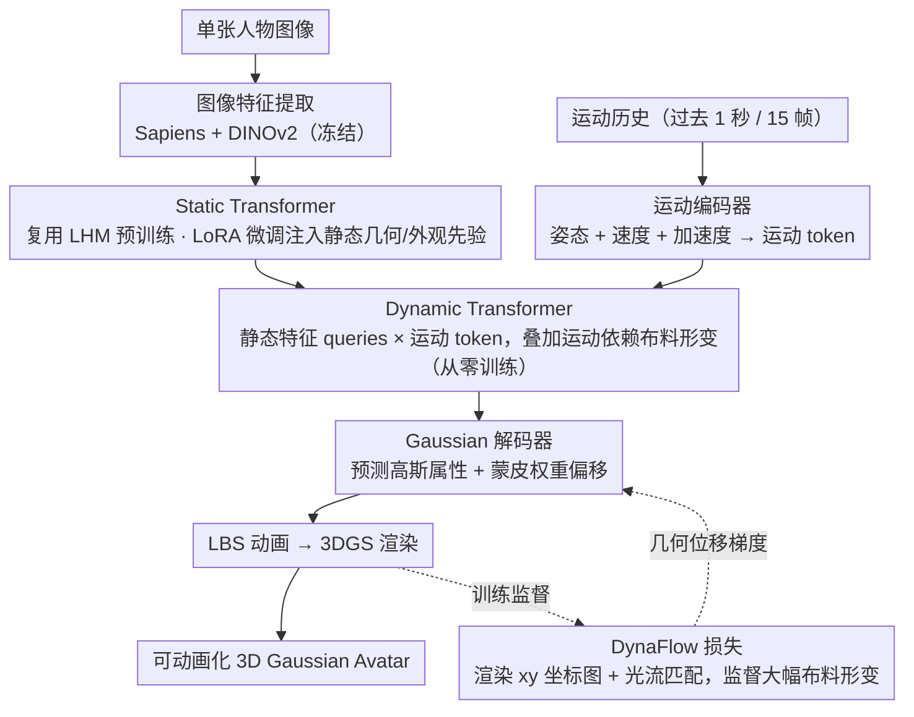

# Zero-Shot Reconstruction of Animatable 3D Avatars with Cloth Dynamics from a Single Image

**会议**: CVPR2026  
**arXiv**: [2603.14772](https://arxiv.org/abs/2603.14772)  
**代码**: [https://juhyeon-kwon.github.io/DynaAvatar.github.io/](https://juhyeon-kwon.github.io/DynaAvatar.github.io/) (项目页)  
**领域**: 3D视觉  
**关键词**: 3D人体重建, 可动画化Avatar, 布料动态, 3D Gaussian Splatting, 单图重建

## 一句话总结
DynaAvatar 提出首个零样本框架，从单张图像重建具有运动依赖布料动态效果的可动画化3D人体Avatar，核心通过静态-动态知识迁移策略和光流引导的 DynaFlow 损失函数，在有限动态数据下实现了逼真的衣物动态建模，全面超越现有方法。

## 研究背景与动机

**领域现状**：单图可动画化3D人体Avatar重建是计算机视觉和图形学的核心目标。现有零样本方法（IDOL、LHM）主要依赖基于骨骼关节的刚性变换（LBS）来驱动动画，虽然能实现身体关节运动，但本质上无法建模非刚性布料动态。另一类个性化方法（ExAvatar、GaussianAvatar）虽能捕捉特定对象的衣物形变，但需要针对每人单独采集多视角视频并优化，无法推广到任意新人物。

**现有痛点**：
   - **刚性动画问题**：零样本方法产生的动画过于僵硬，裙子、夹克等衣物在运动中不会随着动作自然飘动，严重损害视觉真实感
   - **个性化依赖**：能建模布料动态的方法（PERSONA、SeqAvatar）需要逐人采集和优化，不具备可扩展性
   - **动态数据稀缺**：大规模动态捕捉数据采集成本极高（多视角同步、时间校准、衣物多样性），且现有数据集的 SMPL-X 标注普遍存在缺失或噪声

**核心矛盾**：要学习运动依赖的布料动态需要大规模动态捕捉数据，但这类数据极其稀缺；同时传统图像重建损失在大幅布料形变场景下因局部感受野和颜色-几何耦合问题而监督失效。

**本文目标**
   - 如何在零样本设定下（无需逐人优化）实现运动依赖的布料动态？
   - 如何在动态数据有限的条件下学习有效的动态形变先验？
   - 如何为大幅度布料运动提供可靠的几何监督信号？

**切入角度**：作者观察到大规模静态采集数据虽然缺乏时序形变信息，但包含丰富的人体几何和外观先验；同时利用光流可以建立渲染图像和真实图像之间跨越大形变的像素级对应关系，从而提供纯几何的位移监督。

**核心 idea**：通过静态预训练Transformer的LoRA微调实现知识迁移+光流引导的DynaFlow损失提供几何级形变监督，让单图Avatar在零样本下展现逼真的运动依赖布料动态。

## 方法详解

### 整体框架

DynaAvatar 采用基于 Transformer 的前馈架构，输入为单张人物图像和运动历史序列（1秒/15帧），输出为在规范空间中带有运动依赖布料动态的 3D Gaussian Avatar。整体 pipeline 分为五个阶段：

1. **图像特征提取**：用冻结的预训练编码器（Sapiens + DINOv2）提取图像 token $\mathbf{T}_I$
2. **Static Transformer**：在不考虑布料动态的情况下提取详细的几何和外观特征
3. **运动编码器**：将运动历史编码为运动 token $\mathbf{T}_M$
4. **Dynamic Transformer**：融合运动信息，在静态特征上叠加运动依赖的布料形变
5. **Gaussian 解码器 + LBS 动画 + 3DGS 渲染**：输出最终的可动画化 Avatar

图像路与运动路分头编码、在 Dynamic Transformer 处汇合，再经高斯解码与渲染出图；DynaFlow 损失在训练时回灌几何位移梯度修正高斯位置：

### 关键设计

**1. Static Transformer：先把静态几何和外观吃透，不碰布料动态**

零样本方法之所以动画僵硬，一个根源是它们要同时学几何、外观和形变，而动态数据太少根本喂不饱。DynaAvatar 的第一步索性把"长什么样"和"怎么动"拆开：Static Transformer 只负责前者，从单张图里抽出干净的几何/外观特征。它用一组多模态 Transformer Block（MM）做这件事——把 SMPL-X 模板顶点的位置编码当作 3D 点 token $\mathbf{T}_{3D}$（queries），图像 token $\mathbf{T}_I$ 当 keys/values，通过交叉注意力把图像信息"贴"到模板顶点上：$\mathbf{T}_{3D}, \mathbf{T}_I \leftarrow \text{MM}(\mathbf{T}_{3D}, \mathbf{T}_I; \mathbf{F}_I)$，其中全局上下文 $\mathbf{F}_I$ 由 Sapiens 图像 token 平均得到、用于 AdaLN 调制。关键是这部分直接复用 LHM 在大规模静态数据上预训练的权重，并冻结图像编码器，等于免费拿到一份强几何先验，又避免后续动态训练把它冲掉。

**2. 运动编码器：让模型知道"现在不只是这个姿态，而是正往哪个方向使劲"**

布料怎么飘，光看当前姿态是不够的——同一个张开双臂的瞬间，是向上跳起还是正往下落，裙摆方向截然相反。运动编码器把过去 1 秒（15 帧）的运动历史压成运动 token $\mathbf{T}_M$，输入不只有 3D 姿态（6D 旋转参数化），还显式带上姿态速度、姿态加速度和 3D 关键点速度，先位置编码再过多层 MLP。所有运动历史都统一变换到规范世界坐标系（优先用数据集提供的 up 向量，没有就退回相机 $y$ 轴），保证不同序列里"向上""向下"的语义一致。速度和加速度的引入正是让模型能区分运动方向与强度的那一手，没有它布料动态就退化成只跟姿态走的静态映射。

**3. Dynamic Transformer：在静态特征之上叠一层运动依赖的形变，且只让这一层从头学**

有了静态特征和运动 token，Dynamic Transformer 负责把两者撮合——这回反过来，静态侧输出的 $\mathbf{T}_{3D}$ 当 queries，运动 token $\mathbf{T}_M$ 当 keys/values，照样用 MM block 融合：$\mathbf{T}_{3D}, \mathbf{T}_M \leftarrow \text{MM}(\mathbf{T}_{3D}, \mathbf{T}_M; \mathbf{F}_M)$，AdaLN 条件 $\mathbf{F}_M$ 取 $\mathbf{T}_M$ 的最后一个元素（即最近一帧）。这块从随机初始化开始训练，和预训练的 Static Transformer 形成明确分工：静态部分守住几何/外观先验不被破坏，动态部分专心学时序形变。这样即便动态数据有限，需要从零学的参数量也被压到最小。

**4. 静态-动态知识迁移：用 LoRA 微调静态分支，鱼与熊掌兼得**

第 1、3 点埋了一个隐患：既要用上 LHM 的静态先验，又要让模型学会全新的动态形变，这两个目标会打架。怎么微调 Static Transformer 成了关键。作者的答案是不全量微调，而是给它挂轻量级 LoRA adapter，主体权重冻结、只学少量低秩增量；Dynamic Transformer 则保持随机初始化从头训。消融（Fig. 7）把另外两条路都堵死了：整模型从零训练保不住输入图像的纹理细节，全量微调虽有先验但很快把原有知识覆盖掉，只有 LoRA 微调能一边留住丰富的静态知识、一边给 Dynamic Transformer 留出学习运动依赖动态的空间。

**5. Gaussian 解码器与动画渲染：把带动态的规范 Avatar 用 LBS 搬到目标姿态**

最后一步把 Dynamic Transformer 的输出落地成可渲染的 3D 高斯。一个单线性层解码器为每个 Gaussian 预测均值、尺度、旋转、不透明度、颜色，外加一项蒙皮权重偏移；随后用 LBS（结合预测偏移和扩散得到的蒙皮权重）把规范空间 Avatar 驱动到目标姿态，再交给 3DGS 渲染器出图。这里有个值得点明的设计取舍：布料动态已经被编码进规范空间的 Avatar 本身，所以 LBS 这套刚性蒙皮天然就把动态效果一并带过去，无需额外的形变模块；而每个 Gaussian 自带的蒙皮权重偏移，又允许它按运动历史微调自己的动画行为。

### 损失函数 / 训练策略

**DynaFlow 损失函数**是本文最重要的监督设计创新：

- **问题**：传统图像重建损失（L1、SSIM）将几何和颜色纠缠在一起，造成几何监督模糊；且基于局部patch操作的损失函数无法为大幅度布料形变建立跨区域的对应关系
- **方案**：渲染时除了 RGB 图像，还额外渲染一张 $xy$ 坐标图 $\mathbf{M} \in \mathbb{R}^{H \times W \times 2}$（将每个 Gaussian 的屏幕空间投影坐标代替颜色渲染）。用 LightGlue 计算渲染图和真实图之间的光流匹配，得到 $N$ 对源-目标像素坐标 $(\mathbf{p}_{src}, \mathbf{p}_{tgt})$，然后约束：

$$\mathcal{L}_{flow} = \frac{1}{N} \sum \|\mathbf{M}(\mathbf{p}_{src}) - \mathbf{p}_{tgt}\|_1$$

- **关键细节**：匹配数 $N$ 上限为 1024 保证稳定性；DynaFlow 仅在训练后半程激活（早期渲染不准确导致光流不可靠）；梯度通过 $\mathbf{M}$ 反传，直接修正 Gaussian 的 2D 位置
- **完整损失**：$\mathcal{L} = \mathcal{L}_{L1} + \mathcal{L}_{SSIM} + \mathcal{L}_{mask} + \mathcal{L}_{LPIPS} + \mathcal{L}_{flow} + \mathcal{L}_{reg}$（含面部/手部的 Laplacian 正则化）

**数据集重标注**：对 DNA-Rendering、4D-Dress、Actors-HQ 三个数据集进行统一的 SMPL-X 重拟合，使用 DWPose 预测 2D 关键点 + SMPLest-X 初始化 + 多视角 L1 损失优化 + Savitzky-Golay 时序平滑，最终获得 1100万+ 高质量图像监督样本。

## 实验关键数据

### 主实验

| 方法 | DNA-Rendering PSNR↑ | DNA-Rendering SSIM↑ | DNA-Rendering LPIPS↓ | 4D-Dress PSNR↑ | 4D-Dress SSIM↑ | 4D-Dress LPIPS↓ | Actors-HQ PSNR↑ | Actors-HQ SSIM↑ | Actors-HQ LPIPS↓ |
|------|------|------|------|------|------|------|------|------|------|
| IDOL | 17.84 | 0.902 | 0.155 | 21.31 | 0.948 | 0.077 | 20.93 | 0.910 | 0.138 |
| PERSONA | 14.91 | 0.883 | 0.207 | 19.46 | 0.943 | 0.098 | 19.08 | 0.904 | 0.171 |
| LHM | 17.42 | 0.901 | 0.169 | 21.03 | 0.950 | 0.085 | 20.29 | 0.908 | 0.151 |
| **DynaAvatar** | **19.45** | **0.916** | **0.136** | **23.74** | **0.960** | **0.064** | **21.38** | **0.916** | **0.128** |

DynaAvatar 在所有三个数据集上全面超越现有单图方法。在 4D-Dress 上 PSNR 提升 +2.43dB（vs IDOL），LPIPS 降低 16.9%。在跨域 Actors-HQ 上也保持领先，证明泛化能力。

### 消融实验

| 配置 | 4D-Dress PSNR↑ | 4D-Dress SSIM↑ | 4D-Dress LPIPS↓ | 说明 |
|------|---------|---------|---------|------|
| w/o Dynamic Transformer | 22.57 | 0.952 | 0.068 | 无运动历史，布料动态丧失 |
| w/o 知识迁移（从零训练） | — | — | — | 纹理细节丢失严重（Fig.7b） |
| 全量微调（无LoRA） | — | — | — | 预训练知识被覆盖（Fig.7c） |
| w/o DynaFlow | — | — | — | 大幅布料运动缺失，边界模糊（Fig.8） |
| **Full DynaAvatar** | **23.62** | **0.958** | **0.062** | 完整模型 |

### 关键发现
- **Dynamic Transformer 是布料动态的关键**：去掉后 PSNR 从 23.62 降至 22.57（-1.05dB），且布料完全变为静态复制
- **LoRA 是知识迁移的关键格式**：全量微调和从零训练都会丢失输入图像的纹理模式，只有 LoRA 能平衡保留静态先验和学习动态
- **DynaFlow 解决大幅形变监督问题**：没有 DynaFlow 时，衣物在快速运动中几乎保持不动，边界也模糊；DynaFlow 提供的像素级位移监督直接告诉 Gaussian "该往哪里移"
- **同姿态不同运动展现不同布料效果**（Fig. 6）：相似姿态但不同运动历史（空中下落 vs 向上跳）产生明显不同的衣物形变，证明 Dynamic Transformer 确实在利用运动信息

## 亮点与洞察
- **DynaFlow 损失设计极其巧妙**：通过渲染 $xy$ 坐标图代替 RGB、用光流建立跨大形变的对应关系，将"颜色-几何纠缠"彻底解耦为纯几何监督。这个思路不限于Avatar，可迁移到任何需要大位移监督的3DGS场景（如动态场景重建、物体形变建模）
- **静态-动态分离架构设计**：用预训练的 Static Transformer（LoRA冻结主体）+从零训练的 Dynamic Transformer，实现了"保持预训练知识"和"学习新能力"的优雅平衡，这种"双塔+LoRA"范式可复用于其他需要在有限数据上学习新任务的场景
- **数据工程贡献被低估**：重标注三个数据集的 SMPL-X 参数获得 1100万+ 训练样本，避免了从三角化3D关键点引入的误差，直接用多视角2D关键点优化。这个pipeline本身就是一个可复用的贡献

## 局限与展望
- **极宽松衣物限制**：作者承认穿着极宽松衣物的样本会因2D关键点检测困难而被排除，说明方法对遮挡严重场景仍有局限
- **计算开销**：LightGlue 光流匹配虽高效但仍增加训练成本；运动编码器需要15帧历史，首帧需要零填充
- **物理一致性缺失**：完全数据驱动的布料形变缺乏物理约束，可能产生物理不合理的穿透或飘浮
- **单图几何模糊性**：单张图像重建不可见区域仍存在固有的几何模糊性，多视角输入可进一步提升

## 相关工作与启发
- **vs LHM**: LHM 也是零样本单图Transformer方法，但仅用刚性LBS动画——DynaAvatar 的 Static Transformer 实际复用了 LHM 的预训练权重，在此基础上加了 Dynamic Transformer 和 DynaFlow，实现了从"静态复制布料"到"动态形变布料"的本质跨越
- **vs PERSONA**: PERSONA 支持布料动态但需要逐人优化（生成丰富姿态的视频），推理慢且不可扩展；DynaAvatar 是前馈式推理，速度和可扩展性远优
- **vs 物理仿真方法（HOOD/ContourCraft）**: 物理方法需要干净的布料网格或多视角标定，对姿态精度敏感易崩溃；DynaAvatar 学习数据驱动的形变先验，对姿态噪声更鲁棒

## 评分
- 新颖性: ⭐⭐⭐⭐ 首个零样本单图布料动态Avatar，DynaFlow损失设计新颖，但整体框架是在LHM基础上的增量式扩展
- 实验充分度: ⭐⭐⭐⭐ 三个数据集评测+跨域泛化+详细消融，定性对比直观有说服力
- 写作质量: ⭐⭐⭐⭐⭐ 动机阐述逻辑清晰，方法描述详尽，图表设计精良
- 价值: ⭐⭐⭐⭐ 解决了单图Avatar的一个重要缺陷，数据重标注亦有独立价值，对后续3D人体重建研究有明确推动

<!-- RELATED:START -->

## 相关论文

- [\[CVPR 2026\] Motion-Aware Animatable Gaussian Avatars Deblurring](motion-aware_animatable_gaussian_avatars_deblurring.md)
- [\[CVPR 2026\] Feed-Forward One-Shot Animatable Textured Mesh Avatar Reconstruction](feed-forward_one-shot_animatable_textured_mesh_avatar_reconstruction.md)
- [\[CVPR 2026\] ProgressiveAvatars: Progressive Animatable 3D Gaussian Avatars](progressiveavatars_progressive_animatable_3d_gaussian_avatars.md)
- [\[CVPR 2026\] MeshLAM: Feed-Forward One-Shot Animatable Textured Mesh Avatar Reconstruction](meshlam_feed-forward_one-shot_animatable_textured_mesh_avatar_reconstruction.md)
- [\[ECCV 2024\] ZeST: Zero-Shot Material Transfer from a Single Image](../../ECCV2024/3d_vision/zest_zero-shot_material_transfer_from_a_single_image.md)

<!-- RELATED:END -->
