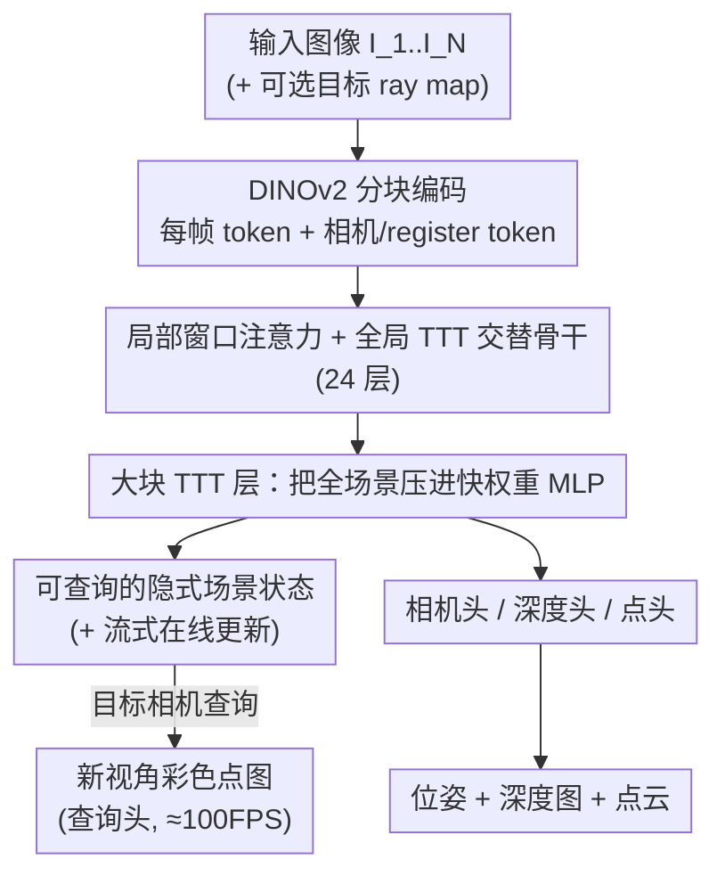

# ZipMap: Linear-Time Stateful 3D Reconstruction via Test-Time Training

**会议**: CVPR 2026  
**论文**: [CVF Open Access](https://openaccess.thecvf.com/content/CVPR2026/html/Jin_ZipMap_Linear-Time_Stateful_3D_Reconstruction_via_Test-Time_Training_CVPR_2026_paper.html)  
**代码**: [项目主页](https://haian-jin.github.io/ZipMap)  
**领域**: 3D视觉  
**关键词**: 前馈3D重建、Test-Time Training、线性复杂度、有状态表示、隐式场景

## 一句话总结
ZipMap 把整段图像集合用 Test-Time Training（TTT）层"压缩"进一个固定大小的快权重 MLP，从而用**线性时间**完成双向前馈 3D 重建（相机位姿 + 深度 + 点云），在精度上追平甚至超过 VGGT/π³ 这类二次复杂度方法，700+ 帧 10 秒内重建（比 VGGT 快 20×），而且这个隐式场景状态还能被实时查询出新视角的几何与外观。

## 研究背景与动机

**领域现状**：前馈 transformer 已经成为 3D 重建的主流范式——DUSt3R/MASt3R 证明一对图就能直接回归稠密几何，VGGT、π³ 把它扩展到多视角，给一堆图就能在单次前向里同时吐出相机位姿、深度图和点云，质量很高。

**现有痛点**：这些 SOTA 方法靠的是跨所有图像 token 的**全局自注意力**来建立几何一致性，计算量随输入图像数 $N$ **二次增长**。一旦输入是几百上千帧的长序列或大型图像集，注意力矩阵就爆了——VGGT 处理 750 帧要 200 多秒，根本没法 scale。

**核心矛盾**：要全局一致性，就得让所有 token 互相看（二次）；想省成本，就退而求其次。已有的线性方法（CUT3R、Point3R、TTT3R）走的是**序列化/局部分块**路线——一帧一帧地循环处理，把成本压到线性，但代价是质量明显下降，而且递归处理容易**误差累积**，输入越长漂得越厉害（见 Fig.4）。所以"线性时间"和"高保真"在前馈重建里一直是个二选一。

**切入角度**：作者注意到 Test-Time Training 这一类线性序列模型的新机制——它把模型的一部分参数当作"快权重"记忆，在推理时用一步梯度下降把上下文信息在线写进去。尤其是 LaCT，把非线性 MLP 的快权重**每一大块 token 更新一次**，既硬件高效又支持双向上下文。这恰好对应"把一大堆图压成一个紧凑状态"的需求。

**核心 idea**：用一个**大块 TTT 层**取代全局注意力——把整个图像集合"拉链式压缩"（zip）进一个固定大小的快权重 MLP 里，用一次前向、线性时间完成全局一致的双向重建；而这个被压出来的状态本身就是一个可实时查询的隐式场景表示。

## 方法详解

### 整体框架
ZipMap 是一个**有状态的前馈模型**：输入 $N$ 张图 $\{I_1,\dots,I_N\}$（视频或无序图像集），单次线性时间前向同时输出每帧的相机位姿 $c_i$、深度图 $D_i$ 和点云 $p_i$；与此同时，模型在前向过程中**自动把整个场景"压"进 TTT 快权重**，形成一个隐式场景表示，之后给一个目标相机（ray map）就能实时查询出该新视角下的彩色点图。

整条管线：每帧先用预训练 **DINOv2** 编码成 patch token，再过一个由 **24 个相同 block** 堆叠的骨干。每个 block = **局部窗口注意力**（只在单帧内部做自注意力，捕捉帧内空间关系）+ **全局大块 TTT 层**（把所有帧的 token 聚合进快权重，做全局信息融合）。骨干输出后，四个预测头（相机/深度/点/查询）各取所需。关键在于：全局信息的聚合不再靠"所有 token 两两相乘"的注意力，而靠"把上下文写进一个固定大小 MLP"，于是复杂度从 $O(N^2)$ 掉到 $O(N)$，而且天然双向（一步梯度看到所有 token）。

### 关键设计

**1. 大块 TTT 层：把全场景"压"进一个固定大小的快权重 MLP**

这是全文的核心，直接针对"全局注意力二次爆炸"这个痛点。作者不再维护一个随 token 数增长的注意力缓冲区，而是把全局信息聚合实现成一次"在测试时的训练"：快权重函数是一个 SwiGLU-MLP $f_W(x)=W_2\big(\mathrm{SiLU}(W_1x)\circ(W_3x)\big)$，其参数 $W=\{W_1,W_2,W_3\}$ 就是要被在线更新的"快权重"。每个 token 投影出 query $q_i$、key $k_i$、value $v_i$，构造一个**虚拟的键值重建目标** $\mathcal{L}(f_W(k_i),v_i)=-f_W(k_i)^\top v_i$，它逼着快权重把"每个 key 映射到对应 value"这件事记住——本质是在线建一个 in-context 联想记忆，这个虚拟目标和最终的 3D 重建 loss 没有关系，只为把上下文写进 MLP。

具体地，对所有视角的所有 token 求一次梯度

$$g=\nabla_W\sum_{k=1}^{N\times p}\eta_i\,\mathcal{L}\big(f_W(k_i),v_i\big),$$

其中每个 token 的学习率 $\eta_i$ 由一个线性层从 token 本身预测（per-token 自适应）。**一步梯度**就把整段图像集合"zip"进了快权重 $\hat W$。之所以线性：更新只扫一遍所有 token（$O(N)$），不做两两交互。之所以仍然全局一致且双向：这一步梯度同时看到了所有帧的所有 token，等价于让每个 token 都"贡献"到同一份共享状态里，而不是像序列模型那样一帧一帧递归（也就避免了 CUT3R/TTT3R 的误差累积）。

更新完后，再把每个 token 的 query 过一遍更新后的快权重 $o_i'=f_{\hat W}(q_i)$，这一步**类比于"用 query 去 self-attention 所有 key-value"，但复杂度是线性而非二次**。对目标 ray token 的 query $q_t$ 同样套用 $f_{\hat W}$，就相当于"用目标视角去 cross-attend 所有输入图"，而且每个目标 token 的开销是常数、与输入视角数 $N$ 无关——这正是后面"实时查询"的根。

**2. 局部窗口注意力 + 全局 TTT 交替的线性骨干**

光有 TTT 还不够：TTT 负责"跨帧的全局融合"，但帧**内部**的空间结构（一张图里像素之间的关系）也得建模。作者的做法是在每个 block 里让两者分工——**局部窗口注意力**用标准自注意力 + 旋转位置编码，只在单个视角（图像或 ray map）的 token 内部做，捕捉帧内空间关系；**全局大块 TTT 层**负责跨所有帧的信息聚合。两者交替堆 24 层，整体复杂度由"局部注意力（每帧固定大小，随 $N$ 线性）+ TTT（随 token 线性）"决定，因此整个骨干都是 $O(N)$。这等于把 VGGT 那套"全局-局部交替注意力"里**最贵的全局注意力**整块换成 TTT，而保留了局部建模能力。工程上也很务实：复用 VGGT 的 DINOv2 编码器，局部窗口注意力权重直接从 VGGT 的帧内注意力初始化，TTT 的一部分参数也从 VGGT 的全局注意力参数初始化，省去从头训。

**3. 让 TTT 更新真正稳定的三件套：Newton–Schulz 正交化 + 门控 + 逐 token 学习率**

把"一步梯度更新 MLP"塞进 24 层骨干里反复做，很容易数值发散或学废，所以作者加了三个关键稳定机制，消融（Tab.6）显示缺一不可。其一，借鉴 Muon 优化器，对快权重梯度做 **Newton–Schulz 正交化**再更新，并配 L2 归一化保持稳定：$\Delta\leftarrow\mathrm{NewtonSchulz}(g)$，$\hat W\leftarrow\|W\|\cdot\frac{W-\Delta}{\|W-\Delta\|}$——去掉它点云精度从 0.337 掉到 0.408（ETH3D Acc.，越低越好），是最关键的一项。其二，借鉴 gated attention 加一个**门控单元**：$o_i=\mathrm{RMSNorm}(o_i')\cdot\mathrm{SiLU}(W_g o_i')$，让模型自适应地调节每个 TTT 输出的强度，去掉后也明显掉点。其三，前面提到的**逐 token 学习率** $\eta_i$ 由线性层预测，比固定全局学习率（0.1 或 1.0）明显更好——固定 1.0 时 Acc. 退化到 0.464。这三件套合起来才让"测试时一步梯度"在深层网络里既稳又有效。

**4. 可查询的隐式场景状态 + 流式在线扩展**

TTT 压出来的快权重不只是"重建的中间产物"，它本身就是一份**隐式场景表示**，带来两个独有能力。其一是**实时查询**：把目标相机的 ray map（每像素 9 维：光线原点 $r_o$、方向 $r_d$、以及 $r_o\times r_d$）patchify 成查询 token，过更新后的快权重 $f_{\hat W}(q_t)$，查询头直接预测该新视角的 RGB $I_t$ 和深度 $D_t$（带置信度），反投影成彩色点云。由于"apply 一个 query"是常数开销、与 $N$ 无关，查询可做到 ≈100 FPS，与输入视角数解耦；实验还显示这个状态能外推出未观测区域的常见结构（墙、地面），说明它学到了基本 3D 先验。其二是**流式重建**：bidirectional 版本是用所有视角 token 一次性更新每层 TTT，而把它改成"一次只用当前帧的 token 在线更新快权重" $W^{(t)}\leftarrow\mathrm{TTTUpdate}\big(W^{(t-1)};\{k_{t,i},v_{t,i}\}\big)$，就自然变成逐帧流式重建——同一套虚拟键值目标，只是从"全量"换成"增量"，无需改架构。

### 损失函数 / 训练策略
总损失 $\mathcal{L}=\mathcal{L}_{point}+\mathcal{L}_{depth}+w_c\mathcal{L}_{cam}+(\mathcal{L}^t_{color}+\mathcal{L}^t_{depth})$，$w_c=5$。点损失用尺度不变的局部点重建损失，全局尺度 $\hat s$ 用 ROE solver 求解；深度损失用预测不确定度 $\Sigma$ 调制的 L1（等价于 Laplacian 负对数似然），$\alpha=0.2$；相机损失先用第一张图作参考视角的 L1，最后阶段**去掉参考视角**改用 π³ 的仿射不变损失（对标准 benchmark 影响有限，但显著改善长序列泛化）；查询损失 $\mathcal{L}^t_{color}=10\times(\text{MSE}+\text{LPIPS})$、$\mathcal{L}^t_{depth}$ 只在 finetune 时启用。token 维 $d=1024$，快权重 MLP 中间维 2048，每层状态大小 $6d^2$。在 64 张 H100 上**三阶段训练**：先静态数据集带参考视角训 80K 步（约 5 天）；再加入动态数据集 finetune 40K 步；最后去掉参考视角再训 60K 步。共用 29 个公开数据集。

## 实验关键数据

### 主实验

相机位姿估计（Tab.1，AUC↑）：在 RealEstate10K / Co3Dv2 上，ZipMap 作为线性方法全面碾压同为线性的 CUT3R/TTT3R，并逼近二次方法。

| 方法 | 复杂度 | RE10K AUC@30 ↑ | Co3Dv2 AUC@30 ↑ |
|------|--------|----------------|------------------|
| VGGT | $O(N^2)$ | 78.89 | 89.99 |
| π³ | $O(N^2)$ | 87.40 | 87.93 |
| CUT3R | $O(N)$ | 81.68 | 71.72 |
| TTT3R | $O(N)$ | 81.51 | 69.46 |
| **ZipMap** | $O(N)$ | **84.30** | **88.76** |

点图估计（Tab.4，DTU/ETH3D，越低越好）：ZipMap 把线性方法的精度拉到与 VGGT/π³ 同级。

| 方法 | 复杂度 | DTU Acc.↓ | ETH3D Acc.↓ |
|------|--------|-----------|-------------|
| VGGT | $O(N^2)$ | 1.308 | 0.270 |
| π³ | $O(N^2)$ | 1.151 | 0.188 |
| CUT3R | $O(N)$ | 5.045 | 0.593 |
| TTT3R | $O(N)$ | 5.337 | 0.763 |
| **ZipMap** | $O(N)$ | **1.228** | **0.254** |

效率（Fig.1）：750 帧 < 10 秒（75 FPS），比 VGGT（>200 秒）快 **20×+**，也比 CUT3R/TTT3R 快约 3×（因为后者逐帧串行、GPU 利用率低）。视频深度（Tab.5）上 ZipMap 也稳定超过所有 $O(N)$ 方法、并普遍优于 VGGT。

### 消融实验

TTT 关键组件消融（Tab.6，ETH3D 点图，越低越好）：

| 配置 | Acc.↓ Mean | 说明 |
|------|-----------|------|
| Full model | 0.337 | 完整模型 |
| w/o gated unit | 0.354 | 去门控，明显掉点 |
| w/o Newton–Schulz | 0.408 | 去正交化，掉点最多 |
| w/ 固定全局 lr=0.1 | 0.411 | 不如逐 token lr |
| w/ 固定全局 lr=1.0 | 0.464 | 退化最严重 |

### 关键发现
- **Newton–Schulz 正交化是稳定 TTT 的命门**：去掉它 Acc. 从 0.337 退到 0.408，是单项里掉点最多的；逐 token 自适应学习率也显著优于任何固定全局学习率（1.0 时退到 0.464）。
- **长序列才是 ZipMap 的主场**（Fig.4，DL3DV）：随着输入帧数增加，CUT3R/TTT3R 的 ATE 急剧上升（递归误差累积），而 ZipMap 始终贴着 π³/VGGT，无论是"加场景规模（取前 N 帧）"还是"加视角密度（均匀抽 N 帧）"都稳。
- **去参考视角**对标准 benchmark 无明显增益，但显著改善长输入序列的精度与泛化——这是个针对 scale 的有意取舍。
- **隐式状态真的学到了 3D 先验**：只靠查询状态（不看输入图）重建出的点云与从输入图重建的几乎一致，还能外推未观测区域的墙/地面等常见结构，只是确定性输出无法幻想高频细节或全新物体。

## 亮点与洞察
- **把"线性序列模型"的思想迁移到"双向多视角 3D 重建"**：Mamba/Linear Transformer 等线性架构本是为 1D 因果语言序列设计的，不适合"几百张图、双向依赖"的场景；作者用 LaCT 式大块 TTT 一步打通，既线性又双向，这个跨域嫁接很漂亮。
- **"重建副产物"升级为"可查询状态"**：最巧的是被压缩的快权重 MLP 不是一次性中间量，而是一个能被新视角实时 query 的隐式场景——同一套 TTT 机制同时解决了"线性 scale"和"持久化场景表示"两个目标，一鱼两吃。
- **务实的初始化策略可复用**：直接拿 VGGT 的 DINOv2 + 帧内注意力 + 全局注意力参数来初始化窗口注意力和 TTT，说明"把已有二次模型的注意力替换成 TTT"是一条可迁移的加速路径，而不必从零训。
- **bidirectional ↔ streaming 仅靠"全量 vs 增量更新"切换**：同一虚拟键值目标，喂全部 token 就是双向、喂当前帧就是流式，架构零改动——这种统一性对部署很友好。

## 局限与展望
- **确定性输出无法补全未见内容**：作者承认模型只能外推常见结构（墙、地面），无法幻想出沙发这种被遮挡物体或高频细节；要做真正的生成式补全需要引入扩散等随机性。
- **参数量并不小**：ZipMap 1.40B 参数，比 π³（959M）更大，"线性"省的是随 $N$ 的 scaling 而非绝对模型体量；在短序列（少量图）场景下，二次方法的常数开销优势可能让 ZipMap 的速度优势不明显。
- **TTT 训练对数值稳定性高度敏感**：消融显示缺了 Newton–Schulz 或门控就明显退化，意味着这套"测试时一步梯度"需要精心的正交化/归一化/门控配合才稳，复现门槛不低。
- **流式与查询能力主要在附录评估**：正文聚焦双向重建，streaming 与 scene-state querying 的定量结果放在 Appendix，主文对这两项独有能力的量化支撑相对单薄。

## 相关工作与启发
- **vs VGGT / π³**：同样是前馈多视角重建，它们用全局/交替注意力建立一致性、复杂度 $O(N^2)$；ZipMap 把全局注意力整块换成大块 TTT 层，做到 $O(N)$ 且精度追平，长序列上反而更稳——核心区别是"两两交互的注意力"换成"压进固定大小快权重"。
- **vs CUT3R / TTT3R / Point3R**：同为线性复杂度，但它们靠**逐帧递归**处理，容易误差累积、长序列掉点严重；ZipMap 是**一步梯度看到所有 token 的非递归双向**更新，既不累积误差又支持双向上下文，长序列精度大幅领先。
- **vs LaCT / TTT 原始工作**：ZipMap 把 LaCT 的"大块快权重 MLP"从语言序列搬到 3D 重建，并补上 Newton–Schulz、门控、逐 token 学习率等稳定化设计，证明 TTT 不仅能省算力，还能顺带产出一个可查询的隐式场景表示。
- **vs 经典 SfM（COLMAP/GLOMAP）**：经典管线输出稀疏、需要大重叠和耗时的 MVS 阶段；ZipMap 把位姿与稠密几何统一进一次快速前向。

## 评分
- 新颖性: ⭐⭐⭐⭐⭐ 首次把大块 TTT 引入双向多视角 3D 重建，同时解决线性 scale 与可查询状态两个目标。
- 实验充分度: ⭐⭐⭐⭐ 位姿/点图/深度全覆盖 + 长序列分析 + 关键消融到位，但流式/查询量化偏附录。
- 写作质量: ⭐⭐⭐⭐ 动机与 TTT 机制讲得清晰，公式完整；部分句子有笔误。
- 价值: ⭐⭐⭐⭐⭐ 让前馈 3D 重建真正能 scale 到数百上千帧，且给出可查询场景状态，路线很有延展性。

<!-- RELATED:START -->

## 相关论文

- [\[CVPR 2026\] tttLRM: Test-Time Training for Long Context and Autoregressive 3D Reconstruction](tttlrm_test-time_training_for_long_context_and_autoregressive_3d_reconstruction.md)
- [\[CVPR 2026\] Learning 3D Reconstruction with Priors in Test Time](tco_learning_3d_reconstruction_with_priors_in_test_time.md)
- [\[CVPR 2026\] Low-Rank Test-Time Training for Pre-Trained Point Cloud Models](low-rank_test-time_training_for_pre-trained_point_cloud_models.md)
- [\[CVPR 2026\] Rethinking Dense Optical Flow without Test-Time Scaling](rethinking_dense_optical_flow_without_test-time_scaling.md)
- [\[CVPR 2026\] BulletGen: Improving 4D Reconstruction with Bullet-Time Generation](bulletgen_improving_4d_reconstruction_with_bullet-time_generation.md)

<!-- RELATED:END -->
