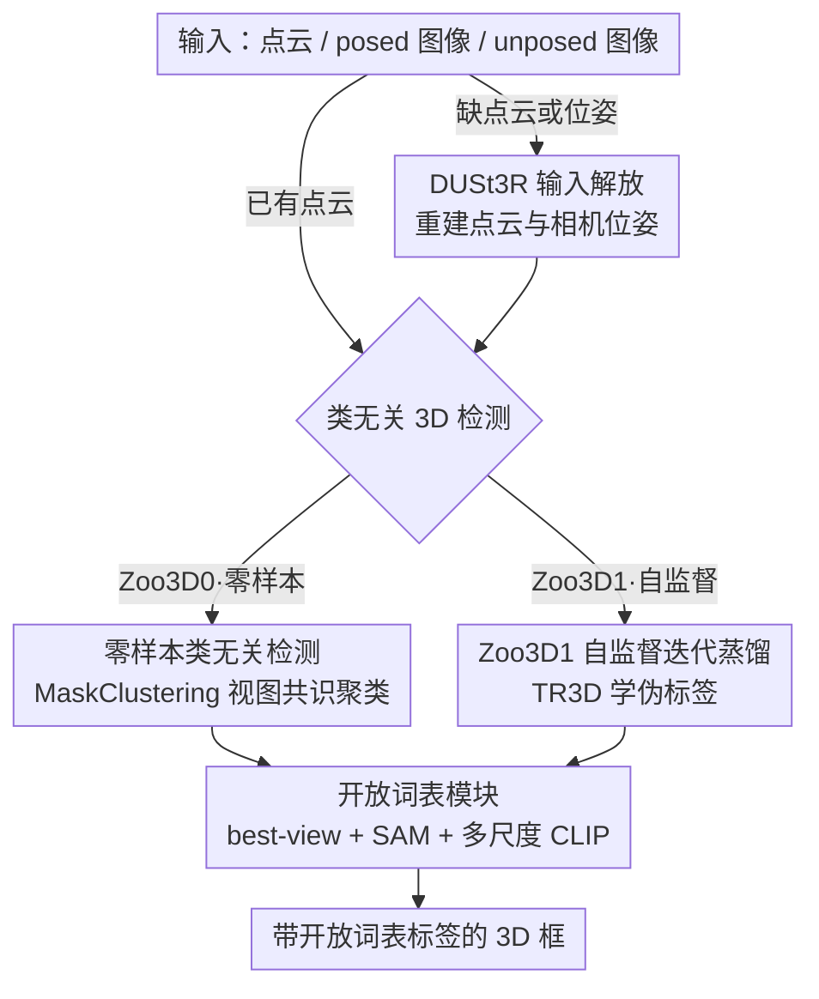

# Zoo3D: Zero-Shot 3D Object Detection at Scene Level

**会议**: CVPR 2026  
**论文**: [CVF Open Access](https://openaccess.thecvf.com/content/CVPR2026/html/Lemeshko_Zoo3D_Zero-Shot_3D_Object_Detection_at_Scene_Level_CVPR_2026_paper.html)  
**代码**: https://github.com/col14m/zoo3d  
**领域**: 3D视觉  
**关键词**: 零样本检测, 开放词表, 3D目标检测, 免训练, 多视角

## 一句话总结
Zoo3D 提出第一个**完全免训练（zero-shot）**的场景级 3D 目标检测框架：用 2D 实例掩码的图聚类直接拼出 3D 框、再用一个带「最佳视角选择 + SAM 精修 + 多尺度 CLIP」的开放词表模块打语义标签，并借 DUSt3R 把输入从点云一路放宽到无位姿的纯图像，在 ScanNet200／ARKitScenes 上零样本就超过了所有自监督方法。

## 研究背景与动机

**领域现状**：3D 目标检测要给场景里的物体同时预测类别和带朝向的 3D 框。全监督方法（FCAF3D、TR3D、UniDet3D，乃至近期的 LLM 系 Video-3D LLM）精度很高，但受限于标注数据的类别数量，无法识别没见过的物体。为了摆脱标注，开放词表方向逐步走向「半监督（OV-Uni3DETR 用部分 3D 框）→ 自监督（OV-3DET、ImOV3D 靠伪标签）」，监督越来越弱。

**现有痛点**：即便是最省事的自监督方法，**仍然必须在训练场景上跑过一遍**——要么需要训练场景的点云，要么需要图像去蒸馏 2D 监督，而且伪框生成质量参差、文本-视觉对齐策略也不够干净。换句话说，「不需要 3D 标注」≠「不需要训练数据」。同时，推理时普遍要求现成的点云，而手机/消费相机场景往往连点云和相机位姿都没有。

**核心矛盾**：要识别任意开放类别，自然要借 CLIP/SAM 这类 2D 基础模型；但已有工作只把它们当作「训练阶段的伪标签生产者」，没人敢问：能不能把整条 3D 检测管线做成**一行训练都不用**？同时还要解决「连点云都没有」的输入缺失。

**本文目标**：把 3D 检测的监督和输入需求一路压到极限——从「点云 + 真值标注」出发，逐步去掉标注、去掉训练、去掉点云、去掉相机位姿，看看最极端设置下还能不能打。

**切入角度**：作者把开放词表 3D 检测**解耦**成两件互不依赖的事——「类无关地定位 3D 框」和「给框打开放词表标签」。前者可以借 zero-shot 3D 实例分割（MaskClustering）的成熟能力，后者只需要冻结的 CLIP/SAM 在推理时做对齐，两段都不需要训练。

**核心 idea**：用「2D 掩码图聚类拼 3D 框 + 冻结 CLIP/SAM 打标」替代「在 3D 场景上训练检测器」，再用 DUSt3R 把缺失的点云/位姿补出来，从而实现首个真正 zero-shot 的场景级 3D 检测。

## 方法详解

### 整体框架
Zoo3D 把开放词表 3D 检测拆成两段流水线：**先类无关地预测 3D 框 $\{b_g\}_{g=1}^G$，再由开放词表模块逐框分配语义标签 $l_g$**。框的来源有两种模式：零样本的 **Zoo3D0** 直接把 MaskClustering 的 2D 掩码聚类成 3D 框（一行训练都不用）；自监督的 **Zoo3D1** 则用 Zoo3D0 产出的伪框去训练一个类无关的 TR3D 检测器，从而提升框质量。两种模式共用**同一个**开放词表模块来打标签。最后，为了摆脱「必须有点云」的限制，作者用 DUSt3R 从 posed 甚至 unposed 图像重建出点云与位姿，把图像输入也归约成点云输入。

3D 框定义为轴对齐框 $b_g=(c_g, s_g)$，$c_g\in\mathbb{R}^3$ 是中心、$s_g\in\mathbb{R}^3_+$ 是 x/y/z 三轴尺寸（不预测旋转）。

### 关键设计

**1. 零样本类无关 3D 检测：把 MaskClustering 从实例分割改造成出框器**

痛点是「不训练，怎么得到 3D 框」。作者基于 SOTA 的 zero-shot 3D 实例分割方法 MaskClustering：先用一个类无关掩码预测器给每帧出 2D 掩码 $\{m_{t,i}\}$，把每个掩码当作「掩码图」里的一个节点，**同属一个实例的掩码之间连边**。是否连边由「视图共识率（view consensus rate）」决定——对帧 $t'$ 的掩码 $m_{t',i}$ 与帧 $t''$ 的掩码 $m_{t'',j}$，先找出两者都可见的观察帧集合 $F_o$，再在其中找「支持帧」$F_s$（某帧里存在一个掩码 $m_{t,k}$，其点云同时覆盖了 $m_{t',i}$、$m_{t'',j}$ 投到该帧的可见部分），共识率即支持者占观察者的比例：

$$cr(m_{t',i}, m_{t'',j}) = \frac{|\{t\in V \mid \exists k,\, P^t_{t',i}, P^t_{t'',j} \sqsubset P_{t,k}\}|}{|F_o|}$$

当 $cr \ge \tau_{rate}=0.9$ 时连边，随后迭代地（每轮去掉观察者数小于 $n_k$ 的边、把连通分量并成新节点）合并掩码得到 3D 实例。**关键改造在最后一步**：由于只考虑轴对齐框，作者直接取每个实例点集的 xyz 最小/最大坐标当作框的角点，于是分割结果被「免费」转成了 3D 框。这样整条定位管线全程冻结、零训练，却继承了 MaskClustering 的实例质量。

**2. 开放词表模块：best-view 选择 + SAM 精修 + 多尺度 CLIP 三件套**

有了类无关框，还要在不训练的前提下打开放词表标签。朴素做法是把框内点投到图像、用框住的区域喂 CLIP，但**框本身有误差、投影会被遮挡污染、单一视角不可靠**。模块逐一拆解这三个问题：先把点云按框裁出 $P_g=\{p_i\in P \mid c_g-\tfrac{s_g}{2}\le p_i \le c_g+\tfrac{s_g}{2}\}$，用内外参把点投到第 $t$ 帧 $u_{t,i}=\pi(KR_t[x_i,y_i,z_i,1]^T)$；再**反投影做遮挡过滤**，把回投后与原 3D 点偏移超过阈值 $\tau_{occ}$ 的点剔除，得到干净的投影点集 $U^t_g$。然后**按投影点数选 top-5 视角**（best-view，可见点越多越可靠）。针对「框不准导致掩码错位」，作者用投影点的 min/max 求一个 2D 框 $bb_{2d}$ 当作 prompt 喂给 **SAM**，得到精修后的物体掩码；该掩码再按三种尺度处理后送入 **CLIP**。最终把 5 个视角 × 3 个尺度的特征向量平均，与各类别名的文本特征算余弦相似度，取最相似者为标签及置信度——整段只用冻结的 CLIP ViT-H/14 与 SAM 2.1，推理期对齐、不微调。

**3. Zoo3D1：用零样本伪框自监督训练，再迭代蒸馏到 Zoo3D2**

免训练的 Zoo3D0 已经 SOTA，但掩码图聚类慢、且作为「免训练」总有精度天花板。作者顺势把 Zoo3D0 当作伪标签发生器：用它给训练场景生成类无关 3D 框，然后训练一个**类无关版 TR3D** 来学这些框。改造 TR3D 时去掉了所有「按类别路由」的设计——原版把物体分大/小类别、在不同分辨率层（32cm/16cm）分头预测，但开放词表下无法预定义类别，于是统一只在 16cm 层出框；同时砍掉分类分支，检测头只对每个 3D 位置 $\hat{v}_j$ 回归 objectness 置信度 $\tilde{z}_j$、中心偏移 $\Delta c_j$、对数尺寸 $\tilde{s}_j$，解码为 $c_j=\hat{v}_j+\Delta c_j$、$s_j=\exp(\tilde{s}_j)$、$p_j=\sigma(\tilde{z}_j)$。训练用 focal loss 管 objectness、DIoU loss 管框回归，$L=L_{focal}+L_{DIoU}$，assigner 把每个真值物体配给最近的 6 个位置。更进一步，作者做**迭代蒸馏**：用训好的 Zoo3D1 重新生成更好的伪标签、再训一遍得到 Zoo3D2，实验证明 0→1、1→2 都涨点，到第三轮饱和。相比 Zoo3D0 的图聚类，TR3D 是轻量稀疏卷积网络，推理快得多。

**4. DUSt3R 输入解放：从点云一路放宽到无位姿纯图像**

前述管线都假设有点云，但真实场景常常只有图像。作者用基础模型 DUSt3R 当作「2D↔3D 的桥」：在 **posed 图像**模式下，DUSt3R 输出稠密深度图，结合真值位姿融进 TSDF 体素、再抽出点云，于是问题归约回点云检测；在最难的 **unposed 图像**模式下（手机随手拍，无内外参），DUSt3R 在单个端到端框架里同时推断深度和相机位姿，照样融合出点云。选 DUSt3R 还有个微妙好处——它没在 ScanNet 上训练过，**避免了数据泄漏**，让整条管线在 zero-shot 设定下站得住脚。消融显示换成 DROID-SLAM 重建会让质量崩塌（unposed 类无关 mAP25 从 19.0 跌到 2.4），说明重建质量是这条路的命门。

## 实验关键数据

数据集：ScanNet（10/20/60/200 类四个 benchmark，均不使用真值 3D 框，报 mAP@IoU0.25 与 0.5）与 ARKitScenes（17 类，类无关评测，报 precision/recall）。开放词表模块用 CLIP ViT-H/14 + SAM 2.1 (Hiera-L)，每场景采 45 帧。

### 主实验：点云输入下的开放词表检测

| Benchmark | 指标 | 之前 SOTA (OV-Uni3DETR†) | Zoo3D0 (零样本) | Zoo3D1 (自监督) |
|-----------|------|------|------|------|
| ScanNet20 | mAP25 | 25.3 | 34.7 | **37.2** (+11.9) |
| ScanNet60 | mAP25 | 19.4 | 27.1 | **32.0** (+12.6) |
| ScanNet200 | mAP25 | — | 21.1 | **23.5** |
| ScanNet10 | mAP25 | 34.1 | 42.1 | **44.5** (+10.4) |

（† 表示训练时用了真值 3D 框。）即便完全零样本的 Zoo3D0 也已全面超过用了 3D 框监督的 OV-Uni3DETR。

### 跨输入模态：posed / unposed 图像

| 输入模态 | 方法 | ScanNet20 mAP25 | ScanNet60 mAP25 | ScanNet200 mAP25 |
|----------|------|------|------|------|
| Posed 图像 | OpenM3D | 19.8 | — | 4.2 |
| Posed 图像 | DUSt3R→Zoo3D1 | **32.8** | **23.9** (+12.7 vs OV-Uni3DETR) | **16.5** |
| Unposed 图像 | DUSt3R→Zoo3D0 | 24.2 | 13.3 | 8.3 |
| Unposed 图像 | DUSt3R→Zoo3D1 | **27.9** | **15.3** | **10.7** |

最惊人的是：连点云和位姿都没有的 unposed Zoo3D1，精度已逼近用点云训练的 OV-Uni3DETR。

### 消融：开放词表模块三件套（posed，ScanNet200）

| 配置 | mAP25 | mAP50 | 说明 |
|------|-------|-------|------|
| base | 14.7 | 5.7 | 仅投影点框近似掩码 |
| + 遮挡过滤 | 14.8 | 5.7 | 几乎无影响 |
| + SAM 掩码精修 | 15.4 | 5.7 | 主要拉 mAP25 |
| + 多尺度处理 | **16.5** | **6.3** | 主要拉 mAP50 |

### 关键发现
- **SAM 精修与多尺度是开放词表模块的主力**：SAM 精修主要提升 mAP25（更准的掩码→更对的语义），多尺度主要提升 mAP50（更紧的框/特征），遮挡过滤几乎不影响主指标但保证投影干净。
- **迭代训练有效但很快饱和**：Zoo3D0→1→2 在 posed ScanNet200 上类无关 mAP25 为 22.4→36.1→37.6，第三轮起不再涨。
- **精度是用时间换的**：Zoo3D 最贵的是 DUSt3R 重建（294s/场景）；Zoo3D0 的掩码图聚类慢（检测 56s），Zoo3D1 检测仅 0.04s 但会产生大量重复框，导致开放词表阶段反而更耗时（84s），而 OpenM3D 全程不到 1s——速度换来的是远更高的精度。
- **帧数越多越好、但 15 帧就够打**：45 帧达峰，ScanNet200 上 Zoo3D0 仅用 15 帧就超过 OpenM3D。
- **重建质量是命门**：把 DUSt3R 换成 DROID-SLAM，unposed 类无关 mAP25 从 19.0 暴跌到 2.4。

## 亮点与洞察
- **「解耦定位与打标」是整篇能 zero-shot 的根本**：把开放词表检测拆成「类无关出框（借 MaskClustering）+ 冻结 CLIP/SAM 打标」，两段都不碰 3D 训练，这个分解思路可直接迁移到 zero-shot 6-DoF 检测、场景图生成等需要「定位 + 语义」的任务。
- **把实例分割「免费」转成检测框**：因为只做轴对齐框，min/max 取角点这一步几乎零成本地复用了成熟的分割能力——提醒我们很多「新任务」其实能靠现成上游模型的输出格式转换拿下。
- **best-view + SAM-as-prompt 的对齐技巧很实用**：用投影点的 2D 框当 SAM prompt 来纠正不准的 3D 框，是一种「让下游 2D 基础模型反过来修正 3D 误差」的巧妙闭环。
- **DUSt3R 选型兼顾能力与公平**：选它不只因为能 unposed 重建，更因为它没在 ScanNet 上训练，天然杜绝数据泄漏，让「zero-shot」名副其实。

## 局限性 / 可改进方向
- **极慢**：单场景 DUSt3R 重建近 300s、Zoo3D1 开放词表阶段因重复框 84s，离实时差很远；作者也把「更快的重建/分割/打标」列为首要 future work。
- **重建质量天花板明显**：unposed 模式完全押注 DUSt3R，换个重建器就崩，说明该路线对基础模型质量极度敏感、鲁棒性存疑。
- **只支持轴对齐框**：不预测朝向，对有明显旋转的物体（斜放的桌椅、户外车辆）会失真；论文也只验证室内场景，户外 BEV 场景未覆盖。
- **mAP50 普遍偏低**：例如 unposed Zoo3D1 在 ScanNet200 上 mAP50 仅 3.8，说明框的精确度（紧致度）还很弱，更多靠粗定位 + 强语义吃分。
- 可改进方向：引入 LLM 做空间推理辅助打标、用更快的前馈重建替代 DUSt3R、对重复框做更强的 NMS/去重以降低开放词表阶段开销。

## 相关工作与启发
- **vs OV-Uni3DETR / OpenM3D（自监督开放词表）**: 它们仍需在训练场景（点云或图像 + 深度监督，OpenM3D 还微调 CLIP）上训练；Zoo3D 全程冻结 CLIP/SAM、推理期对齐，Zoo3D0 零训练就反超它们，Zoo3D1 进一步领先。
- **vs MaskClustering / SAM2Object（zero-shot 3D 实例分割）**: 它们只做实例分割、不出检测框也不打开放词表标签；Zoo3D 把分割结果转成 3D 框并接上开放词表模块，首次把 zero-shot 推进到「场景级 3D 检测」这一新任务。
- **vs SAM3D（户外 zero-shot）**: SAM3D 在 BEV 投影上做、不适用室内；Zoo3D 专攻室内多视角场景，填补了室内 zero-shot 3D 检测的空白。
- **vs VLM-3R / SpatialLM（unposed 图像）**: 这些 LLM 系方法需要完整监督；Zoo3D 借 DUSt3R 在 unposed 设定下做到自监督甚至零样本，是该模态下首个免标注方案。

## 评分
- 新颖性: ⭐⭐⭐⭐⭐ 提出并首次解决「场景级 zero-shot 3D 检测」新任务，免训练管线设计干净有力。
- 实验充分度: ⭐⭐⭐⭐⭐ 四个 benchmark × 三种输入模态全覆盖，消融到组件、帧数、重建器、迭代轮次、推理时间。
- 写作质量: ⭐⭐⭐⭐ 「逐步放宽监督与输入」的叙事很清晰，但部分公式符号（如 $V$ 与 $F_o$ 的关系）需对照原文。
- 价值: ⭐⭐⭐⭐ 开放词表 3D 检测向「即插即用、无需标注与点云」迈出关键一步，唯速度限制其落地。

<!-- RELATED:START -->

## 相关论文

- [\[CVPR 2026\] Few-Shot Incremental 3D Object Detection in Dynamic Indoor Environments](few-shot_incremental_3d_object_detection_in_dynamic_indoor_environments.md)
- [\[ICCV 2025\] Accelerate 3D Object Detection Models via Zero-Shot Attention Key Pruning](../../ICCV2025/3d_vision/accelerate_3d_object_detection_models_via_zero-shot_attention_key_pruning.md)
- [\[ECCV 2024\] Zero-Shot Multi-Object Scene Completion](../../ECCV2024/3d_vision/zero-shot_multi-object_scene_completion.md)
- [\[CVPR 2026\] ConceptPose: Training-Free Zero-Shot Object Pose Estimation using Concept Vectors](conceptpose_training-free_zero-shot_object_pose_estimation_using_concept_vectors.md)
- [\[CVPR 2026\] Towards Intrinsic-Aware Monocular 3D Object Detection](towards_intrinsic-aware_monocular_3d_object_detection.md)

<!-- RELATED:END -->
