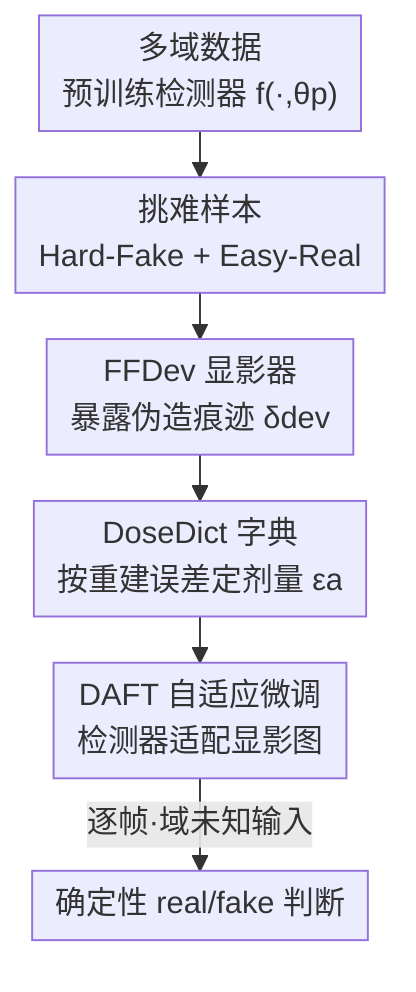

# A Sanity Check for Multi-In-Domain Face Forgery Detection in the Real World

**会议**: CVPR 2026  
**论文**: [CVF Open Access](https://openaccess.thecvf.com/content/CVPR2026/html/Cheng_A_Sanity_Check_for_Multi-In-Domain_Face_Forgery_Detection_in_the_CVPR_2026_paper.html)  
**代码**: 待确认  
**领域**: AI安全 / Deepfake检测  
**关键词**: 人脸伪造检测, 多域训练, 帧级判别, 字典学习, 模型无关后处理

## 一句话总结
这篇论文先做了个"sanity check"：揭示现有 deepfake 检测器在多域混合数据上看似高 AUC、实则单帧 real/fake 准确率（ACC）很低，因为"域差异"在特征空间里盖过了"真假差异"；随后提出模型无关的两阶段框架 DevDet（FFDev 暴露伪造痕迹 + DAFT 自适应剂量微调），在保持原泛化能力的同时把帧级 ACC 显著拉高。

## 研究背景与动机

**领域现状**：人脸伪造检测的主流目标是训"泛化检测器"——只用有限（甚至单一）域的数据（如 FaceForensics++）训练，期望能迁移到完全没见过的伪造类型。为应对伪造技术不断演化，也有人走"增量学习"（IFFD）路线，一个域一个域地学。

**现有痛点**：作者指出泛化范式过于理想化——用五年前的 GAN 换脸数据，根本指望不上检测今天的扩散模型整脸合成。而增量学习路线则受困于灾难性遗忘；考虑到伪造检测本就是个训练成本极低的二分类任务，IFFD 省下的那点训练时间，相对它带来的遗忘损失完全不划算。更关键的是，这两条路线评估时都按"逐域（domain-by-domain）"统计，掩盖了真实部署中"逐帧、域未知"的判别需求。

**核心矛盾**：当多个域被塞进同一个隐空间，**域间差异（inter-domain discrepancy）会主导特征分布，压过真/假之间那点细微差异**。后果是：检测器在每个特定域内能把 real/fake 大致分开（高 in-domain AUC），但面对一张域未知的单图、需要用 0.5 阈值给出绝对判断时就崩了（低 ACC）。论文 Fig.2 给出直观证据：Domain1 的真、假样本反而都更靠近 Domain2 的真样本，落在决策边界缝隙里的域未知输入既不像真也不像假。

**本文目标**：(1) 定义一个更贴近真实世界的研究范式——在足量、多样的多域真假数据上训练，然后对**域未知的逐帧单图**给出确定性真假判断；(2) 设计一个能"放大真假差异、压过域差异"的方法，且要能挂在任意预训练 backbone 上、不损失其原有泛化能力。

**切入角度**：把伪造检测器类比成"摄影显影液"——既然真假差异太微弱被域差异淹没，那就主动"显影"，把潜在伪造痕迹放大到主导隐空间。

**核心 idea**：用一个可学习的"显影器"在检测前对输入做预处理，专门暴露并放大伪造痕迹，让真假差异（而非域差异）主导检测器的特征空间，从而实现逐帧、域未知的可靠二分类。

## 方法详解

### 整体框架

论文提出 **MID-FFD（Multi-In-Domain Face Forgery Detection）** 任务范式，并给出模型无关的两阶段框架 **DevDet（Developer for Detector）**。整体思路：先在大规模多域数据上按官方设计预训练一个普通检测器 $f(\cdot,\theta_p)$，再用 DevDet 把它"升级"——**Stage 1** 训练一个 Face Forgery Developer（FFDev），它像显影液一样把伪造痕迹"冲洗"出来贴回输入图；**Stage 2** 用 Dose-Adaptive Fine-Tuning（DAFT）微调检测器去适应"被显影后的图"，同时引入 DoseDict 字典逐图自适应地调节"显影剂量"，确保难样本多显影（提上界）、易样本/域外样本少显影（保下界与泛化）。推理时对每张域未知输入：先查 DoseDict 算出自适应剂量 $\epsilon_a$，再用 FFDev 显影得到 $\tilde{x}$，最后送检测器出真假置信度。

### 关键设计

**1. MID-FFD 范式与 S-AUC 协议：戳破"高 AUC ≈ 能用"的错觉**

这是论文标题"sanity check"的落点，也是全文动机的支点。痛点在于：社区长期默认两条"看似显然"的推论——单域上的强性能能无缝迁移到多域应用；域内真假分布的相对可分性能转化为绝对的逐帧判断。作者用实验证明这俩都是误导。机制上，论文区分了两套指标：域内 AUC（衡量相对排序，对域差异不敏感）和帧级 ACC（用固定 0.5 阈值的**绝对**判断，对域差异极敏感）。为防止逐域 AUC 的"域信息泄漏"（每个域单独算 AUC 等于偷偷告诉模型这是哪个域），论文提出 **Summarized AUC（S-AUC）**：把所有测试集合并成一个统一 benchmark 再算 AUC，逼模型在不知道域归属的条件下排序。它之所以有效，是因为它把"知道域"这个隐含外挂拿掉了，暴露出真实部署中真假差异被域差异淹没的本质困难——这就是后续 FFDev/DAFT 要解决的问题。

**2. FFDev（Face Forgery Developer）：把微弱伪造痕迹"显影"到主导隐空间**

既然真假差异太弱被域差异盖过，FFDev 直接在像素层面放大它。机制上，用一个基于图像重建网络的 DevGen $G(\cdot,\theta_g)$ 生成一张与输入同尺寸的"显影图" $\delta_{dev}=G(x,\theta_g)\in\mathbb{R}^{H\times W\times3}$，加回原图得到 $\tilde{x}=x+\epsilon\delta_{dev}$（$\epsilon$ 是剂量），再送**冻结的**预训练检测器 $f(\cdot,\theta_p)$ 出预测 $y_p$。训练 FFDev 的巧妙之处在于样本与损失的设计：只用两类样本——**Easy-Real（ER）** 和 **Hard-Fake（HF）**，分别取自训练集中置信度排序最靠近 0（real）的 top-k 真样本，以及本应是 fake 却被错判成偏 real 的难假样本。显影损失是交叉熵 $L_{dev}=-(\hat{y}\log y_p+(1-\hat{y})\log(1-y_p))$，对 ER 它要求"显影后仍判为真"（保证 FFDev 不破坏真图固有特征），对 HF 它要求"显影后判为假"（把之前被误判的难假样本的伪造特征强行放大）。再加一个 Total Variation 损失 $L_{tv}$ 平滑 $\delta_{dev}$ 帮助收敛与泛化，总目标 $L_{o1}=L_{dev}+\lambda_{tv}L_{tv}$。这样 FFDev 提升了检测的**上界**——专门攻克难样本，让 backbone 原本看不见的伪造痕迹变可见。

**3. DAFT + DoseDict：逐图自适应剂量，托住泛化下界**

光有 FFDev 会有副作用：固定剂量地给所有图显影，会把检测器原有的泛化能力一起冲掉（消融里 +FFDev 后 Cross 域从 0.6826 暴跌到 0.5735）。DAFT 的机制是 Stage 2 解冻检测器、用被冻结 FFDev 显影过的图重新微调，让放大后的真假差异在特征空间里超过域差异。真正的关键是 **DoseDict**——一个专门拟合 Hard-Fake 样本的字典 $D\in\mathbb{R}^{d\times K}$，通过稀疏编码交替优化学习：固定 $D$ 解稀疏码 $\alpha_i=\arg\min_\alpha \frac{1}{2}\|z_i-D\alpha\|_2^2+\lambda\|\alpha\|_1$，再固定 $\alpha$ 更新 $D$（带 $\|d_k\|_2\le1$ 约束），其中 $z=f(x_h)$ 是难假样本的特征。推理时用**重建误差** $e(z)=\|z-D^\star\alpha^\star(z)\|_2$ 度量输入与"难假"的相似度，自适应剂量取 $\epsilon_a=\text{Norm}(1-e(x))$：与难假字典越像（重建误差越小）→ 剂量越大、显影越狠（提准确率）；越简单或越落在 MID 知识范围外（重建误差大）→ 剂量越小、几乎不显影（保泛化）。这个"按需下药"机制正是它能同时提 MID 性能又保住域外泛化的原因——消融中只有 +FFDev&DAFT-S（自适应剂量+顺序训练）把 Cross 拉回 0.6896 同时 M-ACC 升到 0.8676。

### 损失函数 / 训练策略
- **Stage 1（FFDev）**：仅优化 $G$，检测器冻结，目标 $L_{o1}=L_{dev}+\lambda_{tv}L_{tv}$，固定剂量 $\epsilon=0.25$，样本只取 Easy-Real 与 Hard-Fake。
- **Stage 2（DAFT）**：冻结 FFDev，用 $\tilde{x}=x+\epsilon_a\delta_{dev}$（$\epsilon_a$ 由 DoseDict 给出，再乘 0.25 与 Stage 1 对齐）微调检测器 $\theta_p$，监督同 $L_{dev}$。
- **关键策略**：两阶段**顺序**训练（先 FFDev 后 DAFT）显著优于并行训练——并行会让两者都收敛不到各自最优。Adam，lr=0.0002，10 epochs，输入 256×256（ViT 用 224），batch 32，单张 A100。

## 实验关键数据

### 主实验

Protocol-1（FF++/CDF/DFDCP/WDF 四个经典域），以 Effort 为 base，报告 S-AUC、Mean-ACC 及各域 F-ACC/R-ACC。关键观察：现有方法常常 F-ACC 与 R-ACC 严重失衡（要么把所有都判真、要么都判假），而本文在两者上同时拔高。

| 方法 | 来源 | S-AUC | M-ACC | CDF F-ACC | CDF R-ACC | WDF R-ACC |
|------|------|-------|-------|-----------|-----------|-----------|
| Xception | CVPR'17 | 0.8732 | 0.6797 | 0.6016 | 0.7362 | 0.7555 |
| SBI | CVPR'22 | 0.8439 | 0.9092 | 0.7631 | 0.6176 | 0.7360 |
| ProDet | NeurIPS'24 | 0.8696 | 0.9124 | 0.7433 | 0.6250 | 0.7683 |
| Effort | ICML'25 | 0.9237 | 0.7312 | 0.5210 | 0.8419 | 0.7839 |
| **Ours** | — | **0.9317** | **0.8545** | **0.7671** | **0.8690** | **0.8764** |

> 注：SBI/ProDet 看似 M-ACC 高（0.90+），但 CDF R-ACC 只有 0.62 左右、F-ACC 偏科严重，说明它们靠"偏向某一类"刷高均值；本文 F-ACC 与 R-ACC 都稳。论文称在二分类置信度上最高提升约 **11.80%**。

Protocol-2（P1 再加 DF40 的 SiT/DiT/BlendFace/SimSwap + CDF3 的 AniTalker/FLOAT 等更先进伪造），报告平均 ACC：

| 方法 | FF++ | CDF | WDF | DF40-BlendFace | DF40-SimSwap | M-ACC |
|------|------|-----|-----|----------------|--------------|-------|
| Effort | 0.8757 | 0.8675 | 0.8012 | 0.8432 | 0.8099 | 0.8486 |
| **Ours** | **0.9270** | **0.8971** | **0.8601** | **0.9401** | **0.8785** | **0.9053** |

### 消融实验

基于 Effnb4，验证每个组件（M-ACC 为四域均值 ACC，Cross 为所有跨域评估均值 ACC）：

| 配置 | M-ACC | Cross | 说明 |
|------|-------|-------|------|
| Base | 0.7624 | 0.6826 | 原始 Effnb4 |
| +FFDev | 0.7823 | 0.5735 | 加显影器，MID 升但**泛化暴跌** |
| +FFDev&DFFT（固定剂量微调） | 0.8526 | 0.5851 | MID 大升，泛化仍崩 |
| +FFDev&DAFT-P（并行训练） | 0.8130 | 0.6341 | 两者都没收敛到最优 |
| **+FFDev&DAFT-S（Ours，顺序+自适应）** | **0.8676** | **0.6896** | MID 最高且泛化保住 |

### 关键发现
- **DoseDict 的自适应剂量是泛化保命符**：单加 FFDev 或固定剂量微调都会把 Cross 域从 0.68 拖到 0.57–0.59，只有自适应剂量（DAFT-S）把 Cross 拉回 0.6896，证明"按难度下药"是同时提 MID、保泛化的关键。
- **顺序训练 > 并行训练**：DAFT-P（并行）M-ACC 仅 0.8130，明显弱于顺序的 0.8676，因为并行让 FFDev 和检测器互相牵制、都收敛不到位。
- **模型无关性强**：Tab.3 把方法挂到 Xception/Effnb4/SPSL/Effort 上，MID-FFD 的 ACC 普遍 +6~10 个点（如 Xception FF++ 0.7764→0.8783），而 Cross 域基本持平，验证可即插即用。
- **可视化佐证**：t-SNE 显示 base 模型在 MID 下有多条互相错位的决策边界，本文则收敛成一条一致边界；Grad-CAM 显示 FFDev 能让 base 看不到的伪造区域"显影"出来，DAFT 又能让无伪造痕迹的真图更自信地判真。

## 亮点与洞察
- **"sanity check"叙事很扎实**：先用 AUC vs ACC 的反差 + t-SNE 把"高 AUC 是假象"讲透，再提 S-AUC 堵住"域信息泄漏"这个评估漏洞，问题定义本身就是一份贡献，比直接堆模型更有说服力。
- **"摄影显影液"类比落到了实处**：FFDev 不是玄学，而是一个可学习的像素级残差 $\delta_{dev}$，靠 Easy-Real 保真 + Hard-Fake 增假的双目标 CE 训练，机制清晰可复现。
- **DoseDict 用字典重建误差当"难度计"很巧**：把"该不该多显影"这个连续决策外包给稀疏字典的重建误差，天然区分了"像难假（多显影）"和"域外/简单样本（少显影）"，这个"自适应强度"思路可迁移到任何"强干预会伤泛化"的后处理任务（如对抗净化、风格归一化）。
- **模型无关 + 不破坏原能力**：作为预处理插件挂在任意 backbone 上，既提 MID 又保 OOD，部署友好。

## 局限与展望
- **依赖一个已经不错的预训练检测器**：Hard-Fake/Easy-Real 的挑选完全靠 base 检测器的置信度排序，若 base 本身很差，难样本定义就不可靠，FFDev 训练信号会带噪。
- **剂量超参较"手工"**：$\epsilon=0.25$、Stage 2 再乘 0.25 都是固定常数，论文没充分讨论其敏感性（仅称在补充材料），换数据规模/backbone 时可能需重调。⚠️
- **DoseDict 字典只拟合 Hard-Fake**：对"难真（Hard-Real）"这类同样容易误判的样本没有对称建模，真样本侧的鲁棒性可能仍有盲区。
- **额外计算开销**：推理时每张图都要先过 DevGen 重建 + DoseDict 稀疏编码再过检测器，相比裸 backbone 有明显延迟增加，论文未给推理耗时对比。⚠️
- **改进思路**：把 DoseDict 扩成真假双字典、或让剂量端到端可学；用更鲁棒的难样本挖掘（如多 backbone 集成投票）替代单模型置信度排序。

## 相关工作与启发
- **vs 泛化范式（Effort / CLIP / SPSL 等）**：它们想用有限域数据训出"一招鲜"的泛化检测器，本文论证这在面对扩散模型整脸合成时不现实，主张直接上大规模多域训练 + 帧级绝对判断；DevDet 还能挂在这些方法之上再涨点。
- **vs 增量学习（IFFD）**：IFFD 逐域学、受灾难性遗忘困扰，且仍按逐域评估；本文指出 FFD 训练成本本就极低，IFFD 省时间不划算，并改用逐帧、域未知的更难评估协议。
- **vs SBI / ProDet 这类高 M-ACC 方法**：它们靠偏向某一类刷高均值 ACC，但 F-ACC/R-ACC 严重失衡；本文用 S-AUC + 双 ACC 暴露这种偏科，并做到两者均衡。

## 评分
- 新颖性: ⭐⭐⭐⭐⭐ 重新定义 MID-FFD 任务 + S-AUC 协议 + "显影液"式预处理，问题与方法都有新意。
- 实验充分度: ⭐⭐⭐⭐ 两套协议、多 backbone 模型无关验证、消融与 t-SNE/Grad-CAM 齐全；推理开销与剂量敏感性未在正文给出。
- 写作质量: ⭐⭐⭐⭐⭐ "sanity check"叙事清晰，动机—问题—方法环环相扣，图表佐证有力。
- 价值: ⭐⭐⭐⭐⭐ 戳破 AUC 假象、贴近真实部署的帧级判别，且即插即用，落地价值高。

<!-- RELATED:START -->

## 相关论文

- [\[CVPR 2026\] DeepfakeImpact: A Two-Stage Benchmark with Real-World Impact in Deepfake Detection](deepfakeimpact_a_two-stage_benchmark_with_real-world_impact_in_deepfake_detectio.md)
- [\[CVPR 2026\] DiffusionFF: A Diffusion-based Framework for Joint Face Forgery Detection and Fine-Grained Artifact Localization](diffusionff_a_diffusion-based_framework_for_joint_face_forgery_detection_and_fin.md)
- [\[ACL 2026\] OmniCompliance-100K: A Multi-Domain Rule-Grounded Real-World Safety Compliance Dataset](../../ACL2026/ai_safety/omnicompliance-100k_a_multi-domain_rule-grounded_real-world_safety_compliance_da.md)
- [\[CVPR 2026\] Frequency-domain Manipulation for Face Obfuscation](frequency-domain_manipulation_for_face_obfuscation.md)
- [\[CVPR 2025\] Forensics Adapter: Adapting CLIP for Generalizable Face Forgery Detection](../../CVPR2025/ai_safety/forensics_adapter_adapting_clip_for_generalizable_face_forgery_detection.md)

<!-- RELATED:END -->
