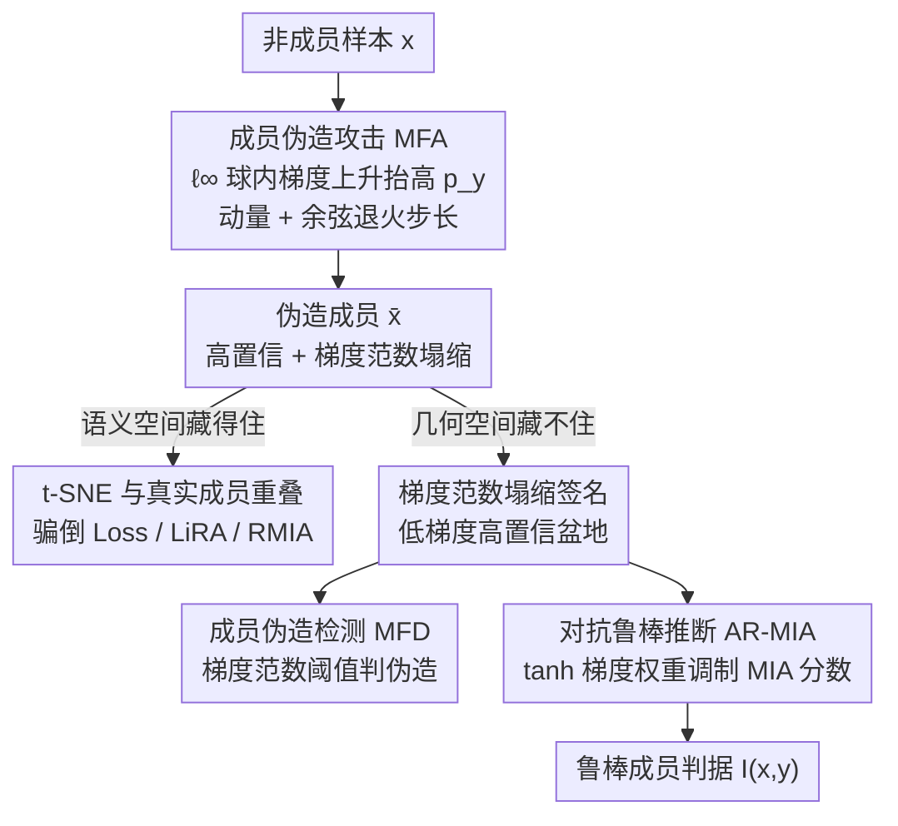

# A Unified Perspective on Adversarial Membership Manipulation in Vision Models

**会议**: CVPR 2026  
**arXiv**: [2604.02780](https://arxiv.org/abs/2604.02780)  
**代码**: [https://github.com/Sjtubrian/Adversarial_Membership_Manipulation](https://github.com/Sjtubrian/Adversarial_Membership_Manipulation)  
**领域**: AI安全  
**关键词**: 成员推断攻击, 对抗成员伪造, 梯度范数, 隐私审计, 视觉模型

## 一句话总结
首次揭示视觉模型成员推断攻击(MIA)面临的对抗性成员操纵漏洞——不可感知扰动可将非成员伪造为成员欺骗审计，发现伪造成员的梯度范数塌缩特征签名，并提出基于梯度几何的检测策略和对抗鲁棒推断框架。

## 研究背景与动机

**领域现状**：成员推断攻击(MIA)判断数据是否属于模型训练集，是隐私审计的核心工具。现有MIA具有精确的检测能力（LiRA、RMIA等）。

**现有痛点**：所有MIA隐式假设查询输入是诚实的（未被篡改）。但对抗学习文献表明，不可感知扰动可以剧烈改变模型行为。**MIA本身是否鲁棒？** 这个问题从未被研究。

**核心矛盾**：MIA依赖模型对真实标签的置信度（损失、似然比）来判断成员身份。对抗扰动可以操纵置信度→MIA的判断可被操纵→隐私审计失效。

**切入角度**：与传统对抗攻击（推向误分类区域）不同，成员伪造攻击将输入推向高置信度区域——与MIA的"成员"判断方向一致。

**核心idea**：(1) 形式化成员伪造攻击(MFA)；(2) 发现伪造成员的梯度范数塌缩特征；(3) 基于梯度范数的检测(MFD)和鲁棒推断(AR-MIA)。

## 方法详解

### 整体框架
这篇论文想回答一个此前没人问过的问题：成员推断攻击（MIA）本身是否经得起对抗扰动？围绕这个问题，论文把攻击、诊断、防御串成一条线——先用**成员伪造攻击 MFA** 证明非成员可以被不可感知的扰动伪造成"成员"来骗过审计，再用**成员伪造检测 MFD** 找出能区分真伪成员的信号，最后用**对抗鲁棒推断 AR-MIA** 把这个信号回填进现有 MIA 流程。三个环节之所以能拧成一股绳，是因为它们共享同一条几何主线：伪造成员会落进一个梯度范数塌缩的"低梯度高置信盆地"，这个塌缩既是攻击留下的痕迹，也是防御抓得住的把手。

### 关键设计

**1. 成员伪造攻击 MFA：把非成员推到模型最自信的地方**

所有 MIA 都隐式假设查询输入是诚实的，而真实成员的标志是模型对真实标签 $y$ 给出高置信度（低损失、高似然比）。MFA 直接攻击这个假设：在 $\ell_\infty$ 球内寻找让真实标签预测概率最大的扰动，$\bar{x} = \arg\max_{x' \in \mathcal{B}_\epsilon[x]} p_y(x')$。注意它和传统对抗攻击（如 PGD 把样本推向误分类区）方向完全相反——PGD 做梯度下降压低正确类置信度，MFA 做梯度上升抬高置信度，所以更新式里是 $x_{k+1} = \Pi_{\mathcal{B}_\epsilon}(x_k - \alpha_k\,\text{sign}(m_{k+1}))$，配合动量 $m$ 稳定方向、余弦退火步长 $\alpha_k = \alpha_0\,\frac{1+\cos(\pi k/N)}{2}$ 在逼近高置信区时减小步幅、避免在峰值附近来回振荡。它有效的关键在于迁移性：Loss attack、LiRA、RMIA 用的判据虽然形式各异，但本质都是 $p_y$ 的单调变换，所以只要把 $p_y$ 推高，这些 MIA 会一致地把伪造样本误判成成员，攻击不针对某一种 MIA 而是同时骗倒一整类。

**2. 成员伪造检测 MFD：抓住伪造留下的梯度范数塌缩签名**

伪造样本最棘手的地方是它在语义上和真实成员无法区分——同标签、同置信度，t-SNE 上和真实成员完全重叠（图 4），所以靠 Mahalanobis 距离、LID 这类语义/特征空间的离群检测全部失效。MFD 的突破口是换一个空间看：优化过程本身在样本上留下了特殊的几何痕迹——**梯度范数塌缩**。随着 MFA 把样本推进高置信区，输入梯度范数 $\|\nabla_x \ell(f(x), y)\|$ 逐步减小，伪造成员最终停在一个低梯度、高置信度的"盆地"里；即便和真实成员处在相同置信度区间，伪造样本的梯度范数也显著更小。Theorem 1 用局部二阶近似证明了单步 signed gradient descent 之后梯度范数必然下降，为这个现象提供了理论支撑。于是检测就退化成一个简单阈值判据 $\mathbf{T}(x,y) = \mathbf{1}[\|\nabla_x \ell(f(x),y)\| \leq \tau']$：梯度范数足够小就判为伪造。换句话说，语义空间藏得住伪造，几何空间藏不住。

**3. 对抗鲁棒推断 AR-MIA：把几何信号直接焊进推断流程**

单独跑一个检测器再接 MIA 不够实用，AR-MIA 索性把梯度信号当成 MIA 统计量的一个调制因子。它定义梯度权重 $w(x,y) = \tanh(\lambda \cdot \|\nabla_x \ell(f(x),y)\|)$，再把原始 MIA 分数 $S(x,y)$ 加权，得到鲁棒判据 $I(x,y) = \mathbf{1}[w(x,y) \cdot S(x,y) > \tau]$：伪造样本梯度范数小、权重接近 0，原本很高的 MIA 分数被压下去，就无法冒充成员。这里用 $\tanh$ 而非线性加权是为了饱和压缩——部分真实非成员可能带极大的梯度范数，若不压缩会主导统计量、反而抬高误判。这样一来防御不再是外挂模块，而是直接长在现有 MIA（Attack R、LiRA、RMIA）的推断里，几乎零改造成本，且攻击者想绕过它就得同时维持高置信和大梯度——这两个目标本身互相打架（实验里的自适应 MFA 部分验证了这个固有 trade-off）。

## 实验关键数据

### MFA有效性（跨数据集和MIA方法）

| MIA方法 | CIFAR-10 | SVHN | CINIC-10 | ImageNet-100 |
|---------|----------|------|----------|-------------|
| Loss Attack | MFA成功欺骗 | ✓ | ✓ | ✓ |
| Attack R | MFA成功欺骗 | ✓ | ✓ | ✓ |
| LiRA | MFA成功欺骗 | ✓ | ✓ | ✓ |
| RMIA | MFA成功欺骗 | ✓ | ✓ | ✓ |

### MFD检测率（不同ε）

| 数据集 | ε=2/255 | ε=4/255 | ε=8/255 |
|--------|---------|---------|---------|
| CINIC-10 | 高AUROC | 更高 | 最高 |
| SVHN | 高AUROC | 更高 | 最高 |
| ImageNet-100 | 高AUROC | 更高 | 最高 |

### AR-MIA鲁棒性提升

| 原始MIA | + 本文AR策略 | 改进 |
|---------|------------|------|
| Attack R | AR-Attack R | 显著提升抗伪造能力 |
| LiRA | AR-LiRA | 显著提升 |
| RMIA | AR-RMIA | 显著提升 |

### 关键发现
- MFA在 $\epsilon=2/255$（极小扰动）下就能有效欺骗RMIA等最强MIA
- 梯度范数作为检测特征的AUROC远高于Mahalanobis距离和LID
- AR-MIA框架与现有MIA（Attack R、LiRA、RMIA）组合后均显著提升鲁棒性
- 自适应MFA（知道检测机制的攻击者）面临固有trade-off：增强攻击效力必然放大梯度信号

## 亮点与洞察
- **新安全维度的发现**：MIA不仅是攻击工具，其自身也是攻击目标。这对基于MIA的隐私审计的可靠性提出了根本性质疑
- **梯度几何的统一视角**：用梯度范数塌缩同时解释攻击机制和提供防御手段，理论与实践完美结合
- **实用的防御方案**：AR-MIA可无缝集成到现有MIA中，且攻击者面临固有trade-off无法绕过

## 局限与展望
- 当前假设白盒访问（攻击者和检测者都有），黑盒场景的MFA和MFD有效性有待更深入研究
- λ超参需要对不同数据集和指标进行校准
- 仅在分类模型上验证，扩展到生成模型（如扩散模型）的隐私审计是重要方向

## 相关工作与启发
- **vs MemGuard**: MemGuard修改模型输出保护隐私（输出空间扰动），本文研究输入空间扰动——两者正交
- **vs 传统对抗攻击**: 目标不同——传统攻击推向误分类，MFA推向高置信度
- **vs RMIA**: RMIA讨论了OOD非成员鲁棒性，但未考虑对抗性伪造的分布内查询

## 评分
- 新颖性: ⭐⭐⭐⭐⭐ 首次形式化对抗成员操纵问题，梯度范数塌缩的发现有理论深度
- 实验充分度: ⭐⭐⭐⭐⭐ 4个数据集、多种MIA、多种扰动级别、消融和自适应攻击分析全面
- 写作质量: ⭐⭐⭐⭐⭐ 问题定义严格（安全博弈形式化），理论与实验结合紧密
- 价值: ⭐⭐⭐⭐⭐ 对AI安全和隐私审计领域有重大意义

<!-- RELATED:START -->

## 相关论文

- [\[CVPR 2026\] Transform to Transfer: Boosting Adversarial Attack Transferability on Vision-Language Pre-training Models](transform_to_transfer_boosting_adversarial_attack_transferability_on_vision-lang.md)
- [\[CVPR 2026\] TTP: Test-Time Padding for Adversarial Detection and Robust Adaptation on Vision-Language Models](ttp_test-time_padding_for_adversarial_detection_and_robust_adaptation_on_vision-.md)
- [\[CVPR 2026\] Hierarchically Robust Zero-shot Vision-language Models](hierarchically_robust_zero-shot_vision-language_models.md)
- [\[CVPR 2026\] SIF: Semantically In-Distribution Fingerprints for Large Vision-Language Models](sif_semantically_in-distribution_fingerprints_for_large_vision-language_models.md)
- [\[CVPR 2026\] Frequency-domain Manipulation for Face Obfuscation](frequency-domain_manipulation_for_face_obfuscation.md)

<!-- RELATED:END -->
