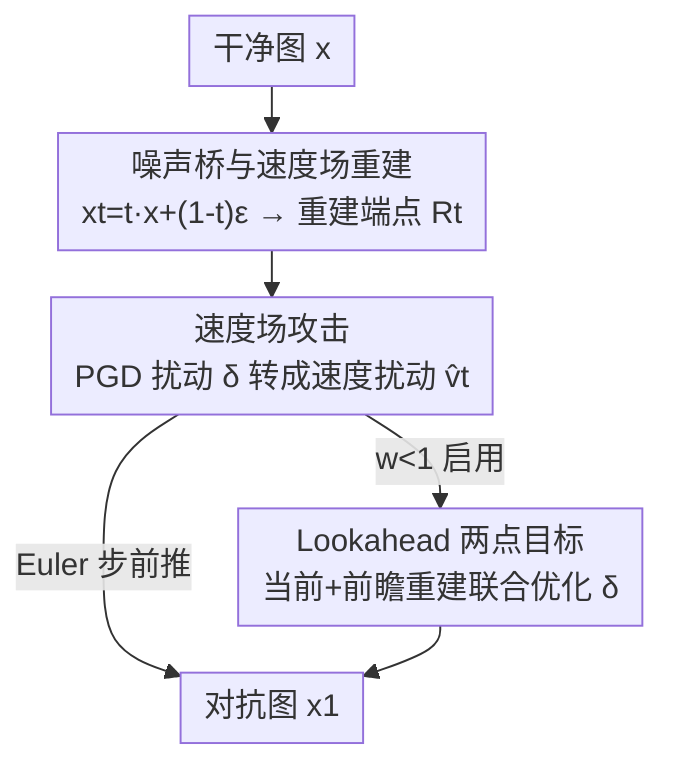

# AdvFM: Lookahead Flow-Matching Velocity-Field Attacks for Imperceptible and Transferable Adversarial Examples

**会议**: CVPR 2026  
**论文**: [CVF Open Access](https://openaccess.thecvf.com/content/CVPR2026/html/Liu_AdvFM_Lookahead_Flow-Matching_Velocity-Field_Attacks_for_Imperceptible_and_Transferable_Adversarial_CVPR_2026_paper.html)  
**代码**: 未公开  
**领域**: AI安全 / 对抗攻击  
**关键词**: 对抗样本, flow matching, 速度场攻击, 黑盒迁移, 净化防御  

## 一句话总结
把无限制对抗攻击搬到 flow-matching 的连续时间速度场里做：不直接扰动像素、也不走扩散式的"去噪—再加噪"，而是把对重建图的 PGD 扰动转译成速度场的扰动并沿概率流 ODE 确定性地传播，再配一个"前瞻两点目标"修正时间错配，从而在 ImageNet 上同时拿到更强的黑盒迁移性和更高的抗净化/抗对抗训练成功率。

## 研究背景与动机
**领域现状**：无限制对抗样本（UAE）不再死守 $\ell_p$ 范数球，而是借生成先验沿数据分布造出"看起来自然、语义不变"的对抗图，比传统加噪扰动更难被滤波/压缩去掉。近年主流是把 UAE 塞进扩散模型管线里造样本。

**现有痛点**：扩散式 UAE 受其推理规则结构性拖累。扩散每步先预测一个更干净的重建 $x'_0$，再按时间相关的方差表重新注入随机噪声形成下一状态。这带来三个问题：(1) 随机的"再加噪"放大了代理模型更新方向的逐步抖动，统计上削弱了它和跨模型共享梯度子空间的对齐，迁移性变差；(2) 携带对抗信号的分量在每步都被相对新注入的噪声反复降权，像一个乘性收缩，难以沿轨迹累积；(3) 反复的"加噪—去噪"循环引入了较多偏离流形法向的分量，而净化防御恰恰把输入往高密度区拉、优先压制这种法向分量，所以扩散式攻击净化后掉得更狠。

**核心矛盾**：把对抗信号注入到一个"随机、各向同性、反复重噪"的过程里，信号既被衰减又偏离流形——迁移性和抗净化天然受限。

**本文目标**：找一个确定性、平滑、且让扰动天然贴着数据流形切向传播的载体来注入对抗信号。

**切入角度**：flow matching 学到的速度场 $v_\theta(x_t,t)$ 用概率流 ODE 把噪声确定性地搬到数据分布，传播低方差、近似线性，且样本大体沿数据流形切向前进。作者据此假设：在速度场而非像素/扩散空间里下手，扰动能被更稳地放大、更贴切向、更难被净化抹掉。

**核心 idea**：把对重建图的扰动 $\delta$ 解释成时间 $t$ 处的速度扰动 $\delta/(1-t)$，沿 ODE 传播；再用一个耦合当前与前瞻重建的两点目标对齐"扰动随传输前推"的方式。

## 方法详解

### 整体框架
AdvFM 在"含噪空间"里工作，但用的是 flow-matching 速度场而不是扩散去噪。给定干净图 $x$，先用噪声桥采样一个含噪状态 $x_t$，用单步重建算子估计它的流终点 $x_1^t$；在重建图上跑 PGD 得到像素扰动 $\delta$，把 $\delta$ 翻译成 $t$ 时刻的速度扰动 $\hat v_t$，再用一个显式 Euler 步把含噪状态往前推。整条轨迹从 $t$ 反向演化到 $1$，每个时间步都重复"采样含噪态 → 重建终点 → PGD → 转成速度更新"，最终输出 $x_1$ 即对抗图。可选的 lookahead 变体把 PGD 的损失换成耦合当前重建和"前推一步后重建"的两点目标。

### 关键设计

**1. 噪声桥与速度场重建：把战场从像素挪到平滑的含噪空间**

直接在干净图上优化 $\delta$ 的麻烦在于：自然图附近的决策边界高度弯曲，$\nabla_x L_f(x,y)$ 跨模型方差大，更新会振荡、跨模型对齐差。作者引入一个线性噪声桥 $x_t = t\,x + (1-t)\,\epsilon$（$\epsilon\sim\mathcal N(0,I)$，$t\in[0,1]$）：早期 $t$ 小、含噪重、平滑掉曲率和梯度方差，让优化面更平、梯度更稳；随 $t\to1$ 又逐步找回细粒度语义。配套用一个预训练 flow-matching 模型 $v_\theta$ 的单步重建算子 $R_t(x_t)=x_t+(1-t)\,v_\theta(x_t,t)$ 来近似流终点 $x_1^t$。这一步既是后续攻击的载体，也是理论上"高斯平滑"的来源：在含噪桥上求的梯度等价于一个高斯平滑损失 $\tilde L_f(x)=\mathbb E_\epsilon[L_f(t x+(1-t)\epsilon,y)]$ 的梯度，方差天然更低、对齐目标梯度更好。

**2. 速度场攻击：把像素扰动转译成速度扰动并由 ODE 放大**

这是全文的核心。在每个时间步，先在重建图 $x_1^t$ 上跑 PGD 得到 $\delta$，组成 $\hat x_1^t = x_1^t+\delta$；关键一步是把"对终点的扰动"解释成"对速度的扰动"：

$$\hat v_t = \frac{\hat x_1^t - x_t}{1-t} = v_\theta(x_t,t) + \frac{\delta}{1-t}$$

然后用显式 Euler 步 $x_{t+\Delta t} = x_t + \Delta t\,\hat v_t$ 推进含噪态。与不攻击的基线状态相减，得到攻击引起的状态变化 $\Delta x^{FM}_t = \frac{\Delta t}{1-t}\,\delta$。对比扩散式管线（先重建、攻击、再按 $\sqrt{\bar\alpha_t}$ 缩放映回），其状态变化是 $\Delta x^{Diff}_t = \sqrt{\bar\alpha_t}\,\delta$。两者比值

$$\frac{\Delta L^{FM}_g}{\Delta L^{Diff}_g} = \frac{\Delta t}{(1-t)\sqrt{\bar\alpha_t}}$$

在常见调度（$\Delta t\sim O(1-t)$、$\sqrt{\bar\alpha_t}\in(0,1)$）下大于 1——同样的 $\delta$，速度场更新对黑盒目标损失 $L_g$ 的单步抬升更大（步长放大），于是用更少/更小的步就能把样本推进对抗区。而扩散式那个 $\sqrt{\bar\alpha_t}<1$ 的因子恰恰在衰减扰动。再加上 flow 的传播确定、近似线性、强调低频语义方向，扰动天然落在数据流形切向，既更易跨模型迁移，又更难被净化（净化只压法向分量）。

**3. Lookahead 两点目标：修正"攻当下、考未来"的时间错配**

基线攻击优化的是当前含噪态 $x_t$ 对应的重建 $x_1^t$，但分类器实际看到的是前推之后的状态 $x_{t+\Delta t}$。当 $\Delta t$ 不是无穷小，这个时间错配会拖累迁移性。作者用一个两点损失把"现在"和"前推一步后的重建"一起优化：

$$L^{LA}_f(\delta;t) = w\,L_f(x_1^t+\delta,\,y) + (1-w)\,L_f\!\big(x_1^{t+\Delta t}(\delta),\,y\big)$$

$w=1$ 退化回基线速度场攻击，$w\in(0,1)$ 则前瞻地考虑了"对抗信号如何被传输前推"。理论上这放大了 $\delta$ 对目标损失的作用、并给两点目标梯度一个更低方差的估计（更好的代理—目标对齐），还让扰动更贴切向、净化后存活更多。实验用 $w=0.3$，主要在轨迹后半段精修，对黑盒迁移增益尤其明显。

### 损失函数 / 训练策略
攻击时 flow-matching 主干 $v_\theta$（用预训练 GMFlow）全程冻结，只优化扰动 $\delta$，确保增益来自速度场/前瞻机制而非重训生成器。ImageNet 上设置：flow 步数 $T=15$、每步 PGD 迭代 $I=10$、逐步约束 $\|\delta\|_\infty\le 4/255$（作用在 $x_1^t$ 上）、lookahead 权重 $w=0.3$。整套流程见原文 Algorithm 1：每个时间步采样含噪态 → 重建终点 → 内层 K 步 PGD（用基线或前瞻损失，符号梯度 + 投影）→ 把 $\delta$ 折算成速度更新推进状态。

## 实验关键数据

### 主实验
ImageNet 上跨 8 个架构（CNN：VGG19/RN50/DN161/EN-B7；Transformer：ViT-B/16/Swin-B/DeiT-B/VisF-S）的黑盒迁移。下表为各 source 模型下对所有黑盒目标的平均 ASR（不含对角白盒），对比此前最强基线 APA：

| Source 模型 | AdvFM 平均 ASR | 之前最佳 APA | 提升 |
|------------|---------------|-------------|------|
| VGG19 (CNN) | 70.35% | 65.86% | **+4.49** |
| RN50 (CNN) | 72.05% | 64.41% | **+7.64** |
| ViT-B/16 (Transformer) | 68.22% | 69.73% | −1.51（次优） |
| Swin-B (Transformer) | 64.88% | 61.49% | **+3.39** |

4 个 source 中 3 个取得最佳平均迁移 ASR，仅 ViT-B/16 略低于 APA 屈居第二。

抗防御（ASR %，ours vs 之前最佳 APA）：净化类 NRP / Smooth / DiffPure，对抗训练类 PGD-RN50 / Madry-RN50 / RAT-ViT / MIMIR-ViT：

| 防御 | AdvFM | APA | 备注 |
|------|-------|-----|------|
| NRP（净化） | **94.98%** | 81.20% | +13.8，大幅领先 |
| Smooth（随机平滑） | **81.35%** | 70.70% | +10.6 |
| DiffPure（扩散净化） | 61.33% | 63.30% | 次优，紧追 APA |
| PGD RN50（对抗训练） | 83.22% | 80.87% | 最佳 |
| Madry RN50（对抗训练） | 81.89% | 78.87% | 接近最佳 |
| RAT ViT-B16（对抗训练） | **98.53%** | 90.30% | 最佳 |
| MIMIR ViT-B16（对抗训练） | **97.86%** | 95.00% | 最佳 |

### 消融实验
Lookahead 两点目标的作用（ResNet50 为代理，轨迹末端 ASR）：

| 配置 | 白盒 ASR | 黑盒 ASR |
|------|---------|---------|
| AdvFM（$w=0.3$，完整） | **94.45%** | **72.05%** |
| AdvFM w/o lookahead（$w=1$） | 91.72% | 64.31% |

### 关键发现
- **Lookahead 对黑盒迁移的增益远大于白盒**：白盒只多 ~2.7 个点（94.45 vs 91.72），黑盒却多 ~7.7 个点（72.05 vs 64.31），且整条轨迹上前瞻曲线几乎全程压住无前瞻版本——印证"两点目标给出更低方差的目标梯度估计、改善代理—目标对齐"的分析。
- **速度场攻击的优势随轨迹累积**：四条 ASR 曲线都从 $x_t$ 附近的 ~10–20% 单调升到接近 $t=1$，说明速度场优化能持续利用插值态；lookahead 主要精修轨迹后半段，而非加速早期进展。
- **抗净化是最大亮点**：NRP 上 +13.8、Smooth 上 +10.6，与"扰动集中在流形切向、净化主要压法向"的理论一致；仅在 DiffPure 上略输 APA。

## 亮点与洞察
- **"像素扰动 → 速度扰动"的转译很巧**：$\hat v_t = v_\theta + \delta/(1-t)$ 这一步把熟悉的 PGD 嫁接到连续时间 ODE 上，$1/(1-t)$ 的放大因子直接对应理论里的步长放大，落地与理论咬合得很干净。
- **把"为什么有效"拆成三条可证轴**：步长放大（Lemma 1）、高斯平滑降方差→更好对齐（Lemma 2–4 + Theorem 1）、切向扰动抗净化（Theorem 3）。这套"扩散 vs flow"的逐项对比解释了 UAE 长期被诟病的迁移/抗净化短板根因。
- **可迁移的思路**：凡是"先在某个重建/端点上算扰动、再映回过程态"的生成式攻击，都可借鉴"把端点扰动解释成过程的速度/控制扰动 + 前瞻两点目标修正离散步错配"这两招来稳梯度、提迁移。

## 局限性 / 可改进方向
- 攻击质量依赖预训练 flow-matching 主干（GMFlow）的质量与覆盖，换数据域/分布外可能需要重训或换主干——⚠️ 原文未讨论跨域泛化。
- 仅在 ImageNet 分类上验证；对检测/分割/多模态等任务以及更强自适应防御的有效性未知。
- 多步 PGD × 多 flow 步（$T=15,\ I=10$）的计算开销不低，原文未报告与扩散基线的时延/显存对比。
- $w$、$T$、$\Delta t$ 等超参的敏感性只给了 $w$ 的消融，调度 $\Delta t\sim O(1-t)$ 的假设若不成立，步长放大比值不一定 >1。

## 相关工作与启发
- **vs 扩散式 UAE（AdvDiffuser / DiffPGD / DiffAttack / AdvAD）**：它们在"去噪—再加噪"里造样本，受 $\sqrt{\bar\alpha_t}$ 衰减、随机重噪抖动、法向分量偏多三重拖累；AdvFM 换成确定性速度场，步长被放大、梯度方差更低、扰动贴切向，迁移和抗净化都更好。
- **vs APA（此前最强基线）**：APA 在多数 source 上是次优对手，AdvFM 在 4 个 source 的 3 个、以及 7 项防御的 5 项上反超，尤其净化类大幅领先；仅 ViT-B/16 迁移和 DiffPure 上 APA 略胜。
- **vs 早期 GAN-based UAE（AdvGAN 等）**：缺反向噪声桥、难控生成噪声、易模式坍塌；AdvFM 的噪声桥 + ODE 传播在可控性和稳定性上是结构性升级。

## 评分
- 新颖性: ⭐⭐⭐⭐⭐ 首次把无限制对抗攻击系统性地搬到 flow-matching 速度场，并给出"扩散 vs flow"的逐项理论对比
- 实验充分度: ⭐⭐⭐⭐ 8 架构迁移 + 多类净化/对抗训练防御，但只覆盖 ImageNet 分类、缺时延与跨域评估
- 写作质量: ⭐⭐⭐⭐⭐ 动机—方法—理论—实验链条紧凑，公式与直觉解释配合到位
- 价值: ⭐⭐⭐⭐ 对评估生成式对抗鲁棒性提供了更强、更难净化的攻击基线，安全研究实用

<!-- RELATED:START -->

## 相关论文

- [\[CVPR 2026\] RaPA: Enhancing Transferable Targeted Attacks via Random Parameter Pruning](rapa_enhancing_transferable_targeted_attacks_via_random_parameter_pruning.md)
- [\[CVPR 2026\] Towards Human-Imperceptible Backdoor Attacks on Text-to-Image Diffusion Models](towards_human-imperceptible_backdoor_attacks_on_text-to-image_diffusion_models.md)
- [\[CVPR 2026\] FlowHijack: A Dynamics-Aware Backdoor Attack on Flow-Matching Vision-Language-Action Models](flowhijack_a_dynamics-aware_backdoor_attack_on_flow-matching_vision-language-act.md)
- [\[CVPR 2026\] DASH: A Meta-Attack Framework for Synthesizing Effective and Stealthy Adversarial Examples](dash_a_meta-attack_framework_for_synthesizing_effective_and_stealthy_adversarial.md)
- [\[CVPR 2026\] CamPI: Physical Adversarial Examples through Camera Power Signal Injection](campi_physical_adversarial_examples_through_camera_power_signal_injection.md)

<!-- RELATED:END -->
