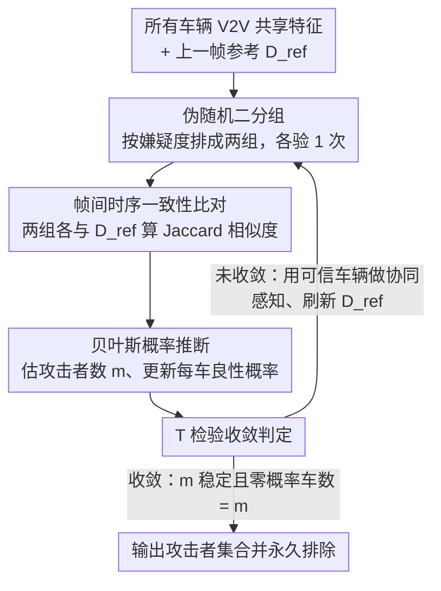

# All Vehicles Can Lie: Efficient Adversarial Defense in Fully Untrusted-Vehicle Collaborative Perception via Pseudo-Random Bayesian Inference

**会议**: CVPR 2026  
**arXiv**: [2603.08498](https://arxiv.org/abs/2603.08498)  
**代码**: 待确认  
**领域**: AI安全  
**关键词**: collaborative perception, adversarial defense, Bayesian inference, autonomous driving, V2V communication

## 一句话总结

提出 Pseudo-Random Bayesian Inference (PRBI) 框架，在**所有车辆均不可信**的协同感知场景中，利用帧间时序一致性作为自参考信号，通过伪随机分组 + 贝叶斯推断，仅需平均 2.5 次验证/帧即可高效识别并排除恶意车辆，检测精度恢复至攻击前的 79.4%–86.9%。

---

## 研究背景与动机

**协同感知 (CP) 的安全隐患**：多车通过 V2V 通信共享特征图来扩展感知范围，但特征融合机制天然暴露在对抗攻击之下——恶意车辆可以在共享特征中注入扰动，导致 ego 车辆感知严重失准。

**现有方法依赖"ego 可信"假设**：采样类防御（ROBOSAC、PASAC）以 ego 车辆的感知作为可靠参考来做一致性验证；分类器类防御则训练二分类网络区分良性/恶意特征——两者都假设 ego 本身不会被攻击。

**现实中 ego 同样可被攻击**：通过 LiDAR 注入攻击或数据截获攻击，攻击者虽不直接入侵 ego 内部系统，但完全可以干扰其特征图。因此"All Vehicles Can Lie"才是真实场景。

**验证开销线性增长**：现有采样/分类方法的每帧验证次数随车辆总数线性增长，难以满足大规模实时协同感知的需求。

**随机采样存在检测延迟**：纯随机化的采样可能需要很多帧才能收敛到完整的攻击者集合，带来持续的风险暴露。

**急需"零信任"且低开销的防御方案**：理想方案应既不假设任何车辆可信，也不需要关于攻击者数量/比例的先验知识，同时保持每帧恒定的验证成本。

---

## 方法详解

### 整体框架

PRBI 要解决的问题是：在一个**所有车辆都可能撒谎**的协同感知系统里，ego 自己也可能被攻击，因此没有任何一辆车的感知能当作可信参考。PRBI 给出的答案是把"时间"当成那个唯一可信的锚点——既然攻击者无法篡改物理世界的时序连续性，那么"这一帧和上一帧的良性感知是否对得上"就成了一个不依赖任何车辆的自参考信号。

整篇方法是一个逐帧滚动的闭环：每帧先把所有车辆伪随机地分成两组，各自和上一帧已确认的良性结果比对 Jaccard 相似度，据此累积每辆车的"正常/异常"计数；再用这些计数估出当前的攻击者数量 $m$ 并算出每辆车的良性概率，挑出最可疑的若干辆；最后用 T 检验判断 $m$ 是否已经稳定下来——没稳就用剩下的可信车辆做本帧协同感知、更新参考帧进入下一轮，稳了就输出最终的攻击者集合。这样一来，验证不再依赖"谁可信"的先验，而是靠时间一帧帧把攻击者逼出来。

### 关键设计

**1. 帧间时序一致性作为自参考信号：在没有任何可信车辆时找一个参考锚点**

零信任设置最棘手的地方在于，采样类（ROBOSAC/PASAC）和分类器类防御都默认 ego 可信，可一旦 ego 也被 LiDAR 注入或数据截获攻击，整套验证就失去了基准。PRBI 的破局点是改用**上一帧已验证的良性感知输出 $D_{\text{ref}}$** 作当前帧的参考，用相邻帧检测框的 Jaccard 相似度来判定一致性。这个信号之所以可靠，是因为 LiDAR 感知在空间上天然连续，正常行驶时相邻帧的目标分布是平滑变化的：实测良性场景下 Jaccard 相似度稳定在约 0.8，而注入扰动后会骤降到 0.3 以下。两者分布几乎不重叠，于是一个简单的阈值 $\epsilon$ 就能把"这帧某辆车的感知是否被污染"转成一个自监督判据，全程不需要相信任何一辆车。

**2. 伪随机二分组策略：把每帧验证开销从随车辆数线性增长压成恒定 2 次**

现有采样防御的验证次数随车辆总数 $n$ 线性上涨，大规模实时协同根本扛不住。PRBI 每帧只做 2 次验证：把车辆按嫌疑度排序后分成两组，最可疑的 $\lfloor m \rfloor$ 辆放一组、其余放另一组，各验一次。这个二分组在统计上近似一次无放回随机采样——采到"全良性组"的概率只取决于攻击者数量 $k$：

$$P_{ideal}' = \frac{2^{\,n-k}}{2^{\,n}} = 2^{-k}$$

反过来，只要在线统计出经验正常比率 $\eta \approx 2^{-k}$，就能直接反推攻击者数量 $m = \log_2(1/\eta)$，无需任何关于攻击者比例的先验。更关键的是，因为分组不是纯随机而是按当前 $m$ 和良性概率 $P_{\text{benign}}$ 来排的伪随机，论文证明了 $m$ 会单调收敛到真实值 $k$（Theorem 1），既把开销和车辆数彻底解耦，又避免了纯随机采样那种"要等很多帧才碰巧凑齐攻击者集合"的检测延迟。

**3. 贝叶斯概率推断识别攻击者：从逐帧噪声计数里稳定地点名作恶车辆**

光有计数还不够，早期分组本身不稳，单帧的异常计数噪声很大。PRBI 为每辆车维护一个后验良性概率 $P_{\text{benign}}[j] = P(\mathcal{B}_j \mid \mathcal{A})$，按贝叶斯方式更新后挑出概率最低的 $\lfloor m \rceil$ 辆作为疑似攻击者。先验 $P(\mathcal{B}_j)$ 用**短期记忆**（上一帧的贝叶斯结果）和**长期记忆**（历史累计的正常检测比率）加权组合，借时序记忆抹平早期分组抖动；似然 $P(\mathcal{A} \mid \mathcal{B}_j)$ 则用"把车辆 $j$ 排除后系统的异常比率"来估计。这套推断之所以收敛可靠，关键在一个不变量：真正的恶意车辆每次都会落进异常检测里（其正常比率 $\beta_j = 0$），于是它的良性概率会被持续压到 0，最终一定被排除，不会漏检。

**4. T 检验收敛判定：在连续场景里尽早停掉冗余验证**

由于 $m$ 只在真实值 $k$ 附近小幅抖动，需要一个判据告诉系统"够了，可以输出结果了"。PRBI 维护一个窗口 $W$ 存近 $w_p$ 帧的 $m$ 估计，对零假设 $H_0: k = m$ 做 T 检验，当波动长时间被约束在置信区间内、**且**良性概率恰好为零的车辆数正好等于 $m$ 时，才判定收敛。这里的双重条件是刻意设计的——单看 T 检验，在 $m$ 缓慢爬升时可能过早接受 $H_0$，加上"零概率车辆数 = $m$"这一硬约束就能堵住这种误判。收敛越早确认，就越早终止冗余验证并输出防御结果，实测平均约 4 帧即可收敛。

### 一个完整示例：5 车 2 攻击者如何在 4 帧内被锁定

设场景共 $n=5$ 辆车、其中 $k=2$ 辆是攻击者（真实值，系统并不知道）。

- **第 1 帧**：以初始帧感知正确为参考，把 5 辆车伪随机二分组、各与 $D_{\text{ref}}$ 比对 Jaccard。含攻击者的那组相似度跌到 0.3 以下、被记一次异常，全良性组保持在 0.8 左右。由经验正常比率 $\eta$ 反推得 $m \approx \log_2(1/\eta) \approx 2$，贝叶斯更新后两辆攻击者良性概率开始下沉。
- **第 2–3 帧**：用上一帧确认的良性车辆重做协同感知、刷新 $D_{\text{ref}}$，再次二分组。两辆攻击者因为每帧都落进异常组、$\beta_j=0$，良性概率被持续压向 0；$m$ 在 2 附近小幅抖动。
- **第 4 帧**：窗口 $W$ 内的 $m$ 估计长时间稳定在 2，T 检验通过，且良性概率为零的车辆数恰好 = 2，双重条件满足 → 判定收敛，输出这 2 辆攻击者并将其永久排除。

整个过程每帧只花 2 次验证，约 4 帧锁定全部攻击者，与表格里"80% 攻击比例平均 4.27 帧收敛、恶意识别率 100%"的实测一致。

---

## 损失函数 / 训练策略

PRBI 本身是**推理阶段的防御框架**，不涉及额外训练或损失函数。它在已训练好的协同感知模型之上运行，直接利用检测输出之间的 Jaccard 相似度进行一致性验证。攻击端的扰动优化目标为标准多智能体检测损失：

$$\max_{\|\delta\| \leq \Delta} \sum_{j=1}^{L} \mathcal{L}_{\text{det}}(d_j, d_j')$$

其中 $\Delta$ 约束扰动幅度，$\mathcal{L}_{\text{det}}$ 为检测损失。防御端通过 Jaccard 阈值 $\epsilon$ 区分正常/异常帧，无需对模型做任何微调。

---

## 实验关键数据

**表 1：每帧验证次数对比（$n=5$）**

| 方法 | 指标 | 攻击比例 20% | 40% | 60% | 80% | 平均 ↓ |
|:-----|:-----|:---:|:---:|:---:|:---:|:---:|
| ROBOSAC | Avg | 4.89 | 10.36 | 8.29 | 4.73 | 7.1 |
| PASAC | Avg | 4.79 | 6.60 | 7.59 | 8.00 | 6.7 |
| **PRBI (Ours)** | **Avg** | **2.00** | **2.35** | **2.61** | **2.86** | **2.5** |

- PRBI 平均仅 2.5 次验证/帧，显著低于 ROBOSAC (7.1) 和 PASAC (6.7)。
- ROBOSAC 最大验证次数高达 30.3/帧，PRBI 仅 5.0/帧。

**表 2：检测性能对比（$n=5, k=2$，V2VNet 骨干 + 三种攻击）**

| 设置 | AP@0.5 | AP@0.7 |
|:-----|:---:|:---:|
| Upper-Bound（无攻击协同） | 80.73 | 78.35 |
| Attack w/ PGD | 17.02 | 14.53 |
| PRBI against PGD | **68.93** (+51.91) | **63.82** (+49.29) |
| Attack w/ BIM | 13.51 | 11.69 |
| PRBI against BIM | **68.76** (+55.25) | **64.88** (+53.19) |
| Attack w/ C&W | 10.68 | 6.04 |
| PRBI against C&W | **71.87** (+61.19) | **68.54** (+62.50) |
| Lower-Bound（单车感知） | 56.35 | 52.89 |
| ROBOSAC | 64.13 (+7.78) | 61.01 (+8.12) |
| PASAC | 68.39 (+12.04) | 64.73 (+11.83) |

- 在 V2VNet 上，PRBI 抵御 C&W 时恢复了攻击前 86.9% 的 AP 损失，显著优于 ROBOSAC 和 PASAC。
- 跨多种融合策略（Mean/Max/Sum/V2VNet/DiscoNet）均保持稳定鲁棒性。

**表 3：收敛速度与识别率**

| 攻击比例 | 平均收敛帧数 | 恶意车辆识别率 | 良性车辆误判率 |
|:---:|:---:|:---:|:---:|
| 20% | 2.25 | 100% | 0% |
| 40% | 2.77 | 100% | 6% |
| 60% | 3.36 | 100% | 0% |
| 80% | 4.27 | 100% | 0% |

- 所有攻击比例下恶意识别率均为 100%，平均约 4 帧内收敛。

---

## 亮点与洞察

1. **首个面向"全不可信"场景的高效防御**：打破了现有方法对 ego 可信的依赖，提出帧间时序一致性作为自参考信号——思路简洁但极具洞察力。
2. **验证开销与车辆数解耦**：二分组策略将每帧验证从 $O(n)$ 降至恒定 2 次，理论最优。
3. **理论保证完备**：Theorem 1 证明 $m$ 单调收敛至 $k$；Theorem 2 证明仅 floor 取整保证精确收敛——理论分析严谨。
4. **攻击者必被排除的不变量**：恶意车辆 $\beta_j = 0$，良性概率始终为 0，保证不会漏检。
5. **实用性强**：无需额外训练、无需先验知识、无需修改感知模型，作为即插即用的推理阶段防御模块。

---

## 局限与展望

1. **帧间一致性假设的脆弱场景**：在车辆高速转弯、急刹车等极端运动场景下，相邻帧感知变化可能很大，Jaccard 相似度自然下降，可能导致误报。
2. **初始帧正确性假设**：$t=0$ 假设感知完全正确，若系统启动时即遭受攻击则无法建立可靠参考。
3. **仅评估了 $n=5$ 的小规模场景**：实际城市自动驾驶可能涉及数十辆车的协同，大规模场景下的收敛速度和稳定性有待验证。
4. **静态攻击者集合假设**：假设攻击者在整个序列中固定不变，对于动态加入/退出的攻击者适应性存疑。
5. **40% 攻击比例下存在 6% 误判**：$m$ 过早稳定可能导致良性车辆被错误排除，虽不影响恶意识别率但会损失协同增益。
6. **未考虑自适应攻击**：攻击者若知道 PRBI 的检测逻辑，可能设计缓变扰动来维持帧间相似度，绕过阈值检测。

---

## 相关工作与启发

- **ROBOSAC / PASAC**：经典采样类防御，以 ego 为参考做迭代一致性验证。PRBI 的核心改进是用帧间时序替代 ego 信任，用二分组替代线性采样。
- **MATE**：基于几何的多智能体信任估计器，需要目标跟踪和可见性推理。PRBI 则完全不依赖场景几何建模，更加轻量。
- **分类器类防御**：训练二分类网络检测恶意特征，但泛化性差且扩大攻击面。PRBI 无需训练，零攻击面扩展。
- **启发**：帧间一致性信号不仅适用于协同感知防御，也可推广至任何多源融合系统的异常检测（如联邦学习中的恶意客户端检测）。伪随机分组 + 贝叶斯推断的范式具有通用性。

---

## 评分

- **新颖性**: ⭐⭐⭐⭐ — 首次在全不可信设置下提出恒定开销防御，帧间自参考信号的思路新颖
- **实验充分度**: ⭐⭐⭐⭐ — 多种攻击/融合策略/参数敏感性分析齐全，但仅 $n=5$ 略显不足
- **写作质量**: ⭐⭐⭐⭐⭐ — 问题定义清晰、理论分析严谨、公式推导完整
- **价值**: ⭐⭐⭐⭐ — 对协同自动驾驶安全有实际意义，即插即用的设计利于落地

<!-- RELATED:START -->

## 相关论文

- [\[ICML 2026\] One Model to Translate Them All: Universal Any-to-Any Translation for Heterogeneous Collaborative Perception](../../ICML2026/ai_safety/one_model_to_translate_them_all_universal_any-to-any_translation_for_heterogeneo.md)
- [\[CVPR 2026\] RaPA: Enhancing Transferable Targeted Attacks via Random Parameter Pruning](rapa_enhancing_transferable_targeted_attacks_via_random_parameter_pruning.md)
- [\[ICML 2026\] How Does Bayesian Sampling Help Membership Inference Attacks?](../../ICML2026/ai_safety/how_does_bayesian_sampling_help_membership_inference_attacks.md)
- [\[ACL 2026\] On the (In-)Security of the Shuffling Defense in the Transformer Secure Inference](../../ACL2026/ai_safety/on_the_in-security_of_the_shuffling_defense_in_the_transformer_secure_inference.md)
- [\[AAAI 2026\] Detect All-Type Deepfake Audio: Wavelet Prompt Tuning for Enhanced Auditory Perception](../../AAAI2026/ai_safety/detect_all-type_deepfake_audio_wavelet_prompt_tuning_for_enhanced_auditory_perce.md)

<!-- RELATED:END -->
