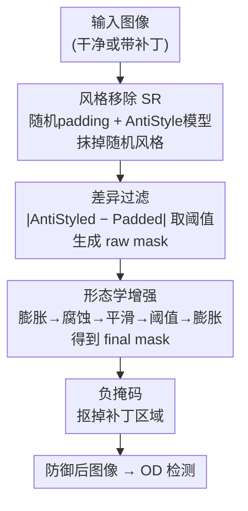

# AntiStyler: Defending Object Detection Models Against Adversarial Patch Attacks Using Style Removal

**会议**: CVPR 2026  
**论文**: [CVF Open Access](https://openaccess.thecvf.com/content/CVPR2026/html/Yankelev_AntiStyler_Defending_Object_Detection_Models_Against_Adversarial_Patch_Attacks_Using_CVPR_2026_paper.html)  
**代码**: https://github.com/IdanYankelev/AntiStyler  
**领域**: AI安全  
**关键词**: 对抗补丁防御, 目标检测, 风格移除, 零样本防御, 实时推理  

## 一句话总结
把风格迁移（style transfer）反转成"风格移除"（style removal），用它把对抗补丁那种"随机纹理风格"从图像里抹掉、定位并 mask 掉补丁像素，做出一个不需训练、对模型/补丁/攻击全不可知的零样本防御，在保持干净图性能的同时把对抗 mAP 提升 8–15 个点，且只需 40–90ms/张、能跑 10–12 FPS 满足实时检测。

## 研究背景与动机

**领域现状**：目标检测（OD）模型和其他深度网络一样易受对抗补丁攻击——往图像上贴一块精心优化的小补丁，就能让检测器漏检或误分类，在安防、自动驾驶等实时场景里威胁很大。近年防御主流转向"轻量、净化式（purification-based）"思路：先把对抗区域识别并 mask/修复掉，再送进检测器。

**现有痛点**：现有防御普遍有两个硬伤。其一，**牺牲干净图性能**——为了 mask 掉补丁，往往把正常图像的内容也误删/误改了，而真实场景里只有极小部分图像真的被攻击，干净图掉点是不可接受的。其二，**处理太慢**——窗口式方法（ObjectSeeker、PAD）要把图切成很多窗口逐个推理，扩散式方法（DIFFender）要跑迭代采样，单张动辄 4000ms 以上，远达不到实时 OD 要求的 ≥10 FPS（≤100ms/张）。

**核心矛盾**：很多净化方法源自图像分类域，它们的"重建"过程会改变物体的外观或位置。对分类无所谓，但对 OD 是致命的——物体一旦被挪位，定位框就错了。于是"补丁去得干净"和"物体位置不被破坏"之间存在张力。

**切入角度**：作者抓住一个观察——对抗补丁相比自然图像引入了更复杂、更"随机"的视觉纹理，可以看作补丁带着一种特殊的"风格（style）"。既然风格迁移能把一张图的风格转移到另一张图上，那么反过来——能不能设计一个"风格移除"算子，专门把这种随机风格从图里抹掉，而保留内容（content）不动？内容不动正好解决了 OD 最怕的物体挪位问题。

**核心 idea**：第一次把 style transfer 改造成 **style removal（SR）**：保留 content loss、把 style loss 的符号取负，让优化"远离"随机风格而非"靠近"它；用 SR 前后像素的差异定位补丁，再用一串空间形态学滤波把 mask 精修干净，最后用负 mask 抠掉补丁。整套流程不需要任何训练或攻击先验。

## 方法详解

### 整体框架
AntiStyler 是一个加在检测器**前面**的预处理防御：输入一张（可能带补丁的）图像，输出一张"被防御过"的图像，再正常送进任意 OD 模型。整条 pipeline 分四个阶段：**风格移除 → 差异过滤 → 形态学增强 → 负掩码**。

直观理解：先用一个 CNN（AntiStyle 模型）把图像里的"随机风格"尽量抹掉，得到 AntiStyled 图；补丁区域因为风格最强、被改动最大，所以对比"原图 vs AntiStyled 图"的像素差异，就能把补丁高亮出来；这张原始 mask 又脏又散，再用一串膨胀/腐蚀/平滑/阈值滤波把它收敛成一块干净的补丁区域；最后取这块 mask 的负，把补丁从图里抠掉送去检测。

一个关键巧思是**随机值 padding**：因为输入图可能是干净的（根本没有随机风格），如果硬去"移除一个不存在的风格"会误伤正常内容。于是在图四周加一圈随机像素 padding，**人为保证每张图都至少有随机风格存在**——干净图上 SR 只去抹掉那圈 padding 风格、不动内容；对抗图上 SR 同时抹掉补丁和 padding 的风格。

### 关键设计

**1. 风格移除（Style Removal）：把风格迁移的符号取负，从图里"减掉"对抗风格**

这是全文真正的创新点，直接针对"如何在不改变物体内容的前提下削弱补丁"。回顾标准风格迁移：用预训练 VGG 提取中间层特征，content 用特征图本身、style 用各层特征图的 Gram 矩阵刻画，优化目标是 $L_{ST}(X_O,X_C,X_S)=\alpha L_C(X_O,X_C)+\beta L_S(X_O,X_S)$，最小化它会让输出 $X_O$ 既保留 content 图的内容、又**靠近** style 图的风格。

作者借用 Li 等人的解读——把 style loss $L_S$ 看成 MMD（最大均值差异）的二阶多项式核，于是"最小化两个 Gram 矩阵的 MSE"等价于"把输出图的域适配到 style 图的域"。反过来，**最大化** Gram 矩阵 MSE 就等价于把输出图的域"推离" style 图的域。据此把目标改成保留 content、却**远离** style：

$$L_{SR}(X_O,X_C,X_S)=\alpha L_C(X_O,X_C)-\beta L_S(X_O,X_S)$$

仅仅把 $L_S$ 前的符号从 `+` 翻成 `−`，就从"添加风格"变成了"移除风格"。AntiStyle 模型以输入图为 content，临时采样一张 $[0,1)$ 均匀分布的随机像素图当 style 图，优化 $L_{SR}$ 后输出的 AntiStyled 图保留了原内容、却被推离了那种"随机风格"。配合前面说的随机 padding，干净图和对抗图都被保证有随机风格可移除，从而避免对干净内容的误伤——这正是它"不掉干净图性能"的根本原因。实现上用 VGG-19，前五个卷积层当 style 层、第四层当 content 层，$\alpha{:}\beta=1{:}1000$，**只优化 1 步**（这是它快的关键）。

**2. 差异过滤（Filter）：用 SR 前后的像素改动量定位补丁**

光做 SR 还不知道补丁在哪。作者的洞察是：补丁区域风格最强，SR 过程对它的改动也最大，因此**SR 前后差异最大的像素就最可能是补丁**。逐像素算差异并按动态阈值二值化：

$$\text{Diff}[i,j]=\big|\text{AntiStyled}[i,j]-\text{PaddedInput}[i,j]\big|$$

$$\text{Mask}[i,j]=\begin{cases}1,&\text{Diff}[i,j]\ge \tau\cdot \text{Max\_change}\\0,&\text{otherwise}\end{cases}$$

其中 $\text{Max\_change}=\max_{(i,j)}\text{Diff}[i,j]$ 是全图最大改动量，$\tau$ 是一个百分比形式的**动态阈值**（取改动量 top-$\tau$ 分位的像素）。用相对阈值而非绝对阈值，使得不同图像、不同光照下都能自适应地挑出改动最剧烈的那批像素。去掉 padding 后得到一张 raw mask——补丁处像素密集成团，其余地方是稀疏的零星白点。

**3. 形态学增强 + 负掩码（Enhancement & Mask）：把脏 mask 收敛成干净补丁块再抠掉**

raw mask 又散又有噪声，直接拿去 mask 会误伤正常区域。作者用一串顺序的空间滤波把它精修：先**膨胀（max）**让相邻的 masked 像素连成片、补上小缝；再用**更大的腐蚀（min）**删掉那些没连成大块的孤立噪点（即非补丁区的零星白点）；接着**平滑 + 阈值**滤波闭合小孔、清掉残余噪声；最后再来一次**膨胀（max）**把 mask 稍微外扩，确保完整盖住补丁、避免只 mask 一半。这一连串"膨胀→腐蚀→平滑→阈值→膨胀"利用了"补丁是高密度连通块、benign 噪声是低密度孤点"的空间结构差异，把两者分开。得到 final mask 后，在 Mask 阶段取其**负**作用到输入图上，把补丁区域抠空，剩下的防御后图像送进检测器。整套流程无可学习参数，纯前向计算，所以又快又零训练。

## 实验关键数据

### 主实验
在 COCO（数字攻击）上，Faster R-CNN / DETR 两个检测器、对抗 Google / M-PGD / DPatch 三类补丁。表中 Benign / Adv / Mean 分别是干净图、对抗图、整体均值 mAP%（IoU=0.5）。处理时间单位 ms。

| 检测器 | 防御 | 处理时间 | Google-Adv | M-PGD-Adv | DPatch-Adv | 干净图(Google-Benign) |
|--------|------|----------|-----------|-----------|-----------|------------------------|
| Faster R-CNN | 无防御 | — | 16.6 | 22.3 | 23.0 | 51.6 |
| Faster R-CNN | DIFFender (ECCV24) | 7606 | 19.4 | 26.3 | 25.4 | 34.1 |
| Faster R-CNN | NutNet (CCS24) | 45* | 21.4 | 31.5 | 31.1 | 42.4 |
| Faster R-CNN | KDAT (AAAI25) | 43* | 31.5 | 33.3 | 34.3 | 50.1 |
| Faster R-CNN | **AntiStyler** | 93 | **32.5** | **38.0** | **38.3** | **51.6** |
| DETR | 无防御 | — | 30.8 | 29.0 | 35.5 | 52.8 |
| DETR | **AntiStyler** | 86 | **41.7** | 39.6 | 44.4 | **53.0** |

要点：AntiStyler 在 Faster R-CNN 的全部对抗列都最优（平均 ~15 mAP% 提升），干净图 mAP 与无防御**完全持平**（51.6→51.6）；DETR 上平均 ~10 mAP% 提升。处理时间 86–93ms（约 10–12 FPS），是少数能满足实时（≤100ms）的防御之一——ObjectSeeker/PAD/DIFFender 都 ≥4000ms（PAD 高达 5.5 万 ms）。`*` 标注的 KDAT/NutNet 推理虽快，但需按每个数据集/架构重训，未计训练成本。

### 消融实验
Pipeline 各阶段消融（COCO + Faster R-CNN，mAP%）：UP=无 padding，UM=只做 SR 不过滤掩码，RM=用 raw mask 不做增强。

| 变体 | Google-Benign | Google-Adv | M-PGD-Adv | DPatch-Adv |
|------|---------------|-----------|-----------|-----------|
| 无防御 | 51.6 | 16.6 | 22.3 | 23.0 |
| UP（无 padding） | 38.8 | 30.6 | 35.7 | 37.7 |
| UM（只 SR） | 49.3 | 29.3 | 32.2 | 33.4 |
| RM（raw mask） | 48.1 | 30.4 | 35.3 | 35.2 |
| **AntiStyler（完整）** | **51.6** | **32.5** | **38.0** | **38.3** |

backbone 消融（COCO + Faster R-CNN，Adv mAP%）：

| backbone | Google-Adv | M-PGD-Adv | DPatch-Adv |
|----------|-----------|-----------|-----------|
| EfficientNetV2 | 24.2 | 27.5 | 28.6 |
| ResNet50 | 30.2 | 32.4 | 31.0 |
| **VGG19** | **32.5** | **38.0** | **38.3** |

### 关键发现
- **padding 是干净图不掉点的命门**：去掉 padding（UP）后干净图从 51.6 暴跌到 38.8，证明"人为注入随机风格"才让 SR 在干净图上只动 padding、不动内容；对抗鲁棒性 UP 反而第二好，说明 padding 是用一点对抗收益换干净图的巨大保全。
- **过滤+增强缺一不可**：只做 SR（UM）或只用 raw mask（RM）干净图和对抗性能都打折，形态学增强把噪点清掉后两端才同时拉满。
- **VGG19 优于残差网络**：作者推测 VGG19 简单的卷积结构更好地保留了局部纹理信息，而 ResNet50/EfficientNetV2 的残差连接、归一化让特征对局部扰动更不敏感，反而削弱了对纹理型补丁的捕捉能力。
- **抗自适应攻击**：在 black/gray/white-box 三种 adaptive attack 下仍分别有 ~7 / ~6 / ~5 mAP% 提升。gray-box 下攻击者每步只能去掉一种采样到的随机风格，无法覆盖 $3^{H\cdot W}$ 量级的所有 RGB 风格组合；white-box 因 AntiStyler 的阈值组件不可微、攻击只能用梯度近似（GAP）引入误差。

## 亮点与洞察
- **"取负号"的极简创新**：把风格迁移的 style loss 符号一翻就得到风格移除，理论上靠 MMD 域适配的解读站得住，工程上一行代码改动，优雅且零训练——这是最让人"啊哈"的地方。
- **用"内容不变"破解 OD 防御的死结**：SR 天然保留 content，直接绕开了分类域净化方法"挪动物体位置→定位框错"的硬伤，思路可迁移到任何"需要去噪但不能动几何结构"的任务。
- **随机 padding 当"诱饵风格"**：给干净图人为注入一个可被安全移除的风格，把"该不该移除"这个判断问题，转化为"总有东西可移除"的稳定问题，很巧妙的工程 trick。
- **可即插即用**：模型/补丁/攻击三不可知 + 零训练，可直接挂在任意已部署检测器前面，落地成本极低。

## 局限与展望
- **依赖"补丁=随机风格"假设**：若攻击者造出风格更"自然"、纹理更平滑的补丁（如 natural patch P2/P3），AntiStyler 优势会缩小（实验里 P2 仅与 PAD 持平、P3 不及）。⚠️ 对刻意贴合自然风格的补丁，这套基于纹理随机性的定位可能失效。
- **多/大补丁与小目标场景未充分压测**：形态学滤波的核大小、$\tau$ 阈值、padding 尺寸都是手调超参（论文用 padding=10、1 步优化），对补丁尺寸/数量的敏感性主要靠 INRIA 多补丁实验间接验证。
- **白盒自适应仍有 ~5 mAP% 上限**：依赖阈值不可微来挡白盒攻击，一旦出现可微的近似 mask 流程，鲁棒性边界还需重估。
- **改进思路**：把固定形态学滤波替换为轻量可学习的 mask 精修器，或把"随机风格"判据扩展到频域/统计特征，以覆盖低纹理补丁。

## 相关工作与启发
- **vs 净化式分类防御（如 DIFFender 等重建/inpaint 类）**：它们靠"重建质量低"定位对抗区并修复，但重建会改物体外观/位置，对 OD 致命且慢（DIFFender 7606ms）；AntiStyler 用 SR 保 content 不动几何、且只 1 步优化，又快又不伤定位。
- **vs 窗口式后处理防御（ObjectSeeker SP23 / PAD CVPR24）**：把图切窗逐个推理，窗口越小定位越准但越慢，处理时间 4000–55000ms 无法实时；AntiStyler 单次前向 ~90ms。
- **vs 训练内防御（KDAT AAAI25 / 对抗训练类）**：需针对每个 OD 架构和数据集重训、依赖预生成对抗样本；AntiStyler 零训练、三不可知，可直接迁移到任意检测器。
- **vs NutNet（CCS24）**：同为快防御（~45ms），但 NutNet 靠 autoencoder 重建误差检测，干净图掉点更多且对抗提升不及 AntiStyler。

## 评分
- 新颖性: ⭐⭐⭐⭐⭐ 首次把 style transfer 反转成 style removal，符号取负 + MMD 域适配解读，简洁而本质。
- 实验充分度: ⭐⭐⭐⭐ 4 数据集 × 7 攻击 × 多检测器，含 pipeline/backbone 消融与 black/gray/white-box 自适应攻击；但部分对比与多补丁结果放在 supplementary。
- 写作质量: ⭐⭐⭐⭐⭐ 动机—方法—消融逻辑清晰，四阶段 pipeline 与公式交代到位。
- 价值: ⭐⭐⭐⭐⭐ 零训练、三不可知、实时可用，对部署中的 OD 系统是低成本即插即用防御。

<!-- RELATED:START -->

## 相关论文

- [\[CVPR 2026\] When Robots Obey the Patch: Universal Transferable Patch Attacks on Vision-Language-Action Models](when_robots_obey_the_patch_universal_transferable_patch_attacks_on_vision-langua.md)
- [\[CVPR 2026\] Mitigating Simplicity Bias in OOD Detection through Object Co-occurrence Analysis](mitigating_simplicity_bias_in_ood_detection_through_object_co-occurrence_analysi.md)
- [\[CVPR 2026\] Phantom: Physical Object Interactions as Dynamic Triggers for NMS-Exploited Backdoors](phantom_physical_object_interactions_as_dynamic_triggers_for_nms-exploited_backd.md)
- [\[CVPR 2026\] TTP: Test-Time Padding for Adversarial Detection and Robust Adaptation on Vision-Language Models](ttp_test-time_padding_for_adversarial_detection_and_robust_adaptation_on_vision-.md)
- [\[CVPR 2026\] RemedyGS: Defend 3D Gaussian Splatting Against Computation Cost Attacks](remedygs_defend_3d_gaussian_splatting_against_computation_cost_attacks.md)

<!-- RELATED:END -->
