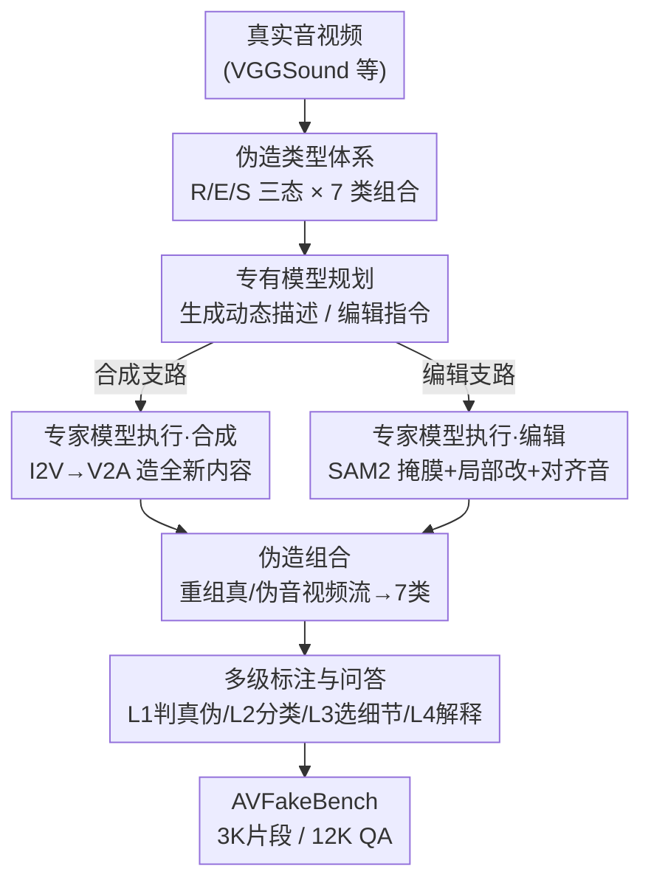

# AVFakeBench: A Comprehensive Audio-Video Forgery Detection Benchmark for AV-LMMs

**会议**: CVPR 2026  
**论文**: [CVF Open Access](https://openaccess.thecvf.com/content/CVPR2026/html/Xia_AVFakeBench_A_Comprehensive_Audio-Video_Forgery_Detection_Benchmark_for_AV-LMMs_CVPR_2026_paper.html)  
**代码**: 待确认  
**领域**: AI安全 / 音视频伪造检测 / 多模态评测基准  
**关键词**: 音视频伪造检测, AV-LMM, 评测基准, 多级标注, 混合伪造生成

## 一句话总结
AVFakeBench 是首个覆盖「人类+通用场景、7 类音视频伪造组合、4 级标注」的综合音视频伪造检测基准（3K 片段 / 12K 问答），用一套「专有模型规划 + 专家生成模型执行」的多阶段混合伪造框架批量造假数据，并评测了 11 个音视频大模型（AV-LMM）和 2 个专家检测器，发现 AV-LMM 在二分类真伪判断上已超过专家模型，但在细粒度伪造分类与解释推理上几乎全线崩溃。

## 研究背景与动机
**领域现状**：音视频（AV）伪造检测目前主要靠两类资源支撑——一类是早期的人脸 deepfake 数据集（FF++、Celeb-DF、DFDC），另一类是引入跨模态组合的多模态 deepfake 数据集（FakeAVCeleb、LAV-DF、AVDeepFake1M）。检测方法上则以针对合成语音/人脸的专家检测器（LipFD、AVH-Align）为主。

**现有痛点**：现有基准在三个维度上同时受限。(1) **主体单一**：几乎只盯着人脸/人声，无法覆盖自然风光、动物、交通、工业等真实世界的广阔场景；(2) **伪造类型单一**：要么只做编辑（editing）、要么只做合成（synthesis），不建模二者共存以及跨模态混合的复杂组合；(3) **标注粒度单一**：只有「真/假」二元标签，没有伪造类型、伪造细节、可解释理由这些细粒度标注，离人类感知的伪造判断差得远。

**核心矛盾**：生成模型（Sora、KLING、FoleyCrafter 等）已经能造出高保真、音画同步的伪造内容，伪造正在从「人脸 deepfake」迅速扩散到「任意自然场景 + 音视频任意模态」；而评测基准还停留在人脸二分类时代，导致我们既不知道新一代检测器在真实场景下到底行不行，也无法考核它「能不能定位、描述、解释伪造」。

**本文目标**：造一个同时拓宽「主体广度、伪造类型、标注深度」三轴的基准，并据此回答一个关键问题——天然带语言生成能力的 AV-LMM，能不能当统一的、可解释的伪造检测器？

**切入角度**：作者注意到 AV-LMM（如 VideoLLaMA2、video-SALMONN）能联合处理视听信号并生成自然语言，这让「可解释的伪造评测」第一次成为可能；于是不止考二分类，而是设计四级递进任务把 AV-LMM 的感知与推理能力逐层压测。

**核心 idea**：用「专有模型规划伪造意图 + 专家生成模型精确执行」的解耦式混合伪造框架，低成本批量造出跨场景、跨模态、多类型的高保真伪造数据，再配 4 级标注，把音视频伪造检测从「二分类」升级为「检测—定位—描述—解释」的多任务评测。

## 方法详解

### 整体框架
AVFakeBench 的核心不是一个模型，而是一套**数据基准 + 评测协议**。它由四块拼成：① 一个把音视频内容划成 Real/Edit/Synthesis 三态、并交叉组合出 **7 类合法跨模态伪造类型**的分类体系（taxonomy）；② **人类主体**部分（1500 片段），从已有数据集重组到 7 类体系里；③ **通用主体**部分（1500 片段），全部由**多阶段混合伪造框架**新造；④ 一套 **4 级标注 + 4 个评测任务**，用 LMM 辅助标注 + 人工核验把每个样本升级成多级问答。最终得到 3K 音视频片段、12K 问答对。

伪造类型的组合矩阵是基础：音、视频各有 Real(R)/Edit(E)/Synthesis(S) 三态，理论上 9 种组合，但「一模态合成 + 另一模态编辑」（如合成视频配局部编辑音频）会带来明显的语义/时序错位、难以造出自然样本，因此剔除 SA&EV、EA&SV 两种，保留 **7 类语义自洽的组合**：RA&RV、RA&EV、RA&SV、EA&RV、EA&EV、SA&RV、SA&SV。

数据构建的关键在通用主体的伪造生成 pipeline，它把「想怎么造假」和「具体怎么造」解耦成三阶段，并分合成 / 编辑两条支路：

### 关键设计

**1. 三态 × 7 类跨模态伪造体系：把「真实世界的混合伪造」结构化**

现有基准只标「真/假」，无法表达「音频被编辑但视频真实」这类真实世界常见的混合攻击。作者把音、视频内容各定义为 Real / Edited / Synthesized 三种规范状态，按模态交叉组合。理论 $3\times3=9$ 种里剔除两种语义难自洽的（合成+编辑跨模态错配），保留 7 类：RA&RV（全真）、RA&EV、RA&SV、EA&RV、EA&EV、SA&RV、SA&SV。这套体系既给数据构建定了目标配方，也给评测里的「伪造类型分类（L2/T2）」提供了 7 选项标签空间，让模型不只要判真伪、还要说清「假在哪个模态、是编辑还是合成」。

**2. 多阶段混合伪造框架：规划与执行解耦，低成本造高保真假数据**

通用场景比人脸难造——物体、环境、事件高度多样，直接让视频生成模型自由发挥，往往得到运动不稳、物理不合理的画面。作者的解法是把伪造拆成「规划意图」和「精确执行」两层，并分合成、编辑两条三阶段支路。**合成支路**：Stage 1 用专有 LMM 做规划，两种条件策略——frame-driven（拿真实视频首帧当视觉锚点、让 LMM 预测合理的时序演化）和 scenario-driven（按 10 个真实场景之一生成静态场景描述，经 T2I 如 Midjourney 转成首帧），再把静态描述扩成结构化的动态运动规格；Stage 2 用 I2V 模型（KLING、QingYing）把首帧+运动提示合成视频，再用 V2A 生成器（FoleyCrafter）配上时序对齐的音频；Stage 3 把真/合成的音视频流重组，实例化 RA&SV、SA&RV、SA&SV 三类。**编辑支路**：Stage 1 对真实视频均匀采 8 帧，让专有模型提一个合理的局部篡改建议（如「在 3-5 秒内移除水中央的小船」），转成含目标区域、时间窗、编辑操作的结构化编辑规格；Stage 2 走两条互补路径——生成式编辑（把片段+指令喂给闭源视频编辑模型如 KLING，并手动约束编辑区域保证局部性）和掩膜式编辑（用 SAM2 分割目标对象、把 mask 连同原片段交给视频编辑模型精确改），改完再用 V2A 生成对齐的编辑音频；Stage 3 把编辑后的音视频段插回原位置并重组，实例化 RA&EV、EA&RV、EA&EV 三类。整个过程在关键阶段都有人工监督把关真实性、保真度与多样性。这种「专有模型当导演、专家模型当执行者、人当质检」的分工，是它能批量造出跨场景、跨模态、高保真伪造的关键。

**3. 4 级递进标注 + LMM 辅助标注流水线：把数据从「真假标签」升级成「可解释问答」**

要考核 AV-LMM 的感知与推理，光有真假标签不够。作者设计 4 级标注：**L1 二元判断**（这段音视频是否经 AI 处理）、**L2 伪造类型分类**（属于 7 类中哪一类）、**L3 伪造细节选择**（5 选 1 挑出最显著的伪造证据）、**L4 解释推理**（用自然语言说清在哪、改了什么、有何视觉/语义破绽）。其中 L1、L2 在数据构建时就由已知真假态和伪造体系直接确定；但给 12000 个复杂样本人工写 L3/L4 既耗时又主观，于是作者搭了 **LMM 多模态标注器**：给 LMM 喂一组互补证据——均匀采样的视频帧（空间外观）、运动热力图（时序运动）、Mel 频谱（频域异常）、放大的高频图（混合痕迹/篡改噪声等细微 artifact），再给出真值伪造类型标签（让模型专注「解释怎么造的」而非猜类别）。LMM 先生成 L4 自然语言理由，再从理由里抽最显著证据作为 L3 正确项、并生成 4 个语义相关的干扰项凑成 5 选 1；所有 L3/L4 标注最后过人工核验把关合理性、正确性与清晰度。

### 评测协议与指标
基准配套 4 个递进任务：T1 二元真伪判断、T2 多选伪造类型分类、T3 伪造细节选择、T4 开放式伪造解释。T1–T3 报告 accuracy 与 macro-F1（兼顾整体正确率与类别不均衡）；因部分开源 AV-LMM 指令跟随差，采用稳健的答案解析（先查显式选项字母，字母与解释内容矛盾时以解释里提到的选项内容为准，必要时用 GPT-5 当中立解析器抽取意图选项，无法识别记为 NA）。T4 开放式解释用 GPT-Score（GPT-5 打的推理分，0-100）。此外用基于各伪造类型 recall 的 **Normalized Bias Index (NBI)** 量化模型系统性偏好（某模型不看内容、只偏向某一两个选项的倾向）。

## 实验关键数据

评测覆盖 **5 个开源 AV-LMM**（PandaGPT、OneLLM、VideoLLaMA2、video-SALMONN、AVicuna）、**6 个专有 AV-LMM**（GPT-4o + Gemini-2.0/2.5 系列共 5 个）、**2 个专家检测器**（LipFD、AVH-Align）。

### 主实验：四级任务总体表现（部分模型，%）

| 模型 | T1 真伪 F1 (Overall) | T2 分类 F1 (Overall) | T3 细节 F1 (Overall) | T4 解释 GPT-Score |
|------|------|------|------|------|
| LipFD（专家） | 32.1 | — | — | — |
| AVH-Align（专家） | 42.8 | — | — | — |
| GPT-4o | 56.9 | 12.2 | 27.5 | 29.0 |
| Gemini-2.5-flash | 59.0 | 11.3 | 31.8 | 26.6 |
| Gemini-2.5-pro | **59.9** | **19.2** | 21.9 | **30.9** |
| video-SALMONN（开源） | 40.0 | 4.6 | **17.8** | 4.4 |
| Video-LLaMA2（开源） | 51.1 | 2.5 | 13.0 | 21.4 |
| PandaGPT（开源） | 25.0 | 5.5 | 12.6 | 20.4 |

关键对比：专家检测器在人类主体上 F1 仅 45.0/51.7%，到通用主体进一步跌到 18.9–34.3%——说明它们重度依赖人脸 deepfake artifact，出了训练域就失效；而 Gemini-2.5-pro 在人类主体 63.3%、通用主体仍有 54.3%，跨域更稳。但所有模型一到 T2/T3/T4 就断崖式下跌，最强的 Gemini-2.5-pro 在 T2 也只有 19.2% F1，相对 T1 约 **70% 的性能跌幅**。

### 分析：伪造类型分类按三态拆分（T2，F1 %）

| 模型 | Real F1 | Edit F1 | Synthesis F1 | Overall F1 |
|------|------|------|------|------|
| GPT-4o | 15.2 | 3.9 | 5.5 | 12.2 |
| Gemini-2.5-flash-lite | 49.3 | 5.4 | 5.8 | 15.6 |
| Gemini-2.5-pro | 42.8 | **7.5** | 13.9 | 19.2 |
| PandaGPT | 7.2 | 0.3 | 2.2 | 5.5 |
| Video-LLaMA2 | 0.0 | 2.4 | 3.7 | 2.5 |

**Edit（编辑类）是最难的一档**：即便最强的 Gemini-2.5-pro 在编辑伪造上也只有 7.5% F1，远低于其在真实/合成样本上的表现。编辑往往是局部、低可见度的改动，模型几乎抓不住，直接证明当前 AV-LMM 缺乏可靠的细粒度感知。

### 关键发现
- **AV-LMM 已是有潜力的统一伪造检测器**：在 T1 二元真伪判断上普遍超过专门训练的专家检测器，且在人类/通用主体间表现更均衡——天然的跨域鲁棒性来自大模型的通用先验。
- **细粒度感知是硬伤**：从 T1 到 T2/T3，性能约掉 70%；编辑类伪造（局部低可见度篡改）最难识别，是当前模型的共同盲区。
- **解释推理能力极弱**：开源模型在 T4 GPT-Score 普遍个位数到 20 出头（OneLLM 仅 1.0、video-SALMONN 仅 4.4），专有模型虽更好但 GPT-4o 也只有 29.0，离实用差很远。
- **强系统性偏置（NBI）**：多数模型在 T2 上塌缩到一两个主导类别（尤其偏向 RA&RV「全真」），说明它们没学到可靠的跨模态篡改线索，不确定时就退回到「最安全/统计上最常见」的选项。

## 亮点与洞察
- **「规划—执行解耦」是造高保真伪造数据的关键 trick**：用专有 LMM 当导演产出结构化的动态描述/编辑指令，再交给专家生成模型精确执行，既绕开了视频生成自由发挥导致的物理不合理，又能批量覆盖多场景多类型——这套范式可迁移到其他需要可控合成数据的任务（如可控视频编辑数据集、对抗样本生成）。
- **多模态证据喂给标注 LMM**：把帧、运动热力图、Mel 频谱、放大高频图一起给 LMM 当上下文，让它从空间/时序/频域三个角度找破绽再写解释——这是给「可解释伪造标注」找证据的实用配方。
- **NBI 偏置指标点破假象**：用基于 recall 的归一化偏置指数揭示模型「不看内容只猜安全选项」的塌缩行为，提醒后续 benchmark 不能只看 accuracy，否则会被偏置刷出的高分误导。
- **最大「啊哈」点**：AV-LMM 在二分类上能赢专家模型，却在「说清楚假在哪」上几乎全军覆没——说明它们更像「凭通用先验猜真假」，而非真的感知到伪造痕迹。

## 局限性 / 可改进方向
- **依赖闭源生成与标注模型**：伪造数据用 KLING/QingYing/Midjourney 等闭源模型生成、L3/L4 标注用 LMM + GPT-5，数据分布与标注质量受这些黑盒模型左右，复现与版本漂移是隐患。
- **剔除了 2 类跨模态组合**：为保自然性砍掉 SA&EV、EA&SV，伪造类型空间并非完整 9 类，对「合成+编辑混搭」这类潜在攻击覆盖不足。
- **规模偏评测向**：3K 片段 / 12K QA 适合评测，但作为训练集偏小；论文也未充分探讨能否用它微调出更强的检测/解释能力（基准定位本就如此，但这是自然延伸）。
- **解释质量靠 GPT-Score**：T4 用 GPT-5 打分，评测器本身的偏好与可靠性会影响结论，缺乏与人工评分的一致性校验（⚠️ 细节以原文 Appendix 为准）。
- **改进思路**：补齐细粒度感知（如显式接入高频/频谱分支再做对齐）、用 NBI 做去偏训练、把基准扩成训练集做检测器对齐，都是值得跟进的方向。

## 相关工作与启发
- **vs FakeAVCeleb / LAV-DF / AVDeepFake1M**：它们扩展了跨模态组合或引入局部时序编辑，但仍以人脸 deepfake 为中心、单一伪造类型、只有二元标签；AVFakeBench 同时拓宽主体（人类+通用 11 场景）、伪造类型（7 类组合）、标注深度（4 级），是首个三轴齐全的 AV 伪造基准。
- **vs GenVidBench / DeMamba / FakeParts**：它们把伪造主体扩到多场景视频生成或视频局部编辑，但局限在视频单模态，不涉及多场景音频伪造和跨模态组合；本文补上了音频与跨模态这块空白。
- **vs LipFD / AVH-Align（专家检测器）**：专家模型只输出二元标签、且强依赖人脸合成 artifact，出域即崩；AV-LMM 借助语言生成能力可做可解释评测，本文正是用这点把伪造检测从「判真伪」推进到「定位—描述—解释」。

## 评分
- 新颖性: ⭐⭐⭐⭐⭐ 首个「多主体 + 7 类跨模态伪造 + 4 级标注」的综合 AV 伪造基准，并提出规划/执行解耦的混合伪造框架
- 实验充分度: ⭐⭐⭐⭐⭐ 评测 11 个 AV-LMM + 2 个专家检测器、4 级任务 + NBI 偏置 + 模态差异等多维分析
- 写作质量: ⭐⭐⭐⭐ 三轴动机清晰、图表完整；数据构建细节较多，部分指标定义需查 Appendix
- 价值: ⭐⭐⭐⭐⭐ 揭示 AV-LMM「能判真伪、不会解释」的真实差距，为下一代可解释伪造检测立了标尺

<!-- RELATED:START -->

## 相关论文

- [\[CVPR 2026\] DeepfakeImpact: A Two-Stage Benchmark with Real-World Impact in Deepfake Detection](deepfakeimpact_a_two-stage_benchmark_with_real-world_impact_in_deepfake_detectio.md)
- [\[CVPR 2026\] FVBench: Benchmarking Deepfake Video Detection Capability of Large Multimodal Models](fvbench_benchmarking_deepfake_video_detection_capability_of_large_multimodal_mod.md)
- [\[CVPR 2026\] X-AVDT: Audio-Visual Cross-Attention for Robust Deepfake Detection](x-avdt_audio-visual_cross-attention_for_robust_deepfake_detection.md)
- [\[CVPR 2026\] Skyra: AI-Generated Video Detection via Grounded Artifact Reasoning](skyra_ai-generated_video_detection_via_grounded_artifact_reasoning.md)
- [\[CVPR 2026\] A Sanity Check for Multi-In-Domain Face Forgery Detection in the Real World](a_sanity_check_for_multi-in-domain_face_forgery_detection_in_the_real_world.md)

<!-- RELATED:END -->
