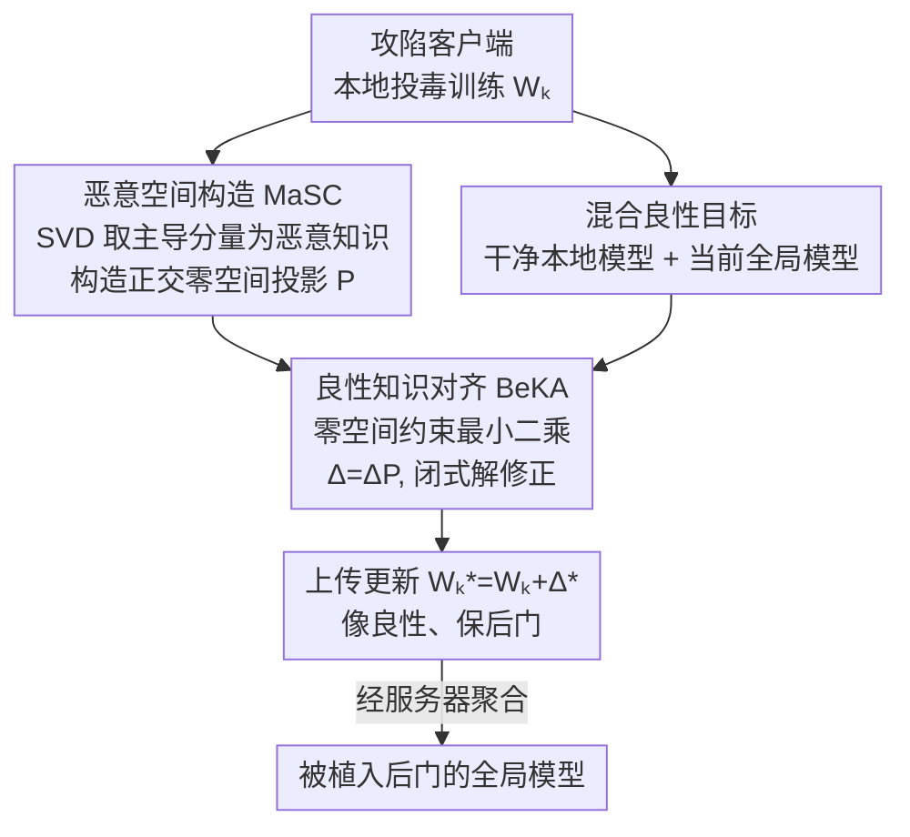

# Batman: Benign Knowledge Alignment Through Malicious Null Space in Federated Backdoor Attack

**会议**: CVPR 2026  
**论文**: [CVF Open Access](https://openaccess.thecvf.com/content/CVPR2026/html/He_Batman_Benign_Knowledge_Alignment_Through_Malicious_Null_Space_in_Federated_CVPR_2026_paper.html)  
**代码**: https://github.com/WenddHe0119/Batman  
**领域**: AI安全 / 联邦学习后门攻击  
**关键词**: 联邦学习, 后门攻击, 零空间, 良性知识对齐, 隐蔽性

## 一句话总结
针对联邦后门攻击"对齐良性知识会削弱攻击、不对齐又容易被防御识破"的两难，Batman 用 SVD 把恶意知识压进参数矩阵的主导方向、在其正交的"恶意零空间"里对齐良性知识，使隐蔽性提升而后门功能几乎不受损，在四个数据集、六种聚合/防御下都能同时拿到高 ASR 和高 ACC。

## 研究背景与动机

**领域现状**：联邦学习（FL）让多客户端在不交换原始数据的前提下协同训练一个全局模型，服务器只看得到客户端上传的参数更新。这种"只见更新、不见数据"的设定天然给后门攻击留了口子——攻陷少数客户端，就能让全局模型在带触发器的输入上误分类到攻击者指定的目标类，而在干净样本上表现正常。

**现有痛点**：经典后门（如 BadNet）植入固定触发器，恶意更新和良性更新之间存在明显差异，很容易被一致性/统计类防御筛掉。为躲检测，近年攻击分两路演化：一是**触发面攻击（Trigger-Surface）**，改触发器的形状/位置/投毒比例让投毒样本"看起来良性"（DBA、Bad-PFL、Chameleon 等）；二是**表示引导攻击（Representation-Guided）**，主动往恶意更新里注入良性更新，把良恶边界搅模糊（Neurotoxin、Lp-attack 等）。

**核心矛盾**：触发面攻击在参数空间里对良性知识的对齐**不充分**——恶意表示被压制但没真正向良性靠拢，良恶距离几乎没变，仍然可分、易被检测；表示引导攻击又**过度对齐**——注入太多良性更新，反过来稀释了恶意知识、削弱攻击成功率。根因在于：两类方法都在**同一个共享参数空间**里同时承载良性和恶意知识，对良性知识的任何对齐都会不可避免地干扰恶意表示。于是"既要隐蔽、又要有效"成了死结。

**切入角度与核心 idea**：作者用 Trigger Activation Change（TAC）对 ResNet-18 做了一个关键观察——参数矩阵的**高秩（主导）分量对触发器响应强烈**，是后门赖以存在的部分；而**低秩（尾部）分量对触发器几乎无响应、却和良性特征对齐**。既然恶意知识集中在主导方向，那就把它隔离出来，在它的**正交补（零空间）**里去对齐良性知识——零空间里的扰动按定义不会改动主导方向，从而**让"对齐良性"和"保住后门"发生在两个互不干扰的方向上**。一句话：用零空间把良性对齐和恶意保留解耦，绕过共享参数空间的强制 trade-off。

## 方法详解

### 整体框架

Batman 是被攻陷客户端在**最后一轮本地训练后**、对**与后门最相关的若干层**执行的两步操作，目标是把要上传给服务器的更新 $W_k^*$ 改写得既像良性客户端、又不丢后门。

第一步 **MaSC（Malicious Space Construction，恶意空间构造）**：对本地参数矩阵做截断 SVD，用 top-$r$ 主导分量近似"恶意知识" $W_k^{\text{main}}$，再构造它的左零空间投影矩阵 $P$。第二步 **BeKA（Benign Knowledge Alignment，良性知识对齐）**：用"投毒前的干净本地模型 + 当前全局模型"拼出一个混合良性目标 $W_k^b$，解一个带零空间约束的最小二乘，得到修正量 $\Delta$，把更新拉向良性目标、但强制 $\Delta$ 落在 $P$ 张成的恶意零空间里。最终上传 $W_k^* = W_k + \Delta^*$。因为 SVD 开销大，两步只在最后一轮、且只对偏离初始状态最大的几层做；若攻击者被聚合排除，后续轮次再逐步纳入更多层，自适应平衡效率与持久性。

### 关键设计

**1. MaSC：用 SVD 把后门关进"恶意零空间"，给良性对齐腾出无害方向**

这一步要解决的痛点是：在共享参数空间里对齐良性知识会顺手抹掉后门。作者先做诊断——对参数矩阵 $W_k\in\mathbb{R}^{m\times n}$ 做 SVD 并按奇异值大小切成主导分量与残差分量：

$$W_k=\underbrace{\sum_{i=1}^{r}s_i u_i v_i^\top}_{\text{Main}}+\underbrace{\sum_{j=r+1}^{\min\{m,n\}}s_j u_j v_j^\top}_{\text{Residual}}=W_k^{\text{main}}+W_k^{\text{res}}$$

TAC 分析显示 top-$r$ 分量对触发器响应远强于尾部分量，所以把 $W_k^{\text{main}}$ 当作"恶意知识"。接着定义它的**左零空间**：对 $W_k^{\text{main}}$ 再做 SVD，取对应零奇异值的左奇异向量 $\tilde U_0$，它满足 $\tilde U_0\tilde U_0^\top W_k^{\text{main}}=0$，即与主导子空间正交。于是投影矩阵 $P=\tilde U_0\tilde U_0^\top$ 把任意向量映到恶意零空间。零空间的定义保证：任何满足 $\Delta P W=0$ 的扰动只会在 $W$ 的正交方向上引入变化，**不改动恶意知识所在的主导方向**。这正是后续良性对齐"不伤后门"的数学地基，也是它和 Neurotoxin（往低显著子空间塞更新）之类方法的本质区别——后者仍在同一空间里近似规避干扰，Batman 是用正交性**严格**隔离。

**2. BeKA：拿"干净本地 + 全局"双源拼良性目标，再投影回零空间求闭式修正**

只把恶意更新对齐到投毒前的干净本地模型还不够：单一干净模型会偏离全局聚合方向，照样被一致性防御逮住。BeKA 因此构造一个**混合良性知识集** $W_k^b=\{W_k^*,\ W_g^t\}$，其中 $W_k^*$ 是该客户端投毒前的干净模型（反映自然的本地训练轨迹），$W_g^t$ 是第 $t$ 轮的全局模型（代表所有客户端的整体优化方向）。同时贴合"本地趋势 + 全局趋势"，更新才既不像离群点、也不偏离群体方向。

给定恶意更新 $W_k^{\text{main}}$，要找一个修正量 $\Delta$ 使总更新尽量靠近良性参考 $W_k^b$、但不碰后门信号，于是解带零空间约束的正则最小二乘：

$$\min_{\Delta}\ \lVert (W_k^{\text{main}}+\Delta)-W_k^b\rVert_F^2+\lambda\lVert\Delta\rVert_F^2,\quad \text{s.t. }\Delta=\Delta P$$

第一项让更新在方向和尺度上都向良性靠拢，第二项 $\lambda$ 约束修正幅度（防止偏离正常更新范数太多），约束 $\Delta=\Delta P$ 把修正强行锁在恶意零空间。该问题有闭式解：

$$\Delta^*=-\big(I+\lambda^{-1}P\big)^{-1}P\,(W_k^{\text{main}}-W_k^b)$$

最终上传 $W_k^*=W_k+\Delta^*$。这样一来，攻击者既保住了 $W_k^{\text{main}}$ 里的后门，又把实际上传的更新改造得像良性客户端，对一致性类和分布差异类防御都更难分辨。⚠️ 论文公式排版有 OCR 噪声（如 $\lambda$、投影记号），具体推导以原文 Appendix A 为准。

### 损失函数 / 训练策略
核心目标即上式带零空间约束的正则最小二乘，无需迭代、直接用闭式解 $\Delta^*$。SVD 与对齐只在最后一轮、对偏离初始最大的后门相关层执行以省算力；被聚合排除时逐步增层。两个正则强度 $[\lambda_{W_g},\lambda_{W_k^*}]$ 分别控制向全局/向干净本地的对齐力度，需调参（见下文消融）。

## 实验关键数据

设置：100 客户端、100 轮通信，其中 10 个被攻陷，每轮随机选 10% 客户端；用 Dirichlet(0.5) 模拟 non-IID。数据集 CIFAR-10/100、Fashion-MNIST、CINIC。指标 ASR（攻击成功率）、ACC（干净准确率）、AVG=（ACC+ASR)/2。对比攻击含 BadNet、DBA、Bad-PFL、Lp-attack、Neurotoxin；防御含 FedAvg(无防御)、FLGuardian、AlignIns、FLTrust、TrimmedMean、DnC。

### 主实验：六种聚合/防御下与 BadNet 等的对比（部分）

| 数据集 | 防御 | 方法 | ASR | ACC | AVG |
|--------|------|------|-----|-----|-----|
| CIFAR-100 | FedAvg | BadNet | 96.06 | 39.25 | 67.65 |
| CIFAR-100 | FedAvg | Neurotoxin | 94.03 | 36.74 | 65.38 |
| CIFAR-100 | FedAvg | **Batman** | **98.48** | 39.65 | **69.06** |
| CIFAR-100 | FLGuardian | BadNet | 96.08 | 34.96 | 65.52 |
| CIFAR-100 | FLGuardian | Lp-attack | 81.07 | 34.27 | 57.67 |
| CIFAR-100 | FLGuardian | **Batman** | **99.38** | 34.43 | **66.91** |
| CINIC | FedAvg | BadNet | 92.37 | 51.77 | 72.07 |
| CINIC | FLGuardian | Neurotoxin | 70.64 | 38.94 | 54.79 |
| CINIC | FLGuardian | **Batman** | **98.48** | 42.86 | **70.67** |

关键点：在 AlignIns 这种强防御下，BadNet 的 ASR 在 CIFAR-100 上被打到 0.72（基本失效），而 Batman 仍能维持高 ASR；Neurotoxin/Lp-attack 等隐蔽攻击在 FLGuardian 下 ASR 普遍掉到 30~80 区间，Batman 几乎都 >96。即"防御越强，Batman 相对优势越明显"。

### 消融实验：MaSC 与 BeKA 各自的贡献

| 配置 | DnC(CINIC) AVG | FLTrust(CINIC) AVG | DnC(F-MNIST) AVG | FLTrust(F-MNIST) AVG |
|------|------|------|------|------|
| 仅 MaSC | 73.80 | 57.85 | 94.93 | 83.77 |
| 仅 BeKA | 72.88 | 53.35 | 92.37 | 75.08 |
| **MaSC+BeKA(Full)** | **74.18** | **67.47** | **95.15** | **94.78** |

### 关键发现
- **BeKA 必须配 MaSC 才发力**：单独用 BeKA（在共享空间对齐）反而比单独 MaSC 还差——FLTrust(CINIC) 下仅 BeKA 的 AVG 53.35 低于仅 MaSC 的 57.85，印证了"在共享空间对齐会削弱攻击"的核心论点；只有把对齐投影进零空间，两者合起来才把 FLTrust(F-MNIST) 的 AVG 从 83.77/75.08 拉到 94.78。
- **零空间的隔离作用是收益主来源**：完整模型相对单模块的提升，几乎都来自隐蔽性强、防御严的场景（FLTrust 下提升 ~10 个点 AVG），而非无防御场景——说明 Batman 真正解决的是"对齐与有效"的冲突，而不是单纯堆高 ASR。
- **超参 $[\lambda_{W_g},\lambda_{W_k^*}]$ 与秩 $r$ 需调**：消融显示向全局/向干净本地的对齐力度存在最优组合（论文图 4 给出网格），秩 $r$ 取值也影响 AVG（图 5），过大过小都不理想——这是方法对实现细节较敏感的一面。

## 亮点与洞察
- **把"线性代数的正交性"直接用作攻防解耦工具**：很多隐蔽后门方法在"近似规避干扰"，Batman 用零空间约束 $\Delta=\Delta P$ 把"不伤后门"变成一个**硬约束**而非软正则，机制干净、有闭式解，思路很可迁移。
- **诊断驱动设计**：用 TAC 先证明"恶意知识=高秩主导分量、良性特征=低秩尾部"，再据此切割空间，方法不是拍脑袋而是有可视化证据支撑，论证链完整。
- **双源良性目标**：同时对齐"投毒前本地模型"和"当前全局模型"，恰好覆盖了一致性防御（看是否偏离群体）和分布防御（看统计离群）两类检测信号，目标设计和威胁模型对得很准。
- 迁移价值：零空间对齐可推广到任何"既要注入某种知识、又不能破坏已有功能"的场景，如持续学习的防遗忘、模型水印的隐蔽嵌入。

## 局限与展望
- **算力代价**：SVD 开销大，作者只能"最后一轮 + 少数层"地用，这是工程妥协；若防御方强制更频繁的全层审查，攻击成本会上升。
- **白盒/强能力假设**：攻击者需要拿到投毒前干净本地模型、当前全局模型并能做 SVD，属于较强的客户端能力；现实中部分受限联邦场景未必满足。⚠️ 论文未在自适应防御（防御方已知 Batman 机制、专门检测零空间扰动）下评估，这是潜在软肋。
- **仅图像分类**：实验集中在四个视觉分类数据集，未覆盖 NLP/检测/更大模型，"恶意知识集中于高秩分量"这一前提是否跨任务成立仍需验证。
- 作为防御启发：既然攻击藏在主导分量的零空间，防御方或许可针对性地审查更新在主导子空间外的反常能量，这是论文反向能催生的研究方向。

## 相关工作与启发
- **vs 触发面攻击（DBA / Bad-PFL）**: 它们在输入层改触发器、间接增强良性外观，但恶意表示只是被压制、未向良性收敛，良恶距离不变仍可分；Batman 直接在参数空间做正交对齐，主动把更新拉向良性而不动后门。
- **vs 表示引导攻击（Neurotoxin / Lp-attack）**: 它们把恶意更新限制在低显著/特定层子空间以减少干扰，但仍在共享空间里，对齐与攻击此消彼长；Batman 用零空间硬约束严格解耦，消融中正是这一点让 FLTrust 下 AVG 多出近 10 个点。
- **vs 经典 BadNet**: BadNet 植入静态触发器、良恶更新差异明显，在 AlignIns 等强防御下 ASR 可被打到接近 0；Batman 在同等防御下仍维持高 ASR，隐蔽性是质的提升。

## 评分
- 新颖性: ⭐⭐⭐⭐⭐ 用零空间正交性把"良性对齐"与"后门保留"硬解耦，机制干净且有闭式解，跳出共享参数空间的强制 trade-off。
- 实验充分度: ⭐⭐⭐⭐ 覆盖四数据集、五种攻击、六种聚合/防御，消融充分；但缺自适应防御与视觉分类外的验证。
- 写作质量: ⭐⭐⭐⭐ 诊断→设计→公式链条完整，图 3 框架清晰；OCR/排版噪声较多但不影响理解。
- 价值: ⭐⭐⭐⭐ 攻击侧给出强基线，更重要是为联邦后门防御指出"审查主导子空间外能量"的新方向。

<!-- RELATED:START -->

## 相关论文

- [\[CVPR 2025\] Geometric Knowledge-Guided Localized Global Distribution Alignment for Federated Learning](../../CVPR2025/ai_safety/geometric_knowledge-guided_localized_global_distribution_alignment_for_federated.md)
- [\[CVPR 2026\] Eliminate Distance Differences Induced by Backdoor Attacks: Layer-Selective Training and Clipping to Mask Backdoor Models](eliminate_distance_differences_induced_by_backdoor_attacks_layer-selective_train.md)
- [\[CVPR 2025\] Infighting in the Dark: Multi-Label Backdoor Attack in Federated Learning](../../CVPR2025/ai_safety/infighting_in_the_dark_multi-label_backdoor_attack_in_federated_learning.md)
- [\[ICML 2026\] Extending Fair Null-Space Projections for Continuous Attributes to Kernel Methods](../../ICML2026/ai_safety/extending_fair_null-space_projections_for_continuous_attributes_to_kernel_method.md)
- [\[CVPR 2026\] FlowHijack: A Dynamics-Aware Backdoor Attack on Flow-Matching Vision-Language-Action Models](flowhijack_a_dynamics-aware_backdoor_attack_on_flow-matching_vision-language-act.md)

<!-- RELATED:END -->
