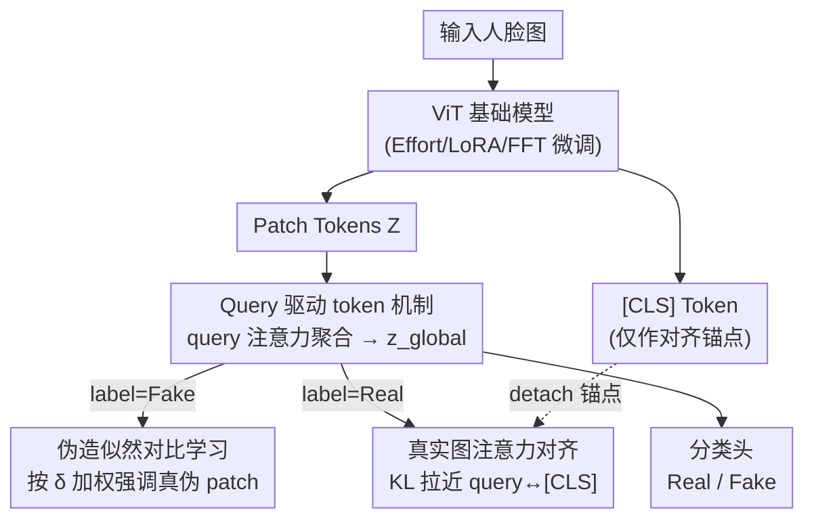

# Beyond [CLS] Token: Query-Driven Token-Level Forgery Purification for Generalizable Deepfake Detection

**会议**: CVPR 2026  
**论文**: [CVF Open Access](https://openaccess.thecvf.com/content/CVPR2026/html/Wang_Beyond_CLS_Token_Query-Driven_Token-Level_Forgery_Purification_for_Generalizable_Deepfake_CVPR_2026_paper.html)  
**代码**: https://banishedknight.github.io/CVPR_QTFP/ （项目页）  
**领域**: AI安全 / Deepfake检测  
**关键词**: 深度伪造检测, 视觉基础模型, query token, 对比学习, 泛化性

## 一句话总结
针对 ViT 基础模型做 deepfake 检测时 [CLS] token 过度关注全局语义、忽略局部伪造痕迹的"预训练信息偏置"问题，本文提出 QTFP 框架：用一组随机初始化的可学习 query token 替代 [CLS] 去聚合局部证据，再配合"伪造似然加权对比损失"和"真实图注意力对齐"两个正则，把跨数据集平均 AUC 从 Effort 的 0.923 提到 0.947。

## 研究背景与动机
**领域现状**：可泛化 deepfake 检测（DFD）被当作 real/fake 二分类问题。近期 SOTA（如 Effort、Forensics Adapter）普遍以 CLIP 这类 ViT 视觉基础模型（VFM）为骨干，借其强大预训练先验来抵抗未见伪造源的域偏移，并且几乎都直接拿预训练 ViT 的 **[CLS] token** 接分类头来做检测。

**现有痛点**：作者通过在 Effort 上的预备实验发现，[CLS] token 存在他们命名的**预训练信息偏置（Pre-trained Information Bias, PIB）**：它的注意力会广泛地、几乎非零地铺在所有 patch 上（图 2a 中注意力分布集中在很小的权重值附近且 patch 计数极高），即倾向于聚合全局语义，而 deepfake 的伪造痕迹是**局部**的（换脸、局部篡改），全局语义反而被大量"看起来真实"的 patch 主导，稀释了对细微伪造线索的关注。

**核心矛盾**：作者进一步用对照实验定位根因——把 [CLS] 换成随机初始化、可学习的 [CLS]（RandCLS），训练几个 epoch 后其 AUC 曲线会**逐渐逼近**预训练 [CLS]（PreCLS）的表现（图 2b）。这说明偏置不是来自 [CLS] 的初始化，而是来自**贯穿所有层的预训练参数**：只要 token 仍在骨干内部沿注意力层传播，就会被全局语义先验"带偏"。于是出现一个两难——预训练先验对泛化有用（尤其能刻画"真实"的样子），但它附带的全局语义偏置又会压制局部伪造证据。

**本文目标 / 切入角度**：与其在受预训练参数约束的 [CLS] 上修修补补，不如**绕开骨干**新造一个"检测专用 token"——既要打破全局语义的天花板去抓局部伪造，又不能把有用的预训练真实先验丢掉。

**核心 idea**：引入一组**独立于骨干、随机初始化的可学习 query token**，只在最后一层通过一个额外的轻量多头注意力去主动"查询"patch token、聚合局部伪造证据生成全局检测 token；再用对比损失强调真伪 patch、用注意力对齐损失保住真实先验。即"用 query token 代替 [CLS] 做 token 级伪造提纯"。

## 方法详解

### 整体框架
QTFP（Query-Driven Token-Level Forgery Purification）是一个**即插即用**框架，架在任意 ViT 基础模型 + 任意微调方式（Effort / LoRA / FFT）之上。输入一张人脸图，骨干照常产出 patch token 序列 $Z\in\mathbb{R}^{P\times D}$ 和 [CLS] token；QTFP 不再用 [CLS] 接分类，而是让一组可学习 query token 在最后一层"提问式"地聚合 patch，得到全局 token $z_{global}$ 去做 real/fake 判别。整套方法由三个模块串成，且后两个模块只在训练时作为损失/正则生效，推理时只保留 query 聚合这条主路：

1. **Query 驱动 token 机制**：query token 通过注意力从 patch 抽取局部伪造证据，平均成全局 token；
2. **伪造似然对比学习**：给每个 patch 估一个"像不像伪造"的软权重，让真正被篡改的 patch 主导对比损失；
3. **真实图注意力对齐**：仅在真实图上把 query 注意力分布拉向 [CLS]，锚住有用的预训练真实先验。

### 关键设计

**1. Query 驱动 token 机制（QDTM）：用独立 query 绕开 [CLS] 的全局语义天花板**

这一步直接针对 PIB：[CLS] 受全层预训练参数约束，注意力被全局语义带偏。作者引入 $K$ 个**随机初始化、独立于整个骨干**的可学习 query token $Q=[q_1,\dots,q_K]\in\mathbb{R}^{K\times D}$，只在最后一层经一个额外的轻量多头注意力与 patch token $Z\in\mathbb{R}^{P\times D}$ 交互：

$$A=\mathrm{Softmax}\!\left(\frac{QZ^\top}{\sqrt{D}}\right),\quad \tilde Z = AZ,$$

其中 $A\in\mathbb{R}^{K\times P}$ 是 query→patch 注意力，$\tilde Z\in\mathbb{R}^{K\times D}$ 是每个 query 聚合出的提纯局部证据。再把 $K$ 个 query 表示平均成单一全局 token $z_{global}=\frac{1}{K}\sum_{k=1}^K \tilde z_k$ 喂给分类头。它有两个关键好处：query "起点是白纸"，不带预训练全局偏置；又因为是从 patch 主动收集信息，天然把局部与全局连起来，让检测器盯住细微篡改的同时保持图像结构一致。注意 query 是加在骨干**外**的旁路，所以对底层用 Effort、LoRA 还是 FFT 都无所谓——这正是"即插即用"的来源。

**2. 伪造似然对比学习（FLCL）：给每个 patch 估"伪造概率"软权重，让真伪区主导优化**

光有 query 聚合还不够：一张假图里真假 patch 混杂，若对所有 patch 一视同仁地做对比学习，query 会被大量"像真的"patch 带偏、学到无关细节。作者先在 batch 内算真/假原型——$\mu_r$ 是所有真实图 patch 的均值，$\mu_f$ 是所有假图 patch 的均值（假图里既含伪造也含真实 patch）。对每个 patch $z_i$ 量它到两个原型的距离 $s_r(i)=1-\mathrm{sim}(z_i,\mu_r)$、$s_f(i)=1-\mathrm{sim}(z_i,\mu_f)$，并定义**带符号似然差**：

$$\delta_i = s_r(i)-s_f(i)=\mathrm{sim}(z_i,\mu_f)-\mathrm{sim}(z_i,\mu_r).$$

真正被篡改的 patch 的 $\delta_i$ 会明显大于"像真的"patch。再用单调映射 $w_i=g(\delta_i)$（sigmoid 或温度缩放 softmax）把 $\delta_i$ 转成软权重，乘进 patch 级对比损失，让真伪 patch 主导、压低 real-like patch：

$$L_{FLCL}=-\frac{1}{N_fP}\sum_{n=1}^{N_f}\sum_{i=1}^{P} w_i^n \log\frac{\sum_{j=1}^{P^+}e^{\mathrm{sim}(z_i^n,z_j^{n+})/\tau}}{\sum_{j=1}^{P}e^{\mathrm{sim}(z_i^n,z_j^n)/\tau}},$$

$z_j^{n+}$ 是同标签正样本 patch，$\tau$ 是温度。作者还从**信噪比（SNR）**角度论证这个权重靠谱：假设真/假 patch 各服从正态分布，令 $\Delta\mu=\mu_r-\mu_f$，则两类 $\delta$ 期望之差为 $\mathbb{E}[\delta|r]-\mathbb{E}[\delta|f]=\lVert\Delta\mu\rVert^2$，沿该方向的方差为 $\mathrm{Var}(\delta)=\Delta\mu^\top\frac{\Sigma_r+\Sigma_f}{2}\Delta\mu$，于是

$$\mathrm{SNR}=\frac{\lVert\Delta\mu\rVert^2}{\sqrt{\mathrm{Var}(\delta)}}=\frac{\lVert\Delta\mu\rVert}{\sigma}.$$

当 SNR > 1 时 $\delta$ 被认为是"有信息量"的，权重 $w$ 就能可靠放大伪造 patch、抑制 real-like patch；作者称训练全程 SNR 稳定在约 2.5–3.0，说明真假 patch 被清晰分开。⚠️ SNR 推导中 $\mathbb{E}[\delta|r]=\mu_r^\top\Delta\mu$ 等式以原文为准。

**3. 真实图注意力对齐（RAAL）：仅在真图上把 query 注意力锚回 [CLS]，保住有用的真实先验**

query 是自由学习的旁路，在真实图上若不加约束，容易偏离骨干学到的真实语义结构，把"真实长什么样"这部分有用先验丢掉。作者只在**真实图**上，用 KL 散度把每个 query token 的归一化注意力分布 $a_{n,k}^{Q}$ 拉向同图 [CLS] 的注意力分布 $a_n^{CLS}$：

$$L_{RAAL}=\frac{1}{N_rK}\sum_{n=1}^{N_r}\sum_{k=1}^{K}\mathrm{KL}\!\left(a_{n,k}^{Q}\,\Vert\, a_n^{CLS}\right).$$

关键点是 [CLS] 的注意力分布从计算图中 **detach**，只当稳定的"预训练知识锚点"用。它本质是个正则项：真实图里所有 patch 都是真内容、全局语义恰好与"真实"正相关，所以让 query 在真图上靠拢 [CLS] 既不会引入伪造偏置，又能把预训练真实先验保下来。这也回应了动机里的两难——QDTM 负责"抓局部伪造"，RAAL 负责"别把真实先验丢了"，两者互补。

### 损失函数 / 训练策略
总损失为分类损失 + 两个正则：$L=L_{CLS}+\lambda_1 L_{FLCL}+\lambda_2 L_{RAAL}$，文中取 $\lambda_1=0.14,\ \lambda_2=1.0$。分类用 $z_{global}$ 而非 [CLS]。实现基于 DeepfakeBench，默认骨干 CLIP ViT-L/14，训练采 8 帧、推理 32 帧，Adam（lr 2e-4，batch 16），默认 Effort 微调（rank-1），并配标准增广（高斯模糊、压缩）。

## 实验关键数据

### 主实验
跨数据集评测：在 FF++ (c23) 上训练，在 10 个未见数据集上测 video-level AUC。QTFP 平均 AUC 0.947，超过此前最强的 Effort（0.923）与 Forensics Adapter（0.914）。

| 方法 | Venue | CDF-v2 | DFDC | DFDCP | WDF | 平均 AUC(10集) |
|------|-------|--------|------|-------|-----|-----------------|
| Forensics Adapter* | CVPR'25 | 0.956 | 0.869 | 0.851 | 0.890 | 0.914 |
| Effort | ICML'25 | 0.956 | 0.843 | 0.909 | 0.848 | 0.923 |
| **Ours (QTFP)** | CVPR'26 | **0.960** | **0.869** | **0.925** | **0.917** | **0.947** |

跨方法评测（FF++ 训练 → DF40 内 8 种伪造技术测试）也全面领先：

| 方法 | UniFace | e4s | FSGAN | SimSwap | 平均 |
|------|---------|-----|-------|---------|------|
| Forensics Adapter* | 0.942 | 0.963 | 0.968 | 0.914 | 0.940 |
| Effort | 0.962 | 0.983 | 0.957 | 0.926 | 0.940 |
| **Ours** | **0.988** | **0.991** | **0.986** | **0.977** | **0.983** |

### 消融实验
基于 Effort（rank-1）在 FF++ (c23) 训练，三组件逐个累加（QDTM=query 机制，FLCL=伪造似然对比，RAAL=真实注意力对齐）：

| QDTM | FLCL | RAAL | CDF-v1 | FSh | DFDCP | 平均 |
|:----:|:----:|:----:|:------:|:---:|:-----:|:----:|
| × | × | × | 0.967 | 0.868 | 0.909 | 0.914 |
| ✓ | × | × | 0.970 | 0.891 | 0.914 | 0.925 |
| ✓ | ✓ | × | 0.976 | 0.902 | 0.917 | 0.931 |
| × | ✓ | × | 0.971 | 0.897 | 0.920 | 0.929 |
| ✓ | ✓ | ✓ | **0.980** | **0.913** | **0.925** | **0.939** |

### 关键发现
- **query token 贡献最大**：单加 QDTM 就把平均 AUC 从 0.914 提到 0.925（+1.1），是主要增益来源；FLCL 再 +0.6 到 0.931，RAAL 再 +0.8 到 0.939，两者提供互补鲁棒性。
- **FLCL 必须配 query 才划算**：把 FLCL 直接加到 [CLS] 上（无 query）只到 0.929，低于"QDTM+FLCL"的 0.931，反向印证 [CLS] 的局限——伪造加权对比要在不带全局偏置的 query 上才发挥得出。
- **越轻量的微调受益越大**：在 FFT/LoRA/Effort 三种微调下都涨，且 rank-1 Effort 这种可训练参数最少的设定增益最明显（0.867→0.903），说明 QTFP 是补"表征瓶颈"而非靠堆参数。
- **骨干无关**：在 BEiTv2/DINOv3/SigLIP2/PE/CLIP 上均提升（如 BEiTv2 0.723→0.781），其中 CLIP 因视觉-文本对齐先验最丰富而综合最好。

## 亮点与洞察
- **把"问题"先量化再开方**：作者没有直接堆模块，而是先用 PreCLS vs RandCLS 的 AUC 收敛实验证明偏置来自全层预训练参数（而非初始化），这个诊断让"绕开骨干造旁路 query"的设计显得顺理成章——是很好的"先定位根因再设计"范式。
- **SNR 给软权重背书**：FLCL 的逐 patch 软权重容易被质疑"凭什么这么加权"，作者用 $\mathrm{SNR}=\lVert\Delta\mu\rVert/\sigma$ 把"信号是否可分"量化，并报告训练全程 SNR≈2.5–3.0，给了一个可检验的稳定性证据。
- **即插即用是真的便宜**：query 是骨干外的轻量旁路，两个损失只在训练时生效，推理只多一层注意力，几乎不改原检测器——这种"加一个旁路 token + 两个正则"的范式可迁移到其他需要局部线索却被全局 token 稀释的任务（如细粒度分类、缺陷检测）。

## 局限性 / 可改进方向
- query 数量 $K$、$\lambda_1=0.14$ 等超参的敏感性正文未充分展开，$g(\delta)$ 选 sigmoid 还是温度 softmax 的影响也没系统对比，迁移到新骨干时这些可能需要重调。
- 真假原型 $\mu_r,\mu_f$ 在 batch 内估计，batch 16 偏小，原型噪声对 FLCL 权重的稳定性可能有影响；小 batch 或类别极不平衡场景下表现存疑。
- RAAL 假设"真实图全局语义与真实正相关"，在真实图本身带强背景干扰（如复杂场景、低质压缩）时，[CLS] 锚点未必可靠，对齐反而可能引入噪声。
- 评测均为 image deepfake，未涉及音视频联合伪造或纯生成（非换脸）内容，泛化边界还需更广的伪造类型验证。

## 相关工作与启发
- **vs Effort（ICML'25）**：Effort 用 SVD 适配重在"利用预训练真实先验"，但仍拿 [CLS] 接检测；本文指出 [CLS] 的 PIB 才是瓶颈，用独立 query 替代 [CLS]，在 Effort 之上即插即用把平均 AUC 0.923→0.947。
- **vs Forensics Adapter / UDD / FIA-USA 等细粒度方法**：它们也意识到伪造是局部的（定位 blending boundary、patch 洗牌、mask 内外对比），但多在 patch 特征层面做文章；本文的差异在于造一个**检测专用全局 token**，把"局部证据聚合"和"保住真实先验"用 query+两正则统一起来，而非只改 patch 表征。
- **启发**：当一个强预训练表征里"通用信息"会淹没"任务特定的稀疏信号"时，与其改造受全层参数约束的内部 token，不如新增一个起点为白纸、独立于骨干的可学习查询 token 去主动检索——这个思路对任何"全局表征压制局部判别线索"的任务都值得一试。

## 评分
- 新颖性: ⭐⭐⭐⭐ 从 PIB 诊断出发用独立 query 替代 [CLS]，角度清晰且有理论（SNR）支撑，但 query/对比/对齐三件套各自都不算全新。
- 实验充分度: ⭐⭐⭐⭐⭐ 跨数据集+跨方法两套协议、5 种骨干、3 种微调、逐组件消融齐全，结论自洽。
- 写作质量: ⭐⭐⭐⭐ 动机—诊断—方法逻辑顺，公式完整；部分理论符号偏密、超参敏感性着墨少。
- 价值: ⭐⭐⭐⭐ 即插即用、骨干/微调无关、平均 AUC 稳定领先，对实际 deepfake 检测系统有直接落地价值。

<!-- RELATED:START -->

## 相关论文

- [\[CVPR 2026\] DFD-HR: Generalizable Deepfake Detection via Hierarchical Routing Learning](dfd-hr_generalizable_deepfake_detection_via_hierarchical_routing_learning.md)
- [\[CVPR 2026\] TokenTrace: Multi-Concept Attribution through Watermarked Token Recovery](tokentrace_multi-concept_attribution_through_watermarked_token_recovery.md)
- [\[CVPR 2026\] ClusterMark: Towards Robust Watermarking for Autoregressive Image Generators with Visual Token Clustering](clustermark_towards_robust_watermarking_for_autoregressive_image_generators_with.md)
- [\[CVPR 2025\] Forensics Adapter: Adapting CLIP for Generalizable Face Forgery Detection](../../CVPR2025/ai_safety/forensics_adapter_adapting_clip_for_generalizable_face_forgery_detection.md)
- [\[CVPR 2026\] Tutor-Student Reinforcement Learning: A Dynamic Curriculum for Robust Deepfake Detection](tutor-student_reinforcement_learning_a_dynamic_curriculum_for_robust_deepfake_de.md)

<!-- RELATED:END -->
