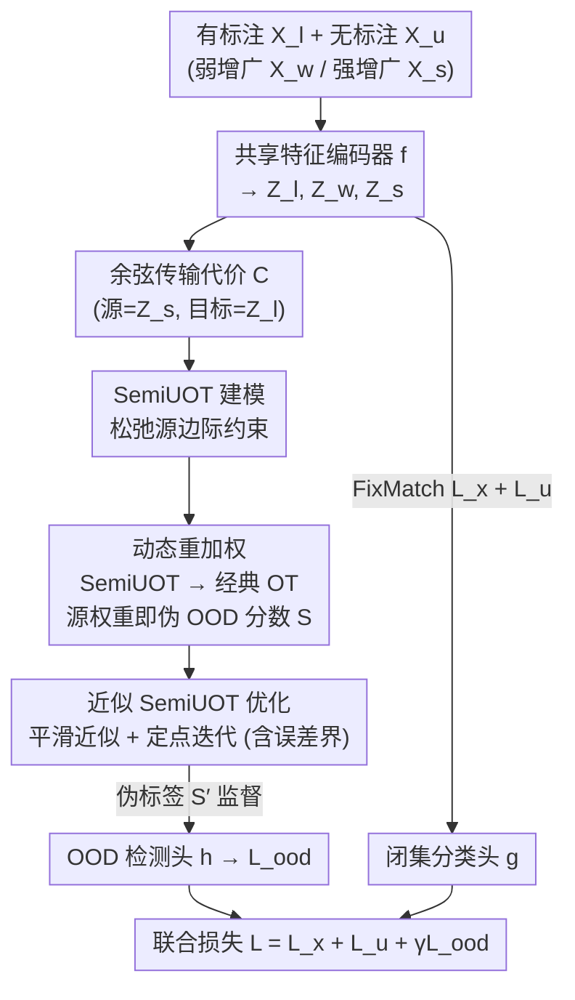

# Bypassing the Transport Plan: Dynamic Reweighting for Out-of-Distribution Detection with Optimal Transport

**会议**: CVPR 2026  
**论文**: [CVF Open Access](https://openaccess.thecvf.com/content/CVPR2026/html/Xiao_Bypassing_the_Transport_Plan_Dynamic_Reweighting_for_Out-of-Distribution_Detection_with_CVPR_2026_paper.html)  
**代码**: 未公开  
**领域**: AI安全 / OOD检测  
**关键词**: OOD检测, 最优传输, 半监督学习, 开放集SSL, 动态重加权  

## 一句话总结
针对开放集半监督学习中无 OOD 标签的难题，本文提出 DREW：把每个 batch 的 OOD 检测建模成半非平衡最优传输（SemiUOT），再通过"动态重加权"把它等价转换成经典 OT，直接从源分布权重里读出伪 OOD 分数——绕过求解整张传输计划 $\pi$，从而得到更准、更快、有理论误差界的伪标签来监督 OOD 检测头。

## 研究背景与动机
**领域现状**：半监督学习（SSL）靠少量有标注 + 大量无标注数据训练，但经典 SSL 假设有标注和无标注数据共享同一类空间。现实里无标注集常混进**未知类的 OOD 样本**（开放集 SSL），它们会被当成 ID 伪标签喂进训练，严重拖垮分类精度。于是需要在训练阶段同时做 OOD 检测。

**现有痛点**：开放集 SSL 的根本困难是**没有可靠的 OOD 标签**做监督。纯神经网络方法（MTCF、T2T）因缺标签检测效果差；近年引入"第三方代理"提供伪标签的方法里，最优传输（OT）被证明很有效——POT 的做法是把无标注（源）和有标注（目标）数据各看成均匀离散分布，求解 OT 传输计划 $\pi$，再用每个样本被转移的总质量当作 ID 的可信度，传输质量越少越可能是 OOD。

**核心矛盾**：现有 OT 方法非要**求出完整的传输计划 $\pi$**，但这件事既冗余又不可靠。冗余在于：OOD 检测真正关心的是"样本到分布"的匹配关系（每个源样本最终匹配掉多少质量），而不是 $\pi$ 里逐对"样本到样本"的细粒度匹配。不可靠在于：为了让 OT 可解，普遍要加熵正则用 Sinkhorn 近似，得到的是**稠密解**——本该集中的质量被抹平摊开，OOD 分数被污染。更糟的是 POT 还要人为往源权重里塞一个冗余质量 $k$ 来强行松弛目标边际约束，$k$ 的取值又和 OOD 比例挂钩，缺乏理论支撑、需要 ad-hoc 调参。

**本文目标**：在不求解完整 $\pi$、不加熵正则、不靠人为放大权重的前提下，得到理论可靠、更准确的伪 OOD 分数。

**核心 idea**：把 batch 级 OOD 检测建模成**松弛掉源边际约束**的 SemiUOT，再证明它可以"动态重加权"地等价转回经典 OT——而经典 OT 的源边际正是我们要的 OOD 分数，于是**直接从重加权后的源权重读分数，整张传输计划 $\pi$ 根本不用算**。

## 方法详解

### 整体框架
DREW 是一个开放集半监督训练框架，由两个权重共享（图中 "Tied"）特征编码器 $f$ 串起来的两大模块组成：**闭集分类模块**（沿用 FixMatch 结构）保证已知类分类精度，**OOD 检测模块**用动态重加权产出伪 OOD 标签来监督一个 OOD 检测头 $h$。

数据流是这样的：对一个 batch 的无标注样本 $X_u$ 做弱增广 $X_w$ 和强增广 $X_s$，连同有标注样本 $X_l$ 一起过编码器 $f$ 得到特征 $Z_l, Z_w, Z_s$。OOD 检测模块以**强增广无标注特征 $Z_s$ 为源、有标注特征 $Z_l$ 为目标**，先算余弦传输代价矩阵 $C$，再把 OOD 检测建成 SemiUOT，经动态重加权转成经典 OT，**直接从源边际权重得到伪 OOD 分数 $S$**（有标注样本分数恒为 1，即一定是 ID）。这个伪标签 $S'$ 监督检测头 $h$ 的预测 $\hat S$，构成 OOD 损失；同时闭集分类照常用 FixMatch 的有监督/无监督损失训练。三项损失加权联合优化：

$$L = L_x + L_u + \gamma L_{ood}, \qquad L_{ood} = \frac{1}{M+N}\|\hat S - S'\|_2^2 .$$

其中 $\hat S = h(Z_l \oplus Z_s)$，$S' = \mathbf{1}_N \oplus S$（$\oplus$ 为拼接）。关键收益是：动态重加权和近似求解都只发生在**训练阶段**，推理时只激活 FixMatch 和输出 ID 概率的网络，**OOD 检测零额外测试延迟**。

### 关键设计

**1. SemiUOT 建模：把"只关心源边际"写进 OOD 检测的数学形式**

OOD 检测的本质需求是知道每个无标注样本"最终匹配掉多少质量"，也就是传输计划在源侧的边际分布，而不是逐对样本的匹配细节。本文据此把 batch 级 OOD 检测建成**半非平衡最优传输**：源分布 $\alpha=\sum_i \frac{1}{M}\delta_{u_i}$（无标注/强增广特征）、目标分布 $\beta=\sum_j \frac{1}{N}\delta_{l_j}$（有标注特征），代价用余弦距离 $C = \mathbf{1}_{M\times N} - \frac{Z_s Z_l}{\|Z_s\|_2^2\|Z_l\|_2^2}$。和经典 OT（源、目标两个边际约束都保留）不同，SemiUOT **只保留目标边际约束 $\pi^\top \mathbf{1}_M = b$，把源边际约束松弛成一个 KL 惩罚项**：

$$\min_{\pi\in\Pi_s(\alpha,\beta)} \langle C,\pi\rangle_F + \tau_a\,\mathrm{KL}(\pi\mathbf{1}_N\,\|\,a).$$

这一步的意义在于：源边际被松开后，"每个源样本实际承载多少质量"就成了一个可以**自适应变化的量**——这恰好是 OOD 信号（OOD 样本和有标注 ID 数据距离远、自然匹配掉的质量少）。它从问题定义上就规避了 POT 那种人为塞冗余质量 $k$ 去松弛约束的 ad-hoc 做法。$\tau_a$ 控制 KL 惩罚强度（越大越多样本被卷入匹配）。

**2. 动态重加权：把 SemiUOT 等价转回经典 OT，源权重直接当 OOD 分数（绕过 $\pi$ 的核心）**

直接用 Sinkhorn 解 SemiUOT 又会回到熵正则 + 稠密解的老问题。本文的核心命题（Proposition 3.1）改走对偶：SemiUOT 的对偶形式

$$\min_{u,v,s,\zeta}\; \tau_a\Big\langle a,\exp\big(\tfrac{-u+\zeta}{\tau_a}\big)\Big\rangle - \langle v-\zeta, b\rangle,\quad \text{s.t. } u_i+v_j+s_{ij}=C_{ij},\, s_{ij}\ge 0,$$

可以**改写成一个经典 OT**，其源边际约束变为 $\pi\mathbf{1}_N = a\odot\exp\!\big(\tfrac{-u^*+\zeta^*}{\tau_a}\big)$、目标边际仍为 $\pi^\top\mathbf{1}_M = b$。关键洞察是：**只要部分求解出对偶变量 $u^*$ 和 $\zeta^*$，SemiUOT 就坍缩成经典 OT，而经典 OT 那个被重加权后的源边际 $a\odot\exp(\cdot)$ 本身就是我们要的伪 OOD 分数**

$$S = a\odot\exp\!\Big(\tfrac{-u^*+\zeta^*}{\tau_a}\Big).$$

也就是说，"动态地把源分布权重 $a$ 重加权一遍"和"解出整张传输计划再取源边际"在数学上等价，但前者根本不需要算出 $\pi$。$u,\zeta$ 这两个子问题可以用 L-BFGS 这类成熟精确求解器搞定。这就同时甩掉了制造不可靠分数的熵正则 / 稠密解，以及 POT 的人为权重放大——理论上更扎实，源权重越小（匹配质量越少）越像 OOD，方向直观可解释。

**3. 近似 SemiUOT + 定点迭代：让动态重加权在训练里高效可跑，并给出严格误差界**

精确 SemiUOT 的目标里含一个 $\inf_k[C_{kj}-u_k]$ 项（来自取代价最小的源样本），它**非光滑**，直接优化效率很差。本文用 log-sum-exp 软化它：$\inf_k[C_{kj}-u_k] \approx -\epsilon\log\sum_k e^{(u_k-C_{kj})/\epsilon}$，得到光滑的近似目标 $\widehat{J_S}$，从而 $u_i$ 可以闭式地**定点迭代**更新（$u^{(l+1)}_i = T(u^{(l)}_i)$），$\zeta$ 再由一阶条件解出。这里 $\epsilon$ 权衡精度与光滑度：越小越准但越不光滑。

更重要的是它带**严格误差界**（Proposition 3.3）：近似解 $\widehat u$ 与真解 $u$ 在目标值上满足 $|K_P(u)-K_P(\widehat u)| \le \epsilon\log M$。也就是说只要 $\epsilon$ 足够小，近似伪标签和精确解几乎一致，误差可控。整个伪分数计算复杂度为 $O(MN/\eta_{err})$（$\eta_{err}$ 是预设误差容忍度）。这条设计把第 2 点的理论等价"变成训练里真能跑得动、且有保证的算法"——这也是 DREW 能在不增加明显训练延迟的前提下生效的原因。

### 损失函数 / 训练策略
总损失 $L = L_x + L_u + \gamma L_{ood}$：$L_x/L_u$ 直接用 FixMatch 的有监督/无监督一致性损失，权重均为 1；$L_{ood}$ 是检测头预测 $\hat S$ 与动态重加权伪标签 $S'$ 的 MSE，权重 $\gamma=0.01$。骨干 CIFAR-10 用 WRN-28-2、CIFAR-100 用 WRN-28-8、ImageNet-30 用 ResNet-18；Nesterov SGD（momentum 0.9，weight decay $5\times10^{-4}$），余弦退火，初始 lr 0.03，$\tau_a=0.01$。每个 batch 内：增广 → 编码 → 算 $C$ → 动态重加权得 $S'$ → 算 $\hat S$ 与 $L_{ood}$ → 联合反传。

## 实验关键数据

### 主实验
基准在 CIFAR-10、CIFAR-100、ImageNet-30 上构建开放集 OOD 场景，对比纯神经网络法（MTCF、T2T）、OVA 代理法（OpenMatch）和 OT 代理法（POT），指标为闭集 Top-1 准确率 + AUROC（5 次实验均值±方差）。

| 数据集 / 设置 | 指标 | DREW | POT | OpenMatch |
|--------------|------|------|------|-----------|
| CIFAR-10（50 标/类） | Acc / AUROC | **92.2** / 99.6 | 92.1 / **99.7** | 89.6 / 99.3 |
| CIFAR-10（400 标/类） | Acc / AUROC | **94.1** / **99.4** | 93.6 / **99.4** | 94.1 / 99.3 |
| CIFAR-100（55 类, 50 标） | Acc / AUROC | **78.8** / **91.7** | 78.7 / 88.4 | 72.3 / 87.0 |
| CIFAR-100（80 类, 50 标） | Acc / AUROC | **75.5** / **90.8** | 75.4 / 88.1 | 66.6 / 86.2 |
| ImageNet-30（20 已知类） | Acc / AUROC | **92.1** / **97.6** | 92.0 / 97.4 | 89.6 / 96.4 |

DREW 在所有基准上全面领先或持平。最显著的优势在 **CIFAR-100 的 AUROC**（如 55 类/50 标：91.7 vs POT 88.4，+3.3），作者归因于类数多时其它方法的伪标签质量崩得更快，而 DREW 绕过稠密解后仍稳定。

### 消融实验
以 FixMatch-OOD（推理时用最大 softmax 概率检测 OOD）为底，对比换上 POT / DREW 监督（CIFAR-100）：

| 配置 | Acc（55类/50标） | AUROC（55类/50标） | AUROC（80类/50标） | 说明 |
|------|------|------|------|------|
| FixMatch-OOD | 78.2 | 57.3 | 48.7 | 无可靠伪标签，AUROC 接近随机 |
| FixMatch + POT | 78.7 | 88.4 | 88.1 | OT 代理伪标签大幅拉高 |
| FixMatch + DREW | **78.8** | **91.7** | **90.8** | 动态重加权伪标签更准，分类也微涨 |

换不同经典 OT 求解器接在 DREW 之后（CIFAR-100, 55类/50标）：DREW(+EMD/精确解) AUROC 91.5、DREW(+Sinkhorn) 91.2、DREW(+EPW) 91.0，**三种都超过 POT 的 90.1**；其中 EMD 精确解最可靠，印证"解越精确、伪标签越可靠"。

### 关键发现
- **伪标签质量是胜负手**：直接对比 OT 模块产出的伪标签 AUROC（Table 6），DREW（如 59.7）稳超 POT（$k$=1.25 时 54.9、$k$=2.5 时 59.2），且 DREW **不需要调 $k$**——POT 的 $k$ 要随 OOD 比例人工调，DREW 直接从源边际读分数无需此调参。
- **$\tau_a$ 鲁棒**：在 0.001→1 这么大的范围内性能无明显起伏，无需精调；$\gamma$ 太小（0.01 以下）会让 $L_{ood}$ 占比过低反而拉低 OOD 质量，其余区间稳定。
- **效率与零测试延迟**：得益于近似命题的加速，DREW 训练延迟相比 POT 仅小幅增加；推理阶段只跑 FixMatch + ID 概率网络，**OOD 检测零测试延迟**；ImageNet-30 上 49× 分辨率只带来约 6× 训练延迟。

## 亮点与洞察
- **"绕过传输计划"的视角转换很妙**：抓住了 OOD 检测只需要"样本到分布"的边际匹配、不需要"样本到样本"的完整 $\pi$，从问题定义层面把冗余砍掉——这是比"换个更好求解器"更本质的优化。
- **用对偶把 SemiUOT 等价坍缩成经典 OT**，让"重加权后的源权重 = OOD 分数"直接成立，既甩掉熵正则的稠密解污染，又甩掉 POT 的 ad-hoc 冗余质量 $k$，可解释性和理论性都更强。
- **理论误差界 $\le \epsilon\log M$ 落地为可控算法**：近似不是拍脑袋，而是带上界保证，这套"非光滑 → log-sum-exp 软化 → 定点迭代 + 误差界"的范式可迁移到其它需要解 UOT/SemiUOT 边际的任务（如开放集域适应、噪声标签筛选）。
- **训练期检测、推理零开销**的设计对部署友好：OOD 监督只在训练发生，不给在线推理加负担。

## 局限与展望
- **评测规模偏小**：基准止于 CIFAR-10/100 与 ImageNet-30（20 已知类），未在大规模/真实长尾 OOD（如完整 ImageNet、细粒度或语义近邻 OOD）上验证，泛化性待观察。
- **增益在简单设置下很薄**：CIFAR-10 上 DREW 与 POT 的 Acc/AUROC 常常只差 0.1 量级甚至 AUROC 略低，真正拉开差距主要在 CIFAR-100 这类类数多的难设置——方法的价值高度依赖"稠密解会崩"的场景。
- **依赖有标注数据作目标分布**：余弦代价 $C$ 与目标边际都建立在有标注 ID 特征上，标注极少或有标注类与无标注未知类语义接近时，伪标签可靠性可能下降。⚠️ 原文实现细节（L-BFGS 部分求解的迭代轮数、$\epsilon$ 的具体取值）以原文及附录为准。
- **代码未见公开**，复现需自行实现对偶求解与定点迭代，门槛偏高。

## 相关工作与启发
- **vs POT（OT 代理 OOD）**：POT 求完整 $\pi$ 并靠人为冗余质量 $k$ 松弛目标边际、再 $S=\frac{1}{k}\pi\mathbf{1}_N$ 取分数，受熵正则稠密解和 $k$ 调参拖累；DREW 改成 SemiUOT + 动态重加权，绕过 $\pi$、无 $k$、有误差界，伪标签更准（尤其类多时）。
- **vs OpenMatch（OVA 代理）**：OpenMatch 用一对多分类器做 OOD，在 CIFAR-10 尚可但 CIFAR-100 闭集精度和 AUROC 都明显落后；DREW 用 OT 边际信号，类数越多越稳。
- **vs 纯神经网络法（MTCF / T2T / DS3L）**：这类方法缺可靠 OOD 标签、检测质量受限；DREW 把"造可靠伪标签"这件事用 OT 理论解决，再去监督检测头。
- **vs 测试期检测（MSP / Energy / GradNorm）**：那些只在测试期对纯 ID 训练模型打分，无法在开放集 SSL 训练里同时保住分类精度；DREW 是训练期联合优化、推理零延迟。

## 评分
- 新颖性: ⭐⭐⭐⭐ "绕过传输计划、用对偶把 SemiUOT 等价坍缩成经典 OT 直接读源权重"的视角转换扎实且有理论支撑。
- 实验充分度: ⭐⭐⭐⭐ 主结果 + 消融 + 不同求解器 + 伪标签质量 + 超参鲁棒性较完整，但基准规模偏小、简单设置下增益薄。
- 写作质量: ⭐⭐⭐⭐ 动机—痛点—方法逻辑清晰，公式与命题给得齐，个别符号/排版有 typo。
- 价值: ⭐⭐⭐⭐ 对开放集 SSL 的 OOD 检测给出更准更快、可解释、零测试延迟的方案，UOT 边际求解范式有迁移潜力。

<!-- RELATED:START -->

## 相关论文

- [\[CVPR 2026\] SubFLOT: Submodel Extraction for Efficient and Personalized Federated Learning via Optimal Transport](subflot_submodel_extraction_for_efficient_and_personalized_federated_learning_vi.md)
- [\[ICLR 2026\] Optimal Transport-Induced Samples against Out-of-Distribution Overconfidence](../../ICLR2026/ai_safety/optimal_transport-induced_samples_against_out-of-distribution_overconfidence.md)
- [\[CVPR 2026\] RankOOD: Class Ranking-based Out-of-Distribution Detection](rankood_-_class_ranking-based_out-of-distribution_detection.md)
- [\[CVPR 2026\] Enhancing Out-of-Distribution Detection with Extended Logit Normalization](enhancing_out-of-distribution_detection_with_extended_logit_normalization.md)
- [\[ICML 2026\] Optimal Transport under Group Fairness Constraints](../../ICML2026/ai_safety/optimal_transport_under_group_fairness_constraints.md)

<!-- RELATED:END -->
