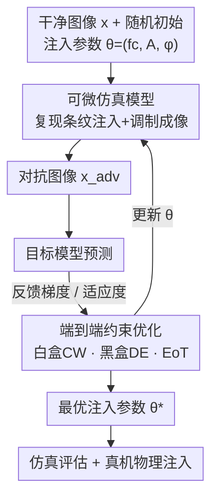

# CamPI: Physical Adversarial Examples through Camera Power Signal Injection

**会议**: CVPR 2026  
**论文**: [CVF Open Access](https://openaccess.thecvf.com/content/CVPR2026/html/Ren_CamPI_Physical_Adversarial_Examples_through_Camera_Power_Signal_Injection_CVPR_2026_paper.html)  
**代码**: 无  
**领域**: 对抗攻击 / AI安全  
**关键词**: 物理对抗样本, 相机电源注入, 信号调制, 可微仿真, 黑盒优化  

## 一句话总结
通过向相机的供电线注入一段经过调制的信号，利用 ADC 采样混叠在成像中诱导出可控的条纹/掩码扰动，从而生成肉眼不可见、无需贴片或打光、也无需正对目标的物理对抗样本；作者建了一个可微仿真模型，把这套物理机制端到端优化成攻击参数，在白盒/黑盒下分别达到 92%/82% 的物理攻击成功率。

## 研究背景与动机
**领域现状**：物理对抗样本主要走两条路——一是 patch-based，把打印好的对抗贴片贴到目标物体上；二是 optical-based，用投影仪/激光把可见图案打到目标或相机上。两者都已经被反复验证能让现实中的分类器、检测器误判。

**现有痛点**：这两类方法都有明显的暴露风险。贴片需要物理接近目标并留下可见痕迹，光学攻击需要对目标有直接视线（line of sight）、且图案肉眼可见，容易被人或防御系统察觉，实战中的隐蔽性和可行性都受限。此外它们对目标姿态、拍摄角度、光照都比较敏感。

**核心矛盾**：对抗扰动要"足够强能骗过模型"，又要"足够隐蔽不被发现"——现有手段把扰动加在了**目标或光路**这种看得见的环节，强度和隐蔽性天然对立。问题的根源在于攻击面选错了：只要扰动出现在画面里，就一定可见。

**本文目标**：找一个既能细粒度控制扰动、又彻底绕开"可见性"的新攻击面，并能把它转化成一个可优化的对抗样本生成问题。

**切入角度**：作者盯上了每台相机都有、却从没被当成攻击面认真利用的环节——**供电电源**。往电源线注入信号会干扰传感器读出电路，经 ADC 欠采样产生混叠，在图像里留下条纹。关键观察是：这个条纹的形态（方向、密度）随注入信号频率系统性变化，意味着它**可控**，而且因为扰动是在成像环节产生的，画面里看不到任何贴片或光斑。

**核心 idea**：把"对抗扰动"从贴片/光斑搬到**电源信号**上——用调制信号在相机成像链路里"画"出对抗图案，再用一个可微仿真模型把这套物理过程端到端优化成攻击参数。

## 方法详解

### 整体框架
CamPI 分两层。底层是**对注入机制的物理刻画**（条纹注入 + 调制式细粒度控制），搞清楚"往电源注入什么信号、会在图像里产生什么扰动"；上层是**端到端攻击框架**：给定一张干净图像和一组随机初始化的注入参数 $\theta=(f_c, A, \phi)$，先用一个**可微仿真模型**把物理扰动复现在数字图像上得到对抗图像，送进目标模型拿到预测，再把预测反馈给优化算法（白盒 CW / 黑盒 DE，外加 EoT 增强鲁棒性）不断更新 $\theta$，最后把收敛得到的最优参数 $\theta^*$ 拿去做仿真评估和真机物理注入。

这里底层的两个机制（条纹注入、调制控制）并不是流水线里的独立环节，而是被"编码进"可微仿真模型这个节点——仿真模型之所以那么设计，正是为了在数字图像上忠实复现这两套物理过程，所以下图把它们折叠进了仿真节点。

### 关键设计

**1. 条纹注入机制：用 ADC 采样混叠把电源信号变成图像里的规则条纹**

这是整套攻击的物理地基，回答"为什么往电源注入信号会在画面里出现可控图案"。当一段中心频率为 $f_c$ 的信号被注入相机电源时，它会干扰传感器读出和模拟前端电路；这个高频干扰经过 ADC 采样后，由于采样率 $f_s$ 不足而发生混叠，产生一个混叠频率 $f_{\text{alias}} = |f_c - k f_s|$，其中 $k$ 是让该绝对值最小的整数。由于相机采用逐行扫描（progressive scan，从左到右、从上到下顺序读出），这个混叠后的干扰按读出顺序叠加在原始信号上，就在图像里形成**规则的条纹**。更关键的是：不同 $f_c$ 会改变 $f_{\text{alias}}$，从而改变条纹的方向和密度——这正是"可控"的来源，也是后面把 $f_c$ 当作可优化参数的依据。

**2. 调制式细粒度控制：把任意掩码逐行读成基带信号、调幅到载波上"画"进图像**

光有条纹还不够细粒度——攻击者想要的是**任意形状**的对抗扰动，而不只是均匀条纹。作者引入一套调制方案：先把目标扰动掩码（source mask）逐行读出并拼接成一维**基带信号**，再把基带信号**调幅（amplitude modulation）**到频率为 $f_c$ 的载波上得到攻击信号，最后注入电源。这样图像里观察到的扰动就是"掩码图案 + 载波诱导条纹"的叠加。一个工程上的硬约束是：注入信号的传输速率必须和相机的帧率、行率严格同步，否则图案会漂移、无法稳定成形。作者把条纹伪影和调制图案合并起来，统一当作后续优化的对抗扰动。

**3. 可微仿真模型：把不可微的物理注入过程复刻成可反传的数字算子**

物理注入本身没法直接求梯度，要做基于梯度的优化就必须有一个数字侧的可微代理。作者据此设计了仿真模型（Algorithm 1）：输入干净图像 $x$、注入参数 $(f_c, \phi, A)$ 和相机参数（帧率 $f_{ps}$、采样率 $f_s$、裁剪比、网格 $N_{row}\times N_{col}$），先算像素传输率 $f_{pixel}=f_{ps}\cdot N_{row}\cdot N_{col}$ 和混叠频率 $f_{\text{alias}}$，再逐像素生成扰动

$$\delta[i,j] = A[k]\,\sin\!\Big(2\pi\,\frac{f_{\text{alias}}}{f_{pixel}}\cdot k + \phi\Big),\quad k=(i-1)N_{col}+j$$

然后模拟传感器读出时的裁剪有效区 + resize 到全图、复制到三个颜色通道、并 clip 到合法像素范围，得到对抗图像 $x_{adv}=\text{clip}(x+\delta^{(3)}, 0, 255)$。因为扰动对信号参数的微小变化是连续响应的，这个仿真天然可微，从而打通了梯度优化的链路。相机参数既可以查 datasheet，也可以靠信号测试实测得到。

**4. 端到端约束优化（白盒 CW + 黑盒 DE + EoT）：在物理可实现的参数空间里求最优注入**

与数字攻击能任意改像素不同，电源注入只能在物理可实现的参数集 $\Theta$ 内调 $(f_c, A, \phi)$，因此核心是一个**约束优化**：$\max_\theta \mathcal{L}\big(f(x+\delta(\theta)), y\big)$，s.t. $\|\delta(\theta)\|_p \le \epsilon,\ x+\delta(\theta)\in\mathcal{X},\ \theta\in\Theta$。作者针对两种威胁模型分别求解：

白盒下假设可拿到模型梯度，借仿真模型的可微性用 Carlini–Wagner 优化，把约束问题改写成联合最小化扰动幅度与分类 margin 损失 $\min_\theta \|\delta(\theta)\|_2^2 + c\,\mathcal{L}_{\text{margin}}$，其中 $\mathcal{L}_{\text{margin}}=\max(Z(x')_y - \max_{i\neq y}Z(x')_i, -\kappa)$，系数 $c$ 权衡隐蔽性与成功率；由于物理参数是离散的，再用 **Gumbel–Softmax** 对离散状态做可微松弛 $\theta=\sum_i z_i\tilde\theta_i$，让梯度能流过离散选择。黑盒下无梯度，改用**差分进化（DE）**：把 $(f_c,\phi)$ 和每个扰动像素的 $(x_i,y_i,A_i)$ 编码成候选向量（受 $L_0$ 约束），靠变异 $\theta_i^{(g)}=\theta_{r_1}^{(g)}+F(\theta_{r_2}^{(g)}-\theta_{r_3}^{(g)})$、交叉、选择来进化最优参数。最后无论白盒黑盒都套一层 **EoT（Expectation over Transformation）**，把损失对一族物理变换（平移、旋转、裁剪、亮度、对比度、高斯噪声）求期望 $\mathcal{L}_{\text{EoT}}=\mathbb{E}_{t\sim\mathcal{T}}[\mathcal{L}(f(t(x+\delta)),y)]$，让扰动在真实成像畸变下仍然有效。

## 实验关键数据

### 主实验
仿真评估用 NIPS 2017 对抗竞赛的 ImageNet-compatible 数据集（1000 张），目标模型为 7 个 ImageNet 预训练标准架构（ResNet-101 / Inception-v3 / VGG-19 / DenseNet-161 / ResNeXt-101 / SqueezeNet 1.1 / ShuffleNet V2）。白盒下随 trade-off 系数 $c$ 增大，ASR 升高但 $L_2$ 失真也变大：

| 模型 | $c_1{=}10^1$ ASR | $c_2{=}10^2$ ASR | $c_3{=}10^3$ ASR | $c_4{=}10^4$ ASR |
|------|------|------|------|------|
| ResNet | 66.9 | 93.5 | 94.4 | 94.6 |
| Inception | 81.9 | 93.4 | 95.6 | 95.5 |
| VGG | 92.4 | 99.0 | 99.4 | 99.8 |
| DenseNet | 86.3 | 97.7 | 98.3 | 98.7 |
| ResNeXt | 50.8 | 86.4 | 89.4 | 90.6 |
| SqueezeNet | 93.0 | 99.4 | 99.8 | 99.2 |
| ShuffleNet | 82.1 | 99.1 | 99.5 | 99.0 |
| **平均** | **79.1** | **95.5** | **96.6** | **96.8** |

在 $c_2$（平均 $L_2{=}7.3$，约合每像素 4.8/255 的扰动）时，平均 ASR 已达 95.5%。黑盒（VGG-19，DE 优化）在 $L_0$ 放宽到 256 个扰动块时 ASR 达 89.7%。

真机物理注入用商用 HD 相机（HIKVISION DS-2CE56C3T-IT3）+ USRP-B210 软件无线电 + 功放，对 100 张图做白盒/黑盒攻击，并与对应的仿真攻击对比：

| 设置 | 仿真 ASR | 物理 ASR | 备注 |
|------|----------|----------|------|
| 白盒（$L_2$） | 98% | 92% | $L_2$ 17.4→15.2 |
| 黑盒（$L_0{=}256$） | 85% | 82% | DE 优化 |

仿真到物理只掉了 6%/3%，说明仿真模型相当准确地复现了真实注入。

### 消融 / 分析实验
| 配置 / 变量 | 关键指标 | 说明 |
|------|---------|------|
| 黑盒 $L_0$ 约束 1→256 | ASR 与置信度单调上升，到 256 时 89.7% | 扰动块越多越强 |
| Affinity 定向攻击（Tab.2） | cup→mortar 100%，pencil sharpener→ruler 94% | 利用特征空间语义相近的"亲和目标" |
| EoT 物理变换鲁棒性 | 平移/旋转/裁剪/亮度/对比度/高斯噪声下仍有效 | 真实成像畸变下保持攻击力 |
| 攻击距离 1–10m | 绝对幅度在 0–5m 衰减、5–10m 稳定 | 加长电源线仍可成功注入 |

### 关键发现
- **定向攻击靠"亲和目标"才高效**：作者发现模型特征空间里存在语义相近的类对（affinity target），针对这些类对做定向攻击极易成功（多对达 100%/94%），而非任意指定目标类都能高成功率——这是定向攻击的一个现实约束。
- **自动增益控制带来不对称**：距离实验里，受相机 AGC 影响，注入更容易造成幅度**下降**而非上升，正负幅度响应不对称。
- **Grad-CAM 证实机制**：攻击后模型注意力要么从真实目标上显著减弱，要么漂移到无关背景，说明注入扰动确实把网络从真目标特征引开，而不只是数值上凑出误分类。
- **最脆弱与最鲁棒模型**：VGG/SqueezeNet 几乎逼近 100% ASR，ResNeXt 相对最难攻（低 $c$ 时仅 50.8%）。

## 亮点与洞察
- **攻击面创新本身就是最大价值**：把对抗扰动从"画面里看得见的贴片/光斑"挪到"看不见的供电线"，一举绕开可见性、视线、目标姿态三大限制，还能借电源线传播实现远距离隐蔽攻击——这是一个全新的物理威胁向量。
- **可微仿真是打通物理与优化的关键桥**：物理注入不可微，但作者把"混叠条纹 + 逐行调制 + 裁剪 resize"整条成像链路写成一个连续可微的算子，使梯度优化（CW）得以直接作用在物理参数上；这套"给物理过程造可微代理"的思路可迁移到声学、电磁等其他信号注入攻击。
- **Gumbel-Softmax 处理离散物理参数**：物理可实现的频率/相位/幅度是离散的，用 Gumbel-Softmax 松弛让梯度流过离散选择，是把"物理约束"塞进梯度优化的实用技巧。
- **affinity target 的观察**：定向攻击不是对任意目标都灵，而是顺着模型特征空间里本就相近的类对发力，这个 insight 对理解定向攻击的可行边界很有启发。

## 局限与展望
- **威胁模型偏强且需物理接触电源**：攻击需要往目标相机的供电线注入信号（实验用功放 + 耦合器），意味着攻击者要能接触/接入电源线路，并非纯远程；论文强调"长距离"潜力但真机只验证到 10m 电源线长度。
- **同步要求苛刻**：注入信号必须与相机帧率/行率严格同步才能稳定成形，对不同相机的可移植性、对未知相机参数的适应性存疑 ⚠️（论文称参数可查 datasheet 或实测，但未系统评估参数误差对成功率的影响）。
- **只验证了分类任务**：评估集中在 ImageNet 分类的 7 个模型，对检测、分割、人脸识别等更贴近自动驾驶/安防的下游任务未做端到端验证。
- **物理实验规模有限**：因物理注入成本高，真机只在 100 张图、单台主相机上验证（另有 6 台商用相机在附录），统计规模较小。
- **改进方向**：把可微仿真扩展到检测/分割任务损失、研究对未知相机的零样本/少样本参数标定、以及面向这种新攻击面的检测与防御（如电源滤波、读出随机化）。

## 相关工作与启发
- **vs Patch-based 物理攻击**（贴对抗补丁）：它们要物理接近目标、留下肉眼可见痕迹，且对姿态/视角敏感；CamPI 不接触目标、扰动不可见，且因为扰动在成像环节产生，对目标姿态和拍摄角度天然鲁棒。
- **vs Optical-based 物理攻击**（投影/激光）：光学攻击需要对目标有直接视线、图案可见；CamPI 不依赖视线，在遮挡和多变光照下更实用，还能借电源线远距离传播。
- **vs 既有电源扰动工作 [18]**：前作已观察到电源干扰能影响成像，但只能产生粗糙不可控的扰动；CamPI 首次实现对输出图案的**细粒度调制控制**，并首次给出在物理可实现参数空间内做**定向对抗优化**的框架。
- **vs 数字对抗攻击（FGSM/PGD/CW/DE）**：CamPI 复用了 CW（白盒）和差分进化（黑盒）这些成熟优化器，但优化变量不是任意像素而是受物理约束的注入参数 $(f_c,A,\phi)$，把数字攻击的优化工具迁移到了一个真实物理攻击面上。

## 评分
- 新颖性: ⭐⭐⭐⭐⭐ 揭示"相机电源"这一全新且不可见的物理对抗攻击面，并首次实现细粒度可控注入与定向优化。
- 实验充分度: ⭐⭐⭐⭐ 7 模型仿真 + 真机物理验证 + 距离/鲁棒性/注意力分析齐全，但物理样本量小、仅限分类任务。
- 写作质量: ⭐⭐⭐⭐ 机制—仿真—优化—验证的逻辑链清晰，公式与算法完整；部分物理参数标定细节略简。
- 价值: ⭐⭐⭐⭐⭐ 对安防/自动驾驶等部署在物理世界的视觉系统提出了一个难以察觉的新威胁，安全意义大。

<!-- RELATED:START -->

## 相关论文

- [\[CVPR 2026\] DASH: A Meta-Attack Framework for Synthesizing Effective and Stealthy Adversarial Examples](dash_a_meta-attack_framework_for_synthesizing_effective_and_stealthy_adversarial.md)
- [\[CVPR 2026\] RevINN: An End-to-End Invertible Neural Network for Reversible Adversarial Examples Generation](revinn_an_end-to-end_invertible_neural_network_for_reversible_adversarial_exampl.md)
- [\[CVPR 2026\] AdvFM: Lookahead Flow-Matching Velocity-Field Attacks for Imperceptible and Transferable Adversarial Examples](advfm_lookahead_flow-matching_velocity-field_attacks_for_imperceptible_and_trans.md)
- [\[CVPR 2026\] Physical Adversarial Clothing Evades Visible-Thermal Detectors via Non-Overlapping RGB-T Pattern](physical_adversarial_clothing_evades_visible-thermal_detectors_via_non-overlappi.md)
- [\[CVPR 2026\] Phantom: Physical Object Interactions as Dynamic Triggers for NMS-Exploited Backdoors](phantom_physical_object_interactions_as_dynamic_triggers_for_nms-exploited_backd.md)

<!-- RELATED:END -->
