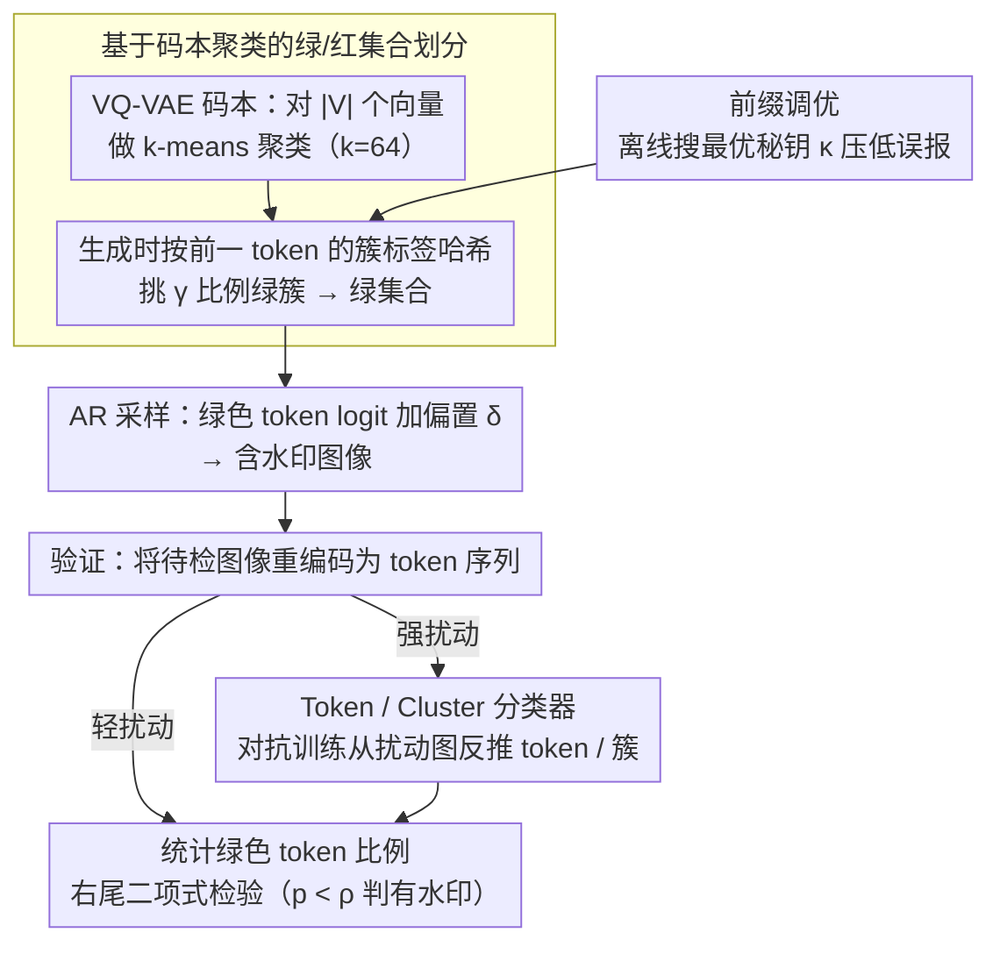

# ClusterMark: Towards Robust Watermarking for Autoregressive Image Generators with Visual Token Clustering

**会议**: CVPR 2026  
**arXiv**: [2508.06656](https://arxiv.org/abs/2508.06656)  
**代码**: [https://github.com/lukovnikov/ClusterMark](https://github.com/lukovnikov/ClusterMark)  
**领域**: AI安全 / 图像水印  
**关键词**: 自回归图像生成, 水印检测, 视觉token聚类, 鲁棒水印, VQ-VAE

## 一句话总结

提出基于视觉 token 聚类的水印方案 ClusterMark，将 KGW 风格的 LLM 水印适配到自回归图像生成器，通过将相似 token 分到同一绿/红集合来显著提升水印在图像扰动下的鲁棒性，同时保持图像质量。

## 研究背景与动机

AI 生成图像的水印技术对于内容溯源、防止滥用和训练数据质量控制至关重要。当前研究主要聚焦于扩散模型的水印嵌入，而自回归（AR）图像生成模型的水印方案研究不足。随着 LlamaGen、RAR 等 AR 图像模型的快速发展，这一需求日益迫切。

AR 图像模型通过逐步预测视觉 token 序列来生成图像，这些 token 由 VQ-VAE 的码本定义。受 LLM 领域 KGW 水印方案的启发，一个自然的想法是将基于 token 的水印直接迁移到 AR 图像生成中——在每步采样时根据前一 token 将词表划分为"绿色"和"红色"集合，偏向采样绿色 token。

然而，直接迁移存在严重的鲁棒性问题。验证水印时需要将图像重新编码为 token 序列，但即使轻微的图像扰动（如 JPEG 压缩、高斯噪声）也会导致 VQ-VAE 编码器产生完全不同的 token——因为量化过程中，微小的潜在空间偏移就可能使表示跳到码本中的另一个 token。由于 KGW 方案中绿/红集合的划分是随机的，相似的 token 可能被分配到不同集合，导致扰动后水印信号急剧下降。

核心洞察：**如果将视觉上相似的 token 聚类在一起，确保同一簇中的所有 token 属于同一集合（全绿或全红），那么即使扰动导致 token 发生变化，只要新 token 仍在同一簇内，水印信号就不会丢失。**

## 方法详解

### 整体框架

ClusterMark 在 AR 图像生成的采样阶段嵌入水印，验证时仅需 VQ-VAE 编码器和秘钥即可检测，无需访问原始生成模型。整体流程分三步：(1) 预处理阶段对 VQ-VAE 码本向量做 k-means 聚类；(2) 生成时基于前一 token 的簇标签计算绿/红集合划分，偏向采样绿簇中的 token；(3) 验证时将待检图像编码为 token 序列，统计绿色 token 比例并做二项式假设检验。在这条主干上，方法再叠两个增强：用一个轻量的 Token / Cluster 分类器在强扰动下"撤销扰动"后再编码，用前缀调优在离线阶段挑出误报最低的秘钥 $\kappa$，二者共同保证水印在各类扰动下既鲁棒又低误报。

### 关键设计

**1. 基于码本聚类的绿/红集合划分：让水印信号"扛住"量化跳变**

直接把 KGW 搬过来的死穴在于：验证水印要先把图像重编码成 token，而 VQ-VAE 的量化对扰动极其敏感——一点 JPEG 压缩或噪声就能让潜在向量越过码本里相邻向量的分界，落到另一个 token 上；偏偏 KGW 的绿/红划分是逐 token 随机的，相邻 token 极可能一绿一红，于是 token 一变绿色计数就崩。ClusterMark 的做法是先对码本里 $|\mathbb{V}|$ 个向量做一次 k-means，得到 $k$ 个簇（实验中 $k=64$ 最佳），随后把绿/红划分从 token 级抬到簇级：每步生成时不再哈希 token 本身，而是哈希前一 token 的簇标签 $o_i = \text{hash}(\kappa, c(q_{i-1}))$，据此挑出 $\gamma$ 比例的簇作绿簇，绿集合就是这些绿簇里所有 token 的并集，再给绿色 token 的 logit 加偏置 $\delta$ 偏向采样。这样设计的妙处在于，码本里欧氏距离近的向量本就被聚到了同一簇，扰动后重编码的 token 即便变了，大概率仍落在原簇内、仍是同色，绿色计数因此稳住。一个 training-free 的聚类就把 JPEG 压缩下的 TPR 从 69% 拉到 96%，说明鲁棒性的瓶颈不在生成模型，而在 token 空间缺乏结构化。

**2. Token / Cluster 分类器：用对抗训练"撤销"扰动**

光靠聚类在椒盐噪声、强模糊这类剧烈扰动下仍然吃力，因为这时重编码的 token 会跳出原簇。ClusterMark 再加一个轻量分类器：复制一份 VQ-VAE 编码器，去掉预量化层、接上分类头——Token 分类器用交叉熵 $\mathcal{L}_{TC}$ 直接预测原始 token 索引，Cluster 分类器则用 $\mathcal{L}_{CC}$ 越过 token 直接预测簇索引。关键在训练方式：对输入图像主动施加随机扰动 $\phi(\cdot)$（JPEG、模糊、各类噪声），逼分类器学会从扰动后的图像反推未扰动时的 token / 簇，相当于把"撤销扰动"这件事直接训进网络。用 10 万张无水印生成图、训 30 个 epoch，椒盐噪声下的 TPR 就从约 40% 飙到接近 100%——对抗训练补上了 VQ-VAE 量化天生的脆弱。

**3. 前缀调优（Prefix Tuning）：堵住均匀背景引发的误报**

最后一个设计针对的是误报而非鲁棒性。秘钥 $\kappa$ 看似只是个随机种子，实际对检测影响很大：某些 $\kappa$ 会让大片均匀区域（典型如白色背景）反复产生同一组 token bigram，于是连没加水印的干净图都被算出很高的绿色比例，假阳性飙升。簇数越少这个问题越凶（$k=8$ 时检测方差极大），因为可选的簇转移模式本就不多，更容易被均匀区域反复命中同一条。解决办法很直接——在验证集上把多个候选 $\kappa$ 跑一遍，挑误报最低的那个固定下来，用一次离线搜索换来稳定的检测阈值。

### 损失函数 / 训练策略

Token 分类器损失：$\mathcal{L}_{TC} = \mathbb{E}[\sum_i \text{CE}(\mathcal{M}_T(\phi(x))_i, q_i)]$；Cluster 分类器损失：$\mathcal{L}_{CC} = \mathbb{E}[\sum_i \text{CE}(\mathcal{M}_C(\phi(x))_i, c(q_i))]$。训练使用线性增长的扰动强度调度（perturbation schedule），在单张 A40 GPU 上约 12 小时完成。水印检测使用右尾二项式检验，p 值低于阈值 $\rho$ 则判定为有水印。

## 实验关键数据

### 主实验

**LlamaGen GPT-B (256×256)，聚类 k=64 + Cluster Classifier**

| 扰动类型 | AUC / TPR@1%FPR | 之前最佳(IndexMark) | 提升 |
|----------|----------------|-------------------|------|
| Clean | 1.000 / 1.000 | 1.000 / 1.000 | 持平 |
| JPEG 20 | 0.982 / 0.893 | 0.969 / 0.821 | +7.2% TPR |
| 高斯模糊 R3 | 0.992 / 0.925 | 0.761 / 0.171 | +75.4% TPR |
| 高斯噪声 σ=0.2 | 0.982 / 0.895 | 0.631 / 0.055 | +84.0% TPR |
| 椒盐噪声 0.1 | 1.000 / 0.999 | 0.635 / 0.071 | +92.8% TPR |
| 再生攻击 | 0.993 / 0.935 | 0.951 / 0.761 | +17.4% TPR |

**图像质量（FID）**

| 方法 | FID (↓) | 说明 |
|------|---------|------|
| 无水印基线 | 6.01 | LlamaGen GPT-B |
| ClusterMark (k=64) | 6.12 | 仅 +0.11 |
| IndexMark | 5.84 | - |
| SSL | 6.19 | 后处理水印 |

### 消融实验

| 配置 | JPEG TPR | 高斯噪声 TPR | 椒盐噪声 TPR | 说明 |
|------|----------|-------------|-------------|------|
| No Clustering | 0.692 | 0.075 | 0.069 | 直接迁移 KGW |
| No Clustering + Token Clf | 0.564 | 0.651 | 0.998 | 分类器有帮助但不一致 |
| Clustering k=64 | 0.956 | 0.369 | 0.402 | 聚类大幅提升 |
| Clustering + Token Clf | 0.875 | 0.900 | 1.000 | 聚类+分类器最强 |
| Clustering + Cluster Clf | 0.893 | 0.895 | 0.999 | 直接预测簇也有效 |

### 关键发现

- 聚类数 k=64 是质量和鲁棒性的最佳平衡点；k<64 鲁棒性更高但 FID 明显恶化
- 绿色比例 $\gamma=0.25$ 比 $\gamma=0.5$ 鲁棒性显著更高，但 FID 略差
- 验证速度极快（10-25ms/图），与轻量级后处理水印相当，远快于扩散模型水印（需完整逆扩散）
- 水印对几何变换（旋转、裁剪）仍脆弱，但可通过 SyncSeal 等图像同步层缓解

## 亮点与洞察

- **聚类思想简洁优雅**：一个 training-free 的码本聚类就能将 JPEG 下的 TPR 从 69% 提升到 96%，说明水印鲁棒性的核心瓶颈不在模型而在 token 空间的结构化
- **验证完全不需要生成模型**：只需 VQ-VAE 编码器和秘钥，计算复杂度极低，这对实际部署至关重要。与扩散模型水印需要完整逆扩散过程形成鲜明对比
- **对抗训练的"撤销扰动"能力**：分类器在椒盐噪声下从几乎不可用到接近完美，展示了用对抗训练弥补 VQ-VAE 量化脆弱性的通用方法论

## 局限与展望

- 对几何变换（旋转、裁剪）脆弱，需要额外的图像同步层
- 前缀选择依赖经验性搜索，理论上更优的绿/红划分策略值得研究
- 聚类降低了码本的有效分辨率，k 值过低时图像质量明显下降
- 仅在类别条件生成上验证，文本到图像的 AR 模型（如 Emu-3）需进一步测试

## 相关工作与启发

- **vs IndexMark**: 将相似 token 配对但分到不同集合（一绿一红），本文相反——相似 token 分到同一集合。本文在强扰动下优势巨大
- **vs WMAR**: 也训练 token 重建器，但还微调了 VAE 解码器，训练更复杂且影响图像外观。本文方法更简洁
- **vs LLM KGW 水印**: 文本 token 离散且语义明确，图像 token 因量化脆弱性需要聚类来弥补

## 评分

- 新颖性: ⭐⭐⭐⭐ 聚类思想直觉清晰、training-free 方案优雅，但基于已有的 KGW 框架
- 实验充分度: ⭐⭐⭐⭐⭐ 3 个模型 × 7 种扰动 × 多种配置的全面消融，对比充分
- 写作质量: ⭐⭐⭐⭐ 算法描述清晰，图表信息丰富
- 价值: ⭐⭐⭐⭐ AR 图像模型水印的重要进展，实用性强（快速验证+高鲁棒性）

<!-- RELATED:START -->

## 相关论文

- [\[CVPR 2026\] PECCAVI: Overcoming the Brittleness of AI Image Watermarking Under Visual Paraphrasing Attacks](peccvai_overcoming_the_brittleness_of_ai_image_watermarking_under_visual_paraphr.md)
- [\[CVPR 2026\] RecoverMark: Robust Watermarking for Localization and Recovery of Manipulated Faces](recovermark_robust_watermarking_for_localization_and_recovery_of_manipulated_fac.md)
- [\[CVPR 2026\] AdvMark: Decoupling Defense Strategies for Robust Image Watermarking](decoupling_defense_strategies_for_robust_image_watermarking.md)
- [\[CVPR 2026\] Meta-FC: Meta-Learning with Feature Consistency for Robust and Generalizable Watermarking](meta-fc_meta-learning_with_feature_consistency_for_robust_and_generalizable_wate.md)
- [\[CVPR 2026\] X-AVDT: Audio-Visual Cross-Attention for Robust Deepfake Detection](x-avdt_audio-visual_cross-attention_for_robust_deepfake_detection.md)

<!-- RELATED:END -->
