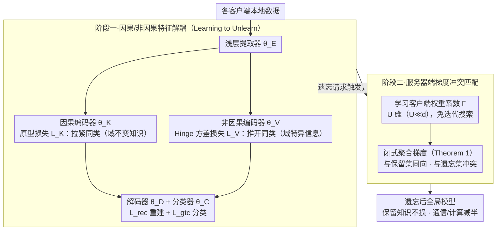

# Computation and Communication Efficient Federated Unlearning via On-server Gradient Conflict Mitigation and Expression

**会议**: CVPR 2026  
**arXiv**: [2603.13795](https://arxiv.org/abs/2603.13795)  
**代码**: 论文声明可复现但未提供公开链接  
**领域**: AI安全  
**关键词**: Federated Unlearning, Gradient Conflict, Causal Disentanglement, On-server Aggregation, Privacy

## 一句话总结

提出 FOUL 框架，通过"学习阶段解耦因果/非因果特征 + 遗忘阶段服务器端梯度冲突匹配"两阶段策略，在不访问客户端数据的前提下实现高效且低通信开销的联邦遗忘。

## 研究背景与动机

**隐私法规驱动**：GDPR 等数据保护法要求用户有"被遗忘权"，联邦学习（FL）模型必须能移除特定客户端的数据贡献。

**重训开销巨大**：从头重训（Retrain）虽然是 FUL 的金标准，但计算和通信成本极高，对大规模真实场景不可行。

**近似遗忘方法的困境**：现有近似方法多依赖本地同时持有保留数据和遗忘数据（$\mathcal{L}_{\text{unlearn}}=\mathcal{L}_{\text{retain}}-\mathcal{L}_{\text{forget}}$），在 client-wise 遗忘场景中，遗忘客户端无法获得保留数据，公式不成立。

**子网络识别的重复开销**：已有方法通过梯度冲突识别需遗忘的子网络，但模型每轮变化后需重复识别，额外计算开销大。

**因果结构启发**：因果不变表示（causal factors）跨域不变，非因果表示（non-causal factors）携带域特异信息——遗忘应只作用于非因果部分，避免误伤通用知识。

**服务器端聚合缺失**：已有 FUL 方法无法在服务器端同时利用保留和遗忘客户端的梯度信息来执行高效遗忘。

## 方法详解

### 整体框架

FOUL 分为两个阶段：

- **阶段一 Learning to Unlearn (L2U)**：在联邦训练阶段将特征提取器解耦为因果子网络 $\theta_K$（提取域不变特征）和非因果子网络 $\theta_V$（提取域特异特征），为未来遗忘做准备。
- **阶段二 On-server Gradient Matching**：遗忘触发后，仅更新非因果子网络 $\theta_V$，在服务器端通过梯度匹配聚合——使聚合梯度与保留客户端梯度方向一致、与遗忘客户端梯度方向冲突。

### 关键设计

**1. 因果/非因果特征解耦：把"该忘的"和"该留的"在训练时就拆到两个子网络里**

client-wise 遗忘的根本麻烦在于，遗忘客户端手里没有保留数据，传统 $\mathcal{L}_{\text{retain}}-\mathcal{L}_{\text{forget}}$ 的相减公式直接失效；而已有方法靠动态识别需遗忘的子网络，模型每轮一变就要重识别一次，开销摊不掉。FOUL 的破题点是借因果结构模型（Definition 5）：因果因子 $\mathcal{Z}_K$ 跨域不变、承载通用知识，非因果因子 $\mathcal{Z}_V$ 携带域特异信息，二者独立且充分——这意味着遗忘只需干预 $\mathcal{Z}_V$，碰都不用碰 $\mathcal{Z}_K$，保留集知识自然不受伤。

落到网络上，每个客户端的本地模型被参数化为 $\theta_u = \{\theta_E, \theta_K, \theta_V, \theta_D, \theta_C\}$（浅层提取器、因果编码器、非因果编码器、解码器、分类器），靠四项损失联合训练把这条因果假设"焊"进结构：因果编码器用原型网络损失 $\mathcal{L}_K$ 把同类样本的表示拉紧（逼出域不变性），非因果编码器用 hinge 方差损失 $\mathcal{L}_V$ 把同类样本的表示推开（专门吸收域特异差异），分类损失 $\mathcal{L}_{\text{gtc}}$ 保证因果表示足以预测标签，重建损失 $\mathcal{L}_{\text{rec}}$ 保证两类表示合起来能还原原始数据。这一步就是论文标题里的 "Learning to Unlearn"——训练时多花一点力气预埋解耦结构，把未来遗忘的成本提前摊销掉，从而绕开重识别子网络的重复开销。

**2. 服务器端梯度冲突匹配：用一把系数权重，在服务器端"凑"出既保留又遗忘的聚合梯度**

遗忘真正触发时，理想的更新方向应当同时满足两个相反诉求：跟保留客户端的梯度方向一致（继续学好东西），跟遗忘客户端的梯度方向冲突（把目标数据的贡献顶掉）。但直接在全模型 $d$ 维参数空间里搜这样一个梯度，维度过高、又没有数据引导，泛化很差。FOUL 把这个高维搜索"降维打击"：引入一组可学习权重系数 $\Gamma = \{\gamma_u^{(r)}\}$，把问题转化为只优化 $U$ 个客户端系数（$U \ll d$），并由 Theorem 1 给出闭式解，省去迭代搜索：

$$\nabla_\text{FOUL}^{(r)} = \nabla_\text{FL}^{(r)} + \frac{\kappa \|\nabla_\text{FL}^{(r)}\|}{\|\nabla_{\Gamma_\mathcal{R}}^{(r)} - \nabla_{\Gamma_\mathcal{F}}^{(r)}\|}\left(\nabla_{\Gamma_\mathcal{R}}^{(r)} - \nabla_{\Gamma_\mathcal{F}}^{(r)}\right)$$

其中 $\nabla_{\Gamma_\mathcal{R}}$、$\nabla_{\Gamma_\mathcal{F}}$ 分别是保留集与遗忘集方向上的系数加权梯度，二者之差正好编码了"保留减遗忘"的净方向。这一整套优化全在服务器端完成，靠的是各客户端早已上传的梯度系数，不需要回头去访问任何客户端的本地数据——既把搜索空间压到极小、改善泛化，又在结构上守住了隐私底线。

**3. 非因果子网络的 Hinge 方差损失：用带门限的方差约束，避免"推开表示"这件事在训练里失控**

第 1 点要让非因果编码器最大化同类样本的表示方差来吸收域特异信息，但如果直接最大化 MSE 式方差，会两头出问题：训练初期方差本就低、这一项的梯度被其他高损失任务盖过，根本学不动；训练后期方差又可能涨过头，反过来挤压分类、重建等目标。FOUL 用 hinge 框架给方差套一个区间：

$$\mathcal{L}_V = \frac{1}{C}\sum_{c=1}^{C}\max\left(0,\ 1-\sqrt{\text{Var}(\mathcal{Z}_V^c)+\epsilon}\right)$$

初始阶段损失从一个较高值起步，保证这个目标在多任务竞争里不被忽略；一旦类内方差达标，$\max(0,\cdot)$ 的下界归零，损失不再继续逼着方差往上窜，从而不会偏向 $\mathcal{L}_V$ 而牺牲其他目标。本质上它把"最大化方差"这个容易跑偏的目标改写成"方差够用就停"，换来了多任务训练的稳定。

## 损失函数与训练策略

L2U 阶段总损失（每个客户端）：

$$\mathcal{L}_{\text{L2U}}(\theta_u) = \alpha_V \mathcal{L}_V + \alpha_K \mathcal{L}_K + \alpha_{\text{gtc}} \mathcal{L}_{\text{gtc}} + \mathcal{L}_{\text{rec}}$$

- $\mathcal{L}_K$：原型网络对比损失（Eq.4），拉近同类因果表示
- $\mathcal{L}_V$：hinge 方差损失（Eq.5），推开同类非因果表示
- $\mathcal{L}_{\text{gtc}}$：交叉熵分类损失（Eq.7），因果表示→标签
- $\mathcal{L}_{\text{rec}}$：MSE 重建 + KL 散度（Eq.8），因果+非因果→重建原始数据

遗忘阶段仅更新非因果子网络 $\theta_V$，因果子网络冻结，通过 Theorem 1 的闭式梯度聚合执行服务器端遗忘。

## 实验关键数据

| 方法 | FA ↓ | RA ↑ | TA ↑ | MIA ↓ | 通信 (MB) | 计算 (FLOPs) |
|------|------|------|------|-------|-----------|-------------|
| Retrain | 70.51 | 82.84 | 77.45 | 50.02 | 42.73 | 5.81e16 |
| FATS | 74.45 | 80.91 | 75.98 | 55.72 | 42.73 | 5.81e16 |
| NoT | 73.24 | 79.25 | 75.28 | 59.13 | 34.72 | 3.38e16 |
| FUSED | 75.94 | 79.34 | 76.86 | 58.72 | 0.98 | 2.81e16 |
| **FOUL (L2U)** | **69.53** | **93.11** | **77.14** | 53.82 | **16.02** | **2.35e16** |
| **FOUL (L2U+遗忘)** | 70.97 | 92.33 | 76.43 | **51.93** | 16.02 | 2.35e16 |

> PACS 数据集，ResNet-18 backbone，20 客户端 IID 设置

| 方法 | FA ↓ | RA ↑ | TA ↑ | MIA ↓ |
|------|------|------|------|-------|
| Retrain | 30.64 | 42.41 | 38.94 | 50.71 |
| FATS | 33.07 | 40.96 | 37.34 | 60.81 |
| **FOUL (L2U)** | **27.97** | **43.81** | 38.16 | **56.40** |
| **FOUL (L2U+遗忘)** | 29.92 | 42.13 | **39.16** | 57.11 |

> TerraIncognita 数据集，ResNet-50 backbone

**Time-to-Forget (T2F)**：FOUL 在 <50 轮达到最优 FA，T2F > 0.32/轮；对比 Retrain 需 75 轮，T2F 仅 0.13/轮——遗忘速度提升约 2.5 倍。

## 亮点与洞察

- **因果解耦思路精巧**：将域泛化中的因果不变性原理引入联邦遗忘，理论上证明遗忘只需作用于非因果子网络，避免动态子网络识别的重复开销。
- **服务器端零数据遗忘**：整个遗忘阶段在服务器端通过梯度系数优化完成，无需访问任何客户端的本地数据，真正保护隐私。
- **维度坍缩优化**：将 $d$ 维梯度优化降维为 $U$ 个系数优化（$U \ll d$），大幅降低服务器端计算复杂度并改善泛化。
- **RA 反超 Retrain**：FOUL 在 PACS 上 RA 达 93.11（Retrain 仅 82.84），说明解耦后的因果子网络保留了更纯粹的通用知识。
- **通信减半**：仅传输非因果子网络参数，通信开销从 42.73 MB 降至 16.02 MB。
- **提出 T2F 指标**：度量遗忘速度，填补了 FUL 评估体系中效率维度的空白。

## 局限性

- 仅在域泛化数据集（PACS/VLCS/OfficeHome/TerraIncognita）上验证，未在真实 FL 场景（如医疗、移动设备）中测试。
- backbone 限于 ResNet-18/50，缺乏对 ViT 等现代架构的验证。
- 因果/非因果解耦的质量依赖超参 $\alpha_V, \alpha_K, \alpha_{\text{gtc}}$ 的调节，论文未给出鲁棒性分析的充分讨论。
- 遗忘阶段假设所有客户端参与，未讨论部分客户端掉线或异步场景。
- IID 设置下的实验较多，Non-IID 场景下的表现有待深入探索。

## 相关工作与启发

- **联邦遗忘基线**：FedRecovery、FFMU、FUSED、MoDE 等从不同角度近似遗忘，但均无法同时解决通信/计算/隐私三角困境。
- **因果表示学习**：因果结构模型（causal structured model）为 disentanglement 提供理论基础，可迁移至其他需要"选择性遗忘"的场景（如 continual learning、domain adaptation）。
- **梯度冲突与多任务学习**：梯度方向匹配/冲突的思路源自 MTL 和域泛化（如 PCGrad、Fish），但本文首次将其用于联邦遗忘的"正向保留 + 反向遗忘"双目标。
- **启发**：这种"训练时预埋解耦结构以降低未来遗忘成本"的 proactive 思路，值得在 LLM fine-tuning 的 RLHF unlearning 中探索。

## 评分

| 维度 | 评分 |
|------|------|
| 新颖性 | ⭐⭐⭐⭐ |
| 技术深度 | ⭐⭐⭐⭐ |
| 实验充分度 | ⭐⭐⭐ |
| 实用性 | ⭐⭐⭐⭐ |

<!-- RELATED:START -->

## 相关论文

- [\[NeurIPS 2025\] Efficient Fairness-Performance Pareto Front Computation](../../NeurIPS2025/ai_safety/efficient_fairness-performance_pareto_front_computation.md)
- [\[AAAI 2026\] SecMoE: Communication-Efficient Secure MoE Inference via Select-Then-Compute](../../AAAI2026/ai_safety/secmoe_communication-efficient_secure_moe_inference_via_select-then-compute.md)
- [\[CVPR 2026\] SubFLOT: Submodel Extraction for Efficient and Personalized Federated Learning via Optimal Transport](subflot_submodel_extraction_for_efficient_and_personalized_federated_learning_vi.md)
- [\[NeurIPS 2025\] Efficient Verified Machine Unlearning for Distillation](../../NeurIPS2025/ai_safety/efficient_verified_machine_unlearning_for_distillation.md)
- [\[ICML 2026\] FedHPro: Federated Hyper-Prototype Learning via Gradient Matching](../../ICML2026/ai_safety/fedhpro_federated_hyper-prototype_learning_via_gradient_matching.md)

<!-- RELATED:END -->
