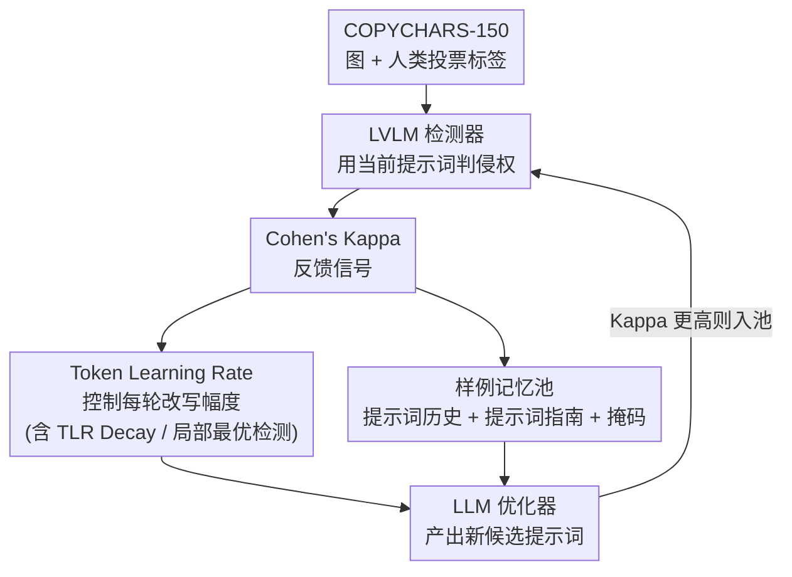

# COPYLENS: Towards Copyrighted Characters Infringement Detection via Copyright-Aware Prompt Learning

**会议**: CVPR 2026  
**论文**: [CVF Open Access](https://openaccess.thecvf.com/content/CVPR2026/html/Jin_COPYLENS_Towards_Copyrighted_Characters_Infringement_Detection_via_Copyright-Aware_Prompt_Learning_CVPR_2026_paper.html)  
**代码**: https://github.com/yaoyujin-qm/copylens  
**领域**: AI安全 / 版权检测  
**关键词**: 版权角色检测, 提示词优化, 视觉语言模型, 闭环反馈, AIGC治理

## 一句话总结
针对"文生图模型会无意复刻迪士尼等版权角色"这一治理难题，COPYLENS 把一个 LVLM 当检测器、一个 LLM 当提示词优化器，用 Cohen's Kappa（与人类标注一致性）作为反馈信号，闭环地把检测提示词自动改写到"最像人类判断"，在新建的 COPYCHARS 数据集上比现有方法的对齐度提升 5%–10%。

## 研究背景与动机
**领域现状**：Stable Diffusion 这类文生图模型只要给"红发、公主、美人鱼"几个关键词，就能生成几乎与官方版"小美人鱼 Ariel"无异的图，引发严重的知识产权侵权担忧。要在海量合成图里自动判定"这张图是否侵犯了某个版权角色"，是版权治理的刚需。

**现有痛点**：早期方法靠像素/嵌入空间的**相似度匹配**——必须为每张合成图配一张版权参考图才能比对，既不可扩展，又抓不住"风格神似但像素不同"的模仿。近期转向用大模型：CopyCat 第一个用 LVLM + **人工写死的固定提示词**来自动判侵权，但作者发现它在更大规模数据上与人类判断的一致性远低于原文宣称值，而且手写提示词对措辞极其敏感——同一张图换个提示词就能得到相反结论（论文 Fig.1）。

**核心矛盾**：能不能找到一个"放之四海皆准"的最优提示词，在不同角色、不同图、不同检测器上都稳定可靠？直接套用现成的 LLM 提示词优化器（IPO、LLM-OPT）也不行：版权检测是高度任务特定的场景，①监督信号稀疏且延迟（没有标准数据集和显式标签，难以给提示词质量打分），②没有显式策略引导优化轨迹，优化器在巨大且离散的提示词空间里乱探索，实测 Kappa 只有 0.25–0.27。

**本文目标**：构造带可靠人工标注的数据集来提供监督信号；设计一个专门面向版权角色检测的提示词优化框架，让检测器输出更贴近人类共识。

**核心 idea**：把提示词优化拆成"怎么教（指令优化）"和"怎么示范（样例优化）"两条线，用一个可控的 **Token Learning Rate (TLR)** 让 LLM 像梯度下降一样"先大改探索、后小改精修"，再用短期+长期记忆池让优化器从历史好提示词里学，整体闭环地把提示词逼向人类判断。

## 方法详解

### 整体框架
COPYLENS 是一个闭环优化框架：**LLM 优化器**（Qwen2.5-14B）和 **LVLM 检测器**（Qwen2-VL-7B）协同。每一轮迭代里，优化器在一个精心设计的**元提示词（meta-prompt）**条件下产出一个候选检测提示词 $p$；检测器拿这个提示词去判 COPYCHARS-150 训练集里每张图侵不侵权，得到二元预测 $\hat{y}(p)\in\{0,1\}$；把预测和人类多数投票标签比对，算出 Cohen's Kappa 作为唯一的标量反馈信号；这个分数连同新提示词一起喂回元提示词，构成闭环，逐步把提示词质量推高。

形式化地，给定数据集 $D=\{(I_i,y_i)\}_{i=1}^N$，优化目标是找一个让检测结果与人类标注最一致的提示词：

$$p^* = \arg\max_{p\sim M_{\text{OPT}}} \; \mathbb{E}_{(I,y)\in D}\big[F(M_{\text{DET}}(I;p),\, y)\big]$$

其中 $M_{\text{OPT}}$ 是 LLM 隐式优化器（按 $p_{t+1}=\text{LLM}(p_t, F(p_t), h)$ 迭代，$h$ 是提示词历史），$M_{\text{DET}}$ 是 LVLM 检测器，$F$ 用 Kappa 衡量预测与人标的一致度。整个框架沿两条互补主线推进——**How to Teach（指令优化 IO）**管"怎么把任务意图教给优化器"，**How to Show（样例优化 EO）**管"用哪些历史好提示词来示范"。

### 关键设计

**1. Token Learning Rate（TLR）：用"逐 token 改写预算"把语言空间里的优化变成可控的梯度下降**

纯靠文字指令让 LLM 改提示词时，离散又巨大的提示词空间会诱导它"大刀阔斧乱改"，要么破坏掉原本有效的结构，要么过早收敛到次优解，优化轨迹既不稳又难解释。TLR 是一个**纯提示词层面的控制机制**：它不动模型参数，而是在元提示词里嵌入一条硬指令——"你只能在 token 级别更新提示词，增/删/改的 token 总数限制在 $R_t$ 个之内，对历史里 Kappa 最高的那条提示词只改 $R_t$ 个 token、其余保持不变，直接输出新提示词、别带多余文字"。通过调 $R_t$ 就能控制改写范围：$R_t$ 大 → 允许大范围重写、广探索；$R_t$ 小 → 强制在当前最优提示词附近做精细打磨。这等于给"LLM 在文字空间里搜索"装了一个可调的步长旋钮。

**2. TLR Decay + 局部最优检测：让步长先大后小、卡住时反弹，逼出梯度下降式的收敛动力学**

光有 TLR 还不够，得让它随优化进程自动调度。**TLR Decay** 用一个分阶段调度让 $R_t$ 随迭代逐渐减小（论文 Alg.1 第 5 行），阈值靠经验设定，在"搜索多样性"和"收敛稳定性"之间取折中——这让 LLM 在语言空间里模仿梯度下降的学习动力学：早期大步探索、后期小步精修，既稳又可解释。但单纯衰减会有掉进局部最优的风险，于是配一个**局部最优检测（Local Optimum Detection）**：当最近几轮里检测到**重复出现的提示词**（说明卡住了），就临时把 TLR 调大（Alg.1 第 6–8 行），鼓励 LLM 跳出局部最优、换个搜索方向探索。这一降一升构成了"模拟退火式"的步长控制，是消融里贡献最大的两块（见下）。

**3. 短期+长期记忆的样例池（Prompt History + Prompt Guidance + 掩码）：让优化器从历史好提示词里学，而不只是看一个标量分**

标量 Kappa 反馈太粗，优化器学不到"好提示词到底好在哪些措辞"。EO 用三件套补这个洞。**Prompt History（短期记忆）**维护一个 top-$k$（$k=4$）的提示词缓冲：每轮新提示词若 Kappa 超过缓冲里最低分的那条就替换它，这种 top-$k$ 精英机制保证优化器永远在"目前发现的最好样例"上精修，防止随机漂移丢掉高质量提示词；历史会被显式塞进元提示词，让 LLM 能"回看过去的成功"再生成新候选，把提示词进化变成记忆感知的过程。**Prompt Guidance（长期记忆）**则把多次运行里积累的高分样例交给 GPT-4o 蒸馏，识别它们反复出现的语言结构和语义线索（如"高 Kappa 的提示词往往清晰、结构化、聚焦判断"），提炼成简短的启发式原则，作为跨 run 的元级先验，即便在优化早期也能把优化器引向有希望的搜索区域；而且它只复用已生成的样例、几乎零额外算力。**Masking Mechanism（掩码）**负责把优化器输出里的解释性/冗余文字过滤掉，只保留核心检测提示词送给检测器打分，确保性能提升来自提示词判别内容本身、而非额外上下文的"作弊"。

### 一个完整示例
以图 Fig.4 的一轮为例：基线提示词 "Do you detect any copyrighted character in this image? ..." 在 COPYCHARS-150 上跑出 $\kappa_0=0.5337$。优化器读到元提示词里的系统指令（"你是 IP 版权保护专家"）、任务指令、提示词历史（Prompt 0/2/3 各自带 Kappa）和 TLR 指令（"本轮 $R=80$ 个 token"），改写出新提示词 "Does the image contain a copyrighted character? Respond: 'character: , score: 0.' if none. If a character is found, respond ..."。检测器重新评估得到 $\kappa'$；只要 $\kappa' > \min(\kappa_0,\kappa_1,\kappa_2,\kappa_3)$，新提示词就挤进 top-4 历史池，元提示词随之更新，进入下一轮。整条轨迹通常前 3–5 轮急速上升、约 15 轮收敛。

## 实验关键数据

实验用 Qwen2.5-14B-Instruct 当优化器、Qwen2-VL-7B-Instruct 当检测器，在 COPYCHARS-150 上优化 15 步，提示词用 CopyCat 基线初始化，单张 A800 (80GB)。评估指标含 Kappa、ACC、FPR、TNR、TPR、Precision、F1、TPR@1%FPR，均报 >5 轮均值。

### 主实验
跨 PixArt / SDXL / PLG 三个文生图模型的平均检测性能：

| 方法 | Kappa↑ | ACC↑ | FPR↓ | F1↑ | TPR@1%FPR↑ |
|------|--------|------|------|-----|-----------|
| Baseline (CopyCat) | 0.58 | 0.86 | 0.13 | 0.84 | 0.75 |
| Fine-tune | 0.54 | 0.83 | 0.21 | 0.81 | 0.55 |
| Beam Search | 0.50 | 0.79 | 0.19 | 0.76 | 0.63 |
| OPRO | 0.25 | 0.61 | 0.33 | 0.55 | 0.25 |
| APE | 0.19 | 0.57 | 0.42 | 0.46 | 0.18 |
| IPO | 0.25 | 0.65 | 0.39 | 0.61 | 0.35 |
| LLM-OPT | 0.27 | 0.59 | 0.36 | 0.52 | 0.28 |
| **COPYLENS (Ours)** | **0.62** | **0.88** | **0.09** | **0.86** | **0.78** |

通用 LLM 提示词优化器（OPRO/APE/IPO/LLM-OPT）在这个任务上全面崩盘（Kappa 仅 0.19–0.27），印证了"版权检测是高度任务特定、需要专门策略"的判断；COPYLENS 不仅超过这些优化器，也超过手写基线和微调。

### 消融实验
逐组件累加（I：系统+任务指令+提示词历史；R：TLR；G：提示词指南；M：掩码；D：TLR Decay；LOD：局部最优检测）：

| 配置 | Kappa↑ | ACC↑ | FPR↓ | F1↑ | 说明 |
|------|--------|------|------|-----|------|
| I | 0.27 | 0.56 | 0.44 | 0.51 | 仅指令+历史，几乎等于乱猜 |
| I+R | 0.39 | 0.68 | 0.21 | 0.57 | 加 TLR，+0.12 |
| I+R+G | 0.41 | 0.77 | 0.15 | 0.70 | 加提示词指南 |
| I+R+G+M | 0.53 | 0.82 | 0.11 | 0.77 | 加掩码，+0.12 |
| w/ D | 0.58 | 0.85 | 0.12 | 0.78 | 再加 TLR Decay |
| w/ D+LOD | **0.62** | **0.88** | **0.09** | **0.86** | 完整模型 |

跨检测器迁移与重优化（Kappa，%）：基线提示词 BP、从 Qwen 检测器零样本迁移 Transfer、换检测器后重优化 RO：

| 检测器 | BP | Transfer | RO |
|--------|------|------|------|
| Qwen2-VL-7B | 58.4 | N/A | 62.8 |
| LLaVA-1.5-7B | 45.3 | 49.7 | 53.0 |
| InternVL2.5-8B | 51.4 | 54.9 | 58.8 |
| GPT-4o-mini-vision | 53.3 | 57.2 | 61.4 |

### 关键发现
- **TLR 与掩码是两块最大贡献**：I→I+R 提升 +0.12 Kappa，I+R+G→I+R+G+M 又提升 +0.12，说明"控制改写幅度"和"过滤冗余文字"各自解决了通用优化器的一个致命伤；TLR Decay + 局部最优检测再补 +0.09 把 Kappa 推到 0.62。
- **收敛快且稳**：优化轨迹前 3–5 轮急速上升、约 15 轮（≈40 分钟）收敛，8 次重复 run 的标准差随迭代收窄，说明对初始化鲁棒；换一个新检测器也能在 ~40 分钟内快速重优化。
- **泛化到未见 IP 更强**：在 COPYCHARS-UNSEEN（50 个训练里没出现的 IP）上，COPYLENS 拿到 63.3% Kappa，反而比 TEST 上的 62.8% 还略高，而基线/Beam Search/微调在未见 IP 上都明显掉点（基线 55.9%、BS 仅 42.9%）——说明它学到的是"怎么判侵权"的通用语言模式，而非记住特定角色。

## 亮点与洞察
- **把"提示词优化"做成了带步长调度的梯度下降隐喻**：TLR 用一句自然语言指令（"只改 $R_t$ 个 token"）就把离散提示词空间的搜索步长变得可控，Decay 模拟学习率衰减、局部最优检测模拟退火反弹——整套机制不动任何参数、纯靠 meta-prompt 实现，迁移成本极低。
- **Kappa-as-reward 的巧思**：在没有显式标签的版权判定里，用"与人类多数投票的一致性（Cohen's Kappa）"当反馈信号，把主观的法律/伦理判断转成可优化的标量，这个把"人类共识"显式塞进闭环的思路可迁移到其他缺乏客观 ground-truth 的主观检测任务（如有害内容、风格抄袭判定）。
- **掩码机制揭示了一个反直觉的坑**：LLM 优化器输出里夹带的解释性文字会"污染"评估、让性能提升变成假象；只保留核心提示词送评估，是保证"改进真来自判别内容"的关键工程细节。

## 局限与展望
- **依赖人类标注质量**：整套优化以五位标注者多数投票为 ground-truth，标注者两两 Kappa 在 0.57–0.84 之间——版权侵权判定本身主观，"人类共识"未必等于法律意义上的侵权，框架优化的是"对齐人类标注"而非"对齐法律裁决"。⚠️ 这一点决定了它是辅助工具而非判定依据。
- **绝对性能仍有限**：最优 Kappa 0.62（test 0.65）只是"中等偏上一致性"，离可直接落地判侵权的可靠度还有距离；FPR 0.09 意味着仍有近一成非侵权图被误报。
- **TLR 调度阈值靠经验设定**：Decay 的分阶段阈值是经验调出来的（论文承认），缺乏自适应机制，换任务/换模型可能要重调。
- **可改进方向**：把人类标注的不确定性（标注者分歧）显式建模进反馈信号，而非简单多数投票；或让 TLR 调度自适应于 Kappa 曲线的斜率而非预设阈值。

## 相关工作与启发
- **vs CopyCat（基线）**：CopyCat 第一个用 LVLM + 固定手写提示词自动判侵权，但提示词对措辞敏感、在大规模数据上与人类对齐度低；COPYLENS 把固定提示词换成自动闭环优化的提示词，Kappa 从 0.58 提到 0.62，并能跨检测器快速重优化。
- **vs CopyJudge**：CopyJudge 用多智能体辩论评估生成图与版权图的实质相似度，算力开销大；COPYLENS 只用"一优化器 + 一检测器"的轻量闭环，~40 分钟即可为新检测器重优化，效率显著更高。
- **vs 通用 LLM 提示词优化器（OPRO/APE/IPO/LLM-OPT）**：它们为有丰富细粒度监督和客观指标的任务设计，搬到版权检测上 Kappa 仅 0.19–0.27；COPYLENS 用 TLR 控制搜索步长 + 样例记忆池补足稀疏监督，证明任务特定的优化策略不可或缺。
- **vs 像素/嵌入相似度匹配方法**：传统方法需为每张合成图配版权参考图、抓不住风格模仿；COPYLENS 走"VLM 语义判别 + 提示词优化"路线，无需配对参考图，天然可扩展到未见 IP。

## 评分
- 新颖性: ⭐⭐⭐⭐ 把提示词优化做成可控步长的梯度下降隐喻 + Kappa-as-reward 闭环，在版权检测这个具体场景里组合得很巧。
- 实验充分度: ⭐⭐⭐⭐ 自建 7050 图数据集、对比 7 个基线、逐组件消融、跨 T2I/跨检测器/未见 IP 三种泛化都覆盖。
- 写作质量: ⭐⭐⭐⭐ 动机（提示词敏感性 + 通用优化器失效）讲得清楚，IO/EO 两条线组织合理。
- 价值: ⭐⭐⭐⭐ AIGC 版权治理是真实刚需，提供了可扩展、可快速迁移的自动化方案，但绝对可靠度仍是落地瓶颈。

<!-- RELATED:START -->

## 相关论文

- [\[CVPR 2026\] FedDAP: Domain-Aware Prototype Learning for Federated Learning under Domain Shift](feddap_domain-aware_prototype_learning_for_federated_learning_under_domain_shift.md)
- [\[CVPR 2026\] Scaling Up AI-Generated Image Detection with Generator-Aware Prototypes](scaling_up_ai-generated_image_detection_with_generator-aware_prototypes.md)
- [\[ECCV 2024\] Noise-Assisted Prompt Learning for Image Forgery Detection and Localization](../../ECCV2024/ai_safety/noise-assisted_prompt_learning_for_image_forgery_detection_and_localization.md)
- [\[CVPR 2026\] PROMPTMINER: Black-Box Prompt Stealing against Text-to-Image Generative Models via Reinforcement Learning and VLM-Guided Optimization](promptminer_black-box_prompt_stealing_against_text-to-image_generative_models_vi.md)
- [\[CVPR 2026\] DFD-HR: Generalizable Deepfake Detection via Hierarchical Routing Learning](dfd-hr_generalizable_deepfake_detection_via_hierarchical_routing_learning.md)

<!-- RELATED:END -->
