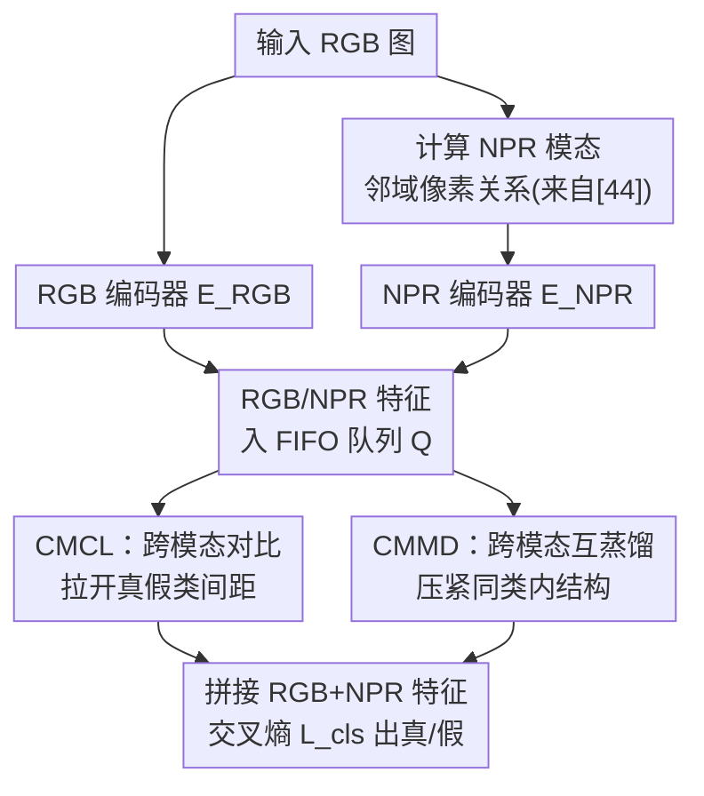

# Cross-modal Representation Learning for Diffusion-generated Image Detection

**会议**: CVPR 2026  
**论文**: [CVF Open Access](https://openaccess.thecvf.com/content/CVPR2026/html/Gong_Cross-modal_Representation_Learning_for_Diffusion-generated_Image_Detection_CVPR_2026_paper.html)  
**代码**: 未公开  
**领域**: AI安全 / 生成图像检测  
**关键词**: 扩散生成图像检测, 跨模态表示学习, 对比学习, 互蒸馏, NPR  

## 一句话总结
用 RGB 与 NPR（邻域像素关系）两种模态做表示学习——跨模态对比学习（CMCL）拉开真假类间距、跨模态互蒸馏（CMMD）压紧类内结构——共同学一个「面向伪造检测」的嵌入空间，在 GenImage / DRCT-2M / Co-Spy-Bench 三个基准上刷到 SOTA。

## 研究背景与动机
**领域现状**：检测扩散模型生成的假图，主流做法是把 RGB 图喂给 ResNet 或 CLIP visual encoder 提特征，再接分类头。近年为了提升对「训练时没见过的生成器」的泛化能力，要么改检测算法（DIRE、PatchCraft 等），要么借大预训练模型（UnivFD、FatFormer、Co-Spy 等）。

**现有痛点**：ResNet、CLIP 这类 backbone 本质是为「高层语义」设计的，并不是天生为伪造检测优化的——它们提的是「这是一只猫」这种语义，而非「这张图有上采样留下的伪造痕迹」。CoDE 第一次尝试用对比学习专门给检测任务学一个嵌入空间，验证了「forgery-aware embedding」这条路有效，但它只拿 RGB 做常规对比学习，把同一图的两个增强当正样本，没有引入任何与伪造痕迹直接相关的信号。

**核心矛盾**：要学一个真正「面向伪造」的嵌入空间，光靠 RGB 自身的增强不够——RGB 缺少对生成器流水线「源不变（source-invariant）伪造痕迹」的刻画。已有工作 NPR 证明：上采样算子会在局部像素间留下可泛化的伪造痕迹，比 RGB 更能抓内在线索。那么问题就变成：能不能把 NPR 这种「伪造敏感」的模态拉进来，和 RGB 一起做表示学习？

**本文目标**：（1）让真/假两类在嵌入空间里**类间**更可分；（2）让同类（真类或假类）内部**类内**更紧致；（3）让 RGB 和 NPR 两条模态互相补全各自学到的知识。

**切入角度**：把 NPR 当成 RGB 的「跨模态搭档」——同一张真图的 RGB 特征与它自己的 NPR 特征天然应该比「该真图 RGB 特征 vs 其它假图 NPR 特征」更近。这条直觉天然给出了正负样本对的定义，不需要人工增强。

**核心 idea**：用「RGB×NPR 跨模态」替代「RGB×RGB 增强」来做表示学习，并拆成两件互补的事——跨模态对比（管类间分离）+ 跨模态互蒸馏（管类内紧致），协同学出 forgery-aware 嵌入空间。

## 方法详解

### 整体框架
模型叫 **SDID（Strong Diffusion-generated Image Detector）**。输入一张图，先由其 RGB 模态算出 NPR 模态；RGB 和 NPR 分别过各自的编码器 $E_{RGB}$、$E_{NPR}$ 得到特征 $F^{RGB}$、$F^{NPR}$。训练时每种「模态×类别」组合各维护一个先进先出队列 $Q$（当前 batch 入队、最旧 batch 出队），用来当对比学习的负样本库和互蒸馏的锚点库。

两类表示学习损失在这套双编码器+队列的脚手架上同时跑：**CMCL** 用跨模态正负对把真假两类推开（类间），**CMMD** 用同类内部的「邻域相似度分布」做双向 KL 蒸馏把两模态知识对齐（类内）。最后把经过这两种损失增强后的 $F^{RGB}$ 与 $F^{NPR}$ 拼接，过交叉熵 $L_{cls}$ 预测真/假。推理时只保留两个编码器，拼接特征出预测。整个架构对真/假是对称的（论文为方便只用真图举例，假图同理）。

### 关键设计

**1. 以 NPR 作为跨模态搭档：用「伪造敏感模态」替代「RGB 自增强」**

CoDE 那套 RGB×RGB 增强对比学习的问题在于：两个增强视图共享同一份高层语义，对比学到的多半还是语义结构，对伪造痕迹无感。本文换思路——把 NPR 拉进来当第二模态。NPR 来自 [44]（本文明确**不**把 NPR 本身算作自己的贡献），做法是把 RGB 图切成 $l\times l$（$l=2$）的不重叠 patch，每个像素逐通道减去该 patch 左上角像素值，得到的残差图就刻画了上采样算子在局部留下的伪造痕迹，对不同生成器有源不变的泛化性。

把 NPR 当 RGB 的跨模态搭档，好处是正负样本对天然成立：同一张真图的 RGB 与 NPR 特征该比「该真图 vs 其它假图」更近，无需人工设计增强。消融（Table 5）直接验证了这个选择——把第二模态换成「RGB 随机增强」，CMCL 就退化成常规对比学习、CMMD 因只有单模态几乎失效（93.2%）；换成高频分量好一些（95.5%）；只有用 NPR 才能到 98.4%。

**2. CMCL（跨模态对比学习）：管「真假类间分离」**

CMCL 解决的是「类间可分性」。以真图的 RGB 特征 $F^{RGB}_{real}$ 为例：它和同图的 NPR 特征 $F^{NPR}_{real}$ 构成正对，它和假图队列 $Q^{NPR}_{fake}$ 里的 NPR 特征构成负对，用 InfoNCE 优化：

$$L_{CMCL}(F^{RGB}_{real}; F^{NPR}_{real}; Q^{NPR}_{fake}) = -\log \frac{\exp(F^{RGB}_{real}\cdot F^{NPR}_{real}/\tau)}{\exp(F^{RGB}_{real}\cdot F^{NPR}_{real}/\tau) + \sum_{q_i\in Q^{NPR}_{fake}}\exp(F^{RGB}_{real}\cdot q_i/\tau)}$$

其中温度 $\tau=0.07$，负样本来自一个长度 $N_Q=2048$ 的 FIFO 队列（受显存限制，用 MoCo 式队列而非大 batch 提供足够负样本）。完整 CMCL 损失对「RGB/NPR × 真/假」四种组合对称求和：真图 RGB 拉远假图 NPR、真图 NPR 拉远假图 RGB、假图两路同理。这样既增强 RGB 特征也增强 NPR 特征在真假之间的判别力。

**3. CMMD（跨模态互蒸馏）：管「同类类内紧致」**

CMCL 只盯类间，没建模「同一类（如真类）内部」的结构，每个模态各自学到的知识没被充分挖掘和交流。CMMD 补这一块，且**只在同类内部**蒸馏（真图之间、假图之间，绝不跨真假）。

先把每个模态的「知识」表示成**邻域相似度分布**：给定嵌入 $z$，从同模态队列里取它的 Top-$K$（$K=128$）最近邻当锚点 $\{a_i\}$，算余弦相似度并 softmax 成概率分布，刻画 $z$ 在该模态特征空间里的局部邻域结构：

$$p_i(z, a_i) = \frac{\exp(\cos(z, a_i)/\tau)}{\sum_{j=1}^{K}\exp(\cos(z, a_j)/\tau)}$$

锚点直接从对比学习已有的队列里取，不需要额外前向推理，几乎零额外开销。然后在 RGB↔NPR 两个分布间做**双向** KL 蒸馏（真图 RGB→NPR 方向为例）：

$$L_{CMMD} = KL\big(p(F^{RGB}_{real}, Q^{RGB}_{real}) \,\|\, p(F^{NPR}_{real}, Q^{NPR}_{real})\big)$$

关键区别于传统蒸馏：这里没有「固定的、训练好的教师」，知识随训练持续更新，每个模态**同时是学生也是老师**，互相把对类内结构的理解传给对方，从而把同类特征学得更紧致。完整 CMMD 同样对四种「模态方向 × 真/假」组合对称求和。

### 损失函数 / 训练策略
拼接 $F^{RGB}$、$F^{NPR}$ 出预测，分类用交叉熵 $L_{cls}$。总损失把三者加权：

$$L = L_{cls} + \lambda_1 L_{CMCL} + \lambda_2 L_{CMMD}$$

实现细节：RGB 编码器是预训练 DINOv2-ViT-L/14，用 LoRA 微调；NPR 编码器是 ImageNet 预训练的 ResNet-101。队列长 $N_Q=2048$，Top-$K=128$，$\lambda_1=\lambda_2=0.1$，评测用 0.5 阈值的准确率。训练后只保留两个编码器做检测。

## 实验关键数据

### 主实验
在 GenImage / DRCT-2M / Co-Spy-Bench 三个基准上对比，均按各自协议在 SDv1.4 子集上训练、跨多个未见生成器子集测试，指标为平均准确率（%）。

| 数据集 | 训练设置 | 之前最好 | SDID（本文） | 提升 |
|--------|---------|----------|--------------|------|
| GenImage（8 子集均值） | GenImage/SDv1.4 | 96.2（CoD） | **98.4** | ≥2 点 |
| DRCT-2M（多子集均值） | DRCT-2M/SDv1.4 | 90.9（DLFE） | **92.4** | ≥1.5 点 |
| Co-Spy-Bench（多子集均值） | DRCT-2M/SDv1.4 | 87.1（CO-SPY） | **96.1** | ≥9 点 |

亮点：在更难的 Midjourney / ADM / BigGAN（GenImage）以及 SDv2-DR / SDXL-DR（DRCT-2M，图像由扩散模型从真图重建而非纯噪声生成，极难）等子集上，SDID 相对优势尤其大；Co-Spy-Bench 上除 PG-v2-256、FLUX.1-sch/dev 外大多数子集都过 95%。

### 消融实验
GenImage/SDv1.4 训练，全 GenImage 测试集平均准确率：

| 配置 | GenImage Acc | 说明 |
|------|-------------|------|
| 仅 RGB | 86.7 | 单模态基线 |
| 仅 NPR | 88.5 | NPR 比 RGB 更抓伪造痕迹 |
| RGB+NPR 拼接 | 90.1 | 双模态互补 |
| + CMCL | 95.4 | 类间分离，+5.3 |
| + CMCL + CMMD（完整） | **98.4** | 类内紧致再 +3.0 |

不同第二模态输入对比（Table 5），验证「选 NPR」这一设计：

| 第二模态 | 基线 | +CMCL | +CMCL+CMMD |
|----------|------|-------|------------|
| RGB & RGB（退化为常规对比） | 86.9 | 93.0 | 93.2 |
| RGB & 高频分量 | 88.3 | 93.8 | 95.5 |
| RGB & NPR（本文） | 90.1 | 95.4 | **98.4** |

另有 Table 6：只用 RGB 特征出预测、NPR 仅参与 CMCL/CMMD 时，CMCL 把 RGB 检测从 86.7%→93.6%（+6.9），CMMD 再→96.4%（+2.8）——说明两种损失能把跨模态知识「注入」回 RGB 编码器，即便推理只看 RGB 也获益。

### 关键发现
- **CMCL、CMMD 各司其职且叠加有效**：CMCL 负责把真假类间拉开（贡献最大的单步，+5.3），CMMD 在此基础上压紧类内结构再加 +3.0，二者互补不冲突。
- **「选 NPR」是关键而非随便挑个第二模态**：RGB×RGB 几乎只靠 CMCL 提一点、CMMD 失效；高频分量次之；NPR 最佳，证明伪造敏感模态才是表示学习的好搭档。
- **t-SNE 可视化（Figure 4）**：不加 CMCL/CMMD 时真假嵌入混叠，加 CMMD 后类内显著收紧、真假边界清晰。

## 亮点与洞察
- **把「跨模态」当对比学习的正负对来源**：同图 RGB-NPR 互为正、异类互为负，正负对定义天然来自模态一致性，省掉人工增强设计，也直接把「伪造痕迹」信号引进嵌入空间——比 CoDE 的 RGB 自增强更对症。
- **互蒸馏复用对比队列当锚点**：CMMD 的邻域分布锚点直接取自 CMCL 已经维护的队列，几乎零额外开销就把「关系型知识蒸馏」嫁接进来，工程上很省。
- **「无固定教师、双向互为师生」**：蒸馏知识随训练动态更新、两模态对称互蒸，这个思路可迁移到任何「双视图/双模态都不完美、想互补」的表示学习场景。
- **类间 vs 类内解耦**：把「拉开类间」和「压紧类内」明确拆给两个损失，比单一对比损失同时背两个目标更干净，消融也清楚显示二者增益独立可叠加。

## 局限与展望
- **NPR 强依赖上采样痕迹**：NPR 抓的是上采样算子留下的局部痕迹，对不走典型上采样流水线、或经强后处理/压缩抹平痕迹的生成器，泛化是否仍成立存疑 ⚠️（论文未专门测压缩/扰动鲁棒性）。
- **难子集仍有短板**：Co-Spy-Bench 上 FLUX.1-sch/dev、PG-v2-256 等仍明显低于其它子集，说明对最新/高分辨率生成器还有提升空间。
- **训练开销**：双编码器 + 四套队列 + 双向蒸馏，训练显存与计算比单模态 RGB 检测器高；论文用队列缓解负样本量，但队列长度、Top-$K$ 等超参对结果的敏感性未充分给出 ⚠️。
- **$\lambda_1=\lambda_2=0.1$ 为经验设定**，未见对损失权重的系统扫描，跨数据集是否需重调未知。

## 相关工作与启发
- **vs CoDE**：CoDE 也想学 forgery-aware 嵌入，但只用 RGB 做常规对比学习（同图增强为正对）。本文把第二模态换成伪造敏感的 NPR，并加了管类内的 CMMD——消融里 RGB×RGB 路线（93.2%）远不及 RGB×NPR（98.4%）。
- **vs NPR [44]**：NPR 提出「邻域像素关系」这一伪造表示并直接拿来分类，本文不重提 NPR 的贡献，而是把它当表示学习的输入模态，进一步优化嵌入空间。
- **vs 用 RGB+NPR 的 [55]**：[55] 第一个同时用 RGB 和 NPR，但目标是结合 MLLM 做「假图解释」；本文目标是优化检测用的嵌入空间，落点完全不同。
- **vs 关系型蒸馏（PKT / CompRess / SEED）**：这些方法用「样本对一组锚点的关系」做结构化蒸馏，本文借用这套邻域分布建模，但创新在「跨模态、双向、无固定教师」的在线互蒸馏。

## 评分
- 新颖性: ⭐⭐⭐⭐ 把 RGB×NPR 跨模态对比 + 跨模态互蒸馏组合用于伪造检测嵌入学习，思路清晰且对症，单点创新中规中矩但组合扎实。
- 实验充分度: ⭐⭐⭐⭐⭐ 三大基准 + 多组消融（模块、不同输入模态、仅 RGB 推理）+ t-SNE，证据链完整。
- 写作质量: ⭐⭐⭐⭐ 框架与公式交代清楚，对称结构略冗长但逻辑顺。
- 价值: ⭐⭐⭐⭐ 在生成图像检测这一 AI 安全刚需上拿到 SOTA，方法可复用性强；代码未公开略减分。

<!-- RELATED:START -->

## 相关论文

- [\[CVPR 2026\] Zero-shot Detection of AI-Generated Image via RAW-RGB Alignment](zero-shot_detection_of_ai-generated_image_via_raw-rgb_alignment.md)
- [\[CVPR 2026\] Scaling Up AI-Generated Image Detection with Generator-Aware Prototypes](scaling_up_ai-generated_image_detection_with_generator-aware_prototypes.md)
- [\[CVPR 2026\] Enabling Supervised Learning of Generative Signatures for Generalized AI-Generated Images Detection](enabling_supervised_learning_of_generative_signatures_for_generalized_ai-generat.md)
- [\[CVPR 2026\] Forensic-Friendly Image Manipulation via Controllable Latent Diffusion](forensic-friendly_image_manipulation_via_controllable_latent_diffusion.md)
- [\[CVPR 2026\] X-AVDT: Audio-Visual Cross-Attention for Robust Deepfake Detection](x-avdt_audio-visual_cross-attention_for_robust_deepfake_detection.md)

<!-- RELATED:END -->
