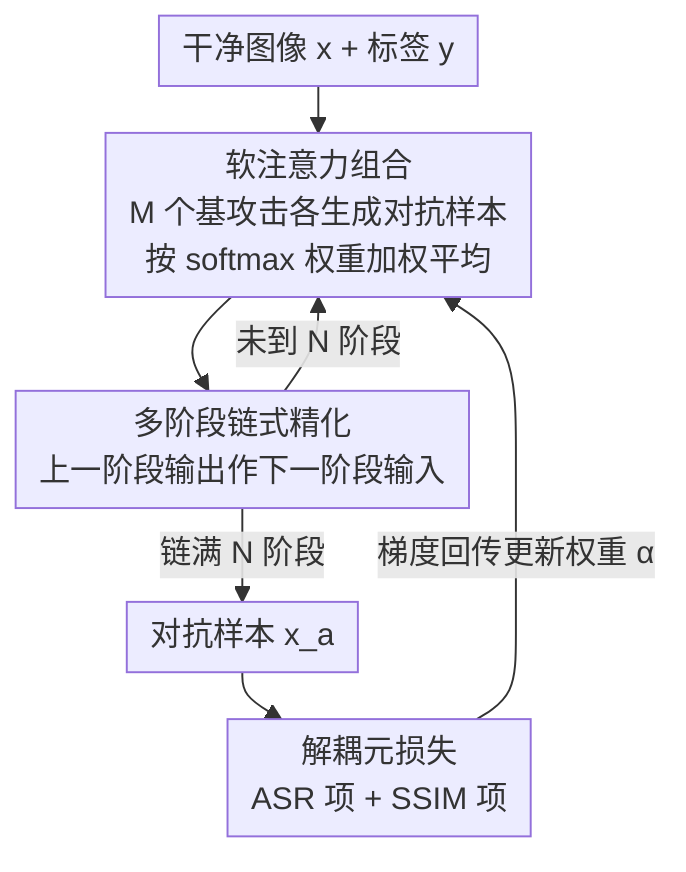

# DASH: A Meta-Attack Framework for Synthesizing Effective and Stealthy Adversarial Examples

**会议**: CVPR 2026  
**arXiv**: [2508.13309](https://arxiv.org/abs/2508.13309)  
**代码**: https://github.com/siege-research/DASH (有)  
**领域**: AI安全 / 对抗样本  
**关键词**: 对抗攻击, 感知对齐, 可微元攻击, 软注意力组合, 多阶段链式

## 一句话总结
DASH 把一堆现成的 $\ell_p$ 范数攻击（PGD、CW、各种 FGSM 变体等）当作零件，用一组可学习的 softmax 权重把它们的对抗样本"软组合"起来，并多阶段链式精化，靠一个同时优化攻击成功率和 SSIM 感知相似度的元损失端到端学权重——在对抗训练过的鲁棒模型上既把攻击成功率拉到接近 100%，又比专门的感知对齐攻击（如 AdvAD）更隐蔽。

## 研究背景与动机

**领域现状**：对抗样本生成主流是把扰动约束在一个小的 $\ell_p$ 范数球里（$\ell_2$、$\ell_\infty$ 最常用），代表方法 FGSM、PGD、CW，以及把多种攻击打包评测的 AutoAttack。这些方法用 $\ell_p$ 范数当"隐蔽性"的代理。

**现有痛点**：$\ell_p$ 范数小 ≠ 人眼看不出来——最小化 $\ell_p$ 并不能保证高感知相似度。于是出现了一批用感知指标（SSIM、LPIPS、FID）来引导生成的攻击（SSAH、PerC-AL，以及基于扩散模型的 DiffAttack、AdvAD、DiffPGD）。但这些"感知对齐攻击"反过来又掉了攻击成功率，尤其打不动鲁棒（对抗训练）模型——存在明显的「成功率 ↔ 隐蔽性」trade-off。

**核心矛盾**：单条 $\ell_p$ 攻击轨迹既无法完整刻画人眼感知，又往往在某些防御上失效；而专门的感知攻击放弃了 $\ell_p$ 攻击对各类模型的广泛适配性。两类方法各有所长却互不相通。

**本文目标**：能不能不重新设计攻击，而是把现成 $\ell_p$ 攻击的长处"组合"出一个既更强、又更贴合人眼的攻击？需要回答两个子问题：(a) 怎么确定每个基攻击的最优权重；(b) 怎么让组合结果落到感知友好的区域而不只是满足 $\ell_p$ 约束。

**切入角度**：作者的关键观察是——不同 $\ell_p$ 范数虽然单独都不等于人眼感知，但它们各自对应不同的感知特性（对比度、纹理、边缘扰动）。所以按原则把不同范数下优化出的攻击混在一起，有望同时提升成功率和感知质量。

**核心 idea**：用一组**连续、可学习**的软注意力权重在低维权重空间里组合多个基攻击（而非在高维像素空间里硬搜），并用同时管"攻击成功"和"SSIM 感知"的**元损失**端到端优化这些权重，把范数约束攻击"免改造"地转成感知对齐攻击。

## 方法详解

### 整体框架
DASH（Differentiable Attack SearcH）是一个可微的多阶段元攻击框架。输入是干净图像 $\boldsymbol{x}$ 和真值标签 $y$，输出是对抗样本 $\boldsymbol{x}_a$。它假设有 $M$ 个基攻击和 $N$ 个阶段（attack cell），两者都是攻击者可自由选的超参。在每个阶段里，DASH 先让池子里所有基攻击各自生成一份对抗样本，再用该阶段学到的 softmax 权重把这些样本加权平均成本阶段输出；然后把这个输出当作下一阶段的输入，链式迭代精化。整条流程的权重由一个联合优化"攻击成功率 + SSIM 感知相似度"的元损失通过 Adam 端到端学出来——注意被优化的不是像素，而是那一小撮组合权重 $\boldsymbol{\alpha}$。

### 关键设计

**1. 软注意力组合：在低维权重空间里把多个基攻击混成一个**

针对痛点"怎么定权重、怎么落到感知友好区"，DASH 不在巨大的像素空间里搜扰动，而是把"组合权重"做成连续可学习量。在第 $j$ 个阶段，每个基攻击 $i$ 有一个可学习标量 $\alpha_{j,i}$，该阶段输出是各基攻击对抗样本 $\boldsymbol{x}_a^{j,i}$ 的 softmax 加权平均：

$$\mathcal{A}_j(\boldsymbol{x}_a^{j-1},y)=\sum_{i=1}^{M}\frac{\exp(\alpha_{j,i})}{\sum_{k=1}^{M}\exp(\alpha_{j,k})}\cdot\boldsymbol{x}_a^{j,i}$$

softmax 保证权重归一化、提供"软重要性"分布，整个组合对权重可微。这一步把搜索从高维像素空间降到了只有 $M\times N$ 个标量的低维权重空间，因此优化远比 AutoAttack/Composite Attack 那种离散选择或启发式搜像素的方式更易解；而且因为各基攻击本身仍守 $\ell_p$ 约束、它们的凸组合也大致保持感知相似，所以"免改造"就把范数攻击转成了感知对齐攻击。论文把它形象地说成"在多条攻击轨迹的凸包里搜索，构造出夹在标准路径之间的扰动"

**2. 多阶段链式精化：用迭代重组逃离差的局部最优**

对抗样本生成是非凸优化、容易陷在坏的局部最优。DASH 用链式多阶段缓解：第 $j$ 阶段用**新学的**一组权重重新组合基攻击，并把上一阶段输出 $\boldsymbol{x}_a^{j-1}$ 喂进来当输入，整条链写成 $\boldsymbol{x}_a=\mathcal{A}_N(\boldsymbol{x}_a^{N-1},y)\circ\cdots\circ\mathcal{A}_1(\boldsymbol{x}^0,y)$。和以往迁移攻击通常只用两阶段、且每阶段固定指派不同攻击不同，DASH 允许任意深度、每个阶段都重新连续优化组合权重。每个阶段还额外放了一个 None 操作（直接返回输入），让模型自行决定某阶段是否"跳过"处理，给链更大的灵活度。实验里 1→2 阶段成功率从 51.88% 暴涨到 99.49%，正是逃离差局部最优的直接证据

**3. 解耦的元损失：把"打中"和"隐蔽"拆开各自优化**

以往方法在隐蔽性和攻击成功之间是僵硬权衡。DASH 用一个元损失把两个目标解耦、并可自适应调配：

$$\mathcal{L}_{\text{total}}=\lambda_{\text{asr}}\cdot f_y(\boldsymbol{x}_a)+\lambda_{\text{ssim}}\cdot\big(1-\text{SSIM}(\boldsymbol{x},\boldsymbol{x}_a)\big)$$

第一项 $f_y(\boldsymbol{x}_a)$ 是对抗样本在真值类 $y$ 上的置信度，最小化它即压低真值类置信、鼓励错分（攻击成功）；第二项用 $1-\text{SSIM}$ 惩罚感知失真（SSIM ∈ [0,1]，越高越像）。论文取 $\lambda_{\text{asr}}=1.3$、$\lambda_{\text{ssim}}=1.0$。因为 SSIM/LPIPS/FID 这些感知指标可微，所以能直接当优化项，把对抗样本约束在一个"视觉扰动预算"内（虽然不能像 $\ell_p$ 那样硬裁剪到某个精确预算）。一个有意思的副产物：CW 用 hinge 式损失、错分一旦达成就不再回传梯度，而 DASH 的元损失会"越过决策边界继续推"，于是组合权重会在初次错分后把注意力从 CW 转向仍能提供有效梯度的其它攻击——这也解释了为何 DASH 在后处理防御下比单用 CW 更鲁棒

### 损失函数 / 训练策略
优化的就是上面的元损失 $\mathcal{L}_{\text{total}}$，被优化变量只有组合权重 $\boldsymbol{\alpha}$（不动像素、不改基攻击内部超参）。用 Adam，学习率 0.01，训 $T=100$ 个 epoch（Algorithm 1）。$\ell_\infty$ 攻击预算 $\epsilon=\frac{7}{255}$；基攻击池含 10 个：FGSM、PGD、CW、FAB、TI-/NI-/MI-/DI-FGSM、BIM、PI-FGSM++，外加每阶段一个 None。训练完用学好的各阶段权重生成最终对抗样本。论文称把 SSIM 换成 LPIPS 等其它感知指标结果相当；FID 因小批量噪声大不适合直接进优化。

## 实验关键数据

数据集 CIFAR-10 / CIFAR-100 / ImageNet-1k，各随机采 1000 张测试图；目标是 RobustBench 上 7 个对抗训练鲁棒模型；另叠加 4 种后处理防御（JPEG、TVM、NRP、Ensemble）。SSIM 缩放到 [0,100]。

### 主实验
CIFAR-100 / Cui2024 鲁棒模型上，平均 ASR（Base + 4 防御取平均）与感知指标对比：

| 攻击 | 时间(s) | 平均 ASR↑ | SSIM↑ | LPIPS↓ | FID↓ |
|------|---------|----------|-------|--------|------|
| DI-FGSM | 0.17 | 63.72 | 92.08 | 0.0168 | 54.93 |
| CW | 0.11 | 84.14 | 94.38 | 0.0153 | 32.49 |
| AutoAttack | 0.33 | 76.77 | 92.09 | 0.0167 | 41.68 |
| DiffPGD | 4.21 | 75.80 | 91.15 | 0.0165 | 43.50 |
| DiffAttack | 12.44 | 77.24 | 91.16 | 0.0169 | 42.30 |
| AdvAD | 0.51 | 79.14 | 83.18 | 0.0288 | 45.67 |
| **DASH (ours)** | **0.96** | **99.77** | **94.43** | **0.0139** | **41.08** |

DASH 把平均 ASR 从最强感知攻击 AdvAD 的 79.14% 拉到 99.77%（论文摘要给出 20.63% 的提升），同时 SSIM 比 AdvAD 高约 11、LPIPS 低 0.015、FID 低约 5.7，并比扩散类攻击快一个量级（0.96s vs DiffAttack 12.44s）。跨数据集结论一致：CIFAR-10 平均比最强 baseline 高 ≥15% ASR，ImageNet 高 ≥5%。

### 消融实验
阶段数 $N$ 的影响（CIFAR-100 / Cui2024）：

| 阶段数 | 平均 ASR↑ | SSIM↑ | LPIPS↓ | FID↓ |
|--------|----------|-------|--------|------|
| 1 | 51.88 | 98.48 | 0.0027 | 16.19 |
| 2 | 99.49 | 94.59 | 0.0115 | 43.28 |
| 3 | 99.77 | 94.43 | 0.0139 | 41.08 |
| 4 | 99.86 | 93.22 | 0.0190 | 47.56 |
| 5 | 99.98 | 92.92 | 0.0209 | 48.25 |

可学习权重的作用（Fig 3/4）：把权重换成 [0,1] 均匀随机采样、不训练（重复 100 次取平均），ASR 与 SSIM 都明显低于训练版；随训练 epoch 增加 ASR 上升、SSIM 几乎单调改善。

### 关键发现
- **多阶段链式是成功率的命门**：1→2 阶段 ASR 从 51.88% 跳到 99.49%，印证"链式精化逃离差局部最优"；但阶段越多隐蔽性越掉（SSIM 98.48→92.92，FID 16.19→48.25），存在成功率/隐蔽性的可调折中，论文取 3 阶段作平衡。
- **可学习权重不可省**：随机不训练的权重版本 ASR 和 SSIM 都显著更差，证明元学习出来的权重才是关键。
- **权重可跨模型/数据集迁移**：在一个模型/数据集上训出的权重直接用到未见模型/数据集，平均 ASR 波动 <3%、SSIM 波动 <2（Table 4），说明学到的是较通用的组合策略。
- **黑盒迁移最强**：用代理模型生成的 DASH 对抗样本迁移到目标模型，平均 ASR 在 Cui2024/Wang2023 上比最强 baseline DiffAttack 高 10%/12%，且 SSIM 仍最好（Table 2）。
- **CW 的反直觉现象**：CW 是基攻击之一，却不总拿高权重——因为它 hinge 损失错分后停止回传梯度，而元损失要继续"越界推"，于是权重转向仍有梯度的攻击，这让 DASH 在后处理防御下比 CW 更稳。

## 亮点与洞察
- **把"攻击设计"降维成"权重学习"**：不发明新攻击、不改基攻击内部，只在 $M\times N$ 个标量权重上做梯度优化，就把一堆范数攻击"炼"成感知对齐攻击——这种"组合现有零件 + 可微元损失"的思路迁移性极强，可套到任何"有多个可微子方案、想自适应加权"的场景。
- **感知指标当可微优化项**：SSIM/LPIPS 可微这一点被直接拿来当损失项约束"视觉预算"，绕开了 $\ell_p$ 硬裁剪与人眼感知不一致的老问题，是很干净的工程巧思。
- **CW 权重下降的机理分析**："元损失越界继续推 vs CW 错分即停"的解释，把"为什么组合后比单攻击更抗防御"讲到了梯度层面，很有说服力。
- **None 操作让链自适应深度**：每阶段可选"跳过"，等于让框架自己决定有效阶段数，是个低成本提升灵活度的设计。

## 局限与展望
- **组合仅限加权平均**：目前是线性 softmax 加权 + 线性链式，作者也承认更高级的组合（如把基攻击自身超参也设为可学变量、cyclic/attention 式链）留作未来工作。
- **SSIM 进 meta-loss 不能硬约束预算**：无法像 $\ell_p$ 那样把样本严格裁到某个 SSIM/FID/LPIPS 阈值，只能软惩罚；FID 因小批量噪声大无法直接进优化。
- **阶段数带来成功率/隐蔽性折中且需手调**：阶段越多 ASR 越高但 SSIM/FID 越差，$N$ 仍是需人工权衡的超参，没有自动选择机制。
- **作为"攻击"的双刃属性**：本质是更强的对抗攻击框架，论文定位为"鲁棒性评测的强 baseline"，但也意味着对部署模型的现实威胁，需配套防御研究。
- **依赖基攻击池质量**：DASH 的上限受池子里基攻击的多样性与强度约束，若池内攻击同质，组合收益会下降（论文未充分量化池规模/构成的敏感性，⚠️ 细节见补充材料）。

## 相关工作与启发
- **vs AutoAttack / Composite Attacks**: 它们也"组合多攻击"，但 AutoAttack 是少数攻击的离散集成、Composite 用遗传算法启发式组合，都仍在 $\ell_p$ 约束下做离散选择；DASH 把离散选择换成连续可微插值，并显式优化感知指标，组合更细、更强、更隐蔽。
- **vs AdvAD / DiffAttack / DiffPGD**: 这些是专门的感知对齐/扩散攻击，单打独斗、对不同目标模型适配差，在鲁棒模型上成功率和隐蔽性常双输；DASH 站在范数攻击广泛适配性的肩膀上做组合，成功率近 100% 且感知指标更好、速度快一个量级。
- **vs CW**: CW 单独调好也很强（有时压过扩散攻击），但 hinge 损失错分即停、对后处理防御脆；DASH 把 CW 当零件之一并用越界元损失补足其短板，整体更鲁棒。
- **vs 两阶段链式迁移攻击**: 以往链式攻击多为两阶段、每阶段固定指派不同攻击；DASH 允许任意深度、每阶段连续重新优化组合权重。

## 评分
- 新颖性: ⭐⭐⭐⭐ "组合现有 $\ell_p$ 攻击 + 可微软注意力 + 感知元损失"角度新颖且实用，但单个组件（软注意力、链式、感知损失）均有渊源。
- 实验充分度: ⭐⭐⭐⭐⭐ 3 数据集 × 7 鲁棒模型 × 4 防御 × 白盒/黑盒 + 阶段/权重/迁移多维消融，覆盖很全。
- 写作质量: ⭐⭐⭐⭐ 动机—设计—分析链条清晰，CW 权重机理分析是亮点；部分细节（池规模敏感性）放补充材料略影响自洽阅读。
- 价值: ⭐⭐⭐⭐ 作为鲁棒性评测的强 baseline 很有用，且"可微元组合"范式可迁移到其它任务。

<!-- RELATED:START -->

## 相关论文

- [\[CVPR 2026\] Towards Stealthy and Effective Backdoor Attacks on Lane Detection: A Naturalistic Data Poisoning Approach](towards_stealthy_and_effective_backdoor_attacks_on_lane_detection_a_naturalistic.md)
- [\[CVPR 2026\] Shedding Light on VLN Robustness: A Black-box Framework for Indoor Lighting-based Adversarial Attack](shedding_light_on_vln_robustness_a_black-box_framework_for_indoor_lighting-based.md)
- [\[CVPR 2025\] MOS-Attack: A Scalable Multi-Objective Adversarial Attack Framework](../../CVPR2025/ai_safety/mos-attack_a_scalable_multi-objective_adversarial_attack_framework.md)
- [\[CVPR 2026\] Meta-FC: Meta-Learning with Feature Consistency for Robust and Generalizable Watermarking](meta-fc_meta-learning_with_feature_consistency_for_robust_and_generalizable_wate.md)
- [\[CVPR 2026\] CamPI: Physical Adversarial Examples through Camera Power Signal Injection](campi_physical_adversarial_examples_through_camera_power_signal_injection.md)

<!-- RELATED:END -->
