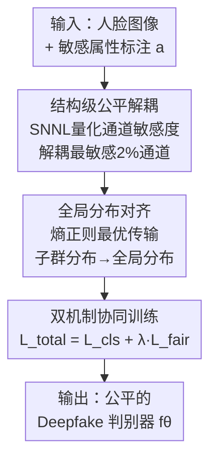

# Decoupling Bias, Aligning Distributions: Synergistic Fairness Optimization for Deepfake Detection

**会议**: CVPR 2026  
**论文**: [CVF Open Access](https://openaccess.thecvf.com/content/CVPR2026/html/Ding_Decoupling_Bias_Aligning_Distributions_Synergistic_Fairness_Optimization_for_Deepfake_Detection_CVPR_2026_paper.html)  
**代码**: https://github.com/ywh1093/Fairness-Optimization  
**领域**: AI安全 / Deepfake检测 / 算法公平性  
**关键词**: 公平性优化, Deepfake检测, 通道解耦, 分布对齐, 最优传输

## 一句话总结
针对 Deepfake 检测器在性别/种族等人口学群体上的偏见，本文提出"结构级公平解耦 + 全局分布对齐"的双机制协同框架：先用通道敏感度指标剪掉最编码敏感属性的卷积通道，再用熵正则最优传输把各子群的预测分布对齐到全局分布，在多个数据集上同时改善组间/组内公平性且不牺牲（甚至提升）检测 AUC。

## 研究背景与动机
**领域现状**：Deepfake 检测主流是 CNN（Xception、ResNet-50）端到端二分类，近年也有取证痕迹建模、LLM 辅助等方向。但绝大多数工作只盯着"真/假分得准不准"，几乎不管模型在不同人口学群体上的表现是否一致。

**现有痛点**：训练集（如 FF++）天然存在分布偏斜——白人面孔、特定性别样本过多。在经验风险最小化下，模型会偏向多数群体，导致深肤色、少数性别的错误率显著更高。这种系统性误判在数字身份安全、司法取证等场景会放大社会不公。

**核心矛盾**：现有公平性增强方法陷入"公平 vs 精度"的二选一。预处理（重采样/跨组合成）泛化差；in-processing（对抗去偏、风险敏感目标、特征解耦）往往在压制敏感属性信息的同时也压制了真正的伪造线索，掉点；后处理（阈值校准、输出对齐）受残留表示偏差牵制、跨域不稳。尤其是用解耦把人口学特征和伪造线索分开的做法，虽改善了公平泛化，却拉低了检测精度。

**本文目标**：在**不牺牲检测精度**的前提下，同时改善**组内**（如单看种族）与**组间**（性别×种族交叉）两种公平性，并具备跨域泛化能力。

**切入角度**：作者把偏见来源拆成两层——**结构层**（某些卷积通道隐式编码了肤色反射、面部轮廓几何这类与敏感属性强相关的纹理）和**特征层**（不同子群的预测分布整体错位）。两层各打一拳，而不是用单一机制硬抗。

**核心 idea**：先在架构层把"最会泄露敏感属性"的通道识别并解耦掉（去掉偏见的结构温床），再在特征层用最优传输把各子群分布拉齐到全局分布（消除残余的分布偏移），两个机制协同优化。

## 方法详解

### 整体框架
给定带敏感属性标注的训练集 $D_{sensitive}=\{(x_i,y_i,a_i)\}_{i=1}^m$（$x_i$ 是人脸图，$y_i\in\{0:\text{real},1:\text{fake}\}$，$a_i$ 是单一或交叉敏感属性），目标是训练公平检测器 $f_\theta$。整个方法是两阶段串行：**第一阶段（SFD）在最后一层卷积上识别并解耦对敏感属性最敏感的通道**，第二阶段（GDA）在解耦后的特征上，把各子群的真/假预测分布用最优传输对齐到全局分布，最后用分类损失 + 公平损失联合训练。

### 关键设计

**1. 结构级公平解耦（SFD）：剪掉"最会泄露敏感属性"的卷积通道**

痛点很直接：最后一层卷积的不同通道对敏感属性的响应差异巨大，有些通道专门编码肤色反射、面部轮廓几何这类与种族/性别强相关的局部纹理，正是它们把偏见带进了预测。本文不靠 loss 间接压制，而是直接在架构层把这些通道找出来解耦。

怎么找？用 **Soft Nearest Neighbor Loss（SNNL）** 量化每个通道的"敏感度"。对第 $t$ 个 batch、通道 $k$，其敏感度损失为

$$l^{k,t}_{sn} = -\frac{1}{b}\sum_{i=1}^{b}\log\frac{\sum_{x\neq i}\delta(a_i-a_x)\exp(-\|m_{k,i}-m_{k,x}\|^2/T)}{\sum_{y\neq i}\exp(-\|m_{k,i}-m_{k,y}\|^2/T)}$$

其中 $\delta(a_i-a_x)$ 是 Dirac delta，当两样本属同一敏感群组时为 1。分子只统计**同敏感群组**样本的相似度、分母统计**所有**样本，$T$ 是温度。直觉：如果通道 $k$ 把同属一个敏感群组的样本聚得很紧（同组特征高度相似），这个比值大、$-\log$ 小、损失小——说明该通道**强烈地按敏感属性聚类**，是偏见的温床。再把它在所有 batch 上平均得到该通道的公平指数 $F_k=\frac{1}{N_b}\sum_{t}l^{k,t}_{sn}$。**$F_k$ 越低 → 通道对敏感属性的判别力越强 → 越不公平**。于是把所有通道按 $F_k$ 排序，解耦最低的 $prc\%$（消融显示第 3 轮迭代解耦 2% 通道时公平/鲁棒性最优）。这一步在第一阶段还会先用交叉熵 $L_{cls}=C(h(z^i_r),y^i_r)+C(h(z^i_f),y^i_f)$ 让模型先学到取证知识，保证解耦不会破坏判别基础。

**2. 全局分布对齐（GDA）：用熵正则最优传输把子群分布拉齐到全局**

解耦只动了结构，特征层各子群的预测分布仍可能整体错位。GDA 的目标是让模型预测对敏感属性"不变"，形式化为最小化每个子群分布与全局分布的距离：

$$\min_f \sum_\alpha^{A} d\big(D_{\{(x_I,a)\}|f}-D_{\{(x_I,a)|a=\alpha\}|f}\big)$$

直接算不可行，作者改为对齐**经验分布**，并且**真/假图分开对齐**：把子群 $a$ 的真图、假图预测分布记为 $g^a_r,g^a_f$，全局真/假分布记为 $R,G$。用带**互信息正则的最优传输**度量两者距离：

$$L^\epsilon_c(g^a_r,R)=\min_{(X,Y)}\Big(\mathbb{E}_{(X,Y)}[c(X,Y)]+\epsilon\cdot I(X;Y)\Big),\quad I(X;Y)=\mathrm{KL}(\pi\,\|\,g^a_r\otimes R)$$

这里 $c(X,Y)$ 是传输代价，互信息项 $I(X;Y)=\mathrm{KL}(\pi\|g^a_r\otimes R)$ 衡量联合分布 $\pi$ 与边际乘积的偏离——当敏感属性与预测独立时 $I=0$，否则被惩罚，等价于强制"预测独立于敏感属性"。总公平损失对所有群组、真假两路取平均：

$$L_{fair}=\frac{1}{|A|}\sum_{a\in A}\big(L^\epsilon_c(g^a_r,R)+L^\epsilon_c(g^a_f,G)\big)$$

工程上用 **Sinkhorn-Knopp** 算：经验分布用核密度估计（KDE）逼近，按预测值的平方欧氏距离建代价矩阵 $C$，初始化 Gibbs 核 $K=\exp(-C/\epsilon)$，行/列归一化交替迭代到收敛得到传输方案。熵正则把经典 OT 的 $O(n^3)$ 降到 $O(n^2)$，能塞进训练循环。

**3. 双机制协同：先结构去偏、再分布对齐的联合训练目标**

两个模块不是各跑各的，而是有明确分工与先后：SFD 是**局部**手术，砍掉编码偏见的结构通道；GDA 是**全局**优化，在去偏后的"干净"特征上从各子群里提炼出跨域不变的共识，进一步增强公平泛化。第二阶段的总目标把分类与公平合在一起：

$$L_{total}=L_{cls}+\lambda L_{fair}$$

$\lambda=0.005$ 平衡精度与公平。消融证实这种协同是 1+1>2 的：单用 GDA 已能大幅提公平和 AUC，叠加 SFD 后在不少指标上再下一城（如 FF++ Xception 性别 $F_{FPR}$ 从 GDA 的 3.91% 进一步降到 0.53%），说明"局部结构去偏 + 全局分布对齐"在压制偏见的同时保住了关键伪造特征。

### 损失函数 / 训练策略
第一阶段交叉熵 $L_{cls}$ 先学取证判别基础并据此算通道公平指数解耦；第二阶段联合 $L_{total}=L_{cls}+\lambda L_{fair}$（$\lambda=0.005$）。训练用 SGD（$\beta=1\times10^{-3}$）、batch 64、50 epoch，OT 正则系数 $\epsilon=5\times10^{-4}$，两张 RTX 4090。

## 实验关键数据

### 主实验（域内 FF++，Xception，训练/测试均在 FF++）
公平指标 $F_{FPR}$（各组假阳率差异）、$F_{DP}$（人口学均等差）越低越好；es-AUC（公平一致的检测性能）、AUC 越高越好。

| 属性维度 | 方法 | F_FPR↓ | F_DP↓ | es-AUC↑ | AUC↑ |
|---------|------|--------|-------|---------|------|
| 性别 | Ori | 4.10 | 5.72 | 91.93 | 92.69 |
| 性别 | PG-FDD (CVPR'24) | 0.62 | 4.74 | 96.32 | 97.66 |
| 性别 | **Ours** | **0.53** | **3.61** | **96.45** | **97.71** |
| 种族 | Ori | 19.76 | 4.74 | 82.85 | 92.69 |
| 种族 | PG-FDD | 11.13 | 4.78 | 94.52 | 97.66 |
| 种族 | **Ours** | 9.29 | **4.35** | **94.86** | **97.71** |
| 交叉 | Ori | 36.03 | 14.64 | 74.43 | 92.69 |
| 交叉 | PG-FDD | 9.19 | 13.39 | 86.83 | 97.66 |
| 交叉 | **Ours** | 20.18 | **9.47** | **86.91** | **97.71** |

检测 AUC 上本文最高（97.71，比所有公平基线都高），公平指标在多数项上领先。⚠️ 但并非每项都最优：交叉属性的 $F_{FPR}$（20.18）就不如 PG-FDD（9.19），作者强调的是"大多数公平指标 + 检测精度"双赢，而非全胜。跨域（DFDC/Celeb-DF/DFD）上本文在 Celeb-DF 的交叉属性等多数设置取得最佳，且 Fairadapter（ViT-L/14，为 AIGC 图设计）在 Deepfake 场景明显水土不服。

### 消融实验（FF++，Xception；Ori → +GDA → +GDA+SFD）
| 配置 | 性别 F_FPR↓ | 性别 es-AUC↑ | 交叉 F_DP↓ | AUC↑ |
|------|-------------|--------------|------------|------|
| Ori | 4.10 | 91.93 | 14.64 | 92.69 |
| + GDA | 3.91 | 96.11 | 16.60 | 97.22 |
| + GDA + SFD（完整） | **0.53** | **96.45** | **9.47** | **97.71** |

### 关键发现
- **GDA 是提精度+公平的主力**：单加 GDA，AUC 从 92.69→97.22（+4.53），性别 es-AUC +4.18、种族 es-AUC +12.34，说明分布对齐对跨子群一致性贡献最大。
- **SFD 负责"最后一公里"的去偏**：叠加 SFD 后性别 $F_{FPR}$ 从 3.91→0.53（相对降 ~87%），交叉 $F_{DP}$ 从 16.60→9.47，且 AUC 不降反升（97.22→97.71），印证"局部结构去偏不伤伪造特征"。
- **解耦不是越多越好**：解耦迭代/比例增大先改善后退化，最优是**第 3 轮迭代解耦 2% 通道**——剪太多会连有用的伪造线索一起砍掉。
- **骨干无关**：换 ResNet-50（Table 3/5）结论一致，方法不绑定特定 backbone。
- **Grad-CAM 可视化**：Ori 易过拟合到面部外背景噪声，本文注意力稳定聚焦在显著面部区域。

## 亮点与洞察
- **把"公平 vs 精度"拆成两层分别解**：结构层剪通道 + 特征层对齐分布，避免了单一去偏机制"压敏感信息时连伪造线索一起压"的通病——这是本文 AUC 不掉反升的根因。
- **SNNL 当"通道敏感度探针"**：用同组/全体相似度比值给每个通道打公平分，思路可迁移到任意需要"定位偏见载体单元"的网络剪枝/可解释场景。
- **互信息正则的 OT 对齐**：把"预测独立于敏感属性"写成 $I(X;Y)=\mathrm{KL}(\pi\|g^a_r\otimes R)$ 的惩罚，并用 Sinkhorn 把复杂度压到 $O(n^2)$，是把公平约束塞进训练循环的实用工程。

## 局限与展望
- 解耦比例/迭代次数（2%、第 3 轮）是经验调出的超参，对新数据集/backbone 是否仍最优、是否需要自适应选择，文中未给自动化方案。
- ⚠️ 交叉属性的 $F_{FPR}$ 并非全场最佳，说明在多属性强交互（如 Female-Asian 这类稀疏交叉组）下偏见抑制仍有空间；细粒度交叉组样本稀疏时 KDE 估分布是否可靠值得追问。
- 公平度量依赖准确的敏感属性标注（性别/种族），标注本身的主观性与缺失会影响方法落地；对未标注属性或连续属性如何推广未讨论。
- 仅在图像级 Deepfake 上验证，视频时序伪造、AIGC 全合成图等场景的迁移性待考。

## 相关工作与启发
- **vs PG-FDD (CVPR'24)**: 都做算法级公平去偏，PG-FDD 靠特征解耦分离人口学/伪造线索但会掉检测精度；本文用"结构剪通道 + OT 分布对齐"双机制，在交叉属性 $F_{DP}$ 与整体 AUC 上更优，关键是精度不降反升。
- **vs DAG-FDD / DAW-FDD (WACV'24)**: 它们用风险敏感目标/损失重加权去偏，跨域泛化有限、个别设置甚至不如 Ori 基线；本文的 GDA 显式对齐子群与全局分布，跨域 es-AUC 更稳。
- **vs Fairadapter (ICASSP'25)**: 为 AIGC 图检测设计、用 ViT-L/14，在 Deepfake 场景明显失效（AUC 仅 71.50）；本文在通用 CNN backbone 上稳定可用，体现任务适配性。

## 评分
- 新颖性: ⭐⭐⭐⭐ 把偏见拆成结构层/特征层双机制解，SNNL 通道敏感度 + 互信息正则 OT 的组合是新颖且自洽的视角。
- 实验充分度: ⭐⭐⭐⭐ 4 数据集×3 公平指标×2 backbone，含域内/跨域/鲁棒性/可视化/消融，较完整；交叉组细粒度分析略浅。
- 写作质量: ⭐⭐⭐⭐ 公式与两阶段逻辑清晰，部分符号（如分布记号 $D_{\{(x_I,a)\}|f}$）偏繁琐。
- 价值: ⭐⭐⭐⭐ 直击 Deepfake 检测落地的公平性痛点，代码开源，结构去偏思路可迁移到其他公平场景。

<!-- RELATED:START -->

## 相关论文

- [\[CVPR 2026\] DSO: Direct Steering Optimization for Bias Mitigation](dso_direct_steering_optimization_for_bias_mitigation.md)
- [\[CVPR 2026\] DFD-HR: Generalizable Deepfake Detection via Hierarchical Routing Learning](dfd-hr_generalizable_deepfake_detection_via_hierarchical_routing_learning.md)
- [\[CVPR 2026\] DeepfakeImpact: A Two-Stage Benchmark with Real-World Impact in Deepfake Detection](deepfakeimpact_a_two-stage_benchmark_with_real-world_impact_in_deepfake_detectio.md)
- [\[CVPR 2026\] Omni-Fake: Benchmarking Unified Multimodal Social Media Deepfake Detection](omni-fake_benchmarking_unified_multimodal_social_media_deepfake_detection.md)
- [\[CVPR 2026\] X-AVDT: Audio-Visual Cross-Attention for Robust Deepfake Detection](x-avdt_audio-visual_cross-attention_for_robust_deepfake_detection.md)

<!-- RELATED:END -->
