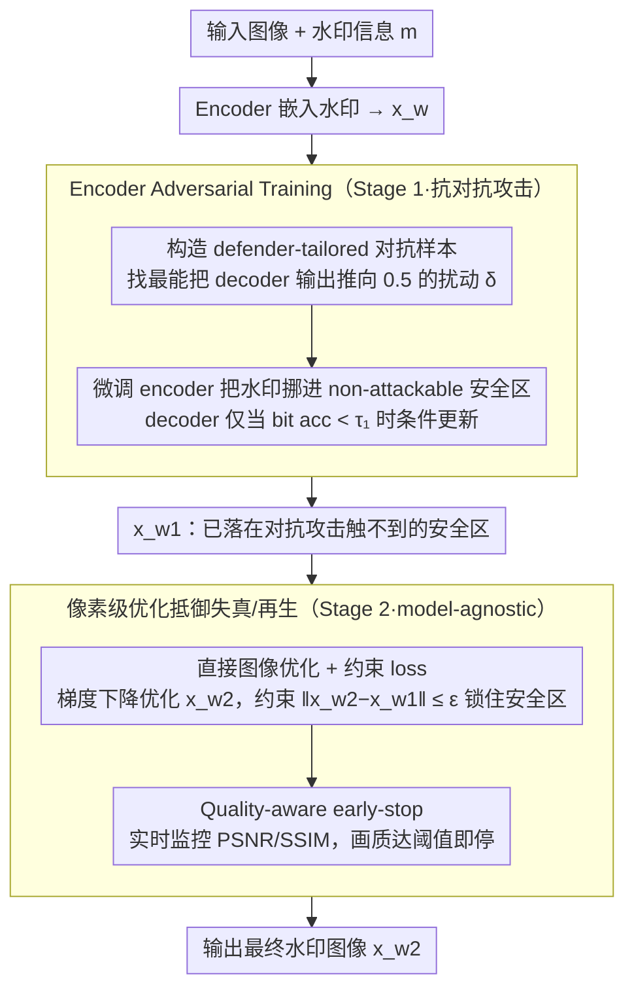

# AdvMark: Decoupling Defense Strategies for Robust Image Watermarking

**会议**: CVPR2026  
**arXiv**: [2602.20053](https://arxiv.org/abs/2602.20053)  
**代码**: 无  
**领域**: AI安全  
**关键词**: 图像水印, 对抗鲁棒性, 扩散再生攻击, 解耦训练, 对抗训练, 图像质量

## 一句话总结
提出 AdvMark 两阶段解耦防御框架：Stage 1 Encoder Adversarial Training（EAT）将水印图像移入 non-attackable 区域抵御对抗攻击，Stage 2 直接图像优化抵御失真+再生攻击并保留对抗鲁棒性，在 9 种水印方法 ×10 种攻击上分别提升失真/再生/对抗准确率 29%/33%/46%，且图像质量最优。

## 研究背景与动机

**领域现状**：深度学习图像水印（DL watermarking）通过 encoder 将信息嵌入图像、decoder 提取信息，已成为版权保护和内容溯源的核心技术。近年来攻击手段不断升级，形成三重威胁。

**三重威胁**：
   - **对抗攻击（Adversarial Attack）**：如 WEvade，通过微小扰动使 decoder 提取错误信息，攻击后图像视觉上无变化
   - **再生攻击（Regeneration Attack）**：利用扩散模型对水印图像加噪再去噪，有效"洗掉"水印
   - **失真攻击（Distortion Attack）**：如 JPEG 压缩、高斯模糊、裁剪等传统图像处理操作

**联合训练（JAT）的两大问题**：
   - **问题 1**：decoder 对抗训练导致 clean accuracy 下降——为了在对抗样本上也能正确解码，decoder 被迫扩展决策边界，反而在干净图像上精度降低
   - **问题 2**：同时训练三种攻击收敛慢效果差——三种攻击的梯度方向冲突，优化 landscape 复杂，联合训练难以同时满足所有防御需求

**核心洞察**：对抗攻击与失真/再生攻击本质不同。对抗攻击利用模型决策边界的弱点（model-specific），而失真/再生攻击是信号层面的破坏（model-agnostic）。应该解耦防御策略而非联合训练

**核心 idea**：两阶段解耦——先用 EAT 让 encoder 把图像"推入"non-attackable 区域，再用直接图像优化处理失真和再生攻击

## 核心问题
如何同时防御对抗攻击、再生攻击和失真攻击三重威胁，避免联合训练的梯度冲突和 clean accuracy 下降？

## 方法详解

### 整体框架
AdvMark 想解决的是同一张水印图像要同时扛住对抗、失真、再生三类攻击，而联合训练把这三件事搅在一起又慢又互相拖累。它的解法是把防御沿攻击的"本质"切成两段来打：对抗攻击是冲着模型决策边界的弱点来的（model-specific），失真/再生攻击则是信号层面的破坏（model-agnostic），二者根本不是一回事，没必要也不应该用同一套训练去硬扛。于是 Stage 1 用 Encoder Adversarial Training（EAT）只管对抗鲁棒性——微调 encoder，把水印图像"挪进"对抗攻击够不着的安全区域；Stage 2 拿到 Stage 1 的输出 $x_{w1}$，在像素空间直接优化出 $x_{w2}$ 来抵御失真和再生，同时用一个偏移约束把图像锁在 Stage 1 建立的安全区域里，让前一阶段的对抗防御成果不被推翻。推断时就是 encoder 嵌入 → Stage 2 优化 → 输出最终水印图像。

### 关键设计

**1. Encoder Adversarial Training：与其让 decoder 包容对抗样本，不如让 encoder 把图像搬到安全区**

传统对抗训练（AT）同时更新 encoder 和 decoder，靠 decoder 扩张决策边界来容纳对抗样本，代价是干净图像上的解码精度跟着掉（clean BA 从 ~99% 降到 ~92%）。EAT 反过来——基本冻住 decoder，只把 encoder 当主要训练对象。它先构造 defender-tailored 对抗样本：解 $\min_{\delta}\, |0.5 - l(\text{clamp}(D(x_w + \delta), 0, 1), m)|$（Eq.2），找到最能把 decoder 输出推向 0.5（即最大不确定、最接近判错）的扰动 $\delta$，这是最难防的那批样本。然后把这些样本反馈给 encoder，逼它学会把水印嵌到远离决策边界的位置；decoder 只在 bit accuracy 掉到阈值 $\tau_1$ 以下时才条件性地更新一次。这样边界没有被撑大，clean accuracy 得以保住（EAT 下维持 ~98-99%），而对抗鲁棒性反而更强——因为图像本身就被放在了攻击半径触不到的地方。

**2. 直接图像优化 + 约束 loss：用像素级优化打信号层攻击，再用约束守住安全区**

失真（JPEG、模糊、裁剪）和再生（扩散加噪去噪）都是 model-agnostic 的信号破坏，靠继续训练网络收效有限，所以 Stage 2 干脆不动网络参数，直接在像素空间梯度下降优化 $x_{w2}$，目标是让它经过失真/再生攻击后 decoder 仍能正确提取水印。但纯粹追求抗失真会把图像推离 Stage 1 的安全区、破坏对抗鲁棒性，因此加一个 constrained image loss 约束 $x_{w2}$ 相对 $x_{w1}$ 的偏移量 $\|x_{w2}-x_{w1}\| \le \epsilon$，把优化锁在安全区内。消融里去掉这个约束后对抗 Acc 显著下降，正好印证了它的作用。

**3. Quality-aware early-stop：用质量指标当刹车，而不是固定 ε-ball 投影**

如果用固定 $\epsilon$-ball 投影来限制偏移，不同图像的退化程度不一致，画质会忽好忽坏。这里改成在优化过程中实时监控 PSNR/SSIM，一旦画质掉到阈值就提前停手。效果是在相同准确率下 PSNR 平均高出 1–2 dB，让"抗攻击"和"看着不脏"这两个目标都更可控。

**4. 两阶段解耦的理论保证：证明 Stage 2 不会拆 Stage 1 的台**

解耦的前提是后一阶段别把前一阶段的成果毁掉。论文给出一条简洁的鲁棒性保持结论：若 $x_{w1}$ 在对抗攻击半径 $r$ 内是安全的，且 $\|x_{w2}-x_{w1}\| \le \epsilon$，则 $x_{w2}$ 在半径 $r-\epsilon$ 内仍然安全。这把"约束偏移量"和"保留对抗鲁棒性"之间的关系讲清楚了，也解释了为什么设计 2 的约束不是工程上的随手一加，而是有依据的。

### 损失函数 / 训练策略
- **Stage 1**：在对抗样本上迭代训练 encoder（K 步 PGD 构造扰动 + encoder 更新），decoder 条件冻结、仅在 bit accuracy $< \tau_1$ 时更新。
- **Stage 2**：固定 encoder/decoder，对 $x_{w2}$ 的像素做梯度下降，受 constrained image loss（$\|x_{w2}-x_{w1}\| \le \epsilon$）约束，配 quality-aware early-stop。
- **推断**：encoder 嵌入 → Stage 2 优化 → 输出最终水印图像。

## 实验关键数据

### 主实验——9 种水印方法 ×10 种攻击

| 防御策略 | 失真攻击 Acc (%) | 再生攻击 Acc (%) | 对抗攻击 Acc (%) | PSNR ↑ | SSIM ↑ |
|---------|----------------|----------------|----------------|--------|--------|
| 无防御 (Baseline) | ~60-70 | ~50-60 | ~20-30 | 最高 | 最高 |
| JAT (联合训练) | ~65-75 | ~55-65 | ~40-50 | 较低 | 较低 |
| AT + Distortion | ~70-78 | ~58-68 | ~45-55 | 低 | 低 |
| **AdvMark (Ours)** | **+29%** | **+33%** | **+46%** | **最高** | **最高** |

### 消融实验

| 配置 | 对抗 Acc | 失真 Acc | 再生 Acc | 图像质量 |
|------|---------|---------|---------|---------|
| Stage 1 only (EAT) | 高 | 中 | 中 | 高 |
| Stage 2 only (DIO) | 低 | 高 | 高 | 中 |
| JAT (联合训练) | 中 | 中 | 中 | 低 |
| EAT + 标准 AT (非 EAT) | 中 | — | — | 低 |
| EAT + DIO w/o constraint | 低 | 高 | 高 | 中 |
| **AdvMark (EAT + constrained DIO)** | **高** | **高** | **高** | **高** |

### 关键发现
- **EAT vs 标准 AT**：标准 AT 扩展 decoder 边界导致 clean BA 从 ~99% 降至 ~92%；EAT 保持 clean BA ~98-99% 的同时对抗鲁棒性更强
- **约束的重要性**：去掉 Stage 2 的 image constraint 后，对抗 Acc 显著下降，验证了理论分析
- **Quality-aware early-stop vs ε-ball 投影**：early-stop 在相同 Acc 下 PSNR 平均高 1-2 dB
- **泛化性**：在 9 种不同架构的水印方法上均带来提升，说明 AdvMark 是即插即用的通用框架
- **对抗攻击提升最显著（+46%）**：说明 EAT 的"移入安全区域"策略比"扩展边界"更有效

## 亮点与洞察
- **"移入安全区域 vs 扩展边界"**：这是全文最核心的洞察。传统 AT 让 decoder 包容更多，EAT 让 encoder 把图像送到安全的地方。类比：与其让房子抗震（改 decoder），不如把房子建在没地震的地方（改 encoder）
- **解耦策略的思想深度**：对抗攻击是 model-specific（利用决策边界弱点），失真/再生是 model-agnostic（信号破坏）。两类攻击本质不同，防御策略也应解耦——这是问题理解驱动的设计
- **理论 + 实践的完整链条**：先理论证明约束下鲁棒性保持，再用 quality-aware early-stop 实践落地，理论指导工程
- **通用框架**：即插即用于 9 种已有水印方法，说明方法的通用性和实用价值

## 局限与展望
- Stage 2 的直接图像优化需要额外推断时间（每张图像优化数十步），实时场景可能受限
- Quality-aware early-stop 的阈值需要针对不同应用场景设定，不完全免调参
- 理论保证基于 $\|x_{w2} - x_{w1}\| \leq \epsilon$ 的假设，实际优化可能超出此范围
- 仅在图像水印上验证，视频水印、音频水印等其他模态的适用性待探索
- 对抗攻击类型以 WEvade 为主，更多样化的自适应攻击测试可增强可信度

## 相关工作与启发
- **vs RivaGAN/StegaStamp 等水印方法**: 这些方法的 encoder-decoder 训练不考虑对抗鲁棒性，AdvMark 作为通用后处理可即插即用提升它们的鲁棒性
- **vs 联合对抗训练 (JAT)**: JAT 同时训练三种攻击导致梯度冲突和 clean accuracy 下降；AdvMark 解耦两阶段各自优化，效果和质量均更优
- **vs DiffPure 等扩散净化方法**: DiffPure 用扩散模型净化对抗样本，但这恰好是水印面临的再生攻击。AdvMark 需要同时防御扩散模型作为攻击者的场景
- **启发**：多类型攻击防御的解耦思想可推广到其他安全场景（如多模态对抗防御、联邦学习鲁棒性）

## 评分
- 新颖性: ⭐⭐⭐⭐ EAT "移入安全区域"的思路新颖，两阶段解耦设计有深度
- 实验充分度: ⭐⭐⭐⭐⭐ 9 种方法 ×10 种攻击的大规模对比极为充分，消融细致
- 写作质量: ⭐⭐⭐⭐ 问题分析透彻，"扩展边界 vs 移入安全区域"的对比叙事清晰
- 价值: ⭐⭐⭐⭐ 即插即用的通用框架，对水印防御实践有直接指导意义

<!-- RELATED:START -->

## 相关论文

- [\[CVPR 2026\] ClusterMark: Towards Robust Watermarking for Autoregressive Image Generators with Visual Token Clustering](clustermark_towards_robust_watermarking_for_autoregressive_image_generators_with.md)
- [\[CVPR 2026\] TIACam: Text-Anchored Invariant Feature Learning with Auto-Augmentation for Camera-Robust Zero-Watermarking](tiacam_text-anchored_invariant_feature_learning_with_auto-augmentation_for_camer.md)
- [\[CVPR 2026\] UniDef: Universal Defense Against Unauthorized Image Manipulation](unidef_universal_defense_against_unauthorized_image_manipulation.md)
- [\[CVPR 2026\] RecoverMark: Robust Watermarking for Localization and Recovery of Manipulated Faces](recovermark_robust_watermarking_for_localization_and_recovery_of_manipulated_fac.md)
- [\[AAAI 2026\] Robust Watermarking on Gradient Boosting Decision Trees](../../AAAI2026/ai_safety/robust_watermarking_on_gradient_boosting_decision_trees.md)

<!-- RELATED:END -->
