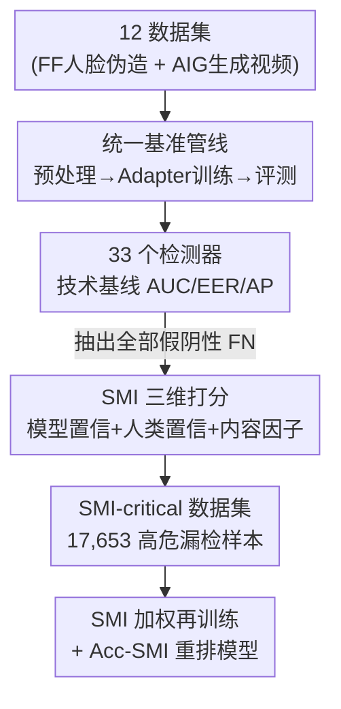

# DeepfakeImpact: A Two-Stage Benchmark with Real-World Impact in Deepfake Detection

**会议**: CVPR 2026  
**论文**: [CVF Open Access](https://openaccess.thecvf.com/content/CVPR2026/html/Gong_DeepfakeImpact_A_Two-Stage_Benchmark_with_Real-World_Impact_in_Deepfake_Detection_CVPR_2026_paper.html)  
**代码**: https://github.com/explorerZH/DeepfakeImpact-Stage1 (有，Stage I)  
**领域**: AI安全 / Deepfake检测基准  
**关键词**: deepfake检测, 评测基准, 社会危害度, SMI指标, 代价敏感学习

## 一句话总结
这是一个把 deepfake 检测从"测得准不准"重新定义为"对社会有没有用"的两阶段基准：Stage I 在 12 个数据集上统一复现 33 个 SOTA 检测器，Stage II 提出 Social Misjudgment Impact（SMI）指标给每个漏检样本打"社会危害分"，构建 17,653 个高危漏检样本组成的 SMI-critical 数据集，并发现技术指标领先的模型在 SMI 评测下常常翻车。

## 研究背景与动机
**领域现状**：deepfake 检测这几年从 CNN 分类器走到了利用面部不一致、频域伪影、时序一致性的各类方法，评测也从早期碎片化的各做各的，统一到了 DeepfakeBench 这样的标准化框架，主流靠 Accuracy / AUC / EER 这些技术指标排名。

**现有痛点**：所有现有基准都默认"每个错误一样重"——把一个漏掉的高危政治人物换脸视频，和一个漏掉的无关紧要的低质伪造，算成同样一次错误。于是社区一路在优化"技术上更准"的检测器，却没人测它"实际上能不能挡住最有害的那批伪造"。

**核心矛盾**：技术指标和社会价值之间存在错位。作者举了个尖锐的例子：一个 95% 准确率但恰好漏掉了社会危害最大的那 5% 伪造的检测器，可能比一个 85% 准确率但能稳稳抓住高危伪造的检测器更危险。纯准确率导向的范式，根本捕捉不到不同失败的社会后果差异。

**本文目标**：把 deepfake 检测从"纯技术问题"重新定位为"社会-技术问题"，让算法性能必须透过"潜在危害削减"这个镜头来衡量。拆成两个子问题——(1) 先有一个公平、可复现、覆盖广的技术基线；(2) 在此之上量化"漏检一个样本到底有多大社会危害"，并据此重排模型。

**切入角度**：在所有错误类型里，假阴性（FN，把假的判成真）才是真正会造成社会危害的——漏掉的伪造会传播谣言甚至引发公众恐慌。所以作者把社会感知评测的焦点专门收缩到 FN 样本上，而不是泛泛地给所有错误加权。

**核心 idea**：定义一个可量化的 SMI 分数，从"模型有多自信地判错""人类有多容易被骗""视频本身传播力多强"三个维度刻画每个漏检样本的社会危害，用它去加权训练损失和评测准确率，把"测得多准"换成"对社会多有益"。

## 方法详解

### 整体框架
DeepfakeImpact 是一个**评测基准**而非一个新检测模型，整条管线分两个互补阶段：Stage I 把 33 个检测器在统一的数据预处理 / 训练 / 评测流程里跑出标准化技术基线；Stage II 从 Stage I 的所有假阴性里挑出高危样本，用 SMI 指标给它们打分构成 SMI-critical 数据集，再用 SMI 加权的损失重训、用 SMI 加权的准确率重评。两阶段的衔接点就是"Stage I 产出的全部 FN 样本"——它既是 Stage I 的副产物，又是 Stage II 的原料。

### 关键设计

**1. 统一基准管线（Adapter 架构）：让 33 个模型在同一把尺子下可比**

deepfake 检测早期基准最大的问题是各做各的预处理和指标，模型之间根本不可比。Stage I 用一套统一管线解决：人脸伪造数据集用 dlib 做人脸检测、裁剪、对齐到 $256\times256$，AIG 视频统一采样，每个视频固定均匀采 32 帧；所有数据集都被切成 train/val/test 并写成带 JSON 元数据（视频/帧/landmark/mask 路径）的标准格式。关键的工程抽象是 **Adapter 模块**——每个检测方法被包进一个 adapter，由它负责模型构建、损失定义、前向传播和指标计算，再配一份独立的 Config YAML。这样帧级（image）和视频级（video）方法能在同一 epoch、同一采样/增广策略下公平评测。管线还刻意把三件事拆开做到位：**统一粒度**（帧级、视频级结果分别独立评测，不混在一起比）、**任务整合**（同时支持人脸伪造和 AI 生成视频检测两个相关但不同的任务，既看域内也看跨域泛化）、**模块化可扩展 + 可视化**（自动记录 ROC 曲线、混淆矩阵、t-SNE、热力图和误分类样本）。

**2. SMI 指标：用三维度把"漏检一个样本有多大社会危害"量化成一个分数**

这是全文的核心。Stage I 跑完后，作者先把所有数据集上的假阴性样本（被任意模型判成真的伪造）汇总起来，再对每个样本 $i$ 算三个互补的危害维度：

- **模型置信度** $\text{SMI}_{\text{model},i}$：所有判错的模型对"真"标签的平均预测概率，$\text{SMI}_{\text{model},i} = \frac{1}{M}\sum_{m=1}^{M} p_i^{(m)}(\text{real})$，其中 $M$ 是判错该样本的模型数。模型越自信地把它当真，说明它越"骗得过算法"。
- **人类置信度** $\text{SMI}_{\text{human},i}$：请 $H=10$ 个无 AI 背景的普通人对每个 FN 样本打一个"它是真的概率" $s_i^{(h)}\in[0,1]$，取平均 $\text{SMI}_{\text{human},i} = \frac{1}{H}\sum_{h=1}^{H} s_i^{(h)}$。它衡量这个伪造对普通观众的欺骗性，是纯算法指标给不了的社会维度。
- **内容因子** $\text{SMI}_{\text{content},i}$：用视频时长 $L_i$ 和分辨率 $R_i$ 归一化后取均值，$\text{SMI}_{\text{content},i}=\frac{1}{2}\left(\frac{L_i-L_{\min}}{L_{\max}-L_{\min}}+\frac{R_i-R_{\min}}{R_{\max}-R_{\min}}\right)$，其中 $L_{\min}=2s,\ L_{\max}=120s,\ R_{\min}=320\times240,\ R_{\max}=4K$。越长、越高清的视频传播力越强、社会欺骗潜力越大。

三者等权平均得到总分：

$$\text{SMI}_i = \frac{1}{3}\Big(\text{SMI}_{\text{model},i}+\text{SMI}_{\text{human},i}+\text{SMI}_{\text{content},i}\Big)$$

这套设计的巧妙在于把"难度"和"社会重要性"耦合进同一个标量——既骗得过算法、又骗得过人、还传得开的样本，分数自然最高，正是最该被检测器抓住的那批。

**3. SMI-aware 训练与评测：把危害分注入损失和准确率，重排模型**

光有分数不够，作者把它接进训练和评测两端。训练端用 **SMI 加权交叉熵**：

$$\mathcal{L} = -\frac{1}{N}\sum_{i=1}^{N}\text{SMI}_i\cdot\Big[y_i\log\hat{y}_i+(1-y_i)\log(1-\hat{y}_i)\Big]$$

高 SMI 样本在损失里权重更大，逼模型把注意力放到社会关键样本上，本质是一种代价敏感学习，但代价来自"社会危害"而非常见的类别不平衡。评测端把传统准确率改成 **Acc-SMI**：$\text{Acc-SMI}=\frac{\sum_{i=1}^{N}\text{SMI}_i\cdot\mathbb{I}(\hat{y}_i=y_i)}{\sum_{i=1}^{N}\text{SMI}_i}$，即按 SMI 加权后的命中率——在高危样本上判对，得分才高。于是排名标准从"在所有样本上多准"变成"在最危险的样本上多准"，这正是技术指标领先的模型在 SMI 下翻车的原因。

## 实验关键数据

### Stage I：标准化技术基准
覆盖 33 个 2017–2025 年的 SOTA 检测器、12 个数据集（5 个人脸伪造 FF + 7 个 AI 生成 AIG）。每个模型在一个数据集上跑 20 次取 top-3 AUC 平均，主表报 AUC，跨域时人脸伪造在 FF++ 上训、测其余 4 个数据集。

**人脸伪造数据集（Top-3 AUC，节选代表性模型）**：

| 模型 | 类型 | 域内 Avg | 跨域 Avg | 说明 |
|------|------|---------|---------|------|
| SSTGNN | 视频级 | 0.9766 | **0.8912** | 跨域泛化最强 |
| FTCN | 视频级 | 0.9270（域内 FF++ 0.8041） | 0.8828 | 域内 FF++ 单项最佳 0.9583 |
| TALL | 视频级 | 0.9548 | 0.8071 | UADFV 域内满分 |
| UIA-ViT | 帧级 | **0.9578** | **0.8040** | 帧级最鲁棒 |
| Effort | 帧级 | 0.9562 | 0.8534 | 帧级跨域强 |
| Capsule | 视频级 | 0.9412 | 0.6590 | 跨域大幅掉点 |

域内→跨域的平均掉幅达 7–12%，揭示显著的域偏移挑战；视频级整体跨域比帧级更稳，说明时序建模对域偏移有正则化作用。

**AIG 数据集（Top-3 AUC，全跨域，Youku-mPLUG+ZeroScope 训练）**：

| 模型 | 类型 | Avg AUC | 亮点 |
|------|------|---------|------|
| SSTGNN | 视频级 | **0.8591** | 跨多样 AIG 内容泛化最强 |
| Effort | 帧级 | 0.8583 | Kinetics-400 单项 0.9174 最佳 |
| EfficientNet | 帧级 | 0.8348 | 帧级综合最佳 |
| XceptionNet | 帧级 | 0.8042 | — |

有趣的反转：视频级在人脸伪造里的优势到了 AIG 上明显减弱（帧级 Effort 几乎追平最强视频级），说明 AIG 内容的时序伪影和人脸伪造差异很大，时序建模的相对优势缩水；同时 AIG 上 top 与平均的差距更窄（约 0.1 vs 人脸伪造 0.15），表明 AIG 是更"均匀地难"的任务。

### Stage II：社会感知基准（关键发现）
汇总全部误分类伪造样本得到 **SMI-critical 数据集，共 17,653 个**（5,673 来自人脸伪造 + 11,980 来自 AIG）。所有基线用 SMI 加权损失重训、按 Acc-SMI 重评，出现明显的排名重排：

| 现象 | 模型 | 说明 |
|------|------|------|
| 技术强、SMI 也强 | Effort（帧级）、SSTGNN（视频级） | 在高危漏检样本上仍稳，真鲁棒 |
| 技术强、SMI 翻车 | UIA-ViT、FTCN | 传统 AUC 有竞争力，社会感知评测下大幅退化 |
| 技术中、SMI 反超 | EfficientNet（帧级，整 SMI-critical 集上 Acc-SMI 最高） | 整体检出率高的模型反而搞不定人类最易被骗的样本 |

核心结论：只为常规指标优化的模型，可能无意中偏向更容易的检测任务，从而恰好漏掉传播风险最大、社会危害最重的伪造视频。

### 消融实验

**数据增广对 Acc-SMI 的相对影响（Table 5，节选）**：

| 配置 | SIA(帧) | XceptionNet(帧) | SSTGNN(视频) | STIL(视频) |
|------|---------|-----------------|--------------|------------|
| wo all（去全部增广） | -1.20% | -2.20% | **+2.40%** | **+4.50%** |
| wo gab（去高斯模糊） | +0.40% | +0.80% | +0.90% | +2.00% |
| wo iss（去各向同性缩放） | -0.40% | -0.60% | **-0.90%** | **-1.20%** |

关键发现：去掉全部增广在帧级一致掉点（依赖增广做正则），却在视频级反而涨点，说明对某些时空架构"少即是多"，激进增广反而干扰其内在时序建模；去高斯模糊对所有帧级模型有益（它会破坏帧处理），而各向同性缩放对视频级关键（保持时空一致性）。

**Backbone 与预训练消融（Table 6，Acc-SMI）**：

| Backbone | SSTGNN | FaceXray | Core | SPSL |
|----------|--------|----------|------|------|
| ResNet-50 | **0.741** | 0.304 | 0.245 | 0.458 |
| ResNet-50 wo 预训练 | 0.705 | 0.247 | 0.235 | 0.410 |
| Xception | 0.729 | 0.299 | 0.240 | **0.462** |

去掉预训练权重在所有 backbone 上一致大幅掉点；没有哪个 backbone 通吃所有模型（ResNet-50 利好 SSTGNN，但对 FaceXray 和 ResNet-34 打平），且同一模型不同预训练 backbone 间差距往往很小（SSTGNN 全落在 [0.729, 0.741]）。

### 关键发现
- 漏检的高危样本（人类觉得最像真的那批）是社会危害的主要来源，而它恰恰是技术指标最容易忽略的——这正是 SMI 想补的盲区。
- SMI 加权交叉熵的 t-SNE 可视化显示，常规交叉熵下"已检出 / 未检出伪造"特征严重重叠，SMI 损失能把它们有效分开。
- 时序建模在人脸伪造上是优势，到 AIG 上优势消失，提示两类伪造需要不同的特征表示。

## 亮点与洞察
- **把"社会危害"做成可优化的标量**：SMI 最聪明的地方是同时吃进"模型置信+人类置信+内容传播力"三个正交维度，让"难度"和"社会重要性"自然耦合——这套思路可迁移到任何"错误代价不等"的安全检测任务（如垃圾内容、诈骗识别），只要能定义出对应的危害维度。
- **引入真人评分作为不可替代的社会维度**：10 个无 AI 背景的人给出的感知概率，是纯算法指标永远拿不到的信号，把"人类会不会被骗"显式写进了评测。
- **基准本身的反转结论很有冲击力**：技术 AUC 领先的 UIA-ViT、FTCN 在 SMI 下翻车，中等的 EfficientNet 反超——这直接证明了"刷榜准确率"和"真正有社会价值"是两回事，对整个领域的评测范式是一记提醒。

## 局限与展望
- **SMI 的权重设计偏经验**：三个维度等权平均、内容因子只用时长和分辨率线性归一，缺乏对"为什么是这三个、为什么等权"的理论论证；⚠️ 不同应用场景下危害权重可能差异巨大（如政治人物 vs 普通人），固定权重未必普适。
- **人类置信度成本与规模受限**：只请了 10 个标注者，且需对每个 FN 样本逐一打分，难以随数据规模扩展，人群代表性也有限。
- **代码只放出 Stage I**：仓库名为 DeepfakeImpact-Stage1，Stage II 的 SMI 打分 / 加权训练复现路径尚不明确，⚠️ 以官方后续发布为准。
- **改进方向**：可探索可学习的 SMI 维度权重、用更大规模 / 更有代表性的人群众包、把 SMI 扩展到音视频多模态伪造（呼应 DeepfakeBench-MM 的方向）。

## 相关工作与启发
- **vs DeepfakeBench**：DeepfakeBench 是标准化技术评测的里程碑，统一了多数据集多检测器的流程；本文沿用并扩展它的标准化思路（33 模型 ×12 数据集），但根本区别是在技术评测之上叠了一层社会危害评测，把"how accurate"改成"how socially beneficial"。
- **vs DeepfakeBench-MM / Mega-MMDF**：那条线靠扩大数据规模和模态（音视频，120 万样本）推进基准的全面性；本文不走"更大更多"的路线，而是聚焦检测结果的真实社会后果，提供一个正交的评测视角。
- **vs 可靠性导向研究（迁移性 / 可解释性 / 鲁棒性）**：这些工作关注算法层面的可靠性，仍以模型本身为中心；本文显式把模型决策链接到社会影响和伦理风险，衡量的是"模型的错误在现实中到底有多要紧"。

## 评分
- 新颖性: ⭐⭐⭐⭐⭐ 把 deepfake 检测评测从技术准确率重定义为社会危害削减，SMI 指标与代价敏感评测视角是真正的范式转换
- 实验充分度: ⭐⭐⭐⭐ 33 模型 ×12 数据集 + 多维消融非常扎实，但 Stage II 仅靠图展示、人类标注规模偏小
- 写作质量: ⭐⭐⭐⭐ 动机尖锐、例子有冲击力，但部分公式在 PDF 提取后排版混乱，需对照原文核对
- 价值: ⭐⭐⭐⭐⭐ 提醒整个社区"刷榜准确率≠真有用"，为后续安全导向的 deepfake 检测评测立了新基线

<!-- RELATED:START -->

## 相关论文

- [\[CVPR 2026\] A Sanity Check for Multi-In-Domain Face Forgery Detection in the Real World](a_sanity_check_for_multi-in-domain_face_forgery_detection_in_the_real_world.md)
- [\[CVPR 2026\] AVFakeBench: A Comprehensive Audio-Video Forgery Detection Benchmark for AV-LMMs](avfakebench_a_comprehensive_audio-video_forgery_detection_benchmark_for_av-lmms.md)
- [\[CVPR 2026\] Towards Robust Vision Transformers: Path Dependency Analysis and a Simple Two-Stage Adversarial Training](towards_robust_vision_transformers_path_dependency_analysis_and_a_simple_two-sta.md)
- [\[CVPR 2026\] DFD-HR: Generalizable Deepfake Detection via Hierarchical Routing Learning](dfd-hr_generalizable_deepfake_detection_via_hierarchical_routing_learning.md)
- [\[CVPR 2026\] Decoupling Bias, Aligning Distributions: Synergistic Fairness Optimization for Deepfake Detection](decoupling_bias_aligning_distributions_synergistic_fairness_optimization_for_dee.md)

<!-- RELATED:END -->
