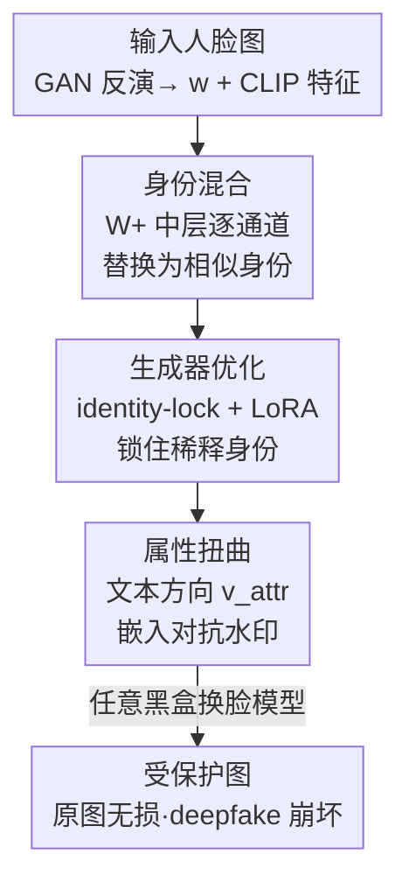

# DeepProtect: Proactive Face-Swapping Defense using Identity Blending and Attribute Distortion

**会议**: CVPR 2026  
**论文**: [CVF Open Access](https://openaccess.thecvf.com/content/CVPR2026/html/Lee_DeepProtect_Proactive_Face-Swapping_Defense_using_Identity_Blending_and_Attribute_Distortion_CVPR_2026_paper.html)  
**代码**: https://github.com/BACKAI/DeepProtect  
**领域**: AI安全 / 人脸隐私保护  
**关键词**: 主动防御, 换脸 deepfake, 身份混合, 对抗水印, StyleGAN W+ 空间  

## 一句话总结
DeepProtect 在上传人脸前给图像「打预防针」：先在 StyleGAN 的 W+ 隐空间把目标身份和若干视觉相似但身份不同的人脸做逐通道混合、稀释掉可被提取的身份特征，再沿文本提示指定的人脸部件（如鼻子、眉毛）方向嵌入不可见对抗水印，使得后续任何换脸模型生成的 deepfake 都被破坏，同时保护图本身几乎看不出改动。

## 研究背景与动机
**领域现状**：身份驱动（identity-driven）的换脸 deepfake 已经能在不重新训练的情况下，把一张源人脸的身份迁移到任意目标图上——它依赖一个身份编码器从源图里抽出身份特征再融进目标。针对这类滥用，防御分两条路线：事后检测（deepfake detection）和**主动防御**（proactive defense）。检测是内容传播后再识别，往往拦不住早期扩散；主动防御则在上传前就在源图上做手脚，阻断身份特征被正确提取，是离线、无需实时处理的「源头保护」。

**现有痛点**：现有主动防御（基于噪声、补丁、属性编辑、化妆迁移）有两类毛病。一是**留下可见伪影**或明显改变原貌，用户不愿用；二是即便全局地把身份特征推开，推到的位置常常对应「另一个长得很像的人」，于是生成出来的 deepfake 在感知上仍和原图接近，**没有真正破坏视觉质量**，隐私其实没保住。还有一类近期的隐空间身份混淆方法，要做两阶段的全 StyleGAN 优化，开销巨大，且只能做全局身份操纵。

**核心矛盾**：视觉保真度（保护图要尽量像原图）和身份破坏强度（生成的 deepfake 要尽量崩）是一对天然 trade-off——改得越狠，原图越难看；改得越轻，deepfake 越完好。现有方法要么牺牲保真度，要么破坏不够。

**本文目标**：在严格的不可感知扰动预算下，同时做到「保护图几乎无损」和「下游 deepfake 被显著破坏」，并且对各种黑盒换脸模型都通用、计算开销可落地部署。

**切入角度**：作者把防御拆成「全局稀释 + 局部扭曲」两层互补。先全局把身份「兑稀」，让身份本身变得模糊不收敛到任何单一个体；身份被稀释后，约束变松，再在身份编码空间里沿用户指定属性方向做局部扭曲就能做得更显著而不破坏整体观感。

**核心 idea**：用「W+ 空间逐通道身份混合 + 文本驱动的属性方向对抗水印」替代「全局推开身份特征」，把保真度和破坏强度同时拉满。

## 方法详解

### 整体框架
DeepProtect 是一个两阶段主动防御 pipeline。输入是一张待保护的人脸图，输出是一张视觉上几乎不变、但任何换脸模型拿去生成 deepfake 都会失败的「受保护图」。

第一阶段**身份混合**：用 GAN inversion 把输入图反演成 W+ 隐码 $w$，同时抽取它的 CLIP 图像特征 $c^I$；用 $c^I$ 从一个预建特征库里检索视觉相似但身份不同的样本，在身份关键的中间风格层上逐通道把 $w$ 替换成候选里最相似的风格向量，得到被稀释的隐码 $\tilde{w}$。为防止稀释后的图在生成器优化中又「漂回」原身份，用 identity-lock 损失只微调生成器的中间层（且用 LoRA 进一步压缩可训练参数），得到一张身份被兑稀、外观仍和原图一致的图。第二阶段**属性扭曲**：根据用户文本提示（如「nose」）在身份空间里检索出对应属性方向 $v_{attr}$，再沿这个方向迭代嵌入受 $\ell_\infty$ 约束的不可见对抗水印 $W_{attr}$，让 deepfake 结果在该部件上出现可控的语义扭曲。推理时用一个身份编码器作代理（surrogate），换脸模型本身保持黑盒。

### 关键设计

**1. 身份混合：在 W+ 中层逐通道把身份「兑稀」，而不是把它推向另一个人**

针对「全局推开身份反而推到另一张相似脸」的痛点，DeepProtect 不做整体平移，而是在 StyleGAN 的扩展隐空间 W+ 里做逐通道融合。一个 $w$ 由 18 个 512 维风格向量组成，其中第 3–7 的中间层已知编码身份关键信息。方法先用 CLIP 检索构建候选集：保留与输入 CLIP 特征余弦相似度高于阈值 $\tau$ 的样本隐码，$C = \{w_i \mid \cos(c^I, c^I_i) \ge \tau\}$，保证候选在外观上像输入但身份不同。然后对中间层逐层把风格向量替换成候选集里最相似的那个：

$$\tilde{w}[l] = \arg\max_{w_j \in C} \cos\big(w[l], w_j[l]\big)$$

其余层保持原样。这样融合了多个语义相似身份的特征，身份被「兑稀」到不收敛于任何单一个体，而不是漂到某张相似脸上——这正是它比全局平移更难被换脸模型还原、又能保住外观的原因。只动中间层也大幅降低了优化开销。

**2. 生成器优化：用 identity-lock 损失 + LoRA 锁住稀释后的身份，防止「漂回」原貌**

把原隐码换成混合隐码 $\tilde{w}$ 会打破身份一致性，但纯做像素/感知重建优化时，生成器可能为了贴近原图又把原身份特征重新引回来，让前一步的稀释功亏一篑。为此引入 identity-lock 损失，约束优化后生成器的输出在身份特征上贴近「初始稀释身份」而非原身份：

$$L_{\text{id-lock}} = 1 - \cos\big(E_{id}(G_{\text{init}}(\tilde{w})), E_{id}(G(\tilde{w}))\big)$$

其中 $E_{id}$ 是预训练身份编码器，$G_{\text{init}}$ 与 $G$ 分别是初始和微调后的生成器。该损失惩罚偏离稀释身份的方向，避免过拟合把原身份线索带回来。由于只有中间层需要动，方法冻结粗层和细层的仿射变换并把它们的输出在初始化时缓存复用；即便如此仍需约 11M 可训练参数，于是进一步对仿射变换模块上 LoRA：把权重 $\theta_0 \in \mathbb{R}^{512\times b}$ 分解为 $\theta_1 \in \mathbb{R}^{512\times r}$、$\theta_2 \in \mathbb{R}^{r\times b}$（秩 $r \ll \min(512,b)$，实验取 $r=8$），冻结 $\theta_0$ 只更新低秩项，总目标为

$$\theta^* = \arg\min_{\theta=\{\theta_1,\theta_2\}} L_2 + L_{\text{LPIPS}} + \lambda_{\text{id-lock}} L_{\text{id-lock}}$$

让保真重建和身份锁定在同一目标里平衡，参数和算力都大幅下降。

**3. 属性扭曲：文本提示 → order-aware LDA 求属性方向 → 对抗水印定向破坏**

身份稀释只是「松土」，真正破坏 deepfake 的是这一步：让用户用文本指定要破坏哪个部件（眼睛/鼻子/眉毛/嘴唇），并在身份编码空间里把它定向扭曲。难点在于身份空间是高度纠缠的，没有现成的部件方向。方法分两步求方向。其一**文本引导检索**：用 FaRL（CLIP 对齐的人脸表示模型）把文本提示编成特征 $c^T$，与特征库里每张图的 CLIP 特征做点积打分 $s_i = c^I_i \cdot c^T$，用 FAISS 近似最近邻排序，取该属性表达最强的 top-$m$ 和最弱的 bottom-$m$ 两组身份特征 $Z^{id}_k$。其二**order-aware LDA 求方向**：在 top/bottom 两组上解一个带序保持正则的判别分析目标

$$v_{attr} = \arg\max_v \frac{v^\top S_B v}{v^\top (S_W + \lambda_R R)v}$$

$S_B$、$S_W$ 是组间/组内散度矩阵，正则项 $R$ 用 CLIP 打分的排名差 $|\text{rank}_{\text{CLIP}}(i)-\text{rank}_{\text{CLIP}}(j)|$ 加权特征差，使得身份空间里的投影方向保留 CLIP 语义里「该属性由强到弱」的相对顺序（这是它相比普通 LDA 的关键改进，用 LSQR 求解广义瑞利商）。拿到方向 $v_{attr}$ 后做**对抗水印**：目标方向取 $v_{\text{target}} = -\text{sign}(p)\cdot v_{attr}$（$p$ 是身份特征 $z^{id}$ 在 $v_{attr}$ 上的投影，负号鼓励偏离原始属性状态），用符号梯度迭代更新水印 $W_{attr} \leftarrow W_{attr} + \alpha\cdot\text{sign}(\nabla_{W_{attr}} L)$，目标为最大化 $L(z_t, v_{\text{target}}) = z_t \cdot v_{\text{target}}$，并把水印投影到 $\ell_\infty$ 球（$|W_{attr}|\le \epsilon$，实验 $\epsilon=0.02$）保证不可感知。因为身份已被稀释，约束变松，水印能在身份空间里造成显著语义偏移却几乎不留可见痕迹。

### 损失函数 / 训练策略
生成器优化目标为 $L_2 + L_{\text{LPIPS}} + \lambda_{\text{id-lock}} L_{\text{id-lock}}$，仅更新 LoRA 低秩参数。关键超参：候选阈值 $\tau=0.75$，$\lambda_{\text{id-lock}}=0.1$，序保持正则权重 $\lambda_R=1$，LDA 每组 $m=30$，LoRA 秩 $r=8$，扰动预算 $\epsilon=0.02$（$\ell_\infty$）。特征库由 VGGFace2-HQ 的 4,605 个身份构建（$N=4605$，预存隐码 / CLIP 特征 / 身份特征三种）。StyleGAN2 在 FFHQ 上预训练，学习率 $3\times10^{-4}$，结果按 5 次运行平均。

## 实验关键数据

### 主实验
两个数据集：CelebA-HQ 与 VGGFace2-HQ；五个换脸模型：SimSwap / FaceDancer / BlendFace / FaceSwapper / DiffFace；指标 PSNR、SSIM、ISM（身份相似度，↓更好）、DSR（防御成功率，↑更好）。下表为 CelebA-HQ 上对 SimSwap 生成 deepfake 的对比（† 比较原图-保护图，‡ 比较两者的 deepfake）：

| 方法 | 类型 | PSNR‡ ↓ | SSIM‡ ↓ | DSR↑ |
|------|------|---------|---------|------|
| CMUA-Watermark | 噪声 | 27.10 | 0.851 | 41.0 |
| DF-RAP | 噪声 | 26.73 | 0.840 | 42.7 |
| FaceShield | 噪声 | 22.78 | 0.752 | 81.6 |
| DiffAM | 化妆 | 23.11 | 0.779 | 79.7 |
| WDP | 化妆 | 29.04 | 0.900 | 38.6 |
| **DeepProtect (Attribute)** | 本文 | 26.01 | 0.824 | 60.5 |
| **DeepProtect (Combined)** | 本文 | **21.09** | **0.710** | **94.8** |

完整版（Combined）在五个换脸模型上 DSR 均达 92–97%（SimSwap 94.8、FaceDancer 94.3、BlendFace 92.2、FaceSwapper 94.7、DiffFace 96.7），全面领先所有 baseline，且生成 deepfake 的 PSNR/SSIM 最低，说明破坏最彻底。源端评估（Table 1）里 Combined 取得最低 ISM（CelebA-HQ 0.201）同时保持 PSNR 32.02 / SSIM 0.902 的高保真——身份保护最强而画质几乎无损。

人类主观评测（10 名参与者，5 分 MOS）进一步佐证保真-破坏的兼顾：

| 方法 | 源图 MOS↑ | Deepfake MOS↓ |
|------|-----------|----------------|
| DiffAM | 3.45 | 3.20 |
| FaceShield | 4.7 | 3.82 |
| **DeepProtect** | **4.7** | **1.35** |

DeepProtect 的保护图观感与最好的 FaceShield 持平（4.7），但生成的 deepfake 被打到 1.35（越低越崩），远优于 FaceShield 的 3.82。

### 消融实验
在 CelebA-HQ + SimSwap 上逐组件消融（PDS = 原图-保护图的 SSIM 减去两者 deepfake 的 SSIM，越高代表「破坏强且画质损失小」）：

| 身份混合 | 生成器优化 | 属性扭曲 | SSIM† ↑ | ISM↓ | PDS↑ |
|:---:|:---:|:---:|---------|------|------|
| ✓ | | | 0.584 | 0.241 | -0.191 |
| ✓ | ✓ | | 0.915 | 0.249 | 0.136 |
| | | ✓ | 0.944 | 0.419 | 0.120 |
| ✓ | | ✓ | 0.571 | 0.194 | -0.196 |
| ✓ | ✓ | ✓ | 0.902 | 0.201 | **0.192** |

### 关键发现
- **生成器优化是保真度的命门**：只做身份混合时 SSIM 仅 0.584（画质崩）；加上生成器优化后 SSIM 飙到 0.915 且身份破坏不变（ISM 0.249）。去掉生成器优化（第 4 行）即便有属性扭曲，SSIM 仍只有 0.571、PDS 为负，说明 identity-lock + LoRA 优化是「在稀释身份的同时保住外观」的关键。
- **两阶段互补、缺一不可**：只做属性扭曲 ISM 仅 0.419（身份破坏弱），全组合后 ISM 降到 0.201、PDS 升至 0.192（全表最高），印证「先全局稀释松土、再局部定向扭曲」的设计逻辑。
- **轻量且鲁棒**：完整流程 FLOPs 仅 126G、推理 12s、可训练参数远低于 DiffAM（113.67M）等扩散类方法；身份混合 <1s、生成器调优约 10s、属性扭曲 <1s。在高斯噪声、模糊、JPEG 压缩（QF=25）及自适应净化攻击下 DSR 仍保持 >93%（自适应攻击下 93.2%）。
- **超越换脸**：对扩散式 text-to-video deepfake 同样能拉开身份差异，泛化到更广的 deepfake 场景。

## 亮点与洞察
- **「兑稀」而非「平移」身份**：逐通道融合多个相似身份、让身份不收敛到任何单一个体，从根上避免了「推到另一张相似脸、deepfake 仍逼真」的老问题——这是主动防御里一个很巧的视角转换。
- **identity-lock 反直觉地「锁住被破坏的状态」**：通常优化是让结果贴近原图，这里却用损失把生成器钉在「稀释后的身份」上，防止重建过程把原身份带回来，是把 trade-off 拆成「先破坏再锁定」的关键。
- **文本可控的局部破坏带来可追溯性**：用户指定破坏哪个部件，使 deepfake 输出带上语义线索，可用于事后检测和溯源——防御顺手留下了「指纹」，思路可迁移到其他生成内容的主动水印。
- **order-aware LDA**：在纠缠的身份空间里用 CLIP 排名差做正则，既求判别方向又保语义强弱顺序，是一个可复用的「无监督找语义方向」技巧。

## 局限与展望
- 方法依赖 GAN inversion（E4E）+ 预训练 StyleGAN2，受限于反演质量与生成器的人脸分布，对极端姿态/遮挡/分布外人脸的反演误差可能传导到防御效果（⚠️ 论文用真实场景图验证了鲁棒性，但未量化反演失败率）。
- 特征库需预建（VGGFace2-HQ 4,605 身份），跨数据集虽声称无需重建，但特征库的身份多样性会影响候选集质量，库偏置可能影响稀释方向。
- 推理时用身份编码器作代理、换脸模型黑盒，属性方向 $v_{attr}$ 的「最优破坏方向」依赖代理与真实模型的一致性；面对与代理差异极大的新换脸架构时效果如何，正文未充分展开。
- 大量关键细节（CLIP 检索的合理性、阈值选择、扩展定性结果）放在补充材料，正文不足以完全复现。

## 相关工作与启发
- **vs 噪声/补丁类（CMUA-Watermark、DF-RAP、FaceShield）**：它们靠对抗噪声扰动，在平坦区域难以自然保护、且对身份驱动换脸破坏弱（DSR 多在 40 左右，FaceShield 虽高但靠重型扩散+检测器、FLOPs 593G）。DeepProtect 在隐空间操纵身份本身，DSR 达 94.8 且开销仅 126G FLOPs。
- **vs 化妆/编辑类（AMT-GAN、CLIP2Protect、DiffAM、WDP）**：它们破坏强但明显改变原貌（DiffAM 源 MOS 仅 3.45），且 DiffAM 训练新风格需 4 小时以上。DeepProtect 在保住源图观感（MOS 4.7）的同时把 deepfake MOS 压到 1.35。
- **vs 近期隐空间身份混淆**：该类方法做两阶段全 StyleGAN 优化、开销大且只能全局操纵。DeepProtect 只调中间层 + LoRA、并加入文本驱动的局部属性扭曲，兼顾效率与可控的局部破坏。

## 评分
- 新颖性: ⭐⭐⭐⭐⭐ 「全局身份兑稀 + 文本驱动局部对抗水印」的两阶段组合，以及 identity-lock、order-aware LDA 都是有辨识度的新设计。
- 实验充分度: ⭐⭐⭐⭐⭐ 2 数据集 × 5 换脸模型 × 7 baseline，含主观评测、复杂度、鲁棒性与跨模态泛化，覆盖全面。
- 写作质量: ⭐⭐⭐⭐ 方法逻辑清晰、公式完整，但大量细节外放补充材料，正文略紧。
- 价值: ⭐⭐⭐⭐⭐ 人脸隐私主动防御是高需求场景，轻量可部署 + 强鲁棒性使其实用性突出。

<!-- RELATED:START -->

## 相关论文

- [\[CVPR 2026\] No Way To Steal My Face: Proactive Defense Against Identity-Preserving Personalized Generation](no_way_to_steal_my_face_proactive_defense_against_identity-preserving_personaliz.md)
- [\[CVPR 2026\] Bridging Privacy and Provenance: Traceable Virtual Identity Generation](bridging_privacy_and_provenance_traceable_virtual_identity_generation.md)
- [\[CVPR 2026\] Frequency-domain Manipulation for Face Obfuscation](frequency-domain_manipulation_for_face_obfuscation.md)
- [\[CVPR 2026\] Logit-Margin Repulsion for Backdoor Defense](logit-margin_repulsion_for_backdoor_defense.md)
- [\[CVPR 2026\] Reinforcement-Guided Synthetic Data Generation for Privacy-Sensitive Identity Recognition](reinforcement-guided_synthetic_data_generation_for_privacy-sensitive_identity_re.md)

<!-- RELATED:END -->
