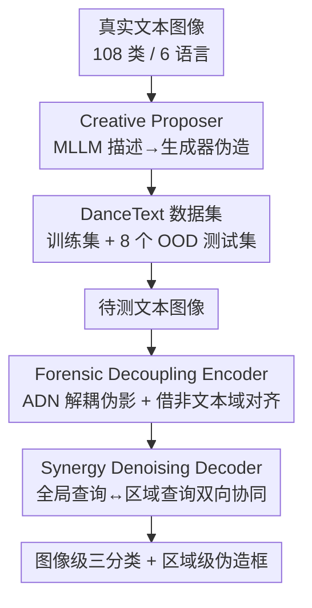

# Detect Any AI-Counterfeited Text Image

**会议**: CVPR 2026  
**论文**: [CVF Open Access](https://openaccess.thecvf.com/content/CVPR2026/html/Qu_Detect_Any_AI-Counterfeited_Text_Image_CVPR_2026_paper.html)  
**代码**: https://github.com/qcf-568/DanceText  
**领域**: AI安全  
**关键词**: AI伪造文本图像检测, 取证溯源, 伪影解耦, 篡改定位, 跨域泛化

## 一句话总结
针对生成式 AI 伪造文本图像的检测，作者用 MLLM 驱动的 Creative Proposer 流水线造出了规模超前作 100 倍的 DanceText 数据集，并提出 DS-Net——靠"伪影-内容解耦编码器"借非文本域海量假图学通用伪影、靠"协同去噪解码器"让图像级分类和区域级定位互相纠错，在跨生成器/跨语言/真实软件等八个 out-of-domain 测试集上把平均 F1 从 49.4 抬到 53.9。

## 研究背景与动机

**领域现状**：扩散模型和 Qwen-Image 这类多模态大模型已经能轻松伪造任意类型的文本图像（整图合成、区域编辑、区域擦除），这些假票据、假文档、假证件被用于诈骗和谣言传播，构成现实的安全威胁。检测方向此前有 T-SROIE、T-IC13、OSTF 等基准和 S3R、DAF 等模型。

**现有痛点**：① **数据侧**——已有数据集规模都不到 2000 张伪造图，图像类型单一（只有票据或招牌）、语言单一（只有英文）、生成器陈旧（基本是 2023 年前的），完全没覆盖商业 App、生成式 MLLM、区域擦除这些新型伪造手段。② **模型侧**——每个生成器留下的伪影和图像内容、风格强耦合，检测模型很容易过拟合到训练时见过的"特定生成器痕迹 + 内容虚假相关"，换个没见过的生成器或图像类型就失效。而通用 DeepFake 检测器只会做图像级二分类，做不了文本伪造必需的区域定位。

**核心矛盾**：要训出"对任意生成器、任意图像类型都鲁棒"的检测器，但**可用的文本图像生成器数量有限**，伪影多样性不够，模型必然过拟合；同时分类任务和定位任务被以往方法割裂处理，无法像人类专家那样全局-局部互证。

**本文目标**：分解为两个子问题——(1) 造一个在图像类型、生成器、伪造范式、语言上都全面覆盖的大规模数据集；(2) 设计一个能泛化到未见风格和生成器的鲁棒检测器。

**切入角度**：作者观察到两件事——其一，非文本域（如 Community Forensics 有 270 万张、4800+ 生成器）的假图资源远比文本域丰富，可以借来补伪影多样性；其二，人类鉴定专家是"看到全局异常就去抠局部、发现局部伪造就回头改全局判断"的双向推理。

**核心 idea**：数据上用 MLLM 把真实图像"描述成富语义 prompt"再喂给生成器，造出贴近真实世界的伪造；模型上把"伪影从内容里解耦出来 + 强制图像级分类与区域级定位双向协同"。

## 方法详解

整篇工作由两块组成：**Creative Proposer 流水线**（造数据，产出 DanceText 数据集）和 **DS-Net 检测模型**（做检测）。下面先讲数据怎么造，再讲检测器的两个核心组件。

### 整体框架

数据侧：Creative Proposer 解决"怎么控制生成器造出符合要求的逼真假图"。它分两条支线——整图合成支线让 MLLM 把真实图描述成详细 prompt 再交给文生图模型；区域编辑/擦除支线先 OCR 抽文字、再让 MLLM 提出语义合理的替换/删除、最后受控 inpainting 落地。用 45～49 个生成器对 144,657 张真实图加工，得到 793,731 张伪造图，切成 1 个训练集 + 8 个 out-of-domain 测试子集。

检测侧：DS-Net 输入一张待测文本图，输出"图像级三分类（真 / 整图生成 / 区域编辑）+ 区域级伪造框定位"。它串起两个组件——**Forensic Decoupling Encoder（取证解耦编码器）**先把生成器伪影从语义内容里剥出来、并借非文本域假图对齐到统一伪影空间；**Synergy Denoising Decoder（协同去噪解码器）**再用一个全局取证查询和区域定位查询在 transformer 解码层里反复交互，让全局判断和局部定位互相纠错。

### 关键设计

**1. Creative Proposer：用 MLLM 把"造假"做得贴近真实世界**

痛点很直接——以前造假图要么用简单 prompt 整图生成（出来很假），要么随机抠区域乱改（缺乏语义合理性），和真实伪造存在巨大 domain gap。作者的做法是让 MLLM 当"创意提议者"。整图合成有两条子流水线：**Image-to-Text-to-Image** 用 "Describe this image in detail so that I can prompt an image generation model to generate the very same image" 这样的 prompt 让 Gemini-2.5-pro / GPT-4o 把真实图描述成富细节文本，再喂给 Qwen-Image / HunYuan3 等文生图模型合成——MLLM 识别时本身会犯的文字错误，反而被当成天然的"文本内容造假"来增加多样性；**Text-to-Text-to-Image** 则从一个高质量种子 prompt 池出发，迭代让 MLLM 生成新的、保持同等细节度的 prompt，绕开部分生成器的 prompt 长度限制。

区域编辑/擦除走三步：① OCR 抽文字和坐标，用 NLP+规则切成字符/词/短语级语义片段；② 把片段内容、上下文、位置、原图一起给 MLLM，让它提一个语义合理的替换或删除方案；③ 若方案有效，用蓝色边框标出区域消歧、再让 inpainting 模型在执行编辑的同时把这个视觉标记抹掉，最后严格后处理过滤低质结果。关键在于"让 MLLM 用富语义语言描述视觉细节，再被生成器自然消化"，从而产出既覆盖整图合成、又覆盖语义合理区域伪造的真实数据。

**2. Forensic Decoupling Encoder：从内容里剥出生成器无关的伪影，并借非文本域补多样性**

痛点是文本图像生成器太少、伪影多样性不足导致过拟合，而非文本域有海量假图却因内容/任务不对齐没法直接拿来训。作者用一个 ViT 主干 + 并行的 **Artifact Decouple Network（ADN，ConvNeXt 主干）**：ViT 特征容易过拟合，ADN 专门抽"语义无关的通用伪影特征"再去增强 ViT 主特征。ADN 靠三个新损失（都作用在顶层特征图 $F_4$ 上）实现解耦：

- $L_{dnt}$（非文本图解耦）：对真/假非文本图做**内部（空间）和外部（batch 维）patch shuffle**——内部打乱破坏语义、逼 ADN 只盯局部伪影；外部打乱让这些"整图全生成"数据也能做 patch 级独立预测，从而把图像级分类和区域级定位的任务 gap 搭起来。它是 shuffle 后 patch 上的 BCE 损失。
- $L_{dt}$（文本图解耦）：用 L2 损失把编辑区域 $E$ 和擦除区域 $R$ 的特征互相**吸引**、同时**推离**真实区域。因为 $E$ 和 $R$ 的共性是"都有伪影"、差异是"$R$ 没有文字内容"，这就强迫 ADN 学到与内容无关的纯伪影特征。
- $L_{da}$（域对齐）：把文本域和非文本域的特征图在隐空间对齐——吸引两域的伪造区特征、推离真实区，从而学到统一的伪影表征，跨域共享。

ADN 端到端用 $L_{ADN} = L_{dnt} + L_{dt} + L_{da} + L_{ce}$ 训练（$L_{ce}$ 是文本图上的像素级 BCE）。最后 ADN 和 ViT 的多尺度特征经通道注意力融合。⚠️ 论文摘要写 ViT/ConvNeXt 主干，实现细节又写主模型用 Swin-Transformer、ADN 用 ConvNeXt，此处以原文实现为准。

**3. Synergy Denoising Decoder：让图像级分类和区域级定位双向互证**

痛点是以往方法要么从一张带噪的定位图硬推全局判断、要么用两个互不交互的独立头分别做分类和定位，无法模拟"全局异常→细看局部、局部伪造→回改全局"的专家推理。核心是一个可学习的 **Global Forensic Query（GFQ，全局取证查询）**：它在 transformer 解码层里和区域级定位查询**迭代交互**，使最终图像级判断被局部证据告知、同时用全局信息更好地纠正区域查询。解码器改自 DINO 的去噪架构：Object queries 预测可疑区域的边框和伪造类型（擦除 or 编辑），GFQ 产出三分类（真 / 整图生成 / 区域编辑）。整体用 DINO 的损失训练，额外加 GFQ 图像级分类的交叉熵。消融里这一设计带来"1+1>2"的协同增益。

## 实验关键数据

数据集与协议：主模型 backbone 用 Swin-Transformer-small，ADN 用 ConvNeXt-small；AdamW，学习率 8e-6 衰减到 0，batch 32；文本图 resize 到 1024×1536、非文本图 512×512（patch size 32）。图像级三分类用 balanced accuracy（Acc.），区域级用 ICDAR2015 DetEval 的 F1。所有对比模型都在 DanceText-Train 上同 backbone/配置重训，并给原本只能定位的模型加了分类头。

### 主实验：DanceText 八个测试子集（取 AVG 列）

| 方法 | Test F1 | CG F1（跨生成器） | CL F1（跨语言） | RW F1（真实软件） | AVG Acc. | AVG F1 |
|------|---------|-----------------|----------------|------------------|----------|--------|
| ATRR-S3R | 72.9 | 53.2 | 58.8 | 5.2→6.4 | 74.4 | 44.2 |
| CounterNet-S3R | 74.2 | 56.5 | 60.1 | 7.6 | 74.4 | 45.8 |
| FRCNN-DAF | 77.3 | 58.7 | 62.9 | 9.5 | 74.6 | 48.0 |
| CRCNN-DAF | 78.5 | 60.4 | 64.0 | 9.8 | 74.6 | 49.4 |
| **DS-Net (Ours)** | **83.6** | **68.7** | **72.1** | **12.3** | **77.4** | **53.9** |

可见所有模型在 in-domain（Test）和跨图像类型（CT）上都还行，说明数据集自身多样性够；但跨生成器（CG）、跨语言（CL）、尤其真实软件伪造（RW/RWT）上全线掉点——RW 的 F1 普遍只有个位数，因为商业工具用私有生成器且带后处理抹痕迹。DS-Net 在每个 OOD 子集上都领先，AVG F1 比次优 CRCNN-DAF 高 4.5 分。

### 公开数据集对比（同配置重训）

| 方法 | T-IC13 F1 | OSTF F1 |
|------|-----------|---------|
| CounterNet-S3R | 89.0 | 44.5 |
| FRCNN-DAF | 93.8 | 73.7 |
| CRCNN-DAF | 94.4 | 75.0 |
| **DS-Net (Ours)** | **95.5** | **78.2** |

### 消融实验（DS-Net 各组件）

| 配置 | T-IC13 F1 | OSTF F1 | DanceText Acc. | DanceText F1 |
|------|-----------|---------|----------------|--------------|
| (1) Baseline (DINO) | 88.5 | 72.5 | 74.2 | 45.1 |
| (2) w/o 内部 shuffle | 93.8 | 75.5 | 75.6 | 51.6 |
| (3) w/o 外部 shuffle | 91.4 | 74.9 | 75.9 | 50.5 |
| (4) w/o $L_{dnt}$ | 89.3 | 73.8 | 75.8 | 47.9 |
| (6) w/o $L_{da}$ | 90.8 | 75.0 | 76.3 | 49.0 |
| (7) w/o ADN（整个编码器） | 89.3 | 73.8 | 75.4 | 47.3 |
| (8) w/o Synergy（去掉 GFQ） | 95.3 | 77.3 | 75.9 | 51.8 |
| **(9) DS-Net 完整** | **95.5** | **78.2** | **77.4** | **53.9** |

### 关键发现
- **ADN 解耦编码器是泛化主力**：去掉整个 ADN（配置 7），DanceText F1 从 53.9 掉到 47.3（-6.6），是单项掉点最多的之一；三个解耦损失里 $L_{dnt}$（去掉后 47.9）和 $L_{da}$（去掉后 49.0）影响最大，说明"借非文本域假图 + 跨域对齐"确实是泛化的关键。
- **内部 patch shuffle 不可少**：去掉后 DanceText F1 从 53.9 降到 51.6，因为它破坏非文本图的语义、逼模型聚焦局部伪影；外部 shuffle 则负责把"整图级合成数据"用到"区域级定位"上。
- **Synergy 解码器带来协同增益**：去掉 GFQ（配置 8），DanceText F1 51.8→53.9，验证图像级分类和区域级定位的双向交互有"1+1>2"效果。
- **真实软件伪造是最难场景**：所有方法在 RW/RWT 上 F1 都掉到十几甚至个位数，提示私有生成器 + 后处理仍是远未解决的开放问题。

## 亮点与洞察
- **把"MLLM 会犯的识别错误"变废为宝**：Image-to-Text-to-Image 里，MLLM 描述图像时的文字识别错误被直接当成天然的文本内容造假，免费增加了数据多样性——一个很巧的副作用利用。
- **跨域知识迁移的解耦视角**：核心洞察是"伪影"这个信号比"内容"更可迁移。通过 $L_{dt}$ 用 $E$/$R$ 的共性（有伪影）与差异（有无文字）做对比、再用 $L_{da}$ 把文本域和非文本域伪影拉到同一隐空间，把别的领域的 270 万张假图利用起来，这个思路可迁移到任意"目标域假图稀缺、但其他域假图充足"的取证任务。
- **patch shuffle 桥接图像级与区域级**：外部 batch-wise shuffle 让整图级标注的合成数据也能监督 patch 级独立预测，巧妙打通了"分类数据"和"定位监督"之间的鸿沟。

## 局限与展望
- 作者承认真实软件/App 伪造（RW/RWT）仍是难点——私有生成器 + 社媒传输后处理把伪影抹掉了，所有方法都掉到 F1 个位数到十几，远谈不上解决。
- ⚠️ 主干描述前后不一（摘要 ViT，实现 Swin-Transformer），复现时需以官方代码为准。
- 方法重度依赖 OCR 和 MLLM 提议的质量，OCR 漏检或 MLLM 提的编辑不合理都会污染数据；论文把后处理过滤细节放在附录，正文难以判断过滤强度。
- 数据集虽号称六语言，但训练集主要由 Qwen-Image 系生成器贡献（Qwen-Image-Edit-2509 占 45%），训练分布的生成器多样性其实偏窄，跨生成器泛化的提升空间仍大。
- 可改进方向：把 GFQ 的全局-局部协同推广到视频/多页文档级，或引入主动学习针对最难的真实软件伪造定向扩数据。

## 相关工作与启发
- **vs S3R / DAF 系（T-IC13、OSTF 上的旧方法）**：它们擅长定位编辑、但做不好图像级分类、也检测不了文本擦除，且对未见生成器/类型不鲁棒；DS-Net 用统一的三分类 + 定位框架，并通过解耦编码器和协同解码器系统性提升跨域泛化，在 T-IC13/OSTF 同配置下也反超它们。
- **vs 通用 DeepFake 检测器**：通用检测器只做图像级二分类、无法区域定位，不适用于文本伪造的细粒度需求；DS-Net 反过来还借这些非文本域的海量假图来补伪影多样性。
- **vs DINO 检测框架**：DS-Net 以 DINO 去噪解码为基座，但新增 Global Forensic Query 把图像级取证判断显式注入解码过程，把一个通用目标检测器改造成了"全局-局部互证"的取证模型。

## 评分
- 新颖性: ⭐⭐⭐⭐ 数据集规模与覆盖确属跨越式，DS-Net 的解耦+协同两个机制设计有巧思，但模型层面更多是已有技术（DINO/对比解耦/跨域）的组合
- 实验充分度: ⭐⭐⭐⭐⭐ 八个 OOD 子集 + 两个公开数据集 + 9 配置消融，跨生成器/语言/真实软件维度都覆盖到了
- 写作质量: ⭐⭐⭐⭐ 动机和数据贡献讲得清楚，但主干描述前后不一致、部分关键损失细节压在附录
- 价值: ⭐⭐⭐⭐⭐ 提供了该领域第一个真正贴近真实世界的大规模基准 + 开源代码，对 AI 伪造检测的安全研究有显著推动价值

<!-- RELATED:START -->

## 相关论文

- [\[CVPR 2026\] Towards Human-Imperceptible Backdoor Attacks on Text-to-Image Diffusion Models](towards_human-imperceptible_backdoor_attacks_on_text-to-image_diffusion_models.md)
- [\[CVPR 2026\] JANUS: A Lightweight Framework for Jailbreaking Text-to-Image Models via Distribution Optimization](janus_a_lightweight_framework_for_jailbreaking_text-to-image_models_via_distribu.md)
- [\[CVPR 2026\] GenBreak: Red Teaming Text-to-Image Generation Using Large Language Models](genbreak_red_teaming_text-to-image_generation_using_large_language_models.md)
- [\[CVPR 2026\] When LoRA Betrays: Backdooring Text-to-Image Models by Masquerading as Benign Adapters](when_lora_betrays_backdooring_text-to-image_models_by_masquerading_as_benign_ada.md)
- [\[CVPR 2026\] Scaling Up AI-Generated Image Detection with Generator-Aware Prototypes](scaling_up_ai-generated_image_detection_with_generator-aware_prototypes.md)

<!-- RELATED:END -->
