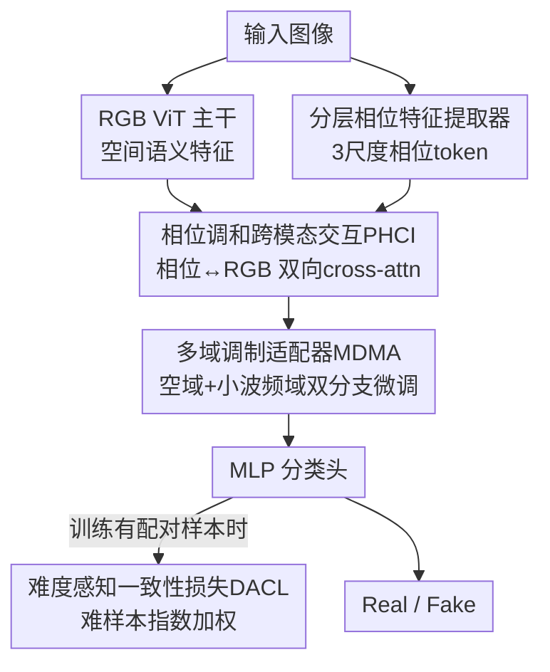

# Detecting Compressed AI-Generated Images via Phase Spectrum Robustness

**会议**: CVPR 2026  
**论文**: [CVF Open Access](https://openaccess.thecvf.com/content/CVPR2026/html/Li_Detecting_Compressed_AI-Generated_Images_via_Phase_Spectrum_Robustness_CVPR_2026_paper.html)  
**代码**: 未公开  
**领域**: AI安全 / 伪造图像检测  
**关键词**: AI生成图像检测, 相位谱鲁棒性, JPEG压缩, 跨模态交互, 难度感知损失  

## 一句话总结
针对社交网络 JPEG 压缩会摧毁伪造痕迹、让 AI 生成图像检测器失效的问题，本文从"相位谱比幅度谱更抗压缩"这一信号学观察出发，提出 CPTFormer——用相位特征引导 RGB 表征做双向跨模态融合、再用空域+小波频域双分支适配器微调，并在仅有少量压缩标注时用难度感知损失聚焦难样本，在 GAN/扩散模型四个压缩测试基准上把准确率最高拉高 6.7%。

## 研究背景与动机

**领域现状**：AI 生成图像检测器（如 FreqNet、NPR、Fatformer、ODDN）大多依赖图像中的高频伪造痕迹——生成模型的上采样操作会在频域留下特征性的"指纹"，检测器学这些细微的高频统计差异来区分真假。

**现有痛点**：这些痕迹极其脆弱。真实部署中，社交网络（OSN）会对所有上传图像统一施加激进的 JPEG 压缩，带来两重打击：① 压缩把检测器赖以判断的高频伪造痕迹**抹掉**（论文 Figure 1(c) 显示能量损失集中在高频区）；② 压缩本身又**引入新的压缩伪影**，作为误导信号干扰检测。结果是干净学术基准上 90%+ 的检测器，一上社交网络就掉到接近随机。

**核心矛盾**：近期方法（ADD、QAD、ODDN）试图在压缩数据上训练来增强鲁棒性，但都重度依赖"原图-压缩图配对数据 + 压缩标签"。而现实中既拿到原始高质量图、又拿到它的 OSN 压缩版往往不可行，标注压缩比也很费力——检测器通常只有极少量配对样本可用。鲁棒性需求和标注成本之间存在尖锐矛盾。

**切入角度**：作者回到 JPEG 压缩的信号学本质。JPEG 把 8×8 像素块经 DCT 变到频域，信息损失主要来自量化步骤——每个频率系数 $F(u,v)$ 除以量化表 $Q(u,v)$ 后取整。把复系数分解为幅度与相位 $F(u,v)=|F(u,v)|\cdot e^{\angle F(u,v)}$ 后会发现：量化只作用在**幅度**上（$|F_{quant}(u,v)|\approx |F(u,v)|/Q(u,v)$），而**相位** $\angle F(u,v)$ 在系数未被量化为零时**完全不变**。相位只在最高频带（$Q$ 值最大）被量化到零时才丢失。Figure 1(d)(e) 的实证也证明：压缩对幅度谱的扰动远大于相位谱，绝大多数频率分量的相位差紧紧聚在零附近。

**核心 idea**：把这个稳定的相位信息当作"抗压缩锚点"，用它来引导脆弱的 RGB/空域特征学习，从而**只用伪造标签、不需要配对数据和压缩标签**就能学到压缩鲁棒的表征。

## 方法详解

### 整体框架

CPTFormer（Compression-Robust Phase-Harmonized Transformer）是一个双分支架构：一条标准的 RGB 分支用预训练 CLIP-ViT 提空间语义特征，一条相位分支用轻量卷积金字塔从相位谱提多尺度抗压缩线索。两条分支通过 **PHCI** 做双向跨模态融合——稳定相位先引导 RGB，被 ViT 处理后的 RGB 语义再反哺相位。融合特征在 ViT 各 block 内由 **MDMA** 适配器做空域+小波频域的参数高效精修，最后过 MLP 头输出真/假。训练时若有少量压缩配对样本，再叠加 **DACL** 损失把学习重心压到最难的压缩样本上。

### 关键设计

**1. 分层相位特征提取器：把抗压缩的相位编码成尺度感知的 token 序列**

光知道"相位抗压缩"还不够，得把相位信息变成 Transformer 能用的表征。作者用一个轻量卷积金字塔，在三个空间尺度（输入分辨率的 1/8、1/16、1/32）生成特征金字塔 $\{C_l\}_{l=1}^3$，让模型同时看到粗粒度结构和细粒度细节的相位特性。每个特征图 $C_l$ 先用 level-specific 的 $1\times1$ 卷积 $\phi_l$ 投到统一维度 $D$，再展平成 token 序列。关键一步是给同一尺度的 token 加一个**可学习的 level embedding** $e_l$，保留"这个 token 来自哪个尺度"的层级上下文：

$$p_l = \mathrm{Flatten}(\phi_l(C_l)) + e_l, \qquad p = \mathrm{Concat}(p_1, p_2, p_3)$$

三个尺度的 token 拼成最终相位表征 $p\in\mathbb{R}^{N_p\times D}$，喂给后续跨模态融合。这样得到的表征既富含细节、又显式知道每个特征的来源尺度，比单尺度相位编码信息更全。

**2. 相位调和跨模态交互（PHCI）：让稳定相位引导脆弱 RGB，再用语义反哺相位**

有了 RGB token $l$ 和相位 token $p$，核心难点是怎么融合这两个互补模态。PHCI 做的是**双向** cross-attention，而非简单拼接。第一步，RGB token 作 query、相位 token 作 key/value，让每个 RGB token 去查询全部相位 token、吸收抗压缩线索：

$$l_{cross} = \mathrm{CrossAttn}(\mathrm{Norm}(l), \mathrm{Norm}(p)), \qquad l' = l + \gamma_l\cdot(l_{cross} + \mathrm{MLP}(\mathrm{Norm}(l_{cross})))$$

增强后的 RGB token $l'$ 过 ViT block 栈得到带语义的 $l_{ViT}$。第二步反过来，相位 token 作 query 去 attend 处理后的 $l_{ViT}$，用全局语义理解来精修局部相位线索：

$$p_{cross} = \mathrm{CrossAttn}(\mathrm{Norm}(p), \mathrm{Norm}(l_{ViT})), \qquad p' = p + \gamma_p\cdot(p_{cross} + \mathrm{MLP}(\mathrm{Norm}(p_{cross})))$$

$\gamma_l, \gamma_p$ 是可学习的门控标量，控制注入强度。这种"相位→RGB→相位"的双向互refine 是 PHCI 的精髓：相位提供压缩鲁棒的稳定信号，RGB 提供任务相关的语义，二者互相校准，比单向注入鲁棒得多。消融里 PHCI 一上来就把准确率从 64.6% 拉到 74.7%（+10.1），是整套方法贡献最大的模块。

**3. 多域调制适配器（MDMA）：空域 + 小波频域双分支的参数高效微调**

要充分调动预训练 ViT 的丰富知识、又不破坏它（也不全量微调），作者在 ViT block 内插入 MDMA 做适配。它有两条并行分支。**空域分支**是常规 bottleneck adapter：把特征 $F$ 降到小维度 $d_b$、过 ReLU、再升回 $D$，$\Delta F_{spatial}=\mathrm{MLP}_{up}(\sigma(\mathrm{MLP}_{down}(F)))$。**频域分支**才是亮点——它把 token（去掉 class token）reshape 成 2D 特征图后做 2D 离散小波变换（DWT），分解成一个低频近似带 $X_{LL}$ 和三个高频细节带 $X_{LH}, X_{HL}, X_{HH}$（水平/垂直/对角）；对每个子带独立施加基于 SE block 的通道注意力 $S(\cdot)$ 做重标定 $X'_{band}=X_{band}\odot S(X_{band})$，再用 IDWT 重建得到 $\Delta F_{freq}$。两分支最后门控求和：

$$\Delta F = \alpha_s\cdot\Delta F_{spatial} + \alpha_f\cdot\Delta F_{freq}$$

$\alpha_s,\alpha_f$ 是可学习的平衡参数。频域分支显式地在不同小波子带上"放大有用的伪造频率线索"，这正好补足了纯空域 adapter 看不到频域结构的短板，和本文相位频域思路一脉相承。消融里 MDMA 再带来 +1.3%（74.7→76.0）。

**4. 难度感知一致性损失（DACL）：把有限的压缩标注用在刀刃上**

本文主框架已经能无配对数据训练，但当真的有少量压缩配对样本时，怎么榨干它们的价值？以往方法（QAD、ODDN）对所有压缩样本一视同仁，导致检测器没能针对性消除最显著的压缩失真。DACL 的核心是**给最难的样本加大权重**——难样本恰恰是最容易被误分类、信息量最大的。具体用压缩图的交叉熵损失算一个样本难度权重，且**梯度不回传过 $\omega$**（它只当调制因子，不作为优化目标）：

$$\omega = \exp(L_{CE}(f_\theta(x_c), y)), \qquad L_{DAL} = \omega L_{CE}(f_\theta(x_c), y) + L_{CE}(f_\theta(x_o), y)$$

其中 $x_c$ 是压缩样本、$x_o$ 是未压缩样本。权重随难度**指数增长**，确保难样本拿到更多注意力。在此基础上再叠一个对比损失增强类内一致、类间可分：

$$L_{con}^{(i)} = -\log\frac{\sum_{p\in P(i)}\exp(\mathrm{sim}(z_i,z_p)/\tau)}{\sum_{j\ne i}\exp(\mathrm{sim}(z_i,z_j)/\tau)}, \qquad L_{DACL} = L_{DAL} + \lambda_{con}L_{con}$$

$P(i)$ 是同 mini-batch 中与样本 $i$ 同类的正样本集合，$z$ 是分类头输入，$\lambda_{con}=0.01$。DACL 在消融里贡献最后 +1.4%（76.0→77.4）。

### 损失函数 / 训练策略

主干为预训练 CLIP-ViT。图像 resize 到 256×256 再 crop 到 224×224（训练随机裁剪、推理中心裁剪）。AdamW 优化、初始学习率 2e-5、batch size 32、训练 20 epoch。训练集按 ODDN 协议划分：80% 无配对原图（$D_{unpaired}$）+ 20% 配对子集（原图 $D_{paired}$ 及其 QF=40 的 JPEG 压缩版 $D_{compressed}$），DACL 只作用在这 20% 配对样本上。

## 实验关键数据

### 主实验

训练只用 ProGAN 生成图（ForenSynths），在 GAN（ForenSynths + GANGen-Detection）和扩散模型（DiffusionForensics + Ojha）四个基准上测，分 quality-aware（固定压缩比）和 quality-agnostic（随机压缩比，更贴近真实）两种场景，指标为分类准确率 Acc。

| 测试场景 | 设置 | CPTformer | 前 SOTA | 提升 |
|----------|------|-----------|---------|------|
| GAN · quality-aware | 2-class | **77.4** | 71.4 (ODDN) | +6.0 |
| GAN · quality-aware | 4-class | **79.3** | 72.6 (ODDN) | +6.7 |
| DM · quality-aware | 2-class | **65.9** | 62.3 (FF++) | +3.6 |
| GAN · quality-agnostic | 2-class | **76.3** | 70.7 (ODDN) | +5.6 |
| GAN · quality-agnostic | 4-class | **77.4** | 72.1 (ODDN) | +5.3 |
| DM · quality-agnostic | 2-class | **63.5** | 58.6 (Fatformer) | +4.9 |

在更难的 quality-agnostic（随机压缩比）场景下优势依然稳定，说明相位中心的设计带来的是真泛化，而非对固定压缩比过拟合。

### 消融实验

Table 5（2-class quality-aware GAN，逐步加模块）：

| 配置 | Mean Acc | 说明 |
|------|---------|------|
| Baseline (CLIP-ViT) | 64.6 | 纯 RGB 主干 |
| + PHCI | 74.7 | 加相位双向交互，+10.1（贡献最大） |
| + MDMA | 76.0 | 加多域适配器，+1.3 |
| + DACL | 77.4 | 加难度感知损失，+1.4（完整模型） |

### 关键发现
- **PHCI 是绝对主力**：单加 PHCI 就贡献 +10.1%，证实"用稳定相位引导脆弱 RGB"这条主线确实抓住了压缩鲁棒性的命门；MDMA 和 DACL 是锦上添花的精修。
- **标签效率是核心卖点**：整套框架无需原图-压缩图配对数据和压缩标签即可训练，仅靠伪造标签；DACL 只在恰好有少量配对样本时才上，按需增益。
- **t-SNE（Figure 3）**：baseline 的真/假特征严重纠缠、没有清晰边界；CPTformer 学到的特征里真假形成两个紧凑、分离的簇，直观说明相位驱动设计学到了更判别性的鲁棒表征。

## 亮点与洞察
- **从信号学第一性原理出发**：不是又堆一个 backbone，而是从 JPEG 量化的数学本质推出"量化只动幅度、不动相位"，把相位谱当抗压缩锚点——这个洞察既有理论推导（公式 1-3）又有实证（Figure 1），很扎实。
- **双向跨模态交互的范式可迁移**：PHCI 这种"稳定模态引导脆弱模态、再用语义反哺"的双向 refine，可推广到任何"有一路鲁棒但弱语义、一路强语义但脆弱"的多模态融合场景（如红外+RGB、低光+正常光）。
- **频域 adapter 设计巧妙**：MDMA 频域分支用 DWT 拆子带 + 逐子带通道注意力 + IDWT 重建，把"参数高效微调"和"频域伪造线索增强"两件事合并在一个 adapter 里，比纯空域 bottleneck adapter 更契合伪造检测任务。
- **难度权重不回传梯度**：DACL 里 $\omega=\exp(L_{CE})$ 显式 stop-gradient，只当调制因子不当优化目标，避免模型为了降权重而走捷径——是个值得复用的小 trick。

## 局限与展望
- 作者在结论里坦诚本文聚焦点是压缩鲁棒性，未深入讨论对其他后处理（缩放、加噪、滤镜、二次压缩链）的鲁棒性，而真实 OSN 往往是多种退化叠加。
- ⚠️ 相位抗压缩的前提是"系数未被量化为零"，在**极低质量因子**（远低于 QF=40）下高频甚至中频相位也会大面积丢失，方法的有效边界值得进一步探究——论文主实验固定 QF=40，未给出极端低质量下的曲线。
- 扩散模型上的绝对准确率（quality-aware 65.9%、quality-agnostic 63.5%）明显低于 GAN，说明对扩散生成图的压缩鲁棒检测仍是开放难题，相位指纹在 DM 上不如在 GAN 上显著。
- 训练只用单一生成器（ProGAN）的伪造标签，跨生成器泛化靠相位的通用性支撑；若能引入多源相位先验或自适应小波基，或可进一步提升对未见生成范式的覆盖。

## 相关工作与启发
- **vs ODDN / QAD / ADD（配对数据派）**：它们靠"原图-压缩图配对 + 压缩标签"在压缩数据上训练来抗压缩，标注成本高且现实中常拿不到配对。本文用相位谱的天然压缩鲁棒性替代配对监督，无需配对数据和压缩标签，且全面超过它们（GAN 上 +6% 量级）。
- **vs FreqNet / F3Net（频域统计派）**：它们利用局部频率统计或高频成分作判别线索，但高频恰恰是压缩重灾区，一压就崩。本文转而依赖压缩下更稳定的相位信息，从根上规避了"靠高频、却被压缩抹掉高频"的死结。
- **vs Fatformer / NPR（空域/像素关系派）**：Fatformer 融合 CLIP 语义与低层统计、NPR 用邻近像素关系，都在空域做文章；本文额外引入相位频域这条抗压缩通道做双向融合，在压缩场景下鲁棒性更强。

## 评分
- 新颖性: ⭐⭐⭐⭐⭐ 首次系统性地把相位谱的固有压缩鲁棒性用于 AI 生成图像检测，有信号学推导支撑，切入角度独到
- 实验充分度: ⭐⭐⭐⭐ GAN/DM 四基准 × quality-aware/agnostic × 2/4-class 覆盖全面，消融清晰；但缺极端低质量因子和多重退化的鲁棒性曲线
- 写作质量: ⭐⭐⭐⭐ 动机推导环环相扣、图示直观；模块命名略多缩写（PHCI/MDMA/DACL）需读者对照
- 价值: ⭐⭐⭐⭐⭐ 直击"学术基准 vs 真实社交网络"的部署鸿沟，且免配对数据/压缩标签，实用性强

<!-- RELATED:START -->

## 相关论文

- [\[CVPR 2026\] Enabling Supervised Learning of Generative Signatures for Generalized AI-Generated Images Detection](enabling_supervised_learning_of_generative_signatures_for_generalized_ai-generat.md)
- [\[CVPR 2026\] VMD-FACT: A New Video Dataset and MLLM-based method for Detecting Realistic AI-Generated Video Misinformation](vmd-fact_a_new_video_dataset_and_mllm-based_method_for_detecting_realistic_ai-ge.md)
- [\[CVPR 2026\] Zero-shot Detection of AI-Generated Image via RAW-RGB Alignment](zero-shot_detection_of_ai-generated_image_via_raw-rgb_alignment.md)
- [\[CVPR 2026\] Skyra: AI-Generated Video Detection via Grounded Artifact Reasoning](skyra_ai-generated_video_detection_via_grounded_artifact_reasoning.md)
- [\[CVPR 2026\] Scaling Up AI-Generated Image Detection with Generator-Aware Prototypes](scaling_up_ai-generated_image_detection_with_generator-aware_prototypes.md)

<!-- RELATED:END -->
