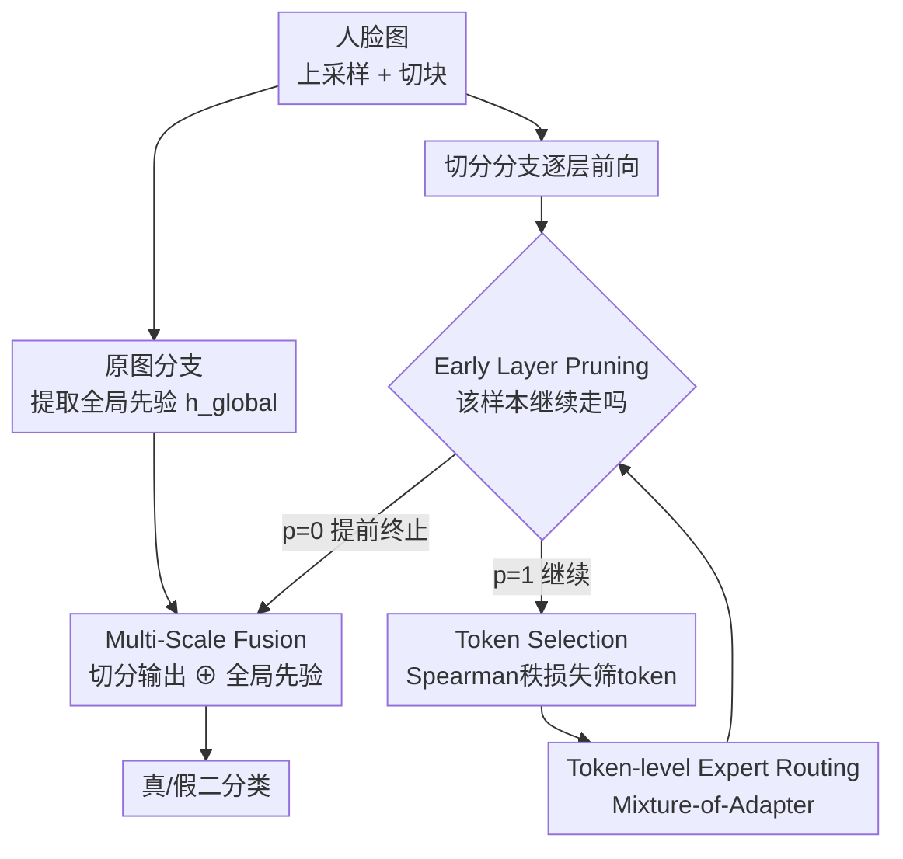

# DFD-HR: Generalizable Deepfake Detection via Hierarchical Routing Learning

**会议**: CVPR 2026  
**论文**: [CVF Open Access](https://openaccess.thecvf.com/content/CVPR2026/html/Sun_DFD-HR_Generalizable_Deepfake_Detection_via_Hierarchical_Routing_Learning_CVPR_2026_paper.html)  
**代码**: https://dfd-hr.github.io/ (项目页)  
**领域**: AI安全 / 深度伪造检测  
**关键词**: Deepfake检测, 参数高效微调, 层级路由, 早停剪枝, Mixture-of-Experts

## 一句话总结
DFD-HR 在把 CLIP 这类视觉基座迁移到深度伪造检测时，不再笼统地"少调几个参数"，而是同时在**层级**（按样本自适应决定走几层网络）和 **token 级**（用 Spearman 秩损失筛掉无关 token + MoE 专家路由）上做"层级路由"，让模型只把算力花在真正含伪造线索的表示上，在跨数据集 / 跨伪造方法两个设定下分别比 SOTA 提升 +2.3% / +3.8% 的 Video-level AUC。

## 研究背景与动机

**领域现状**：可泛化的 deepfake 检测（DFD）这两年的主流是借助视觉基座模型（VFM，如 CLIP），通过参数高效微调（PEFT，只更新一小部分参数，如 Adapter / LoRA）来迁移，已经被证明对"没见过的伪造类型"泛化得不错——代表作有 Forensics Adapter、Effort、MoE-FFD 等。

**现有痛点**：但"少调参数"这件事本身藏了一个没人认真回答的问题——**就算只调了少数参数，这些参数（以及它们作用的特征）真的是最有信息量的那些吗？** 作者观察到两个被忽略的结构性事实：① 不同层捕捉的语义抽象不同，而且**真假样本对深度的需求是不对称的**——真样本往往很浅就能判定收敛，假样本则要到更深层、且不同伪造方法在不同深度才暴露破绽（Fig.2(b)）；② 同一层内，不同 token 携带的伪造线索差异很大，存在大量被"伪相关 token"（spurious tokens）干扰的注意力（Fig.2(a)）。直接把 CLIP 搬过来，注意力常常被引到错误区域，连放大局部（zoom-in）都救不回来。

**核心矛盾**：标准 PEFT 是"全局均匀"地调参——所有样本走完全部层、所有 token 等价参与，这与"真假样本需要不同深度、不同 token 贡献度天差地别"的事实是错配的。冗余的层和 token 不仅浪费算力，还会把模型往特定伪造痕迹上过拟合，损害泛化。

**本文目标**：把 PEFT 从"调哪些参数"升级为"动态决定每个样本该用哪些层、哪些 token、哪些专家"——即在层和 token 两个粒度上做联合优化。

**核心 idea**：提出**层级路由（Hierarchical Routing, HR）**——层级用"早停剪枝"让样本自适应决定前向深度，token 级用"Token Selection + 专家路由"挑出最具判别性的 token 并解耦真假学习，把学习资源集中到最有信息量的表示上。

## 方法详解

### 整体框架

DFD-HR 把一张人脸图同时喂两条路：原图分支提取全局 [CLS] 表示 $h_{global}^{cls}$ 作为"全局先验"，切分（split）分支则把上采样后的图切块、逐层经过插了"层级路由"的 Transformer。在 backbone 的**最后若干层**（实现里是最后 4 层）插入 HR 三件套：每进一层先用 **Early Layer Pruning** 判断这个样本要不要继续往下走（不走就直接拿去分类），要走的话用 **Token Selection** 按伪造相关性挑出 Top-K token（其余 token 旁路直传），被选中的 token 再经过 **Token-level Expert Routing**（Mixture-of-Adapter）处理。其余非 HR 层只装专家设计。最后用 **Multi-Scale Fusion** 把切分分支的输出和原图全局表示融合后分类。训练目标是分类损失 + 引导 token 排序的 Spearman 秩损失。

### 关键设计

**1. Early Layer Pruning（早停剪枝）：让真假样本走不同深度**

针对"真假样本对深度需求不对称、走满全部层既浪费又过拟合"的痛点，作者在每个 HR 层加一个"层判官"（layer judge）：取该层 [CLS] token $h_i^{cls}$，过一个两层 MLP 得到 logit，$\text{logits} = W_2(\text{ReLU}(W_1(h_i^{cls})))$。然后用 **Gumbel-Sigmoid** 做硬路由——先采 Gumbel 噪声 $g=-\log(-\log(U+\epsilon)+\epsilon)$，软概率 $p_{soft}=\sigma\!\left(\frac{\text{logits}+g}{\tau}\right)$，硬决策 $p_{hard}=\mathbb{I}[p_{soft}>0.5]$。为了让硬决策可导，训练时用直通估计（straight-through）：

$$p = \text{sg}(p_{hard}) - \text{sg}(p_{soft}) + p_{soft}$$

其中 $\text{sg}(\cdot)$ 是 stop-gradient，前向用硬值、梯度从软值回传；推理时直接用 $p_{hard}$。该层的输出是门控加权的残差：$H_{i+1}=p\cdot \text{Layer}_i(H_i)+(1-p)\cdot H_i$。一旦某层 $p=0$，这个样本**直接跳过后面所有层去分类**。效果上，真样本通常很早就被"剪掉"提前出网，假样本则继续往深处走、且不同伪造方法在不同深度终止，从而把"深度"本身变成一种判别信号。论文统计层数最多可减少 17%。

**2. Token Selection（Token 筛选）：用全局先验 + Spearman 秩损失挑出含伪造线索的 token**

针对"同层 token 被伪相关 token 干扰"的痛点，作者加一个"token 判官"给每个 token 打分：$\text{scores}_i = W_t([h_i^{cls}, h_i^{patch}])$，每层只保留 Top-K 个（$k=\max(1,\lfloor r\times L\rfloor)$，$r$ 取 75%），其余 token 不进 Transformer、直接旁路传到该层输出。关键是怎么让这个分数"打得对"——作者用全局 [CLS] $h_{global}^{cls}$（代表整张脸的全局信息）和当前层隐状态算余弦相似度 $\text{cosine}_i$，再用 **Spearman 秩相关**约束打分顺序与相似度顺序单调一致：

$$\rho_{spearman}=\frac{\text{Cov}(\text{rank}(\text{scores}_i),\text{rank}(\text{cosine}_i))}{\sigma_{\text{rank}(\text{scores}_i)}\cdot\sigma_{\text{rank}(\text{cosine}_i)}},\quad L_{rank}=1-\rho_{spearman}$$

这里用秩相关而不是直接回归相似度值，是因为伪造检测真正关心的是 token 之间"谁更该被关注"的**相对排序**，而非绝对相似度数值——秩损失对尺度不敏感，更稳。被选中的 token 过完 Transformer 后还会按自身分数重加权 $H_{i+1}^{select}=H_{i+1}^{select}\odot(1+\text{Softmax}(\text{TopK}(\text{scores}_i,k)))$，最后和旁路 token 按原始相对顺序拼回。这把"先验知识：伪造线索只出现在人脸区域"显式注入了 token 选择。

**3. Token-level Expert Routing（专家路由）：用 Mixture-of-Adapter 解耦不同伪造类型的冲突**

不同伪造类型（换脸 / 表情重演 / 整图合成）的破绽分布差异很大，单一 Adapter 容易在它们之间打架、过拟合到某一类。作者在每个 Transformer 层的 MHA 和 MLP 后插入 **Mixture-of-Adapter（MOA）**：先用带噪声的门控网络 $G=\text{Softmax}(L+\epsilon\odot\text{Softplus}(L))$（$\epsilon\sim\mathcal{N}(0,I)$ 仅训练时加，用于鼓励专家多样性、防止门控塌缩），再把 $N$ 个 Adapter 专家按门控权重加权融合：$\text{MOA}(X)=X+\sum_{i=1}^{N}G_i\odot\text{Adapter}_i(X)$，每个 Adapter 是 $W_2(\text{ReLU}(W_1(X)))$ 的瓶颈结构（专家数 4、隐维 256）。这样不同伪造类型可以激活不同专家子集，把"真假解耦"和"伪造类型解耦"都交给稀疏专家处理，而不是硬塞进同一组参数。

**4. Multi-Scale Fusion（多尺度融合）：把切分分支与原图全局表示拼起来**

切分图（局部、高分辨率细节）和原图（全局语义）表征互补。作者用一个可学习 query token $Q_{token}$ 对切分分支输出做交叉注意力 $h_{split}=\text{MHA}(Q_{token},H_{split},H_{split})$，再把 $h_{split}$ 和全局 $h_{global}^{cls}$ 拼接送分类头。消融显示这个简单融合比 D3、RINE、MRA（引入 DINOv2 做高分辨率融合）等更复杂的方案都好，作者强调它"简单且有效"——⚠️ 论文未充分解释为何比引入额外大模型的 MRA 还好，推测是切分 + 全局先验已经覆盖了多尺度互补，以原文为准。

### 损失函数 / 训练策略

总损失把二分类交叉熵和 Spearman 秩损失加权相加：

$$L = L_{cls} + \lambda_1 \cdot \frac{1}{m}\sum_{i}^{m} L_{rank}^{i}$$

其中 $m$ 是插入 HR 的层数（即最后 4 层），$\lambda_1=0.1$。backbone 默认用 CLIP ViT-L/14 全量微调（学习率 1e-6 作为 baseline），HR 模块用 Adam、学习率 1e-4；训练每视频采 8 帧、batch 16，推理采 32 帧、batch 32；token 选择比例 75%。

## 实验关键数据

### 主实验

在 FF++ (c23) 上训练，跨数据集（Protocol-1，7 个未见数据集）和跨伪造方法（Protocol-2，DF40 同域不同伪造）评测 Video-level AUC：

| 设定 | 指标 | DFD-HR | 之前SOTA(Effort) | 提升 |
|------|------|--------|------------------|------|
| 跨数据集 Avg. | Video-AUC | **0.940** | 0.917 | +2.3% |
| 跨伪造方法 Avg. | Video-AUC | **0.978** | 0.940 | +3.8% |
| CDF-v2 | Video-AUC | 0.960 | 0.956 | +0.4% |
| DFo | Video-AUC | 0.997 | 0.977 | +2.0% |
| WDF | Video-AUC | 0.907 | 0.848 | +5.9% |
| FFIW | Video-AUC | 0.968 | 0.921 | +4.7% |

Frame-level AUC（Tab.2）上同样四个数据集全胜，平均 0.891，比 CVPR'25 的 ForAda（0.870）高 +2.1%。同时层数最多减 17%、token 数减 25%，即**更准且更省**。

### 消融实验

HR 与 MSF 拆解（跨伪造方法，Video-AUC %）：

| 配置 | CDF-v2 | FaceShifter | Avg. |
|------|--------|-------------|------|
| Baseline | 91.8 | 88.8 | 90.3 |
| + HR | 95.0 (+3.2) | 90.7 (+1.9) | 92.9 (+2.6) |
| + MSF | 92.9 (+1.1) | 90.1 (+1.3) | 91.5 (+1.2) |
| + HR + MSF (Full) | **96.0 (+4.2)** | **91.2 (+2.4)** | **93.6 (+3.3)** |

HR 内部三件套逐个加（Avg. Video-AUC %）：

| 配置 | CDF-v2 | FaceShifter | Avg. |
|------|--------|-------------|------|
| Baseline | 91.8 | 88.8 | 90.3 |
| + Early Layer Pruning | 93.4 (+1.6) | 89.2 (+0.4) | 91.3 (+1.0) |
| + Token Selection | 94.3 (+2.5) | 90.4 (+1.6) | 92.4 (+2.1) |
| + Expert Routing | 95.0 (+3.2) | 90.7 (+1.9) | 92.9 (+2.6) |

### 关键发现
- **贡献排序**：HR 是大头（单独 +2.6% 平均），其中 Early Layer Pruning 打底（+1.0%）、Token Selection 增益最明显（再 +1.1%）、Expert Routing 收尾（再 +0.5%）；MSF 单独只有 +1.2%，但和 HR 叠加能到 +3.3%，说明二者互补不冲突。
- **Token Selection 选得更准**：对比 PCA(LongCLIP)、FastV、Sparse Attention 等流行 token 选择/剪枝策略，本文的秩损失引导方案平均 AUC 最高（92.4 vs 次优 91.8），佐证"用全局先验 + 秩约束"比纯特征/注意力启发式更贴合伪造检测。
- **多尺度融合反常识**：D3、RINE、MRA 等更重的方案有的甚至掉点（RINE −6.1%），而简单的 Multi-Scale Fusion +1.2%，说明在 DFD 上"对齐切分 + 全局先验"比堆叠大模型更对路。
- **基座无关**：换到 BEITv2 / SigLIP 仍分别比 Effort 高 +4.7% / +3.3%，说明层级路由是一种可迁移的通用机制而非依赖 CLIP。

## 亮点与洞察
- **把"深度"变成判别信号**：Early Layer Pruning 让真样本早停、假样本深走，等于把"该样本需要多深才判得清"这一信息显式编码进路由——这是对"真假样本学习不对称"现象的直接利用，比单纯加正则更聪明。
- **用秩损失而非回归约束 token 重要性**：伪造检测关心 token 的相对优先级而非绝对相似度，Spearman 秩损失对尺度不敏感，是个可迁移到任何"需要排序而非数值对齐"的注意力/token 选择任务的好 trick。
- **效率与泛化同向**：层减 17%、token 减 25% 的同时还涨点，打破了"剪枝换效率必牺牲精度"的常见 trade-off——因为这里剪掉的恰好是冗余/伪相关部分。
- **MoE 用于解耦伪造类型冲突**：把"不同伪造类型互相打架"问题交给稀疏专家，而非塞进单一 Adapter，思路可迁移到任意"多子分布、易过拟合某一类"的迁移学习场景。

## 局限性 / 可改进方向
- HR 只插在最后 4 层，浅层的层级路由潜力没探索；为什么是后 4 层、对不同 backbone 是否最优，论文未充分讨论。
- ⚠️ Multi-Scale Fusion 为何优于引入 DINOv2 的 MRA，文中只给"简单有效"的定性说法，缺机制层面的解释。
- 早停剪枝靠 Gumbel-Sigmoid 硬路由，训练时温度 $\tau$、噪声等超参的敏感性正文未给曲线，复现稳定性存疑。
- 评测集中在人脸 deepfake（换脸/重演/整图合成），对全图扩散生成、视频时序伪造等更广义伪造的泛化未验证。

## 相关工作与启发
- **vs Effort (ICML'25)**：Effort 用 SVD+LoRA 构造正交子空间做高效伪造学习，是"在参数子空间里下功夫"；本文换思路——参数照样调，但**动态选层选 token 选专家**，把"哪些表示参与"也变成可学习的，因此在跨数据集 +2.3%、跨方法 +3.8% 全面超越。
- **vs Forensics Adapter (CVPR'25)**：ForAda 给 CLIP 设计 Adapter 学伪造混合边界，token/层是均匀处理的；本文在其上加层级路由，Frame-AUC +2.1%。
- **vs UDD (AAAI'25)**：UDD 也做 token 级（靠 shuffle/mix 去位置/内容偏置），但本文用全局先验 + 秩损失**主动筛选**判别性 token，而非靠扰动去偏，消融里 Token Selection 这一项明显优于同类 token 策略。
- **vs MoE-FFD**：同样用 MoE，但 MoE-FFD 是 LoRA+Adapter 混合扩容量，本文的 MOA 更聚焦"用专家多样性解耦真假/伪造类型冲突"，并和层级/token 路由协同。

## 评分
- 新颖性: ⭐⭐⭐⭐⭐ 首个把"层级 + token 双粒度路由"引入 deepfake 检测，把深度本身变判别信号的视角很新。
- 实验充分度: ⭐⭐⭐⭐⭐ 两套协议 + 多基座 + 6 张消融/对比表，覆盖到位。
- 写作质量: ⭐⭐⭐⭐ 机制和公式讲得清，但 MSF 优越性、超参敏感性等解释偏弱。
- 价值: ⭐⭐⭐⭐⭐ 又准又省、且基座无关，对落地泛化型 DFD 很实用。

<!-- RELATED:START -->

## 相关论文

- [\[CVPR 2026\] Beyond \[CLS\] Token: Query-Driven Token-Level Forgery Purification for Generalizable Deepfake Detection](beyond_cls_token_query-driven_token-level_forgery_purification_for_generalizable.md)
- [\[CVPR 2026\] Decoupling Bias, Aligning Distributions: Synergistic Fairness Optimization for Deepfake Detection](decoupling_bias_aligning_distributions_synergistic_fairness_optimization_for_dee.md)
- [\[CVPR 2026\] Omni-Fake: Benchmarking Unified Multimodal Social Media Deepfake Detection](omni-fake_benchmarking_unified_multimodal_social_media_deepfake_detection.md)
- [\[CVPR 2026\] DeepfakeImpact: A Two-Stage Benchmark with Real-World Impact in Deepfake Detection](deepfakeimpact_a_two-stage_benchmark_with_real-world_impact_in_deepfake_detectio.md)
- [\[CVPR 2026\] Tutor-Student Reinforcement Learning: A Dynamic Curriculum for Robust Deepfake Detection](tutor-student_reinforcement_learning_a_dynamic_curriculum_for_robust_deepfake_de.md)

<!-- RELATED:END -->
