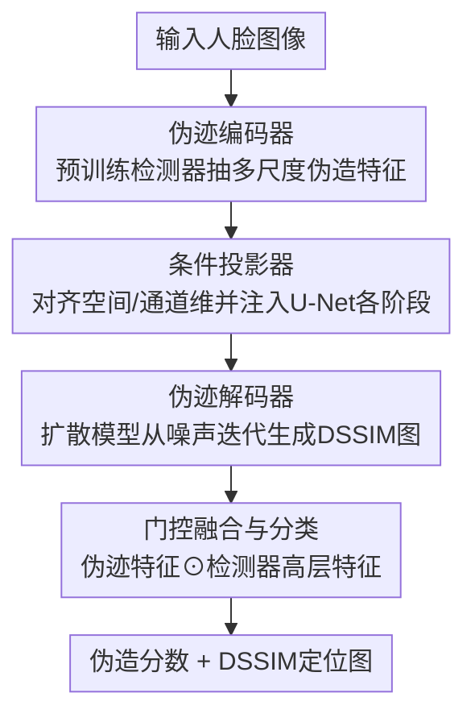

# DiffusionFF: A Diffusion-based Framework for Joint Face Forgery Detection and Fine-Grained Artifact Localization

**会议**: CVPR 2026  
**论文**: [CVF Open Access](https://openaccess.thecvf.com/content/CVPR2026/html/Peng_DiffusionFF_A_Diffusion-based_Framework_for_Joint_Face_Forgery_Detection_and_CVPR_2026_paper.html)  
**代码**: 无（论文未提供）  
**领域**: AI安全 / 人脸伪造检测  
**关键词**: 人脸伪造检测, 伪迹定位, 扩散模型, DSSIM图, 编码器-解码器  

## 一句话总结
DiffusionFF 把一个预训练的伪造检测器当"伪迹编码器"、把去噪扩散模型当"伪迹解码器"，以多尺度伪造特征为条件，逐步生成细粒度的 DSSIM 伪迹定位图，再把这张图融回检测器做分类，同时拿下检测与定位两个任务的 SOTA。

## 研究背景与动机
**领域现状**：人脸深度伪造越来越逼真，业界对检测算法的要求也从"判真假"升级到"指出哪里被改了"——精确的伪迹定位能给出人可理解的证据，提升模型可解释性和用户信任。近期研究因此转向"检测 + 定位"的统一框架。

**现有痛点**：定位有两条主流路线，都不够好。一是 **mask-based** 方法，把定位当分割任务输出二值掩码，但掩码天然粗糙，只能圈出大致区域；二是 **DSSIM-based** 方法，通过对齐的真假图像对逐像素比对得到结构差异图（DSSIM map），能捕捉细微伪迹，但现有做法（如 LiSiam、LRL）都是**直接回归**框架，会把细微痕迹"抹平"，输出模糊、信息量低的定位图。

**核心矛盾**：DSSIM 图本身能表达细粒度伪迹，但"直接回归"这种一步到位的预测方式和"细粒度高频细节"是冲突的——回归倾向于输出平滑的均值解，正好丢掉了最该保留的尖锐差异。而作者在分析中（论文 Figure 2）发现一个关键事实：**把估计出的 DSSIM 图融回检测网络能稳定提升检测性能，且图质量越高、增益越大**。所以"如何生成一张高质量 DSSIM 图"既是定位目标，也是涨检测点的钥匙。

**本文目标**：用一个统一框架同时解决（1）细粒度伪迹定位、（2）人脸伪造检测，且让前者真正服务于后者。

**切入角度**：扩散模型天生支持**迭代式精修**——从噪声出发一步步细化输出，恰好能逐步逼近 DSSIM 图里的细粒度不一致，避免直接回归的过度平滑。

**核心 idea**：搭一个新的编码器-解码器架构——**预训练伪造检测器 = 伪迹编码器**，**去噪扩散模型 = 伪迹解码器**，以编码器的多尺度伪造特征为条件，让解码器渐进合成 DSSIM 图，再融回检测器涨点。

## 方法详解

### 整体框架
输入一张人脸图像，DiffusionFF 同时输出一个伪造分数和一张定位细粒度伪迹的 DSSIM 图。整条管线是这样转的：预训练的伪造检测器先抽出多尺度伪造相关特征，这些特征经"条件投影器"对齐后注入扩散模型的 U-Net 编码器各阶段；扩散模型从纯噪声出发、以这些特征为条件，迭代去噪生成 DSSIM 图；接着一个"伪迹特征提取器"把这张图编码成伪迹感知特征，最后通过门控机制与检测器的高层语义特征融合，由分类头给出伪造分数。

这里要先厘清一个容易绕的概念——**DSSIM 图怎么来的（监督信号）**。训练/评测时，作者从原始人脸视频和它的伪造版本里抽帧裁脸，得到完全对齐的真假图像对，对每个像素位置 $(i,j)$ 在局部窗口 $x, y$ 上计算结构差异：

$$\mathrm{DSSIM}(x, y) = 1 - \frac{(2\mu_x\mu_y + C_1)(2\sigma_{xy} + C_2)}{(\mu_x^2 + \mu_y^2 + C_1)(\sigma_x^2 + \sigma_y^2 + C_2)}$$

其中 $\mu, \sigma, \sigma_{xy}$ 分别是窗口的均值、方差、协方差，$C_1, C_2$ 是数值稳定常数。真实图像被赋予纯黑图（零差异）。这张 GT DSSIM 图就是扩散模型要学着生成的目标。

### 关键设计

**1. 编码器-解码器重定位：拿检测器当编码器、扩散模型当解码器**

这是全文的根基，针对的痛点是"直接回归生成的 DSSIM 图模糊、丢细节"。作者不再用一步回归，而是把生成 DSSIM 图建模成一个**条件去噪扩散过程**：扩散模型按 DDPM 框架训练，前向过程对干净图 $x_0$ 逐步加噪，任意时刻的噪声图可由 $x_t = \sqrt{\bar\alpha_t}\,x_0 + \sqrt{1-\bar\alpha_t}\,\epsilon$ 直接采样（$\epsilon \sim \mathcal{N}(0, I)$）；反向过程训练去噪网络 $\epsilon_\theta(x_t, t)$ 预测加入的噪声，目标是 MSE 损失 $L_{\mathrm{MSE}} = \mathbb{E}_{x_0,\epsilon,t}\big[\|\epsilon - \epsilon_\theta(x_t, t)\|_2^2\big]$。推理时从纯噪声 $x_T$ 出发按标准 DDPM 更新式逐步去噪到 $x_0$，得到 DSSIM 图。扩散的迭代精修天性，让它能一步步把细微伪迹"补"出来而不是抹平，这正是它比直接回归强的地方。

值得强调的是，编码器不是随便接一个网络，而是**复用预训练好的伪造检测器**（ConvNeXt-B）。作者明确观察到：从零联合训练检测器和扩散模型会**训练崩溃**，说明把"已经学好的伪造知识"灌进生成管线是必需的——这给"为什么要重定位一个预训练检测器当编码器"提供了实打实的理由。

**2. 条件投影器：把检测器的多尺度特征对齐后注入 U-Net 编码器**

光有编码器和解码器还不够，两个模型的特征维度对不上。条件投影器就是用来"搭桥"的：它把检测器四个层级阶段输出的多尺度伪造特征，在**空间维和通道维**上对齐到扩散模型 U-Net 的骨干，然后注入 U-Net 对应的**编码器阶段**（注意是编码器侧，消融里专门比过注入解码器侧更差）。每个投影器由 Conv2D / Norm / SiLU / Pooling / Resize 等模块堆成，做的就是把"伪造语义"翻译成扩散模型听得懂的条件信号。多尺度注入的意义在于：伪迹既有大区域的也有像素级的，单尺度条件（如 ViT 的单尺度特征）喂不全，论文也因此把 ViT 排除在适配范围外。

**3. 门控融合与分类：把生成的 DSSIM 图当"视觉解释"融回检测**

这一步把定位成果真正变成检测增益。伪迹特征提取器 $E$ 先把估计出的 DSSIM 图 $M_{\mathrm{DSSIM}}$ 编码成伪迹感知特征，与检测器最后一阶段的高层语义特征 $F_{\mathrm{det}}$ 做空间/通道对齐，再用门控机制融合：

$$\mathrm{Score} = H\big(\sigma(E(M_{\mathrm{DSSIM}})) \odot F_{\mathrm{det}} + F_{\mathrm{det}}\big)$$

其中 $\sigma$ 是 Sigmoid、$\odot$ 是 Hadamard 积、$H$ 是分类头。这个门控本质上是用 DSSIM 衍生的伪迹响应当"注意力闸门"，去**选择性放大**检测特征里与篡改相关的区域，残差式的 $+ F_{\mathrm{det}}$ 又保证原始判别信息不丢。消融显示门控比加法/Hadamard/拼接/交叉注意力都更优，呼应了"图质量越高、检测增益越大"的开篇分析。

**4. 两阶段解耦训练：DSSIM 生成与分类各练各的**

DSSIM 图估计（生成任务）和二分类（判别任务）目标差异巨大，硬联合优化会两头都不讨好。作者把两者在训练层面**完全解耦**：第一阶段冻结预训练检测器，只训条件投影器 + 扩散模型，用扩散的 MSE 损失（式 3）专心学好 DSSIM 图生成；第二阶段把检测器、投影器、扩散模型全冻住，只训伪迹特征提取器 + 分类头，用标准交叉熵损失专心提分类。这样每个组件都在最适合它的目标下被优化，避免了梯度互相干扰。

### 损失函数 / 训练策略
- **第一阶段**：扩散模型 + 条件投影器，扩散 MSE 损失（式 3），AdamW，100 epoch，batch 96，初始 lr $1\times10^{-4}$ 余弦衰减，扩散步数 $T=50$。
- **第二阶段**：伪迹特征提取器 + 分类头，交叉熵损失，AdamW，5 epoch，batch 128，固定 lr $5\times10^{-5}$。
- 骨干：检测器用 FF++ 上预训练的 ConvNeXt-B（4 阶段），扩散模型用带 timestep encoder 的 U-Net；8×RTX 3090 训练。

## 实验关键数据

### 主实验
跨数据集检测（AUC %，FF++ 训练，迁移到未见数据集）——DiffusionFF 在四个 benchmark 全部第一：

| 方法 | 类型 | CDF2 | DFDC | DFDCP | FFIW |
|------|------|------|------|-------|------|
| Effort∗ (ICML25) | 仅检测 | 95.73 | 84.78 | 90.42 | 88.53 |
| KFD (ICML25) | 检测+定位(mask) | 94.71 | 79.12 | 91.81 | - |
| LiSiam∗ (TIFS22) | 检测+定位(DSSIM) | 90.36 | 72.59 | 82.06 | 76.52 |
| **DiffusionFF** | 检测+定位(DSSIM) | **97.24** | **85.05** | **92.56** | **88.56** |

DSSIM 图估计质量（跨数据集 CDF2，与 DSSIM-based 方法比）——FID 从 256 级直接降到 99，质量碾压：

| 方法 | PSNR↑ | SSIM↑ | LPIPS↓ | FID↓ |
|------|-------|-------|--------|------|
| LiSiam | 21.99 | 0.367 | 0.464 | 256.20 |
| LRL | 20.80 | 0.422 | 0.455 | 258.67 |
| **DiffusionFF** | **30.70** | **0.546** | **0.376** | **98.98** |

### 消融实验
扩散模型设计选择消融（FF++ intra，DSSIM 图质量）：

| 配置 | PSNR↑ | SSIM↑ | LPIPS↓ | FID↓ | 说明 |
|------|-------|-------|--------|------|------|
| Direct Regression | 24.34 | 0.584 | 0.252 | 172.21 | 换回直接回归，FID 暴涨 |
| Latent-Space Diffusion | 24.23 | 0.680 | 0.217 | 56.38 | 潜空间扩散不如像素级 |
| Final-Stage Cond. | 26.15 | 0.711 | 0.204 | 43.81 | 只在最后阶段注入条件 |
| Decoder Cond. | 26.25 | 0.716 | 0.202 | 46.33 | 注入 U-Net 解码器侧 |
| **The Proposed** | **26.38** | **0.718** | **0.198** | **43.09** | 多尺度 + 编码器侧注入 |

融合模块消融（跨数据集平均 AUC %）：

| 融合方式 | CDF2 | DFDC | DFDCP | FFIW | Avg. |
|----------|------|------|-------|------|------|
| Addition | 95.79 | 84.68 | 91.56 | 88.38 | 90.10 |
| Concatenation | 96.66 | 85.00 | 91.87 | 89.01 | 90.64 |
| Cross-Attention | 97.19 | 84.91 | 92.26 | 88.46 | 90.71 |
| **Gating Mechanism** | **97.24** | 85.05 | **92.56** | 88.56 | **90.85** |

### 关键发现
- **迭代生成 vs 直接回归是质变**：换成直接回归后 FID 从 43 飙到 172，证明"扩散的逐步精修"才是 DSSIM 图变清晰的根因，而非单纯换了个更大网络。
- **像素级 > 潜空间扩散**：DSSIM 图是高频细节图，潜空间压缩会损失细节（FID 56 vs 43），所以作者用像素级扩散。
- **即插即用涨点显著**：把 DiffusionFF 当辅助模块接到 EfficientNet-B4 / Swin-B / ConvNeXt-B 上，CDF2 上分别 +2.4 / +1.3 / +1.2 AUC，DFDC 上 EfficientNet 更是 +9.8（72.42→82.19），说明伪迹图带来的增益是普适的。ViT 因单尺度特征无法适配多尺度条件被排除。
- **鲁棒性更强**：在 JPEG 压缩、遮挡、高斯噪声/模糊、重编码、变码率缩放六类退化下，各严重度都比 SBI 掉点更少。

## 亮点与洞察
- **"重定位"的巧思**：不发明新模块，而是把已有的检测器和扩散模型各退一步当编码器/解码器用——检测器贡献"伪造知识"，扩散贡献"迭代生成"，组合出 1+1>2。从零联合训练会崩这个观察，给"必须用预训练知识"提供了硬证据，很有说服力。
- **把定位质量和检测性能用数据串成因果链**：Figure 2 先证明"DSSIM 图质量↑→检测↑"，再去攻"怎么生成高质量图"，整篇逻辑是"先找到杠杆、再造杠杆"，动机扎实不空。
- **门控融合的残差设计**：用 DSSIM 伪迹响应当闸门放大检测特征、又用残差保底，是一个可迁移到其他"辅助图 + 主特征"融合场景的通用 trick。
- **生成式定位图天然是可解释性产物**：DSSIM 图本身就是给人看的"哪里被改了"，检测涨点和可解释性在这里是同一个东西，不用额外做归因。

## 局限与展望
- **强依赖对齐的真假图像对**：GT DSSIM 图需要原始视频和伪造版本逐像素对齐，DFDC/DFDCP 因为不对齐就没法评定位（论文明说），意味着方法的监督信号来源受限，难扩到无配对的真实场景伪造。
- **推理成本**：扩散 $T=50$ 步迭代生成每张 DSSIM 图，相比一次前向的回归方法，推理开销明显更高，论文未给延迟数据（⚠️ 以原文为准，正文未报告速度）。
- **参数量增加**：接上 DiffusionFF 后参数从 89M 增到 102M（ConvNeXt-B），属于"用算力换精度"。
- **可改进方向**：能否用更少扩散步（蒸馏/一致性模型）压推理成本；能否摆脱对齐图像对、用自监督/伪标签构造 DSSIM 监督，从而泛化到真实世界伪造。

## 相关工作与启发
- **vs LiSiam / LRL（DSSIM-based 回归）**: 他们用直接回归或 Siamese/attention 估 DSSIM 图，输出模糊；本文用条件扩散迭代生成，FID 从 256 级降到 99，清晰度质变，检测也随之 SOTA。
- **vs mask-based 方法（KFD / AUNet / Delocate）**: 他们输出二值掩码，定位粗糙只能圈大区域；本文输出像素级 DSSIM 图，细粒度更高，且把定位图融回检测拿到更高 AUC。
- **vs DiffusionFake（扩散用于人脸伪造）**: 它用 LDM 从伪造图重建源/目标身份；本文则首次把扩散用来直接合成细粒度 DSSIM 伪迹定位图，填补了"扩散生成定位图"的空白。

## 评分
- 新颖性: ⭐⭐⭐⭐⭐ 把检测器/扩散模型重定位成编码器/解码器、用扩散生成 DSSIM 图，思路新且自洽
- 实验充分度: ⭐⭐⭐⭐⭐ 4 个跨库 + intra-dataset + 4 组消融 + 通用性/鲁棒性，覆盖很全
- 写作质量: ⭐⭐⭐⭐ "先证杠杆再造杠杆"的动机链清晰，但推理成本等代价分析偏少
- 价值: ⭐⭐⭐⭐⭐ 即插即用涨点显著、定位图自带可解释性，对实战伪造检测有直接价值

<!-- RELATED:START -->

## 相关论文

- [\[AAAI 2026\] Fine-Grained DINO Tuning with Dual Supervision for Face Forgery Detection](../../AAAI2026/ai_safety/fine-grained_dino_tuning_with_dual_supervision_for_face_forgery_detection.md)
- [\[CVPR 2026\] A Sanity Check for Multi-In-Domain Face Forgery Detection in the Real World](a_sanity_check_for_multi-in-domain_face_forgery_detection_in_the_real_world.md)
- [\[CVPR 2026\] Skyra: AI-Generated Video Detection via Grounded Artifact Reasoning](skyra_ai-generated_video_detection_via_grounded_artifact_reasoning.md)
- [\[CVPR 2026\] GROW: Watermark Generation with Progressive Guidance for Diffusion Models](grow_watermark_generation_with_progressive_guidance_for_diffusion_models.md)
- [\[CVPR 2026\] Unleashing Stealthy Backdoor Pandemic by Infecting a Single Diffusion Model](unleashing_stealthy_backdoor_pandemic_by_infecting_a_single_diffusion_model.md)

<!-- RELATED:END -->
