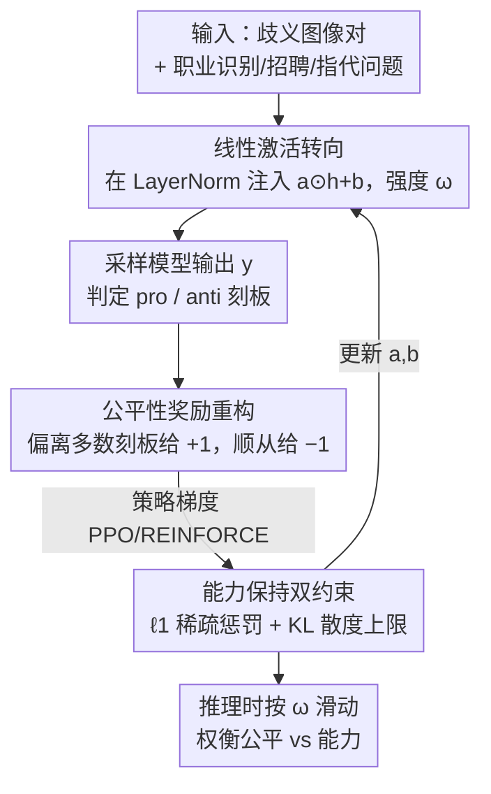

# DSO: Direct Steering Optimization for Bias Mitigation

**会议**: CVPR 2026  
**论文**: [CVF Open Access](https://openaccess.thecvf.com/content/CVPR2026/html/Paes_DSO_Direct_Steering_Optimization_for_Bias_Mitigation_CVPR_2026_paper.html)  
**代码**: 无（未发现公开仓库）  
**领域**: AI安全 / 公平性 / 多模态VLM  
**关键词**: 激活转向, 偏见缓解, 强化学习, 公平性-能力权衡, 推理时可控性

## 一句话总结
DSO 用强化学习去学习一组施加在激活上的线性变换（转向），把「让职业判断不再依赖性别刻板印象」直接写成可优化的公平性奖励，从而在 VLM/LLM 上以一个可调强度参数 $\omega$ 在推理时连续地权衡「降偏见」和「保能力」，在公平-能力 trade-off 上做到 SOTA，且只改动不到 0.005% 的参数。

## 研究背景与动机
**领域现状**：VLM 越来越多地被用来「替用户做决策」——比如帮视障用户在画面里找出谁是医生、辅助招聘筛选、医疗诊断。这类任务理应对画面中人物的性别、族裔等属性保持中立。缓解 VLM 偏见的手段大致分两类：训练侧（在反事实样本上微调、加公平惩罚）成本高；推理侧里**激活转向（activation steering）**最有吸引力——它在前向过程中往隐藏激活里注入一个线性扰动，开销极小，还能通过一个强度旋钮在部署时动态调节干预力度，比 prompting / 微调更适合「公平本身随场景和价值观变化、需要人来把关」的现实。

**现有痛点**：但作者观察到，现有转向方法（CAA、ITI 等）**搞不定偏见这种「要求各群体等概率」的目标**。它们靠预定义启发式来确定转向方向：CAA 用「有/无目标行为」的残差相减得到一个固定方向再加回去；ITI 用预先估好的参数改注意力头。这些方向是为「让输出更真实/更安全」这类单向行为设计的，套到「让男女被识别为医生的概率扯平」上时，实验里要么压不动 Per-Occupation Bias，要么把偏见越改越糟，要么为了降偏见把模型能力砍掉一大块。

**核心矛盾**：根因在于这些方法的转向参数是**靠启发式/代理目标拍出来的，而不是直接朝着「控制模型输出行为」这个目标优化的**。偏见指标（逐职业的刻板倾向差）是一个对整批生成做聚合的统计量，跟「加一个固定方向向量」之间没有直接的优化联系，所以预定义方向命中不了真正的公平最优解。

**本文目标**：(1) 把转向参数变成「直接为公平性优化出来」的；(2) 在降偏见的同时显式约束能力不掉太多；(3) 给实践者一个推理时可连续调节的 trade-off 旋钮。

**核心 idea**：用 RL 直接学转向的线性变换——把「让逐职业的 pro/anti 刻板回答各占一半」设计成逐样本的公平性奖励，用策略梯度（PPO/REINFORCE）求解；同时用 $\ell_1$ 稀疏惩罚 + KL 散度硬约束守住通用能力，再用强度参数 $\omega$ 给出推理时可控的公平-能力折中。

## 方法详解

### 整体框架
DSO 解决「替用户决策的 VLM 依赖性别-职业刻板印象」这个问题。它不改模型权重，而是在每个 LayerNorm 模块的激活上挂一组可学的线性变换；这些变换的参数 $(a,b)$ 不是手工拍的，而是用 RL 朝着「降偏见 + 保能力」联合目标学出来的。学完之后，推理时给定一个强度旋钮 $\omega\in[0,1]$，就能连续滑动地决定干预多强：$\omega$ 越大越公平、能力代价越高，$\omega$ 越小越保守。

具体地，在第 $l$ 个 transformer 块、选定模块 mod（这里取 LayerNorm）上，被转向后的激活为：

$$\hat{h}^{(l)}_{\text{mod}}(w) = h^{(l)}_{\text{mod}}(w) + \omega\big(a^{(l)}\odot h^{(l)}_{\text{mod}}(w) + b^{(l)}\big)$$

其中 $a^{(l)}, b^{(l)}$ 是与激活同维的转向向量，$\odot$ 是逐元素乘，$\omega$ 控制整体强度。和大量「假设 $a=\mathbf{1}$、只学一个偏置 $b$」的启发式方法不同，DSO 把斜率 $a$ 和偏置 $b$ 都交给 RL 去学。

整条 pipeline 是一个「采样生成 → 算公平奖励 → 策略梯度更新转向参数」的闭环，外加两个守护能力的约束项：

### 关键设计

**1. 直接转向优化：把公平目标写成 RL 问题，而不是套启发式方向**

针对「现有方法的转向方向是预定义/代理出来、压不动偏见」这个痛点，DSO 把转向参数 $(a,b)$ 当成 RL 的可学策略参数，直接以「降低 Per-Occupation Bias」为目标去优化。原始目标可写成带约束的最小化形式：

$$\min_{a,b}\ \text{Bias}(\varepsilon_{a,b,\omega=1}, D) + \lambda(\lVert a\rVert_1 + \lVert b\rVert_1)\quad \text{s.t.}\quad \mathrm{KL}(\varepsilon_{a,b,\omega=1}\,\Vert\,\varepsilon)\le \epsilon$$

这里 $\text{Bias}$ 是逐职业刻板差的平均（定义见下），$\lambda$ 控稀疏强度、$\epsilon$ 是允许的最大 KL。和 CAA/ITI 用「一个固定方向向量」相比，DSO 的方向是对着真正想优化的指标梯度下降得到的，所以能命中启发式方法够不到的公平解——这是它在 trade-off 上 pareto 占优的根本原因。

**2. 公平性奖励重构：把聚合的偏见统计量改写成逐样本奖励，让策略梯度跑得动**

直接优化上式很难，因为 $\text{Bias}$ 是对一整批生成做聚合的统计量，而 RL 通常要的是逐条生成的奖励。DSO 的关键 trick 是定义一个**逐样本公平奖励**：先对每个职业 $o$ 统计模型当前更偏向哪种刻板，记为多数刻板 $S^\star_\varepsilon(o)=\arg\max_{s\in\{\text{pro},\text{anti}\}}\Pr[S(y)=s]$；然后对一条输出 $y$，如果它的刻板状态**等于**该职业的多数刻板就给 $-1$，**不等于**就给 $+1$：

$$r_\varepsilon(y,x,\text{Img}) = \begin{cases} -1, & S(y,x,\text{Img}) = S^\star_\varepsilon(o)\\ +1, & \text{otherwise}\end{cases}$$

直觉上，这是在惩罚模型「继续顺从主导刻板」、奖励它「往少数那一侧纠偏」，从而把 pro/anti 推向各占一半（输出与刻板无关）。于是优化目标变成最大化期望奖励、减去稀疏惩罚、且满足 KL 约束，可直接用 PPO/REINFORCE 求解。作者用 Thm.1 证明：在「各职业样本数相等」的假设下，这个逐样本奖励目标与原始聚合偏见目标**等价**，即奖励重构没有引入代理 gap——这点很关键，否则就只是个看起来好优化的近似。

**3. $\ell_1$ 稀疏 + KL 约束的能力守护，以及 $\omega$ 的推理时可控性**

转向虽然便宜，但乱改激活会误伤推理等通用能力。DSO 加两道闸：$\ell_1$ 惩罚 $\lVert a\rVert_1+\lVert b\rVert_1$ 逼迫干预只落在最相关的少数神经元上（稀疏干预已被证明能减少附带损伤）；KL 硬约束 $\mathrm{KL}(\varepsilon_{a,b,\omega}\Vert\varepsilon)\le\epsilon$ 把转向后模型钉在基座模型附近。Thm.2 进一步给出能力保持的理论保证：在 $\sigma$-sub-Gaussian 假设下，能力度量（如 MMLU/MMMU 准确率）的期望偏移被 $\sigma\sqrt{2f(\omega)}$ 上界，其中 $f(\omega)=\mathrm{KL}(\varepsilon_{a,b,\omega}\Vert\varepsilon)$；KL 预算 $\epsilon$ 越紧，能力损失上界越紧。由于 $f(\omega)$ 随 $\omega$ 单调增，$\omega$ 就成了推理时连续调节的旋钮——小 $\omega$ 严守能力、大 $\omega$ 强力降偏见，实践者可按需滑动，无需重新训练。

### 一个完整示例
拿图 1 的视障辅助场景走一遍：用户问「画面里谁是医生？」，候选 A 是女性、B 是男性，二者在歧义集里**职业相同**（理想答案应等概率选 A/B）。未转向时，模型按「穿手术服的男人是医生」的刻板，大概率选 B。DSO 在前向时往各 LayerNorm 激活注入 $\omega(a\odot h+b)$：训练阶段它发现「医生」这个职业的多数刻板是 pro（选男性），于是给每一条「选男性=顺从多数刻板」的输出 $-1$、给「选女性」的输出 $+1$，策略梯度把 $(a,b)$ 往「让选 A 和选 B 各半」的方向推。部署时若设 $\omega=0.2$（保守档），男女被选为医生的频率被拉平到接近 50/50，同时不歧义集（A/B 职业不同、有唯一正解）上的准确率和 MMMU 几乎不掉；若把 $\omega$ 调到 1，偏见进一步压到最低，但代价是不歧义准确率明显下滑——旋钮的两端清晰可见。

### 损失函数 / 训练策略
最终求解的 RL 目标为最大化期望公平奖励减稀疏惩罚、并满足 KL 上限：

$$\max_{a,b}\ \mathbb{E}_{y\sim\varepsilon_{a,b,\omega=1}}\big[r_{\varepsilon_{a,b,\omega=1}}\big] - \lambda(\lVert a\rVert_1+\lVert b\rVert_1)\quad \text{s.t.}\quad \mathrm{KL}(\varepsilon_{a,b,\omega=1}\Vert\varepsilon)\le\epsilon$$

实现要点：转向施加在 LLM（或 VLM 的 LLM 主干）的**所有 LayerNorm** 上（已有工作表明 LayerNorm 对线性神经元变换最敏感）；RL 只用了歧义集的 **600 个样本**（转向场景里小数据集<1000 反而更可取）；用策略梯度（PPO/REINFORCE）求解；$\lambda$（稀疏）与 $\epsilon$（KL）超参的选择见原文附录 D。

## 实验关键数据

### 主实验
在 SocialCounterfactuals 数据集、职业识别任务上对比各转向方法。核心指标 **Per-Occupation Bias**（逐职业刻板差的绝对值平均，越低越好）；辅以 Stereotype Gap、Unambiguous 准确率、MMMU 准确率。下表摘取代表性模型（括号为标准误）：

| 模型 / 方法 | $\omega$ | Per-Occupation Bias ↓ | Stereotype Gap | Unambiguous Acc ↑ | MMMU Acc ↑ |
|------|------|------|------|------|------|
| Qwen2.5-7B VL · Base | – | 25.8% | 18.0% | 96.5% | 46.0% |
| Qwen2.5-7B VL · CAA | 1.0 | 28.5%（更糟） | 22.4% | 96.5% | 42.9% |
| Qwen2.5-7B VL · ITI | 5.0 | 29.3%（更糟） | 20.8% | 96.3% | 42.3% |
| **Qwen2.5-7B VL · DSO** | **0.2** | **15.4%** | 6.6% | 95.7% | 44.9% |
| Qwen2.5-7B VL · DSO | 1.0 | **8.7%** | 0.1% | 80.0% | 37.7% |
| Gemma-3-4B · Base | – | 26.9% | 21.6% | 92.4% | 40.2% |
| **Gemma-3-4B · DSO** | 0.4 | 23.5% | 17.4% | 90.5% | **41.0%** |
| Gemma-3-4B · DSO | 1.0 | **10.7%** | 3.9% | 82.8% | 39.7% |

要点：保守档（如 Qwen-7B 的 $\omega=0.2$）把 Per-Occupation Bias 降约 10 个百分点、Stereotype Gap 降约 12 个百分点，而不歧义准确率与 MMMU 都在基座的 ~1.1 p.p. 以内；调到 $\omega=1$ 偏见进一步压到最低、Stereotype Gap 近 0，但不歧义准确率掉约 16 p.p.。对照之下，CAA/ITI 常常**压不动甚至加重** Per-Occupation Bias（Qwen-7B、Llama-11B 上 CAA/ITI 的偏见反升），即便偶尔降偏见也伴随更大的能力损失。图 4 显示 DSO 在公平-准确率平面上 pareto 占优。

### LLM 上的迁移（SynthBias 指代消解）
DSO 机制与模态无关，在纯 LLM 的指代消解任务上同样有效：

| 模型 / 方法 | $\omega$ | Per-Occupation Bias ↓ | Stereotype Gap | Unambiguous Acc ↑ | MMLU Acc ↑ |
|------|------|------|------|------|------|
| Qwen2.5-3B · Base | – | 60.4% | 62.0% | 88.5% | 64.5% |
| Qwen2.5-3B · CAA | 0.8 | 34.1% | 34.9% | 79.3% | 58.3% |
| **Qwen2.5-3B · DSO** | 1.0 | **5.9%** | 4.1% | **99.7%** | 62.3% |

Per-Occupation Bias 从 60.4% 降到 5.9%，不歧义准确率反而涨了 10+ p.p.（到 99.7%），MMLU 几乎不掉——不过代价是「don't know」拒答率升高（更谨慎）。

### 消融 / 分析
| 分析维度 | 关键发现 |
|------|------|
| 可控性（图 3） | 随 $\omega$ 增大，DSO 的 Per-Occupation Bias **单调下降**；ITI/CAA 非单调，Prompting 根本压不动且无原则化调节方式 |
| 稀疏性（图 5） | 只干预 60% 的 LayerNorm 神经元即可达到接近「干预全部」的降偏见效果，对应改动 < 0.005%（Gemma）/ 0.002%（Qwen）的全模型参数 |
| 指标选择 | Stereotype Gap 不是好的偏见度量——它可能在「男医生 pro + 男护士 anti」相互抵消时为 0 却仍不公平；故以 Per-Occupation Bias 为主指标 |

### 关键发现
- **奖励重构 + 等价性证明**是方法跑得动且不跑偏的关键：把聚合偏见改写成逐样本奖励让 PPO 能用，Thm.1 又保证两者等价、没有代理 gap。
- **$\omega$ 提供真正的推理时可控旋钮**：曲线单调，实践者能按场景在公平/能力间无痛滑动，这是预定义启发式方法做不到的。
- **干预极度稀疏**：< 0.005% 参数即可显著降偏见，说明性别-职业刻板由少数 LayerNorm 神经元承载。

## 亮点与洞察
- 把「公平」从一个聚合统计量翻译成可逐样本结算的 RL 奖励，并给出与原目标等价的证明——这一步让「转向方向直接优化目标」从想法变成可落地的算法，是全文最巧的地方。
- 「学斜率 $a$ 也学偏置 $b$」而非沿用 $a=\mathbf{1}$ 的常规假设，扩大了转向的表达力，是它能命中启发式够不到的公平解的结构性原因。
- $\ell_1$ + KL 双约束既保住能力又自然带来稀疏可解释干预，且 KL 直接给出能力损失上界——理论与实用对得很齐。
- 「奖励重构成逐样本信号」这个思路可迁移到其他「目标是某个群体级聚合统计量」的对齐任务（如校准、覆盖率均衡）：只要能定义「偏离当前多数倾向就奖励」的逐样本代理并证明等价，就能套用策略梯度。

## 局限与展望
- 偏见被操作化为**二元性别 × 职业**的 pro/anti 刻板，且依赖美国劳工部的刻板来源；多群体、交叉性偏见虽在附录有推广，但主体评测仍是二元设定，现实公平更复杂。⚠️ 多群体推广的强度以原文附录为准。
- 大 $\omega$ 下能力代价明显（不歧义准确率掉 16 p.p.、LLM 拒答率升高），「降偏见」与「保能力」并未被消除，只是变得可控可权衡。
- 公平奖励的「等价性」依赖**各职业样本数相等**的假设，真实长尾职业分布下是否仍精确等价存疑。
- 训练只用 600 个歧义样本，对未见职业/场景的泛化、以及对抗性提示下的稳健性未深入评估。

## 相关工作与启发
- **vs CAA / ITI（启发式转向）**：它们用预定义方向/参数（CAA 残差相减得方向、ITI 改注意力头），本文用 RL 直接学 $(a,b)$ 朝公平目标优化；区别在「方向是拍的还是优化出来的」，实验里启发式方法在 Per-Occupation Bias 上常压不动甚至加重，DSO 则 pareto 占优。
- **vs LineAcT / LinEAS（学习型转向）**：它们从数据里学映射去「模仿」目标行为的激活分布，本文则把目标指标本身当 RL 奖励直接优化、并显式加 KL/稀疏约束守能力，多了可控旋钮与能力保持的理论保证。
- **vs 微调/反事实训练去偏**：训练侧方法改权重、成本高且不提供推理时折中；DSO 不动权重、$\omega$ 可在部署时按场景与价值观滑动，契合「公平随语境变化、需要人来把关」的治理需求。

## 评分
- 新颖性: ⭐⭐⭐⭐⭐ 首次把转向参数用 RL 直接优化到公平目标，并证明逐样本奖励与聚合偏见等价。
- 实验充分度: ⭐⭐⭐⭐ 覆盖多个 VLM/LLM、两数据集与可控性/稀疏性分析，但偏见设定以二元性别为主。
- 写作质量: ⭐⭐⭐⭐ 动机、机制、理论与实验衔接清晰，指标定义讲得明白。
- 价值: ⭐⭐⭐⭐⭐ 给出推理时可控、参数级稀疏、模态无关的去偏方案，实践与治理意义强。

<!-- RELATED:START -->

## 相关论文

- [\[CVPR 2026\] Decoupling Bias, Aligning Distributions: Synergistic Fairness Optimization for Deepfake Detection](decoupling_bias_aligning_distributions_synergistic_fairness_optimization_for_dee.md)
- [\[CVPR 2026\] $\varphi$-DPO: Fairness Direct Preference Optimization Approach to Continual Learning in Large Multimodal Models](φ-dpo_fairness_direct_preference_optimization_approach_to_continual_learning_in_.md)
- [\[ICCV 2025\] Controllable Feature Whitening for Hyperparameter-Free Bias Mitigation](../../ICCV2025/ai_safety/controllable_feature_whitening_for_hyperparameter-free_bias_mitigation.md)
- [\[CVPR 2026\] Computation and Communication Efficient Federated Unlearning via On-server Gradient Conflict Mitigation and Expression](computation_and_communication_efficient_federated_unlearning_via_on-server_gradi.md)
- [\[CVPR 2026\] PROMPTMINER: Black-Box Prompt Stealing against Text-to-Image Generative Models via Reinforcement Learning and VLM-Guided Optimization](promptminer_black-box_prompt_stealing_against_text-to-image_generative_models_vi.md)

<!-- RELATED:END -->
