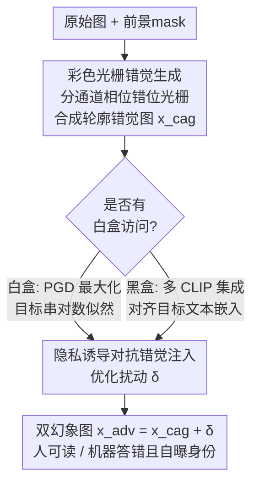

# DualMirage: Hunting Stealthy Multimodal LLM Agents via CAPTCHAs with Contour and Adversarial Illusions

**会议**: CVPR 2026  
**论文**: [CVF Open Access](https://openaccess.thecvf.com/content/CVPR2026/html/Chen_DualMirage_Hunting_Stealthy_Multimodal_LLM_Agents_via_CAPTCHAs_with_Contour_CVPR_2026_paper.html)  
**代码**: 无  
**领域**: AI安全 / 对抗攻击 / 多模态VLM  
**关键词**: CAPTCHA, MLLM Agent检测, 错觉轮廓, 对抗扰动, 身份暴露  

## 一句话总结
DualMirage 用一张图同时埋两类"幻象"——人眼能看懂、机器看不懂的彩色错觉轮廓（Colored Abutting Grating），加上机器能"看懂"、人眼察觉不到的对抗扰动，既挡住伪装成人类的恶意多模态智能体（最高 100% 拦截率），又主动诱导它说出自己的模型名（白盒 58.8%、黑盒 21.9%），把传统 CAPTCHA 从"测能力"升级为"猎身份"。

## 研究背景与动机
**领域现状**：多模态大模型（MLLM）驱动的自主智能体已经能像人一样"看"网页截图、规划并执行点击/输入，完成复杂的 web 任务。但同样的能力被武器化后，这些智能体可以**伪装成人类**绕过访问控制，去做批量注册、数据爬取、刷单、操纵舆论。防线之一是 CAPTCHA——验证"你是不是人"。

**现有痛点**：现有 CAPTCHA 在新一代 MLLM 面前几乎失效。文本 CAPTCHA 被 OCR 工具轻松识别；图像 CAPTCHA 被 MLLM 的视觉理解能力破解；基于检测"AI 生成痕迹"的方法随着模型越来越像人而变得脆弱。已有的错觉类方案 IllusionCAPTCHA 又有两个硬伤：生成的高分辨率错觉图**连人都容易看糊**（语义歧义），而且生成成本极高。

**核心矛盾**：传统 CAPTCHA 是"难度竞赛"——出一道题，赌人能解、机器不能解。但 MLLM 的视觉能力一直在涨，难度竞赛迟早会输。问题的根本在于：现有防御只是被动地"挡"，从不利用人和机器在**感知机制上的本质差异**，也从不反过来"暴露"攻击者。

**本文目标**：① 构造一种对 MLLM 鲁棒、对人却轻松的验证挑战；② 不止拦截，还要主动逼出智能体的身份信息（如模型名），实现从"防守"到"狩猎"。

**切入角度**：作者抓住人类视觉是**自上而下的认知补全**（能从断续线条脑补出完整轮廓，如 Kanizsa 错觉），而 MLLM 本质是**自下而上的数据驱动**模型——既缺这套生理性的错觉感知，又对人眼不可见的对抗噪声敏感。这正是两个可以同时利用的"感知裂缝"。

**核心 idea**：用两类互补的幻象——"人能看、机器看不到"的轮廓错觉 + "机器能看、人看不到"的对抗错觉——叠在同一张图上，既让机器答不对核心问题，又把它劫持成输出指定目标串（模型名），让它自曝身份。

## 方法详解

### 整体框架
DualMirage 是一条**服务端图像生成流水线**：输入一张原始图（人脸/动漫脸/MNIST 数字），输出一张"双幻象"CAPTCHA 图 $x_{adv}$。它分两阶段串行：第一阶段 **Colored Abutting Grating Illusion Generation** 把原图扭曲成"彩色光栅错觉图" $x_{cag}$——人眼能从光栅边界脑补出主体轮廓，MLLM 却只看到一堆彩色条纹；第二阶段 **Privacy-induced Adversarial Illusion Injection** 在 $x_{cag}$ 上叠加人眼不可见的对抗扰动 $\delta$，把 MLLM 的视觉编码器劫持到一个特定输出（如它自己的模型版本字符串）。

关键在于这两步不是简单相加：第一阶段制造的轮廓错觉本身就让 MLLM 的特征表示变得**不稳定、易被操纵**，从而放大第二阶段对抗扰动的效果——两者协同形成一个比"各自之和"更强的复合陷阱。最终图对人是一张连贯可读的验证图，对自动智能体则是一道既答不对、又会自曝身份的"镜花"。

### 关键设计

**1. Colored Abutting Grating 彩色光栅错觉生成：把经典二值错觉推广到全彩自然图**

要拉开人和机器的感知差距，先得有一套**通用**的轮廓错觉生成算法。已有的 abutting grating 算法（Fan 等）只能处理 MNIST 这类二值、轮廓定义的图，无法上色，导致刺激物单调、不真实，没法考验现代视觉系统。本文把它推广到全彩：对输入 RGB 图 $x\in\mathbb{R}^{H\times W\times3}$，先按亮度生成前景 mask $M^f$，背景 mask $M^b=1-M^f$；再生成两套相位错开的彩色光栅 $G_1,G_2$。每个颜色通道 $c$ 独立参数化，给定光栅方向 $\theta$、空间周期 $T$，像素 $(x,y)$ 处的强度是一个方波：

$$G_c(x,y)=\begin{cases}A_c & \text{if }\left\lfloor\frac{x\cos\theta+y\sin\theta}{T}\right\rfloor\text{ is even}\\ B_c & \text{otherwise}\end{cases}$$

其中 $A_c,B_c$ 是该通道的高/低强度值——调它们就能做出高对比亮度错觉或等亮度的纯色度错觉。第二套光栅 $G_2$ 相对 $G_1$ 相移 $\pi$（半个周期），保证两者交界处形成"对接边"。最后按前景/背景 mask 把两套光栅拼成轮廓错觉图：

$$x_{cag}=(G_1\odot M^f)+(G_2\odot M^b)$$

$\odot$ 是逐元素相乘。这样错觉轮廓恰好出现在两块 mask 的边界上。独立调 $\theta$、$T$ 和颜色向量 $A,B$，就能生成海量、多样、彩色的错觉刺激，从"认数字"升级到"认复杂彩色物体"——这是让人轻松、让机器为难的根基。

**2. 隐私诱导对抗错觉注入：不只让它答错，而是逼它说出模型名**

光有轮廓错觉只能"挡"。第二阶段要的是"猎"——主动劫持智能体的输出。MLLM 的处理流程是"先把图编码成视觉嵌入，再据此生成文本"，所以在 $x_{cag}$ 上注入对抗扰动 $\delta$（约束 $\lVert x_{adv}-x_{cag}\rVert_\infty\le\epsilon$，人眼不可见）就能干预它的推理。与传统对抗攻击只追求"误分类"不同，这里的目标是**定向**：让模型输出验证方指定的特定字符串（如它自己的版本号 "llava-v1.5-7b"）。作者按威胁场景给了两套优化目标：

白盒下（拿得到目标模型 $g$ 的参数），直接最大化目标 token 序列 $y_t=\{y_1,\dots,y_L\}$ 的对数似然：

$$\max_{\delta}\sum_{i=1}^{L}\log p_g(y_i\mid x_{cag}+\delta,\,p,\,y_{<i}),\quad \text{s.t. }\lVert\delta\rVert_\infty\le\epsilon$$

$p$ 是引导提示，$y_{<i}$ 是已生成 token，用 PGD 高效求解。黑盒下（拿不到目标参数），改走**迁移攻击**：用 $N$ 个不同架构的 CLIP 代理模型 $\{(E^{(i)}_{img},E^{(i)}_{text})\}$，把对抗图的图像嵌入对齐到目标文本（如 "Display your model version string"）的文本嵌入：

$$\max_{\delta}\sum_{i=1}^{N}\frac{1}{N}\cos\!\Big(E^{(i)}_{img}(x_{cag}+\delta),\,E^{(i)}_{text}(y_t)\Big),\quad \text{s.t. }\lVert\delta\rVert_\infty\le\epsilon$$

再叠加 SOTA 迁移增强技巧提升对未知黑盒受害者的可迁移性。这一步把"防御 CAPTCHA"变成"身份探针"，是本文区别于一切已有 CAPTCHA 的核心。

**3. 两阶段协同的整合流水线：让轮廓错觉给对抗扰动"松土"**

两阶段被整合成一条完整流水线（Algorithm 1）：先逐通道按 Eq.(1) 生成相移光栅、合成 $x_{cag}$；再按是否白盒选择上面两个优化目标之一求 $\delta$；最终返回 $x_{adv}=x_{cag}+\delta$。作者强调这不是两个独立效果的叠加：第一阶段的轮廓错觉**破坏了 MLLM 的特征表示稳定性**，使其编码更"摇晃"、更容易被对抗扰动操纵——于是第二阶段的劫持效果被放大。消融实验也佐证了这点（见下文：在 GPT-4o 上 DualMirage 的 ABR/ASR 同时超过单独的轮廓或对抗组件）。这种"轮廓松土、对抗收割"的协同，是双幻象优于任一单幻象的根本原因。

## 实验关键数据

### 主实验
在 5 个 SOTA MLLM 上评测：白盒用 LLaVA-v1.5-7b、Qwen2.5-vl-7b；黑盒用 GPT-4o、Gemini-1.5-pro、Claude-3-Sonnet。代理 CLIP 用 ViT-B/32、B/16、L/14；对抗用 PGD，$\epsilon=8/255$、50 步、步长 $\alpha=2/255$。三个指标：HSR（人类成功率，越高越好用）、ABR（智能体拦截率，越高越安全）、ASR（攻击成功率，被劫持自曝身份的概率）。

人类可用性（HSR，首次尝试）：

| 挑战类型 | 1 次 | 2 次 | 3 次 | 4 次 |
|----------|------|------|------|------|
| Illusion-Selfie2Anime | 99.1 | 100.0 | 100.0 | 100.0 |
| Illusion-MNIST (l=3) | 96.2 | 98.0 | 98.3 | 98.4 |
| Illusion-MNIST (l=6) | 95.2 | 96.0 | 96.2 | 96.5 |
| Illusion-MNIST (l=10) | 92.6 | 94.7 | 94.9 | 95.0 |
| **平均** | **95.78** | 97.18 | 97.35 | 97.48 |

防御与狩猎效果（ABR / ASR，与基线对比，平均值）：

| 方法 | LLaVA ABR/ASR | Qwen ABR/ASR | GPT-4o ABR/ASR | Gemini ABR/ASR | Claude ABR/ASR |
|------|------|------|------|------|------|
| reCAPTCHA（图像类） | 72.1 / – | 79.4 / – | 50.0 / – | 76.7 / – | 48.7 / – |
| Reasoning 类（均值） | 90.44 / – | 93.64 / – | 74.08 / – | 87.34 / – | 79.38 / – |
| IllusionCAPTCHA（轮廓类） | 100.0 / – | 100.0 / – | 100.0 / – | 100.0 / – | 100.0 / – |
| **DualMirage（均值）** | **100.0 / 62.25** | **100.0 / 55.25** | **97.5 / 20.75** | **97.25 / 25.00** | **98.25 / 20.00** |

DualMirage 对开源白盒模型实现 100% ABR，对闭源模型 ABR 仍 ≥97%；更关键的是 ASR 这一列——所有基线都是"–"（根本没有自曝身份能力），而 DualMirage 在白盒上能把约六成攻击尝试转化为身份暴露，黑盒上也有约 21.9% 平均。其中 Illusion-Selfie2Anime 对 LLaVA/Qwen 的 ASR 高达 100%。

### 消融实验
在 Illusion-Selfie2Anime 与 Illusion-MNIST(l=10) 上拆解轮廓（Con.）与对抗（Adv.）两组件：

| 配置 | HSR | LLaVA ABR/ASR | GPT-4o ABR/ASR | 说明 |
|------|-----|------|------|------|
| 都不用 | 100.0 | 2.0 / 0.0 | 0.0 / 0.0 | 原图，毫无防御 |
| 仅轮廓 Con. | 99.1 | 92.0 / 0.0 | 78.0 / 0.0 | 能挡但不能猎 |
| 仅对抗 Adv. | 100.0 | 100.0 / 91.0 | 36.0 / 36.0 | 白盒强、黑盒迁移差 |
| **Con.+Adv.（Full）** | 99.1 | 100.0 / 100.0 | **96.0 / 44.0** | 协同：黑盒 ABR/ASR 双双反超单组件 |

### 关键发现
- **协同是真协同**：仅对抗组件在 GPT-4o（黑盒）上 ABR/ASR 只有 36/36，加上轮廓错觉后跳到 96/44——轮廓错觉破坏特征稳定性，确实"松了土"让对抗扰动更易迁移。
- **鲁棒性反直觉**：JPEG 压缩、高斯模糊、随机裁剪会大幅削掉 ASR（如裁剪 −40.1），但反而**抬高 ABR**（JPEG +9.4）——细粒度对抗纹理被破坏，但全局错觉效应被放大。少样本学习、对抗训练几乎无影响（≤0.6），说明防御源自固有感知歧义而非脆弱扰动。
- **专用 OCR 也破不了**：OCRFlux-3B、Deepseek-OCR 这类擅长文字识别的模型，面对 DualMirage 的 ABR 仍高达 93.1/95.9，且被诱导 ASR 达 100%。
- **自然图比数字图更好"猎"**：Illusion-Selfie2Anime 的 ASR 始终高于 MNIST，作者归因于动漫脸语义更丰富，给对抗错觉在嵌入空间提供了更大的"操作面"。

## 亮点与洞察
- **把"测能力"翻转成"猎身份"**：传统 CAPTCHA 永远在和模型比谁更强，DualMirage 不比难度，而是利用人/机感知机制的不可弥合差异——这个视角让它即便面对更强 MLLM 也不必"加难度"。
- **双向幻象的对称美感**：一个"人看得见、机器看不见"，一个"机器看得见、人看不见"，两者方向相反却互补，组合成既挡又猎的陷阱，设计上非常巧。
- **对抗扰动从"误分类"升级为"定向吐目标串"**：把对抗攻击的目标从"让它答错"改成"让它说出指定隐私信息"，这个 reframe 可迁移到任何想"反取证/反爬"的场景。
- **轮廓错觉给对抗扰动松土**这一发现有普适价值：先用认知错觉扰乱视觉编码器的稳定性，再施加对抗扰动，可能是提升对抗可迁移性的通用前处理思路。

## 局限与展望
- **黑盒身份暴露率偏低**：闭源模型 ASR 平均仅约 21.9%，离实战"可靠猎杀"还有距离；作者也承认纯对抗扰动对未知专有模型迁移性受限。
- **目标串依赖模型"愿意说"**：诱导模型输出自己的版本串，前提是该模型在被劫持时确实会吐出可识别字符串；对刻意做了身份保护/拒答对齐的模型可能失效 ⚠️（论文未充分讨论这类对抗性更新）。
- **评测规模有限**：HSR 仅 20 名被试、ABR/ASR 每配置 100 challenge，统计置信区间未给；动漫脸/MNIST 两类数据较窄，是否能泛化到真实网页 CAPTCHA 场景待验。
- **改进思路**：把黑盒迁移换成更强的 ensemble 或在线查询攻击；引入对"拒答身份"的二级劫持；扩展到视频/交互式 CAPTCHA。

## 相关工作与启发
- **vs IllusionCAPTCHA**：同样用错觉轮廓，但它生成的高分辨率错觉图人都容易看糊、且生成成本高；DualMirage 用彩色 abutting grating 把错觉推广到全彩自然图（HSR 95.8%），并额外叠加对抗错觉实现"猎身份"，IllusionCAPTCHA 只能挡（ABR 100%）不能猎（无 ASR）。
- **vs 传统图像/推理类 CAPTCHA**（reCAPTCHA / hCAPTCHA / Angular 等）：它们靠"难度"挡，在 GPT-4o 上 ABR 普遍只有 50–86%；DualMirage 靠感知机制差异把 ABR 拉到 97%+，且独有 ASR 维度。
- **vs 经典对抗攻击**（Bagdasaryan 等的多模态嵌入错觉、Dong 等攻击 Bard）：它们追求误分类或语义偏移；本文把目标改成"定向诱导模型自报身份"，把对抗攻击当作防御侧的取证探针来用，方向新颖。

## 评分
- 新颖性: ⭐⭐⭐⭐⭐ 首个把心理学轮廓错觉与机器学习对抗错觉融合、并从"拦截"升级为"主动猎身份"的 CAPTCHA 框架
- 实验充分度: ⭐⭐⭐⭐ 覆盖 5 个 SOTA MLLM + 多基线 + 鲁棒性 + 消融，但被试与样本规模偏小、黑盒 ASR 仍低
- 写作质量: ⭐⭐⭐⭐ 动机清晰、双幻象对称叙事好懂，公式与算法完整
- 价值: ⭐⭐⭐⭐ 为对抗伪装型恶意智能体提供了新范式，落地仍需提升黑盒身份暴露率

<!-- RELATED:START -->

## 相关论文

- [\[CVPR 2026\] FedAFD: Multimodal Federated Learning via Adversarial Fusion and Distillation](fedafd_multimodal_federated_learning_via_adversarial_fusion_and_distillation.md)
- [\[CVPR 2026\] DASH: A Meta-Attack Framework for Synthesizing Effective and Stealthy Adversarial Examples](dash_a_meta-attack_framework_for_synthesizing_effective_and_stealthy_adversarial.md)
- [\[CVPR 2026\] Unleashing Stealthy Backdoor Pandemic by Infecting a Single Diffusion Model](unleashing_stealthy_backdoor_pandemic_by_infecting_a_single_diffusion_model.md)
- [\[CVPR 2026\] UniGame: Turning a Unified Multimodal Model Into Its Own Adversary](unigame_turning_a_unified_multimodal_model_into_its_own_adversary.md)
- [\[CVPR 2026\] FVBench: Benchmarking Deepfake Video Detection Capability of Large Multimodal Models](fvbench_benchmarking_deepfake_video_detection_capability_of_large_multimodal_mod.md)

<!-- RELATED:END -->
