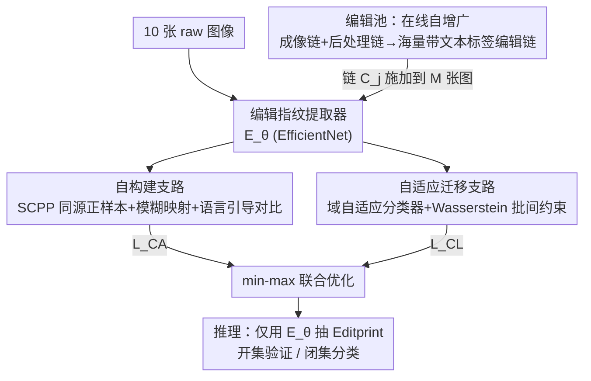

# Editprint: General Digital Image Forensics via Editing Fingerprint with Self-Augmentation Training

**会议**: CVPR 2026  
**论文**: [CVF Open Access](https://openaccess.thecvf.com/content/CVPR2026/html/Wu_Editprint_General_Digital_Image_Forensics_via_Editing_Fingerprint_with_Self-Augmentation_CVPR_2026_paper.html)  
**代码**: https://github.com/HighwayWu/Editprint (有)  
**领域**: AI安全 / 图像取证  
**关键词**: 数字图像取证, 编辑指纹, 自增广训练, 语言引导对比学习, 合成图像检测

## 一句话总结
Editprint 用一个"在线编辑池"把仅 10 张原始 raw 图像自增广出上千万条带文本标签的「成像+后处理」编辑链，再用自增广训练（SAT）从中学一个通用的"编辑指纹"特征，使其在无标注、零样本的合成图像检测（SID）、社交网络溯源（SNP）和相机溯源（CSI）任务上同时逼近甚至超过有监督方法。

## 研究背景与动机
**领域现状**：数字图像取证依赖图像在"成像 → 编辑 → 传输"全过程中留下的处理痕迹来判定可信度，典型任务有相机溯源（CSI）、合成图像检测（SID）、社交网络溯源（SNP）。近年主流转向自监督的通用取证特征——不需要每个任务单独标注，靠对比学习从"同一相机拍摄的图像应有相似特征"这一假设里学一个通用指纹（如 PRNU、ForSim、NoiPri、ExifMeta）。

**现有痛点**：这类方法有两个硬伤。其一是**只盯相机内痕迹（in-camera）**：它们建模的是传感器/ISP 留下的"相机指纹"，因此天然只擅长 CSI，对不那么依赖相机的 SID、SNP 几乎失效——表 2/3 里 NoiPri、ExifMeta 在某些 GAN/DM 或某些社交网络上的 AUC 直接掉到 0.50~0.63（接近随机）。其二是**数据饥渴**：要覆盖足够多相机型号，ExifMeta 这类方法要喂超过 150 万张带 EXIF 标注的图像，采集成本高且永远覆盖不全未来的新相机。

**核心矛盾**：取证特征想"通用"，就得见过足够多样的处理痕迹；但靠"采集真实数据"去覆盖痕迹空间，既贵又不可能穷尽，而且采到的真实数据基本只含相机内痕迹，相机外（out-camera，如压缩/缩放/社交网络再处理）的痕迹严重缺失。

**本文目标**：(1) 让一个特征同时刻画相机内和相机外痕迹，从而能跨 CSI/SID/SNP 通用；(2) 把训练数据需求从百万级压到极少（10 张）。

**切入角度**：作者的关键观察是——既然真实痕迹难采集，那就**用 raw 图像 + 可控的编辑操作在线"造"痕迹**。raw 图像保留了未经 ISP 处理的原始信号，对它施加不同的"成像链 + 后处理链"，就能合成海量、可控、且自带"操作序列"这一标签的训练样本。

**核心 idea**：把取证特征重新定义为"编辑指纹"（Editprint）——经历**相同**成像/编辑/传输过程的图像应得到**相同**的 Editprint，反之则不同；并用一个在线编辑池自增广出海量带文本标签的编辑链来监督它。

## 方法详解

### 整体框架
Editprint 训练的输入是少量 raw 图像（默认仅 10 张）和一个"编辑池"$\mathcal{P}$，输出是一个图像编码器 $E_\theta$（即 Editprint 提取器）；推理时只保留 $E_\theta$，对任意 RGB 图像抽取一个 $D$ 维特征向量，用开集验证（比对两张图特征是否同源）或闭集分类来完成各种取证任务。

训练每个 batch 的数据是"现造"的：从训练集采 $M$ 张 raw 图 $\{X_i\}$，从编辑池采 $N$ 条"编辑链—文本"对 $\{(C_j, T_j)\}$；把每条链 $C_j$ 施加到全部 $M$ 张 raw 图上，得到 $\hat{X}^i_j = g(X_i; C_j)$，于是同一条链下的 $M$ 张图天然构成"同源正样本"。提取器对它们抽特征 $E^i_j = E_\theta(\hat{X}^i_j)$。随后两条监督支路并行作用：**自构建支路（Self-Constructed Branch）**用文本编码器 $F_\phi$ 把链的文本标签编码后做语言引导对比学习，强化特征的全局可分性；**自适应迁移支路（Adaptive Transfer Branch）**用一个域自适应分类器 $P_\psi$ 拉大 batch 内相似编辑链之间的决策间隔。三者（编辑池造数据 → 提取器抽特征 → 双支路监督）端到端联合优化。

### 关键设计

**1. 在线编辑池：用 raw + 可控编辑操作把 10 张图自增广成 10^7 条带文本标签的编辑链**

针对"真实痕迹难采集、相机外痕迹缺失"的痛点，作者不去采数据，而是定义一组基础编辑操作并在线组合出海量编辑链。一条编辑链 $C$ 是把 raw 图 $X$ 转成 RGB 图 $\hat X$ 的有序操作序列，$\hat X = g(X; C)$。操作集 $\mathcal{O}=\mathcal{O}_{in}\cup\mathcal{O}_{out}$ 分两类：**相机内**子链模拟 ISP，含去马赛克、白平衡、色调映射，写作 $C_{in}=\beta_1 O_{DM}\to\beta_2 O_{WB}\to\beta_3 O_{TE}$，其中 $\beta_1\equiv1$、$\beta_2,\beta_3\in\{0,1\}$ 控制各操作是否激活；**相机外**子链 $C_{out}=O_1\to O_2\to\cdots\to O_m$ 由压缩、缩放、模糊、加噪四类基础操作随机高阶采样而成（已有工作验证复杂真实操作可由这些基础操作的高阶组合近似）。二者拼接成完整链 $C=C_{in}\to C_{out}$。组合数上，$|\mathcal{C}_{in}|=48$、$|\mathcal{O}_{out}|=194$，于是 $|\mathcal{C}_{out}|=\sum_{i=1}^m 194^i$，整体可达 $10^7$ 量级的编辑链——这就是"10 张图撑起千万痕迹"的来源。

更关键的是**标签自动化**：每条链 $C_j$ 按操作的先后顺序自动拼出一个文本标签 $T_j$（如"DM-AHD JPEG-75"），无需任何人工标注。作者借鉴 CLIP 的思路，用自然语言文本而非 one-hot 当标签——文本天然编码了链之间的"隐式结构相似性"（共享操作的链文本上也接近），既省去管理庞大 one-hot 向量的麻烦，也避免 one-hot 把所有链当成"等距互斥"的失真。

**2. 自构建支路：靠同源正样本对（SCPP）+ 模糊映射（FM）做语言引导对比学习**

光有数据还不够，怎么把"同链同特征"学进去是核心。这条支路在 CLIP 式图文对比的基础上做了两处关键增强。其一是 **SCPP（Self-Constructed Positive Pairs）**：经典 CLIP 只有图—文正样本对，因为单模态内部的相关性难以显式刻画；但这里同一条链 $C_j$ 处理过的 $M$ 张图本就同源，可以**显式**构造 $M$ 个图—图正样本对，加速并强化训练。其二是 **FM（Fuzzy Mapping，模糊映射）**：一条文本标签现在对应 $M$ 个正样本对，若简单取均值聚合，会忽视不同图像的置信度差异（平坦纹理 vs 丰富纹理在同一链下痕迹强弱不同）和编辑操作之间的内在模糊性（如"DM-AHD JPEG-75"与"DM-AHD Blur-3"共享中间特征）。FM 引入隶属度矩阵 $U=[u_{ij}]\in\mathbb{R}^{M\times N}$，把 $M$ 个特征加权聚合成 $N$ 个代表性图像特征 $I_j$，约束 $\sum_{j=1}^N u_{ij}=1$，并通过最小化下式求最优隶属度：

$$\min_{U,I}\ J=\sum_{j=1}^{N}\sum_{i=1}^{M} u_{ij}^{\rho}\, d(E^i_j, I_j),\quad \text{s.t.}\ \sum_{j=1}^N U_{\cdot j}=1$$

其中 $\rho\in[1,+\infty)$ 是模糊系数（经验取 2）。用拉格朗日乘子法求解，得到 $u_{ij}$ 与 $I_j$ 互相依赖的闭式更新式，再交替迭代到 $J$ 收敛。聚合出的 $I_j$ 与其文本 $T_j$ 组成正样本对，与 batch 内其他链文本 $\{T_k\}_{k\ne j}$ 组成负样本对，沿两个轴做对称对比损失：

$$\mathcal{L}_{CA}(\{I,T\})=\frac{1}{N}\sum_{j=1}^{N}-\log\frac{\exp(I_j\cdot T_j/\tau)}{\sum_{k=1}^N \exp(I_j\cdot T_k/\tau)},\quad \mathcal{L}_{CA}=\mathcal{L}_{CA}(\{I,T\})+\mathcal{L}_{CA}(\{T,I\})$$

$\tau$ 为可学习温度。这一支路负责把 Editprint 的**全局可分性**拉起来。

**3. 自适应迁移支路：域自适应分类器 + Wasserstein 批间约束，专攻相似编辑链的细粒度可分**

自构建支路对"长得很像的编辑链"力不从心——类别可分性约束不足会让决策间隔过窄。这条支路用一个 MLP 分类器 $P_\psi$ 显式拉大类间距离。但在线编辑池产生的类别数极其庞大，建一个覆盖所有类别的全局分类器不现实，所以作者**只对当前 batch 内出现的类别**做分类。监督信号不是硬标签，而是用蒸馏思路从文本特征算出软标签 $y_j=[d(T_k,T_j)]_{k}^\top$（文本间距离反映链的语义相似度），再用软交叉熵 $\mathcal{L}_{SCE}=\frac{1}{N}\sum_j -y_j\cdot\log\hat y_j$ 训练。

由于不同 batch 的类别差异巨大，分类器跨 batch 更新会不稳。作者借鉴域自适应/WGAN，把"前一 batch 与当前 batch 的特征分布差异"建模为 1-Wasserstein 距离并最小化，从而让分类监督在 batch 间保持一致：取分类器输出的核范数 $\|P_\psi(\cdot)\|_*$ 作为 K-Lipschitz 评论函数，差异损失为 $\mathcal{L}_{Dis}(B_p,B_c)=\frac{1}{N}(\|P_\psi(I_p)\|_*-\|P_\psi(I_c)\|_*)$，整支路通过 min-max 优化 $\min_\theta\max_\psi \mathcal{L}_{Dis}$，合并软交叉熵得 $\mathcal{L}_{CL}=\mathcal{L}_{SCE}+\max_\psi\mathcal{L}_{Dis}$。这条支路负责**细粒度可分性**，专门救那些操作差异微小、自构建支路区分不开的相似链。

### 损失函数 / 训练策略
提取器 $E_\theta$、文本编码器 $F_\phi$、分类器 $P_\psi$ 端到端联合优化，总目标为
$$\min_{\theta,\phi}\ \mathcal{L}_{CA}+\mathcal{L}_{CL}.$$
提取器骨干直接用 EfficientNet（作者强调本文重点不在设计新提取器，预实验对比过 ResNet/XceptionNet/ViT 后选定）。训练集仅 $|D_{tr}|=10$ 张 FiveK 的 raw 图；开集验证用 AUC（正负样本对各 10000），闭集分类用 PRC/RCL/F1（每类 25 参考 + 100 查询）。

## 实验关键数据

### 主实验：SID 合成图像检测（开集 AUC）
在 5 个 GAN + 5 个 DM 的零样本检测上，Editprint 平均 AUC 0.9625，比次优的自监督方法 ExifMeta 高 10.86%，且逼近有监督专用方法（HiFi 0.9627 / UniDet 0.9700）。

| 方法 | 类型 | StarGAN | IMLE | SAN | SD | MJ | Mean AUC |
|------|------|---------|------|-----|-----|-----|----------|
| ForSim | 自监督 | .7265 | .7153 | .8663 | .6671 | .5902 | .7414 |
| NoiPri | 自监督 | .9135 | .6855 | .7169 | .6715 | .5091 | .6998 |
| NoiPri++ | 自监督 | .9817 | **.5672** | .9034 | .5722 | .5482 | .7660 |
| ExifMeta | 自监督 | .9888 | .8614 | **.6350** | .7476 | .7726 | .8539 |
| **Editprint** | 自监督 | **.9999** | **.9843** | **.9984** | .8821 | .8454 | **.9625** |
| UniDet | 有监督 | .9855 | .9958 | .9779 | .8932 | .9192 | .9700 |

加粗标注了竞争者的"翻车点"（如 NoiPri++ 在 IMLE 仅 0.5672、ExifMeta 在 SAN 仅 0.6350），凸显其泛化不稳；Editprint 各列均稳。生成方法归因（10 类闭集）上 Editprint 平均 F1 0.9206，远超自监督最高 0.8608（ExifMeta），逼近有监督 0.9213~0.9529。

### SNP 社交网络溯源 & CSI 相机溯源（开集 AUC）

| 任务 | 方法 | 关键数据集 | Mean AUC | 说明 |
|------|------|-----------|----------|------|
| SNP | ExifMeta（自监督） | SDR=.5092 | .7525 | SDR(10 个社交网络)上接近随机 |
| SNP | **Editprint**（自监督） | SDR=**.8120** | **.8853** | 在 SDR 上比 ExifMeta 高 13.28% |
| SNP | MultiClue（有监督） | SDR=.8325 | .8986 | 领先 Editprint 仅 1.33% |
| CSI | ExifMeta（"有监督"，用了标注相机数据） | — | .9211 | |
| CSI | **Editprint**（自监督） | — | .9199 | 仅差有监督 ExifMeta 0.12% |

SNP 是最能体现"相机外痕迹建模"价值的任务：竞争者基本无力区分社交网络再处理痕迹，而 Editprint 在 VISION/FODB 上 AUC 均超 0.90。CSI 上由于竞争者训练时显式用了标注相机数据被归为"有监督"，Editprint 作为唯一的自监督方法仍与它们持平。

### 关键发现
- **相机外任务收益最大**：Editprint 的优势集中在 SID 和 SNP（最高 +13.28% AUC），印证了"联合建模相机内外痕迹"才是它跨任务通用的根因，而非更强的骨干。
- **极小数据可行**：仅 10 张 raw 图就能训练，靠编辑池在线自增广出 $10^7$ 量级痕迹，把数据需求相比 ExifMeta 的 150 万压了 5 个数量级。
- **自监督逼近有监督**：在 SID/SNP/CSI 三类任务上，Editprint 与各自的有监督专用 SOTA 差距普遍压到 1.5% AUC 以内，缩小了两种范式的鸿沟。
- ⚠️ 系统性消融（如 SCPP / FM / 自适应迁移支路各自的增益）作者标注因篇幅放到了附录，缓存正文未给出对应数值表，故此处无法列出逐模块掉点数据。

## 亮点与洞察
- **"造数据"替代"采数据"的取证范式**：用 raw + 可控编辑链在线合成痕迹，天然解决了相机外痕迹采集难、且自带操作序列文本标签的两个老问题——这是把取证从"采集驱动"转向"模拟驱动"的关键一招。
- **把操作序列变成自然语言标签**：用文本而非 one-hot 描述编辑链，让"共享操作的链在标签空间也接近"，把链之间的结构相似性免费喂给对比学习；这个 trick 可迁移到任何"有显式组合结构的类别"场景（如增广策略检索、流程指纹）。
- **模糊映射处理"一文本对多正样本"的置信度差异**：用隶属度矩阵加权聚合而非简单取均值，显式建模了图像纹理强弱和操作模糊重叠，是对 CLIP 单模态正样本聚合的一个有价值改造。
- **借 WGAN 核范数做 batch 间稳定化**：在"类别空间太大只能 batch 内分类"的约束下，用 1-Wasserstein 约束前后 batch 分布差异来稳住分类器，思路精巧。

## 局限与展望
- 编辑池的真实性上限取决于"基础操作集"是否覆盖真实世界的成像/后处理；若真实痕迹来自编辑池未建模的操作（新型 ISP、特殊压缩、未知社交网络管线），合成—真实之间可能存在域差。
- ⚠️ 正文未给出逐模块消融数值，SCPP/FM/自适应迁移支路各自的实际增益、对超参（$\rho$、$M$、$N$、链长 $m$）的敏感性都依赖附录，难以从主文判断各设计的边际贡献。
- 提取器固定为 EfficientNet，作者明确不在此处发力；但骨干与"造数据范式"的协同（更强骨干能否更好吸收 $10^7$ 痕迹）值得进一步探究。
- 改进方向：把编辑池从"手工定义基础操作"升级为可学习/可生成的操作分布，或引入真实少量样本做半监督校准，缩小合成—真实域差。

## 相关工作与启发
- **vs ExifMeta（CVPR'23）**：两者都用语言引导对比，但 ExifMeta 用图像自带的 EXIF 元数据当文本、只建模相机内痕迹、且需 150 万标注数据；Editprint 用"自动生成的编辑链文本"当标签、联合建模相机内外痕迹、仅需 10 张图。区别的根子在于"标签从哪来"——ExifMeta 靠采集到的真实元数据，Editprint 靠自己造的可控操作序列。
- **vs NoiPri / NoiPri++（TIFS'20 / CVPR'23）**：它们靠自监督对比学相机指纹/编辑历史，但本质仍以相机内痕迹为目标，故在 SID/SNP 上泛化差；Editprint 显式把相机外操作纳入编辑池，因此在非相机任务上拉开 10%+ AUC。
- **vs ForSim（TIFS'20）**：ForSim 判定两个 patch 是否应有相同特征来学取证特征，但同样局限于相机相关任务；Editprint 通过可控合成与文本监督，把"相同处理→相同指纹"的假设扩展到了完整的成像+传输全链路。

## 评分
- 新颖性: ⭐⭐⭐⭐⭐ "用 raw+可控编辑池在线自增广痕迹 + 操作序列转文本标签"是对自监督取证范式的实质性重构，而非增量调参。
- 实验充分度: ⭐⭐⭐⭐ 跨 SID/SNP/CSI 三大任务、多数据集、对比自监督与有监督两类基线很充分，但核心消融全部放附录，主文无法验证各模块增益。
- 写作质量: ⭐⭐⭐⭐⭐ 动机—设计—公式链条清晰，三个设计各自对应一个明确痛点，记号统一。
- 价值: ⭐⭐⭐⭐⭐ 把训练数据需求压 5 个数量级、自监督逼近有监督，且代码开源，对取证社区有直接的 baseline 价值。

<!-- RELATED:START -->

## 相关论文

- [\[CVPR 2026\] VisiLock: Authorizing Instruction-based Image editing with Dual Score Distillation](visilock_authorizing_instruction-based_image_editing_with_dual_score_distillatio.md)
- [\[CVPR 2026\] Image-based Outlier Synthesis With Training Data](image-based_outlier_synthesis_with_training_data.md)
- [\[CVPR 2026\] Improving Adversarial Transferability with Local Perturbation Augmentation](improving_adversarial_transferability_with_local_perturbation_augmentation.md)
- [\[CVPR 2026\] Protego: User-Centric Pose-Invariant Privacy Protection Against Face Recognition-Induced Digital Footprint Exposure](protego_user-centric_pose-invariant_privacy_protection_against_face_recognition-.md)
- [\[ICML 2026\] Training-Free Coverless Multi-Image Steganography with Access Control](../../ICML2026/ai_safety/training-free_coverless_multi-image_steganography_with_access_control.md)

<!-- RELATED:END -->
