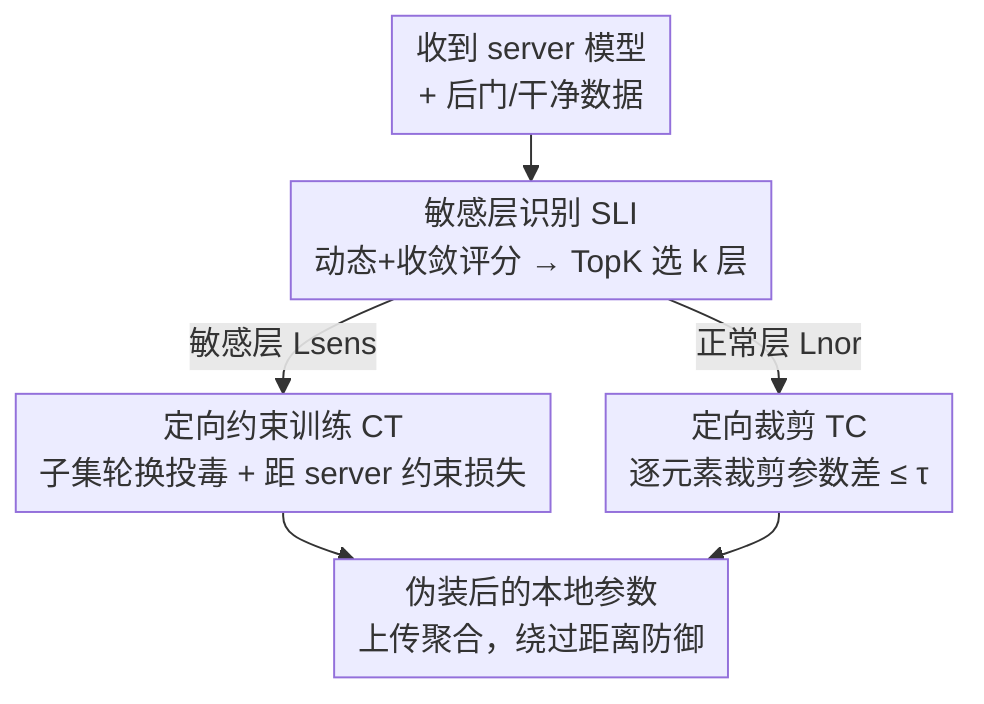

# Eliminate Distance Differences Induced by Backdoor Attacks: Layer-Selective Training and Clipping to Mask Backdoor Models

**会议**: CVPR 2026  
**论文**: [CVF Open Access](https://openaccess.thecvf.com/content/CVPR2026/html/Li_Eliminate_Distance_Differences_Induced_by_Backdoor_Attacks_Layer-Selective_Training_and_CVPR_2026_paper.html)  
**代码**: 未公开  
**领域**: AI安全 / 联邦学习 / 后门攻击  
**关键词**: 联邦学习, 后门攻击, 隐蔽攻击, 层敏感度, 距离防御绕过  

## 一句话总结
LaySelFL 是一种针对联邦学习的隐蔽后门攻击：它先评估每一层对后门目标的"敏感度"、只在最敏感的少数层上投毒，再用约束损失把投毒层逼近 server 模型、对其余正常层做逐元素裁剪，从而抹掉后门模型与干净模型之间的距离差异，使攻击整体有效性提升 25%、并把五种 SOTA 基于距离/相似度的防御方法的拦截率从 26.6% 压到 4%。

## 研究背景与动机

**领域现状**：联邦学习（FL）让多个客户端在不共享原始数据的前提下协同训练一个全局模型，但其分布式特性也让恶意客户端可以用带触发器（trigger）的投毒数据往全局模型里植入后门。攻击方近年主要在"触发器优化"上发力（如 A3FL 联合利用 server 模型、数据特征和攻击目标生成自适应触发器），追求更高的攻击成功率与更长的持久性。

**现有痛点**：作者指出现有后门攻击有两个被忽视的弱点。其一，它们把模型当成一个整体、在**所有层**上同时投毒并隐藏，忽略了不同层对后门成功的**异质贡献**；其二，正因为全模型投毒，后门模型在投毒**早期**就和干净模型拉开了明显的参数距离。而防御侧（RFA、Multi-Krum、Foolsgold、MultiMetric、AlignIns 等）恰恰就是靠"模型距离/相似度"来识别异常更新的——早期那段显著的距离信号就成了攻击的"指纹"。

**核心矛盾**：后门要起效就得改动参数，改动越多攻击越强、但和干净模型的距离差也越大、越容易被距离防御抓出来。作者通过测量 server 模型与后门模型的 L1 距离观察到（论文 Fig.1）：无论固定触发器还是优化触发器，**投毒早期**都会冒出一段明显的距离突起（红框），随训练推进后门特征被全局模型学会、距离才逐渐收敛消失（绿框）。防御方就是抓这段早期突起来及时过滤后门更新。

**本文目标**：能不能设计一种攻击，**主动消除/压低**后门模型与干净模型之间的距离信号，让二者在现有距离防御下几乎无法区分，同时仍保住攻击成功率？

**切入角度**：既然不同层对后门的贡献不均等，那就**不要全模型投毒**——只把投毒集中到少数"最该投毒"的敏感层上，把改动量花在刀刃上；其余层则尽量贴着 server 模型，不留距离痕迹。

**核心 idea**：用"层敏感度评估 + 投毒层约束训练 + 正常层裁剪"三步，把后门改动局部化并约束在距离阈值内，从而在保持高 ASR 的同时抹掉可被距离防御探测的模型差异。

## 方法详解

### 整体框架
LaySelFL 是恶意客户端在本地训练阶段执行的一套投毒流程，替换掉"在全模型上无差别投毒"的常规做法。给定本轮收到的 server 模型，它分三步走：**(1) 敏感层识别（SLI）**——分别在干净数据和后门数据上把 server 模型各训 N 个 epoch，用 L1 距离同时做"动态评估"（逐 epoch 参数变化）和"收敛评估"（最终干净 vs 后门模型差异），合成每层敏感度分数，TopK 选出最敏感的 k 层作为投毒目标；**(2) 定向约束训练（CT）**——把这 k 个敏感层切成若干互斥子集，每个联邦轮只投毒其中一个子集（其余冻结）、并加一个约束损失把投毒层逼近本地训练起点的 server 参数；**(3) 定向裁剪（TC）**——对非投毒的正常层，逐元素裁剪它与 server 模型的参数差，使任何一维偏移都不超过阈值 τ。最后把这样"伪装好"的本地参数上传，混进正常聚合（FedAvg 或带防御的聚合）。

### 关键设计

**1. 敏感层识别（SLI）：用动态+收敛双视角分数衡量每层对后门的贡献，只投毒最敏感的层**

要"把改动花在刀刃上"，前提是知道哪几层对后门最关键。LaySelFL 把 server 模型分别在干净数据集 $M_c$ 和后门数据集 $M_b$ 上各训 N 个 epoch，用 $\mathrm{Diff}(\theta_1,\theta_2)=\lVert\theta_1-\theta_2\rVert_1$ 度量层参数变化。**动态评估**看每层在训练过程中的逐 epoch 抖动：第 $n$ 个 epoch、第 $l$ 层的差异为 $\Delta_c^{(n)}(l)=\mathrm{Diff}(\theta_c^{(n)}(l),\theta_c^{(n-1)}(l))$（后门侧 $\Delta_b^{(n)}(l)$ 同理），对 N 个 epoch 取平均得 $\bar{\Delta}_c(l),\bar{\Delta}_b(l)$，动态分数取二者之差 $S_d(l)=\bar{\Delta}_c(l)-\bar{\Delta}_b(l)$，量化该层"被后门额外搅动了多少"。**收敛评估**则看训练收敛后干净模型与后门模型的最终参数差 $S_c(l)=\mathrm{Diff}(\theta_b^{(N)}(l),\theta_{atk}^{(N)}(l))$。两者相加得每层敏感度 $S_l=S_d(l)+S_c(l)$，再用 TopK 取分数最高的 k 层作为投毒目标 $L_{sens}=\mathrm{TopK}(S,k)$。论文实测（Fig.5）：ResNet18 上卷积层敏感度显著更高，EfficientNet 上特征提取块内的权重层更敏感——这与"这些层承载触发器特征传播"的直觉一致。作者称这是**首个针对后门攻击的层敏感度评估机制**。k 越大投毒层越多、ASR 越高，但引入的距离差也越大（默认 ResNet18 取 60、EfficientNet 取 150）。

**2. 定向约束训练（CT）：敏感层子集轮换投毒 + 约束损失把改动压在 server 模型附近**

光选对层还不够，单轮在全部敏感层上猛投毒仍会一次性拉大距离。CT 用两招把每轮的扰动摊薄。其一是**子集轮换**：把敏感层集合切成 $P$ 个互斥子集 $L_{sens}=\bigcup_{p=0}^{P-1}L_p$，第 $r$ 个联邦轮只训练 $L_p\,(p=r\bmod P)$ 这一个子集、其余层全部冻结，相当于把对模型的扰动在时间上分散开，单轮不显眼。其二是**约束损失**：以本地投毒 epoch 起点的 server 参数 $\theta_l^0$ 为锚，在后门任务损失外加一个 L2 约束项

$$\mathcal{L}=\frac{1}{|D|}\sum_{(x,y)\in D}\ell(\theta;x,y)+\beta\sum_{l\in L_{sel}}\lVert\theta_l-\theta_l^0\rVert_2^2$$

其中 $\ell$ 是后门攻击任务损失，$\beta$ 是约束权重（默认 20，越大约束越强）。这一项逼着投毒层在学会触发器的同时尽量别偏离 server 模型太远，从源头压低投毒层贡献的距离信号。

**3. 定向裁剪（TC）：对正常层逐元素裁剪参数差，抹掉残余距离痕迹**

即便只投毒敏感层、且约束了投毒层，正常层在本地训练中仍可能相对 server 模型产生偏移，累加起来依然能被距离防御察觉。TC 专门处理这些非投毒的正常层 $L_{nor}$：对每个浮点层 $l$，先算它与 server 对应层的差 $d_l=\theta_l-\theta_l^s$，再逐元素裁剪到阈值内 $d_l^{clip}=\mathrm{clip}(d_l,-\tau,\tau)$（默认 $\tau=0.05$），然后用 $\theta_l^{new}=\theta_l^s+d_l^{clip}$ 更新该层。这样正常层任何一维都不会偏离 server 超过 $\tau$，把"敏感层投毒带来的整体差异"用正常层的极度贴合给掩盖掉。消融显示 TC 正是绕过**距离类**防御（如 MultiMetric 用曼哈顿/欧氏距离）的关键模块。

### 损失函数 / 训练策略
后门任务损失 $\ell$ + 投毒层 L2 约束项（权重 $\beta=20$）；优化器 SGD，学习率前 50 轮 0.01、之后衰减到 0.001；总共 205 轮，恶意客户端在第 80–200 轮发动攻击、此间 server 启用防御。整体流程（Algorithm 1）：每轮 server 训练并下发 → 客户端本地更新（恶意客户端执行 SLI→子集划分→约束训练→裁剪）→ server 用 FedAvg 或带防御的聚合更新全局模型。

## 实验关键数据

设置：CIFAR10 / FMNIST / SVHN 三个数据集；20 节点（1 server + 19 client，默认 6 个恶意）；Dirichlet 非 IID（默认 $\alpha=0.9$）；backbone 为 ResNet18 / EfficientNet；攻击方法 BadNet（固定触发器）与 A3FL（优化触发器），目标类 4、投毒率 0.2；防御方法 6 种聚合（FedAvg=Average、RFA、Multi-Krum、Foolsgold、MultiMetric、AlignIns）。指标：ACC（主任务准确率）与 ASR（攻击成功率），隐蔽且有效的攻击应当**ACC 与 ASR 双高**。

### 主实验
下表节选 ResNet18 在 CIFAR10 上、各防御下的 ASR（%）对比（basic=原始攻击，ours=套用 LaySelFL）。可见在原本能拦住攻击的距离/相似度防御下，LaySelFL 把 ASR 从个位数拉回到高位，同时 ACC 几乎不变。

| 防御 | 攻击 | basic ASR | ours ASR | basic ACC | ours ACC |
|------|------|-----------|----------|-----------|----------|
| Multi-Krum | A3FL | 1.0 | **99.8** | 82.1 | 82.0 |
| Multi-Krum | BadNet | 3.0 | **53.0** | 82.7 | 82.9 |
| MultiMetric | A3FL | 1.4 | **76.2** | 83.7 | 82.9 |
| MultiMetric | BadNet | 4.2 | **18.4** | 82.7 | 82.1 |
| Foolsgold | BadNet | 98.4 | 55.2 | 81.4 | 82.1 |
| AlignIns | A3FL | 100 | 93.3 | 82.9 | 82.5 |

总体结论：不用 LaySelFL 时防御可拦下 26.6% 的攻击（以 ASR<10% 记为防御成功），套上 LaySelFL 后只剩 **4%** 被拦——整体攻击有效性 +25%（60 个 case 中新攻破 15 个），对**基于距离的检测器**（曼哈顿/欧氏距离）提升尤为剧烈（相对原攻击 +40%~90%）。论文称 LaySelFL 让传统后门攻击整体绕过 **96%** 的 SOTA 防御。

### 消融实验
Table 2（ResNet18，4 个攻击者，CIFAR10 ASR%）拆出三个模块的贡献，对比完整 SLI+CT+TC 与去掉某模块的变体：

| 防御 | 配置 | A3FL ASR | BadNet ASR | 说明 |
|------|------|----------|------------|------|
| Multi-Krum | SLI+CT+TC | 99.3 | 54.2 | 完整模型 |
| Multi-Krum | SLI+TC | 100 | 96.4 | 去约束训练，ASR 反而更高 |
| Multi-Krum | SLI+CT | 99.4 | 34.9 | 去裁剪 |
| MultiMetric | SLI+CT+TC | 96.6 | 27.7 | 完整模型 |
| MultiMetric | SLI+TC | 100 | 92.2 | 去 CT，相似度防御下 ASR 更高 |
| MultiMetric | SLI+CT | 95.0 | 26.0 | 去 TC |

关键点：去掉 CT 的 SLI+TC 在不少相似度防御下 ASR **更高**，但它在**距离类**防御（尤其 SVHN 上）会出现攻击失败——因为没有约束训练时后门模型与干净模型的距离虽缩小但仍显著，会被距离防御抓出来。所以 TC 负责压距离类防御、CT 负责把改动均摊到约束内，二者缺一不可，完整 SLI+CT+TC 才能在所有防御下都"稳"。

### 关键发现
- **TC 是绕过距离防御的命门**：SLI+CT（无裁剪）相比完整模型 ASR 明显下降，证明对正常层的逐元素裁剪是抹掉残余距离差、骗过曼哈顿/欧氏距离检测的关键。
- **CT 与 TC 是互补而非单调叠加**：去掉 CT 在相似度防御下 ASR 反而更高，但会在距离防御下翻车——说明二者各管一类防御，追求"全防御通杀"必须都留。
- **敏感层数 k 与攻击者数量都正相关于 ASR**：k 越大、攻击者越多，ASR 越高，而 ACC 仅波动约 2%（k）/2%~5%（攻击者数），主任务几乎无损。
- **EfficientNet 比 ResNet18 更抗后门**：EfficientNet 上 ASR 下降约 5%~50%、部分失败，作者归因于其结构压缩了可操纵参数空间、阻碍触发器特征传播——"特征冗余少的模型更抗后门"。
- **优化触发器显著强于固定触发器**：A3FL 配 LaySelFL 比 BadNet 配 LaySelFL 的 ASR 高约 10%~40%，意味着更强触发器会放大该攻击的威胁。

## 亮点与洞察
- **"层敏感度"把后门投毒从全模型粗放改成逐层精准**：用动态+收敛双分数定位最该投毒的层，是本文最核心的视角转换——它解释了为什么能"少改动、高 ASR、低距离"同时成立。这个分数本身（$S_l=S_d+S_c$）也可被防御方反用来定位易被投毒的层。
- **把"隐蔽"拆成两类防御分别对付**：CT 管相似度类、TC 管距离类，消融把这种分工讲得很清楚，是很好的"对症下药"案例。
- **子集轮换投毒**把扰动在时间维度摊薄，是一个可迁移到其他隐蔽攻击的 trick：与其单轮猛改、不如多轮分摊到约束阈值内。
- 这是一篇**红队/攻击视角**的工作，价值在于暴露当前距离类 FL 后门防御的系统性盲区——只盯模型整体距离、不看层级异质性，就会被局部投毒+裁剪绕过。

## 局限与展望
- **未提出防御**：论文坦言后续方向才是设计针对 LaySelFL 的防御；当前只暴露问题、未给解药。⚠️ 作为攻击论文，伦理上属"暴露漏洞"范畴，实际部署有滥用风险。
- **对模型结构敏感**：EfficientNet 上 ASR 大幅下降甚至失败，说明该攻击对参数冗余高的网络（如 ResNet18）更有效，泛化到更紧凑/新型架构时威胁打折。
- **依赖较高投毒率与较多恶意节点**：默认投毒率 0.2、6 个恶意节点；ASR 随攻击者减少而下降，低投毒比例下的隐蔽性与有效性还需更充分验证。
- **裁剪阈值 τ 与约束权重 β 为固定超参**：$\tau=0.05$、$\beta=20$ 是经验值，论文未给跨数据集/架构的自适应选取策略，迁移到新场景可能需重新调参。
- 自己的观察：⚠️ 论文表格里个别 case（如 SVHN+RFA）LaySelFL 的 ASR 反而接近 0，正文未充分解释，横向比较时不宜简单按"ours 总是更高"理解，需结合具体防御-数据集组合看。

## 相关工作与启发
- **vs 投影类隐蔽攻击（如 PGD 投影到 server 模型小球内）**：那类方法把整模型更新投影进以 server 为心的小球来压距离；LaySelFL 不做全局投影，而是**层级局部化**——只投毒敏感层 + 裁剪正常层，约束更细粒度、对距离防御更针对性。
- **vs A3FL 等触发器优化攻击**：A3FL 只在"怎么造更强触发器"上发力，仍全模型投毒、早期距离暴露；LaySelFL 与触发器正交、专攻"投在哪、怎么藏"，可叠加在 A3FL 之上进一步提升隐蔽性（实测 A3FL+LaySelFL 最强）。
- **vs 范数/层级梯度约束的隐蔽攻击（如 Frobenius 正则、缩放约束）**：这些方法对整体更新或逐层梯度加约束以维持与 server 的相似度；LaySelFL 多了"先按敏感度选层"这一步，把约束预算精准分配给最关键的层，而非一刀切约束全模型。
- **vs 距离/相似度类防御（Multi-Krum / MultiMetric / AlignIns / Foolsgold / RFA）**：这些防御假设后门更新在距离或方向上必然偏离正常更新；LaySelFL 正是攻这一假设——通过把可测距离差压进阈值内，让该假设失效，提示防御方需引入层级异质性或更新轨迹时序信号，而非只看整体距离。

## 评分
- 新颖性: ⭐⭐⭐⭐ 首个层敏感度评估机制 + 局部投毒/裁剪的隐蔽后门设计，视角清晰且填补了"层级异质性"被忽视的空白。
- 实验充分度: ⭐⭐⭐⭐ 三数据集×两攻击×六防御×两 backbone，主实验+多维消融（模块/层数/攻击者数/非IID）覆盖完整。
- 写作质量: ⭐⭐⭐⭐ 动机由 Fig.1 距离观测自然推出，三模块分工讲得清楚；个别反常 case 解释偏少。
- 价值: ⭐⭐⭐⭐ 暴露了距离类 FL 后门防御的系统盲区，对红蓝双方都有参考价值；但作为纯攻击工作需注意伦理与滥用风险。

<!-- RELATED:START -->

## 相关论文

- [\[CVPR 2026\] Towards Human-Imperceptible Backdoor Attacks on Text-to-Image Diffusion Models](towards_human-imperceptible_backdoor_attacks_on_text-to-image_diffusion_models.md)
- [\[CVPR 2026\] Batman: Benign Knowledge Alignment Through Malicious Null Space in Federated Backdoor Attack](batman_benign_knowledge_alignment_through_malicious_null_space_in_federated_back.md)
- [\[CVPR 2026\] Towards Stealthy and Effective Backdoor Attacks on Lane Detection: A Naturalistic Data Poisoning Approach](towards_stealthy_and_effective_backdoor_attacks_on_lane_detection_a_naturalistic.md)
- [\[CVPR 2026\] FlowHijack: A Dynamics-Aware Backdoor Attack on Flow-Matching Vision-Language-Action Models](flowhijack_a_dynamics-aware_backdoor_attack_on_flow-matching_vision-language-act.md)
- [\[CVPR 2026\] Logit-Margin Repulsion for Backdoor Defense](logit-margin_repulsion_for_backdoor_defense.md)

<!-- RELATED:END -->
