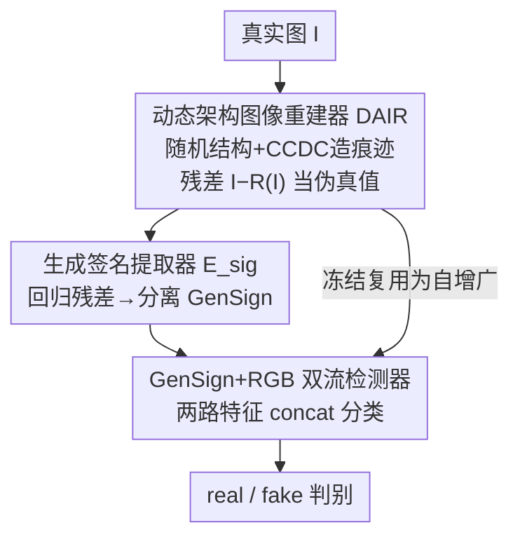

# Enabling Supervised Learning of Generative Signatures for Generalized AI-Generated Images Detection

**会议**: CVPR 2026  
**论文**: [CVF Open Access](https://openaccess.thecvf.com/content/CVPR2026/html/Fei_Enabling_Supervised_Learning_of_Generative_Signatures_for_Generalized_AI-Generated_Images_CVPR_2026_paper.html)  
**代码**: https://github.com/jumpycat/GenSign  
**领域**: AI安全 / AIGC检测 / 视觉取证  
**关键词**: AIGC检测, 生成痕迹, 代理监督, 动态架构重建, 跨模型泛化

## 一句话总结
针对"AI生成图像里的生成痕迹没有干净配对、无法监督式提取"这个死结，本文用一个**随机变结构的图像重建器**在真实图上人工"造痕迹"、把重建残差当伪标签去训练一个**生成签名（GenSign）提取器**，再用 GenSign + RGB 双流分类器做检测，在四个 benchmark 上把跨模型泛化刷到 SOTA。

## 研究背景与动机
**领域现状**：检测 AI 生成图像（AIGI）的主流思路是抓"生成痕迹"——生成模型（GAN、扩散）在输出里会留下与内容无关、模型特有的指纹（如上采样导致的频域异常、噪声残差里的谱异常）。已有工作证明这种痕迹是 instance-specific 的、跨图像稳定存在，是可靠的取证线索。

**现有痛点**：能不能可靠地**提取**这种痕迹才是关键，而现有提取器都做不好。它们要么用手工高通滤波（SRM），要么用 CNN 去噪器，本质上是在做**通用去噪**，而不是专门"分离出模型特有的伪影"。结果是提取出的残差混进了大量普通图像噪声，无法稳定锁定生成信号，换一个没见过的生成器就崩。

**核心矛盾**：想监督式地训练一个痕迹提取器，需要"带痕迹图像"和"无痕迹的干净配对"两者相减得到真值。但 AIGI 天生就是带痕迹的，**根本不存在它对应的 trace-free 版本**——监督学习缺了 ground-truth，只能退而求其次用无监督去噪，效果自然差。

**本文目标**：怎么在**没有真值**的情况下，把"提取通用生成签名"这件事变成一个**有监督**的回归任务，且学到的提取器要能迁移到训练时没见过的真实生成器。

**切入角度**：作者的关键观察是——既然真实 AIGI 拿不到 trace-free 配对，那就反过来，**在真实图上人工合成各式各样的生成痕迹**。如果合成器的架构/参数多样性足够大，它造出的痕迹分布就能覆盖真实生成器留下的痕迹（论文用 PCA 谱特征可视化验证：模拟 100→100K 个模型时，模拟分布逐步把 BigGAN/Glide/MidJourney/FLUX/SD3 等真实模型包进去）。

**核心 idea**：用"随机变结构重建器在真图上造痕迹 → 重建残差当伪真值"这套**代理监督（surrogate supervision）**，把无法监督的痕迹提取问题转成可监督的残差预测问题。

## 方法详解

### 整体框架
方法是一条**三阶段串行**的流水线，核心逻辑是"先造监督信号，再学提取器，最后搭检测器"。Stage I 训练一个动态架构图像重建器 $\mathcal{R}$（DAIR），它用随机化的解码结构重建真实图 $I$，残差 $R_{gt}=I-\mathcal{R}(I)$ 模拟出"某个生成模型留下的痕迹"，作为伪真值。Stage II 冻结 $\mathcal{R}$，训练生成签名提取器 $\mathcal{E}_{sig}$ 去回归这个残差，让它学会从一张图里**分离出生成签名 GenSign**。Stage III 冻结 $\mathcal{E}_{sig}$，搭一个 RGB 流 + GenSign 流的双流检测器 $\mathcal{M}$ 做真/假分类；同时把冻结的 $\mathcal{R}$ 复用为**自增广**模块，逼检测器靠生成痕迹而非内容偏置来判别。

### 关键设计

**1. 动态架构图像重建器 DAIR：用结构随机化在真图上"造"多样生成痕迹**

这是整套代理监督的发动机，直接解决"没有 trace-free 配对、监督无从下手"的痛点。DAIR $\mathcal{R}$ 是一个编码器 $\mathcal{E}_{rec}$ + 动态解码器 $\mathcal{D}$ 的自编码结构，但它的**解码路径每次前向都随机变**：编码器是 $L$ 级下采样的分层 CNN，输出多尺度特征 $\{F_i\}_{i=1}^{L}$；解码时随机挑一个起始尺度 $F_s$（$s\sim\text{Uniform}(1,\dots,L)$），再经过若干随机化的上采样阶段。每个阶段里，上采样算子从 $\mathcal{O}_{up}=\{\text{Bilinear, Nearest, Bicubic, Pixel Shuffle}\}$ 里随机抽，解码 Cell 内部的归一化层从 $\{\text{BatchNorm, InstanceNorm, GroupNorm}\}$ 抽、激活从 $\{\text{GELU, SiLU, LeakyReLU}\}$ 抽，并且这些算子的执行顺序也随机打乱。这种"上采样方式 + 归一化 + 激活 + 顺序"的组合爆炸，正好模仿了不同生成模型架构差异带来的痕迹差异——不同上采样方式恰恰是 GAN/扩散频域伪影的主要来源。重建器用 MSE + LPIPS 联合损失端到端训练（见损失函数节），训练好后 $R_{gt}=I-\mathcal{R}(I)$ 就是一张真图被"赋予"了某种生成痕迹后的残差伪真值。

**2. Context-Conditioned Dynamic Convolution（CCDC）：在固定架构下再造参数级痕迹多样性**

光有架构随机还不够——同一架构在不同训练条件（随机种子、数据）下也算"不同 instance"，会留下不同痕迹。CCDC 让**同一套解码结构能对不同输入实例化出不同卷积参数**，从而模拟 instance-level 的痕迹差异。它维护 $K$ 个可训练基础核 $\{W_i\in\mathbb{R}^{C_{out}\times C_{in}\times k\times k}\}_{i=1}^{K}$，对输入特征 $h$ 用一个路由网络 $g(\cdot)$（全局平均池化 + MLP）算出 filter 级组合权重 $A=g(h)\in\mathbb{R}^{K\times C_{out}}$，然后逐 filter 加权融合成动态核：

$$W_{dyn}[c,:,:,:]=\sum_{i=1}^{K}A[i,c]\cdot W_i[c,:,:,:]$$

其中 $A[i,c]$ 是第 $i$ 个基础核第 $c$ 个 filter 的权重。这样输入不同、动态核就不同，等于给同一架构注入了连续的参数级扰动，使 $\mathcal{E}_{sig}$ 学到 instance-level 而非仅 architecture-level 的 GenSign。论文设 $K=4$。

**3. 生成签名提取器 $\mathcal{E}_{sig}$：把代理残差变成可迁移的提取能力**

有了 DAIR 这个无穷无尽的伪真值源，提取就变成了一个干净的监督回归。$\mathcal{E}_{sig}$ 是一个全卷积网络（FCN），输入图像、输出预测签名 $R_{pred}=\mathcal{E}_{sig}(\mathcal{R}(I))$，训练目标是逼近冻结重建器的残差 $R_{gt}$：

$$\mathcal{L}_{sig}=\mathbb{E}_{I\in\mathcal{I}_{real}}\big[\|\mathcal{E}_{sig}(\mathcal{R}(I))-(I-\mathcal{R}(I))\|_2^2\big]$$

由于训练时见过的"模拟生成器"足够多样（DAIR 的组合空间极大），$\mathcal{E}_{sig}$ 学到的是"如何从图像内容里剥离出生成痕迹"这一**通用能力**，而非记住某个特定模型。训练完冻结后，喂一张没见过的合成图 $I_{fake}$，它就能输出揭示其生成痕迹的 $\mathcal{E}_{sig}(I_{fake})$——可视化显示真图的 GenSign 像无结构随机噪声，AIGI 的 GenSign 则呈现大块、连贯、有空间结构的图案，二者一眼可分。

**4. 双流检测器 + DAIR 自增广：靠痕迹判别、不靠内容偏置**

最终检测器 $\mathcal{M}$ 含两个 backbone：RGB 流 $\mathcal{B}_{rgb}$（CLIP ViT-L/14，只用 LoRA rank=4 微调注意力层）处理原图得 $f_{rgb}$，GenSign 流 $\mathcal{B}_{sig}$（EfficientNet-B0）处理 $\mathcal{E}_{sig}(I)$ 得 $f_{sig}$，两路特征 concat 后过 MLP 分类器 $\mathcal{H}$ 输出 logit。光这样仍可能过拟合到内容偏置（训练集里某类物体=假），所以作者把**冻结的 DAIR 复用为自增广**：训练检测器时以概率 $p_{aug}$ 抽一部分图 $I_{aug}$ 用 $\mathcal{R}$ 重建，并强制重写标签——

$$
\begin{aligned}
\text{原始真图 } I_{real} &\to \text{label}=1\ (\text{真})\\
\text{原始假图 } I_{fake} &\to \text{label}=0\ (\text{假})\\
\text{重建真图 } \mathcal{R}(I_{real}) &\to \text{label}=0\ (\text{假})\\
\text{重建假图 } \mathcal{R}(I_{fake}) &\to \text{label}=0\ (\text{假})
\end{aligned}
$$

关键在第三行：一张**真图**被 DAIR 重建后，内容没变但被注入了生成痕迹，标签就翻成"假"。这等于告诉模型"判假的唯一依据是痕迹，不是内容"，从根上掐断内容偏置。检测器用 BCE 训练：$\mathcal{L}_{det}=-\mathbb{E}_{I}[y(I)\log\mathcal{M}(I)+(1-y(I))\log(1-\mathcal{M}(I))]$。消融显示 $p_{aug}=20\%$ 时泛化最佳。

### 损失函数 / 训练策略
- **Stage I 重建损失**：$\mathcal{L}_{rec}=\mathbb{E}_{I\in\mathcal{I}_{real}}[\lambda_1\|I-\hat I\|_2^2+\lambda_2\cdot\text{LPIPS}(I,\hat I)]$，其中 $\hat I=\mathcal{R}(I)$，$\lambda_1=1.0,\lambda_2=0.25$。MSE 保像素保真、LPIPS 保感知质量，确保残差里是"生成痕迹"而非重建失败的乱码。
- **Stage II**：$\mathcal{L}_{sig}$（MSE 回归残差），DAIR 冻结。
- **Stage III**：$\mathcal{L}_{det}$（BCE），$\mathcal{E}_{sig}$ 冻结，CLIP 仅 LoRA 微调。
- **超参与开销**：batch 8，Adam，lr $3\times10^{-4}$，图缩到 $256\times256$（CLIP 中心裁 $224$）。DAIR/$\mathcal{E}_{sig}$ 在单张 A100 上分别训 ~49h/~41h，但它们是可冻结复用的通用基座；检测器只需 ~7h，推理 ~49ms/图。

## 实验关键数据

### 主实验
训练集为 ProGAN 20 类（Table 4 用 SDv1.4），在四个跨模型 benchmark 上评测对未见生成器的泛化（AP / Acc）。

| Benchmark | 指标 | 本文 | 次优方法 | 提升 |
|-----------|------|------|----------|------|
| UniversalFakeDetect | mean AP | **99.37%** | FatFormer 98.16% | +1.21% |
| AIGCDetectBenchmark（17 模型） | mean AP | **98.04%** | PatchCraft 96.07% | +1.97% |
| AIGIBenchmark（17 模型） | mean AP | **89.96%** | AIDE 75.36% | +14.6% |
| GenImage（训练 SDv1.4） | mean Acc | **96.6%** | Effort 91.1% | +5.5% |

亮点在 AIGIBenchmark：现有检测器在**局部伪造**（换脸类 BlendFace/InSwap/FaceSwap/SimSwap）上几乎掉到随机水平，本文却能保持 66.37%/87.10%/88.57%/88.40% AP，说明 GenSign 抓的是通用生成痕迹而非某族模型的特定伪影。

### 消融实验

| 配置 | UniFD | AIGC | AIGI | Mean mAP | 说明 |
|------|-------|------|------|----------|------|
| Ours (RGB+GenSign 双流) | 99.37 | 98.04 | 89.96 | **95.79** | 完整模型 |
| 仅 GenSign（EfficientNet-B0） | 90.37 | 86.96 | 73.44 | 83.59 | 去掉 RGB 流 |
| 仅 RGB（CLIP） | 98.28 | 95.98 | 70.91 | 88.39 | 去掉 GenSign 流 |
| GenSign 换 SRM Conv | 99.01 | 97.24 | 89.57 | 95.27 | 换手工滤波指纹 |
| GenSign 换 Noiseprint++ | 97.03 | 93.47 | 68.03 | 86.18 | 换无监督指纹 |
| GenSign 换预训练去噪器 | 98.61 | 98.29 | 85.62 | 94.17 | 换通用去噪残差 |

另有两组关键曲线消融：自增广率 $p_{aug}$ 从 0%（mean 88.80%）→ 20%（峰值 95.79%）→ 50%（94.86%）；模拟多样性（重建器下采样层数）1 级 76.6% → 2 级 87.2% → 3 级 95.8%。

### 关键发现
- **双流互补最关键**：RGB（CLIP）擅长高层语义、GenSign 擅长底层痕迹，单独用任一路都明显掉点（尤其 AIGI 上仅 RGB 只有 70.91），合起来才到 95.79。
- **代理监督优于无监督/手工指纹**：同样双流框架下，把 GenSign 换成 SRM/Noiseprint++/去噪器残差都更差，证明"在模拟生成痕迹上做监督学习"确实学到了更可迁移的取证特征。
- **自增广不能没有、也不能太多**：0% 时模型过拟合训练分布伪影（88.80%），20% 达到"保留原分布 vs 暴露多样痕迹"的最佳平衡，再高反而稀释真实分布。
- **多样性单调正相关**：重建器架构多样性越大（下采样层数越多），合成痕迹分布越广、检测泛化越好，直接支撑了"模拟覆盖真实"的核心假设。

## 亮点与洞察
- **把"无监督困境"反转成"造数据 + 监督回归"**：最让人"啊哈"的是——既然真图的 trace-free 配对不存在，那就不去找真 AIGI 的配对，而是在真图上人工造痕迹，残差天然就是干净的监督信号。这套"造伪真值→监督学习"的思路可迁移到任何"想监督某种残差/痕迹但拿不到配对"的取证/异常检测任务。
- **架构随机化当数据增广**：DAIR 用上采样/归一化/激活/顺序的组合爆炸去逼近"所有可能的生成器"，比固定一个生成模型造数据更能覆盖未见分布；PCA 谱可视化（模拟 100→100K 逐步包住真实模型）是个很有说服力的"为什么能泛化"的证据。
- **一器三用**：同一个 DAIR 既是 Stage I 的痕迹源、又是 Stage II 的真值生成器、还是 Stage III 的自增广器，且全程冻结复用，工程上很经济。
- **标签翻转破内容偏置**：把"重建真图→标记为假"这条规则做进训练，是一个干净利落地强制模型"只看痕迹不看内容"的手段。

## 局限与展望
- **训练开销大**：DAIR + $\mathcal{E}_{sig}$ 在 A100 上要 ~90h，虽然作者强调它们是可复用基座，但对没有大算力的复现者门槛不低。
- **鲁棒性只是"略好"**：作者自己也承认在 JPEG 压缩、空间扭曲下会有中等程度掉点，仅比 SDD/UniFD "slightly higher"，对抗强后处理仍是开放问题 ⚠️（以原文 Fig.5 为准）。
- **Midjourney 仍偏弱**：AIGCDetectBenchmark 上最低分 81.17% 出现在 Midjourney，说明商用闭源 T2I 的痕迹和开源模型差异较大，模拟分布未必完全覆盖。
- **"模拟能覆盖真实"是经验假设**：覆盖性靠 PCA 谱特征可视化论证，缺乏理论保证；遇到与现有架构差异极大的新生成范式（如全新采样器）时是否仍覆盖，存疑。

## 相关工作与启发
- **vs DIRE / 重建类训练-free 方法**：DIRE 用 DDIM 反演误差判别，假设"AIGI 比真图更易被源模型重建"，但需要访问特定生成模型、且本质无监督。本文不依赖任何特定生成器，靠自训练的 DAIR 造监督，泛化性和实用性都更强。
- **vs UnivFD（冻结 CLIP 特征）**：UnivFD 直接用冻结 CLIP 做 k-NN/线性探针，靠基础模型的通用性，但纯 RGB 易受内容偏置影响、在局部伪造上崩。本文把 CLIP 作为 RGB 流之一，再叠加专门的 GenSign 痕迹流，互补后在换脸类伪造上大幅领先。
- **vs 手工滤波 / 去噪器指纹（SRM、Noiseprint++、CNN 去噪）**：这些提取器为"通用去噪"优化，残差混入大量非生成噪声。本文证明同框架下把它们换成监督学习的 GenSign 能再提点，核心区别是"有没有针对性地监督模型特有伪影"。

## 评分
- 新颖性: ⭐⭐⭐⭐⭐ 用代理监督把"不可能监督"的痕迹提取问题反转成可监督回归，思路非常巧。
- 实验充分度: ⭐⭐⭐⭐⭐ 四个 benchmark + 多组消融（模态/指纹/增广率/多样性）+ 谱可视化，证据链完整。
- 写作质量: ⭐⭐⭐⭐ 三阶段逻辑清晰、图文配合好，少数符号（如 $\mathcal{E}_{sig}$ 输入是 $I$ 还是 $\mathcal{R}(I)$）在不同段落表述略有出入。
- 价值: ⭐⭐⭐⭐⭐ AIGC 检测泛化是刚需，方法可复用为通用取证基座，实用价值高。

<!-- RELATED:START -->

## 相关论文

- [\[CVPR 2026\] Detecting Compressed AI-Generated Images via Phase Spectrum Robustness](detecting_compressed_ai-generated_images_via_phase_spectrum_robustness.md)
- [\[CVPR 2026\] Skyra: AI-Generated Video Detection via Grounded Artifact Reasoning](skyra_ai-generated_video_detection_via_grounded_artifact_reasoning.md)
- [\[CVPR 2026\] Zero-shot Detection of AI-Generated Image via RAW-RGB Alignment](zero-shot_detection_of_ai-generated_image_via_raw-rgb_alignment.md)
- [\[CVPR 2026\] Scaling Up AI-Generated Image Detection with Generator-Aware Prototypes](scaling_up_ai-generated_image_detection_with_generator-aware_prototypes.md)
- [\[CVPR 2026\] Cross-modal Representation Learning for Diffusion-generated Image Detection](cross-modal_representation_learning_for_diffusion-generated_image_detection.md)

<!-- RELATED:END -->
