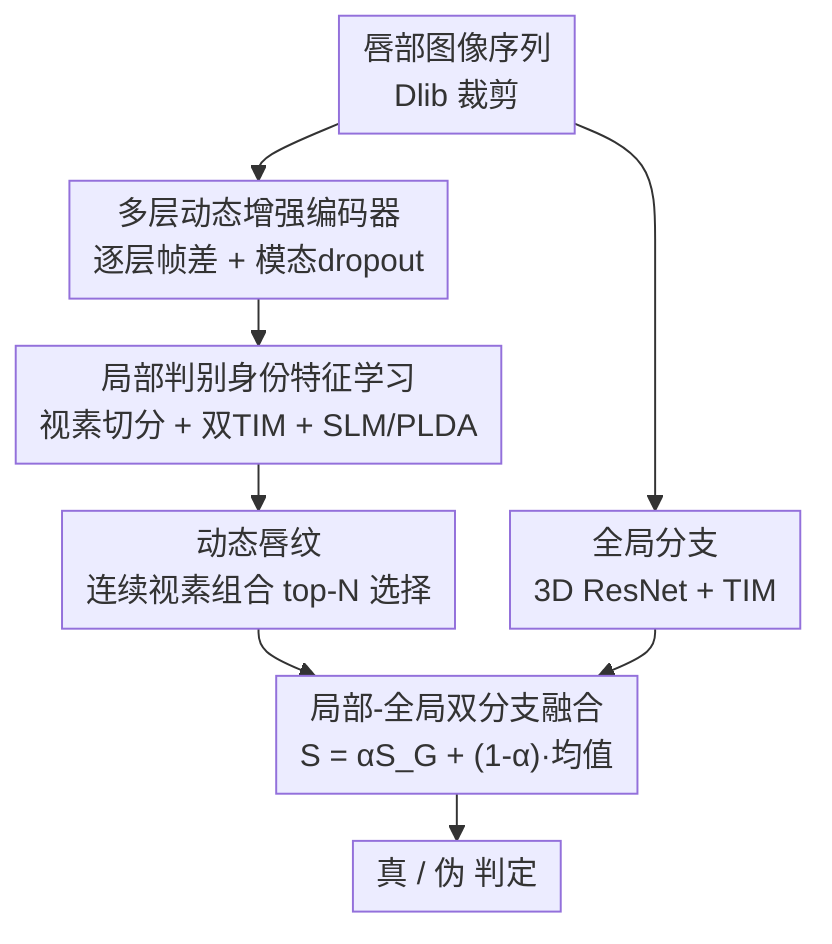

# Enhancing the Security of Visual Speaker Authentication Based on Dynamic Lip-Print Analysis

**会议**: CVPR 2026  
**论文**: [CVF Open Access](https://openaccess.thecvf.com/content/CVPR2026/html/He_Enhancing_the_Security_of_Visual_Speaker_Authentication_Based_on_Dynamic_CVPR_2026_paper.html)  
**代码**: 待确认  
**领域**: AI安全 / 生物特征认证  
**关键词**: 视觉说话人认证, 动态唇纹, 视素分析, DeepFake防御, 可扩展提示集  

## 一句话总结
本文提出以「视素组合」作为视觉说话人认证（VSA）的分析单元，把每个人独有的连续视素说话习惯抽成「动态唇纹」，配合一个逐层帧差的多层动态增强编码器，使系统能在不重训、不补录用户视频的前提下扩展认证提示集，并显著增强对重放攻击与多种 DeepFake 的抵抗力（VSA/GRID/TCD-TIMIT 上 AUC 普遍逼近 1.0、HTER 低至 0.1–0.2%）。

## 研究背景与动机
**领域现状**：人脸认证正逐步替代密码、IC 卡等传统手段，但静态人脸极易被 DeepFake 伪造。视觉说话人认证（Visual Speaker Authentication, VSA）改用「说话时的唇部运动」做身份核验——它采集成本低、不需要整张脸、隐私更友好，而且唇动包含强烈的个体说话习惯，天然适合做活体检测和 DeepFake 鉴别。

**现有痛点**：现有 VSA 大体分两类，各有硬伤。**词级（word-level）方法**把视频切成孤立单词来提特征，依赖一个固定的小提示集；攻击者只要收集到目标用户念这些单词的视频，就能重新拼接成合法提示发起重放攻击。想扩大提示集来缓解，就得为每个新词重训模型并补录用户语音，可用性极差。而且词级方法只看单词内部、忽略了**词与词之间的过渡**——而过渡恰恰编码了个体独有的连读习惯。**句级（sentence-level）方法**依赖整句的全局动态特征，对这种细粒度的口型差异不敏感，抓不住个人化的说话习惯。

**核心矛盾**：提示集的「可扩展性」与「安全性 / 个体判别力」之间存在冲突——要抗重放就得让提示足够多变，但多变就意味着要么重训补录（词级），要么丢掉细粒度身份线索（句级）。同时论文观察到，并非每段语音的判别力都一样：同样念「seven」时各说话人口型几乎一致，而念「five」时差异明显，说明需要更细粒度的分析去挑出「最能区分人」的片段。

**切入角度**：作者引入语音学里的**视素（viseme）**——音素（phoneme）的视觉对应物，对给定语言其类别数固定。一个单词由若干视素及其组合构成，因此用视素这种更细的单位来描述说话习惯，就能在不大量补录用户视频的情况下拼出含新词的提示。但单个视素在时序上太短（通常仅 3–5 帧），单独用抓不到稳定的身份动态，于是作者取**连续两个视素的组合**作为基本单元。

**核心 idea**：把「连续视素组合」当作认证单元，从中挑出每个用户判别力最强的若干组合作为其专属「动态唇纹」；提示集只要在文本中嵌入这些唇纹即可任意扩展，无需重训或补录——以此同时解决提示集可扩展性与抗重放安全性。

## 方法详解
### 整体框架
系统输入是一段唇部图像序列（用 Dlib 检测人脸关键点并裁出唇部区域），目标是判断「当前说话人是否就是其声称的身份（且非伪造/重放）」。整套方法是**局部 + 全局双分支**结构：局部分支负责挖掘细粒度的视素级说话习惯，全局分支提供整句层面的上下文身份特征，两者各出一个分数后融合。

局部分支的数据流是：唇序列先过**多层动态增强编码器（MD-Encoder）**得到融合了动静态信息的帧级特征；再由**视素切分模块**借助视觉强制对齐器（VFA）把特征序列按提示文本切成视素片段，相邻两个视素拼成一个连续视素片段；每个片段过两个**时序整合模块（TIM）**——一个学身份、一个预测连续视素 ID；身份特征再按视素 ID 分组、各自喂给**子空间学习模块（SLM）**里独立的 PLDA 模型算局部相似度。注册阶段会对所有连续视素组合按判别力排序，挑出 top-$N_{lp}$ 作为该用户的**动态唇纹**；认证时只对落在唇纹集合内的片段算分并平均。全局分支用一个改造的 3D ResNet + TIM 抽整句身份向量，用余弦相似度算全局分。最后两分支加权融合输出真/伪判定。

### 关键设计

**1. 多层动态增强编码器（MD-Encoder）：在短时序里抠出抗伪造的细微唇动**

视素片段只有 3–5 帧，又要在这么短的窗口里抓住「能区分人、又难被伪造复制」的动态，普通骨干网络很难做到，还容易被唇部纹理、光照这些与身份无关的静态因素干扰。MD-Encoder 把 ResNet18 切成 5 层（按相同输入维度分组），在**每一层**都对相邻帧做帧差 $f_t - f_{t-1}$，从而压制静态信息、突出运动模式；帧差再过一个由残差卷积块组成的 **Diff Encoder**（输入层和第 1 层用 2 个残差块，其余层用 1 个，输出维度都为 64）抽取层级化运动动态，经全局平均池化（GAP）后在通道维拼接成「由粗到细」的多尺度动态表示。

与此同时，唇形、纹理这些**静态**属性对区分真人仍有用，作者直接取 ResNet 骨干最后一层作为静态特征。但为了不让模型过拟合到静态外观（否则 DeepFake 一换脸就骗过），训练时用**模态 dropout（stochastic feature selection）**——以 50% 概率随机丢弃静态特征，逼模型把判别力压到更难伪造的动态轨迹上。最后静态、动态特征融合送入下游。值得一提的是，整套模型**只在真人视频上训练**、从不见伪造样本，以此保证对未见过的 DeepFake 方法也能泛化。消融显示去掉帧差（temporal diff）会明显削弱对 DeepFake 的检测、去掉模态 dropout 会因过拟合静态特征而对伪造视频更脆弱。

**2. 局部判别身份特征学习：视素切分 + 双 TIM + 子空间学习**

有了帧级特征后，要把它对齐到「具体念了哪些视素」并提纯出身份线索。**视素切分模块**用一个视觉强制对齐器（VFA）把视频帧按视素级别对齐到文本，从而精确定位每个视素片段（VFA 只在认证数据集上训练、不引外部数据以保证公平比较）；相邻两个视素被分到一个连续视素片段。每个片段过两个独立的**时序整合模块（TIM）**：TIM 内部先用时序卷积网络（TCN）捕捉时序依赖，再用注意力统计池化（ASP）整合时序信息，最后接线性层 + 1D BN。

两个 TIM 分工明确：一个专做**身份预测**，用 AAMSoftmax 优化身份特征以增大类间间隔、压紧类内分布，
$$\mathcal{L}_{id} = -\frac{1}{N}\sum_{i=1}^{N}\log\frac{e^{s\cdot\cos(\theta_{y_i}+m)}}{e^{s\cdot\cos(\theta_{y_i}+m)}+\sum_{j\neq y_i}e^{s\cdot\cos\theta_j}}$$
其中 $m>0$ 是附加角间隔、$s$ 是缩放因子（实现取 $s=30,\ m=0.2$）。另一个 TIM 预测**连续视素 ID**（定义为 $v_1\cdot K + v_2$，$v_1,v_2$ 为两个视素 id，$K$ 为视素类别数），用交叉熵 $\mathcal{L}_c=-\sum_{i=1}^{N_{cv}}q_i\log p_i$ 让特征与内容对齐。局部分支训练目标为 $\mathcal{L}_{local}=\mathcal{L}_{id}+\mathcal{L}_c$。

随后 **SLM（子空间学习模块）**把第一个 TIM 输出的身份特征**按连续视素 ID 分组**，对每组单独训练一个 PLDA 模型——PLDA 通过最小化类内方差、最大化类间分离把特征投到低维子空间，凸显最具判别力的身份成分、抑制噪声。「每个连续视素一套 PLDA」的好处是在数据有限时也能做到内容特定（content-specific）的身份判别；测试时这些 PLDA 在所有用户间共享。消融里去掉 SLM 会明显拉低身份特征的判别力。

**3. 动态唇纹：把连续视素组合做成可扩展的认证单元**

这是全文的「钥匙」。在用户注册阶段，系统对该用户所有出现过的连续视素组合**按判别力排序**，选出 top-$N_{lp}$（实验取 $N_{lp}=5$）作为其专属「动态唇纹」。由于视素是语言里类别数固定的细粒度单位（论文用 Jeffers 视素表，12 类、含静音视素 /S，理论上有 144 种连续视素组合，GRID 训练集出现 90 种、VSA 出现 47 种），只要把这些唇纹嵌进任意文本就能造出新提示——用户用 4 位数字「0045」注册，之后却能用「he will allow a rare lie」这种**训练集里根本没出现过的句子**来认证，只要它含有该用户的动态唇纹。

这一步直接破解了「可扩展 vs 安全」的矛盾：提示集可无限扩展而**不需重训、不需补录**；提示越多变，攻击者越难凑齐匹配内容的视频，重放攻击自然失效。认证时局部分支只对「连续视素组合落在选定唇纹集合 $P$ 内」的片段算分，再做平均。

**4. 局部-全局双分支融合认证**

只靠局部唇纹有过度依赖局部细节、且难抵抗「片段重组」类攻击的风险，所以作者并联一条全局分支：用改造的 3D ResNet（先 3D 卷积、再逐帧 2D ResNet）+ TIM 抽整句身份向量，同样用 AAMSoftmax 训练，认证时用余弦相似度给出全局分 $S_G$。最终分数把两分支加权融合：
$$S = \alpha S_G + (1-\alpha)\frac{1}{|I|}\sum_{i\in I}S_i$$
其中 $S_i$ 是局部第 $i$ 个视素片段的 PLDA 分数，$I=\{i\mid v_i\in P\}$ 是句中连续视素组合属于唇纹集合的片段索引，$|I|$ 是唇纹实际出现次数，$\alpha\in[0,1]$ 平衡两分支（实验取 $\alpha=0.5$）。全局分支的价值在「片段重组攻击」里尤为明显：当攻击者把多段真实视频拼接时，全局内容的时序不一致会被放大，全局分支 AUC（0.9832）显著高于局部分支（0.9626），二者互补提升整体鲁棒性。

### 损失函数 / 训练策略
- 局部分支：$\mathcal{L}_{local}=\mathcal{L}_{id}+\mathcal{L}_c$（身份 AAMSoftmax + 连续视素 ID 交叉熵）。
- 全局分支：与局部同款 AAMSoftmax 身份损失 $\mathcal{L}_{global}$。
- 关键超参/设置：唇部裁剪 100×50；TIM 用 2 层 TCN、卷积核 5；MD-Encoder 基于 ResNet18 切 5 层、Diff Encoder 输出维 64；PLDA 主成分 32；AAMSoftmax $s=30,m=0.2$；$\alpha=0.5$，$N_{lp}=5$；学习率 warmup 6 epoch 后按步数平方根倒数衰减；训练时唇序列以 50% 概率水平翻转。全模型（局部+全局+VFA）约 89M 参数、单视频推理约 100 GFLOPs，单张 2080 Ti 即可训。**只用真人视频训练**，不接触任何伪造样本以保证对未见 DeepFake 的泛化。

## 实验关键数据
数据集：**VSA**（58 人、每人 200 句四位数字、手机自然环境录制）、**GRID**（33 人、固定模板 6 词句）、**TCD-TIMIT**（63 人、语音平衡句、内容不受限，用于验证提示集扩展）。攻击类型涵盖真人冒充（Human）与四种 DeepFake：FaceSwap、DeepFaceLab、SimSwap、LipSync。指标用 AUC 与 HTER（= (FAR+FRR)/2，越低越好）。注册用 5 段视频；两种评测场景——unified-prompts（所有用户同提示，测判别力）与 user-specific-prompts（每人用自己 5 条动态唇纹造的提示，测可扩展性）。

### 主实验
unified-prompts 场景（Table 1，列出代表性数字，HTER 为 %）：

| 数据集 | 方法 | Human AUC/HTER | FaceSwap AUC/HTER | SimSwap AUC/HTER | LipSync AUC/HTER |
|--------|------|------|------|------|------|
| VSA | AVLip | 0.9991 / 2.7 | 0.9817 / 5.3 | 0.9983 / 3.3 | 0.8898 / 9.5 |
| VSA | Siamese | 0.9967 / 2.0 | 1.0000 / 2.0 | 1.0000 / 1.9 | 0.9767 / 7.2 |
| VSA | **Lip-print（本文）** | **0.9992 / 1.9** | **0.9951 / 2.7** | **0.9971 / 2.1** | **0.9954 / 2.4** |
| GRID | AVLip | 0.9970 / 3.4 | 0.8169 / 32.6 | 0.9169 / 9.5 | 0.5558 / 49.5 |
| GRID | Siamese | 0.9981 / 2.5 | 0.9910 / 9.3 | 0.9885 / 5.7 | 0.7585 / 25.1 |
| GRID | **Lip-print（本文）** | **0.9999 / 0.2** | **0.9999 / 0.5** | **0.9961 / 1.1** | **0.9961 / 5.1** |

最能说明问题的是 **LipSync**（直接合成对口型的唇动，最贴近唇动伪造）：GRID 上 AVLip 的 AUC 崩到 0.5558、HTER 49.5%，Siamese 也只 0.7585/25.1%，而本文 0.9961/5.1%——说明只有显式建模细粒度动态唇纹才扛得住针对性的口型伪造。user-specific-prompts 场景（Table 2）本文进一步走强，VSA 上对 Human 与 SimSwap 都达 AUC 1.0，而其它方法在换提示后只有微小波动甚至下降，反映它们缺少视素建模、难适配新提示。

### 消融实验
VSA、unified-prompts 设置（Table 3，AUC，下标 hm=Human, fs=FaceSwap, dfl=DeepFaceLab, ss=SimSwap, ls=LipSync）：

| 配置 | hm | fs | dfl | ss | ls | 说明 |
|------|------|------|------|------|------|------|
| w/o temporal diff | 0.9966 | 0.9805 | 0.9920 | 0.9802 | 0.9882 | 只用末层静态特征，DeepFake 检测力下降 |
| w/o modality dropout | 0.9983 | 0.9826 | 0.9807 | 0.9817 | 0.9895 | 过拟合静态特征，对伪造更脆弱 |
| w/o SLM | 0.9884 | 0.9937 | 0.9832 | 0.9845 | 0.9871 | 去掉 PLDA 子空间，身份判别力受损 |
| **Proposed（完整）** | **0.9992** | **0.9951** | **0.9983** | **0.9971** | **0.9954** | 全组件最优 |

三项组件去掉后在多数攻击列上都掉点，其中 temporal diff 对 SimSwap（0.9802 vs 0.9971）、SLM 对 Human（0.9884 vs 0.9992）影响最直观，印证「动态帧差抗伪造、PLDA 子空间提身份判别」的分工。

### 关键发现
- **动态唇纹的判别力高度个性化**：Table 4 显示对 User56 视素组合 #110 的 AUC 达 1.0、对 User63 #119 达 0.9989，但最优组合因人而异，说明「按用户挑 top-5 唇纹」确有必要，平均所有视素（all avg ≈ 0.955–0.96）远不如挑出来的几条。
- **可扩展提示集真能跨内容泛化**：TCD-TIMIT（内容不受限、测试词大多没在训练集出现，Table 5）上本文 HTER 全面领先——Human 0.8、LipSync 1.9，优于次好的 TDVSA-Net（1.2 / 4.0），证明视素单元让提示集扩展不靠记忆特定词。
- **全局分支是抗「片段重组攻击」的关键**：Table 6 里局部分支 AUC 0.9626、全局 0.9832、融合 0.9835；拼接视频破坏了整句时序一致性、也让 VFA 切不准视素，全局分支因此更易识破重组攻击。

## 亮点与洞察
- **把语音学的「视素」迁进认证单元**是最巧的一步：它一举把「提示集可扩展」与「细粒度个体习惯」两件看似冲突的事统一了——用更小的可复用单元拼任意提示，又比句级抓得细、比词级抓得到词间过渡。
- **模态 dropout 是对抗 DeepFake 的反直觉 trick**：故意以 50% 概率丢掉好用的静态外观特征，逼模型学难伪造的动态轨迹；加上「只用真人视频训练」，把对未见伪造方法的泛化做成了训练策略而非堆数据。
- **每个连续视素一套 PLDA** 的「内容特定身份子空间」思路可迁移到任何「内容会显著影响特征分布」的细粒度生物识别任务（如手势、签名笔迹）——按内容分桶建判别子空间，比全局一套子空间更省数据也更准。
- 局部抓判别力、全局抓时序一致性的**双分支互补**，正好对应「DeepFake 伪造」与「片段重组重放」两类不同攻击面，设计动机非常具体。

## 局限与展望
- **依赖 VFA 的视素切分质量**：整条局部分支建立在视觉强制对齐器能把帧准确对齐到视素之上；论文也承认重组攻击下 VFA 会切错（这反过来成了检测信号，但正常场景里切分误差对判别力的影响未充分量化）。⚠️ 跨语言/口音下视素表与对齐器的可迁移性论文未讨论。
- **视素表与语言绑定**：用的是固定的 Jeffers 12 类英语视素映射，换语言需重定义视素与重训 VFA，普适性受限。
- **唇纹判别力个体差异大**：Table 4 显示有的用户存在高判别力视素组合、有的没有；对「天生唇动不明显」的用户，top-5 唇纹可能仍不够区分，论文未给出此类长尾用户的兜底方案。
- **未与音频联合**：作者刻意只用 AVLip 的视觉分量做对比，纯视觉虽利于隐私，但放弃了音视频一致性这一强约束；在能用音频的场景下融合可能进一步提升，是自然的扩展方向。

## 相关工作与启发
- **vs TDVSA-Net**：两者都想解耦「内容」与「身份」。TDVSA-Net 在句级把静态身份、动态身份、内容三者解耦，对未见内容有一定处理力；本文把粒度下沉到**连续视素**，既能抓词间过渡又能按用户挑判别力最强的唇纹，因此在可扩展提示集（TCD-TIMIT）上明显胜出（HTER 0.8 vs 1.2 等）。
- **vs Siamese（hard-negative mining）**：Siamese 用孪生网络 + 难负样本挖掘做词/句级匹配，单注册视频即可认证，但缺少显式动态建模，面对 LipSync 这类口型伪造大幅掉点（GRID 0.7585）；本文靠逐层帧差 + 模态 dropout 专门强化难伪造的动态特征，LipSync 上稳在 0.9961。
- **vs AVLip**：AVLip 是音视频多模态方法，本文只取其视觉分量对比；纯视觉条件下 AVLip 抗合成攻击能力弱（GRID/LipSync AUC 0.5558），凸显「显式视素级动态建模」对纯视觉 VSA 的必要性。

## 评分
- 新颖性: ⭐⭐⭐⭐⭐ 首次把「视素 / 连续视素组合」作为 VSA 的分析与认证单元，用动态唇纹同时解决提示集可扩展与抗重放，切口很新。
- 实验充分度: ⭐⭐⭐⭐ 三数据集、四种 DeepFake、两种评测场景 + 重组攻击专项，覆盖到位；但缺跨语言/口音与长尾用户分析。
- 写作质量: ⭐⭐⭐⭐ 动机（图 2 的口型差异举例）与方法分支讲得清楚，公式与符号定义完整。
- 价值: ⭐⭐⭐⭐⭐ 直接针对人脸/唇认证在 DeepFake 时代的真实安全痛点，89M / 100 GFLOPs / 单卡可跑，落地友好。

<!-- RELATED:START -->

## 相关论文

- [\[ACL 2026\] On the (In-)Security of the Shuffling Defense in the Transformer Secure Inference](../../ACL2026/ai_safety/on_the_in-security_of_the_shuffling_defense_in_the_transformer_secure_inference.md)
- [\[CVPR 2026\] Enhancing Out-of-Distribution Detection with Extended Logit Normalization](enhancing_out-of-distribution_detection_with_extended_logit_normalization.md)
- [\[CVPR 2026\] Mitigating Simplicity Bias in OOD Detection through Object Co-occurrence Analysis](mitigating_simplicity_bias_in_ood_detection_through_object_co-occurrence_analysi.md)
- [\[CVPR 2026\] RaPA: Enhancing Transferable Targeted Attacks via Random Parameter Pruning](rapa_enhancing_transferable_targeted_attacks_via_random_parameter_pruning.md)
- [\[CVPR 2026\] Phantom: Physical Object Interactions as Dynamic Triggers for NMS-Exploited Backdoors](phantom_physical_object_interactions_as_dynamic_triggers_for_nms-exploited_backd.md)

<!-- RELATED:END -->
