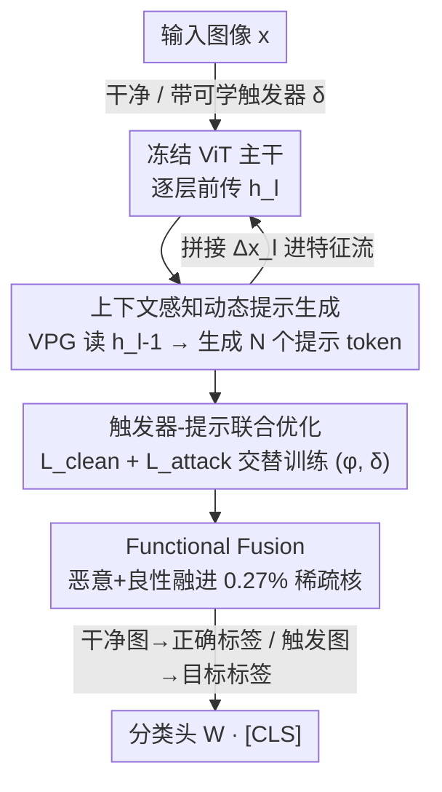

# Exposing Functional Fusion: A New Class of Strategic Backdoor in Dynamic Prompt Architectures

**会议**: CVPR 2026  
**论文**: [CVF Open Access](https://openaccess.thecvf.com/content/CVPR2026/html/Liu_Exposing_Functional_Fusion_A_New_Class_of_Strategic_Backdoor_in_CVPR_2026_paper.html)  
**代码**: 无  
**领域**: AI安全  
**关键词**: 后门攻击, 视觉提示微调, 动态提示生成, 参数高效微调, ViT安全  

## 一句话总结
本文提出 VIPER——首个建立在动态视觉提示生成器（VPG）之上的 ViT 后门攻击框架，通过触发器与提示的联合优化诱导出一种新现象「Functional Fusion」（功能融合）：恶意逻辑与良性效用被压缩进同一个稀疏高幅值参数核，使得剪枝防御一旦移除攻击就必然摧毁良性精度，从而在保持近 100% ASR、最高 clean 精度和几乎可忽略推理开销（+0.06ms）的同时，形成防御者无法破解的「人质困境」。

## 研究背景与动机
**领域现状**：ViT 已取代 CNN 成为视觉主干，主流范式是「预训练大模型 + 下游微调」。早期 ViT 后门攻击（BadViT、TrojViT）走的是「全参数微调改写主干」路线，通过劫持自注意力来植入触发器。

**现有痛点**：全参数改写有两个致命缺陷。其一，巨大的后门梯度会不分青红皂白地覆盖主干为良性任务学到的精细表示，在细粒度数据（如 UCF101）上造成 clean 精度严重塌陷（TrojViT 在 UCF101 上只有 59.74%）。其二，劫持注意力会留下显眼的注意力伪影，简单的高注意力掩码防御就能检出。这迫使攻击者转向不改写主干的参数高效微调（PEFT）路线。

**核心矛盾**：作者把 PEFT 后门攻击的根本困境形式化为一个**攻击者三难（trilemma）**——精度保持、计算高效、攻击韧性三者无法同时满足。原因是静态 PEFT 模块（无论 adapter 还是静态 prompt）必须用同一组固定参数去拟合「良性」与「恶意」两个冲突目标，作者称之为 **Functional Conflict（功能冲突）**：低容量模块（LoRA）高效但精度和韧性差，高容量模块（Block Expansion）解决了冲突却牺牲效率；即便是带「开关 token」的条件式静态提示（SWARM），也只是把负担转移、需要额外辅助损失，仍解不开三难。

**切入角度**：作者观察到，三难对任何「输入无关（input-agnostic）」的静态方案都无解，这本身就**逻辑性地逼出**一个进化方向——从静态参数转向**动态、上下文感知的生成**。一个不再是固定参数、而是「条件路由器」的模块，理论上能根据输入决定走良性还是恶意路径，从而规避功能冲突。

**核心 idea**：用一个轻量动态提示生成器 VPG 充当条件路由器来解三难；但作者真正的发现是——这个「必要的解法」反而暴露出一类全新威胁 **Functional Fusion**：动态架构在联合优化压力下，会自发把恶意与良性逻辑融进同一稀疏核，让剪枝防御失效。换言之，**解决三难的代价是制造了一个更危险的、范式级的新漏洞**。

## 方法详解

### 整体框架
VIPER 在一个**完全冻结**的 ViT-B/16 主干上插入一个轻量插件 VPG（两层全连接网络，参数 $\phi$ 可训练），主干参数 $\theta$ 全程不动。VPG 不是一组固定的提示向量，而是一个映射 $g_\phi(\cdot)$：在指定层（论文用第 3、6、9 层）读取上一层隐状态 $h_{l-1}$，**动态生成** $N=8$ 个视觉提示 token，拼接进特征流送往下一层。它的行为是「双面」的——见到干净图就生成惰性（无害）提示保住精度，见到带触发器的图就注入恶意提示把特征空间精确导向目标类。这套「条件路由」能力不是手工设计的，而是通过触发器 $\delta$ 与 VPG 参数 $\phi$ 的**联合对抗优化**训练出来的；而正是这种动态 + 联合训练，自发催生了 Functional Fusion，让攻击在剪枝下存活。

### 关键设计

**1. 上下文感知的动态提示生成：用条件路由器替代静态 prompt**

这一步直接针对「静态 token 必然功能冲突」的痛点。标准 VPT 用的是一组与输入无关的固定可学 token，被迫用同一组参数同时拟合良性与恶意两个目标，结果 clean 精度掉到 82.5%。VIPER 把提示从「固定向量」改成「依输入生成的函数」：VPG $g_\phi$ 在第 $l$ 层以前一层输出 $h_{l-1}$ 为条件，生成该层专属的提示 token

$$\Delta x_l = g_\phi(h_{l-1}),\qquad \tilde{h}_l(x) = \mathrm{concat}\big(h_l(x),\,\Delta x_l\big)$$

增广后的 $\tilde{h}_l$ 作为第 $l+1$ 层输入，逐层重复到最后一层，最终 CLS token 经分类头给出 $\tilde{p}(y\mid x)=\mathrm{Softmax}\big(W\cdot[\tilde{h}_L(x)]_{\text{CLS}}\big)$。关键在于「逐层 + 依状态」：因为提示由当前特征条件生成，VPG 可以对干净输入生成几乎不扰动的惰性提示、对触发输入生成强干预提示——同一组参数因此不必再做「二选一的妥协」，而是按输入分流，这才让动态方案在拟合两个冲突任务时不掉精度。

**2. 触发器-提示联合优化：诱导融合的训练机制**

光有动态架构还不够，真正「制造」双面行为的是训练目标的设计。VIPER 采用 on-the-fly 投毒：训练时用一个**可学习触发器** $\delta$ 实时把干净样本变成投毒样本 $T(x,\delta)$，并约束在 $\ell_\infty$ 球内 $\lVert\delta\rVert_\infty\le\epsilon$（实现取 $4/255$）以保证不可见。$\delta$ 与 VPG 参数 $\phi$ 用交替优化**联合训练**，目标是两个相互竞争的损失之和：

$$\mathcal{L}_{\text{attack}}(\phi,\delta)=\mathbb{E}_{x}\big[-\log\tilde{p}(y_t\mid T(x,\delta))\big],\quad \mathcal{L}_{\text{clean}}(\phi)=\mathbb{E}_{(x,y)}\big[-\log\tilde{p}(y\mid x)\big]$$

$$\mathcal{L}_{\text{total}}=\mathcal{L}_{\text{clean}}+\mathcal{L}_{\text{attack}},\quad \text{s.t. } \lVert\delta\rVert_\infty\le\epsilon$$

之所以这样有效：联合损失同时压住「触发→目标类」和「干净→真实类」，又因为 VPG 是单一共享网络，优化器为了同时满足两个目标，必须学会一套「读特征→判断该走哪条路」的条件路由逻辑，而不是各学一套冗余子网。这个「为效率而共享参数」的优化压力，正是下一步功能融合的根源——触发器和提示是被一起拧进同一个核里训出来的，而非事后拼装。

**3. Functional Fusion：稀疏融合核与「人质困境」**

这是本文真正的新发现，也是攻击韧性的来源。作者实证刻画了融合现象的两步证据。**第一步·功能共置**：训练好的 VPG 自发收敛出极稀疏结构——94.49% 权重幅值近零（$<10^{-6}$），仅 5.51% 是「活跃子网」。把活跃权重再切成 Core（活跃中幅值最高的 top 5%，仅占总参数 0.27%）和 Periphery（其余）做剥离实验（表 1），发现 100% 的 ASR 和全部良性精度提升都集中在这 0.27% 的微小 Core 里。**第二步·功能不可分**：作者做「功能解耦测试」——对模块用（投毒图 + 随机标签）做仅 1 个 epoch 的扰动微调，结果是**同步崩塌**：ASR 从 100%→0%，clean 精度同时从 91.44%→2.52%。这证明恶意逻辑与良性效用不是「凑巧放在一起」，而是计算上**纠缠不可分**——它们共用同一套条件路由核。

由此产生「人质困境」：那 0.27% 的 Core 不是单纯的「恶意参数」，它就是 VPG 赖以工作的**条件路由机制本身**。防御者一旦剪掉这个高幅值 Core，摧毁的不只是后门，而是整个路由函数——模型连「把干净输入映射到良性路径」都做不到了，良性精度随之塌陷。于是任何基于剪枝的净化都因不可接受的效用损失而在战略上失效，良性效用成了攻击的「人质」。⚠️ 作者称在附录用信息瓶颈原理给出了理论论证（正文未展开），以原文为准。

### 损失函数 / 训练策略
训练用每类 16 个样本，VPG 每层生成 $N=8$ 个提示 token，插在第 3/6/9 层。触发器约束 $\lVert\delta\rVert_\infty\le 4/255$。联合优化 10 个 epoch，VPG 参数学习率 2e-3、触发器学习率 1e-2，全程冻结主干 $\theta$。

## 实验关键数据

### 主实验
在 ViT-B/16 上跨 6 个数据集（含细粒度动作识别 UCF101、纹理 DTD）对比，VIPER 同时拿下最高 clean 精度和近乎完美的 ASR：

| 数据集 | 指标 | VIPER | 次优 PEFT 攻击 | 备注 |
|--------|------|-------|----------------|------|
| UCF101 | ACC | **82.37%** | 77.80% (BE) | 比 TrojViT(59.74%) 高 +22.63% |
| UCF101 | ASR | **100.00%** | — | 满分 |
| DTD | ACC | **75.23%** | 67.59% (BadViT) | +7.64% |
| ImageNet100 | ACC / ASR | **91.44% / 100%** | LoRA 89.30% / 100% | 同 ASR 下精度更高 |
| Food101 | ACC / ASR | **89.95% / 99.99%** | — | 全数据集最高 ACC |
| OxfordPets | ACC / ASR | **94.36% / 99.79%** | — | — |

计算开销（图 3）：VIPER 仅 2.30M 可训练参数，比 Block Expansion(31.04M) 省 92.6%；推理延迟 5.22ms vs 基线 5.16ms，仅 +0.06ms（约 1.16%），而 BE 慢了 35.6%。

### 消融实验

| 配置 | ACC (%) | ASR (%) | 说明 |
|------|---------|---------|------|
| Baseline (Clean ViT) | 86.16 | 0.00 | 无攻击基线 |
| VIPER (Full) | 91.44 | 100.00 | 完整模型 |
| 仅 Core (0.27%) | 91.10 | 100.00 | 精度与攻击几乎无损 |
| 仅 Periphery (5.24%) | 86.40 | 1.52 | 去掉 Core 后攻击与增益全失 |
| 静态 prompt (VPT) 均值 | 82.81 | 99.90 | 动态 VPG 均值 87.77，+4.96% |
| VIPER 扰动微调 1 epoch | 2.52 | 0.00 | 双功能同步崩塌（融合证据） |

### 关键发现
- **0.27% 决定一切**：仅保留 0.27% 的 Core 即可复现 100% ASR + 91.10% ACC；只剩 Periphery 则两者皆失（ASR 1.52%）——证明功能高度共置于极稀疏核。
- **同步崩塌 = 纠缠铁证**：1 个 epoch 扰动微调让 ASR 与 ACC 同时归零（−100% / −88.92%），区别于「任务解耦」的常规架构，是参数复用导致的不可分。
- **动态 > 静态主要赢在 clean 精度**：两者 ASR 都接近满分，但静态 prompt 在 Food101 掉到 76.56%、动态 VPG 达 89.95%（+13.39%），上下文感知是保精度关键。
- **抗剪枝压倒性**：VIPER 在 90% 剪枝下仍保 ~100% ASR，而 LoRA 攻击在 60% 剪枝后即崩塌——人质困境的实证。
- **抗 Neural Cleanse**：各类恢复触发器的 L1 范数几乎一致（≈825），NC 误判 Class 18，且恢复出的触发器只有 14.53% ASR，触发器反演防御失效。

## 亮点与洞察
- **「解法即漏洞」的叙事很漂亮**：作者先论证三难对静态方案无解、逼出动态架构这一「必要进化」，再揭示动态架构本身带来 Functional Fusion——把「修复」和「新威胁」绑成同一件事，这种范式级风险论证比单纯「又一个更强攻击」更有冲击力。
- **把「攻击韧性」从权重稀疏性转成机制不可分**：以往讲后门难清除多靠「参数分散」，本文反过来——故意让恶意与良性收敛进同一稀疏核，用「剪了就两败俱伤」制造人质困境，这个攻防视角的反转可迁移到 adapter/LLM 的 PEFT 后门研究。
- **稀疏核剥离 + 扰动微调两步实证**很扎实：共置（表 1）证明「在哪」，同步崩塌（表 2）证明「分不开」，比单看 ASR 曲线更有说服力。
- **可迁移 trick**：用「依状态条件生成 + 双竞争损失联合训练」迫使单一模块学条件路由，这套思路也能用于研究 prompt-tuning 的可解释性或良性多任务路由。

## 局限与展望
- **威胁模型偏强假设**：依赖受害者从公开渠道下载未审计的第三方 VPG 插件（伪装成「精度增强器」），属训练时供应链攻击；若部署方做基本审计或只用可信权重，攻击面收窄。
- **理论论证留在附录**：信息瓶颈对融合的解释正文未展开，⚠️ 其严谨性需看附录原文。
- **防御评估范围有限**：抗剪枝/NC/特征异常检测都在 ImageNet-100 单数据集上做，且未对抗针对动态模块的自适应防御（如检测「输入条件化提示」这一行为本身）。
- **自己发现的可改进点**：作者把 Functional Fusion 当攻击优势，但反过来——「剪 Core 必伤精度」也意味着防御方只要能**在线检测条件路由的双面行为**（例如对同一图做触发扰动看输出是否翻转）或许就能绕开剪枝困境；这是论文没正面回应的防御方向。

## 相关工作与启发
- **vs BadViT / TrojViT（主干改写全微调）**：它们劫持自注意力、改写主干权重，攻击有效但 clean 精度塌陷（UCF101 仅 59.74%）且留注意力伪影易检；VIPER 冻结主干、只插轻量 VPG，精度反超 +22.63% 且无伪影。
- **vs LoRA-based 攻击（adapter PEFT）**：LoRA 靠静态线性权重空间编码，功能集中且线性，60% 剪枝后即崩；VIPER 的融合核让剪枝两败俱伤，90% 剪枝仍满 ASR，且 clean 精度更高。
- **vs SWARM（条件式静态 prompt）**：SWARM 用「开关 token」切换后门模式，但仍是输入无关的静态 token，需额外特征蒸馏损失保精度、牺牲效率；VIPER 用动态生成的依状态提示从根上规避功能冲突，无需辅助损失即保住最高精度。
- **vs 标准 VPT（静态视觉提示）**：VPT 提示是固定可学向量，同样陷入功能冲突致 clean 精度掉到 82.5%；VIPER 把提示改为条件生成函数，平均 +4.96% ACC。

## 评分
- 新颖性: ⭐⭐⭐⭐⭐ 首个动态提示后门框架，并提出 Functional Fusion 这一可观测的新机制与「人质困境」防御视角
- 实验充分度: ⭐⭐⭐⭐ 6 数据集主对比 + 稀疏核剥离/扰动微调/抗剪枝/抗 NC 多角度验证，但部分理论与防御评估留在附录/单数据集
- 写作质量: ⭐⭐⭐⭐⭐ 「三难→动态解法→解法即漏洞」叙事清晰，机制与实证环环相扣
- 价值: ⭐⭐⭐⭐⭐ 揭示动态 prompt 架构的范式级安全风险，对 PEFT 供应链安全与防御设计有明确警示意义

<!-- RELATED:START -->

## 相关论文

- [\[CVPR 2026\] FedAFD: Multimodal Federated Learning via Adversarial Fusion and Distillation](fedafd_multimodal_federated_learning_via_adversarial_fusion_and_distillation.md)
- [\[CVPR 2026\] Phantom: Physical Object Interactions as Dynamic Triggers for NMS-Exploited Backdoors](phantom_physical_object_interactions_as_dynamic_triggers_for_nms-exploited_backd.md)
- [\[CVPR 2026\] Logit-Margin Repulsion for Backdoor Defense](logit-margin_repulsion_for_backdoor_defense.md)
- [\[CVPR 2026\] Eliminate Distance Differences Induced by Backdoor Attacks: Layer-Selective Training and Clipping to Mask Backdoor Models](eliminate_distance_differences_induced_by_backdoor_attacks_layer-selective_train.md)
- [\[CVPR 2025\] Dynamic Integration of Task-Specific Adapters for Class Incremental Learning](../../CVPR2025/ai_safety/dynamic_integration_of_task-specific_adapters_for_class_incremental_learning.md)

<!-- RELATED:END -->
