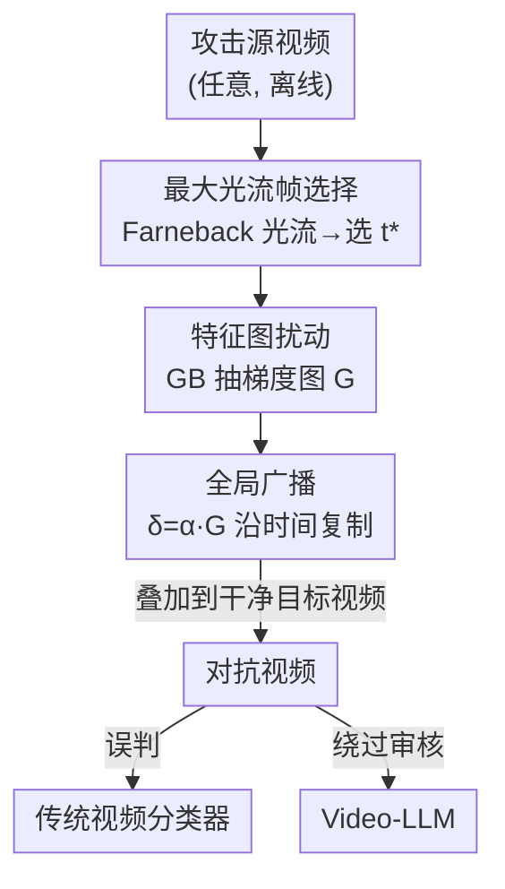

# FeatureFool: Zero-Query Fooling of Video Models via Feature Map

**会议**: CVPR 2026  
**论文**: [CVF Open Access](https://openaccess.thecvf.com/content/CVPR2026/html/Tang_FeatureFool_Zero-Query_Fooling_of_Video_Models_via_Feature_Map_CVPR_2026_paper.html)  
**代码**: 未公开  
**领域**: AI安全 / 对抗攻击 / 视频理解  
**关键词**: 零查询攻击, 黑盒对抗攻击, 特征图, 视频LLM, 引导反向传播  

## 一句话总结
FeatureFool 提出首个**零查询**的视频黑盒对抗攻击：从一个公开预训练 3D-CNN 上、对"最大光流帧"用引导反向传播抽出一张富含运动语义的特征图，把它作为通用扰动广播到目标视频的每一帧，无需任何查询即可让传统视频分类器误判（ASR >70%），并能让 Video-LLM 漏判暴力/色情等有害内容（ASR >70%），同时画质几乎无损（SSIM >0.87、PSNR >28dB）。

## 研究背景与动机

**领域现状**：视频对抗攻击的黑盒主流做法是**迭代查询**——不断把候选扰动喂给受害模型、看返回的置信度/标签来调整扰动方向。这类方法（Sparse-RS、Adv-watermark、PatchAttack、BSC 等）确实能成功，但要么靠启发式搜索，要么靠强化学习。

**现有痛点**：迭代查询有三个硬伤。一是**查询代价极高**——PatchAttack 在视频上常需要数千次查询、BSC 也要数千次，攻击一个 Video-LLM 甚至要花几个小时；这在真实场景里既不现实也无法规模化。二是**画质差**——基于 patch / 水印的扰动语义稀薄，给视频带来明显失真（PSNR 普遍只有个位数到十几 dB）。三是**对 Video-LLM 不鲁棒**——视频被稀疏/逐帧扰动后，Video-LLM 的非均匀采样（如关键帧选择）会直接把扰动帧采没，攻击失效；而像 Frame Replacement 这类"免查询"花招又因为视觉痕迹明显、容易被人眼或过滤器识破。

**核心矛盾**：黑盒视频攻击长期被困在"查询次数"与"可用性"之间——要高成功率就得多查询、付出时间代价；要少查询又会牺牲画质或被采样策略破坏。而图像域虽已有零查询尝试（ZQBA），但**视频域至今没有任何方法直接用特征图（feature map）去搬移干净视频的特征空间**，零查询在视频模态完全是空白。

**切入角度**：作者观察到两个事实。其一，**引导反向传播（Guided Back-propagation, GB）** 在反传时抑制负梯度，能从 DNN 里抽出一张"最强烈影响模型决策"的判别性梯度图——这本身就是一个语义丰富、模型敏感的扰动候选，不需要查询受害模型。其二，**光流幅度大的帧往往携带更丰富的运动信息**，在这种帧上抽到的梯度更显著。把两者一拼：在最大光流帧上做 GB，得到一张运动语义浓缩的特征图，再当作"通用模板"广播到所有帧。

**核心 idea**：用"最大光流帧 + 引导反传"离线抽出的**一张特征图扰动**，广播到整段视频，把零查询黑盒攻击从图像域第一次带进视频域，并借特征图的可迁移性顺带攻破 Video-LLM 的内容审核。

## 方法详解

### 整体框架

FeatureFool 是一条**离线、零查询**的流水线：攻击者手里只需要一个公开预训练的 3D-CNN（如 C3D、I3D）和任意一段"攻击源视频"（attack-video，和目标视频无需相关），全程不碰受害模型。流程是——给定攻击源视频，先用 Farneback 稠密光流找到运动最剧烈的那一帧 $t^*$；在这一帧上用引导反向传播抽出一张判别性梯度图 $\mathbf{G}$；把 $\mathbf{G}$ 缩放到 $\ell_\infty$ 预算内、沿时间轴复制成与目标视频等长的全局扰动；叠加到干净目标视频上得到对抗视频。最终这段对抗视频既能让传统分类器误判，又因为特征图的可迁移性，能让 Video-LLM 把有害内容判成"无害"。

### 关键设计

**1. 最大光流帧选择：把"一张扰动"押在信息最浓的那一帧上**

FeatureFool 只想注入**一张**通用扰动，所以必须挑出最能代表整段视频的帧。作者的依据是经验观察——光流幅度大的帧往往封装了更多判别信息（后面 Discussion 也用梯度范数分布证实：最大光流帧的 GB 梯度 L2 范数分布整体右移、更显著）。具体地，对攻击源视频张量 $\mathbf{X}^{\mathrm{att}}\in\mathbb{R}^{C\times T\times H\times W}$，用 Farneback 算法计算相邻帧之间的稠密光流 $\mathcal{F}_t(\mathbf{p})=[\Delta u,\Delta v]$，再算每帧的平均光流幅度

$$m_t=\frac{1}{HW}\sum_{h,w}\sqrt{(\Delta u_{h,w})^2+(\Delta v_{h,w})^2}$$

对边界补 $m_0=m_1$、$m_T=m_{T-1}$ 后，取 $t^*=\arg\max_t m_t$ 作为唯一被攻击的帧。这一步是零成本运动线索：不需要任何模型查询，纯光流统计就定位了"模型最敏感"的代理位置。

**2. 特征图扰动：用引导反传抽一张判别性梯度图当扰动**

选定 $t^*$ 后，只在这一帧上做引导反向传播。设 $\phi_\ell(\cdot;\theta)$ 是分类器到第 $\ell$ 层的子网络，梯度图为 $\mathbf{G}=\nabla_{\mathbf{X}_{t^*}^{\mathrm{att}}}\phi_\ell(\mathbf{X};\theta)$。关键在反传时把标准 ReLU 的回传掩码

$$\mathbb{1}_{\text{ReLU}}=\mathbb{1}_{\frac{\partial\mathcal{L}}{\partial\mathbf{z}}>0}\cdot\mathbb{1}_{\mathbf{z}>0}$$

替换成 Guided-ReLU 掩码

$$\mathbb{1}_{\text{GReLU}}=\mathbb{1}_{\frac{\partial\mathcal{L}}{\partial\mathbf{z}}>0}\cdot\mathbb{1}_{\mathbf{z}>0}\cdot\mathbb{1}_{\text{grad}_{\text{in}}>0}$$

即额外要求"流入的梯度也为正"才回传，从而把负梯度抑制掉，得到一张更**锐利、判别性更强**的梯度图。之所以用 GB 而不是 Grad-CAM/FullGrad 这类注意力图，是因为 GB 抽出的特征图语义粒度更细（实验 Figure 9 证实它给出更强扰动且画质更好）。这一步完全在攻击者本地的源模型上完成，**不向受害模型发任何查询**——这正是"零查询"的来源：扰动信息全部来自攻击者自己持有的 DNN，而非从受害模型反馈里"试"出来。

**3. 全局广播：用一张通用扰动抵消 Video-LLM 的采样不确定性**

视频比图像多了时间维，不同模型的帧采样策略（尤其 Video-LLM 的关键帧/均匀子采样）可能直接把被扰动的帧采没，导致逐帧或稀疏扰动失效。FeatureFool 的对策是把单帧梯度图变成**全局通用扰动**：先把 $\mathbf{G}$ 经 ReLU 和 $[0,1]$ 裁剪、乘缩放系数 $\alpha$、再做 $[-\varepsilon,\varepsilon]$ 投影满足 $\ell_\infty$ 预算，然后沿时间轴复制到每一帧：

$$\mathbf{X}_{\mathrm{adv}}=\mathbf{X}+\alpha\,\mathbf{G}^{\rightarrow T},\qquad \|\mathbf{X}_{\mathrm{adv}}-\mathbf{X}\|_\infty\le\varepsilon$$

由于每一帧都带同一张运动对齐的扰动，无论受害模型怎么采样、采到哪几帧，扰动都在；而且这种空间一致的全局扰动天然抗"逐帧防御"（后面会看到它对帧重排、防御 pattern 都很顽固）。$\alpha$ 控制注入强度，是攻击成功率与隐蔽性的权衡旋钮，实验取 $\alpha=0.4$。

### 一个完整示例

以攻击一段"散步"视频骗过 C3D 为例走一遍：① 取任意一段攻击源视频（实验证明随机选即可，无需和目标相关），算出每帧平均光流 $m_t$，发现第 4 帧光流最大，$t^*=4$；② 只在第 4 帧上跑 GReLU 引导反传，得到一张锐利梯度图 $\mathbf{G}$；③ 把 $\mathbf{G}$ 裁剪、乘 $\alpha=0.4$、$\ell_\infty$ 投影后沿时间复制 16 份（输入是 16 帧）；④ 叠到干净的散步视频上 → 对抗视频被 C3D 误判成"punch"等非真值类，而人眼几乎看不出区别（SSIM 0.88、PSNR 29dB）。同一段对抗视频拿去问 Video-LLM"有没有暴力内容"，它会回答"没有，只是有人在散步"。

## 实验关键数据

### 主实验：视频分类器上的攻击性能（Table 1）

对比对象都是查询高效型黑盒攻击；FeatureFool 用 **0 次查询**就拿到相当甚至更高的 ASR，且画质（SSIM/PSNR）和时间一致性（TI）全面领先。

| 模型 | 攻击 | 数据集 | ASR↑ | #查询↓ | SSIM↑ | PSNR↑ |
|------|------|--------|------|--------|-------|-------|
| C3D | Adv-watermark | UCF-101 | 58% | 668 | 0.827 | 10.06 |
| C3D | PatchAttack | UCF-101 | 68% | 6,524 | 0.726 | 6.72 |
| C3D | BSC | UCF-101 | 72% | 3,968 | 0.852 | 15.76 |
| C3D | **FeatureFool** | UCF-101 | **70%** | **0** | **0.883** | **29.03** |
| I3D | BSC | HMDB-51 | 74% | 3,017 | 0.832 | 15.00 |
| I3D | **FeatureFool** | HMDB-51 | **73%** | **0** | **0.886** | **29.41** |

FeatureFool 的 PSNR 是 Adv-watermark 的 2–3 倍，SSIM 始终 >0.87，几乎不可察觉；而 PatchAttack 虽然 ASR 不低，却要数千次查询且画质极差（PSNR 个位数、TI 高达几十甚至上百）。

### Video-LLM 上的迁移攻击（Table 2，指标 ASR%）

在 60 段暴力/犯罪/色情有害片段上，看能否让 Video-LLM 把有害内容判成"无害"。

| 攻击 | VideoLLaMA2 (Avg) | ShareGPT4Video (Avg) |
|------|-------------------|----------------------|
| Sparse-RS | 11.25% | 12.50% |
| PatchAttack | 27.25% | 35.75% |
| BSC | 35.00% | 34.25% |
| **FeatureFool** | **76.25%** | **71.25%** |

差距悬殊：基线攻击因为扰动语义稀薄、对特征空间影响不足，在 Video-LLM 上基本失效；FeatureFool 的特征图扰动则能让 >70% 的有害视频被判为"无害"，甚至诱发幻觉（如把内容描述错）。这印证了"特征丰富的扰动比无结构/弱语义扰动对 Video-LLM 的影响大得多"。

### 消融与变体（Table 5，UCF-101）

| 配置 | C3D ASR↑ | I3D ASR↑ | 说明 |
|------|---------|---------|------|
| FeatureFool-random | 53% | 57% | 随机选一帧做特征图 |
| FeatureFool-full | 65% | 70% | 对每一帧都算特征图 |
| **FeatureFool** | **70%** | **74%** | 最大光流帧 + GB |

随机选帧（-random）大幅落后，说明帧选择非平凡；逐帧计算（-full）也接近但仍不及只取最大光流帧——既验证了"最大光流帧 + GB"组合的正向作用，又说明长视频里**不必逐帧计算**，更省、更高效。

### 关键发现

- **为什么用最大光流？** 把每帧按光流分成 I–V 五档，成功攻击帧的比例随光流档位单调上升（Figure 6）；最大光流帧的 GB 梯度 L2 范数分布也整体右移（Figure 7）——光流大 ⇒ 梯度显著 ⇒ 攻击更易成功，光流幅度是"模型敏感位置"的零成本代理。
- **攻击源视频随便选即可**：随机选源视频与"挑 SSIM/余弦最相似的源视频"得到几乎相同的 ASR（≈70%，Figure 8），跨域攻击不需要任何源视频先验。
- **强度 $\alpha$ 的权衡**：$\alpha$ 从 0.1 升到 1.0，ASR 单调上升、SSIM/PSNR 单调下降（Figure 11），折中取 $\alpha=0.4$。
- **抗防御顽固**（Table 6）：面对两种视频专用防御——Defense Patterns（叠学习到的 pattern 把视频推回正确类）和 Temporal Shuffling（打乱帧序破坏扰动），FeatureFool 仍保有 >60% 的残余 ASR，而 Sparse-RS/Adv-watermark 只剩 ~40%。原因是它的扰动锚定在运动最强帧、又被全局广播，每帧的对抗签名空间一致：DPs 的模板抵消不掉全局相干的运动对齐扰动，TS 打乱帧序后每帧仍带同一张特征图，整段依旧落在决策边界错误的一侧。

## 亮点与洞察

- **"零查询"的真正来源是换了信息源**：传统黑盒攻击靠反复查询受害模型"试"出扰动方向，FeatureFool 直接从攻击者自己持有的公开 DNN 上抽特征图当扰动——把"信息从哪来"从受害模型挪到第三方源模型，查询数直接归零。这个视角可迁移到任何"有现成预训练模型可借"的黑盒场景。
- **光流当"免费显著性代理"**：在完全黑盒、拿不到受害模型梯度的前提下，用零成本的光流统计去逼近"哪一帧/哪块区域模型最敏感"，是个很省的工程巧思——梯度范数分布的实证让这个代理不只是直觉。
- **全局广播 = 用空间冗余换采样鲁棒性**：把单帧扰动复制到全帧，看似浪费，实则一举两得——既抵消 Video-LLM 不可控的采样策略，又让扰动天然抗帧重排/防御 pattern。对抗"采样会丢帧"这类视频特有难题是个干净的答案。

## 局限与展望

- **依赖源模型与受害模型的架构/数据相近度**：跨架构（C3D↔I3D）会带来"明显但可接受"的 ASR 下降（Table 3），跨数据集下降更小（Table 4）；当源模型与受害模型差异很大时，特征图的可迁移性会打折扣，论文未给出差异极大时的退化下界。
- **Video-LLM 攻击的评测规模偏小**：有害内容只有 60 段（三类各 20），且 ASR 的判定依赖固定提问模板，受 Video-LLM 回答措辞影响，⚠️ 可能存在评测脆弱性，结论的统计稳健性有待更大规模验证。
- **缺乏自适应防御下的评估**：实验中的两种防御（DPs/TS）并非针对"全局相干运动对齐扰动"设计；一旦防御方知道扰动是全局广播的，可能用跨帧一致性检测专门反制，这条作者未讨论。
- **强烈的双刃性**：方法本身即"如何让审核模型漏判暴力/色情内容"，论文也明示包含暴力/露骨内容；落地价值更多在**红队评测与防御研究**，而非直接部署。

## 相关工作与启发

- **vs 查询型黑盒攻击（PatchAttack / BSC / Sparse-RS / Adv-watermark）**：它们靠数百到数千次查询迭代搜索扰动，时间/查询代价高且画质差；FeatureFool 零查询、靠源模型特征图一次成型，ASR 相当但 PSNR 高 2–3 倍、抗防御残余 ASR 高约 20 个百分点。
- **vs 图像域零查询攻击 ZQBA**：ZQBA 在图像域实现了免训练免迭代的攻击，但没解决视频的时间维问题（采样会丢扰动帧），也没研究与 LLM 的交互；FeatureFool 用"最大光流帧 + 全局广播"把零查询第一次落到视频，并验证了对 Video-LLM 的迁移攻击。
- **vs Frame Replacement 类免查询花招**：这类方法虽免查询，但替换/编辑帧的视觉痕迹明显，易被人眼或过滤器识破；FeatureFool 的扰动在 $\ell_\infty$ 预算内、SSIM>0.87，几乎不可察觉。

## 评分
- 新颖性: ⭐⭐⭐⭐⭐ 首个用特征图做视频域零查询黑盒攻击，并打通到 Video-LLM 内容审核绕过
- 实验充分度: ⭐⭐⭐⭐ 三数据集 × 两分类器 + 两 Video-LLM + 跨架构/跨数据集/抗防御较完整，但 Video-LLM 仅 60 段、规模偏小
- 写作质量: ⭐⭐⭐⭐ 方法与公式清晰、动机递进顺畅，部分符号/图表说明略仓促
- 价值: ⭐⭐⭐⭐ 对视频与 Video-LLM 安全红队、对抗鲁棒性研究有实用价值，但有明显双刃性

<!-- RELATED:START -->

## 相关论文

- [\[CVPR 2026\] RunawayEvil: Jailbreaking the Image-to-Video Generative Models](runawayevil_jailbreaking_the_image-to-video_generative_models.md)
- [\[CVPR 2026\] Hierarchically Robust Zero-shot Vision-language Models](hierarchically_robust_zero-shot_vision-language_models.md)
- [\[CVPR 2026\] FVBench: Benchmarking Deepfake Video Detection Capability of Large Multimodal Models](fvbench_benchmarking_deepfake_video_detection_capability_of_large_multimodal_mod.md)
- [\[CVPR 2026\] TIACam: Text-Anchored Invariant Feature Learning with Auto-Augmentation for Camera-Robust Zero-Watermarking](tiacam_text-anchored_invariant_feature_learning_with_auto-augmentation_for_camer.md)
- [\[CVPR 2026\] VMD-FACT: A New Video Dataset and MLLM-based method for Detecting Realistic AI-Generated Video Misinformation](vmd-fact_a_new_video_dataset_and_mllm-based_method_for_detecting_realistic_ai-ge.md)

<!-- RELATED:END -->
