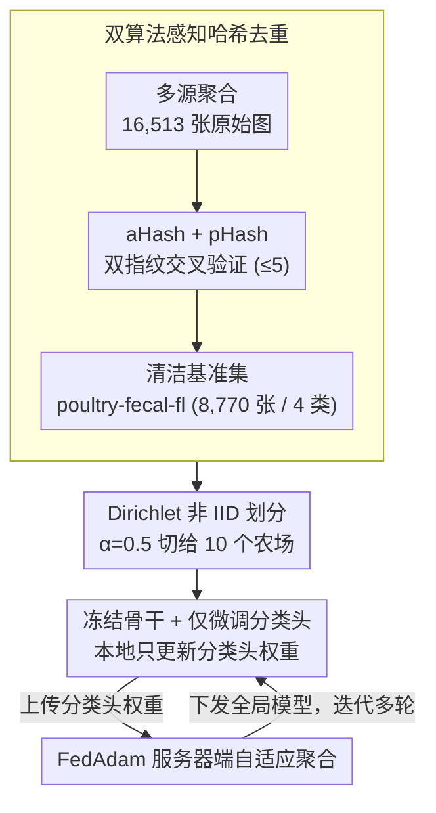

# FecalFed: Privacy-Preserving Poultry Disease Detection via Federated Learning

**会议**: CVPR 2026  
**arXiv**: [2604.00559](https://arxiv.org/abs/2604.00559)  
**代码**: 无  
**领域**: AI Safety / 隐私保护  
**关键词**: 联邦学习, 隐私保护, 禽类疾病检测, 数据去重, Non-IID, Vision Transformer

## 一句话总结

提出 FecalFed 隐私保护联邦学习框架，首先通过双哈希去重清理公开禽类粪便数据集中 46.89% 的重复污染并发布 8,770 张清洁基准数据集 poultry-fecal-fl，随后在 Dirichlet α=0.5 的高度非 IID 条件下验证：FedAdam + Swin-Small 可将单农场训练崩溃的 64.86% 准确率恢复至 90.31%，仅比中心化上界 95.10% 低 4.79%；边缘优化的 Swin-Tiny（28M 参数）仍达 89.74%，为农场端部署提供高效可行方案。

## 研究背景与动机

**现实问题**：高致病性禽流感（HPAI）持续引发全球性爆发，球虫病、新城疫（NCD）、沙门氏菌等地方性感染每年造成巨大经济损失。传统监测依赖 PCR 等实验室检测，时间长、成本高，而深度学习通过分析粪便图像已展现出高精度的非侵入性诊断潜力。

**隐私瓶颈**：训练鲁棒 AI 模型需要聚合大量数据，但农场出于生物安全风险、商业利益保护和声誉担忧，拒绝将敏感的健康数据上传到中心服务器。数据孤岛使得各农场独立训练，但在自然异构分布下性能严重崩溃。

**数据污染危机**：公开数据集看似可以绕过隐私限制，但作者发现存在严重的未记录的数据污染——对超过 16,000 张公开图像的分析揭示了 46.89% 的重复率，其中 Roboflow 数据集 77.4% 的图像仅是 Zenodo 原始数据的缩放复制，导致严重的训练/测试泄漏和性能虚高。

**单农场训练不可行**：在真实的非 IID 条件下，单农场隔离训练准确率仅 64.86%（±24.95%），比中心化 95.10% 下降超过 30 个百分点，方差极大，完全无法支撑可靠的疾病诊断。

**核心思路**：利用联邦学习实现"数据不动、模型流动"，各农场保留原始数据，仅向中心服务器通信模型权重更新，既保护隐私又恢复协作训练的性能优势。

## 方法详解

### 整体框架

FecalFed 由两大模块组成：（1）数据清洗流水线——聚合多源公开数据 → 双哈希感知去重 → 标准化预处理 → 发布清洁基准集 poultry-fecal-fl；（2）跨农场联邦学习框架——基于 Flower (flwr) 框架编排，10 个模拟农场在非 IID 条件下各自本地训练，中心服务器进行自适应聚合。原始粪便图像始终留在农场本地，仅分类头权重在网络中传输。

### 关键设计

**1. 双算法感知哈希去重：用两把"指纹"交叉验证才敢删图**

公开数据集看似免费午餐，可一旦混入近重复图像，训练/测试就会泄漏、性能虚高，这正是本文要先堵上的漏洞。具体做法是给从多个仓库聚合来的 16,513 张原始图像每张算两把感知指纹：256-bit 的 Average Hash（aHash，捕获宏观亮度模式）和 Perceptual Hash（pHash，基于离散余弦变换捕获频域特征）。只有当两把哈希的 Hamming 距离**同时**满足阈值时，一对图像才被判为重复：

$$D_{aHash}(x,y) \leq 5 \;\wedge\; D_{pHash}(x,y) \leq 5$$

之所以坚持双算法而非单一哈希，是因为单把指纹要么漏检、要么误删相似但不同的样本；让 aHash 和 pHash 互相把关，既提高召回又压住误报，而严格的 ≤5 阈值保证删掉的确实是近重复而非"长得像的不同病例"。这道流水线一跑就暴露了惊人的污染：去重率高达 46.89%（移除 7,743 张），Roboflow 数据集里 77.4% 的图其实只是 Zenodo 原始数据的下采样副本；它还揪出 19 组跨标签冲突组（同一张图在不同仓库被标成不同疾病），一并清除后，最终留下 8,770 张 4 类唯一图像（Healthy / Coccidiosis / NCD / Salmonella），构成发布的 poultry-fecal-fl 基准集。

**2. Dirichlet 非 IID 划分：故意制造极端偏斜，逼真模拟农场孤岛**

真实农业里疾病爆发是高度局部化的——某片养殖区正闹球虫病，隔壁可能全是健康鸡，IID 假设与现实严重脱节。为了让实验贴近这种孤岛形态，作者用浓度参数 $\alpha=0.5$ 的 Dirichlet 分布去采样每个客户端的类别比例，把清洁数据集切给 10 个模拟农场。$\alpha$ 越小分布越倾斜，0.5 已足够极端：结果有的农场几乎清一色沙门氏菌样本，有的则以健康样本为主。这种刻意制造的偏斜不是为了好看，而是给后面的联邦算法设一道够硬的压力测试——只有在这样的分布下站得住，才说明方法在真实场景可用。

**3. 冻结骨干 + 仅微调分类头：让算力受限的边缘设备也训得动、传得起**

农场端的设备往往是智能手机、NVIDIA Jetson Nano 这类嵌入式系统，算力和内存都吃紧，对整个 Vision Transformer 做完整微调既跑不动也传不起。本文的取舍是把 ImageNet 预训练的 Swin/ViT 特征提取骨干整个冻住，联邦训练全程只更新分类头。这一刀下去，每轮需要在网络里传输的参数量从数千万压到分类头的几十万，本地的内存与计算需求随之骤降。换来的好处是双重的：边缘设备上的本地训练变得切实可行，通信开销又小到连低带宽的农村网络都能轻松胜任——这也为后面"延长通信轮数比换算法更划算"的发现埋下伏笔。

**4. FedAdam 服务器端自适应聚合：在客户端各拉各方向时稳住全局模型**

非 IID 条件下每个农场的更新方向差异极大，FedAvg 那种简单加权平均很容易让全局模型发散或停滞，参数量越大的模型越明显。FedAdam 的应对是把各客户端聚合出来的伪梯度喂给服务器端的一个 Adam 优化器，用一阶、二阶矩估计为每个参数自适应地调步长，从而稳住异构场景下的聚合。这里没有选 FedProx 这类近端正则化，是因为近端项会干扰预训练模型的微调；而 FedAdam 只在服务器端动手，完全不改客户端的本地训练流程，对预训练权重更友好。其关键超参为服务器端学习率 $\eta=0.1$、矩衰减 $\beta_1=0.9$ / $\beta_2=0.99$、自适应度 $\tau=0.001$。

### 训练策略与损失函数

- **损失函数**：标准交叉熵损失
- **客户端采样**：每轮随机采样 50% 客户端（5/10 个农场）参与训练
- **本地训练**：每轮 E=1 个本地 epoch，batch size=256，在 NVIDIA A100 上模拟
- **全局通信轮数**：默认 10 轮，消融实验扩展至 20 轮
- **数据预处理**：统一 resize 至 224×224；训练时随机 resized crop、水平/垂直翻转、随机旋转（≤30°）、色彩抖动（亮度/对比度/饱和度方差 0.2，色调方差 0.1）；ImageNet 均值/标准差归一化
- **评估架构**：Swin-Small（50M）、ViT-B/16（86M）、Swin-Tiny（28M）、ViT-S/16（22M）

## 实验关键数据

### 主实验：不同训练范式下的模型性能

| 模型 | 参数量 | 单农场 (Non-IID) | 中心化 (上界) | FL (FedAvg) | FL (FedAdam) | Best FL vs 中心化 |
|------|--------|-----------------|--------------|-------------|-------------|------------------|
| Swin-Small | 50M | 64.86% ±24.95% | 95.10% | 89.74% | **90.31%** | -4.79% |
| ViT-B/16 | 86M | 60.97% ±23.05% | 94.81% | 88.77% | **90.02%** | -4.79% |
| Swin-Tiny | 28M | 64.03% ±24.04% | 93.04% | 86.89% | **89.74%** | -3.30% |
| ViT-S/16 | 22M | 65.87% ±22.06% | 92.99% | **89.28%** | 85.12% | -3.71% |

### 消融实验：通信轮数对收敛的影响（ViT-B/16 + FedAvg）

| 通信轮数 | 测试准确率 | 说明 |
|---------|----------|------|
| 5 轮 | 80.79% | 初步收敛，性能尚未充分释放 |
| 10 轮 | 88.77% | 默认配置，已恢复大部分性能 |
| 20 轮 | 91.05% | 持续改善无停滞，超过 FedAdam 10 轮的 90.02% |

### 数据去重统计

| 指标 | 数值 |
|------|------|
| 原始聚合图像数 | 16,513 |
| 去重后唯一图像数 | 8,770 |
| 总重复率 | 46.89% |
| Roboflow 数据中重复比例 | 77.4% |
| 跨标签冲突组数 | 19 |
| 疾病类别数 | 4（Healthy / Coccidiosis / NCD / Salmonella） |

### 关键发现

1. **单农场训练全面崩溃**：所有架构在 α=0.5 的非 IID 条件下均跌至 60-66% 范围，方差高达 ±22-25%，证明孤立训练在异构数据下根本不可行
2. **FedAdam vs FedAvg 因模型规模而异**：大模型（Swin-Small 50M、ViT-B/16 86M）从 FedAdam 获益更多（+0.57%、+1.25%），但小模型 ViT-S/16 反而 FedAvg 更优（89.28% vs 85.12%），说明自适应优化器在小参数空间上可能过拟合
3. **Swin-Tiny 是边缘部署最优选择**：28M 参数达 89.74%，仅比 86M 的 ViT-B/16（90.02%）低 0.28%，参数量不到后者的 1/3，在精度-效率 Pareto 前沿上占据最优点
4. **延长通信轮数持续有效**：由于仅传输分类头权重，通信带宽开销极小，20 轮 FedAvg 即可达 91.05%，甚至超过 10 轮 FedAdam 的 90.02%，表明在低带宽场景下增加轮数是比换算法更实用的策略
5. **FecalFed 恢复幅度巨大**：以 Swin-Small 为例，FedAdam 相比单农场训练提升 +25.45 个百分点（64.86% → 90.31%），证明联邦协作对非 IID 场景的关键性

## 亮点与洞察

1. **数据卫生问题的揭露极具价值**：46.89% 的重复率和 77.4% 的合成数据来自缩放复制，说明公开农业 AI 数据集的可靠性严重不足。这个发现对整个农业 AI 社区是重要警示——任何基于这些数据报告的性能数字都可能严重虚高
2. **从数据到部署的完整闭环**：数据清洗 → 非 IID 划分 → 联邦训练 → 边缘优化，端到端地解决了农业 AI 部署的关键挑战链
3. **通信效率极高**：冻结骨干仅传输分类头参数，即使在农村低带宽网络下也具有实际部署可行性
4. **实验设计严谨**：同时提供中心化上界、单农场下界、两种联邦策略的完整对比，清晰量化每个组件的贡献

## 局限性

1. 仅涵盖 4 类疾病分类，实际禽类疾病种类远多于此，细粒度诊断需求未被满足
2. 10 个模拟客户端的规模有限，无法充分验证在数百个农场场景下的可扩展性
3. 未考虑不同采集设备（手机型号、光照条件、拍摄角度）带来的域偏移
4. 冻结骨干策略虽通信高效但限制了模型对农业领域特定特征的适应能力，完整微调在高带宽场景下可能获得更好性能
5. 未评估 FedProx 等近端正则化方法的实际效果，仅以理论分析排除
6. 未涉及差分隐私（DP）等更强的隐私保障机制，当前方案的隐私保护仅依赖"不传输原始数据"
7. 所有实验在单一 A100 上模拟，未在真实边缘设备上验证延迟和内存占用

## 相关工作与启发

- **FedAvg (McMahan et al., 2017)**：联邦学习奠基方法，本文作为基线验证其在非 IID 条件下仍有竞争力
- **FedAdam (Reddi et al., 2020)**：自适应联邦优化，本文证实其对大模型在非 IID 场景的稳定化作用
- **FedProx (Li et al., 2020)**：近端项正则化抗漂移，本文未实验但讨论了其可能干扰预训练微调的局限
- **Degu et al., 2023**：基于智能手机 CNN 的禽类粪便疾病诊断，证明了移动端部署的可行性
- **Luong & Nguyen, 2024**：ViT + Integrated Gradients 实现可解释禽类诊断，但依赖中心化数据
- **启发**：数据清洗（去重、去泄漏检查）应成为任何涉及多源聚合的 AI 数据集工作的标准第一步；联邦学习在 non-IID 场景下的有效性取决于模型规模与优化策略的匹配

## 评分

- 新颖性: ⭐⭐⭐ — 联邦学习 + 疾病分类的组合不算新，但数据污染的系统性揭露和清洁基准集的发布有独立贡献
- 实验充分度: ⭐⭐⭐⭐ — 多架构、多策略的完整对比 + 通信轮数消融，但缺少 FedProx 实验和差分隐私评估
- 写作质量: ⭐⭐⭐⭐ — 结构清晰、数据翔实，问题定义和动机论证有力
- 价值: ⭐⭐⭐⭐ — 为农业 AI 社区提供了可复现的联邦学习基线和经过严格去重的公开数据集

<!-- RELATED:START -->

## 相关论文

- [\[ICCV 2025\] FedMeNF: Privacy-Preserving Federated Meta-Learning for Neural Fields](../../ICCV2025/ai_safety/fedmenf_privacy-preserving_federated_meta-learning_for_neural_fields.md)
- [\[CVPR 2026\] FedRE: A Representation Entanglement Framework for Model-Heterogeneous Federated Learning](fedre_a_representation_entanglement_framework_for_model-heterogeneous_federated_.md)
- [\[CVPR 2026\] Federated Active Learning Under Extreme Non-IID and Global Class Imbalance](federated_active_learning_extreme_noniid.md)
- [\[CVPR 2026\] FedDAP: Domain-Aware Prototype Learning for Federated Learning under Domain Shift](feddap_domain-aware_prototype_learning_for_federated_learning_under_domain_shift.md)
- [\[CVPR 2026\] Domain-Skewed Federated Learning with Feature Decoupling and Calibration](domain-skewed_federated_learning_with_feature_decoupling_and_calibration.md)

<!-- RELATED:END -->
