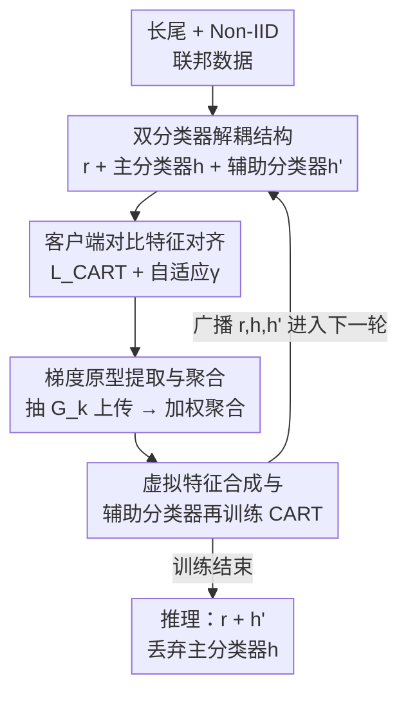

# FedCART: Tackling Long-Tailed Distributions in Federated Adversarial Training via Classifier Refinement

**会议**: CVPR 2026  
**论文**: [CVF Open Access](https://openaccess.thecvf.com/content/CVPR2026/html/Qin_FedCART_Tackling_Long-Tailed_Distributions_in_Federated_Adversarial_Training_via_Classifier_CVPR_2026_paper.html)  
**代码**: 无  
**领域**: AI安全 / 联邦学习 / 对抗鲁棒  
**关键词**: 联邦对抗训练, 长尾分布, 分类器校准, 梯度原型, 对比特征对齐

## 一句话总结
针对联邦对抗训练（FAT）在长尾数据下崩盘的问题，FedCART 把全局模型拆成「共享特征提取器 + 双分类器」，客户端用对比损失对齐自然/对抗特征以保鲁棒，服务端用聚合后的梯度原型合成类别均衡的虚拟特征、再训练一个辅助分类器来消偏，在 CIFAR/SVHN/FMNIST 的长尾变体上自然精度与鲁棒精度同时超过 CalFAT 等 SOTA。

## 研究背景与动机
**领域现状**：联邦学习（FL）让多客户端在不共享原始数据的前提下协同训练，但全局模型同样会被对抗样本攻破。把集中式的对抗训练（AT）搬到联邦场景就是联邦对抗训练（FAT），代表工作如 CalFAT 通过按本地标签分布调整损失与对抗样本生成，来缓解客户端间的 Non-IID。

**现有痛点**：这些 FAT 方法几乎都默认「全局数据是类别均衡的」（closed-world 假设），可现实世界普遍是长尾分布。论文第一步就用实验诊断：把 CalFAT 从均衡分布换到长尾分布，自然精度从 67.26% 掉到 35.99%、鲁棒精度从 30.04% 掉到约 8 点级别，且预测严重偏向 head 类（样本 >1000 的类 0–3），tail 类几乎被放弃。

**核心矛盾**：长尾叠加 Non-IID 会双重打击 FAT。一方面 tail 类样本本就稀少，又集中在少数客户端，导致各客户端学到发散的特征、本地更新不一致，聚合后的全局特征空间「扭曲且混乱」；另一方面对抗样本与自然样本在特征上差异很大，进一步把本就偏向 head 类的分类器搞糊涂。归根结底是——**在被对抗攻击扭曲、又因 tail 稀缺而偏斜的特征上，分类器失效了**。

**本文目标**：在不违反 FL 隐私（不共享原始数据）的前提下，让 FAT 在长尾分布下同时保住鲁棒性和 tail 类的可分性。

**切入角度**：作者把「学好鲁棒特征」和「学好无偏分类器」这两件被纠缠在一起的事**解耦**开——特征学习放客户端做，分类器纠偏放服务端做。这样长尾偏置就不必靠特征提取器去硬扛。

**核心 idea**：解耦出共享特征提取器 + 双分类器结构，客户端做对比特征对齐保鲁棒、服务端用梯度原型合成均衡虚拟特征重训一个辅助分类器消偏，推理时只用辅助分类器。

## 方法详解

### 整体框架
FedCART 把全局模型 $w=(r,h)$ 扩展为「共享特征提取器 $r$ + 主分类器 $h$ + 辅助分类器 $h'$」。每个通信轮 $t$ 分两段：**客户端本地更新**——下载全局模型，用对比对齐损失 $\mathcal{L}_{\text{CART}}$ 训练 $E$ 个 epoch 增强鲁棒性，再用辅助分类器抽取本类的梯度原型 $G_k^{(t)}$，把模型和原型一起上传；**服务端全局优化**——加权聚合模型与原型，基于聚合原型迭代「合成」一组类别均衡的虚拟特征，再在虚拟特征上重训辅助分类器 $h'$ 来校准长尾偏置，最后把模型广播给下一轮客户端。训练结束（第 $T$ 轮）后，**推理只用 $r^{(T)}$ + 辅助分类器 $h'^{(T)}$，丢弃主分类器 $h$**。

整条 pipeline 是「客户端学特征 → 上传原型 → 服务端合成均衡虚拟特征 → 重训分类器」的串行回环，框架图如下（节点名即下文关键设计名）：

### 关键设计

**1. 双分类器解耦结构：把「学鲁棒特征」和「学无偏分类器」拆给两端**

长尾下分类器失效的根因是它要在「被对抗扭曲 + 被 head 类主导」的特征上做决策，二者纠缠。FedCART 把全局模型拆成共享特征提取器 $r$、主分类器 $h$、辅助分类器 $h'$：主分类器 $h$ 跟随客户端常规 FAT 训练、负责学鲁棒特征所需的梯度信号；辅助分类器 $h'$ 专门在服务端用类别均衡的虚拟特征重训、负责无偏分类。两者共享同一个 $r$，因此特征提取器只管学「鲁棒且有判别力」的表示，不必同时背负长尾消偏的压力。推理阶段直接抛弃 $h$、用 $h'$，等于把训练期偏置全留在被丢弃的那条分类头上——这是整个方法能「鱼与熊掌兼得」的结构性前提，后面三个设计都挂在这条骨架上。

**2. 客户端对比特征对齐：自适应拉近自然/对抗特征**

对抗样本特征 $z'$ 和自然样本特征 $z$ 差异大会让分类器混乱。客户端的本地目标是 $\mathcal{L}_{\text{CART}} = \mathcal{L}_{\text{NAT}} + \mathcal{L}_{\text{AT}} + \gamma\,\mathcal{L}_{\text{Align}}$，其中 $\mathcal{L}_{\text{NAT}}$、$\mathcal{L}_{\text{AT}}$ 分别是自然样本和（PGD 生成的）对抗样本的交叉熵。对齐项 $\mathcal{L}_{\text{Align}}$ 是一个有监督对比损失，把同标签的自然—对抗特征对当正样本拉近：

$$\mathcal{L}_{\text{Align}} = \sum_{i=1}^{2N_k}\frac{-1}{|P(i)|}\sum_{p\in P(i)}\log\frac{\exp(z_i\cdot z_p'/\tau)}{\sum_{j\in Q(i)}\exp(z_i\cdot z_j'/\tau)}$$

其中 $P(i)$ 是与 $y_i$ 同标签的样本、$Q(i)$ 是其余样本、$\tau$ 是温度。关键巧思在权重 $\gamma$ 不是固定常数，而是按「自然预测与对抗预测的不一致程度」自适应：

$$\gamma = \iota\Big(1 - \frac{\sum_{i=1}^{N_k}\mathbb{I}(\hat{y}_i=\hat{y}_i')}{N_k}\Big)$$

当自然/对抗预测分歧大（模型不稳）时加大对齐力度，预测一致时就不做多余惩罚，避免过度正则伤害精度。

**3. 梯度原型提取与聚合：用「梯度方向」隔空传递类别信息**

要在服务端纠偏，就得让服务端知道每个类「长什么样」，但又不能传原始特征/数据。FedCART 改传**梯度原型**：客户端用辅助分类器初始化 $w_k'^{(t)}=(r^{(t)}, h'^{(t)})$，对每个类 $c$ 求该类样本在辅助分类器上的平均梯度

$$\mathbf{g}_{k,c}^{(t)} = \frac{1}{n_k^{(c)}}\sum_{i=1}^{n_k^{(c)}}\nabla_{\mathbf{h}'}\mathcal{L}_{\text{CART}}\big(w_k'^{(t)}; x_i, x_i', y_i\big)$$

把类原型集 $G_k^{(t)}=\{\mathbf{g}_{k,c}^{(t)}\}$ 连同模型上传。服务端按样本数加权聚合得到全局原型 $\overline{\mathbf{g}}_c^{(t)}=\sum_{k\in A^{(t)}}\frac{N_k}{\sum N_{k'}}\mathbf{g}_{k,c}^{(t)}$。梯度原型刻画的是「该类对分类器的更新方向」，由于平均过程不可逆，难以从中重建原始样本，因此在保隐私的同时给服务端提供了重建类别信息的钩子。

**4. 虚拟特征合成与辅助分类器再训练（CART）：在服务端造一份均衡数据消偏**

有了全局梯度原型，服务端不再受真实数据长尾约束，而是**反向合成**一组类别均衡的虚拟特征 $\mathcal{Z}_v^{(t)}$——每个类分配等量虚拟特征，让这些虚拟特征在辅助分类器上产生的梯度去逼近聚合原型，目标是 MSE：

$$\mathcal{L}_{\text{MSE}}(\mathcal{Z}_v^{(t)};\mathbf{h}'^{(t)},\mathcal{G}^{(t)}) = \big\|\nabla_{\mathbf{h}'}\mathcal{L}_{\text{CE}}(\mathbf{h}'^{(t)};\mathcal{Z}_v^{(t)}) - \mathcal{G}^{(t)}\big\|^2$$

虚拟特征迭代 $T_V$ 轮更新 $\mathcal{Z}_v^{(t+1)} \leftarrow \mathcal{Z}_v^{(t)} - \hat{\eta}_a'\nabla_z\mathcal{L}_{\text{MSE}}$。之后辅助分类器在这份均衡虚拟特征上重训 $T_R$ 轮：$\mathbf{h}'^{(t+1)} \leftarrow \mathbf{h}'^{(t)} - \hat{\eta}_r'\nabla_{\mathbf{h}'}\mathcal{L}_{\text{CE}}(\mathbf{h}'^{(t)};\mathcal{Z}_v^{(t)})$。因为虚拟特征类别均衡，重训后的 $h'$ 不再偏向 head 类，这正是 tail 类精度被救回来的来源。

> ⚠️ 公式中虚拟特征更新使用的步长记号（$\hat{\eta}_a'$ / $\hat{\eta}_r'$）以原文 Eq.(9)(10) 为准。

### 损失函数 / 训练策略
- 客户端损失：$\mathcal{L}_{\text{CART}}=\mathcal{L}_{\text{NAT}}+\mathcal{L}_{\text{AT}}+\gamma\mathcal{L}_{\text{Align}}$，对抗样本由 10 步 PGD 生成。
- 服务端两阶段：先迭代 $T_V$ 轮更新虚拟特征（MSE 对齐梯度），再 $T_R$ 轮重训辅助分类器（CE）。
- 默认配置：通信轮 $T=150$、客户端数 $K=5$ 全参与、本地 epoch $E=1$；CIFAR 用 ResNet-18，FMNIST/SVHN 用轻量 CNN。

## 实验关键数据

### 主实验
四个长尾数据集（默认不平衡比 $\rho=50$、Dirichlet $\beta=0.5$）上，FedCART 的平均鲁棒精度（Robust AVG，含 FGSM/CW/PGD-20/AA）领先最优 baseline 1.65%~9.89%，自然精度也基本最高：

| 数据集 | 指标 | FedCART | CalFAT | FedFAT | 提升(vs最优) |
|--------|------|---------|--------|--------|------|
| CIFAR10-LT | Natural | **66.12** | 61.25 | 40.16 | +4.87 |
| CIFAR10-LT | PGD-20 | **32.47** | 30.04 | 24.69 | +2.43 |
| CIFAR10-LT | Robust AVG | **31.71** | 25.98 | 24.71 | +5.73 |
| CIFAR100-LT | Robust AVG | **14.90** | 11.86 | 12.57 | +2.33 |
| SVHN-LT | PGD-20 | **69.29** | 62.86 | 53.03 | +6.43 |
| SVHN-LT | Robust AVG | **70.52** | 59.95 | 54.88 | +9.89 |
| FMNIST-LT | Robust AVG | **73.51** | 69.20 | 68.41 | +4.31 |

按类别分组看（CIFAR100-LT，>150 样本为 Majority、<45 为 Minority），FedCART 在 Medium / Minority 组优势明显，而多数 baseline 在 tail 上近乎失效：

| 组别 | 指标 | FedCART | CalFAT | FedFAT |
|------|------|---------|--------|--------|
| Medium | Natural / PGD-20 | **39.51 / 15.34** | 37.35 / 13.61 | 30.81 / 10.17 |
| Minority | Natural / PGD-20 | **26.06 / 9.09** | 25.90 / 8.99 | 9.73 / 2.42 |

### 消融实验
CIFAR10-LT 上逐组件消融（✓ 表示启用），印证每个组件都不可或缺：

| Case | 配置 | Natural | PGD-20 | AA | 说明 |
|------|------|---------|--------|-----|------|
| 1 | 无 $\mathcal{L}_{\text{AT}}$ | 79.08 | 0.00 | 0.00 | 自然精度虚高但鲁棒归零 |
| 4 | 无 $\mathcal{L}_{\text{NAT}}$ | 49.91 | **32.54** | 26.98 | 鲁棒近最高但牺牲自然精度 |
| 5 | 无 $\mathcal{L}_{\text{Align}}$ | 66.04 | 29.33 | 26.12 | 去对齐损失，鲁棒掉约 3.2 点 |
| 6 | 无 CART | 40.95 | 24.58 | 23.48 | 去服务端再训练，全面大跌 |
| 7 | 无辅助分类器 $h'$ | 49.98 | 28.30 | 25.69 | 去 $h'$ 自然/鲁棒齐降 |
| Full | 完整模型 | 67.24 | 32.57 | 27.90 | 自然与鲁棒最佳平衡 |

### 关键发现
- **CART（服务端再训练）贡献最大**：去掉后自然精度从 67.24% 暴跌到 40.95%、AA 鲁棒从 27.90% 降到 23.48%，说明长尾消偏的关键确实在服务端那步均衡虚拟特征重训。
- **$\mathcal{L}_{\text{AT}}$ 是鲁棒命门**：缺它时自然精度看似最高（79%）但鲁棒精度直接为 0，呼应「自然—鲁棒 trade-off」。
- **长尾越重优势越大**：随不平衡比 $\rho$ 从 5 增到 100，CalFAT 与 FedCART 都退化，但 FedCART 退化更慢、差距随 $\rho$ 增大而拉宽（Fig.5）。
- **可作插件复用**：把 FedCART 框架套到 MART / TAET / TRADES 上（Tab.6），自然与鲁棒精度普遍提升，如 TRADES+FedCART 自然精度从 41.59% 提到 65.48%。

## 亮点与洞察
- **「解耦 + 丢弃」很巧**：训练期保留主分类器收集梯度、推理期只用服务端纠偏过的辅助分类器，把长尾偏置「留在」被丢弃的那条头上，几乎零额外推理成本就化解了精度—鲁棒的拉扯。
- **梯度原型作为隐私友好的信息载体**：传梯度方向而非特征/数据，既给服务端重建类别信息的钩子，又因平均不可逆而难以反推原始样本——这个「用梯度当原型」的思路可迁移到其它需要在服务端做类别级校准的联邦任务。
- **服务端反向合成均衡数据**：不依赖真实 tail 样本，而是让虚拟特征的梯度去拟合聚合原型，相当于在服务端「凭空造」了一份类别均衡集来重训分类器，绕开了长尾数据本身的稀缺。
- **自适应对齐权重 $\gamma$**：用自然/对抗预测一致率动态调对齐强度，避免「一刀切正则」伤精度，是个轻量可复用的小 trick。

## 局限与展望
- 作者承认本工作聚焦长尾这一个安全问题，未来计划扩展到更多安全场景（如后门、隐私推断）。
- ⚠️ 隐私论证偏定性：只argue「梯度原型平均不可逆、重建困难」并建议叠加加密，没有给出针对梯度反演攻击（gradient inversion）的定量防御评估。
- 主实验客户端规模较小（默认 $K=5$），虽有 $K=20$ 的扩展实验，但更大规模/更低参与率下服务端虚拟特征合成的稳定性与通信—计算开销仍待进一步验证。
- 服务端要为每类维护并迭代虚拟特征、再训练分类器，引入 $T_V$、$T_R$ 等额外超参与服务端算力开销，论文未充分讨论其敏感性与成本。

## 相关工作与启发
- **vs CalFAT**：CalFAT 按本地标签分布调损失与对抗样本生成，但仍假设全局均衡，长尾下严重偏向 head 类；FedCART 直面长尾，用双分类器解耦 + 服务端均衡虚拟特征重训消偏，tail 组精度明显更高。
- **vs FedFAT / Fed{PGD,MART,TRADES,TAET}**：这些是把集中式 AT 直接配 FedAvg 搬到联邦，未处理长尾，tail 类几乎失效；FedCART 把它们当可插拔的客户端损失，套上自己的框架后普遍涨点（Tab.6）。
- **vs 联邦长尾学习（原型/分类器校准类）**：已有联邦长尾方法多在 benign 设定下做分类器校准，未考虑对抗鲁棒；FedCART 是据作者所述**首个**系统研究长尾下 FAT 的工作，把「对抗鲁棒」和「长尾消偏」在一个框架里同时解决。

## 评分
- 新颖性: ⭐⭐⭐⭐⭐ 首个系统研究长尾分布下联邦对抗训练，双分类器解耦 + 梯度原型合成虚拟特征的组合很有洞见
- 实验充分度: ⭐⭐⭐⭐ 4 数据集 + 多种 $\rho/\beta/$客户端配置 + 逐组件消融 + 插件实验，较完整；隐私防御与大规模评估略欠
- 写作质量: ⭐⭐⭐⭐ 动机诊断清晰、公式完整、框架易懂，部分符号在 OCR 文本中略乱
- 价值: ⭐⭐⭐⭐ 把 FAT 推向更现实的长尾开放世界，框架可作插件复用，对实用联邦鲁棒性有实际意义

<!-- RELATED:START -->

## 相关论文

- [\[CVPR 2026\] Fine-Tuning Impairs the Balancedness of Foundation Models in Long-tailed Personalized Federated Learning](fine-tuning_impairs_the_balancedness_of_foundation_models_in_long-tailed_persona.md)
- [\[CVPR 2026\] Taming the Long Tail: Rebalancing Adversarial Training via Adaptive Perturbation](taming_the_long_tail_rebalancing_adversarial_training_via_adaptive_perturbation.md)
- [\[CVPR 2026\] Mitigating Error Amplification in Fast Adversarial Training](mitigating_error_amplification_in_fast_adversarial_training.md)
- [\[ICML 2025\] Rethinking the Bias of Foundation Model under Long-tailed Distribution](../../ICML2025/ai_safety/rethinking_the_bias_of_foundation_model_under_long-tailed_distribution.md)
- [\[CVPR 2026\] SafeLogo: Turning Your Logos into Jailbreak Shields via Micro-Regional Adversarial Training](safelogo_turning_your_logos_into_jailbreak_shields_via_micro-regional_adversaria.md)

<!-- RELATED:END -->
