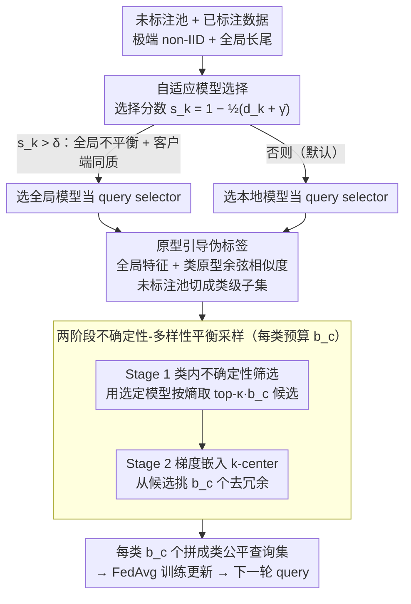

# Federated Active Learning Under Extreme Non-IID and Global Class Imbalance

**会议**: CVPR 2026  
**arXiv**: [2603.10341](https://arxiv.org/abs/2603.10341)  
**代码**: [GitHub](https://github.com/chenchenzong/FairFAL)  
**领域**: AI安全  
**关键词**: 联邦学习, 主动学习, non-IID, 类别不平衡, query selection, class-fair sampling, 原型引导

## 一句话总结

系统分析全局类不平衡与客户端异构性对联邦主动学习中 query model 选择的影响，归纳出3个核心 Observation，据此提出 FairFAL——自适应选择 query model + 原型引导伪标签 + 两阶段不确定性-多样性平衡采样的类公平 FAL 框架，在5个基准数据集上一致超越所有基线。

## 研究背景与动机

- **领域现状**：联邦学习（FL）在不共享原始数据的前提下实现协作训练，主动学习（AL）通过选择性标注降低标注成本。联邦主动学习（FAL）将两者结合——去中心化的客户端在隐私约束下协作识别最有价值的待标注样本。这在医疗影像、自动驾驶等标注昂贵且数据隐私敏感的领域尤为重要。
- **现有痛点**：已有FAL研究在三方面存在盲区：(1) 将客户端异构性仅视为数据划分问题，隐含假设全局类分布大致均衡；(2) 对于FAL中天然存在的两个query模型（全局聚合模型 vs 本地训练模型），缺乏系统性的选择准则；(3) 在全局长尾叠加极端non-IID的条件下，现有采样策略系统性偏向头部类别——LoGo、KAFAL、IFAL 等近期方法虽考虑了 non-IID，但未显式处理全局类不平衡。IFAL 在 CIFAR-100+$\rho=20$ 下甚至低于随机采样（26.82 vs. 27.44），充分说明问题的严重性。
- **核心矛盾**：FAL 中全局模型拥有更好的特征表示（跨客户端聚合），但在不确定性采样中常因过度平滑的预测而丧失判别力；本地模型对客户端特有决策边界更敏感，但在全局高度不平衡时其采样会反映长尾偏斜。两个模型的相对优劣取决于全局不平衡程度 $\rho$ 和客户端异构程度 $\alpha$ 的组合，无法简单固定。
- **本文目标**：在极端 non-IID（$\alpha=0.1$）和全局长尾分布（$\rho=20$）的挑战性设置下，设计一个能自适应选择 query 模型、显式促进类公平采样的 FAL 框架。
- **切入角度**：从系统性经验分析出发——在 CIFAR-10 上系统对比全局/本地模型在不同 $(\alpha, \rho)$ 组合下的采样行为（4种组合 × 2种策略 × 5种子），使用 AULC、Wilcoxon 检验、Hodges-Lehmann 效应量三重统计分析，归纳出3个 Observation，据此设计框架每个组件。
- **核心 idea**：类平衡采样能力（尤其是对少数类的获取）是 FAL 性能的最一致预测因子，比不确定性或多样性本身更重要。

## 方法详解

### 整体框架

FairFAL 想解决的是这样一个具体场景：客户端数据既极端 non-IID（$\alpha=0.1$），全局类分布又长尾（$\rho=20$），此时该用哪个模型来选样本、怎么选才不会把标注预算全花在头部类上。它的答案不是另设一个采样准则，而是先用一套系统经验分析（在 CIFAR-10 上对比全局 vs 本地模型在四种 $(\alpha,\rho)$ 组合下的采样行为）归纳出三条 Observation，再据此搭三个组件，挂在标准 FedAvg 上、在每轮 query 阶段依次跑：先**自适应模型选择**判断这一轮该信全局模型还是本地模型当 selector，再用**原型引导伪标签**把未标注池按类切成一个个候选子集，最后**两阶段平衡采样**在每个类内先挑信息量大的、再挑互不冗余的。query 完成后照常做联邦训练更新，进入下一轮。

### 关键设计

**1. 自适应模型选择：让每个客户端自己判断该信全局还是本地模型**

FAL 里天然有两个可用的 query selector——跨客户端聚合的全局模型、本地训练的本地模型——但现有工作要么固定用一个，要么没有系统准则。这篇的第一条 Observation 给出了判据：不确定性采样里本地模型通常更好（多个客户端各自的本地多样性聚合起来，恰好天然凑成一个全局平衡的查询集），唯一的例外是全局高度不平衡又叠加客户端同质时——这时本地查询会原样反映全局长尾偏斜，反而该退回全局模型。于是 FairFAL 把这个判断量化成两个标量。一是**全局类不平衡比 $\gamma_k$**：在第一轮 AL（标注数据是随机采的、近似 IID）时给每个客户端上采样出一个类平衡子集 $\mathcal{B}^{(k)}$，用全局模型预测得 softmax 先验 $\hat{\pi}_g^{(k)}$，取 $\gamma_k = \min_c \hat{\pi}_{g,c} / \max_c \hat{\pi}_{g,c} \in (0,1]$（越接近 1 越平衡），服务器把各客户端的 $\gamma_k$ 平均成 $\bar{\gamma}$ 后固定——只上传一个标量，不泄露分布。二是**本地-全局散度 $d_k$**，每轮更新，衡量本地模型和全局模型在同一平衡子集上的预测差多远：

$$d_k = \frac{1}{C}\sum_c \frac{|\hat{\pi}_{g,c} - \hat{\pi}_{\ell,c}^{(k)}|}{\hat{\pi}_{g,c} + \hat{\pi}_{\ell,c}^{(k)}} \in [0,1]$$

两者合成选择分数 $s_k = 1 - \tfrac{1}{2}(d_k + \bar{\gamma})$，当 $s_k > \delta = 0.75$（全局不平衡严重 + 客户端同质）就用全局模型、否则用本地模型——正好对应 Observation 1 的那个例外条件。消融里这个自适应选择 $\mathcal{M}^{(k)}$ 始终压过它的对立选项 $\tilde{\mathcal{M}}^{(k)}$（59.33 vs. 58.49），且换阈值 $\delta$ 几乎不动（0.65–0.85 内波动 < 0.5%），说明判据本身稳。

**2. 原型引导伪标签：在特征空间里给未标注样本分类，绕开长尾分类头的偏移**

要做类平衡采样，先得知道每个未标注样本"算哪一类"。但长尾场景下分类器的决策边界本身就偏向头部类，直接拿 logit 来分会把尾部样本误判进头部。所以这里不用分类头，改用全局模型倒数第二层的特征提取器 $\phi^g(\cdot)$ 提 L2 归一化特征 $\mathbf{z}_i^{(k)}$，对每个类 $c$ 用其标注样本的特征均值算出原型 $\boldsymbol{\mu}_c^{(k)}$，再按余弦相似度给未标注样本派伪标签 $\hat{y}^{(k)}(x) = \arg\max_c \langle \mathbf{z}^{(k)}(x), \boldsymbol{\mu}_c^{(k)} \rangle$，从而把未标注池切成类级子集 $\tilde{\mathcal{D}}_{U,c}^{(k)}$。之所以用全局模型而非本地模型来提特征，是 Observation 3（全局模型特征质量更优）和 Observation 2（类平衡采样与性能高度对齐）共同支撑的——消融里全局原型确实优于本地原型（59.95 vs. 59.14），全局模型在特征空间给出的类分离更干净，即便它的分类头有偏。

**3. 两阶段不确定性-多样性平衡采样：先保信息量、再去冗余**

有了类级候选池，每类分到一个均匀预算 $b_c$，但若直接在每类里挑熵最高的 $b_c$ 个，会踩两个坑：高不确定性样本往往挤在特征空间的狭窄区域，选出来彼此高度冗余。FairFAL 把它拆成两步。**Stage 1（类内不确定性筛选）**：用自适应选出的 query model 算熵，每类取 top-$\kappa \cdot b_c$ 个最不确定的样本，组成一个过完备候选池 $\mathcal{H}_c^{(k)}$（$\kappa = 4$，先把"太安全、没信息量"的样本排掉，但故意多留一倍候选给下一步挑）。**Stage 2（梯度嵌入空间 $k$-center）**：用全局模型给每个候选算梯度嵌入 $\mathbf{g}^{(k)}(x) = \psi(x; \phi^g, f^g)$（分类损失对全局分类器参数的梯度），以已标注样本为锚点做贪心 $k$-center，从 $\mathcal{H}_c^{(k)}$ 里挑出 $b_c$ 个、让它们最大化覆盖、半径最小。先信息量后多样性的顺序，保证选出来的既有学习价值又互补。$\kappa$ 给的候选多少不敏感，消融里 $\kappa=2/3/4$ 差异 < 0.3%。

### 一个完整示例：一个客户端在某一轮 query 里怎么走

> ⚠️ 以下具体数字为示意流程，便于理解组件如何串起来；精确取值以原文为准。

设某客户端这一轮要给 CIFAR-10 标 $b$ 个样本（10 类、每类均匀预算 $b_c = b/10$）。第一步算出它的 $s_k$：若它数据同质、且全局长尾严重使 $\bar{\gamma}$ 偏小，得到 $s_k = 0.8 > \delta$，于是这轮用**全局模型**当 selector；否则退回本地模型。第二步用全局特征给未标注池里的每个样本派伪标签，把池子切成 10 个类级子集——长尾下尾部类子集可能只凑出几十个候选，但至少不会因 logit 偏移被并进头部类。第三步在每个类子集里：Stage 1 先按熵取 top-$4 b_c$ 个候选（比如某尾部类只剩 $4 b_c$ 个就全留），Stage 2 再在梯度嵌入空间用 $k$-center 从这 $4b_c$ 个里挑 $b_c$ 个互不冗余的。十类各挑 $b_c$ 个拼起来正好 $b$ 个、且每类配额相等——这就是"类公平"落到实处的地方：头部类不会因为样本多、不确定性高就挤占尾部类的预算。

### 损失函数/训练策略

标准 FedAvg 框架：100 通信轮，每客户端 5 本地 epoch。4 层 CNN 骨干，SGD（momentum=0.9，weight decay=1e-5，batch size=64），学习率 0.01，75 轮后衰减 10x。FAL 进行 9 轮 query，首轮随机标注 5%，后续每轮 query 5%。10 个客户端，Dirichlet 划分（$\alpha = 0.1$ / $\alpha = 100$），全局不平衡比 $\rho = 20$。所有实验 5 个随机种子取均值。

## 实验关键数据

### 主实验

**自然图像数据集（$\alpha = 0.1$, $\rho = 20$，最终轮测试准确率 %）**：

| 方法 | 类型 | FMNIST | CIFAR-10 | CIFAR-100 |
|------|------|--------|----------|-----------|
| Random | 基线 | 85.60 | 55.70 | 27.44 |
| Entropy | 不确定性 | 86.28 | 57.18 | 27.44 |
| BADGE | 混合 | 86.65 | 58.20 | 27.39 |
| Coreset | 多样性 | 86.15 | 57.63 | 27.81 |
| KAFAL | FAL | 87.05 | 60.01 | 27.84 |
| LoGo | FAL | 86.98 | 59.68 | 27.95 |
| IFAL | FAL | 86.80 | 57.51 | 26.82 |
| **FairFAL** | **FAL** | **87.37** | **60.44** | **29.20** |

**医学数据集（$\alpha = 0.1$，自然长尾分布）**：

| 方法 | OctMNIST | DermaMNIST |
|------|----------|------------|
| Random | 68.30 | 72.32 |
| KAFAL | 70.40 | 73.27 |
| LoGo | 70.00 | 73.62 |
| IFAL | 68.40 | 72.97 |
| **FairFAL** | **72.80** | **73.77** |

### 消融实验

**组件逐步添加（CIFAR-10，准确率 %）**：

| 配置 | ($\alpha$=0.1, $\rho$=20) | ($\alpha$=100, $\rho$=20) |
|------|---------------------------|--------------------------|
| 仅模型选择 $\mathcal{M}^{(k)}$ | 59.33 | 63.65 |
| 对立模型 $\tilde{\mathcal{M}}^{(k)}$ | 58.49 | 61.89 |
| + 本地原型 | 59.14 | 63.39 |
| + 全局原型 | 59.95 | 64.02 |
| + 两阶段 $\kappa=2$ | 60.61 | 64.60 |
| + 两阶段 $\kappa=3$ | 60.38 | 64.58 |
| **+ 两阶段 $\kappa=4$ (Final)** | **60.44** | **64.57** |
| + 两阶段 $\kappa=5$ | 60.28 | 64.17 |

**全局/本地 query selector 统计分析（Hodges-Lehmann 效应量，百分点 pp）**：

| ($\alpha$, $\rho$) | Entropy 胜者 | Entropy HL (pp) | Coreset 胜者 | Coreset HL (pp) |
|-----|---------|--------|---------|--------|
| (0.1, 1) | Local | 201 | Global | 28 |
| (100, 1) | Local | 50 | Global | 21 |
| (0.1, 20) | Local | 66 | Global | 50 |
| (100, 20) | **Global** | **106** | **Global** | **92** |

### 关键发现

- **自适应模型选择有效**：$\mathcal{M}^{(k)}$ 始终优于对立选项（高异构 +0.84，近同构 +1.76）
- **全局原型 > 本地原型**（59.95 vs. 59.14）：全局模型在特征空间提供更干净的类分离
- **方法对 $\kappa$ 不敏感**（$\kappa=2/3/4$ 差异 < 0.3%），对 $\delta$ 也不敏感（0.65-0.85 范围 < 0.5%）
- **FL 框架无关**：在 FedProx 和 SCAFFOLD 下也一致最优
- **优势随任务难度增大而扩大**（FMNIST +0.32 → CIFAR-100 +1.25）
- **IFAL 在 CIFAR-100 低于 Random**（26.82 vs. 27.44）——无类平衡机制的方法在复杂长尾场景完全失效
- **Observation 2 的可视化**：全局-本地模型的少数类累计采样比例与最终准确率高度对齐，差距在少数类采样分化后稳定

## 亮点与洞察

- 核心洞察极为清晰且具有普遍性：类平衡采样能力是 FAL 中比不确定性或多样性更一致的性能预测因子
- 三个 Observation 的推导具有教育意义：(1) 不确定性采样中本地模型通常优于全局（除非全局高度不平衡+客户端同质）；(2) 类平衡采样与最终性能高度对齐（因果方向清晰）；(3) 多样性采样中全局模型的特征质量始终更优
- 原型引导伪标签绕过了长尾分类器决策边界偏移——在特征空间做类分配避免 logit 偏移
- 隐私保护设计考虑周全——客户端仅上传标量 $\gamma_k$，所有估计基于本地标注数据
- 统计分析方法（AULC + Wilcoxon 检验 + Hodges-Lehmann 效应量）为 Observation 提供了严格的统计支撑，而非仅靠均值比较

## 局限与展望

- 自适应选择是硬切换（$s_k > \delta$ 全局，否则本地），未尝试软混合——如对两个模型的 query 结果进行加权融合
- 均匀预算分配（每类 $b_c$ 相同）在极端长尾下可能非最优——可考虑按类稀缺程度动态分配更多预算给尾部类
- 仅在图像分类任务上验证（4层CNN），对目标检测、分割等复杂任务和更深骨干（ResNet-50、ViT）的适用性未知
- $\bar{\gamma}$ 仅第一轮估计后固定，不随 query 进程更新——后续轮次中全局分布因主动选择而改变
- 假设第一轮 query 是随机的以保证 IID 近似——实际系统中初始标注可能已有偏斜
- 未与基于生成模型的数据增强方案（解决类不平衡的另一路线）比较

## 相关工作与启发

- **vs LoGo (CVPR'23)**：先本地聚类再全局不确定性打分——两阶段但未显式考虑类平衡；FairFAL 通过原型伪标签显式保证每类采样
- **vs KAFAL (ICCV'23)**：利用全局-本地预测差异识别"知识不一致"样本——但差异大不等于少数类；FairFAL 增加类感知层
- **vs IFAL**：无类平衡机制在 CIFAR-100+$\rho=20$ 下低于 Random，是最直接的反面证据
- 原型学习从 few-shot 和对比学习引入到 FAL 的类感知采样——FL 的全局模型是天然优质特征提取器，即使分类头有偏
- 从 AL 到 FAL 的核心挑战不只是隐私约束，更是"双模型选择 + 全局长尾"的复合难题

## 评分

- 新颖性: ⭐⭐⭐⭐ 从系统性经验分析出发设计框架，每个组件都有清晰的 Observation 对应，方法论值得学习
- 实验充分度: ⭐⭐⭐⭐⭐ 5个数据集、11个基线、详尽消融（模型选择/原型质量/κ/δ/不确定性度量/FL框架/客户端数）
- 写作质量: ⭐⭐⭐⭐⭐ Observation-driven 结构清晰，统计分析严谨，每个设计选择都有实验支撑
- 价值: ⭐⭐⭐⭐ 对 FAL 社区有直接指导价值，核心洞察（类平衡 > 不确定性/多样性）具有普遍意义

<!-- RELATED:START -->

## 相关论文

- [\[CVPR 2026\] FedDAP: Domain-Aware Prototype Learning for Federated Learning under Domain Shift](feddap_domain-aware_prototype_learning_for_federated_learning_under_domain_shift.md)
- [\[CVPR 2025\] Geometric Knowledge-Guided Localized Global Distribution Alignment for Federated Learning](../../CVPR2025/ai_safety/geometric_knowledge-guided_localized_global_distribution_alignment_for_federated.md)
- [\[CVPR 2026\] FedAFD: Multimodal Federated Learning via Adversarial Fusion and Distillation](fedafd_multimodal_federated_learning_via_adversarial_fusion_and_distillation.md)
- [\[CVPR 2026\] Domain-Skewed Federated Learning with Feature Decoupling and Calibration](domain-skewed_federated_learning_with_feature_decoupling_and_calibration.md)
- [\[ICML 2026\] Active Continual Learning with Metaplastic Binary Bayesian Neural Networks](../../ICML2026/ai_safety/active_continual_learning_with_metaplastic_binary_bayesian_neural_networks.md)

<!-- RELATED:END -->
