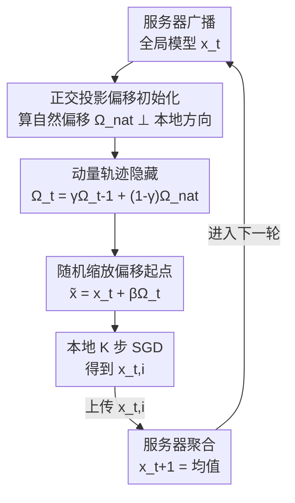

# FedMOP: Achieving Enhanced Privacy and Performance in Federated Learning via Momentum Orthogonal Projection

**会议**: CVPR 2026  
**论文**: [CVF Open Access](https://openaccess.thecvf.com/content/CVPR2026/html/Zhao_FedMOP_Achieving_Enhanced_Privacy_and_Performance_in_Federated_Learning_via_CVPR_2026_paper.html)  
**代码**: https://github.com/zyl123456aB/FedMOP  
**领域**: AI安全 / 联邦学习隐私  
**关键词**: 梯度泄露攻击, 联邦学习, 正交投影, 动量隐藏, 隐私-性能权衡

## 一句话总结
FedMOP 在每个客户端本地训练**开始前**给初始模型加一个"动量演化的正交偏移"——正交分量抵消 non-IID 漂移提升性能，动量演化让偏移向量在攻击者眼里变成 $(d+t)$ 维不可解的逆问题来保护隐私，从而第一次让"更强隐私"和"更高精度"同时成立，而非互相牺牲。

## 研究背景与动机
**领域现状**：联邦学习（FL）让多个客户端只上传梯度/模型更新、不共享原始数据来协同训练。但梯度泄露攻击（Gradient Leakage Attack, GLA）证明：恶意服务器可以通过让一张"假图像"的合成梯度去匹配观测到的真实梯度 $\min_z \lVert \nabla F_i(x_t,z) - g_{t,i} \rVert^2$，反推出客户端的私有训练样本。这在医疗、金融等场景是严重风险。

**现有痛点**：主流防御——差分隐私（注高斯噪声）、梯度压缩、安全聚合——全都靠"破坏梯度信息"来换隐私，代价是精度下降、收敛变慢或巨大的加密开销。同时标准 FL 在 non-IID 数据上本来就有 local drift（异质分布让本地更新偏离全局最优）导致收敛慢，而现有加速方法（FedProx、Scaffold 等）只管性能、不管隐私。于是隐私和性能看起来是**天生对立**的。

**核心矛盾**：几乎所有防御都在"梯度/训练过程"上动刀，这必然损害用于学习的有效信息。作者的关键洞察是：能不能**不碰训练过程本身**，只动每个客户端的"训练起点"？

**本文目标**：找到一个施加在初始模型上的偏移量，让它在一个维度上携带全局统计信息（修正漂移→提升性能），在另一个"正交"维度上对攻击者不可计算（→保护隐私），两个目标互不干扰甚至互相增益。

**核心 idea**：用 **gradient orthogonal projection** 构造一个垂直于本地训练方向的偏移（不打扰梯度下降但能纠偏），再用 **momentum-based trajectory hiding** 把这个本来"服务器可算"的偏移演化成一条带私有随机初值、随机混合系数的不可逆轨迹——"用正交方向放性能、用动量演化藏隐私"。

## 方法详解

### 整体框架
FedMOP 不改 FedAvg 的通信协议（客户端仍只上传训练后的模型 $x_{t,i}$），只在每个客户端**收到全局模型 $x_t$ 之后、开始 SGD 之前**插入一步"偏移初始化"：把起点从 $x_t$ 挪到 $\tilde{x}_{t,i} = x_t + \beta_{t,i}\Omega_{t,i}$，其中 $\Omega_{t,i}$ 是本文的核心——一个**正交 + 动量演化**的偏移向量，$\beta_{t,i}$ 是随机缩放。

整条 pipeline 每轮如下：服务器广播 $x_t$ → 客户端用正交投影算出"自然偏移" $\Omega^{nat}_{t,i}$（纠漂移）→ 用动量把它和上一轮私有状态混合得到 $\Omega_{t,i}$（藏隐私）→ 采样随机 $\beta_{t,i}$ 得到偏移起点 → 本地跑 $K$ 步 SGD → 上传 $x_{t,i}$ → 服务器平均聚合。其中私有随机初值 $\Omega_{0,i}$ 和所有历史系数 $\{\gamma_{k,i}\}$ **永不上传**、只在客户端本地维护一份模型大小的持久状态。

### 关键设计

**1. 正交投影偏移初始化：纠正 non-IID 漂移但不干扰本地梯度下降**

痛点很具体：non-IID 下客户端模型会偏离全局最优（local drift），但如果你直接给起点加一个携带全局信息的偏移，它会"顶撞"本地梯度方向、破坏收敛。作者的做法是把偏移**投影到本地更新方向的正交补空间**。当客户端连续两轮参与时，自然偏移定义为

$$\Omega^{nat}_{t,i} = (x_t - x_{t-1}) - \Pi_{t-1,i}\cdot(x_{t-1,i}-x_{t-1}),\quad \Pi_{t-1,i}=\frac{\langle x_t-x_{t-1},\, x_{t-1,i}-x_{t-1}\rangle}{\lVert x_{t-1,i}-x_{t-1}\rVert^2}.$$

这里 $\Pi\cdot(x_{t-1,i}-x_{t-1})$ 是把"全局更新" $(x_t-x_{t-1})$ 沿"本地更新方向"的投影分量，减掉它后剩下的 $\Omega^{nat}_{t,i}\perp(x_{t-1,i}-x_{t-1})$。正交性带来一个关键好处：**偏移只调整起点、不改变本地训练动力学**，因此可以放心地"激进放大"偏移（大 $\beta$）来加速纠偏而不损害收敛。对于不连续参与（上次在更早的 $r_i<t-1$ 轮），改用平均全局更新 $\frac{x_t-x_{r_i}}{t-r_i}$ 替换 $(x_t-x_{t-1})$ 保持行为一致。这一步只解决"性能"，但它本身有致命的隐私漏洞——见下一个设计。

**2. 动量轨迹隐藏：把"服务器可算"的偏移变成 $(d+t)$ 维不可逆轨迹**

漏洞在于：$\Omega^{nat}_{t,i}$ 完全由观测到的模型 $\{x_{t-1},x_t,x_{t-1,i}\}$ 算出，服务器自己就能复现。此时唯一未知的只有 1 维缩放因子 $\beta\sim\mathcal{N}(0.5,0.1^2)$，攻击者只要**枚举约 100 个候选 $\beta$**、对每个解一次梯度匹配 $\min_z\lVert\nabla F_i(x_t+\beta\Omega^{nat}_{t,i},z)-g_{t,i}\rVert^2$，就能暴力破解。1 维搜索空间太小，等于没防。

作者用**动量演化**把这个可算偏移变成不可算的私有轨迹：

$$\Omega_{t,i}=\begin{cases}\mathcal{N}(0,\sigma_0^2 I_d) & t=0\\ \gamma_{t,i}\,\Omega_{t-1,i}+(1-\gamma_{t,i})\,\Omega^{nat}_{t,i} & t>0\end{cases}$$

其中初值 $\Omega_{0,i}\sim\mathcal{N}(0,\sigma_0^2 I_d)$ 由客户端私有生成、永不传输，混合系数 $\gamma_{t,i}\sim\mathcal{N}(\bar\gamma,\sigma_\gamma^2)$ 截断到 $[0.8,0.95]$、每轮独立采样且保密。递归展开后

$$\Omega_{t,i}=\Big(\prod_{k=1}^{t}\gamma_{k,i}\Big)\Omega_{0,i}+\sum_{j=1}^{t}\Big(\prod_{k=j+1}^{t}\gamma_{k,i}\Big)(1-\gamma_{j,i})\,\Omega^{nat}_{j,i}.$$

要重建它，诚实但好奇的服务器必须同时反推 $\Omega_{0,i}\in\mathbb{R}^d$（$d\approx10^7$）和全部历史系数 $\{\gamma_{1,i},\dots,\gamma_{t,i}\}$，共 $(d+t)$ 个未知数，而从 $t$ 个观测模型只能得到 $\ll(d+t)$ 个有效约束、且是间接非线性的——这是一个**根本欠定**的逆问题，离散化后暴力搜索复杂度 $O(N^{d+t})$，计算上不可行。妙处在于：随机性不是"加噪声破坏信息"，偏移仍是确定性轨迹、能精确纠漂移，只是攻击者**算不出**它而已，所以隐私和性能不冲突。

**3. 收敛与隐私的协同（动量同时增益两端）**

这一步把前两个机制的"互不干扰"升级为"互相增益"。动量项 $\gamma\Omega_{t-1,i}$ 等价于对历史偏移做指数加权平均，对有效偏移方向做**方差缩减**（类似 momentum SGD），所以收敛更快；同时训练越久、未知系数越多，攻击者的搜索空间**随训练时长指数膨胀**，隐私越强。理论上作者证明了收敛保持：在标准假设下取 $\eta=\Theta(\sqrt{M/(KT)})$ 时

$$\min_t \mathbb{E}\lVert\nabla f(x_t)\rVert^2 = O\!\Big(\frac{1}{K^2T^2}\Big)+O(\sigma_0^2\bar\gamma^2 T)+O(\sigma_\gamma^2 T),$$

主项 $O(1/(K^2T^2))$ 优于 vanilla FedAvg 的 $O(1/(KT))$，动量引入的额外两项在 $\sigma_0,\sigma_\gamma$ 取小时渐近消失。⚠️ 理论常数项与证明细节以原文附录为准。

### 损失函数 / 训练策略
不改变本地训练目标（仍是标准 SGD 最小化本地经验风险），改动只在初始化。默认超参：$\bar\gamma=0.9,\ \sigma_\gamma=0.02,\ \sigma_0=10^{-4},\ \bar\beta=0.5,\ \sigma_\beta=0.1$；$\beta_{t,i}$ 截断到 $[0.2,0.95]$。通信量与 FedAvg 完全相同，仅额外每客户端存一份模型大小的动量状态 $\Omega_{t,i}$。

## 实验关键数据

数据集 CIFAR-10/100、Tiny-ImageNet，ResNet-18，100 客户端，Dirichlet 划分（D1: $\alpha=0.3$ 中度异质；D2: $\alpha=0.05$ 高度异质），full / 40% / 20% 三种参与率。

### 主实验

**防御 GLA（Table 2，batch=1 单图场景）**：MSE/FMSE 越高、PSNR 越低 = 防御越强（攻击者重建越差）。

| 防御方法 | 攻击 | MSE | PSNR | LPIPS |
|---------|------|-----|------|-------|
| OUTPOST（次优） | csDLG | 0.46 | 15.42 | 0.33 |
| **FedMOP** | csDLG | **0.85** | **7.43** | **0.71** |
| OUTPOST（次优） | FGLA | 0.11 | 20.92 | 0.21 |
| **FedMOP** | FGLA | **0.98** | **5.18** | **0.82** |

FedMOP 把重建 MSE 从次优的 ~0.11–0.46 拉到 0.85–0.98，PSNR 压到 5–7（攻击者基本只能还原出噪声），论文称隐私保护比现有防御强 5–10×。

**精度（Table 3，top-1 acc %，D1）**：FedMOP 在全部数据集/参与率上均为最优。

| 方法 | CIFAR-10 (full) | CIFAR-100 (full) | Tiny-ImageNet (full) |
|------|------|------|------|
| FedAvg | 57.85 | 31.61 | 23.26 |
| HierFed（次优） | 63.54 | 39.23 | 28.47 |
| **FedMOP** | **64.31** | **42.07** | **30.28** |

在异质最强、最难的 CIFAR-100 上比次优 HierFed 高约 2.8%，整体收敛速度也快 1.5–2×（Fig. 4 收敛曲线）。

### 消融实验（Table 4，CIFAR-10；MSE 越高隐私越好）

| 配置 | MSE↑ | Acc(%)↑ | Rounds↓ |
|------|------|---------|---------|
| FedAvg（baseline） | 0.02 | 68.3 | 850 |
| + 正交投影 | 0.08 | 70.4 | 780 |
| + 随机 $\beta$（无动量） | 0.31 | 70.2 | 790 |
| **+ 动量（完整 FedMOP）** | **0.85** | **72.7** | **760** |

### 关键发现
- **动量是隐私的决定性来源**：只加正交投影 MSE 仅 0.08（几乎不防），加随机 $\beta$ 也只到 0.31（1 维可暴力破解），唯有加动量演化才跳到 0.85——印证了"把 1 维搜索空间炸成 $(d+t)$ 维"的设计是隐私的真正命脉。
- **正交投影主要贡献性能**：从 baseline 加上它，Acc 68.3→70.4、轮数 850→780，验证了"正交偏移纠 drift 且不伤收敛"。
- **隐私-性能确实协同而非对立**：完整模型同时拿到最高 MSE、最高 Acc、最少轮数，三个指标一起变好，这是本文最强的卖点。
- **超参不敏感**：$\bar\gamma$ 在 0.80–0.95、$\sigma_\gamma$ 在 0.005–0.05、$\sigma_0$ 在 $10^{-5}$–$10^{-3}$ 范围内 Acc 都稳定在 ~72%，增大 $\sigma_\gamma$ 能略增隐私（MSE 0.72→0.93）但轻微掉精度，存在可调的隐私-精度旋钮。

## 亮点与洞察
- **"在初始化上做文章"是个巧妙的切入点**：绕开了"动梯度必伤性能"的死结，把隐私和性能拆到正交的两个维度上分别处理，避免了正面 trade-off。
- **用计算困难性而非信息破坏来保护隐私**：偏移仍是确定且有用的（精确纠漂移），只是对攻击者不可逆。这跟差分隐私"注噪声牺牲精度"是哲学上的反向，值得借鉴到其他"既要可用又要不可推断"的场景。
- **动量"一石二鸟"很优雅**：同一个 $\gamma$ 演化既做方差缩减加速收敛，又让攻击搜索空间随时间指数膨胀——把训练时长从"暴露更多梯度"的负担变成隐私的正资产。
- **零通信开销、即插即用**：协议与 FedAvg 完全兼容，只在客户端本地多存一个向量，落地成本极低，可叠加到现有 FL 系统上。

## 局限与展望
- **威胁模型限定为 honest-but-curious 服务器**：假设服务器遵守算法、只观测不篡改。面对主动恶意服务器（如下发恶意全局模型、或操纵聚合）是否仍安全，论文未充分讨论。⚠️
- **缺乏形式化隐私保证**：用"计算不可行的逆问题"论证安全，给的是计算困难性界而非 $(\epsilon,\delta)$-DP 那样的可证明隐私，难以和差分隐私在同一标尺上直接比较。
- **每客户端需持久存储一份模型大小的 $\Omega$ 状态**：对超大模型或海量客户端场景有额外存储成本，且不连续参与时轨迹的"断点续传"是否引入可利用的规律，值得进一步分析。
- **实验集中在图像分类 + ResNet-18**：在 NLP、检测/分割等其他任务和更大模型上的有效性与攻击鲁棒性尚待验证。

## 相关工作与启发
- **vs 差分隐私（DP）**：DP 靠裁剪+加噪获得 $(\epsilon,\delta)$ 保证，但噪声在异质数据上显著掉精度；FedMOP 不注噪声、用不可逆轨迹防御，在 Table 2 上 MSE/精度双优于 DP，但代价是没有 DP 那样的可证明隐私界。
- **vs CENSOR / Soteria / OUTPOST 等扰动类防御**：它们都在梯度或中间表示上做剪枝/扰动，本质仍在牺牲信息；FedMOP 把防御搬到"初始化"，训练梯度本身不被破坏，因此能同时提性能。
- **vs Scaffold / FedProx 等纠漂移方法**：这些只解决 non-IID 性能、完全不管隐私；FedMOP 的正交投影偏移可看作一种新的纠漂移手段，并额外用动量把它"武装"成隐私机制，是把两条独立研究线（GOP 纠漂移 + 隐私防御）首次拧到一起。

## 评分
- 新颖性: ⭐⭐⭐⭐⭐ "在初始化的正交维度上同时解隐私和性能"是少见且优雅的视角，动量把可算偏移变不可逆是真创新。
- 实验充分度: ⭐⭐⭐⭐ 三数据集、多参与率、攻击/收敛/精度三视角齐全，消融清晰；但威胁模型偏窄、缺更大模型与非视觉任务。
- 写作质量: ⭐⭐⭐⭐⭐ 动机—漏洞—修补的逻辑链顺畅，公式与算法表交代清楚，"协同而非对立"的主线贯穿始终。
- 价值: ⭐⭐⭐⭐⭐ 零通信开销、与 FedAvg 兼容、隐私性能双增，落地价值高，对隐私敏感的 FL 部署很有吸引力。

<!-- RELATED:START -->

## 相关论文

- [\[CVPR 2026\] FedDAP: Domain-Aware Prototype Learning for Federated Learning under Domain Shift](feddap_domain-aware_prototype_learning_for_federated_learning_under_domain_shift.md)
- [\[CVPR 2026\] FedAFD: Multimodal Federated Learning via Adversarial Fusion and Distillation](fedafd_multimodal_federated_learning_via_adversarial_fusion_and_distillation.md)
- [\[CVPR 2026\] Domain-Skewed Federated Learning with Feature Decoupling and Calibration](domain-skewed_federated_learning_with_feature_decoupling_and_calibration.md)
- [\[CVPR 2026\] ProxyFL: A Proxy-Guided Framework for Federated Semi-Supervised Learning](proxyfl_a_proxy-guided_framework_for_federated_semi-supervised_learning.md)
- [\[CVPR 2026\] FedRE: A Representation Entanglement Framework for Model-Heterogeneous Federated Learning](fedre_a_representation_entanglement_framework_for_model-heterogeneous_federated_.md)

<!-- RELATED:END -->
