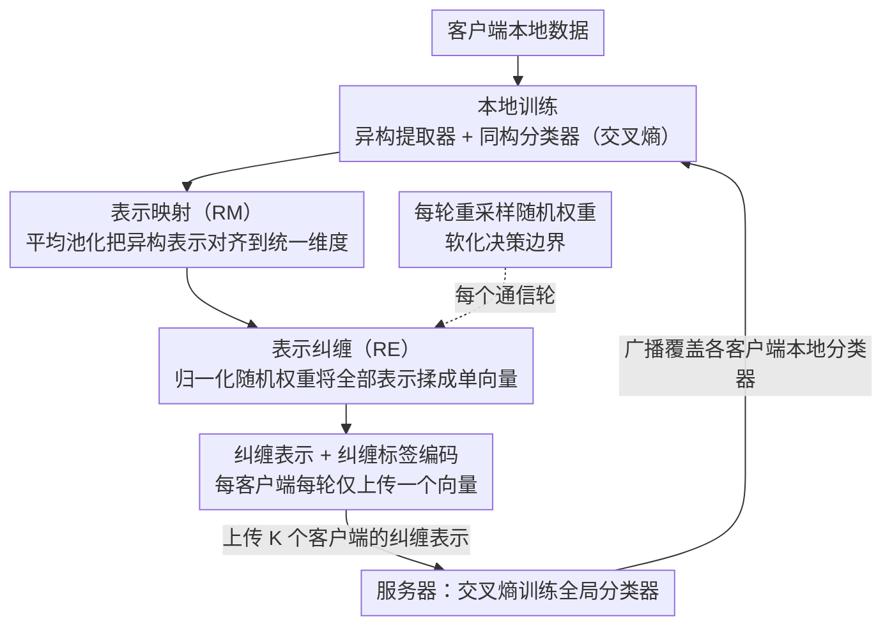

# FedRE: A Representation Entanglement Framework for Model-Heterogeneous Federated Learning

**会议**: CVPR 2026  
**arXiv**: [2511.22265](https://arxiv.org/abs/2511.22265)  
**代码**: [GitHub](https://github.com/AIResearch-Group/FedRE)  
**领域**: AI安全 / 联邦学习  
**关键词**: 联邦学习, 模型异构, 纠缠表示, 隐私保护, 通信效率

## 一句话总结

提出 FedRE 框架，通过"纠缠表示"（entangled representation）——将每个客户端的所有局部表示用归一化随机权重聚合为单一跨类别表示，实现模型异构联邦学习中性能、隐私保护和通信开销的三方平衡。

## 研究背景与动机

联邦学习（FL）使多个客户端在保护隐私的前提下协作训练模型。然而实际中，不同客户端的硬件和计算能力差异巨大，强制要求所有客户端使用同构模型架构是不现实的。这推动了**模型异构 FL** 的研究——客户端的表示提取器（representation extractor）可以不同，但分类器保持同构。

现有模型异构 FL 方法在客户端知识形式的选择上面临困境：
- **表示/logits/小模型**：能有效编码高层知识，但上传到服务器引入显著通信开销和隐私风险（可通过表示反演攻击重建原始样本）
- **分类器**：轻量但可能继承局部数据分布偏差
- **原型（prototype，即类别均值）**：轻量且降低隐私风险，但仅捕获类别级信息，类内变异性有限，且训练全局分类器时容易导致过于尖锐的决策边界

核心问题："对于模型异构 FL，是否存在更有效、隐私安全且轻量的客户端知识形式？"

## 方法详解

### 整体框架

FedRE 要解决的是模型异构联邦学习里"上传什么知识"的难题：上传原始表示性能好但又贵又危险，上传原型轻量却信息太薄、决策边界发硬。它的答案是把每个客户端的**所有**局部表示压成**一个**跨类别的"纠缠表示"，连同对应的"纠缠标签编码"一起上传，服务器只用这些纠缠表示来训练全局分类器。

一轮通信里数据这样流动：客户端先在本地数据上用交叉熵把自己的局部模型（异构的表示提取器 + 同构的分类器）训一遍；然后把本地表示纠缠成单个向量、配上软标签编码送往服务器；服务器拿各客户端送来的这一把纠缠表示更新全局分类器，再把分类器广播回去覆盖各客户端的本地分类器。由于每个客户端每轮只上传一个向量而非成千上万条表示，通信量和隐私暴露面被压到极低。

### 关键设计

**1. 表示映射（RM）：先把异构表示拉到同一维度**

不同客户端的提取器架构不同，输出的表示维度也对不齐，没法直接喂给同一个全局分类器。RM 就是一层把各家表示统一投到一致维度的操作。论文对比了平均池化（AP）、最大池化（MP）、全连接层（FC）三种做法，最终用最简单的 AP——它在 CIFAR-100 上 PRA 达到 46.36%，反而压过 MP（45.97%）和带额外参数的 FC（44.53%），说明这里不需要可学习的复杂映射，简单聚合就够。

**2. 表示纠缠（RE）：用随机权重把一整批表示揉成一个向量**

这是 FedRE 的核心。客户端不再逐条上传表示，而是用一组归一化随机权重 $w_i^k\in[0,1]$ 把本地所有表示加权求和成单个"纠缠表示"，同一组权重同步作用在 one-hot 标签上得到"纠缠标签编码"：

$$\widetilde{\mathbf{r}}_k = \sum_{i=1}^{|\mathcal{D}_k|} w_i^k\,\text{RM}[\mathbf{g}_k(\phi_k; \mathbf{x}_i^k)], \qquad \widetilde{\mathbf{y}}_k = \sum_{i=1}^{|\mathcal{D}_k|} w_i^k\,\mathbf{y}_i^k$$

表示和标签共用同一套权重，保证了二者语义对齐：纠缠向量混了哪些类、各占多少比重，标签编码里就写着对应的软分布。实际默认用的是**随机平均原型（RAP）**——先按类算出原型（类内表示均值），再用随机权重把这些原型聚成单一纠缠表示。消融显示在原型上做随机加权（RAP，46.36%）优于直接在原始表示上随机加权（RSR，40.41%），因为原型本身更干净、更具类别代表性。

**3. 每轮重采样随机权重：让决策边界变软**

如果权重固定不变，全局分类器每轮看到的纠缠表示几乎一样，等于在记忆某个固定的类别混合配置，容易把边界训得很尖。FedRE 让每个通信轮次都重新采样一组随机权重，于是每轮送上去的纠缠表示是不同的跨类别组合，标签编码也跟着变成不同的软监督信号——分类器被迫在各种类别混合下都给出合理预测，自然学不出对单一类别过度自信的尖锐边界。论文用一个合成 toy 实验直观对照了这一点：上传全部表示的 FedAllRep 边界最好（63.50%），上传单类原型的 FedGH 边界发尖（60.50%），而 FedRE 用平滑边界拿到 62.00%，逼近 FedAllRep 却没付出它的通信与隐私代价；而在该合成集上固定权重 vs 每轮重采样的差距高达 41.50% vs 62.00%，说明重采样不是锦上添花而是机制成立的关键。

**4. 隐私保护：单向量混合天然抗反演**

纠缠表示是多个样本、多个类别信息的加权混合体，攻击者拿到它做表示反演时，无法把任何单一样本干净地解出来；加上每个客户端整轮只暴露一个向量，可供攻击的信息面被进一步压缩。这套隐私性不靠额外的加噪或加密，而是纠缠本身的副产品——这也是它和"逐条上传表示"在隐私上拉开差距的根本原因（反演攻击下 FedRE 的 PSNR 9.66 < 原型 10.25 < 原始表示 12.89，越低越难重建）。

### 损失函数 / 训练策略

客户端侧用普通交叉熵 $\mathcal{L}_{ce}$ 训练本地模型；服务器侧同样用交叉熵，但把各客户端的纠缠表示当成训练样本来更新全局分类器 $\omega$：

$$\min_\omega \sum_{k=1}^K \mathcal{L}_{ce}\big[f(\omega; \widetilde{\mathbf{r}}_k),\, \widetilde{\mathbf{y}}_k\big]$$

纠缠操作本身只是加权求和，复杂度 $\mathcal{O}(n(d+C))$，不引入任何额外梯度计算，CIFAR-10 上每轮只多 0.09 秒（5.69s → 5.78s）。实验配置为 10 个客户端、SGD 优化器、100 个通信轮次，单卡 NVIDIA A800。

## 实验关键数据

### 主实验

| 方法 | CIFAR-10 (PRA) | CIFAR-100 (PRA) | TinyImageNet (PRA) | CIFAR-10 (PAT) | CIFAR-100 (PAT) | TinyImageNet (PAT) | 平均 |
|------|---------------|----------------|-------------------|---------------|----------------|-------------------|------|
| FedProto | 78.36 | 35.00 | 18.16 | 83.81 | 56.72 | 29.61 | 50.28 |
| FedGH | 78.66 | 40.91 | 25.04 | 85.43 | 58.07 | 31.98 | 53.35 |
| FedTGP | 81.32 | 35.89 | 28.70 | 84.68 | 54.67 | 35.64 | 53.48 |
| Local | 81.20 | 41.57 | 25.81 | 84.68 | 57.96 | 33.02 | 54.04 |
| **FedRE** | **82.60** | **46.36** | **30.48** | **86.20** | **62.56** | **38.52** | **57.79** |

FedRE 在所有场景中均超越基线，TinyImageNet PAT 设置下超越 FedGH 6.54%、超越 FedKD 6.79%。

### 消融实验

**通信开销（CIFAR-100，标量数 ×10³）**：

| 指标 | LG-FedAvg | FedGH | FedKD | FedGen | FedProto | FedMRL | FedRE |
|------|-----------|-------|-------|--------|----------|--------|-------|
| 上传 | 513.00 | 257.02 | 4234.28 | 9247.08 | 257.02 | 8863.08 | **5.12** |
| 广播 | 513.00 | 512.00 | 4234.28 | 513.00 | 512.00 | 8863.08 | 513.00 |

FedRE 的上传开销仅 5.12K 标量，不到 FedProto 的 2%，比 FedMRL 低 1700 倍+。

**隐私保护（表示反演攻击，TinyImageNet）**：

| 知识形式 | PSNR ↓ | MSE ↑ |
|----------|--------|-------|
| 表示（FedAllRep） | 12.89 | 4514.91 |
| 原型（FedGH） | 10.25 | 6992.04 |
| 纠缠表示（FedRE） | **9.66** | **7781.87** |

纠缠表示的 PSNR 最低、MSE 最高，重建图像无法识别任何信息。

**RE 机制对比（CIFAR-100 PRA）**：

| 机制 | RSR | VAR | RAR | RSP | VAP | RAP |
|------|-----|-----|-----|-----|-----|-----|
| 准确率 | 40.41 | 44.88 | 43.19 | 43.25 | 46.12 | **46.36** |

RAP（随机平均原型）最优，因为原型比原始表示更具代表性，随机权重比等权聚合更有效。

### 关键发现

1. **纠缠表示性能接近"上传所有表示"**：FedRE (30.48%) vs FedAllRep (31.20%)，但通信开销降低约 10 倍
2. **每轮重采样至关重要**：固定权重 vs 每轮重采样在 CIFAR-100 上分别为 45.84% vs 46.36%，合成数据集上差距更大（41.50% vs 62.00%）
3. RE 引入的额外训练开销可忽略：CIFAR-10 每轮仅增加 0.09 秒（5.69s → 5.78s）
4. 权重分布选择（均匀/拉普拉斯/高斯）对性能影响很小，框架具有灵活性
5. 在 100 客户端大规模场景（参与率 10/100 或 20/100）中，FedRE 仍保持最佳性能

## 亮点与洞察

- **纠缠表示**是一种非常优雅的设计：它同时解决了三个问题（性能、隐私、通信），而不是像现有方法那样在三者间做 trade-off
- 随机权重每轮重采样的思路类似数据增强中的随机性——通过引入训练多样性避免过拟合到特定权重配置
- 纠缠标签编码提供"跨类别软监督"的思路与 label smoothing 有异曲同工之妙，但这里的随机性更本质——不同轮次的标签编码完全不同
- 与 Mixup 的关键区别：FedRE 在每个客户端内聚合**所有**表示为单一向量（而非成对插值），服务的目标也完全不同

## 局限与展望

1. 缺乏严格的非凸收敛分析（作者也承认留作未来工作）
2. 当客户端数据极度不均衡时（如某客户端仅有 1-2 个类别），纠缠表示的信息量可能不足
3. 未评估在更大规模模型（如 LLM/ViT-L）上的效果
4. 全局分类器的架构需要所有客户端共享，限制了完全异构的灵活性
5. 随机权重的分布和采样策略可能有更优选择（当前实验显示均匀分布略优但差距甚微）

## 相关工作与启发

- 与 FedGH（基于原型训练全局分类器）最直接相关——FedRE 可以视为其自然进化，从单类别原型到跨类别纠缠表示
- 与 FedAvg 系列（参数聚合）正交——FedRE 因模型异构无法直接聚合参数，转而通过知识蒸馏思路解决
- 对联邦学习中隐私-效率-性能三角的思考具有启发性：好的客户端知识形式设计可以同时推动三个顶点
- 纠缠表示的思路可能扩展到其他场景：如联邦持续学习、联邦域适应等

## 评分

- 新颖性: ⭐⭐⭐⭐ （纠缠表示概念新颖，虽然与 Mixup 有相似性但动机和实现不同）
- 实验充分度: ⭐⭐⭐⭐⭐ （10 个问题的系统性分析、通信/隐私/性能三维评估、10 种异构架构）
- 写作质量: ⭐⭐⭐⭐ （Q&A 式实验结构清晰，toy 实验直观）
- 价值: ⭐⭐⭐⭐ （为模型异构 FL 提供了实用且优雅的解决方案）

<!-- RELATED:START -->

## 相关论文

- [\[CVPR 2026\] ProxyFL: A Proxy-Guided Framework for Federated Semi-Supervised Learning](proxyfl_a_proxy-guided_framework_for_federated_semi-supervised_learning.md)
- [\[CVPR 2026\] FedHarmony: Harmonizing Heterogeneous Label Correlations in Federated Multi-Label Learning](fedharmony_harmonizing_heterogeneous_label_correlations_in_federated_multi-label.md)
- [\[ICLR 2026\] Toward Enhancing Representation Learning in Federated Multi-Task Settings](../../ICLR2026/ai_safety/toward_enhancing_representation_learning_in_federated_multi-task_settings.md)
- [\[ECCV 2024\] Fisher Calibration for Backdoor-Robust Heterogeneous Federated Learning](../../ECCV2024/ai_safety/fisher_calibration_for_backdoor-robust_heterogeneous_federated_learning.md)
- [\[CVPR 2026\] Cross-modal Representation Learning for Diffusion-generated Image Detection](cross-modal_representation_learning_for_diffusion-generated_image_detection.md)

<!-- RELATED:END -->
