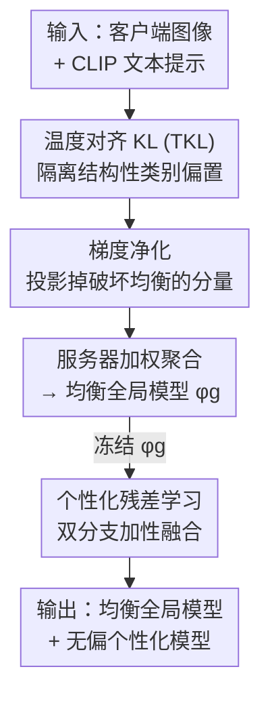

# Fine-Tuning Impairs the Balancedness of Foundation Models in Long-tailed Personalized Federated Learning

**会议**: CVPR 2026  
**arXiv**: [2605.02247](https://arxiv.org/abs/2605.02247)  
**代码**: https://github.com/shihaohou/FedPuReL (有)  
**领域**: 联邦学习 / 长尾学习 / 参数高效微调  
**关键词**: 个性化联邦学习, 长尾分布, CLIP, 梯度净化, 残差学习

## 一句话总结
本文先实证揭示「在长尾联邦场景里微调 CLIP 会破坏其天生的类别均衡性、甚至跌破 zero-shot」，再提出 FedPuReL：用 zero-shot 预测把本地梯度「净化」成不破坏均衡的方向来训一个均衡的全局模型，并把个性化重构成冻结全局模型之上的「残差修正」，从而在 8 个长尾数据集上的全局模型和个性化模型都超过现有 SOTA。

## 研究背景与动机
**领域现状**：基于基础模型（CLIP）的个性化联邦学习（PFL）正成为主流——客户端用参数高效微调（PEFT，如 prompt / LoRA / adapter）只更新少量参数，服务器聚合「全局可训练参数」做共享、再叠加「本地可训练参数」做个性化，既省通信又能适配各客户端的异构数据。

**现有痛点**：现实里数据往往**同时**是 non-IID 和长尾的（federated long-tailed, Fed-LT）：稀少的尾类样本零散分布在各客户端。作者实证发现两个被忽视的问题——(i) 直接微调会**侵蚀基础模型自带的类别均衡知识**，在严重长尾下全局模型的均衡性甚至低于原始 zero-shot 模型；(ii) 现有个性化技术通过「参数级 / 特征级融合」把这种偏置进一步**传染**给本地模型，让个性化模型也跟着偏向头类。即便用利用类别先验的 Logit Adjustment 也救不回 zero-shot 的均衡性。

**核心矛盾**：微调存在一个根本权衡——**任务适配 vs 保留 zero-shot 的均衡知识**。CLIP 在大规模多样数据上预训练得到了跨类的均衡，但适配到不均衡的下游分布时，这种均衡随训练轮次逐步瓦解，且头类被不对称地放大、尾类被牺牲。

**本文目标**：拆成两个子问题——I) 均衡性：怎样在 Fed-LT 里**利用而非丢失**基础模型的均衡知识，学到更均衡的全局模型？II) 个性化：怎样让客户端个性化**不继承全局偏置**？

**切入角度**：作者用两个量化指标刻画微调动态（见下文 TKL 与 Balancedness），观察到「预测越偏离 zero-shot、均衡性越差」呈强负相关，且头类精度升、尾类精度降。既然 zero-shot 预测本身是均衡的锚点，那就拿它来约束训练。

**核心 idea**：用 zero-shot 预测**净化**本地梯度（投影掉会破坏均衡的分量）维持一个均衡的全局模型，再把个性化建模成冻结全局模型之上的**加性残差修正**，把个性化与全局参数解耦。

## 方法详解

### 整体框架
FedPuReL 分两个阶段。**阶段一·全局均衡训练**：各客户端训练共享 PEFT 参数 $\boldsymbol{\phi}_g$，训练时用 zero-shot 预测做「温度对齐」后算出一个对齐梯度 $\mathbf{g}_{\text{align}}$，把任务梯度 $\mathbf{g}_{\text{task}}$ 中与之冲突的分量投影掉，得到「净化后的梯度」再更新——保证每一步更新都不偏离均衡锚点；服务器按样本量加权聚合这些共享参数。**阶段二·个性化残差学习**：冻结训好的全局参数 $\boldsymbol{\phi}_g$，每个客户端再学一组私有参数 $\boldsymbol{\phi}_k$，通过「全局分支 + 个性化分支」双路加性融合，让个性化只承担「相对全局的偏差修正」，不动全局的均衡表示。推理时全局模型只走全局分支，个性化模型把两分支 logits 相加。

### 关键设计

**1. 温度对齐 KL 散度（TKL）：把「结构性偏置」从「置信度提升」里剥离出来**

直接用标准 KL 衡量微调后预测与 zero-shot 的差异有个陷阱：微调即使在均衡数据上也会让预测分布移动，但这种移动是「置信度变高」（良性）而非「类别偏置」（恶性），标准 KL 把两者混在一起，无法专门盯住偏置。TKL 的做法是先把两个分布**对齐到同一个目标熵**再比较，从而中和掉置信度差异。具体地，定义温度 softmax $\sigma_\tau(\mathbf{a})=\mathrm{softmax}(\mathbf{a}/\tau)$ 和熵 $H(\mathbf{p})=-\sum_c p_c\log p_c$，取目标熵 $H^\star=\tfrac12[H(\sigma_1(\mathbf{l}))+H(\sigma_1(\mathbf{z}))]$，分别为微调 logits $\mathbf{l}$ 和 zero-shot logits $\mathbf{z}$ 反解出让其熵等于 $H^\star$ 的对齐温度 $\tau_a=H_a^{-1}(H^\star)$，再在对齐后的分布上算 KL：$\mathrm{TKL}(\mathbf{x})=D_{\mathrm{KL}}(\sigma_{\tau_f}(\mathbf{f})\,\|\,\sigma_{\tau_z}(\mathbf{z}))$。这样剩下的差异就只反映跨类的结构性偏置。正是用 TKL 才观察到「TKL 散度↑ ⇔ 均衡性↓」的强负相关，为后续净化提供了可靠的「偏离均衡」信号

**2. 梯度净化：让每一步更新都不破坏 zero-shot 的均衡知识**

有了 TKL，作者把「保持与 zero-shot 对齐」写成对齐损失 $\mathcal{L}_{\text{align}}=D_{\text{TKL}}(\sigma_{\tau_{zs}}(\mathbf{z})\,\|\,\sigma_{\tau_{ft}}(\mathbf{f}))$，其梯度 $\mathbf{g}_{\text{align}}=\nabla_{\boldsymbol{\phi}_g}\mathcal{L}_{\text{align}}$ 指向「保留均衡知识」的方向。痛点是普通的任务梯度 $\mathbf{g}_{\text{task}}$（交叉熵）常常与之冲突，硬更新就会把模型推离预训练锚点。净化的做法是检测冲突并投影：

$$\tilde{\mathbf{g}}_{\text{task}}=\begin{cases}\mathbf{g}_{\text{task}}, & \langle\mathbf{g}_{\text{task}},\mathbf{g}_{\text{align}}\rangle\ge 0\\[4pt] \mathbf{g}_{\text{task}}-\dfrac{\langle\mathbf{g}_{\text{task}},\mathbf{g}_{\text{align}}\rangle}{\|\mathbf{g}_{\text{align}}\|^2}\mathbf{g}_{\text{align}}, & \text{otherwise}\end{cases}$$

即当任务梯度与对齐梯度夹角为钝角（内积为负、二者在「拉扯」）时，把任务梯度里**反对齐**的分量减掉，只保留与均衡兼容的部分；不冲突时原样保留。作者还做了梯度动态分析：基线方法的两个梯度收敛到约 90°（高维随机向量天然近似正交），意味着任务优化完全无视 zero-shot 对齐、因而均衡退化；FedPuReL 则持续维持钝角，说明原始任务梯度确实在主动对抗均衡保持，而净化正好把这些冲突分量切掉。客户端用净化后的梯度本地更新，服务器再按 $\boldsymbol{\phi}_g^{(t+1)}\leftarrow\sum_{k\in\mathcal{S}_t}\frac{n_k}{\sum_j n_j}\boldsymbol{\phi}_g^{k,(t)}$ 加权聚合，得到均衡又适配任务的全局模型

**3. 残差个性化：把个性化变成冻结全局之上的「加性修正」，不继承全局偏置**

现有个性化在特征级 / 参数级融合全局与本地信息，问题是融合会**把全局的类别偏置直接搬进本地模型**。本文换个思路：先冻结训好的全局参数 $\boldsymbol{\phi}_g$ 当作不可变锚点，个性化只学一个**加性残差**。双分支结构里，全局分支给基线预测 $\mathbf{l}_G(\mathbf{x})=f(\mathbf{x};\boldsymbol{W},\boldsymbol{\phi}_g)$，个性化分支用客户端私有参数 $\boldsymbol{\phi}_k$ 给 $\mathbf{l}_P^k(\mathbf{x})=f(\mathbf{x};\boldsymbol{W},\boldsymbol{\phi}_k)$，最终预测在 logit 空间相加 $\mathbf{l}_{\text{final}}^k=\mathbf{l}_G+\mathbf{l}_P^k$。由于梯度只流经 $\boldsymbol{\phi}_k$、全局分支全程冻结，全局的均衡表示被完整保护下来；个性化分支只需捕捉「客户端相对全局的偏差」。这样个性化是「站在巨人肩上」——即便本地过拟合或分布漂移，冻结的全局分支也提供稳定锚点避免严重退化。附录的分支贡献分析印证了这个设计：从头类到尾类，个性化分支贡献递增、全局分支贡献递减，但即使尾类里个性化占主导，全局分支仍维持 20–25% 的贡献

### 损失函数 / 训练策略
个性化阶段优化复合损失：融合损失 $\mathcal{L}_{\text{fusion}}^k=\mathrm{CE}(y,\sigma(\mathbf{f}_G+\mathbf{f}_P^k))$ 优化两分支合并后的预测以保稳定，个性化损失 $\mathcal{L}_{\text{personal}}^k=\mathrm{CE}(y,\sigma(\mathbf{f}_P^k))$ 驱动私有参数专门化捕捉本地模式，总损失 $\mathcal{L}_{\text{total}}^k=(1-\lambda)\mathcal{L}_{\text{fusion}}^k+\lambda\mathcal{L}_{\text{personal}}^k$，$\lambda$ 控制权衡。实现上 backbone 用 CLIP ViT-B/16，prompt 长度 4 / LoRA rank 8，20 个客户端、Dirichlet $\alpha=1$、IF=100、100 轮通信、每轮随机选 40% 客户端、SGD 优化；默认 $\lambda=0.9$。

## 实验关键数据

### 主实验
ImageNet-LT 与 Places-LT 上，对 Prompt / LoRA / Adapter 三类 PEFT 基线（含叠加专门治长尾的 Fed-GraB），FedPuReL 在全局模型（GM）和个性化模型（PM）的总精度与尾类（Few）精度上都领先。以下取 Prompt-based 一组（GM/All 与 Few）：

| 数据集 | 模型 | 指标 | Zero-shot | PromptFolio | +Fed-GraB | FedPuReL | 提升 |
|--------|------|------|-----------|-------------|-----------|----------|------|
| ImageNet-LT | GM | All | 67.05 | 69.64 | 69.53 | **72.96** | ↑3.32 |
| ImageNet-LT | GM | Few | 66.65 | 47.02 | 52.83 | **66.70** | ↑8.34 |
| ImageNet-LT | PM | All | 66.68 | 67.65 | 68.14 | **70.12** | ↑1.98 |
| ImageNet-LT | PM | Few | 65.97 | 45.99 | 52.11 | **66.62** | ↑7.80 |
| Places-LT | GM | All | 35.55 | 40.55 | 41.99 | **43.88** | ↑1.89 |
| Places-LT | GM | Few | 40.31 | 31.58 | 30.82 | **39.06** | ↑7.48 |

最值得注意的现象：现有方法在头类（Many）涨点但尾类（Few）相比 zero-shot 大幅崩塌（PromptFolio 的 Few 从 66.65 跌到 47.02），FedPuReL 几乎守住了 zero-shot 的尾类精度（66.70），这正是「保留均衡知识」的直接体现。LoRA-based 一组在 ImageNet-LT PM/All 上 FedPuReL 达 70.55，比次优 +4.48。

CIFAR-100-LT 跨异构程度（Dirichlet $\alpha$）的鲁棒性（Prompt-based，GM/PM）：

| $\alpha$ | Zero-shot GM | PromptFolio+Fed-GraB GM | FedPuReL GM | FedPuReL PM | GM 提升 |
|----------|------|------|------|------|------|
| 0.1 | 64.82 | 64.97 | **68.88** | **77.72** | ↑3.91 |
| 0.5 | 64.82 | 65.43 | **69.05** | **74.97** | ↑3.62 |
| 1 | 64.82 | 65.14 | **69.77** | **73.37** | ↑4.63 |
| 5 | 64.82 | 66.23 | **70.54** | **73.71** | ↑4.31 |

跨所有异构程度都稳定领先，作者归因于梯度净化把本地更新锚在 zero-shot 上、防止异构本地分布导致的发散。

### 消融实验
TKL vs 标准 KL（CIFAR-100-LT，把净化模块里的 TKL 换成普通 KL）：

| 度量 | GM 精度 | PM 精度 | GM 均衡性 | PM 均衡性 |
|------|---------|---------|-----------|-----------|
| KL | 67.92 | 71.62 | 25.03 | 27.84 |
| TKL (ours) | **69.77** | **73.37** | **27.87** | **30.02** |

TKL 在精度和均衡性两个维度、全局与个性化两种设置上都优于标准 KL，证明「温度对齐隔离结构性偏置」对净化是必要的。

### 关键发现
- **尾类是主战场**：FedPuReL 的增益主要来自尾类（Few 提升常达 7–11 点），头类（Many）有时甚至略降（如 ImageNet-LT GM Many ↓2.94），说明它本质是在「把被微调牺牲掉的尾类知识找回来」，而非全面碾压。
- **$\lambda$ 的作用分群**：$\lambda$ 越大（越偏个性化分支）对尾类越有利，$\lambda=0.9$ 取得最佳总精度与尾类精度；头类对 $\lambda$ 不敏感，因为它主要靠稳健的全局分支。
- **分支互补**：从头类到尾类，个性化分支贡献递增、全局分支递减，但尾类里全局分支仍维持 20–25% 贡献，验证「全局供均衡、个性化补稀缺」的设计意图。
- **收敛更稳**：相比 prompt-based SOTA 的剧烈波动，FedPuReL 在总精度和尾类精度上全程平稳，因为净化阻止了模型漂离均衡锚点。

## 亮点与洞察
- **诊断先行、对症下药**：先用 TKL + Balancedness 两个指标把「微调破坏均衡」这一现象量化、可视化（强负相关 + 头类放大），再据此设计方法，使「为什么这么做」非常扎实，是实证驱动方法论的好范例。
- **TKL 的「温度对齐」很巧**：用反解温度把两个分布拉到同一目标熵，从而把「良性置信度提升」和「恶性类别偏置」分开——这个剥离技巧可迁移到任何「想衡量分布结构变化但不想被整体 sharpness 干扰」的场景（蒸馏、校准、OOD 检测）。
- **梯度净化是 PCGrad 思想在「均衡保持」上的复用**：把多任务里「冲突梯度投影」的机制借来做「任务 vs 锚点」的冲突消解，且配上「高维向量近正交 → 基线退化」的解释，让 method 既直观又有理论味。
- **残差个性化解耦得干净**：个性化在 logit 空间做加性修正、全局分支冻结，天然防止偏置传染，也给「灾难性本地过拟合」上了保险；这个「冻结锚点 + 学残差」范式可直接套到其它 PFL / 持续学习任务。

## 局限与展望
- 方法强依赖「基础模型自身是均衡的」这一前提——TKL 把 zero-shot 当作均衡锚点，若 CLIP 本身对某些类别就有偏（实际 zero-shot 各类精度并非真的相等，论文表里 Many/Med/Few 也有差异），净化会把这种固有偏置一并「保护」下来。
- 全部实验在 CLIP ViT-B/16 + PEFT 上，未验证更换 backbone（纯视觉 / 更大模型）或全量微调时结论是否成立。
- 个性化阶段需要为每个客户端单独训练并保存私有参数 $\boldsymbol{\phi}_k$，客户端数量极大时的存储 / 调度开销正文未讨论；两阶段训练（全局 100 轮 + 个性化 $T_p$ 轮）的额外通信 / 计算成本也缺少量化。
- 头类偶有掉点（如 ImageNet-LT GM Many ↓2.94），说明「保均衡」与「头类峰值精度」仍有轻微此消彼长，$\lambda$ 需按场景调。

## 相关工作与启发
- **vs 联邦长尾（Fed-GraB 等）**：它们用梯度范数重加权 / 分类器解耦只学**单个**均衡全局模型，忽视客户端各自的尾类差异；FedPuReL 既保全局均衡又加残差个性化，且在「单全局模型」维度（GM）也超过它们，说明 zero-shot 引导比 loss 重加权更能守住均衡。
- **vs prompt 个性化 PFL（FedOTP / PromptFolio / FedPGP）**：它们假设数据均衡、靠参数 / 特征融合做个性化，在长尾下会把全局偏置传染给本地（PM 尾类大幅崩）；本文用加性残差解耦，PM 尾类精度几乎守住 zero-shot 水平。
- **vs Logit Adjustment**：LA 用类别先验做后处理，本文实证它在 Fed-LT 下仍无法恢复 zero-shot 的均衡性，反衬出「从训练梯度层面保住均衡」比「推理时调 logit」更根本。
- **vs PCGrad / 梯度投影类多任务方法**：思想同源（投影掉冲突分量），但本文把「冲突」定义为「任务梯度 vs zero-shot 对齐梯度」，是把多任务技巧迁移到「适配 vs 保锚点」的新场景。

## 评分
- 新颖性: ⭐⭐⭐⭐ 「微调破坏基础模型均衡」的实证发现 + TKL 隔离偏置 + 梯度净化 + 残差个性化组合新颖，单个组件多有渊源但整合到 Fed-LT 很贴切
- 实验充分度: ⭐⭐⭐⭐⭐ 8 个长尾数据集、三类 PEFT、跨异构程度、TKL/λ/收敛/分支贡献等消融齐全
- 写作质量: ⭐⭐⭐⭐ 「先诊断再下药」叙事清晰、图表充分；TKL 的温度反解部分稍紧凑需对照公式
- 价值: ⭐⭐⭐⭐ 给「基础模型 + 联邦 + 长尾」这一现实组合提供了可直接复用的均衡保持范式，尾类增益显著

<!-- RELATED:START -->

## 相关论文

- [\[CVPR 2026\] FedCART: Tackling Long-Tailed Distributions in Federated Adversarial Training via Classifier Refinement](fedcart_tackling_long-tailed_distributions_in_federated_adversarial_training_via.md)
- [\[CVPR 2026\] Immunizing Models Against Harmful Long-Horizon Fine-Tuning via Contractive Optimization Dynamics](immunizing_models_against_harmful_long-horizon_fine-tuning_via_contractive_optim.md)
- [\[CVPR 2026\] Taming Noise-Induced Prototype Degradation for Privacy-Preserving Personalized Federated Fine-Tuning](taming_noise-induced_prototype_degradation_for_privacy-preserving_personalized_f.md)
- [\[CVPR 2026\] SubFLOT: Submodel Extraction for Efficient and Personalized Federated Learning via Optimal Transport](subflot_submodel_extraction_for_efficient_and_personalized_federated_learning_vi.md)
- [\[ICML 2025\] Rethinking the Bias of Foundation Model under Long-tailed Distribution](../../ICML2025/ai_safety/rethinking_the_bias_of_foundation_model_under_long-tailed_distribution.md)

<!-- RELATED:END -->
